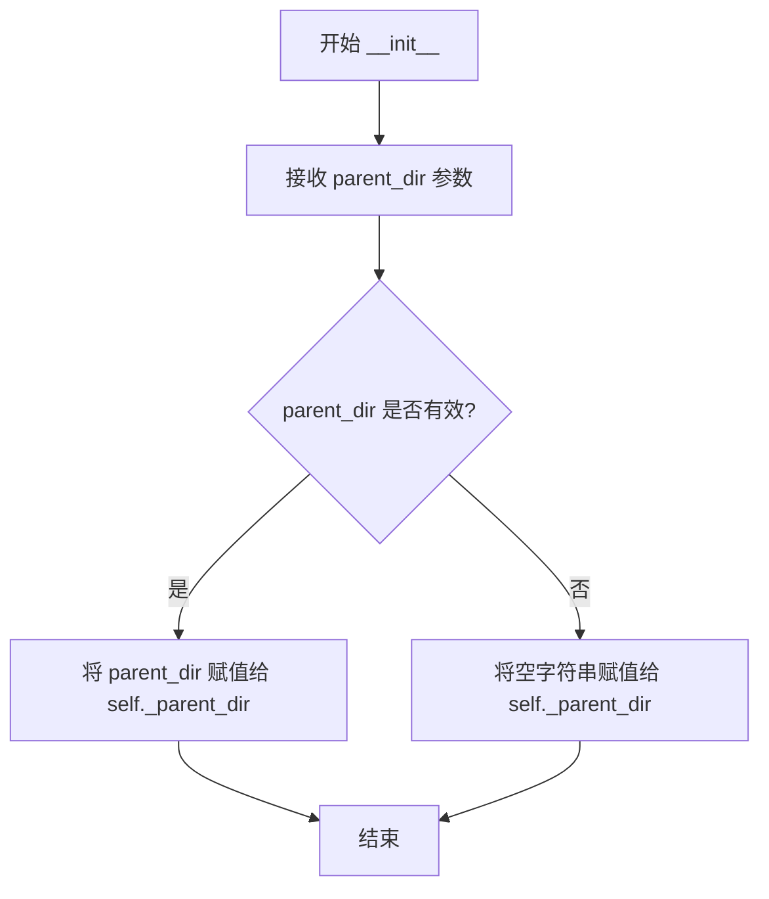
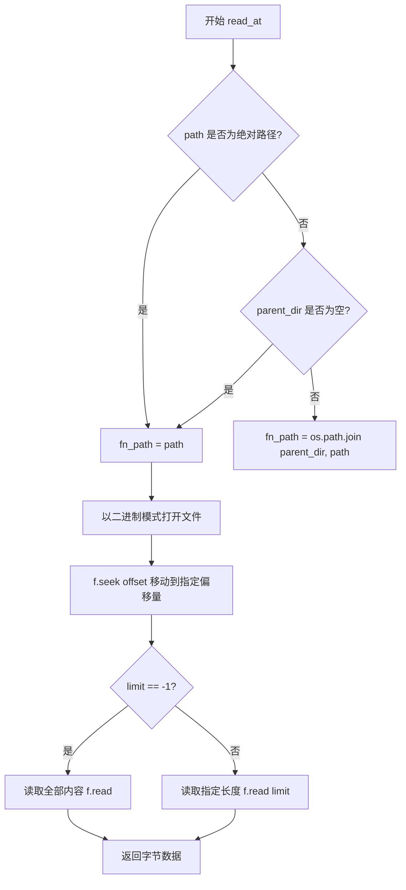
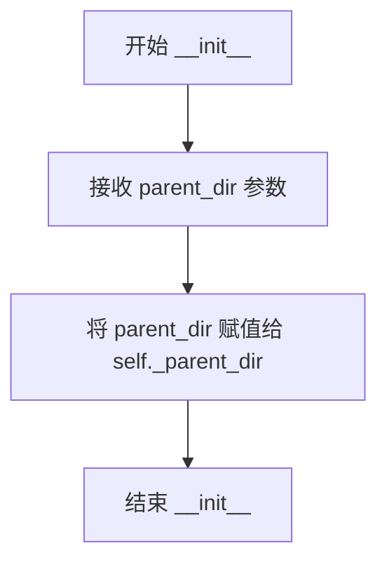

# `MinerU\mineru\data\data_reader_writer\filebase.py` 详细设计文档

该代码提供了基于本地文件系统的数据读写能力。FileBasedDataReader 类实现了从指定文件的特定偏移量和长度读取字节数据的功能；FileBasedDataWriter 类实现了将字节数据写入指定文件并自动创建目录的功能。两者均支持通过父目录参数解析相对路径。

## 整体流程

```mermaid
graph TD
    Start((开始)) --> Client[客户端调用]
    Client --> Type{操作类型}
    Type -->|read_at| Reader[FileBasedDataReader]
    Type -->|write| Writer[FileBasedDataWriter]
    subgraph ReaderFlow
    Reader --> R_Path{路径为绝对路径?}
    R_Path -- 否 --> R_Join[拼接 parent_dir]
    R_Path -- 是 --> R_Keep[保持原路径]
    R_Join --> R_Open[打开文件 (rb)]
    R_Keep --> R_Open
    R_Open --> R_Seek[Seek 到 offset]
    R_Seek --> R_Limit{limit == -1?}
    R_Limit -- 是 --> R_ReadAll[读取全部内容]
    R_Limit -- 否 --> R_ReadPart[读取 limit 字节]
    R_ReadAll --> R_Return[返回 bytes]
    R_ReadPart --> R_Return
    end
    subgraph WriterFlow
    Writer --> W_Path{路径为绝对路径?}
    W_Path -- 否 --> W_Join[拼接 parent_dir]
    W_Path -- 是 --> W_Keep[保持原路径]
    W_Join --> W_Dir{目录是否存在?}
    W_Keep --> W_Dir
    W_Dir -- 否 --> W_Mkdir[创建目录结构]
    W_Dir -- 是 --> W_Open[打开文件 (wb)]
    W_Mkdir --> W_Open
    W_Open --> W_Write[写入 data]
    W_Write --> W_End[结束]
    end
    R_Return --> End((结束))
    W_End --> End
```

## 类结构

```
DataReader (抽象基类)
└── FileBasedDataReader (文件数据读取器)
DataWriter (抽象基类)
└── FileBasedDataWriter (文件数据写入器)
```

## 全局变量及字段


### `FileBasedDataReader._parent_dir`
    
the parent directory that may be used within methods

类型：`str`
    


### `FileBasedDataWriter._parent_dir`
    
the parent directory that may be used within methods

类型：`str`
    
    

## 全局函数及方法


### `FileBasedDataReader.__init__`

构造函数，用于初始化FileBasedDataReader实例，接收可选的父目录参数并将其存储为实例变量。

参数：

- `parent_dir`：`str`，可选参数，父目录路径，在后续方法中可能会与相对路径结合使用。默认为空字符串。

返回值：`None`，构造函数不返回值，仅初始化实例状态。

#### 流程图



#### 带注释源码

```python
def __init__(self, parent_dir: str = ''):
    """Initialized with parent_dir.

    Args:
        parent_dir (str, optional): the parent directory that may be used within methods. Defaults to ''.
    """
    # 将传入的 parent_dir 参数存储为实例变量 _parent_dir
    # 供后续 read_at 方法在处理相对路径时使用
    self._parent_dir = parent_dir
```


### `FileBasedDataReader.read_at`

读取指定文件从指定偏移量开始的指定长度的字节数据，支持相对路径与绝对路径处理。

参数：

- `path`：`str`，文件路径，如果是相对路径，会与 `parent_dir` 拼接
- `offset`：`int`，跳过的字节数，默认为 0
- `limit`：`int`，要读取的字节数，-1 表示读取至文件末尾，默认为 -1

返回值：`bytes`，返回读取到的文件内容字节数据

#### 流程图



#### 带注释源码

```python
def read_at(self, path: str, offset: int = 0, limit: int = -1) -> bytes:
    """Read at offset and limit.

    Args:
        path (str): the path of file, if the path is relative path, it will be joined with parent_dir.
        offset (int, optional): the number of bytes skipped. Defaults to 0.
        limit (int, optional): the length of bytes want to read. Defaults to -1.

    Returns:
        bytes: the content of file
    """
    # 初始化文件路径为传入的 path
    fn_path = path
    # 检查路径是否为绝对路径，如果不是且存在父目录，则拼接完整路径
    if not os.path.isabs(fn_path) and len(self._parent_dir) > 0:
        fn_path = os.path.join(self._parent_dir, path)

    # 以二进制读取模式打开文件
    with open(fn_path, 'rb') as f:
        # 将文件指针移动到指定的偏移位置
        f.seek(offset)
        # 根据 limit 值决定读取策略
        if limit == -1:
            # -1 表示读取从偏移量到文件末尾的所有内容
            return f.read()
        else:
            # 读取指定长度的字节数据
            return f.read(limit)
```


### `FileBasedDataWriter.__init__`

构造函数用于初始化 `FileBasedDataWriter` 实例，将父目录路径存储为实例变量，供后续文件读写操作使用。

参数：

- `parent_dir`：`str`，可选参数，父目录路径，会在后续方法中被用于拼接相对路径，默认为空字符串 `''`

返回值：`None`，构造函数没有返回值

#### 流程图



#### 带注释源码

```python
def __init__(self, parent_dir: str = '') -> None:
    """Initialized with parent_dir.

    Args:
        parent_dir (str, optional): the parent directory that may be used within methods. Defaults to ''.
    """
    # 将传入的 parent_dir 参数存储到实例变量 _parent_dir 中
    # 后续在 write 方法中会使用该变量来拼接相对路径
    self._parent_dir = parent_dir
```


### `FileBasedDataWriter.write`

将数据写入指定文件，支持相对路径转换和自动创建父目录。

参数：

-  `path`：`str`，文件路径，如果是相对路径将与 parent_dir 拼接
-  `data`：`bytes`，要写入的数据

返回值：`None`，无返回值

#### 流程图

```mermaid
flowchart TD
    A([开始]) --> B[接收 path 和 data 参数]
    B --> C{path 是否为绝对路径?}
    C -->|是| D[fn_path = path]
    C -->|否| E{parent_dir 长度 > 0?}
    E -->|是| F[fn_path = os.path.join(parent_dir, path)]
    E -->|否| D
    F --> G{父目录是否存在?}
    G -->|是| H[打开文件并写入数据]
    G -->|否| I[创建父目录]
    I --> H
    H --> J([结束])
    
    style D fill:#e1f5fe
    style F fill:#e1f5fe
    style I fill:#fff3e0
    style H fill:#e8f5e9
```

#### 带注释源码

```python
def write(self, path: str, data: bytes) -> None:
    """Write file with data.

    Args:
        path (str): the path of file, if the path is relative path, it will be joined with parent_dir.
        data (bytes): the data want to write
    """
    # 初始化文件路径为传入的 path
    fn_path = path
    
    # 如果路径不是绝对路径且 parent_dir 不为空，则拼接完整路径
    if not os.path.isabs(fn_path) and len(self._parent_dir) > 0:
        fn_path = os.path.join(self._parent_dir, path)

    # 获取父目录路径
    parent_dir = os.path.dirname(fn_path)
    
    # 如果父目录不存在且不为空，则创建父目录
    if not os.path.exists(parent_dir) and parent_dir != "":
        os.makedirs(parent_dir, exist_ok=True)

    # 以二进制写入模式打开文件并写入数据
    with open(fn_path, 'wb') as f:
        f.write(data)
```


## 关键组件


### FileBasedDataReader

文件数据读取器类，继承自DataReader，用于从文件系统读取二进制数据。支持通过offset和limit参数进行部分数据读取（类似于张量索引的惰性加载特性），同时处理相对路径与父目录的拼接。

### FileBasedDataWriter

文件数据写入器类，继承自DataWriter，用于将二进制数据写入文件系统。自动创建不存在的目录，并处理相对路径与父目录的拼接逻辑。

### parent_dir 管理机制

通过构造函数接收parent_dir参数，在读写文件时将相对路径与父目录拼接，支持绝对路径和相对路径的灵活处理。

### read_at 部分读取方法

支持offset偏移量和limit长度限制的数据读取，实现类似张量索引的惰性加载特性，可用于大文件的分块读取场景。

### write 目录自动创建

在写入文件前自动检查并创建父目录，确保文件写入路径存在，简化调用方的目录管理逻辑。


## 问题及建议


### 已知问题

-   **异常处理不完整**：`read_at` 和 `write` 方法均未处理文件不存在、权限不足、磁盘空间不足等常见 I/O 异常，可能导致程序以不友好的方式崩溃
-   **参数验证缺失**：未对 `path` 为空字符串、`offset` 为负数（除-1外）、`limit` 为其他负数、`data` 非 bytes 类型等情况进行校验
-   **竞态条件风险（TOCTOU）**：`write` 方法中先检查目录是否存在再创建文件，期间存在时间窗口，可能导致多线程环境下创建失败
-   **路径处理逻辑重复**：相对路径与 `parent_dir` 拼接的逻辑在两个类中完全重复，违反 DRY 原则
-   **资源泄漏风险**：如果 `open` 失败，已创建的父目录不会被回滚
-   **功能局限**：大文件读取时无流式处理，可能导致内存占用过高
-   **设计缺陷**：未实现上下文管理器接口，无法使用 `with` 语句统一管理资源

### 优化建议

-   为 `read_at` 和 `write` 添加 try-except 异常处理，捕获 `FileNotFoundError`、`PermissionError`、`OSError` 等异常，并转换为项目统一的异常类型
-   在方法入口处添加参数校验：path 非空、offset >= 0、limit > 0 或 limit == -1、data 为 bytes 类型
-   使用 `os.makedirs(..., exist_ok=True)` 替代先检查再创建的模式，消除竞态条件
-   将路径处理逻辑提取为基类或工具函数，如 `_resolve_path(self, path)` 方法
-   考虑添加大文件的分块读取支持，或提供流式读取接口
-   实现 `__enter__` 和 `__exit__` 方法（或继承自支持上下文管理器的基类），实现 `__iter__` 方法支持迭代读取
-   添加日志记录，便于问题排查和监控


## 其它


### 设计目标与约束

本模块旨在提供基于文件系统的数据读写抽象，封装底层文件操作细节，为上层应用提供统一的字节流读取和写入接口。设计约束包括：仅支持字节类型数据读写，路径处理遵循相对路径与parent_dir拼接逻辑，读取操作支持偏移量和长度限制，写入操作自动创建必要的目录结构。

### 错误处理与异常设计

代码中未显式处理异常，主要依赖Python内置异常机制。IOError/FileNotFoundError会在文件不存在或路径无效时抛出；PermissionError会在无权限操作时抛出；OSError会在磁盘空间不足或路径格式错误时抛出。改进建议：增加异常包装类，区分不同错误类型（如FileNotAccessError、DirectoryCreationError），提供更友好的错误信息和上下文。

### 数据流与状态机

读取流程：接收path、offset、limit参数 → 判断绝对/相对路径 → 拼接完整路径 → 打开文件 → seek到offset → 根据limit值读取全部或指定长度 → 返回bytes。写入流程：接收path和data → 路径处理同读取 → 检查并创建父目录 → 打开文件写入 → 关闭文件。无状态机设计，方法调用为无状态操作。

### 外部依赖与接口契约

依赖项：os标准库模块，base模块中的DataReader和DataWriter抽象基类。接口契约：DataReader.read_at(path, offset, limit)返回bytes；DataWriter.write(path, data)返回None。调用方需确保path参数合法，data为bytes类型，否则可能抛出TypeError。

### 安全性考虑

路径遍历漏洞风险：当前实现直接拼接parent_dir和path，未做路径规范化检查。恶意输入可能导致目录遍历攻击（如path="../../../etc/passwd"）。建议增加路径规范化验证，使用pathlib.Path.resolve()检查最终路径是否在允许目录内。

### 性能考虑

读取大文件时limit=-1会一次性加载全部内容到内存，存在内存溢出风险。写入操作未使用缓冲，频繁小写入效率低。建议：增加流式读取接口、使用buffered IO、考虑异步IO支持。

### 并发与线程安全

代码非线程安全：多个线程同时读写同一文件可能导致数据竞争和文件损坏。改进建议：增加文件锁机制（fcntl.flock或threading.Lock）或在文档中明确说明使用限制。

### 资源管理

使用with语句确保文件正确关闭，但未实现显式的资源清理方法（如close方法）。建议：实现close方法或实现上下文管理器协议（__enter__/__exit__）。

### 测试策略

建议测试用例：正常路径读写、相对路径与parent_dir拼接、绝对路径处理、offset和limit边界值、空文件读取、目录自动创建、大文件读写、并发写入冲突、路径遍历攻击防护、无权限目录操作。

### 配置与扩展性

parent_dir作为构造函数参数，支持运行时配置。扩展建议：支持自定义编码的文本读写、压缩文件支持、加密文件支持、远程文件系统支持（S3、HDFS等）。

### 版本兼容性

代码使用Python 3类型注解（: str、: int、: bytes），需要Python 3.5+。os.path.isabs和os.path.join在Python 2/3兼容，但建议明确Python版本要求为3.6+以支持f-string和pathlib。

### 日志与监控

代码中无日志记录。建议添加：文件操作日志（读取/写入操作记录）、性能监控（操作耗时统计）、错误日志（异常捕获和记录）。

### 部署与环境

无需特殊部署要求，仅需标准Python 3环境。parent_dir建议使用绝对路径，避免相对路径歧义。生产环境需考虑文件存储位置、磁盘配额、权限管理等运维因素。

    