# `MinerU\mineru\data\data_reader_writer\multi_bucket_s3.py` 详细设计文档

该模块实现了支持多S3桶的数据读写功能，通过MultiS3Mixin混合类管理多个S3配置，MultiBucketS3DataReader和MultiBucketS3DataWriter分别提供基于路径自动选择不同桶的读写服务，支持S3路径解析和范围读取。

## 整体流程

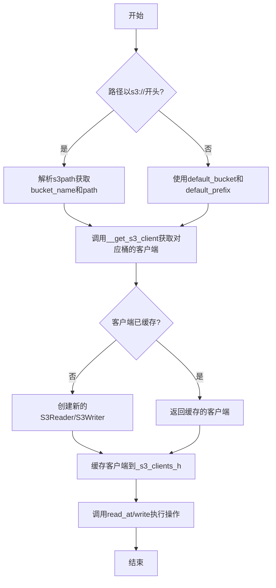

## 类结构

```
MultiS3Mixin (混合类)
├── default_bucket: str
├── default_prefix: str
├── s3_configs: list[S3Config]
└── _s3_clients_h: dict
MultiBucketS3DataReader (数据读取类)
├── 继承自: DataReader, MultiS3Mixin
├── read() -> bytes
├── __get_s3_client() -> S3Reader
└── read_at() -> bytes
MultiBucketS3DataWriter (数据写入类)
├── 继承自: DataWriter, MultiS3Mixin
├── __get_s3_client() -> S3Writer
└── write() -> None
```

## 全局变量及字段


### `MultiS3Mixin.default_bucket`
    
默认S3桶名称

类型：`str`
    


### `MultiS3Mixin.default_prefix`
    
默认路径前缀

类型：`str`
    


### `MultiS3Mixin.s3_configs`
    
S3配置列表

类型：`list[S3Config]`
    


### `MultiS3Mixin._s3_clients_h`
    
S3客户端缓存字典

类型：`dict`
    
    

## 全局函数及方法


### `parse_s3_range_params`

解析 S3 路径中的范围参数（range params），从 URL 查询参数中提取 offset 和 limit 值。

参数：

-  `path`：`str`，S3 文件路径，格式为 `s3://bucket_name/path?offset,limit`

返回值：`list[str] | None`，如果存在有效的范围参数则返回包含 offset 和 limit 的列表，否则返回 `None`

#### 流程图

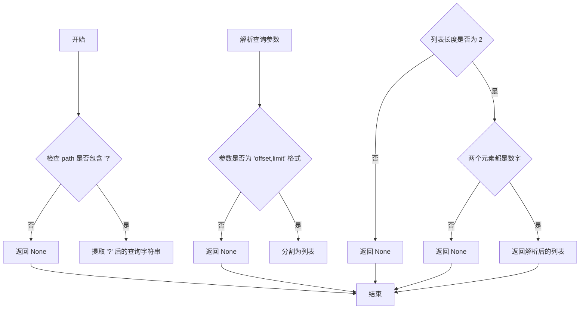

#### 带注释源码

```
def parse_s3_range_params(path: str) -> list[str] | None:
    """解析 S3 路径中的范围参数（range params）。

    从 S3 路径的查询参数中提取 offset 和 limit 值。
    例如：s3://bucket/path?0,100 会返回 ['0', '100']

    Args:
        path (str): S3 文件路径，格式为 s3://bucket_name/path?offset,limit

    Returns:
        list[str] | None: 如果存在有效的范围参数则返回包含 offset 和 limit 
                         的字符串列表，否则返回 None
    """
    # 检查路径是否包含查询参数
    if '?' not in path:
        return None
    
    # 提取查询字符串（'?' 后面的部分）
    query_string = path.split('?', 1)[1]
    
    # 检查是否为 range 参数（格式：offset,limit）
    if ',' not in query_string:
        return None
    
    # 分割参数
    params = query_string.split(',')
    
    # 必须是两个参数（offset 和 limit）
    if len(params) != 2:
        return None
    
    # 验证两个参数都是有效的数字字符串
    # 实际使用中会用 int() 转换，所以这里只做基本验证
    if not params[0].isdigit() or not params[1].isdigit():
        return None
    
    return params
```

#### 备注

该函数的具体实现不在当前代码文件中，而是从 `..utils.path_utils` 模块导入。根据调用方的使用方式可以推断其行为：

```python
# 调用示例
may_range_params = parse_s3_range_params(path)
if may_range_params is None or 2 != len(may_range_params):
    byte_start, byte_len = 0, -1  # 默认读取全部
else:
    byte_start, byte_len = int(may_range_params[0]), int(may_range_params[1])
```


### `parse_s3path`

此函数用于解析 S3 路径，提取出桶名称和对象键（path）。它接受一个包含 `s3://` 前缀的路径字符串，并返回桶名称和剩余路径部分。

注意：该函数在当前代码文件中未定义，是从 `..utils.path_utils` 模块导入的。以下信息基于代码中的使用方式推断。

参数：

-  `path`：`str`，S3 路径，格式为 `s3://bucket_name/key`

返回值：`tuple[str, str]`

-  第一个元素：`str`，桶名称
-  第二个元素：`str`，对象键（key）

#### 流程图

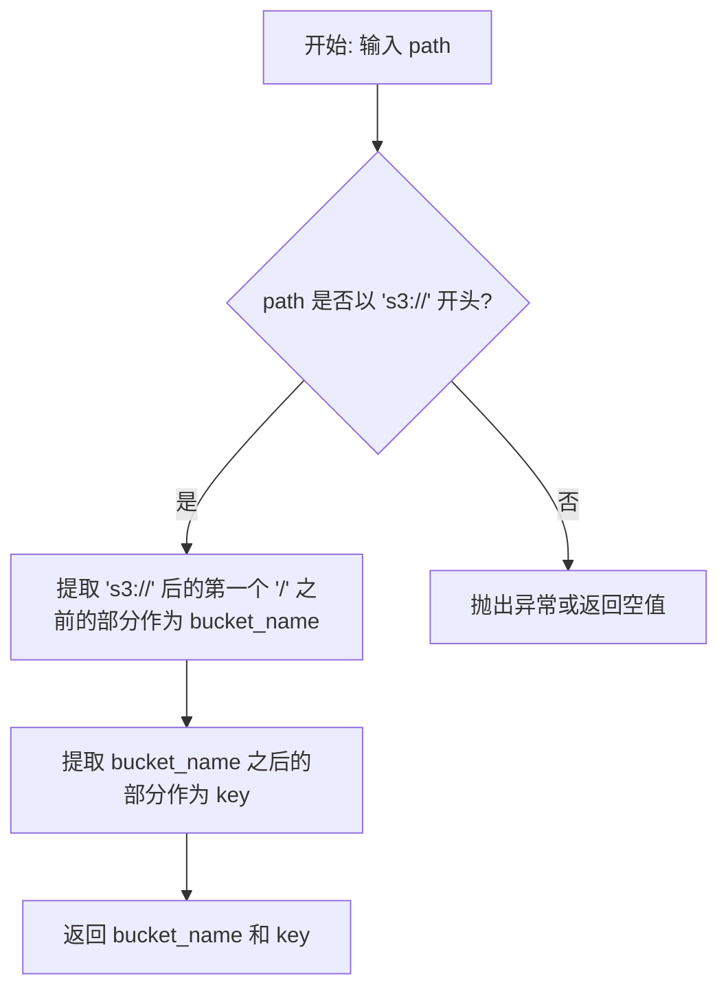

#### 带注释源码

由于该函数定义不在当前代码文件中，无法提供确切源码。以下是基于使用方式的推测实现：

```python
def parse_s3path(path: str) -> tuple[str, str]:
    """Parse S3 path to extract bucket name and key.

    Args:
        path (str): S3 path in format s3://bucket_name/key

    Returns:
        tuple[str, str]: bucket_name and key
    """
    # 移除 's3://' 前缀
    path = path[5:]  # len('s3://') == 5
    
    # 找到第一个 '/' 的位置来分割 bucket_name 和 key
    slash_index = path.find('/')
    
    if slash_index == -1:
        # 如果没有 '/'，则整个字符串是 bucket_name，key 为空
        bucket_name = path
        key = ''
    else:
        bucket_name = path[:slash_index]
        key = path[slash_index + 1:]
    
    return bucket_name, key
```


### `remove_non_official_s3_args`

该函数用于从S3路径中移除非官方的参数（如查询参数），只保留标准的s3://bucket/path格式。

参数：

-  `path`：`str`，需要处理的S3路径，例如 `s3://bucket_name/path?offset,limit`

返回值：`str`，移除非官方参数后的标准S3路径

#### 流程图

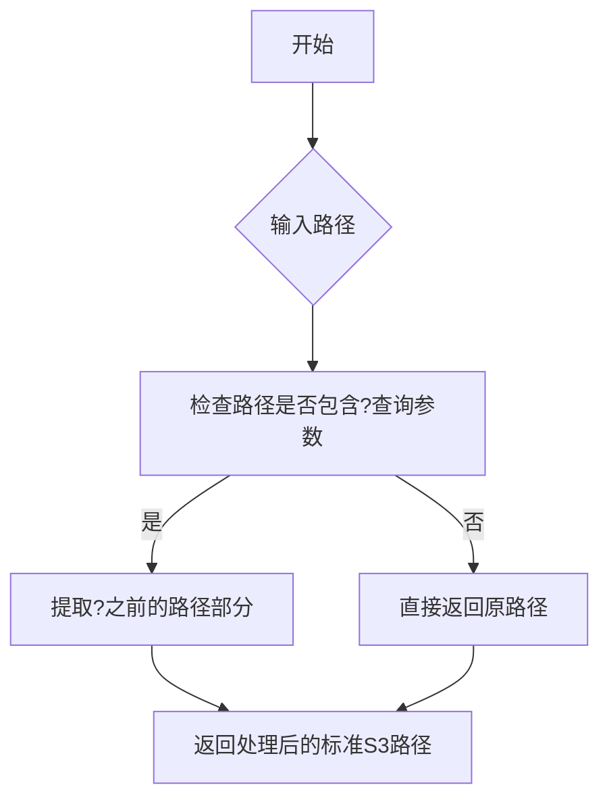

#### 带注释源码

```
# 注：该函数定义不在当前代码文件中，位于 ..utils.path_utils 模块
# 以下为根据使用方式推断的函数签名和功能

def remove_non_official_s3_args(path: str) -> str:
    """Remove non-official S3 arguments from path.
    
    This function is imported from ..utils.path_utils module.
    Based on its usage in the code:
        path = remove_non_official_s3_args(path)
    
    It appears to strip query parameters from S3 paths,
    keeping only the standard s3://bucket/key format.
    
    Args:
        path (str): The S3 path which may contain non-official args,
                   e.g., 's3://bucket_name/path?0,100'
    
    Returns:
        str: The S3 path with non-official args removed,
            e.g., 's3://bucket_name/path'
    """
    # Function definition not provided in the current code snippet
    # Implementation exists in ..utils.path_utils module
    pass
```

---

**注意**：该函数的实际实现代码未在提供的代码片段中显示，仅存在于导入来源 `..utils.path_utils` 模块中。以上信息是根据函数的导入语句和使用方式推断得出。


### `MultiBucketS3DataReader.read`

该方法用于从S3读取文件，支持根据URL中的范围参数（offset,limit）进行范围读取，并根据bucket名称选择对应的S3客户端。

参数：

- `path`：`str`，S3文件路径，格式为 s3://bucket_name/path?offset,limit，例如 s3://bucket_name/path?0,100

返回值：`bytes`，S3文件的内容

#### 流程图

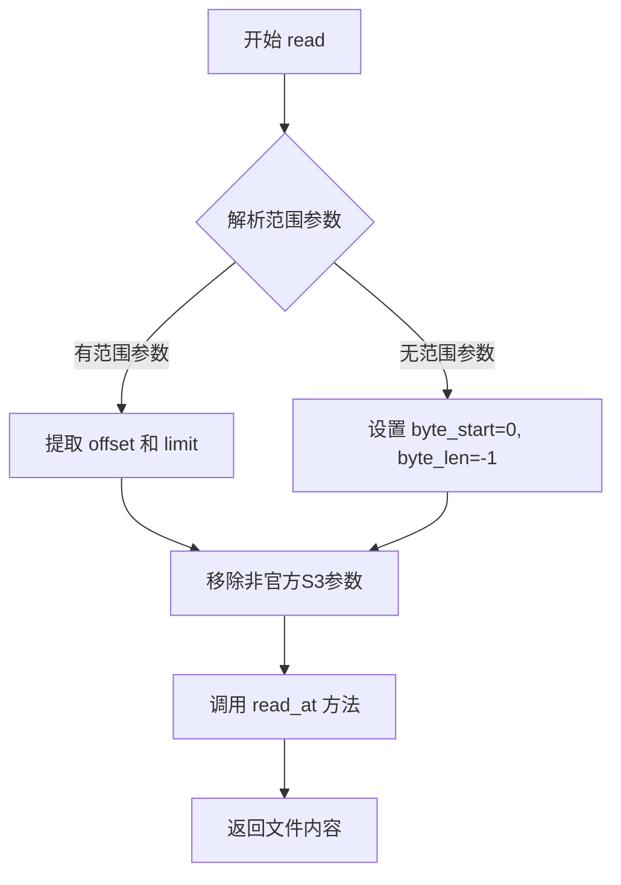

#### 带注释源码

```python
def read(self, path: str) -> bytes:
    """Read the path from s3, select diffect bucket client for each request
    based on the bucket, also support range read.

    Args:
        path (str): the s3 path of file, the path must be in the format of s3://bucket_name/path?offset,limit.
        for example: s3://bucket_name/path?0,100.

    Returns:
        bytes: the content of s3 file.
    """
    # 解析path中的范围参数（offset,limit）
    may_range_params = parse_s3_range_params(path)
    # 检查是否有效范围参数（必须恰好2个元素：start和length）
    if may_range_params is None or 2 != len(may_range_params):
        # 无效范围参数则从头开始读取全部内容
        byte_start, byte_len = 0, -1
    else:
        # 有效范围参数则转换为整数
        byte_start, byte_len = int(may_range_params[0]), int(may_range_params[1])
    # 移除path中的非官方S3参数（如offset,limit查询参数）
    path = remove_non_official_s3_args(path)
    # 调用read_at执行实际读取
    return self.read_at(path, byte_start, byte_len)
```


### `MultiBucketS3DataReader.read_at`

该方法是`MultiBucketS3DataReader`类的核心读取方法，支持从S3读取文件并指定偏移量和读取长度。它根据路径中的bucket名称动态选择对应的S3客户端，对于相对路径则使用默认bucket和前缀，最终调用底层S3客户端的`read_at`方法完成数据读取。

参数：

- `path`：`str`，要读取的文件路径，可以是完整的s3://bucket/path格式或相对路径
- `offset`：`int`，可选参数，表示跳过的字节数，默认为0
- `limit`：`int`，可选参数，表示要读取的字节数，默认为-1（表示无限长度）

返回值：`bytes`，返回读取到的文件内容

#### 流程图

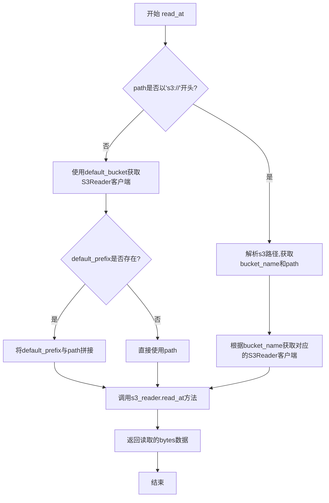

#### 带注释源码

```python
def read_at(self, path: str, offset: int = 0, limit: int = -1) -> bytes:
    """Read the file with offset and limit, select diffect bucket client
    for each request based on the bucket.

    Args:
        path (str): the file path.
        offset (int, optional): the number of bytes skipped. Defaults to 0.
        limit (int, optional): the number of bytes want to read. Defaults to -1 which means infinite.

    Returns:
        bytes: the file content.
    """
    # 判断路径是否为完整的s3://协议路径
    if path.startswith('s3://'):
        # 解析s3路径，提取bucket名称和实际文件路径
        bucket_name, path = parse_s3path(path)
        # 根据解析出的bucket名称获取对应的S3客户端
        s3_reader = self.__get_s3_client(bucket_name)
    else:
        # 对于相对路径，使用默认配置的bucket
        s3_reader = self.__get_s3_client(self.default_bucket)
        # 如果配置了默认前缀，则将其与路径拼接
        if self.default_prefix:
            path = self.default_prefix + '/' + path
    
    # 调用底层S3Reader客户端的read_at方法执行实际读取
    return s3_reader.read_at(path, offset, limit)
```


### `MultiBucketS3DataWriter.write`

该方法负责将数据写入S3存储，支持多Bucket配置，根据传入的path自动选择对应的S3客户端进行写入操作。

参数：

- `path`：`str`，文件路径，如果路径是相对路径，将与父目录连接；如果路径以s3://开头，则从路径中解析bucket名称
- `data`：`bytes`，要写入的数据内容

返回值：`None`，无返回值（尽管内部调用了S3Writer的write方法并返回结果，但方法签名声明返回None）

#### 流程图

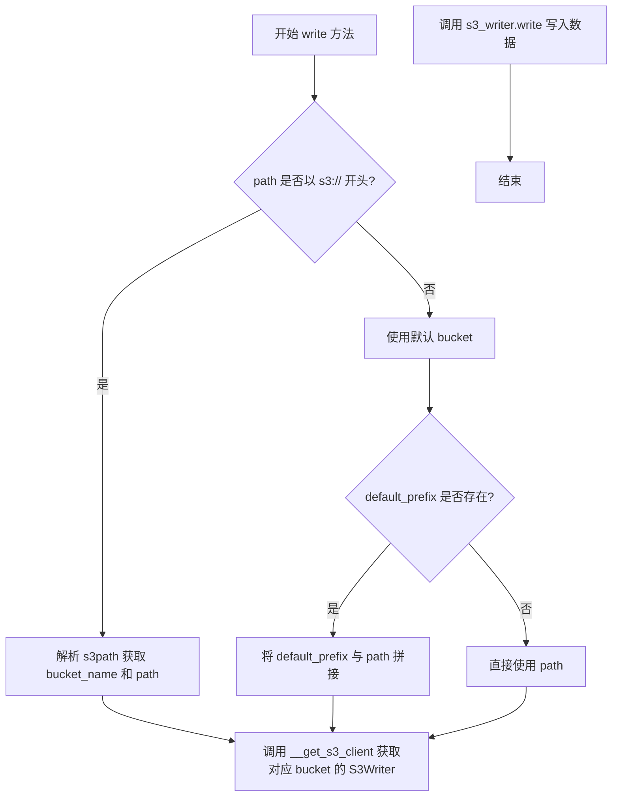

#### 带注释源码

```python
def write(self, path: str, data: bytes) -> None:
    """Write file with data, also select diffect bucket client for each
    request based on the bucket.

    Args:
        path (str): the path of file, if the path is relative path, it will be joined with parent_dir.
        data (bytes): the data want to write.
    """
    # 判断路径是否为S3格式（以s3://开头）
    if path.startswith('s3://'):
        # 解析S3路径，提取bucket名称和实际文件路径
        bucket_name, path = parse_s3path(path)
        # 根据bucket名称获取对应的S3客户端
        s3_writer = self.__get_s3_client(bucket_name)
    else:
        # 使用默认配置的bucket
        s3_writer = self.__get_s3_client(self.default_bucket)
        # 如果存在默认前缀，则将前缀与路径拼接
        if self.default_prefix:
            path = self.default_prefix + '/' + path
    
    # 调用S3Writer执行实际的写入操作
    return s3_writer.write(path, data)
```


### MultiBucketS3DataReader.__get_s3_client

该方法用于根据传入的 bucket_name 获取对应的 S3Reader 客户端实例。如果客户端已存在则直接返回，否则创建新客户端并缓存以供复用。

参数：

- `bucket_name`：`str`，S3 存储桶的名称

返回值：`S3Reader`，用于读取 S3 数据的客户端实例

#### 流程图


#### 带注释源码

```python
def __get_s3_client(self, bucket_name: str):
    """获取或创建 S3Reader 客户端实例。

    Args:
        bucket_name (str): S3 存储桶名称

    Returns:
        S3Reader: 用于读取 S3 数据的客户端实例

    Raises:
        InvalidParams: 当 bucket_name 不在 s3_configs 中时抛出
    """
    # 验证 bucket_name 是否在已配置的 s3_configs 中
    if bucket_name not in set([conf.bucket_name for conf in self.s3_configs]):
        raise InvalidParams(
            f'bucket name: {bucket_name} not found in s3_configs: {self.s3_configs}'
        )
    
    # 检查缓存中是否已存在该 bucket 的客户端
    if bucket_name not in self._s3_clients_h:
        # 从配置列表中查找对应的 S3 配置
        conf = next(
            filter(lambda conf: conf.bucket_name == bucket_name, self.s3_configs)
        )
        # 创建新的 S3Reader 实例并缓存
        self._s3_clients_h[bucket_name] = S3Reader(
            bucket_name,
            conf.access_key,
            conf.secret_key,
            conf.endpoint_url,
            conf.addressing_style,
        )
    
    # 返回缓存中的 S3Reader 客户端
    return self._s3_clients_h[bucket_name]
```

---

### MultiBucketS3DataWriter.__get_s3_client

该方法用于根据传入的 bucket_name 获取对应的 S3Writer 客户端实例。如果客户端已存在则直接返回，否则创建新客户端并缓存以供复用。

参数：

- `bucket_name`：`str`，S3 存储桶的名称

返回值：`S3Writer`，用于写入 S3 数据的客户端实例

#### 流程图

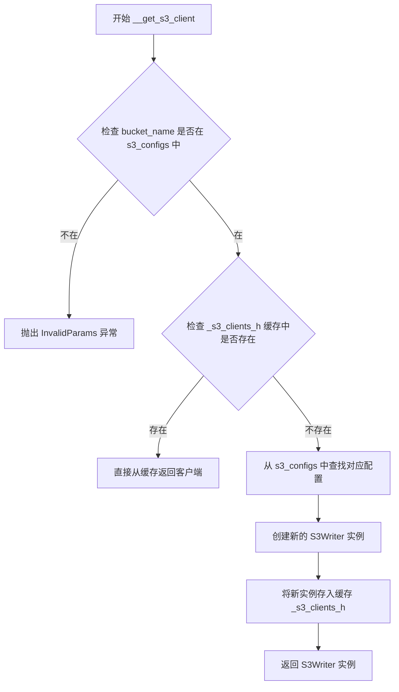

#### 带注释源码

```python
def __get_s3_client(self, bucket_name: str):
    """获取或创建 S3Writer 客户端实例。

    Args:
        bucket_name (str): S3 存储桶名称

    Returns:
        S3Writer: 用于写入 S3 数据的客户端实例

    Raises:
        InvalidParams: 当 bucket_name 不在 s3_configs 中时抛出
    """
    # 验证 bucket_name 是否在已配置的 s3_configs 中
    if bucket_name not in set([conf.bucket_name for conf in self.s3_configs]):
        raise InvalidParams(
            f'bucket name: {bucket_name} not found in s3_configs: {self.s3_configs}'
        )
    
    # 检查缓存中是否已存在该 bucket 的客户端
    if bucket_name not in self._s3_clients_h:
        # 从配置列表中查找对应的 S3 配置
        conf = next(
            filter(lambda conf: conf.bucket_name == bucket_name, self.s3_configs)
        )
        # 创建新的 S3Writer 实例并缓存
        self._s3_clients_h[bucket_name] = S3Writer(
            bucket_name,
            conf.access_key,
            conf.secret_key,
            conf.endpoint_url,
            conf.addressing_style,
        )
    
    # 返回缓存中的 S3Writer 客户端
    return self._s3_clients_h[bucket_name]
```


### `MultiS3Mixin.__init__`

该方法用于初始化多S3配置混合类，解析默认前缀提取默认存储桶，验证配置列表中的存储桶名称唯一性，并确保默认存储桶配置存在。

参数：

- `default_prefix`：`str`，默认前缀路径，格式为 `{bucket}/{prefix}` 或仅 `{bucket}`
- `s3_configs`：`list[S3Config]`，S3配置对象列表，每个配置包含存储桶名称、访问密钥、秘密密钥、端点URL和寻址样式

返回值：`None`，构造函数无返回值

#### 流程图

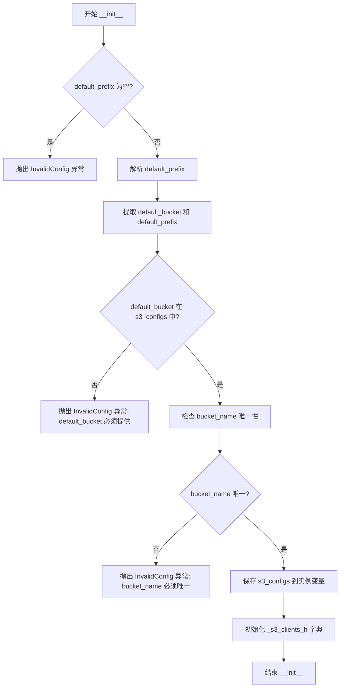

#### 带注释源码

```python
def __init__(self, default_prefix: str, s3_configs: list[S3Config]):
    """Initialized with multiple s3 configs.

    Args:
        default_prefix (str): the default prefix of the relative path. 
                              for example, {some_bucket}/{some_prefix} or {some_bucket}
        s3_configs (list[S3Config]): list of s3 configs, the bucket_name must be unique 
                                     in the list.

    Raises:
        InvalidConfig: default bucket config not in s3_configs.
        InvalidConfig: bucket name not unique in s3_configs.
        InvalidConfig: default bucket must be provided.
    """
    # 步骤1: 验证 default_prefix 不为空
    if len(default_prefix) == 0:
        raise InvalidConfig('default_prefix must be provided')

    # 步骤2: 解析 default_prefix，提取默认存储桶和前缀
    # 例如: "mybucket/myprefix" -> bucket="mybucket", prefix="myprefix"
    # 例如: "mybucket" -> bucket="mybucket", prefix=""
    arr = default_prefix.strip('/').split('/')
    self.default_bucket = arr[0]  # 提取存储桶名称
    self.default_prefix = '/'.join(arr[1:])  # 提取前缀路径

    # 步骤3: 验证默认存储桶配置是否存在于 s3_configs 中
    found_default_bucket_config = False
    for conf in s3_configs:
        if conf.bucket_name == self.default_bucket:
            found_default_bucket_config = True
            break

    if not found_default_bucket_config:
        raise InvalidConfig(
            f'default_bucket: {self.default_bucket} config must be provided in s3_configs: {s3_configs}'
        )

    # 步骤4: 验证 s3_configs 中的 bucket_name 是否唯一
    uniq_bucket = set([conf.bucket_name for conf in s3_configs])
    if len(uniq_bucket) != len(s3_configs):
        raise InvalidConfig(
            f'the bucket_name in s3_configs: {s3_configs} must be unique'
        )

    # 步骤5: 保存配置并初始化客户端缓存字典
    self.s3_configs = s3_configs
    self._s3_clients_h: dict = {}  # 用于缓存 S3 客户端实例
```


### `MultiBucketS3DataReader.read`

该方法是MultiBucketS3DataReader类的核心读取方法，支持从多个S3存储桶读取文件，并能够解析S3路径中的范围参数（offset和limit）来实现部分字节读取。

参数：

- `path`：`str`，S3文件路径，支持格式 `s3://bucket_name/path?offset,limit`，例如 `s3://bucket_name/path?0,100`

返回值：`bytes`，返回S3文件的完整内容

#### 流程图

```mermaid
flowchart TD
    A[开始 read] --> B[调用 parse_s3_range_params 解析路径]
    B --> C{范围参数存在且长度为2?}
    C -->|是| D[byte_start = int(params[0])<br/>byte_len = int(params[1])]
    C -->|否| E[byte_start = 0<br/>byte_len = -1]
    D --> F
    E --> F[调用 remove_non_official_s3_args 清理路径]
    F --> G[调用 read_at 方法]
    G --> H[返回 bytes 数据]
```

#### 带注释源码

```python
def read(self, path: str) -> bytes:
    """Read the path from s3, select diffect bucket client for each request
    based on the bucket, also support range read.

    Args:
        path (str): the s3 path of file, the path must be in the format of s3://bucket_name/path?offset,limit.
        for example: s3://bucket_name/path?0,100.

    Returns:
        bytes: the content of s3 file.
    """
    # 步骤1: 解析S3路径中的范围参数（offset和limit）
    # 例如: s3://bucket/path?0,100 -> may_range_params = ['0', '100']
    may_range_params = parse_s3_range_params(path)
    
    # 步骤2: 判断是否存在有效的范围参数
    # 如果没有范围参数或参数数量不为2，则读取整个文件
    if may_range_params is None or 2 != len(may_range_params):
        byte_start, byte_len = 0, -1  # -1 表示读取到文件末尾
    else:
        # 步骤3: 解析起始字节位置和读取长度
        byte_start, byte_len = int(may_range_params[0]), int(may_range_params[1])
    
    # 步骤4: 移除路径中的非官方S3参数，只保留纯净的s3://bucket/key路径
    path = remove_non_official_s3_args(path)
    
    # 步骤5: 调用内部方法 read_at 执行实际读取操作
    # 该方法会根据bucket名称选择对应的S3客户端
    return self.read_at(path, byte_start, byte_len)
```


### `MultiBucketS3DataReader.__get_s3_client`

该方法用于获取指定bucket对应的S3Reader客户端实例，采用懒加载模式（延迟初始化），仅在首次请求某个bucket时创建S3Reader实例，并缓存以复用，提高性能和资源利用率。

参数：

- `bucket_name`：`str`，要获取S3客户端的bucket名称

返回值：`S3Reader`，返回对应bucket的S3Reader实例

#### 流程图

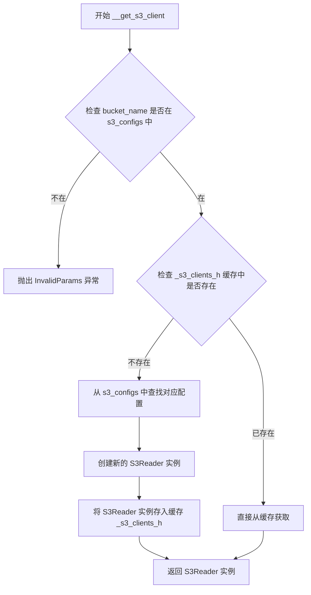

#### 带注释源码

```python
def __get_s3_client(self, bucket_name: str):
    """获取指定bucket的S3Reader实例，使用懒加载模式缓存复用
    
    该方法采用双重检查锁定模式：
    1. 首先验证bucket_name是否在配置列表中，不存在则抛出异常
    2. 然后检查是否已有缓存的客户端，有则直接返回，无则创建并缓存
    
    Args:
        bucket_name (str): 要获取S3客户端的bucket名称
        
    Returns:
        S3Reader: 对应bucket的S3Reader实例
        
    Raises:
        InvalidParams: bucket_name不在s3_configs配置列表中
    """
    # 步骤1：验证bucket名称是否在配置列表中
    if bucket_name not in set([conf.bucket_name for conf in self.s3_configs]):
        raise InvalidParams(
            f'bucket name: {bucket_name} not found in s3_configs: {self.s3_configs}'
        )
    
    # 步骤2：检查缓存中是否已存在该bucket的客户端
    if bucket_name not in self._s3_clients_h:
        # 步骤2.1：从配置列表中查找对应的S3配置
        conf = next(
            filter(lambda conf: conf.bucket_name == bucket_name, self.s3_configs)
        )
        # 步骤2.2：创建新的S3Reader实例
        self._s3_clients_h[bucket_name] = S3Reader(
            bucket_name,
            conf.access_key,
            conf.secret_key,
            conf.endpoint_url,
            conf.addressing_style,
        )
    
    # 步骤3：返回缓存的或新创建的S3Reader实例
    return self._s3_clients_h[bucket_name]
```


### `MultiBucketS3DataReader.read_at`

该方法是 `MultiBucketS3DataReader` 类的核心读取方法，负责从 S3 存储中读取文件内容。它支持指定字节偏移量（offset）和读取长度（limit），并能根据传入的路径是绝对 S3 路径还是相对路径，动态地选择相应的 S3 客户端（Bucket）进行数据读取。

参数：

-  `path`：`str`，要读取的文件路径。如果是 "s3://bucket/key" 格式，则从指定 bucket 读取；否则使用默认 bucket 和前缀。
-  `offset`：`int`，可选，默认为 0，表示从文件起始位置跳过的字节数。
-  `limit`：`int`，可选，默认为 -1，表示要读取的字节数。-1 表示读取到文件末尾。

返回值：`bytes`，返回从 S3 读取到的文件二进制内容。

#### 流程图

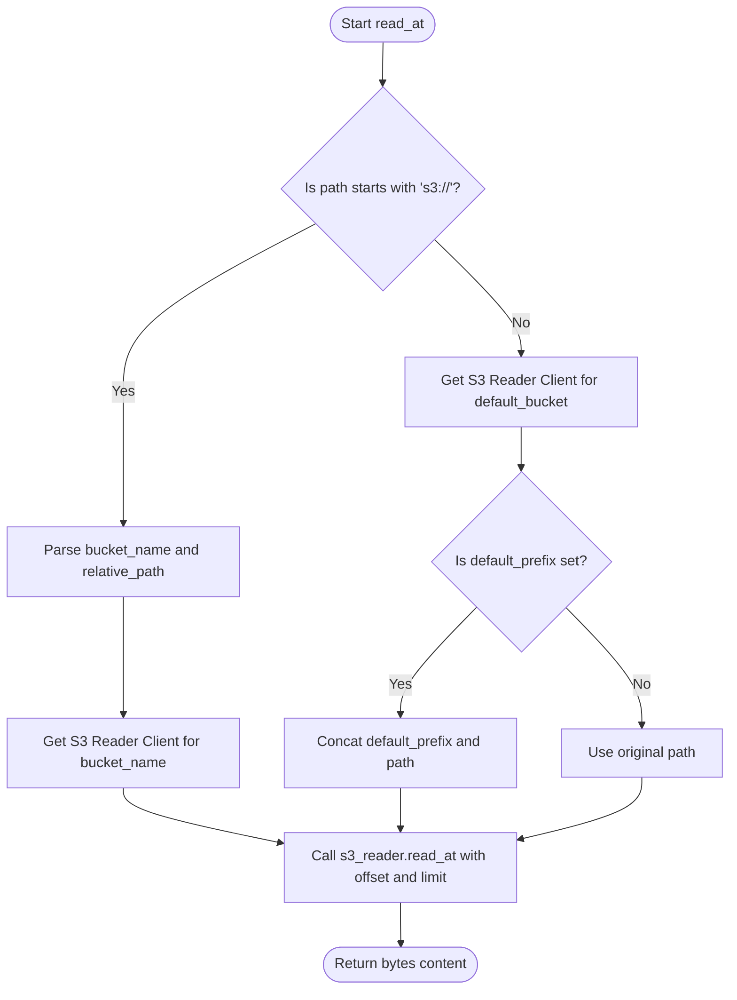

#### 带注释源码

```python
def read_at(self, path: str, offset: int = 0, limit: int = -1) -> bytes:
    """Read the file with offset and limit, select diffect bucket client
    for each request based on the bucket.

    Args:
        path (str): the file path.
        offset (int, optional): the number of bytes skipped. Defaults to 0.
        limit (int, optional): the number of bytes want to read. Defaults to -1 which means infinite.

    Returns:
        bytes: the file content.
    """
    # 判断路径是否为绝对 S3 路径 (s3://bucket/...)
    if path.startswith('s3://'):
        # 解析出 bucket 名称和去掉前缀的路径
        bucket_name, path = parse_s3path(path)
        # 根据解析出的 bucket 名称获取对应的 S3 客户端
        s3_reader = self.__get_s3_client(bucket_name)
    else:
        # 使用默认的 bucket 获取 S3 客户端
        s3_reader = self.__get_s3_client(self.default_bucket)
        # 如果配置了默认前缀，则将前缀拼接到路径前面
        if self.default_prefix:
            path = self.default_prefix + '/' + path
    
    # 调用底层 S3 客户端的 read_at 方法执行实际读取
    return s3_reader.read_at(path, offset, limit)
```


### `MultiBucketS3DataWriter.__get_s3_client`

获取指定 bucket 对应的 S3Writer 客户端实例，如果该 bucket 的客户端不存在则创建并缓存。

参数：

- `bucket_name`：`str`，S3 存储桶的名称

返回值：`S3Writer`，返回 S3 写入器客户端实例

#### 流程图

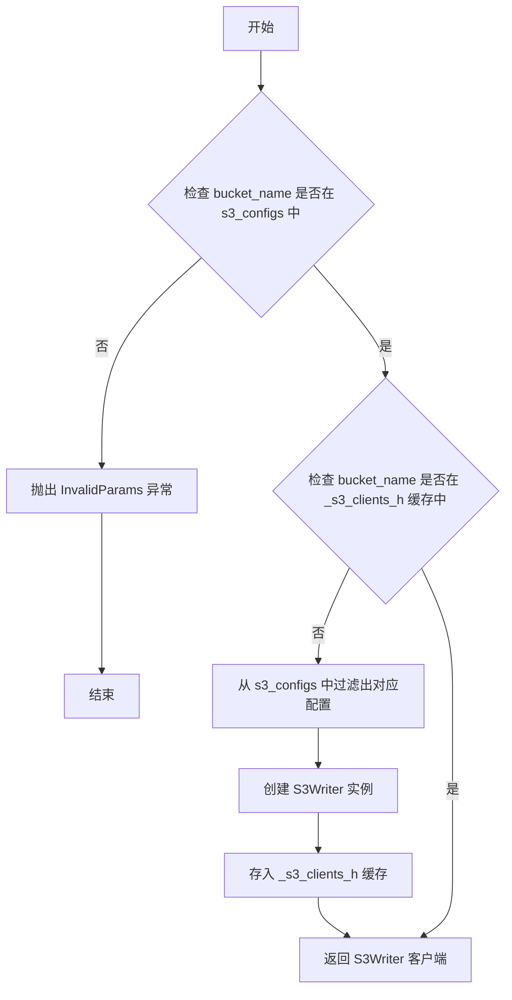

#### 带注释源码

```python
def __get_s3_client(self, bucket_name: str):
    """获取指定 bucket 的 S3Writer 客户端实例。

    Args:
        bucket_name (str): S3 存储桶名称

    Returns:
        S3Writer: S3 写入器客户端实例

    Raises:
        InvalidParams: 当 bucket_name 不在 s3_configs 中时抛出
    """
    # 检查传入的 bucket_name 是否在配置的 s3_configs 中
    if bucket_name not in set([conf.bucket_name for conf in self.s3_configs]):
        # 如果 bucket 不存在，抛出参数无效异常
        raise InvalidParams(
            f'bucket name: {bucket_name} not found in s3_configs: {self.s3_configs}'
        )
    
    # 检查该 bucket 的客户端是否已经存在于缓存中
    if bucket_name not in self._s3_clients_h:
        # 从配置列表中过滤出对应的 S3Config 配置
        conf = next(
            filter(lambda conf: conf.bucket_name == bucket_name, self.s3_configs)
        )
        # 创建新的 S3Writer 实例
        self._s3_clients_h[bucket_name] = S3Writer(
            bucket_name,
            conf.access_key,
            conf.secret_key,
            conf.endpoint_url,
            conf.addressing_style,
        )
    
    # 返回缓存的或新创建的 S3Writer 客户端
    return self._s3_clients_h[bucket_name]
```


### `MultiBucketS3DataWriter.write`

该方法用于将数据写入S3存储，根据传入的路径自动选择对应的S3存储桶客户端，支持绝对路径（s3://bucket/...格式）和相对路径（默认存储桶）。

参数：

- `path`：`str`，文件路径，支持绝对路径（s3://bucket_name/key）或相对路径（相对于default_prefix）
- `data`：`bytes`，要写入的二进制数据内容

返回值：`None`，无返回值，直接写入数据到S3

#### 流程图

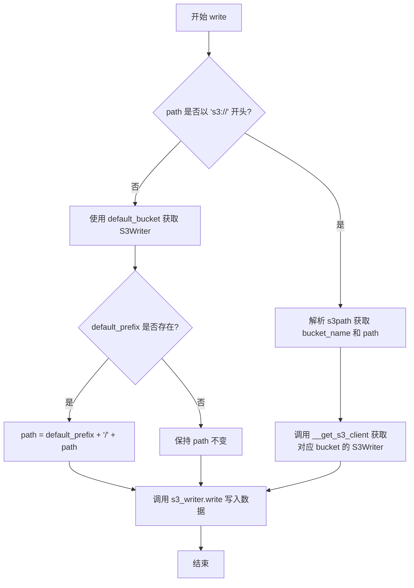

#### 带注释源码

```python
def write(self, path: str, data: bytes) -> None:
    """Write file with data, also select diffect bucket client for each
    request based on the bucket.

    Args:
        path (str): the path of file, if the path is relative path, it will be joined with parent_dir.
        data (bytes): the data want to write.
    """
    # 判断是否为绝对S3路径（s3://bucket/...格式）
    if path.startswith('s3://'):
        # 解析S3路径，提取bucket名称和实际文件路径
        bucket_name, path = parse_s3path(path)
        # 根据bucket名称获取对应的S3写客户端
        s3_writer = self.__get_s3_client(bucket_name)
    else:
        # 使用默认bucket的S3客户端
        s3_writer = self.__get_s3_client(self.default_bucket)
        # 如果存在默认前缀，则拼接路径
        if self.default_prefix:
            path = self.default_prefix + '/' + path
    
    # 调用底层S3Writer执行实际写入操作
    return s3_writer.write(path, data)
```

## 关键组件


### MultiS3Mixin

提供多S3存储桶配置的混入类，支持动态初始化多个S3配置、验证bucket唯一性、缓存S3客户端，并通过default_prefix实现相对路径的默认bucket映射。

### MultiBucketS3DataReader

继承DataReader和MultiS3Mixin的多bucket S3数据读取器，支持从不同bucket读取文件、通过URL参数实现范围读取(range read)、动态选择bucket客户端进行读取操作。

### MultiBucketS3DataWriter

继承DataWriter和MultiS3Mixin的多bucket S3数据写入器，支持向不同bucket写入文件、动态选择bucket客户端进行写入操作，并根据default_prefix处理相对路径。

### S3客户端缓存机制

使用`_s3_clients_h`字典缓存已创建的S3Reader/S3Writer实例，避免重复创建连接，提高性能和资源利用率。

### 路径解析与范围读取支持

通过`parse_s3_range_params`、`parse_s3path`和`remove_non_official_s3_args`工具函数，支持解析s3://bucket/path?offset,limit格式的范围读取请求。

### 配置验证逻辑

在MultiS3Mixin.__init__中实现严格的配置验证，包括default_prefix非空检查、默认bucket配置存在性检查、bucket名称唯一性检查。

## 问题及建议


### 已知问题

-   **代码重复**: `MultiBucketS3DataReader` 和 `MultiBucketS3DataWriter` 中的 `__get_s3_client` 方法实现完全相同，造成代码冗余，未利用 Mixin 的复用优势
-   **Mixin 初始化依赖风险**: `MultiS3Mixin` 在 `__init__` 中初始化 `self._s3_clients_h`，子类若不调用 `super().__init__()` 会导致属性不存在错误，且 Python MRO 顺序不当可能导致初始化被跳过
-   **S3 客户端缓存无失效机制**: `_s3_clients_h` 字典缓存 S3 客户端，但无客户端过期、重新初始化或资源释放机制，长期运行可能导致连接泄漏
-   **配置查询效率低下**: `__get_s3_client` 中每次都使用 `set([conf.bucket_name for conf in self.s3_configs])` 创建新集合进行成员检查，时间复杂度 O(n)，且使用 `filter` + `next` 查找配置也是 O(n)
-   **线程安全问题**: 多线程环境下对 `_s3_clients_h` 字典的读写操作无锁保护，可能产生竞态条件导致客户端创建冲突或数据不一致
-   **类型注解不完整**: `__get_s3_client` 方法在两个类中重复定义但返回类型未标注，mixin 中 `s3_configs` 使用 Python 3.9+ 列表语法但未做版本兼容说明
-   **缺少重试与超时机制**: S3 读写操作未包含重试逻辑和超时配置，网络异常时直接失败
-   **默认参数风险**: `read_at` 方法中 `limit` 默认值为 `-1` 表示无限读取，但 S3 原生不支持这种语义，可能导致预期外的行为

### 优化建议

-   **抽取公共方法**: 将 `__get_s3_client` 提升至 `MultiS3Mixin` 中实现，或创建独立的 S3 客户端工厂类
-   **优化配置查找**: 在初始化时将 `s3_configs` 转换为字典 `bucket_name -> config`，将 O(n) 查找降为 O(1)
-   **添加线程安全**: 使用 `threading.Lock` 保护 `_s3_clients_h` 的读写，或使用线程安全的数据结构
-   **完善 Mixin 设计**: 考虑使用抽象方法约束子类实现，或提供 `get_client` 抽象接口由 mixin 实现具体逻辑
-   **添加客户端生命周期管理**: 实现客户端缓存大小限制、过期淘汰机制或显式的 `close()` 方法释放资源
-   **统一错误处理**: 封装 S3 操作的重试逻辑，配置合理的超时时间和重试策略
-   **补充类型注解**: 为 `__get_s3_client` 添加返回类型 `-> S3Reader` / `-> S3Writer`，确保类型安全

## 其它


### 设计目标与约束

支持多S3存储桶的读写操作，通过统一的接口访问不同的S3存储桶，简化多桶场景下的文件操作。约束条件包括：所有s3_configs中的bucket_name必须唯一；default_prefix对应的default_bucket必须存在于s3_configs中；仅支持s3://协议或相对路径（相对路径使用默认桶）；范围读取时offset和limit参数需要合法。

### 错误处理与异常设计

InvalidConfig异常：用于配置错误场景，包括default_prefix为空、default_bucket不在s3_configs中、bucket_name不唯一。InvalidParams异常：用于运行时参数错误，包括请求的bucket_name不在s3_configs中。S3操作异常：底层S3Reader和S3Writer的异常会直接向上传播。参数解析异常：parse_s3_range_params返回None或长度不为2时，使用默认的range参数（0, -1）。

### 数据流与状态机

读取流程：用户调用read(path) -> 解析range参数 -> 解析s3path获取bucket和key -> 调用__get_s3_client获取对应bucket的reader -> 调用read_at执行实际读取。写入流程：用户调用write(path, data) -> 解析s3path获取bucket和key -> 调用__get_s3_client获取对应bucket的writer -> 调用write执行实际写入。状态转换：_s3_clients_h字典缓存S3客户端，首次访问时创建，后续复用。

### 外部依赖与接口契约

依赖模块：DataReader和DataWriter（base.py中的抽象基类）；S3Reader和S3Writer（io.s3模块）；S3Config（utils.schemas）；parse_s3_range_params、parse_s3path、remove_non_official_s3_args（utils.path_utils）；InvalidConfig和InvalidParams（utils.exceptions）。接口契约：DataReader.read()返回bytes类型；DataWriter.write()返回None；MultiS3Mixin.__init__接收default_prefix(str)和s3_configs(list[S3Config])参数。

### 性能考虑

S3客户端缓存：__get_s3_client方法使用_s3_clients_h字典缓存已创建的S3Reader/S3Writer实例，避免重复创建连接。范围读取优化：支持byte_start和byte_len参数，可实现部分内容读取，减少网络传输量。Bucket名称查询优化：每次请求都遍历s3_configs列表查找对应配置，可考虑使用字典缓存配置以提升性能。

### 安全性考虑

凭证管理：S3配置中的access_key和secret_key应通过安全的方式注入，避免硬编码或明文存储。路径遍历防护：write方法中直接拼接default_prefix和path，理论上存在路径遍历风险，需确保path参数经过校验。敏感信息日志：异常信息中可能包含bucket_name等配置信息，应注意日志脱敏处理。

### 测试策略

单元测试：针对MultiS3Mixin.__init__进行配置验证测试；针对read和write方法进行单桶/多桶场景测试；针对范围参数解析进行边界条件测试。集成测试：测试与实际S3服务的连接（可使用mock或本地模拟S3）；测试多桶切换和客户端复用逻辑。异常场景测试：测试非法bucket_name、invalid配置、空default_prefix等异常情况。

### 配置管理

S3Config结构：应包含bucket_name、access_key、secret_key、endpoint_url、addressing_style字段。default_prefix格式：支持{bucket_name}或{bucket_name}/{prefix}两种格式，代码会自动解析分离bucket和prefix。建议使用环境变量或配置中心管理敏感凭证，避免硬编码。


    