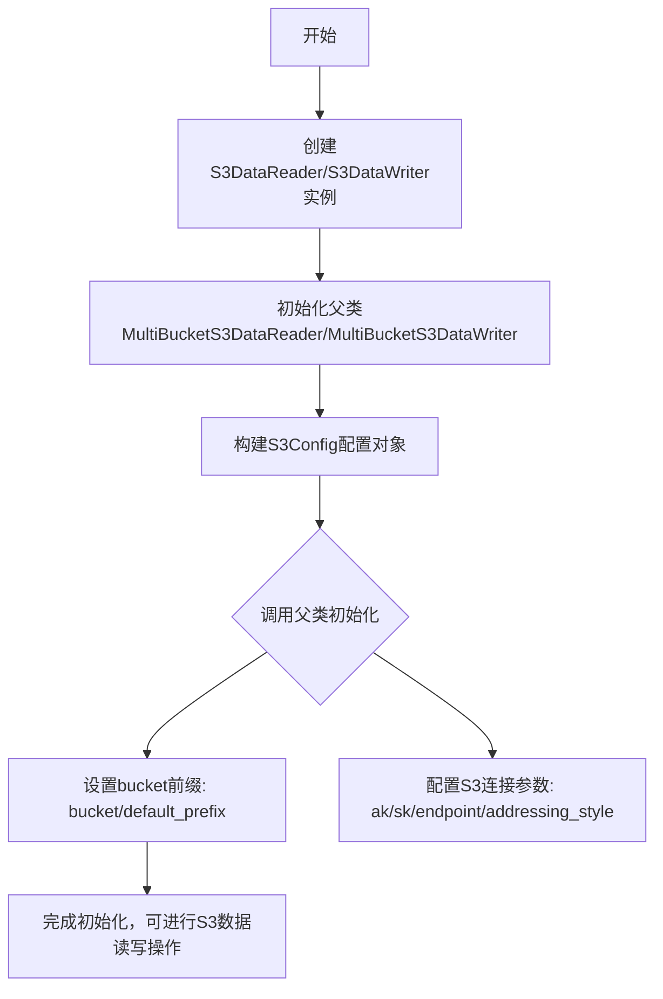
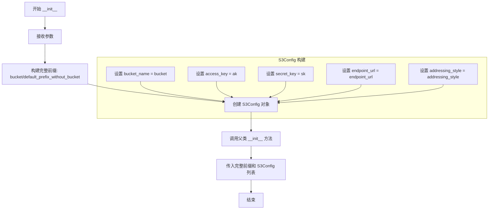
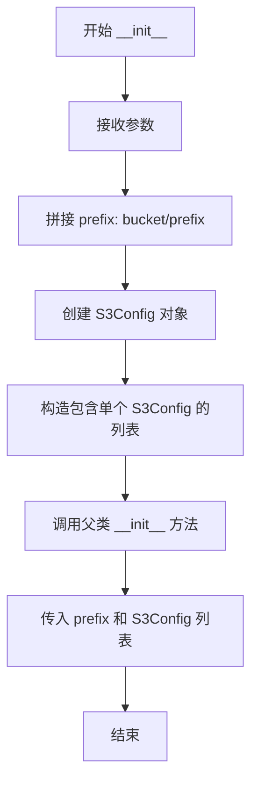

# `MinerU\mineru\data\data_reader_writer\s3.py` 详细设计文档

这是一个S3数据读写客户端的封装类，提供了简化的S3数据读取和写入功能。通过继承MultiBucketS3DataReader和MultiBucketS3DataWriter，结合S3Config配置，实现了针对单个bucket的S3数据操作接口。

## 整体流程



## 类结构

```
S3Config (配置类)
├── MultiBucketS3DataReader (抽象基类/父类)
│   └── S3DataReader (当前类)
└── MultiBucketS3DataWriter (抽象基类/父类)
    └── S3DataWriter (当前类)
```

## 全局变量及字段


### `S3DataReader.default_prefix_without_bucket`
    
不包含bucket名称的S3对象路径前缀

类型：`str`
    


### `S3DataReader.bucket`
    
S3存储桶名称

类型：`str`
    


### `S3DataReader.ak`
    
访问密钥（Access Key ID）

类型：`str`
    


### `S3DataReader.sk`
    
秘密密钥（Secret Access Key）

类型：`str`
    


### `S3DataReader.endpoint_url`
    
S3服务的endpoint地址

类型：`str`
    


### `S3DataReader.addressing_style`
    
S3寻址方式，可选值为'auto'、'path'或'virtual'

类型：`str`
    


### `S3DataWriter.default_prefix_without_bucket`
    
不包含bucket名称的S3对象路径前缀

类型：`str`
    


### `S3DataWriter.bucket`
    
S3存储桶名称

类型：`str`
    


### `S3DataWriter.ak`
    
访问密钥（Access Key ID）

类型：`str`
    


### `S3DataWriter.sk`
    
秘密密钥（Secret Access Key）

类型：`str`
    


### `S3DataWriter.endpoint_url`
    
S3服务的endpoint地址

类型：`str`
    


### `S3DataWriter.addressing_style`
    
S3寻址方式，可选值为'auto'、'path'或'virtual'

类型：`str`
    
    

## 全局函数及方法


### `S3DataReader.__init__`

s3 reader client 的初始化方法，继承自 MultiBucketS3DataReader，用于配置 S3 读取器的连接参数和 bucket 信息。

参数：

- `self`：隐式参数，类实例本身
- `default_prefix_without_bucket`：`str`，不包含 bucket 的前缀路径
- `bucket`：`str`，bucket 名称
- `ak`：`str`，access key（访问密钥）
- `sk`：`str`，secret key（秘密密钥）
- `endpoint_url`：`str`，S3 的 endpoint URL
- `addressing_style`：`str`，默认为 'auto'，寻址风格（可选值：'path'、'virtual'）

返回值：`None`，无返回值（构造函数）

#### 流程图

```mermaid
flowchart TD
    A[开始 S3DataReader.__init__] --> B[接收参数]
    B --> C[构造 bucket_path: bucket/default_prefix_without_bucket]
    C --> D[创建 S3Config 对象]
    D --> E[配置 bucket_name, access_key, secret_key, endpoint_url, addressing_style]
    E --> F[调用 super().__init__ bucket_path 和 S3Config 列表]
    F --> G[结束]
```

#### 带注释源码

```python
class S3DataReader(MultiBucketS3DataReader):
    def __init__(
        self,
        default_prefix_without_bucket: str,
        bucket: str,
        ak: str,
        sk: str,
        endpoint_url: str,
        addressing_style: str = 'auto',
    ):
        """s3 reader client.

        Args:
            default_prefix_without_bucket: prefix that not contains bucket
            bucket (str): bucket name
            ak (str): access key
            sk (str): secret key
            endpoint_url (str): endpoint url of s3
            addressing_style (str, optional): Defaults to 'auto'. Other valid options here are 'path' and 'virtual'
            refer to https://boto3.amazonaws.com/v1/documentation/api/1.9.42/guide/s3.html
        """
        # 调用父类 MultiBucketS3DataReader 的初始化方法
        # 将 bucket 和 default_prefix_without_bucket 拼接成完整路径
        super().__init__(
            f'{bucket}/{default_prefix_without_bucket}',  # 构造完整的 prefix 路径
            [
                # 创建 S3Config 配置对象，包含连接 S3 所需的所有认证和配置信息
                S3Config(
                    bucket_name=bucket,
                    access_key=ak,
                    secret_key=sk,
                    endpoint_url=endpoint_url,
                    addressing_style=addressing_style,
                )
            ],
        )
```

---

### `S3DataWriter.__init__`

s3 writer client 的初始化方法，继承自 MultiBucketS3DataWriter，用于配置 S3 写入器的连接参数和 bucket 信息。

参数：

- `self`：隐式参数，类实例本身
- `default_prefix_without_bucket`：`str`，不包含 bucket 的前缀路径
- `bucket`：`str`，bucket 名称
- `ak`：`str`，access key（访问密钥）
- `sk`：`str`，secret key（秘密密钥）
- `endpoint_url`：`str`，S3 的 endpoint URL
- `addressing_style`：`str`，默认为 'auto'，寻址风格（可选值：'path'、'virtual'）

返回值：`None`，无返回值（构造函数）

#### 流程图

```mermaid
flowchart TD
    A[开始 S3DataWriter.__init__] --> B[接收参数]
    B --> C[构造 bucket_path: bucket/default_prefix_without_bucket]
    C --> D[创建 S3Config 对象]
    D --> E[配置 bucket_name, access_key, secret_key, endpoint_url, addressing_style]
    E --> F[调用 super().__init__ bucket_path 和 S3Config 列表]
    F --> G[结束]
```

#### 带注释源码

```python
class S3DataWriter(MultiBucketS3DataWriter):
    def __init__(
        self,
        default_prefix_without_bucket: str,
        bucket: str,
        ak: str,
        sk: str,
        endpoint_url: str,
        addressing_style: str = 'auto',
    ):
        """s3 writer client.

        Args:
            default_prefix_without_bucket: prefix that not contains bucket
            bucket (str): bucket name
            ak (str): access key
            sk (str): secret key
            endpoint_url (str): endpoint url of s3
            addressing_style (str, optional): Defaults to 'auto'. Other valid options here are 'path' and 'virtual'
            refer to https://boto3.amazonaws.com/v1/documentation/api/1.9.42/guide/s3.html
        """
        # 调用父类 MultiBucketS3DataWriter 的初始化方法
        # 将 bucket 和 default_prefix_without_bucket 拼接成完整路径
        super().__init__(
            f'{bucket}/{default_prefix_without_bucket}',  # 构造完整的 prefix 路径
            [
                # 创建 S3Config 配置对象，包含连接 S3 所需的所有认证和配置信息
                S3Config(
                    bucket_name=bucket,
                    access_key=ak,
                    secret_key=sk,
                    endpoint_url=endpoint_url,
                    addressing_style=addressing_style,
                )
            ],
        )
```


### `S3DataReader.__init__`

该方法是 S3DataReader 类的初始化构造函数，接收 S3 存储桶连接所需的所有配置参数（包括前缀、存储桶名称、访问凭证、端点地址和寻址风格），并将这些参数封装为 S3Config 对象后调用父类 MultiBucketS3DataReader 的构造函数完成客户端的初始化。

参数：

- `default_prefix_without_bucket`：`str`，不包含存储桶名称的前缀路径，用于指定数据的根目录
- `bucket`：`str`，S3 存储桶的名称
- `ak`：`str`，访问密钥（Access Key），用于身份验证
- `sk`：`str`，秘密密钥（Secret Key），用于身份验证
- `endpoint_url`：`str`，S3 服务的端点 URL 地址
- `addressing_style`：`str`，可选，默认为 'auto'，指定 S3 寻址风格，可选值为 'path'、'virtual' 或 'auto'

返回值：`None`，构造函数不返回值，通过副作用完成对象初始化

#### 流程图



#### 带注释源码

```python
def __init__(
    self,
    default_prefix_without_bucket: str,  # 不包含存储桶的前缀路径
    bucket: str,                          # S3 存储桶名称
    ak: str,                              # 访问密钥 Access Key
    sk: str,                              # 秘密密钥 Secret Key
    endpoint_url: str,                   # S3 服务端点 URL
    addressing_style: str = 'auto',      # 寻址风格，默认自动
):
    """s3 reader client.

    Args:
        default_prefix_without_bucket: prefix that not contains bucket
        bucket (str): bucket name
        ak (str): access key
        sk (str): secret key
        endpoint_url (str): endpoint url of s3
        addressing_style (str, optional): Defaults to 'auto'. 
            Other valid options here are 'path' and 'virtual'
            refer to https://boto3.amazonaws.com/v1/documentation/api/1.9.42/guide/s3.html
    """
    # 调用父类 MultiBucketS3DataReader 的构造函数
    # 将 bucket 和 default_prefix_without_bucket 拼接为完整前缀
    super().__init__(
        f'{bucket}/{default_prefix_without_bucket}',  # 构造完整前缀路径
        [
            # 创建 S3Config 配置对象，包含连接 S3 所需的所有认证和配置信息
            S3Config(
                bucket_name=bucket,              # 存储桶名称
                access_key=ak,                   # 访问密钥
                secret_key=sk,                   # 秘密密钥
                endpoint_url=endpoint_url,       # 端点 URL
                addressing_style=addressing_style,  # 寻址风格
            )
        ],
    )
```


### S3DataWriter.__init__

这是 S3DataWriter 类的初始化方法，负责创建一个 S3 数据写入客户端。该方法接收 S3 连接所需的各种配置参数（bucket 名称、访问密钥、端点 URL 等），并通过调用父类 MultiBucketS3DataWriter 的构造函数来完成客户端的初始化设置。

参数：

- `self`：`S3DataWriter`，S3DataWriter 类的实例本身
- `default_prefix_without_bucket`：`str`，不包含 bucket 的前缀路径，用于指定数据存储的目录结构
- `bucket`：`str`，S3 bucket 名称，表示数据写入的目标存储桶
- `ak`：`str`，Access Key，S3 访问密钥，用于身份验证
- `sk`：`str`，Secret Key，S3 秘密密钥，用于身份验证
- `endpoint_url`：`str`，S3 服务的端点 URL，指定 S3 服务的访问地址
- `addressing_style`：`str`，可选参数，默认为 'auto'，指定 S3 寻址方式，可选值包括 'auto'、'path' 和 'virtual'

返回值：`None`，`__init__` 方法不返回任何值

#### 流程图



#### 带注释源码

```python
class S3DataWriter(MultiBucketS3DataWriter):
    def __init__(
        self,
        default_prefix_without_bucket: str,
        bucket: str,
        ak: str,
        sk: str,
        endpoint_url: str,
        addressing_style: str = 'auto',
    ):
        """s3 writer client.

        Args:
            default_prefix_without_bucket: prefix that not contains bucket
            bucket (str): bucket name
            ak (str): access key
            sk (str): secret key
            endpoint_url (str): endpoint url of s3
            addressing_style (str, optional): Defaults to 'auto'. Other valid options here are 'path' and 'virtual'
            refer to https://boto3.amazonaws.com/v1/documentation/api/1.9.42/guide/s3.html
        """
        # 调用父类 MultiBucketS3DataWriter 的初始化方法
        # 传入拼接完整的前缀路径和 S3 配置列表
        super().__init__(
            # 将 bucket 名称和前缀路径拼接，形成完整的前缀
            f'{bucket}/{default_prefix_without_bucket}',
            # 创建包含单个 S3Config 对象的列表
            [
                S3Config(
                    bucket_name=bucket,          # S3 bucket 名称
                    access_key=ak,               # 访问密钥
                    secret_key=sk,               # 秘密密钥
                    endpoint_url=endpoint_url,   # 端点 URL
                    addressing_style=addressing_style,  # 寻址样式
                )
            ],
        )
```


## 关键组件


### S3DataReader

S3数据读取客户端，继承自MultiBucketS3DataReader，提供从S3存储读取数据的统一接口

### S3DataWriter

S3数据写入客户端，继承自MultiBucketS3DataWriter，提供向S3存储写入数据的统一接口

### MultiBucketS3DataReader

父类，基于boto3的多Bucket S3数据读取实现，支持配置多个S3存储桶

### MultiBucketS3DataWriter

父类，基于boto3的多Bucket S3数据写入实现，支持配置多个S3存储桶

### S3Config

S3配置数据类，来自..utils.schemas模块，包含bucket_name、access_key、secret_key、endpoint_url、addressing_style等配置项

### 构造函数参数

包括default_prefix_without_bucket（不含bucket的前缀路径）、bucket（存储桶名称）、ak（访问密钥）、sk（秘密密钥）、endpoint_url（S3端点URL）、addressing_style（寻址风格，默认为auto）

### addressing_style参数

控制S3访问方式，支持'auto'、'path'和'virtual'三种模式，影响URL路径格式


## 问题及建议


### 已知问题

-   **代码重复**：S3DataReader 和 S3DataWriter 的 `__init__` 方法几乎完全相同，仅父类不同，违反 DRY 原则
-   **文档字符串冗余**：两个类的 docstring 除了首句不同外，其余内容完全重复
-   **参数验证缺失**：未对 `default_prefix_without_bucket`、`bucket`、`ak`、`sk`、`endpoint_url` 等关键参数进行空值或格式校验
-   **路径拼接风险**：直接使用 f-string 拼接 `bucket` 和 `default_prefix_without_bucket`，未处理 `default_prefix_without_bucket` 可能以斜杠开头或包含连续斜杠的情况
-   **灵活性受限**：将单个 S3Config 包装为列表传入，若父类支持直接接受单对象则可简化
-   **类型注解不完整**：构造函数未声明返回类型，参数类型注解可更精确（如 Literal 类型）

### 优化建议

-   **提取公共逻辑**：将重复的初始化逻辑抽取为工厂方法或基类方法，两个类通过参数区分读写类型
-   **统一配置构建**：创建静态方法或工具函数用于构建 S3Config，减少重复代码
-   **增加参数校验**：在 `__init__` 中添加断言或验证逻辑，确保必要参数非空且格式正确
-   **处理路径规范化**：使用 `pathlib` 或字符串处理确保 prefix 格式一致，避免路径问题
-   **简化调用方式**：根据父类设计考虑是否支持直接传入单对象而非列表
-   **增强类型注解**：添加返回值类型声明，使用 Literal 限制 addressing_style 的可选值


## 其它


### 设计目标与约束

S3DataReader和S3DataWriter的设计目标是为用户提供一个简洁的单bucket S3数据读写接口，封装底层的多bucket实现细节。主要约束包括：仅支持单个bucket、不支持连接池复用、依赖boto3库、addressing_style仅支持'auto'、'path'和'virtual'三种模式。

### 错误处理与异常设计

代码本身未实现显式的错误处理逻辑，错误处理依赖于父类MultiBucketS3DataReader和MultiBucketS3DataWriter。可能的异常场景包括：S3连接失败（网络问题、凭证错误）、bucket不存在、权限不足、对象键不存在、endpoint_url格式错误等。异常类型应涵盖boto3的常见异常如ClientError、EndpointConnectionError、InvalidCredentialsException等。

### 外部依赖与接口契约

主要外部依赖包括：boto3库（AWS S3 SDK）、自定义的MultiBucketS3DataReader和MultiBucketS3DataWriter类、以及S3Config配置类。接口契约方面：构造函数参数bucket、ak、sk、endpoint_url为必需参数，addressing_style为可选参数（默认'auto'），default_prefix_without_bucket参数不能包含bucket名称（因为会在内部拼接bucket前缀）。

### 性能考虑

当前设计每次实例化都会创建新的S3客户端连接，无连接池机制。高频场景下可能存在性能瓶颈。建议在文档中说明该类适用于低频访问场景，高频场景需考虑在外部实现连接池管理或使用父类的多bucket能力共享连接。

### 安全性考虑

代码中直接接收ak（access key）和sk（secret key）明文参数，存在敏感信息泄露风险。建议在实际使用中通过环境变量或密钥管理服务（如AWS Secrets Manager）传递凭证，避免在代码或配置文件中明文存储。endpoint_url应使用HTTPS协议确保传输安全。

### 使用示例

```python
# 读取数据
reader = S3DataReader(
    default_prefix_without_bucket="data/raw/",
    bucket="my-bucket",
    ak="your-access-key",
    sk="your-secret-key",
    endpoint_url="https://s3.amazonaws.com"
)
data = reader.read("file.txt")

# 写入数据
writer = S3DataWriter(
    default_prefix_without_bucket="data/output/",
    bucket="my-bucket",
    ak="your-access-key",
    sk="your-secret-key",
    endpoint_url="https://s3.amazonaws.com"
)
writer.write("result.txt", "content")
```

### 配置说明

| 参数 | 类型 | 必填 | 默认值 | 说明 |
|------|------|------|--------|------|
| default_prefix_without_bucket | str | 是 | - | 不包含bucket的路径前缀 |
| bucket | str | 是 | - | S3 bucket名称 |
| ak | str | 是 | - | Access Key |
| sk | str | 是 | - | Secret Key |
| endpoint_url | str | 是 | - | S3端点URL |
| addressing_style | str | 否 | 'auto' | 地址样式，可选'auto'/'path'/'virtual' |

### 兼容性说明

该代码兼容boto3 1.9.42及以上版本（参考文档中的版本链接）。addressing_style参数的不同选项影响URL格式：'virtual'使用虚拟主机样式（如bucket.s3.amazonaws.com），'path'使用路径样式（如s3.amazonaws.com/bucket），'auto'会自动选择。建议生产环境使用'virtual'样式以获得更好的性能。

    