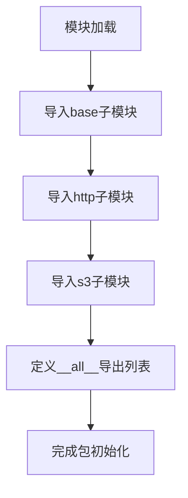

# `MinerU\mineru\data\io\__init__.py` 详细设计文档

这是一个I/O模块的包初始化文件，通过导入base、http、s3三个子模块的读写器类，统一对外提供多数据源（本地文件/内存、HTTP请求、S3对象存储）的读写接口。

## 整体流程



## 类结构

```
IOPackage (包)
├── base (子模块)
│   ├── IOReader (抽象基类)
│   └── IOWriter (抽象基类)
├── http (子模块)
│   ├── HttpReader
│   └── HttpWriter
└── s3 (子模块)
    ├── S3Reader
    └── S3Writer
```

## 全局变量及字段


### `__all__`
    
定义模块的公共API，指定允许通过from module import *导入的符号列表

类型：`list`
    


    

## 全局函数及方法


## 关键组件


### IOReader
基础输入读取器抽象类，定义了读取数据的统一接口。

### IOWriter
基础输出写入器抽象类，定义了写入数据的统一接口。

### HttpReader
基于HTTP协议的数据读取器，实现从远程URL读取数据的功能。

### HttpWriter
基于HTTP协议的数据写入器，实现向远程URL写入数据的功能。

### S3Reader
基于Amazon S3协议的数据读取器，实现从S3存储桶读取数据的功能。

### S3Writer
基于Amazon S3协议的数据写入器，实现向S3存储桶写入数据的功能。


## 问题及建议


### 已知问题

-   缺少模块文档字符串，无法快速了解包的用途和功能。
-   直接从子模块导入类，没有错误处理，如果子模块不存在或导入失败，会导致整个包无法使用。
-   没有版本信息，不利于依赖管理和迭代。
-   `__all__`列表中包含抽象基类（假设`IOReader`和`IOWriter`），可能暴露了内部实现细节。
-   缺少类型提示，降低了代码的可读性和可维护性。

### 优化建议

-   添加模块级文档字符串，说明该包提供了统一的I/O接口，支持多种存储后端（如本地文件、HTTP、S3）。
-   考虑添加`__version__`变量，例如`__version__ = "1.0.0"`。
-   使用`try-except`处理导入，提高容错性，例如：
  ```python
  try:
      from .base import IOReader, IOWriter
  except ImportError:
      # 处理导入失败
      pass
  ```
  但注意，这可能隐藏错误，需谨慎使用。
-   导出更明确的接口，如果`IOReader`和`IOWriter`是抽象基类，考虑不在`__all__`中导出，或者提供具体的实现类。
-   添加类型提示，例如`from typing import TYPE_CHECKING`。
-   在文档中说明依赖关系和用法。


## 其它


### 设计目标与约束

本模块的设计目标是提供统一的IO读写接口，封装不同存储后端（本地文件系统、HTTP、S3）的读取和写入操作，简化跨存储类型的文件处理流程。设计约束包括：1）所有读写器类必须继承自base模块中的IOReader或IOWriter基类；2）需要支持上下文管理器（context manager）以确保资源正确释放；3）各实现类需保持接口签名一致，便于在运行时动态切换不同的存储后端。

### 错误处理与异常设计

应定义模块级基础异常类（如IOModuleError），用于统一捕获和处理模块相关的错误。各实现类在遇到特定错误场景时应抛出相应的子类异常，例如网络请求失败时抛出HttpReaderError，S3连接异常时抛出S3WriterError。异常设计应支持异常链（chained exceptions），保留原始错误的堆栈信息，并在异常消息中包含足够的上下文信息（如URL、bucket名称、文件路径等），便于问题排查。

### 数据流与状态机

**读取数据流**：调用方通过IOReader接口的read()方法获取数据，数据源可以是本地文件、HTTP响应体或S3对象。读取过程中应支持分块读取（chunked reading）以处理大文件，并提供进度回调机制。

**写入数据流**：调用方通过IOWriter接口的write()方法写入数据，目标可以是本地文件、HTTP请求体或S3对象。写入过程中应支持流式写入（streaming write）和原子写入（atomic write）选项。

**状态机**：读写器应维护连接状态（disconnected/connecting/connected/error），状态转换应遵循合理的状态流程，例如从disconnected到connected需要经过connecting状态，错误发生后应自动转换到error状态并记录错误信息。

### 外部依赖与接口契约

**外部依赖**：本模块依赖以下外部包——base模块提供基础抽象类；http模块依赖requests库或类似HTTP客户端库用于发起HTTP请求；s3模块依赖boto3库用于与AWS S3服务交互。

**接口契约**：

- IOReader接口：必须实现read(size=-1)方法，返回读取的字节数据；实现close()方法释放资源；实现__enter__和__exit__方法支持上下文管理器
- IOWriter接口：必须实现write(data)方法，返回写入的字节数；实现close()方法关闭写入流并确保数据落盘；实现flush()方法强制刷新缓冲区；实现__enter__和__exit__方法支持上下文管理器
- 所有读写器类应实现seekable()和readable()或writable()方法以表明其能力

### 版本兼容性

本模块应声明Python最低版本要求（建议Python 3.7+），并明确标注各存储后端实现对特定Python版本的兼容情况。对于第三方依赖库，应指定最低兼容版本，并定期更新依赖版本以获取安全修复。

### 配置管理

建议提供模块级配置接口，支持以下配置项：超时时间（connect_timeout、read_timeout）、重试策略（max_retries、backoff_factor）、缓冲区大小（buffer_size）、SSL/TLS配置（verify_ssl、cert_file）。配置可以通过环境变量、配置文件或代码方式指定。

### 线程安全性

应明确标注各读写器类的线程安全性。对于线程不安全的实现（如基于requests的HttpReader），应在文档中注明，并建议调用方在线程间共享读写器实例时使用锁或创建独立的实例。S3Reader/S3Writer的线程安全性取决于底层boto3客户端的配置。

### 性能考量

文档应包含性能相关的最佳实践：1）对于大文件处理，建议使用分块读写而非一次性加载到内存；2）对于高并发场景，建议使用连接池（connection pooling）；3）对于需要频繁写入的场景，建议使用缓冲区批量写入以减少IO次数；4）应提供基准测试（benchmark）代码供性能评估参考。


    