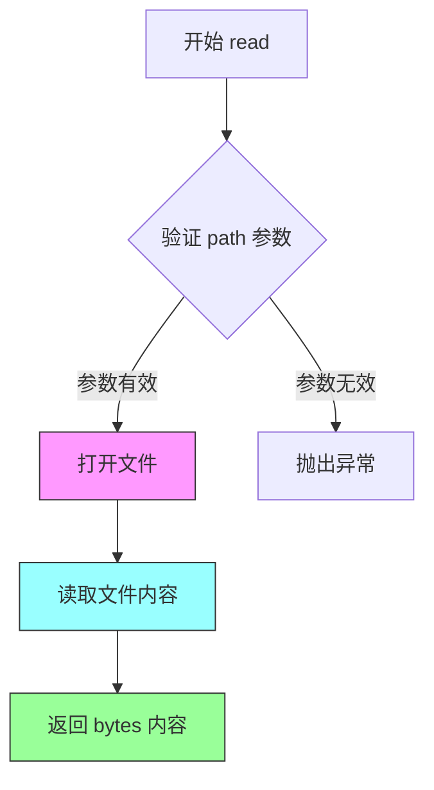
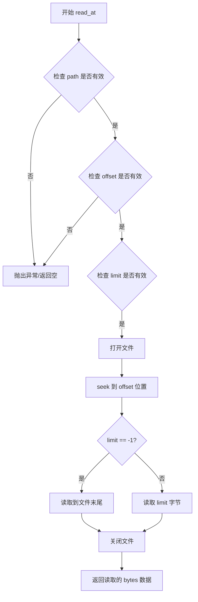
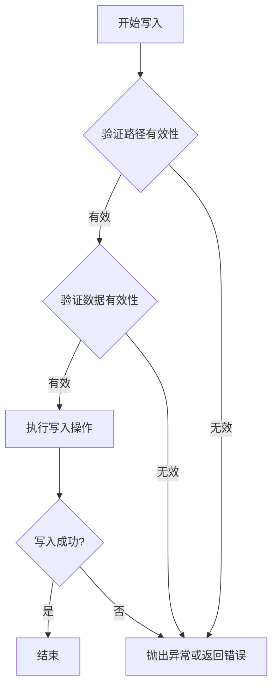

# `MinerU\mineru\data\io\base.py` 详细设计文档

该代码定义了用于文件I/O操作的抽象基类接口，提供读取器(IOReader)支持完整读取和随机访问读取，以及写入器(IOWriter)支持文件写入功能。

## 整体流程

```mermaid
graph TD
    A[开始] --> B{选择操作类型}
B --> C[读取操作]
B --> D[写入操作]
C --> E{读取方式}
E --> F[完整读取 read()]
E --> G[随机访问 read_at()]
F --> H[返回 bytes 数据]
G --> H
D --> I[调用 write()]
I --> J[写入 bytes 数据到文件]
J --> K[结束]
```

## 类结构

```
ABC (Python内置抽象基类)
├── IOReader (抽象基类)
│   ├── read(path: str) -> bytes [抽象方法]
│   └── read_at(path: str, offset: int, limit: int) -> bytes [抽象方法]
└── IOWriter (抽象基类)
    └── write(path: str, data: bytes) -> None [抽象方法]
```

## 全局变量及字段


    

## 全局函数及方法


### `IOReader.read`

读取指定路径的文件并返回其二进制内容。该方法是抽象方法，定义了IOReader类的文件读取接口，子类需要实现具体的读取逻辑。

参数：

- `path`：`str`，要读取的文件路径

返回值：`bytes`，文件的完整二进制内容

#### 流程图



#### 带注释源码

```python
@abstractmethod
def read(self, path: str) -> bytes:
    """Read the file.

    Args:
        path (str): file path to read  # 要读取文件的路径

    Returns:
        bytes: the content of the file  # 返回文件的完整二进制内容
    """
    pass  # 抽象方法，由子类实现具体逻辑
```

---

**补充说明**

| 项目 | 说明 |
|------|------|
| **所属类** | `IOReader` (ABC) |
| **方法类型** | 抽象方法 (Abstract Method) |
| **设计模式** | 模板方法模式 / 策略模式的基础接口 |
| **异常处理** | 由子类实现时决定（如文件不存在、权限不足等） |
| **约束** | 子类必须实现此方法，否则无法实例化 |
| **技术债务** | 无返回值的错误指示机制（如返回空bytes或抛出特定异常），调用方需自行处理异常 |
| **优化空间** | 可考虑添加 `encoding` 参数支持文本读取，或添加 `binary` 参数区分文本/二进制模式 |


### `IOReader.read_at`

从指定路径读取文件，可选择从特定偏移量开始并限制读取长度。

参数：

- `path`：`str`，文件路径，如果是相对路径，将与 parent_dir 合并
- `offset`：`int`，跳过的字节数，默认为 0
- `limit`：`int`，想要读取的字节长度，默认为 -1

返回值：`bytes`，文件内容

#### 流程图



#### 带注释源码

```python
@abstractmethod
def read_at(self, path: str, offset: int = 0, limit: int = -1) -> bytes:
    """Read at offset and limit.
    
    这是一个抽象方法，由子类实现具体逻辑。
    方法设计用于支持随机访问读取文件，类似于文件系统的 seek 和 read 操作。
    
    Args:
        path (str): 文件路径。
                   - 如果是相对路径，将与 parent_dir 合并
                   - 子类可能实现路径规范化逻辑
        offset (int, optional): 跳过的字节数。
                               - 默认为 0，表示从文件开头读取
                               - 必须为非负整数
        limit (int, optional): 想要读取的字节长度。
                              - 默认为 -1，表示读取从 offset 到文件末尾的所有内容
                              - 如果为正整数，读取指定字节数
                              - 如果为 0，可能返回空字节串或整个文件（取决于实现）
    
    Returns:
        bytes: 从指定位置读取的文件内容。
               - 如果 offset 超过文件大小，可能返回空字节串
               - 如果 limit 大于剩余可读字节数，返回到文件末尾的所有内容
    
    Note:
        - 该方法是抽象方法，具体实现由子类提供
        - 子类可能需要处理文件不存在、权限不足等异常情况
        - offset 和 limit 的边界情况处理可能因实现而异
    """
    pass
```


### `IOWriter.write`

写入文件数据到指定路径的抽象方法，由子类实现具体写入逻辑。

参数：

- `self`：`IOWriter`，方法所属的实例对象
- `path`：`str`，文件路径，如果是相对路径，将与 parent_dir 拼接
- `data`：`bytes`，要写入的数据

返回值：`None`，无返回值

#### 流程图



#### 带注释源码

```python
class IOWriter(ABC):
    @abstractmethod
    def write(self, path: str, data: bytes) -> None:
        """Write file with data.

        Args:
            path (str): the path of file, if the path is relative path, it will be joined with parent_dir.
            data (bytes): the data want to write
        """
        pass
```

## 关键组件


### IOReader

抽象基类，定义文件读取操作的接口规范，支持全量读取和部分读取两种模式

### IOWriter

抽象基类，定义文件写入操作的接口规范，负责将字节数据持久化到指定路径

### read方法

读取整个文件内容，接收文件路径作为参数，返回文件对应的字节数据

### read_at方法

支持偏移量和限制的部分读取功能，可实现大文件的分块读取和随机访问

### write方法

将字节数据写入指定文件路径，支持相对路径自动拼接父目录


## 问题及建议


### 已知问题

-   **缺少异常定义**：没有定义专属的异常类，调用方无法区分 IO 操作的不同错误类型（如文件不存在、权限不足、磁盘空间不足等）
-   **不支持上下文管理器**：未实现 `__enter__` 和 `__exit__` 方法，无法使用 `with` 语句进行资源自动管理，可能导致资源泄漏
-   **parent_dir 属性缺失**：文档描述中提到相对路径会与 `parent_dir` 拼接，但抽象类中未定义该属性，实现类也无法获取此配置
-   **read_at 方法语义不明确**：`limit` 参数为 -1 时表示读取到文件末尾，但这一约定仅在文档中说明，缺乏明确的枚举或常量定义
-   **类型提示不够精确**：`read` 和 `read_at` 方法均返回 `bytes`，但未说明空文件返回空字节 `b''` 的情况
-   **缺少资源清理方法**：没有定义 `close()` 或 `flush()` 方法，无法显式释放资源或确保数据写入磁盘
-   **抽象类职责不完整**：仅定义了读/写抽象方法，缺少对文件是否存在、是否可读/可写进行检查的抽象接口

### 优化建议

-   定义自定义异常类（如 `IOReadError`、`IOWriteError`、`IOPathError`），并在抽象方法文档中声明可能抛出的异常
-   为 `IOReader` 和 `IOWriter` 实现上下文管理器协议，添加 `__enter__`、`__exit__` 方法
-   在抽象类中添加 `parent_dir` 属性或通过构造函数传入，并使用 `abc.abstractmethod` 装饰器强制实现类定义
-   使用常量或枚举明确 `limit=-1` 的语义，或改用 `Optional[int]` 并用 `None` 表示读取到末尾
-   添加 `close()` 和 `flush()` 抽象方法，确保资源正确释放
-   考虑添加 `exists()`、`is_readable()`、`is_writable()` 等辅助抽象方法，提供更完整的接口


## 其它


### 设计目标与约束

本模块定义了文件IO操作的抽象接口，目标是解耦IO操作的具体实现，使得上层业务逻辑无需关心底层是本地文件、网络存储还是其他存储介质。约束包括：读写方法必须支持路径处理（相对路径需与parent_dir结合）、offset和limit参数用于实现部分读取、data参数必须为bytes类型。

### 错误处理与异常设计

由于本代码为抽象基类，具体异常处理由实现类完成。但应在文档中约定：实现类应在文件不存在、权限不足、IO错误等情况下抛出相应的异常（如FileNotFoundError、PermissionError、IOError）。read_at方法当offset超出文件大小时应返回空bytes，当limit为-1时应读取至文件末尾。

### 数据流与状态机

本模块为无状态设计，各方法均为纯函数式调用，不涉及状态机。数据流方向：调用方传入path和data（写入时）或仅path（读取时），方法返回bytes（读取时）或无返回值（写入时）。IOReader的read和read_at方法可视为等效功能的不同切片方式。

### 外部依赖与接口契约

本模块依赖abc模块的ABC和abstractmethod，无其他外部依赖。接口契约：实现类必须实现所有抽象方法；read方法应返回文件的完整内容；read_at方法的limit为-1时应读取从offset到文件末尾的所有内容；write方法应覆盖写入或创建新文件。

### 性能考量

抽象层本身无性能损耗，但实现类应考虑：对于大文件使用流式处理而非一次性加载；read_at方法应支持随机访问以避免全文件读取；缓存机制可由实现类根据场景添加。

### 线程安全考虑

本抽象基类不涉及线程安全，实现类应根据实际场景决定是否需要加锁。若实现类涉及共享资源（如文件句柄缓存），应提供线程安全实现或明确标注非线程安全。

### 资源管理

实现类应确保文件句柄等资源正确释放，推荐使用上下文管理器（with语句）或try-finally结构。write方法在写入失败时应确保不产生 partial write，必要时使用原子写入（写临时文件后重命名）。

### 扩展性设计

可扩展方向：添加IOReader/IOWriter的组合接口IOController；添加异步版本AsyncIOReader/AsyncIOWriter；添加压缩或加密包装器；支持URL和网络存储。现有设计符合开闭原则，便于通过继承扩展新功能。

### 测试策略

测试应覆盖：各抽象方法的签名验证；实现类的基本读写功能；边界条件（空文件、大文件、特殊字符路径）；异常情况（不存在路径、权限不足）；read_at方法的offset和limit参数组合。

    