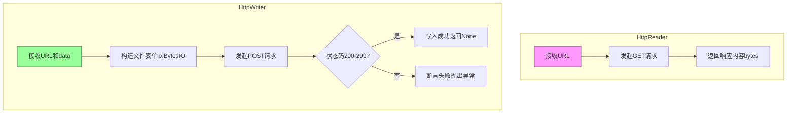
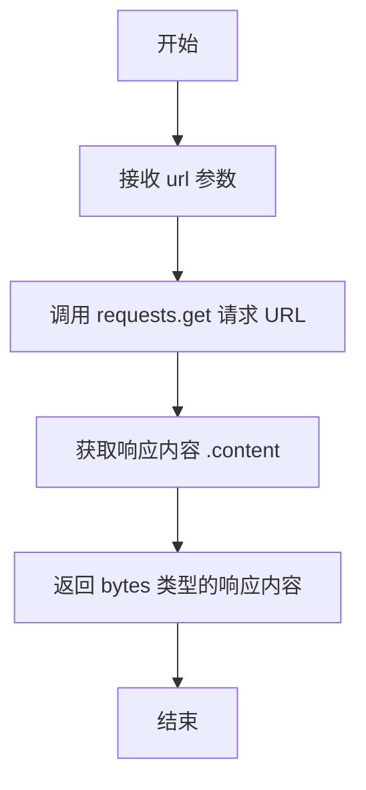
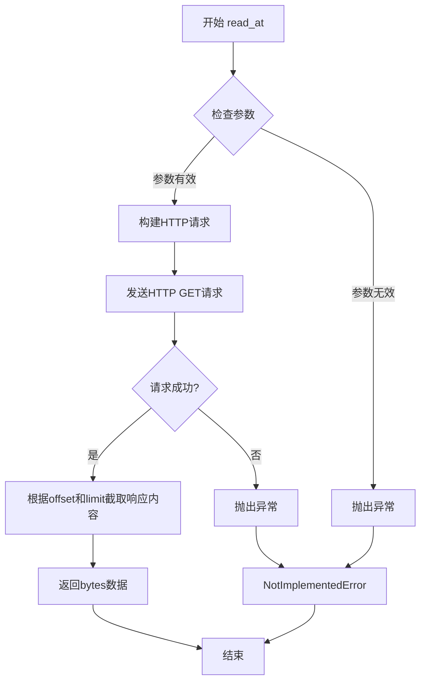
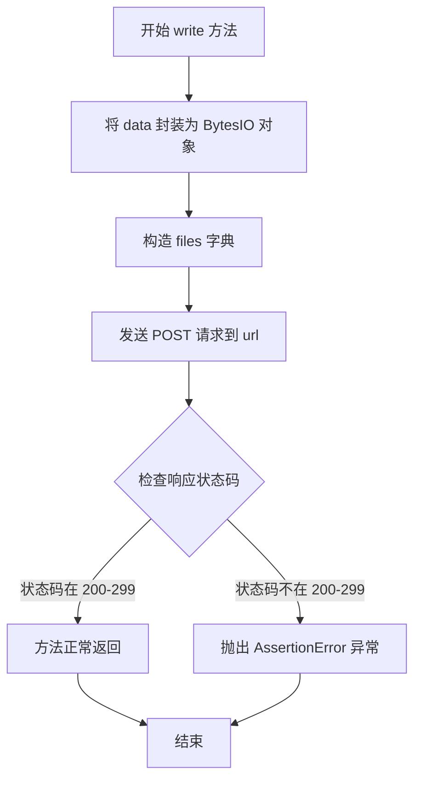

# `MinerU\mineru\data\io\http.py` 详细设计文档

这是一个HTTP文件读写组件，提供了通过HTTP协议读取远程文件和向远程服务器上传文件数据的功能，分别通过HttpReader和HttpWriter类实现IOReader和IOWriter接口。

## 整体流程



## 类结构

```
IOReader (抽象基类 - 外部导入)
└── HttpReader
IOWriter (抽象基类 - 外部导入)
└── HttpWriter
```

## 全局变量及字段


### `io`
    
Python标准库模块，提供字节流操作功能

类型：`module`
    


### `requests`
    
第三方HTTP请求库，用于发起网络请求

类型：`module`
    


    

## 全局函数及方法


### `HttpReader.read`

该方法通过 HTTP GET 请求从指定的 URL 下载内容并返回二进制数据，实现了一个简单的 HTTP 读取器。

参数：

- `url`：`str`，要读取的远程资源的 URL 地址

返回值：`bytes`，从 URL 下载的二进制内容

#### 流程图



#### 带注释源码

```python
def read(self, url: str) -> bytes:
    """Read the file.

    Args:
        path (str): file path to read  # 注意：此参数实际为 url，文档注释有误

    Returns:
        bytes: the content of the file
    """
    # 使用 requests 库发送 GET 请求到指定 URL
    # 并返回响应体的二进制内容
    return requests.get(url).content
```


### `HttpReader.read_at`

该方法用于从HTTP资源中读取指定偏移量和限制的字节数据，但目前尚未实现，调用时会抛出 `NotImplementedError` 异常。

参数：

- `self`：HttpReader，当前类的实例对象
- `path`：`str`，目标HTTP资源的URL地址
- `offset`：`int = 0`，读取起始位置偏移量，默认为0
- `limit`：`int = -1`，读取数据的长度限制，-1表示读取全部内容

返回值：`bytes`，但由于未实现，实际会抛出 NotImplementedError

#### 流程图



> **注意**：由于当前实现直接抛出 `NotImplementedError`，上述流程图为该方法的预期完整逻辑流程。

#### 带注释源码

```python
def read_at(self, path: str, offset: int = 0, limit: int = -1) -> bytes:
    """Not Implemented.
    
    该方法用于从HTTP资源中读取指定偏移量和限制的数据。
    预期行为：
    - 根据offset参数跳过前面的字节
    - 根据limit参数限制读取的字节数
    - limit为-1时表示读取从offset开始到文件末尾的所有内容
    
    Args:
        path (str): HTTP资源的URL地址
        offset (int): 读取起始位置偏移量，默认为0
        limit (int): 读取数据的长度限制，-1表示读取全部内容，默认为-1
    
    Returns:
        bytes: 从HTTP资源读取的字节数据
    
    Raises:
        NotImplementedError: 该方法尚未实现
    """
    # 当前实现直接抛出未实现异常
    raise NotImplementedError
```


### `HttpWriter.write`

该方法用于将二进制数据通过 HTTP POST 请求上传到指定的 URL，将数据作为文件形式发送，并验证响应状态码是否表示成功（2xx）。

参数：

- `url`：`str`，目标 URL，指定数据要发送到的 HTTP 端点
- `data`：`bytes`，要写入的二进制数据内容

返回值：`None`，无返回值，通过 HTTP 请求的响应状态码表示操作结果

#### 流程图



#### 带注释源码

```python
class HttpWriter(IOWriter):
    def write(self, url: str, data: bytes) -> None:
        """Write file with data.

        Args:
            path (str): the path of file, if the path is relative path, it will be joined with parent_dir.
            data (bytes): the data want to write
        """
        # 将二进制数据封装为 BytesIO 对象，用于文件上传
        files = {'file': io.BytesIO(data)}
        
        # 发送 POST 请求到目标 URL，以 multipart/form-data 形式上传文件
        response = requests.post(url, files=files)
        
        # 断言响应状态码在 2xx 范围内（成功），否则抛出 AssertionError
        assert 300 > response.status_code and response.status_code > 199
```

## 关键组件


### HttpReader 类

HTTP协议的文件读取器，继承自IOReader基类，用于通过GET请求读取远程文件内容。

### HttpWriter 类

HTTP协议的文件写入器，继承自IOWriter基类，用于通过POST请求将数据写入远程端点。

### read 方法

从指定URL读取完整文件内容，通过GET请求获取远程资源并返回二进制数据。

### read_at 方法

部分读取方法，支持偏移量和长度限制，但当前版本未实现此功能。

### write 方法

将二进制数据写入指定URL，通过POST请求以multipart/form-data形式上传文件内容。

### requests 依赖

外部HTTP库依赖，用于发起网络请求和处理响应。

### IOReader 基类接口

定义了读取器的抽象接口规范，HttpReader需要实现read和read_at方法。

### IOWriter 基类接口

定义了写入器的抽象接口规范，HttpWriter需要实现write方法。


## 问题及建议


### 已知问题

-   **错误处理缺失**：`read` 和 `write` 方法均未处理网络异常（如连接超时、DNS解析失败、服务器错误等），可能导致程序直接崩溃
-   **不当使用断言**：`write` 方法中使用 `assert` 检查HTTP状态码，断言在Python中可被禁用（`python -O`），且不适合业务逻辑错误处理
-   **缺少超时设置**：`requests.get` 和 `requests.post` 均未设置超时参数，可能导致请求无限期等待
-   **文档字符串错误**：`read` 方法的参数描述为 `path`，但实际参数名为 `url`，易造成误导
-   **未实现的接口**：`read_at` 方法抛出 `NotImplementedError`，但基类可能要求实现该方法
-   **资源未正确释放**：`io.BytesIO(data)` 创建的对象未被显式关闭，可能造成资源泄漏
-   **状态码判断逻辑有误**：条件 `300 > response.status_code and response.status_code > 199` 等同于 `199 < status_code < 300`，但逻辑表达不够直观
-   **响应未做空值检查**：未检查 `response` 对象是否为 `None` 或响应体是否为空
-   **类型注解不完整**：缺少对 `requests` 库的类型注解支持

### 优化建议

-   为 `requests.get` 和 `requests.post` 添加 `timeout` 参数，建议设置合理超时（如 `timeout=30`）
-   使用 `try-except` 捕获 `requests.exceptions.RequestException` 及其子类异常
-   用 `if` 条件判断替代 `assert` 进行状态码校验，失败时抛出自定义异常或使用 `response.raise_for_status()`
-   使用 `with` 语句管理 `io.BytesIO` 资源，或显式调用 `close()` 方法
-   修正文档字符串中的参数名，确保与实际参数一致
-   考虑添加重试机制（使用 `urllib3.util.retry` 或 `tenacity` 库）
-   添加响应内容校验，确保返回的 `bytes` 不为空
-   导入 `typing` 模块，使用 `Optional`、`Union` 等增强类型注解

## 其它


### 设计目标与约束

本模块旨在提供统一的HTTP资源读写能力，遵循IOReader/IOWriter接口规范，实现远程资源的透明访问。设计约束包括：仅支持HTTP/HTTPS协议，不支持FTP等其他协议；暂不支持断点续传和流式大文件处理；依赖外部requests库进行网络通信。

### 错误处理与异常设计

网络请求可能产生多种异常情况，当前实现中错误处理机制较为薄弱。HttpReader.read()方法未对网络超时、连接错误、HTTP错误状态码进行捕获和区分处理；HttpWriter.write()方法使用assertion处理错误状态码，不符合异常处理最佳实践。建议自定义HttpException异常类，区分网络层错误（ConnectionError、Timeout）和应用层错误（4xx、5xx状态码），并提供友好的错误信息和重试机制。

### 数据流与状态机

数据流相对简单：HttpReader将URL作为输入源，通过GET请求获取响应体并转换为bytes返回；HttpWriter接收URL和bytes数据，通过POST请求将数据作为文件上传。状态机概念较弱，无状态保持，每次调用均为独立的HTTP请求。不支持会话管理、Cookie持久化或连接复用。

### 外部依赖与接口契约

核心依赖为requests库，需确保版本兼容性（建议requests>=2.20.0）。接口契约方面，HttpReader需实现read(url: str) -> bytes和read_at(path: str, offset: int, limit: int) -> bytes方法（后者暂不支持）；HttpWriter需实现write(url: str, data: bytes) -> None方法。调用方需保证URL为有效的HTTP/HTTPS地址，且具备网络访问权限。

### 安全性考虑

当前实现存在安全隐患：未验证SSL证书（requests默认验证），在生产环境中可能存在中间人攻击风险；未对URL进行安全校验，可能导致SSRF攻击；敏感数据（如认证凭据）未通过安全方式传递。建议增加证书验证开关、URL白名单机制、请求超时限制（建议默认10秒），并支持Basic Auth、Bearer Token等认证方式。

### 性能考虑

性能瓶颈主要集中在网络IO层面。当前实现每次请求都创建新的HTTP连接，未使用Session进行连接复用；无请求超时控制，可能导致无限等待；大文件上传时直接将整个bytes加载到内存，不支持流式上传。建议使用requests.Session()复用连接，设置合理的timeout参数，对大数据采用分块上传或流式处理。

### 兼容性设计

需考虑Python版本兼容性（建议Python 3.6+）和requests库版本变化。接口设计应保持向后兼容，未来新增方法（如read_at的真正实现）需遵循现有接口约定。平台兼容性方面，需注意不同操作系统下的网络行为差异，如代理配置、SSL后端选择等。

### 版本演化考虑

当前为初始版本（v1.0），功能较为基础。后续演进建议：v1.1版本实现read_at方法支持范围请求；v2.0版本引入异步支持（asyncio）；v2.1版本增加重试机制和背压控制。版本变更需遵循语义化版本规范，并在文档中明确标注API变更内容。

### 测试策略

建议采用分层测试策略：单元测试覆盖HttpReader和HttpWriter的核心逻辑，使用requests-mock模拟HTTP响应；集成测试使用真实HTTP服务器（如httpbin.org）验证端到端功能；性能测试评估大文件上传和并发请求场景。重点测试边界条件：空数据、超大URL、无效URL、网络超时、服务器错误响应等。

### 配置管理

当前实现缺乏配置机制，建议引入配置项：请求超时时间（read_timeout、write_timeout）、连接池大小、SSL验证开关、重试次数和间隔、代理服务器地址、自定义请求头等。配置可通过环境变量、配置文件或代码参数方式提供，支持运行时动态调整。


    