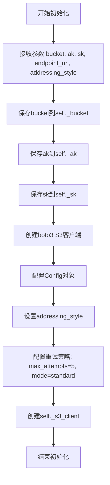
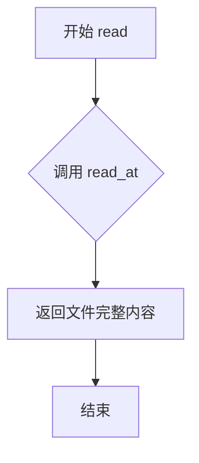
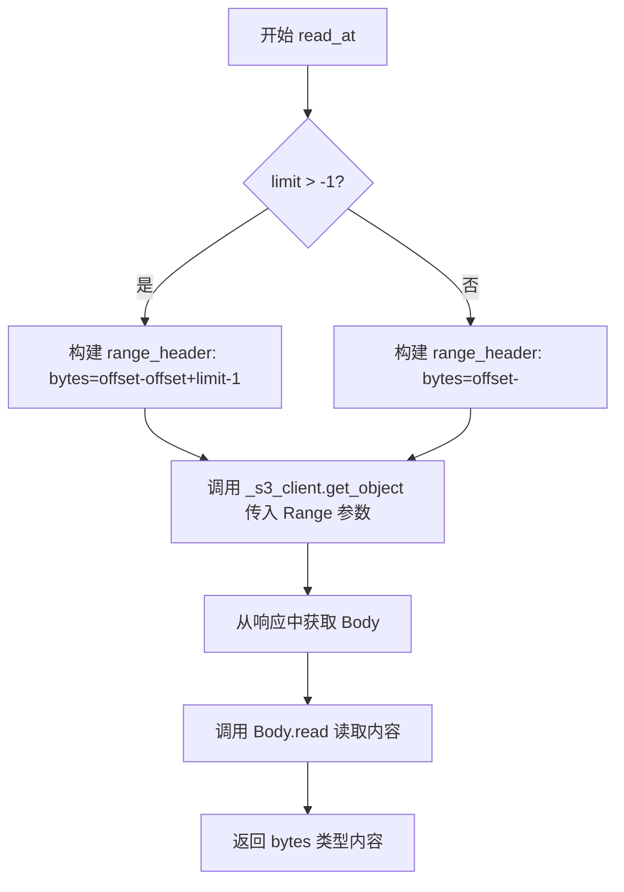
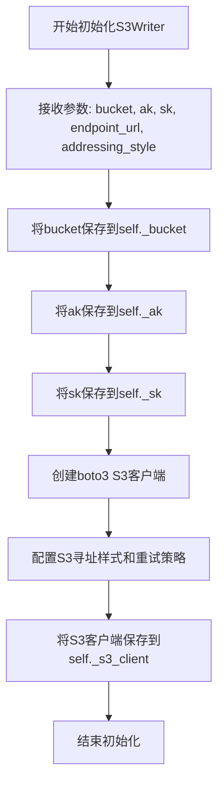
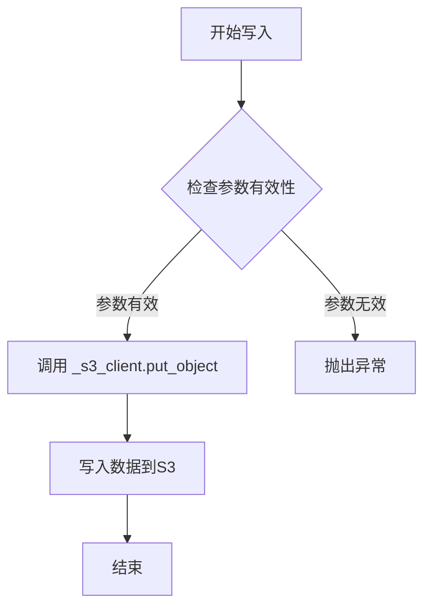

# `MinerU\mineru\data\io\s3.py` 详细设计文档

该文件实现了S3存储的读写客户端类（S3Reader和S3Writer），封装了boto3库的S3操作，支持从S3读取文件（支持偏移量和限制）、写入文件到S3存储，并配置了自动重试机制。

## 整体流程

```mermaid
graph TD
    A[开始] --> B[初始化S3Client]
    B --> C{调用类型}
    C -->|读取| D[调用read或read_at]
    C -->|写入| E[调用write]
    D --> F{limit > -1?}
    F -- 是 --> G[构建Range: bytes=offset-offset+limit-1]
    F -- 否 --> H[构建Range: bytes=offset-]
    G --> I[调用s3_client.get_object with Range]
    H --> I
    I --> J[返回Body.read()]
    E --> K[调用s3_client.put_object]
    K --> L[结束]
```

## 类结构

```
IOReader (抽象基类)
└── S3Reader
IOWriter (抽象基类)
└── S3Writer
```

## 全局变量及字段


### `S3Reader._bucket`
    
S3存储桶名称

类型：`str`
    


### `S3Reader._ak`
    
AWS访问密钥ID

类型：`str`
    


### `S3Reader._sk`
    
AWS秘密访问密钥

类型：`str`
    


### `S3Reader._s3_client`
    
boto3 S3客户端实例

类型：`boto3.client`
    


### `S3Writer._bucket`
    
S3存储桶名称

类型：`str`
    


### `S3Writer._ak`
    
AWS访问密钥ID

类型：`str`
    


### `S3Writer._sk`
    
AWS秘密访问密钥

类型：`str`
    


### `S3Writer._s3_client`
    
boto3 S3客户端实例

类型：`boto3.client`
    
    

## 全局函数及方法


### `S3Reader.__init__`

该方法用于初始化S3Reader客户端，创建boto3 S3客户端实例，并配置相关的访问凭证、端点URL以及重试策略。

参数：

- `bucket`：`str`，S3存储桶名称
- `ak`：`str`，AWS访问密钥（Access Key）
- `sk`：`str`，AWS秘密密钥（Secret Key）
- `endpoint_url`：`str`，S3服务的端点URL
- `addressing_style`：`str`，S3寻址样式，默认为'auto'，可选值为'path'和'virtual'

返回值：`None`，该方法为构造函数，不返回任何值

#### 流程图



#### 带注释源码

```python
def __init__(
    self,
    bucket: str,          # S3存储桶名称
    ak: str,              # AWS访问密钥ID
    sk: str,              # AWS秘密访问密钥
    endpoint_url: str,    # S3服务endpoint地址
    addressing_style: str = 'auto',  # S3寻址样式，默认auto
):
    """s3 reader client.

    Args:
        bucket (str): bucket name
        ak (str): access key
        sk (str): secret key
        endpoint_url (str): endpoint url of s3
        addressing_style (str, optional): Defaults to 'auto'. Other valid options here are 'path' and 'virtual'
        refer to https://boto3.amazonaws.com/v1/documentation/api/1.9.42/guide/s3.html
    """
    # 保存bucket名称到实例变量
    self._bucket = bucket
    # 保存访问密钥到实例变量
    self._ak = ak
    # 保存秘密密钥到实例变量
    self._sk = sk
    # 创建boto3 S3客户端，配置认证信息和端点
    self._s3_client = boto3.client(
        service_name='s3',                # 指定服务名为s3
        aws_access_key_id=ak,             # AWS访问密钥ID
        aws_secret_access_key=sk,         # AWS秘密访问密钥
        endpoint_url=endpoint_url,        # S3服务端点URL
        # 配置boto3客户端的Config对象
        config=Config(
            # S3寻址样式配置
            s3={'addressing_style': addressing_style},
            # 重试策略配置：最多重试5次，使用标准重试模式
            retries={'max_attempts': 5, 'mode': 'standard'},
        ),
    )
```


### `S3Reader.read`

读取S3存储桶中指定键对应的文件完整内容，并将二进制数据作为返回值。

参数：

- `key`：`str`，S3对象键（文件路径）

返回值：`bytes`，文件的完整二进制内容

#### 流程图



#### 带注释源码

```python
def read(self, key: str) -> bytes:
    """Read the file.

    Args:
        path (str): file path to read

    Returns:
        bytes: the content of the file
    """
    # 调用 read_at 方法，read 方法本质上是 read_at 的包装器
    # 默认从偏移量 0 开始，读取全部内容（limit=-1 表示不限制长度）
    return self.read_at(key)
```


### `S3Reader.read_at`

从S3存储中读取指定文件的内容，支持从指定偏移量开始读取，并可限制读取的字节数。

参数：

-  `key`：`str`，S3中文件的键（Key），即文件的路径标识
-  `offset`：`int`，跳过的字节数，默认为0，表示从文件开头开始读取
-  `limit`：`int`，要读取的字节长度，默认为-1，表示读取从偏移量到文件末尾的所有内容

返回值：`bytes`，返回读取到的文件内容字节数据

#### 流程图



#### 带注释源码

```python
def read_at(self, key: str, offset: int = 0, limit: int = -1) -> bytes:
    """Read at offset and limit.

    Args:
        path (str): the path of file, if the path is relative path, it will be joined with parent_dir.
        offset (int, optional): the number of bytes skipped. Defaults to 0.
        limit (int, optional): the length of bytes want to read. Defaults to -1.

    Returns:
        bytes: the content of file
    """
    # 判断是否需要限制读取长度
    if limit > -1:
        # 构造限定范围的 Range 头，格式为 bytes=起始偏移-结束偏移
        range_header = f'bytes={offset}-{offset+limit-1}'
        # 调用 S3 客户端获取指定范围的对象内容
        res = self._s3_client.get_object(
            Bucket=self._bucket, Key=key, Range=range_header
        )
    else:
        # 构造从指定偏移读取到文件末尾的 Range 头，格式为 bytes=起始偏移-
        range_header = f'bytes={offset}-'
        # 调用 S3 客户端获取从偏移量到文件末尾的对象内容
        res = self._s3_client.get_object(
            Bucket=self._bucket, Key=key, Range=range_header
        )
    # 从响应中读取并返回文件内容的字节数据
    return res['Body'].read()
```


### `S3Writer.__init__`

初始化S3Writer客户端，用于将数据写入S3兼容的存储服务。该方法接收S3的认证信息和配置参数，创建一个配置了重试机制的boto3 S3客户端实例。

参数：

- `bucket`：`str`，S3存储桶名称
- `ak`：`str`，访问密钥（Access Key）
- `sk`：`str`，秘密密钥（Secret Key）
- `endpoint_url`：`str`，S3服务的端点URL
- `addressing_style`：`str`，可选，默认为'auto'，指定S3寻址样式（其他可选值：'path'、'virtual'）

返回值：`None`，该方法为构造函数，不返回任何值

#### 流程图



#### 带注释源码

```python
def __init__(
    self,
    bucket: str,
    ak: str,
    sk: str,
    endpoint_url: str,
    addressing_style: str = 'auto',
):
    """s3 writer客户端初始化方法.

    Args:
        bucket (str): S3存储桶名称
        ak (str): AWS访问密钥ID
        sk (str): AWS秘密访问密钥
        endpoint_url (str): S3服务的端点URL
        addressing_style (str, optional): S3寻址样式，默认为'auto'。
            可选值包括'auto'、'path'和'virtual'。
            详见: https://boto3.amazonaws.com/v1/documentation/api/1.9.42/guide/s3.html
    """
    # 将桶名称保存为实例变量，供后续write方法使用
    self._bucket = bucket
    # 保存访问密钥
    self._ak = ak
    # 保存秘密密钥
    self._sk = sk
    
    # 创建boto3 S3客户端，配置AWS凭证和端点
    self._s3_client = boto3.client(
        service_name='s3',                           # 指定服务类型为S3
        aws_access_key_id=ak,                        # AWS访问密钥ID
        aws_secret_access_key=sk,                   # AWS秘密访问密钥
        endpoint_url=endpoint_url,                   # S3端点URL
        config=Config(                               # 配置客户端选项
            s3={'addressing_style': addressing_style},  # S3寻址样式
            retries={'max_attempts': 5, 'mode': 'standard'},  # 重试配置：最多5次重试，标准模式
        ),
    )
```


### `S3Writer.write`

将数据写入到AWS S3存储桶的指定键（key）中。

参数：

- `key`：`str`，S3对象的键（Key），用于标识存储在S3存储桶中的对象
- `data`：`bytes`，要写入的二进制数据

返回值：`None`，该方法没有返回值

#### 流程图



#### 带注释源码

```python
def write(self, key: str, data: bytes):
    """Write file with data.

    Args:
        path (str): the path of file, if the path is relative path, it will be joined with parent_dir.
        data (bytes): the data want to write
    """
    # 使用boto3 S3客户端的put_object方法将数据写入S3
    # Bucket: 存储桶名称
    # Key: 对象的键
    # Body: 要写入的数据内容
    self._s3_client.put_object(Bucket=self._bucket, Key=key, Body=data)
```

## 关键组件


### S3Reader 类

S3读取器类，继承自IOReader，用于从S3存储中读取文件数据。支持全量读取和基于offset/limit的范围读取。

### S3Writer 类

S3写入器类，继承自IOWriter，用于将数据写入S3存储。通过put_object方法实现文件上传功能。

### boto3 客户端配置组件

封装boto3 S3客户端的创建和配置，包含访问凭证（ak/sk）、endpoint地址、addressing_style和重试策略的设置。

### 范围读取支持组件

通过HTTP Range header实现S3文件的局部读取功能，支持指定offset和limit参数进行分段数据读取。

### 地址风格配置组件

支持三种S3地址风格配置：'auto'、'path'和'virtual'，用于兼容不同的S3兼容存储服务。


## 问题及建议


### 已知问题

- **重复代码**：S3Reader和S3Writer的`__init__`方法几乎完全相同，违反了DRY（Don't Repeat Yourself）原则。
- **缺少错误处理**：read、read_at和write方法均未捕获boto3可能抛出的异常（如网络错误、权限问题等），可能导致程序直接崩溃。
- **资源管理不当**：boto3客户端未实现上下文管理器接口，可能导致连接泄漏或资源未正确释放。
- **参数校验缺失**：未对bucket名称、key、ak/sk等关键参数进行有效性验证，传入空值或非法值时会产生隐式错误。
- **硬编码配置**：重试策略（max_attempts: 5, mode: 'standard'）硬编码在构造函数中，缺乏灵活性。
- **文档与实现不一致**：S3Reader.read方法docstring中参数名为`path`，但实际参数为`key`。
- **写入无返回值**：S3Writer.write方法没有返回值，调用方无法判断写入是否成功。
- **缺少日志记录**：没有任何日志输出，难以进行调试和运行时监控。
- **类型注解不完整**：limit参数默认值为-1，但-1作为默认值在实际逻辑中表达含义不够明确，应考虑使用Optional[int]或添加更清晰的注释。
- **无连接池管理**：每次实例化S3Reader或S3Writer都会创建新的boto3客户端，高并发场景下可能产生性能问题。

### 优化建议

- **提取公共逻辑**：将S3客户端初始化逻辑抽取到单独的工厂方法或基类中，避免代码重复。
- **添加异常处理**：为所有S3操作添加try-except块，定义自定义异常类或使用boto3自带的异常处理，提升健壮性。
- **实现上下文管理器**：让S3Reader和S3Writer继承自`contextlib.contextmanager`或实现`__enter__`/`__exit__`方法，确保资源安全释放。
- **增加参数校验**：在构造函数和读写方法中添加参数校验逻辑（如非空检查、格式检查）。
- **配置外部化**：将endpoint_url、addressing_style、retry策略等配置通过参数或配置文件传入，提升可维护性。
- **修正文档**：统一docstring中的参数名与实际参数名，确保文档准确。
- **write方法返回值**：考虑返回写入结果或抛出异常，使调用方能够感知操作状态。
- **添加日志**：使用Python标准logging模块记录关键操作和错误信息。
- **优化类型注解**：使用`Optional[int]`替代-1作为默认值，或者在注释中明确说明-1表示读取至文件末尾。
- **连接池或单例模式**：考虑使用单例模式或连接池复用boto3客户端，提升性能。

## 其它


### 设计目标与约束

本模块旨在提供统一的S3兼容对象存储的读写能力，封装boto3底层实现，提供简洁的IOReader/IOWriter接口。设计约束包括：1) 必须继承自基类IOReader和IOWriter；2) 支持S3兼容的所有存储服务（如AWS S3、MinIO、阿里云OSS等）；3) 支持范围读取（partial read）以满足大文件随机访问需求；4) 必须支持自定义endpoint_url以适配不同S3兼容服务。

### 错误处理与异常设计

代码中未显式处理异常，潜在的异常场景包括：1) 网络连接超时或失败；2) 凭证无效或权限不足；3) Bucket或Key不存在；4) 网络中断导致读取写入失败。建议增强错误处理：1) 捕获boto3的ClientError并转换为自定义异常；2) 对read操作添加超时控制和重试机制；3) 对write操作添加成功确认；4) 定义统一的异常类型（如S3ReadError、S3WriteError、S3AuthError等）以便上层调用者进行针对性处理。

### 数据流与状态机

数据流如下：调用者 -> read/read_at/write方法 -> boto3 client -> S3服务端。S3Reader的read方法内部调用read_at方法，read_at方法根据limit参数决定是否使用Range请求头。状态机相对简单，主要状态包括：初始化状态（创建client）、就绪状态（可进行读写）、异常状态（操作失败）。Writer无状态，每次write操作均为独立请求。

### 外部依赖与接口契约

外部依赖包括：1) boto3 - AWS SDK for Python；2) botocore - boto3的核心依赖；3) IOReader/IOWriter - 项目内部的基类定义（在..io.base中）。接口契约：1) S3Reader必须实现read(key: str) -> bytes和read_at(key: str, offset: int, limit: int) -> bytes方法；2) S3Writer必须实现write(key: str, data: bytes) -> None方法；3) 所有方法均为同步阻塞调用。

### 配置管理

当前配置通过构造函数参数传入，包括bucket、ak、sk、endpoint_url和addressing_style。boto3 client内部配置包括：1) retries配置 - 最大重试次数5次，标准重试模式；2) s3 addressing_style配置 - 支持auto、path、virtual三种模式。建议：1) 将敏感配置（ak、sk）通过环境变量或密钥管理服务注入，避免硬编码；2) 增加连接超时配置；3) 支持配置文件或环境变量覆盖。

### 安全性考虑

当前实现的安全问题：1) ak/sk通过明文参数传入，有泄露风险；2) 未启用SSL证书验证配置（虽然boto3默认验证）；3) 未实现请求签名或加密。改进建议：1) 支持从环境变量或AWS Secrets Manager读取凭证；2) 支持自定义CA证书验证；3) 对于敏感数据，可考虑在写入前进行客户端加密。

### 性能考量

当前实现性能特点：1) 每次操作都创建独立的boto3 client（在__init__中创建，整个生命周期复用）；2) 使用标准重试模式（5次重试）；3) 范围读取通过HTTP Range头实现，适合大文件随机访问。优化建议：1) 对于高频小文件场景，可考虑连接池复用；2) 大文件写入可考虑分片上传（multipart upload）；3) 读取大文件时可流式处理，避免一次性加载到内存。

### 使用示例

```python
# 创建Reader实例
reader = S3Reader(
    bucket='my-bucket',
    ak='access-key',
    sk='secret-key',
    endpoint_url='https://s3.amazonaws.com'
)

# 读取整个文件
data = reader.read('path/to/file.txt')

# 读取文件前100字节
partial_data = reader.read_at('path/to/file.txt', offset=0, limit=100)

# 创建Writer实例
writer = S3Writer(
    bucket='my-bucket',
    ak='access-key',
    sk='secret-key',
    endpoint_url='https://s3.amazonaws.com'
)

# 写入文件
writer.write('path/to/newfile.txt', b'hello world')
```

### 版本兼容性

依赖版本要求：1) Python 3.7+（基于类型注解语法）；2) boto3需与botocore版本匹配；3) S3 API版本兼容性好，但某些特性（如SelectObjectContent）可能需要更新版本。注意事项：1) boto3 client创建时会自动检查最新版本；2) addressing_style参数在不同boto3版本中行为可能略有差异。


    