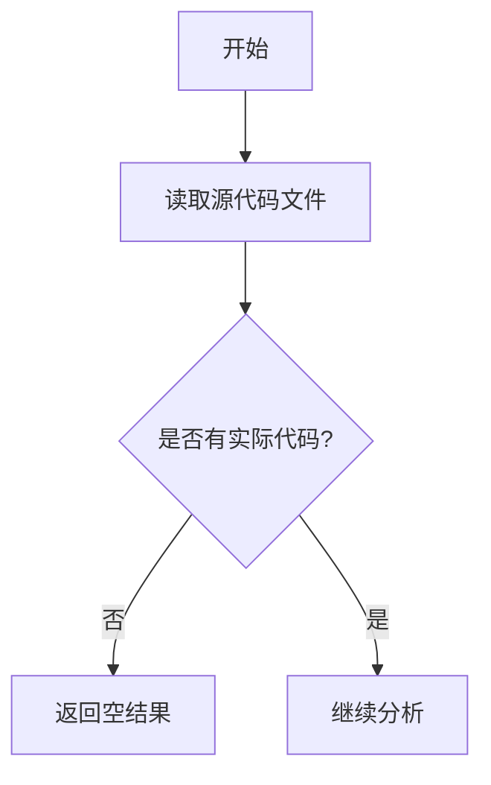

# `MinerU\mineru\data\utils\__init__.py` 详细设计文档

该文件仅包含版权声明信息，无实际代码实现，无法提取功能描述和结构信息。

## 整体流程



## 类结构

```

```

## 全局变量及字段


    

## 全局函数及方法


## 关键组件


## 代码概述

该代码文件仅包含版权声明，无实际实现代码可供分析。

## 文件运行流程

无（代码文件未提供实际实现）

## 类详细信息

无（代码文件未提供实际实现）

## 全局变量与全局函数

无（代码文件未提供实际实现）

## 关键组件信息

无（代码文件未提供实际实现）

## 潜在技术债务与优化空间

无（代码文件未提供实际实现）

## 其它项目

- **设计目标与约束**: 无从分析
- **错误处理与异常设计**: 无从分析
- **数据流与状态机**: 无从分析
- **外部依赖与接口契约**: 无从分析


## 问题及建议


### 已知问题

-   代码内容为空，仅包含版权声明，没有任何实际功能代码或逻辑实现
-   缺少代码文件的主体内容，无法进行有效的技术分析
-   无法提取类、方法、全局变量等关键组件信息

### 优化建议

-   请提供完整的代码文件内容，以便进行详细的技术分析和设计文档生成
-   当前状态下无法识别具体的技术债务或优化空间，需要实际代码作为分析基础


## 其它


### 设计目标与约束

由于代码仅包含版权声明信息，无实际功能实现，因此无法确定具体的设计目标与约束。设计文档应在此代码实际扩展功能后进行补充。

### 错误处理与异常设计

当前代码片段未包含任何功能逻辑，无错误处理与异常设计相关内容。该部分应在具体业务逻辑实现后进行补充。

### 数据流与状态机

当前代码不涉及数据流或状态机处理。该部分应在业务逻辑实现后根据实际数据流向进行补充。

### 外部依赖与接口契约

当前代码未引入任何外部依赖或定义接口契约。该部分应在具体功能模块实现后进行补充。

### 安全性考虑

当前代码仅包含版权声明，未涉及安全相关的功能实现。该部分应在具体业务逻辑中根据安全需求进行补充。

### 性能要求与约束

当前代码无性能相关实现。该部分应在具体功能模块中根据性能指标要求进行补充。

### 配置与扩展性

当前代码无配置相关功能。该部分应在具体业务需求明确后进行补充。

    