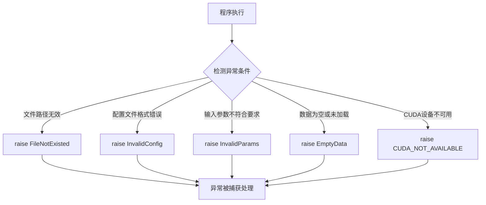
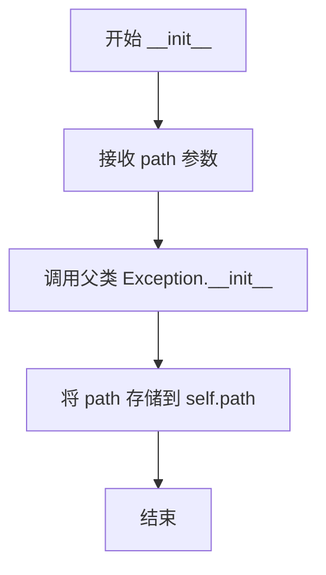
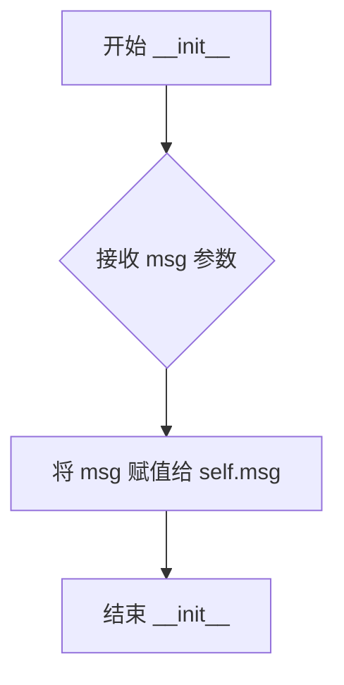
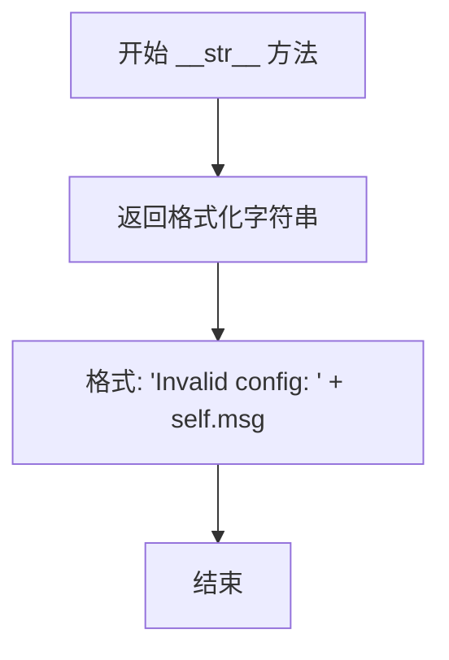
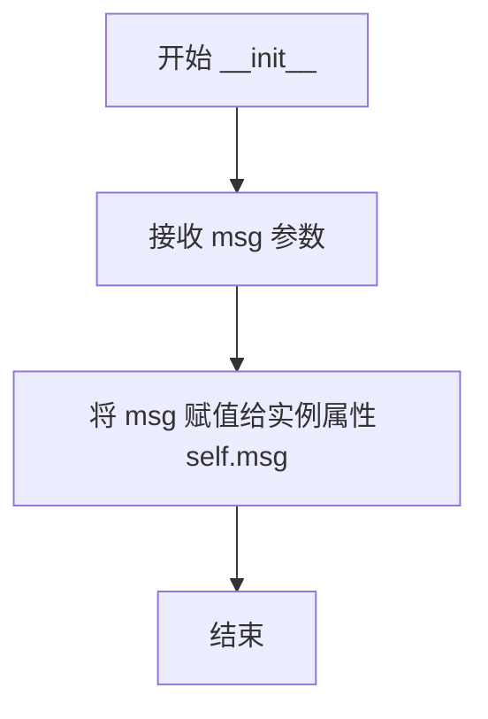
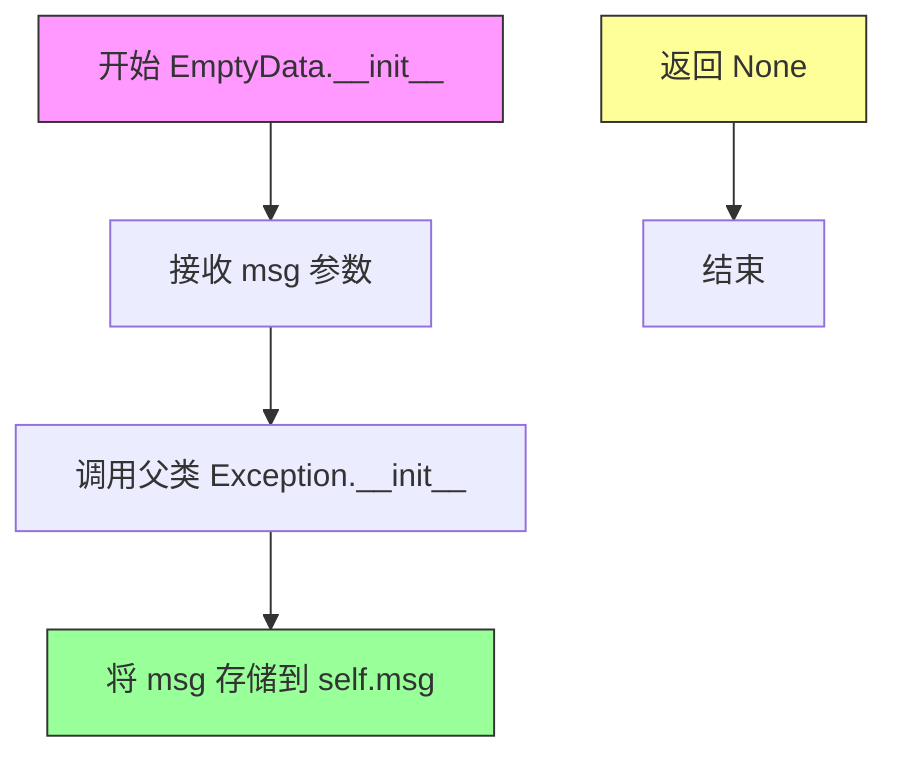
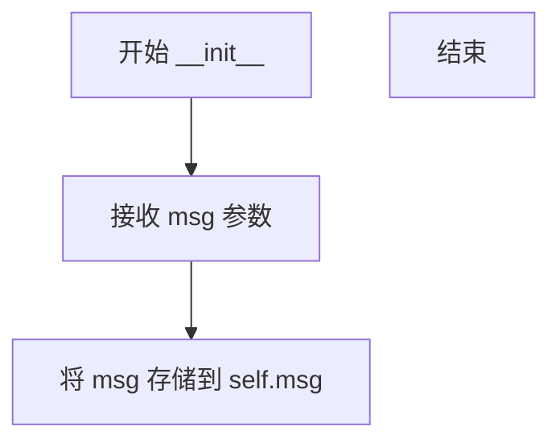

# `MinerU\mineru\data\utils\exceptions.py` 详细设计文档

本文件定义了一组自定义异常类，用于在深度学习模型推理和文件处理过程中报告特定错误情况，包括文件不存在、配置无效、参数无效、数据为空以及CUDA不可用等场景。

## 整体流程



## 类结构

```
Exception (Python内置基类)
├── FileNotExisted
├── InvalidConfig
├── InvalidParams
├── EmptyData
└── CUDA_NOT_AVAILABLE
```

## 全局变量及字段


### `FileNotExisted.path`
    
存储不存在的文件路径

类型：`str`
    


### `InvalidConfig.msg`
    
存储无效配置的错误信息

类型：`str`
    


### `InvalidParams.msg`
    
存储无效参数的错误信息

类型：`str`
    


### `EmptyData.msg`
    
存储空数据的错误信息

类型：`str`
    


### `CUDA_NOT_AVAILABLE.msg`
    
存储CUDA不可用的错误信息

类型：`str`
    
    

## 全局函数及方法


### `FileNotExisted.__init__`

这是文件不存在异常类的初始化方法，用于创建一个表示文件路径不存在的异常实例，并存储该文件路径供后续错误信息展示使用。

参数：

- `path`：`str`，表示不存在的文件路径

返回值：`None`，`__init__` 方法不返回任何值，仅初始化实例属性

#### 流程图



#### 带注释源码

```python
class FileNotExisted(Exception):
    """
    文件不存在异常类，继承自 Python 内置 Exception 类
    用于在文件操作中标识文件路径不存在的情况
    """

    def __init__(self, path):
        """
        初始化 FileNotExisted 异常实例

        参数:
            path: str, 不存在的文件路径
        返回:
            None
        """
        # 调用父类的初始化方法，确保异常机制正常工作
        super().__init__()
        # 存储文件路径，供 __str__ 方法生成错误信息使用
        self.path = path

    def __str__(self):
        """
        返回异常的可读字符串表示

        返回:
            str: 格式化的错误信息，如 'File /path/to/file does not exist.'
        """
        return f'File {self.path} does not exist.'
```


### `FileNotExisted.__str__`

该方法是 `FileNotExisted` 异常类的字符串表示方法，用于将异常对象转换为人类可读的字符串格式，返回文件不存在的错误信息。

参数：

- `self`：自动传入的实例对象，无需显式传递

返回值：`str`，返回格式化的错误信息，格式为 "File {path} does not exist."

#### 流程图

```mermaid
flowchart TD
    A[开始 __str__ 方法] --> B[获取 self.path 属性值]
    B --> C[使用 f-string 格式化字符串]
    C --> D[返回格式化的字符串: 'File {path} does not exist.']
    D --> E[结束]
```

#### 带注释源码

```python
def __str__(self):
    """
    返回异常对象的字符串表示形式。
    
    当异常被转换为字符串或使用 print() 打印时调用。
    此方法覆盖了基类 Exception 的默认 __str__ 实现，
    提供更友好的错误信息格式。
    
    Returns:
        str: 格式化的错误信息，包含不存在的文件路径
    """
    return f'File {self.path} does not exist.'
```


### `InvalidConfig.__init__`

该方法为 InvalidConfig 异常类的构造函数，接收错误信息消息并将其存储为实例属性，用于在异常被触发时提供详细的配置错误描述。

参数：

- `msg`：`str`，表示无效配置的具体错误信息

返回值：`None`，该方法为构造函数，不返回任何值

#### 流程图



#### 带注释源码

```python
class InvalidConfig(Exception):
    """自定义异常类，用于表示配置无效的错误"""
    
    def __init__(self, msg):
        """
        初始化 InvalidConfig 异常实例
        
        参数:
            msg: str, 无效配置的具体错误信息
        返回:
            None
        """
        self.msg = msg  # 将传入的错误信息存储为实例属性

    def __str__(self):
        """返回异常的可读字符串表示"""
        return f'Invalid config: {self.msg}'
```


### `InvalidConfig.__str__`

该方法为自定义异常类 `InvalidConfig` 的字符串表示方法，当需要将异常对象转换为字符串时调用，返回格式化的错误配置信息。

参数：

- `self`：`InvalidConfig` 实例本身，Python 类方法的隐含参数

返回值：`str`，返回格式化的错误信息字符串，格式为 "Invalid config: {错误消息}"

#### 流程图



#### 带注释源码

```python
def __str__(self):
    """
    返回 InvalidConfig 异常的字符串表示。
    
    当需要将异常对象转换为字符串时（例如打印异常、记录日志），
    此方法会被自动调用。
    
    Returns:
        str: 格式化的错误配置信息，格式为 'Invalid config: {self.msg}'
    """
    return f'Invalid config: {self.msg}'
```


### `InvalidParams.__init__`

该方法是 `InvalidParams` 异常类的构造函数，用于初始化无效参数异常对象，将传入的错误信息存储为实例属性。

参数：

-  `msg`：str，表示无效参数的具体描述信息

返回值：`None`，无返回值（构造函数）

#### 流程图



#### 带注释源码

```python
class InvalidParams(Exception):
    """自定义异常类，用于表示参数无效的情况"""
    
    def __init__(self, msg):
        """
        初始化 InvalidParams 异常实例
        
        参数:
            msg: 无效参数的具体描述信息
        """
        self.msg = msg  # 将传入的错误信息存储为实例属性

    def __str__(self):
        """
        返回异常的可读字符串表示
        
        返回值:
            str: 格式化的异常信息，格式为 'Invalid params: {self.msg}'
        """
        return f'Invalid params: {self.msg}'
```


### `InvalidParams.__str__`

该方法是 `InvalidParams` 异常类的字符串表示方法，用于将异常对象转换为人类可读的字符串格式，以便于日志记录和错误展示。

参数：

- `self`：`InvalidParams` 实例，隐式参数，代表当前异常对象本身

返回值：`str`，返回格式化的错误信息字符串，格式为 "Invalid params: {self.msg}"

#### 流程图

```mermaid
flowchart TD
    A[开始 __str__ 方法] --> B{检查 self.msg 是否存在}
    B -->|是| C[使用 f-string 格式化字符串]
    B -->|否| D[返回默认错误信息]
    C --> E[返回 'Invalid params: {msg}' 格式字符串]
    D --> E
    F[调用 print 或日志] --> G[输出异常信息]
```

#### 带注释源码

```python
class InvalidParams(Exception):
    """
    参数无效异常类，用于处理参数验证失败的情况
    继承自 Python 内置 Exception 类
    """
    
    def __init__(self, msg):
        """
        构造函数，初始化异常对象
        
        参数:
            msg: str, 具体的错误描述信息
        """
        self.msg = msg  # 存储错误消息供后续使用
    
    def __str__(self):
        """
        将异常对象转换为字符串表示
        
        返回值:
            str: 格式化的错误信息，格式为 'Invalid params: {具体消息}'
        """
        return f'Invalid params: {self.msg}'  # 使用 f-string 格式化返回字符串
```


### `EmptyData.__init__`

EmptyData 类的初始化方法，用于创建 EmptyData 异常实例，将错误消息存储在实例属性中。

参数：

- `self`：无（隐式参数），Exception 类的实例对象本身
- `msg`：`str`，描述空数据错误情况的错误消息

返回值：`None`，无返回值（__init__ 方法不返回值）

#### 流程图



#### 带注释源码

```python
class EmptyData(Exception):
    """自定义异常类，用于表示数据为空时的错误情况"""
    
    def __init__(self, msg):
        """
        初始化 EmptyData 异常实例
        
        参数:
            msg (str): 描述空数据错误情况的错误消息
        返回值:
            None
        """
        # 调用父类 Exception 的初始化方法
        super().__init__()
        # 将错误消息存储到实例属性 msg 中，供后续 __str__ 方法使用
        self.msg = msg
    
    def __str__(self):
        """
        返回异常的可读字符串表示
        
        返回值:
            str: 格式化的错误消息，格式为 'Empty data: {self.msg}'
        """
        return f'Empty data: {self.msg}'
```


### `EmptyData.__str__`

该方法是 `EmptyData` 异常类的字符串表示方法，用于将异常对象转换为人类可读的字符串格式，返回格式为 "Empty data: {self.msg}" 的错误描述信息。

参数：

- `self`：无（隐式参数），`EmptyData` 类的实例本身，包含 `msg` 属性存储错误消息

返回值：`str`，返回格式化的错误描述字符串，格式为 "Empty data: {self.msg}"

#### 流程图

```mermaid
flowchart TD
    A[__str__ 被调用] --> B[获取 self.msg 属性值]
    B --> C[使用 f-string 格式化字符串]
    C --> D[返回 'Empty data: {msg}' 字符串]
```

#### 带注释源码

```python
def __str__(self):
    """
    返回异常对象的字符串表示形式。
    
    该方法是 Python 特殊方法（魔术方法），当使用 str() 函数
    或 print() 函数打印异常对象时自动调用。
    
    Returns:
        str: 格式化的错误消息字符串，格式为 'Empty data: {self.msg}'
    """
    return f'Empty data: {self.msg}'
```


### `CUDA_NOT_AVAILABLE.__init__`

该方法是 `CUDA_NOT_AVAILABLE` 异常类的构造函数，用于初始化异常对象并存储错误消息。

参数：

- `msg`：`str`，异常的具体描述信息

返回值：`None`，构造函数不返回任何值

#### 流程图



#### 带注释源码

```python
class CUDA_NOT_AVAILABLE(Exception):
    def __init__(self, msg):
        """
        初始化 CUDA_NOT_AVAILABLE 异常实例
        
        参数:
            msg: 异常的具体描述信息，通常说明为何 CUDA 不可用
        """
        self.msg = msg  # 将传入的消息存储为实例属性
```


### `CUDA_NOT_AVAILABLE.__str__`

该方法是 `CUDA_NOT_AVAILABLE` 异常类的字符串表示方法，用于将异常对象转换为人类可读的字符串格式，返回 CUDA 不可用相关的错误描述信息。

参数： 无（仅包含隐式参数 `self`）

返回值：`str`，返回格式化的错误信息字符串，格式为 "CUDA not available: {self.msg}"

#### 流程图

```mermaid
graph TD
    A[开始 __str__] --> B[获取 self.msg 属性]
    B --> C[格式化字符串<br/>f'CUDA not available: {self.msg}']
    C --> D[返回格式化后的字符串]
    D --> E[结束]
```

#### 带注释源码

```python
def __str__(self):
    """
    返回异常的字符串表示形式。
    
    当异常被转换为字符串或打印时调用，提供人类可读的错误描述。
    
    返回：
        str: 格式化的错误信息，格式为 'CUDA not available: {self.msg}'
             其中 {self.msg} 是构造异常时传入的详细消息
    """
    return f'CUDA not available: {self.msg}'
```

## 关键组件


### FileNotExisted

文件不存在异常，用于处理指定的文件路径不存在的情况。

### InvalidConfig

无效配置异常，用于处理配置文件格式错误或内容不符合预期的情况。

### InvalidParams

无效参数异常，用于处理函数或方法接收到的参数不符合要求的情况。

### EmptyData

空数据异常，用于处理数据为空或缺失的情况。

### CUDA_NOT_AVAILABLE

CUDA不可用异常，用于处理GPU计算资源不可用或未正确配置的情况。


## 问题及建议


### 已知问题

-   **类命名不一致**：FileNotExisted 使用过去式 "Existed"，而标准命名应为 FileNotExists 或 FileNotFound；CUDA_NOT_AVAILABLE 使用全大写命名，不符合 Python 类名的 PascalCase 规范
-   **属性命名不统一**：FileNotExisted 使用 `path` 属性，而其他异常类使用 `msg` 属性，导致调用时接口不一致
-   **代码重复**：所有异常类都包含相似的 `__init__` 和 `__str__` 方法，未抽取公共基类，存在大量重复代码
-   **未调用父类构造函数**：各异常类的 `__init__` 方法未调用 `super().__init__()`，可能导致异常序列化时丢失上下文信息
-   **缺少文档注释**：所有类和方法均无 docstring，缺乏对异常用途和使用场景的说明
-   **未继承标准异常体系**：虽然继承自 Exception，但未遵循最佳实践自定义异常基类
-   **缺少错误码或错误类型标识**：无统一的错误码体系，不利于系统化错误处理和日志分析

### 优化建议

-   **统一命名规范**：修正 FileNotExisted 为 FileNotFound，CUDA_NOT_AVAILABLE 改为 CudaNotAvailable
-   **抽取公共基类**：创建自定义异常基类（如 BaseAppException），统一管理 path/msg 属性和 __str__ 方法
-   **完善继承链**：在 __init__ 中调用 super().__init__(self.msg) 或 super().__init__(self.path)
-   **添加 docstring**：为每个异常类添加类级文档，说明其用途、适用场景和示例
-   **引入错误码机制**：添加 error_code 属性，支持系统化错误追踪和分类
-   **统一属性命名**：将 path 属性统一为 msg，或提供 get_message() 方法适配不同异常类型


## 其它


### 设计目标与约束

定义一套统一的异常体系，用于在项目中标识不同类型的错误情况，确保错误信息的一致性和可追溯性。所有异常均继承自Python内置Exception类，以保持与Python异常机制的兼容性。异常设计遵循简洁原则，仅包含必要的错误上下文信息。

### 错误处理与异常设计

异常类采用自定义异常基类设计，每种异常类型对应特定的应用场景。FileNotExisted用于文件操作相关错误，InvalidConfig用于配置校验错误，InvalidParams用于函数参数校验错误，EmptyData用于数据为空场景，CUDA_NOT_AVAILABLE用于CUDA环境相关错误。异常构造函数接受错误描述参数，__str__方法提供格式化的错误信息输出，便于日志记录和调试。

### 异常继承层次结构

所有自定义异常均直接继承自Python内置Exception类，未建立公共基类。这种设计保持了异常的扁平结构，便于按需捕获特定异常类型。FileNotExisted异常包含path属性用于记录不存在的文件路径，其他异常类通过msg属性存储错误描述信息。

### 使用场景与触发条件

FileNotExisted在文件读取、检查文件存在性时抛出；InvalidConfig在配置加载和校验阶段触发；InvalidParams在函数参数验证逻辑中触发；EmptyData在数据处理流程中发现空数据时触发；CUDA_NOT_AVAILABLE在CUDA环境检查或GPU操作前验证失败时触发。

### 日志与监控建议

建议在抛出异常时记录完整的堆栈信息，异常信息应包含足够的上下文用于问题定位。CUDA_NOT_AVAILABLE异常应记录CUDA版本、驱动版本等环境信息便于排查硬件兼容性问题。

### 兼容性考虑

异常类设计保持与Python 3.x版本的兼容性，未使用类型注解等Python 3.5+特性，确保在较老版本的Python环境中也能正常运行。

### 测试策略建议

建议为每个异常类编写单元测试，验证异常构造、字符串表示、属性访问等功能的正确性。测试应覆盖异常抛出和捕获的完整流程。

### 版本演化与扩展

未来可根据项目需求添加更多异常类型，建议保持现有的异常设计模式一致。如需建立异常层次结构，可考虑引入自定义基类如BaseAppException，统一管理错误码和错误信息格式。

    