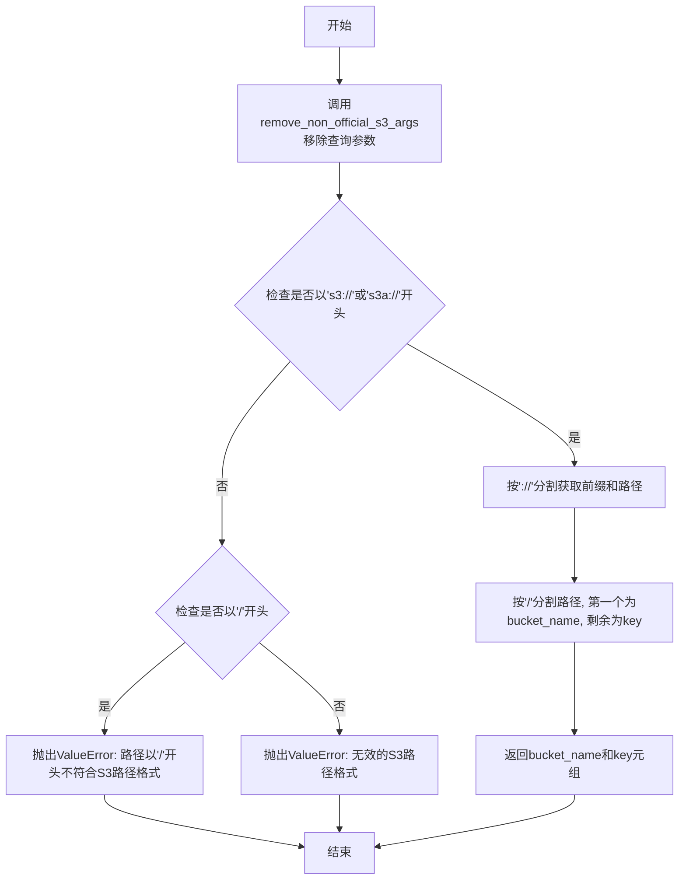

# `MinerU\mineru\data\utils\path_utils.py` 详细设计文档

该文件提供了一组用于解析和处理AWS S3路径的工具函数，支持提取bucket名称、object key、移除查询参数以及解析字节范围参数，主要用于S3文件路径的标准化处理。

## 整体流程

```mermaid
graph TD
    A[开始] --> B{输入s3path}
B --> C{调用 remove_non_official_s3_args}
C --> D{去除查询参数}
D --> E{判断协议前缀}
E -- s3:// 或 s3a:// --> F[分割提取bucket和key]
E -- /开头 --> G[抛出ValueError: 不符合S3路径格式]
E -- 其他 --> H[抛出ValueError: 无效S3路径格式]
F --> I[返回 bucket_name, key]
J --> K{调用 parse_s3_range_params}
K --> L{检查?bytes=参数}
L -- 存在 --> M[提取范围数组]
L -- 不存在 --> N[返回None]
M --> O[返回范围列表 [start, end]]
```

## 类结构

```
无类结构，仅包含模块级工具函数
└── S3PathUtils (函数集合模块)
```

## 全局变量及字段


### `s3path`
    
S3路径字符串，包含可选的查询参数

类型：`str`
    


### `arr`
    
用于存储分割后的S3路径部分

类型：`list`
    


### `prefix`
    
S3路径前缀（s3://或s3a://）

类型：`str`
    


### `path`
    
去除协议前缀后的路径部分

类型：`str`
    


### `bucket_name`
    
S3存储桶名称

类型：`str`
    


### `key`
    
S3对象键（文件路径）

类型：`str`
    


    

## 全局函数及方法


### `remove_non_official_s3_args`

该函数用于从S3路径中移除非官方的查询参数（如`bytes=0,81350`），仅返回干净的S3路径部分。

参数：

-  `s3path`：`str`，输入的S3路径，可能包含查询参数（例如：`s3://abc/xxxx.json?bytes=0,81350`）

返回值：`str`，移除查询参数后的S3路径（例如：`s3://abc/xxxx.json`）

#### 流程图

```mermaid
flowchart TD
    A[开始] --> B[s3path.split\("?"\n将路径按?分割成数组]
    B --> C[返回 arr[0]\n取分割后的第一个元素]
    C --> D[结束\n返回清理后的路径]
    
    style A fill:#f9f,stroke:#333
    style D fill:#9f9,stroke:#333
```

#### 带注释源码

```python
def remove_non_official_s3_args(s3path):
    """
    example: s3://abc/xxxx.json?bytes=0,81350 ==> s3://abc/xxxx.json
    
    该函数用于移除S3路径中的非官方查询参数。
    S3路径可能包含查询参数，例如用于指定字节范围的bytes参数。
    该函数只返回?之前的路径部分，去除查询参数。
    
    参数:
        s3path: 包含或不包含查询参数的S3路径字符串
        
    返回:
        去除查询参数后的S3路径字符串
    """
    # 使用"?"作为分隔符分割路径字符串
    # 例如: "s3://abc/xxxx.json?bytes=0,81350" -> ["s3://abc/xxxx.json", "bytes=0,81350"]
    # 例如: "s3://abc/xxxx.json" -> ["s3://abc/xxxx.json"]
    arr = s3path.split("?")
    
    # 返回数组的第一个元素，即?之前的主路径部分
    # 如果路径中没有?，arr[0]就是整个字符串
    return arr[0]
```


### `parse_s3path`

该函数用于解析S3路径字符串，提取bucket名称和key，支持`s3://`和`s3a://`两种协议格式，同时会移除路径中的查询参数。

参数：

- `s3path`：`str`，需要解析的S3路径字符串，格式为`s3://bucket-name/key`或`s3a://bucket-name/key`

返回值：`tuple[str, str]`，返回包含bucket名称和key的元组

#### 流程图



#### 带注释源码

```python
def parse_s3path(s3path: str):
    """
    解析S3路径字符串，提取bucket名称和key
    
    参数:
        s3path: S3路径字符串，支持's3://bucket/key'或's3a://bucket/key'格式
        
    返回:
        tuple: (bucket_name, key)元组
        
    异常:
        ValueError: 路径格式不正确时抛出
    """
    # 步骤1: 移除查询参数（如?bytes=0,81350），并去除首尾空白
    s3path = remove_non_official_s3_args(s3path).strip()
    
    # 步骤2: 检查路径是否以s3://或s3a://开头
    if s3path.startswith(('s3://', 's3a://')):
        # 步骤3: 按'://'分割，获取协议前缀和路径部分
        # 示例: 's3://mybucket/path/to/file.txt' -> prefix='s3', path='mybucket/path/to/file.txt'
        prefix, path = s3path.split('://', 1)
        
        # 步骤4: 按第一个'/'分割，获取bucket名称和key
        # 示例: 'mybucket/path/to/file.txt' -> bucket_name='mybucket', key='path/to/file.txt'
        bucket_name, key = path.split('/', 1)
        
        # 步骤5: 返回解析结果
        return bucket_name, key
    
    # 步骤6: 检查是否以'/'开头（不符合S3路径格式）
    elif s3path.startswith('/'):
        raise ValueError("The provided path starts with '/'. This does not conform to a valid S3 path format.")
    
    # 步骤7: 其他情况，路径格式无效
    else:
        raise ValueError("Invalid S3 path format. Expected 's3://bucket-name/key' or 's3a://bucket-name/key'.")
```


### `parse_s3_range_params`

解析 S3 路径中的 Range 参数（bytes=start,end），将字节范围字符串转换为列表返回。

参数：

- `s3path`：`str`，S3 路径字符串，可能包含 `?bytes=start,end` 形式的 Range 参数

返回值：`Optional[List[str]]`，如果路径包含 Range 参数则返回 `["start", "end"]` 格式的列表，否则返回 `None`

#### 流程图

```mermaid
flowchart TD
    A[接收 s3path 字符串] --> B{检查是否包含 ?bytes=}
    B -->|包含| C[使用 ?bytes= 分割字符串]
    B -->|不包含| D[返回 None]
    C --> E{分割后长度是否为 1}
    E -->|是| D
    E -->|否| F[取第二部分, 用逗号分割]
    F --> G[返回列表如 ['0', '81350']]
```

#### 带注释源码

```python
def parse_s3_range_params(s3path: str):
    """
    解析 S3 路径中的 Range 参数
    example: s3://abc/xxxx.json?bytes=0,81350 ==> [0, 81350]
    
    参数:
        s3path: str, S3 路径字符串，可能包含 ?bytes=start,end 形式的 Range 参数
        
    返回:
        Optional[List[str]]: 
            - 包含 Range 参数时返回 ['start', 'end'] 格式的列表
            - 不包含 Range 参数时返回 None
    """
    # 使用 "?bytes=" 作为分隔符分割路径
    # 例如: "s3://abc/xxxx.json?bytes=0,81350" -> ["s3://abc/xxxx.json", "0,81350"]
    arr = s3path.split("?bytes=")
    
    # 如果数组长度为 1，说明没有 ?bytes= 参数，返回 None
    if len(arr) == 1:
        return None
    
    # 取出第二部分（Range 参数部分），用逗号分割
    # 例如: "0,81350" -> ["0", "81350"]
    return arr[1].split(",")
```

## 关键组件


### remove_non_official_s3_args

该函数用于移除S3路径中的非官方查询参数，仅保留路径本身。

### parse_s3path

该函数用于解析S3路径，提取bucket名称和object key，并进行路径格式验证。

### parse_s3_range_params

该函数用于解析S3路径中的范围查询参数（如bytes=0,81350），返回起始和结束字节位置。

## 问题及建议


### 已知问题

- **输入验证缺失**：`parse_s3path` 和 `parse_s3_range_params` 函数没有对空字符串、None 等边界情况进行验证，可能导致运行时错误
- **字符串解析脆弱**：使用简单的 `split()` 方法解析 S3 路径，无法正确处理边界情况，如路径为 `s3://bucket`（无 key）或 `s3://bucket/`（key 为空字符串）
- **协议支持不完整**：仅支持 `s3://` 和 `s3a://` 前缀，未考虑 `s3n://` 等其他 S3 协议变体
- **返回值类型不一致**：`parse_s3_range_params` 在有参数时返回 `list[str]`，无参数时返回 `None`，且未添加类型注解
- **硬编码协议前缀**：字符串 `'s3://'` 和 `'s3a://'` 在代码中重复出现多次，应提取为常量
- **缺少文档字符串**：`parse_s3path` 和 `parse_s3_range_params` 函数没有完整的文档字符串（docstring），影响代码可维护性
- **魔法数字与字符串**：如 `"?"`、`"bytes="`、"," 等字符串字面量散落在代码中，缺乏语义化命名
- **错误处理粒度粗**：所有错误均使用 `ValueError`，未定义自定义异常类，调用方难以精确捕获和处理特定错误

### 优化建议

- 添加完整的函数文档字符串，说明参数、返回值和可能抛出的异常
- 在函数入口处增加输入验证，检查空值和空字符串情况
- 使用 `pathlib` 或正则表达式重构路径解析逻辑，提高鲁棒性
- 提取协议前缀和分隔符为模块级常量，提升可读性和可维护性
- 考虑定义自定义异常类（如 `InvalidS3PathError`），提供更精确的错误信息
- 为 `parse_s3_range_params` 添加返回类型注解 `-> list[str] | None`
- 补充边界情况的单元测试，确保路径格式异常时行为符合预期

## 其它


### 设计目标与约束

本模块的设计目标是提供一套简洁高效的S3路径解析工具函数，用于从S3路径字符串中提取bucket名称、object key以及可选的范围参数。核心约束包括：仅支持`s3://`和`s3a://`两种前缀格式；不支持包含特殊字符或未经验证的路径；解析函数为纯函数，无状态副作用。

### 错误处理与异常设计

本模块采用显式异常抛出机制处理错误情况。当输入路径格式不符合预期时，抛出`ValueError`并提供清晰的错误信息。具体错误场景包括：路径以`/`开头时抛出"The provided path starts with '/'. This does not conform to a valid S3 path format."；路径既非`s3://`/`s3a://`开头也非`/`开头时抛出"Invalid S3 path format. Expected 's3://bucket-name/key' or 's3a://bucket-name/key'"。建议后续可考虑定义自定义异常类（如`S3PathParseError`）以区分不同类型的解析错误。

### 数据流与状态机

本模块数据流较为简单，无复杂状态机。输入为字符串类型的S3路径，经过三个独立函数的数据转换：输入字符串 → `remove_non_official_s3_args`去除查询参数 → `parse_s3path`提取bucket和key → 返回元组；输入字符串 → `parse_s3_range_params`提取范围参数 → 返回列表或None。数据流为单向流动，无循环依赖或状态保持。

### 外部依赖与接口契约

当前代码无外部依赖，仅使用Python标准库。接口契约如下：`remove_non_official_s3_args`接受字符串返回字符串；`parse_s3path`接受符合格式的S3路径字符串，返回`(bucket_name: str, key: str)`元组，路径不符合格式时抛出ValueError；`parse_s3_range_params`接受S3路径字符串，返回`List[str]`或`None`。代码中注释掉的`s3pathlib`库表明未来可考虑集成以增强功能。

### 性能考虑

本模块性能开销极低，时间复杂度为O(n)，其中n为输入路径字符串长度，空间复杂度为O(n)用于存储分割后的子串。函数均为纯函数，无I/O操作，无内存泄漏风险。优化建议：对于高频调用场景，可添加`functools.lru_cache`装饰器缓存常见路径的解析结果。

### 安全性考虑

当前代码未对输入进行严格的安全校验，存在潜在风险：未验证bucket名称和key的字符集合法性；未处理路径遍历攻击（如包含`../`的key）；未对超长输入进行限制。建议添加输入长度限制（如key长度不超过1024字符）和字符白名单校验。

### 测试策略建议

建议补充单元测试覆盖以下场景：标准s3://路径解析、标准s3a://路径解析、带范围参数的路径解析、带查询参数但非bytes参数的路径解析、无效路径格式测试（以/开头、无前缀、无效前缀）、空字符串输入测试、边界情况（bucket或key为空）。建议使用pytest框架并添加参数化测试。

### 版本兼容性

本代码使用Python 3类型注解（`s3path: str`），要求Python 3.5+环境。建议在代码头部添加`from __future__ import annotations`以确保向后兼容性和一致的类型行为。

    