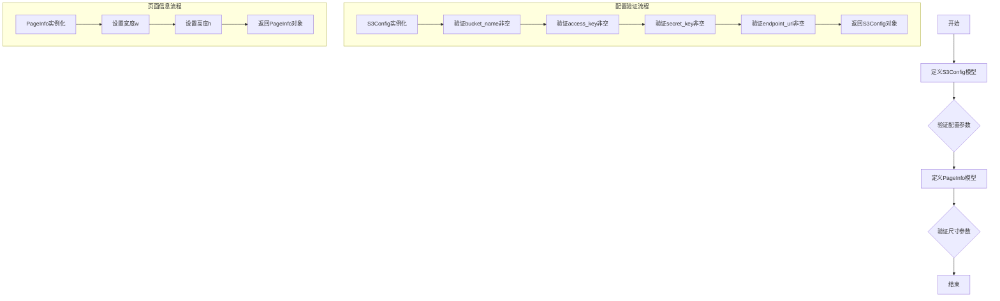

# `MinerU\mineru\data\utils\schemas.py` 详细设计文档

定义了两个Pydantic配置模型类：S3Config用于配置S3存储服务的连接参数（桶名、访问密钥、端点等），PageInfo用于定义页面的宽高尺寸。

## 整体流程



## 类结构

```
BaseModel (Pydantic基类)
├── S3Config (S3配置模型)
└── PageInfo (页面信息模型)
```

## 全局变量及字段


### `S3Config.bucket_name`
    
S3存储桶名称

类型：`str`
    


### `S3Config.access_key`
    
S3访问密钥

类型：`str`
    


### `S3Config.secret_key`
    
S3秘密密钥

类型：`str`
    


### `S3Config.endpoint_url`
    
S3服务端点URL

类型：`str`
    


### `S3Config.addressing_style`
    
S3寻址风格，默认'auto'

类型：`str`
    


### `PageInfo.w`
    
页面宽度

类型：`float`
    


### `PageInfo.h`
    
页面高度

类型：`float`
    
    

## 全局函数及方法


## 关键组件


### S3Config

S3配置数据模型，用于存储和管理S3存储服务的连接配置信息，包含桶名称、访问密钥、密钥、端点URL和寻址样式等配置项。

### PageInfo

页面尺寸信息数据模型，用于表示页面的宽度和高度尺寸信息。

### Pydantic BaseModel

基础验证模型类，提供数据验证、序列化和类型转换功能，支持字段级别的验证规则定义。

### Field 验证器

字段级别的验证装饰器，用于定义字段的约束条件，如最小长度、默认值和描述信息。


## 问题及建议


### 已知问题

- `PageInfo.w` 和 `PageInfo.h` 字段缺少最小值约束，允许传入负数或零等非法页面尺寸值
- `S3Config.addressing_style` 字段无枚举类型限制，允许传入任意字符串而未校验有效值（如 'path'、'virtual'、'auto'）
- `S3Config.endpoint_url` 字段缺少 URL 格式校验，可能接受无效的端点地址
- `S3Config.secret_key` 和 `access_key` 字段仅做非空校验，未对密钥格式或长度做更严格的约束
- 缺少对 S3 配置的运行时校验（如连接测试、凭证有效性验证）
- `PageInfo` 类缺少文档说明其业务用途和上下文

### 优化建议

- 为 `PageInfo.w` 和 `PageInfo.h` 添加 `gt=0` 约束，确保页面尺寸为正数
- 使用 `Literal` 或 `Enum` 类型限制 `addressing_style` 的合法取值范围
- 为 `endpoint_url` 添加 URL 格式验证器或使用 Pydantic 的 `HttpUrl` 类型
- 考虑将 `S3Config` 的部分字段设为可选（如 `region_name`），并提供默认值
- 添加 Pydantic 验证器方法（`model_validator`）以在配置加载时执行跨字段校验（如验证 S3 连接）
- 为类添加更详细的文档字符串，说明业务场景和使用方式


## 其它


### 设计目标与约束

本模块的设计目标是提供两个基础配置数据模型：S3Config用于S3存储服务的连接配置，PageInfo用于页面尺寸信息。约束包括：所有字段必须符合Pydantic的验证规则，S3Config的必填字段不可为空字符串，PageInfo的宽高必须为正数。

### 错误处理与异常设计

Pydantic会自动验证字段类型和约束条件，当验证失败时抛出ValidationError。S3Config的bucket_name、access_key、secret_key、endpoint_url字段设置了min_length=1，确保非空；addressing_style字段设置了默认值'auto'。PageInfo的w和h字段为正数约束（如需可添加gt=0）。

### 外部依赖与接口契约

依赖项：pydantic>=2.0（BaseModel, Field）。S3Config的接口契约为：所有字段为字符串类型，返回经过验证的配置对象，可直接用于boto3等S3客户端的初始化参数。PageInfo接口契约为：w和h为浮点数，返回页面尺寸对象。

### 配置管理

S3Config和PageInfo均支持从字典或JSON通过model_validate()创建实例，也支持通过model_dump()导出为字典。S3Config的addressing_style字段提供了默认值'auto'，简化常见场景的配置。

### 版本兼容性

代码使用Pydantic v2语法（BaseModel, Field），不兼容Pydantic v1。Field的description参数用于生成JSON Schema，min_length等约束在v2中正常工作。

### 测试策略建议

应编写单元测试验证：有效输入能成功创建实例、无效输入（如空字符串、负数）能正确触发ValidationError、默认值正确生效、model_dump和model_validate互为可逆操作。

### 潜在扩展方向

S3Config可添加region字段、SSL验证选项、超时配置等；PageInfo可添加单位（px/mm/inch）支持、多页文档的页面列表管理等。

    