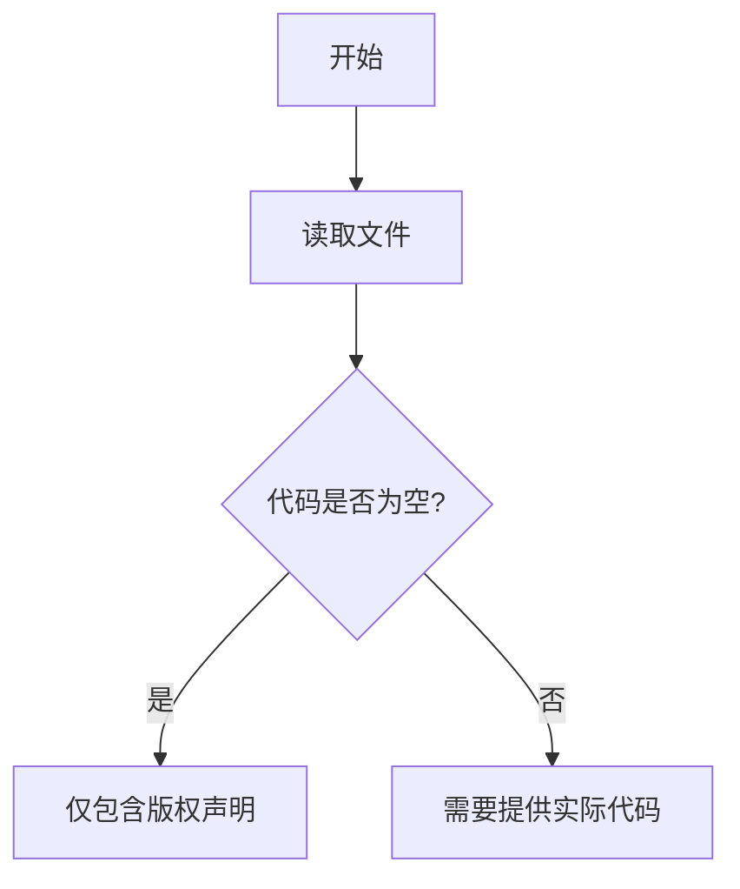

# `MinerU\mineru\model\__init__.py` 详细设计文档

该代码文件仅包含版权声明信息（# Copyright (c) Opendatalab. All rights reserved.），没有实际的业务逻辑实现代码。

## 整体流程



## 类结构

```

```

## 全局变量及字段


    

## 全局函数及方法


## 关键组件


### 1. 一段话描述

无（代码中仅包含版权声明，未提供实际实现代码可供分析）

### 2. 文件的整体运行流程

无（无实际代码实现）

### 3. 类的详细信息

无（无类定义）

### 4. 关键组件信息

无（无关键组件可识别）

### 5. 潜在的技术债务或优化空间

无（无代码可供分析）

### 6. 其它项目

- 设计目标与约束：无
- 错误处理与异常设计：无
- 数据流与状态机：无
- 外部依赖与接口契约：无


## 问题及建议


### 已知问题

-   代码文件仅包含版权声明，无实际功能实现代码，无法进行有效的技术分析和优化建议
-   缺少业务逻辑代码，无法评估架构设计、模块划分、函数实现等技术层面
-   无法识别潜在的代码异味、性能问题、错误处理缺陷等技术债务
-   没有实际的类、函数或变量定义，无法进行文档化和分析

### 优化建议

-   提供完整的源代码文件以便进行深入的技术分析和文档编写
-   如果这是初始模板或占位文件，建议添加基本的代码框架（如必要的import语句、基础类结构等）
-   补充实际业务逻辑代码后再进行技术债务评估和优化建议
-   建议在后续版本中补充：完整的业务逻辑、错误处理机制、日志记录、单元测试等


## 其它


由于提供的代码仅包含版权声明信息，没有实际的代码实现，因此无法基于代码生成完整的详细设计文档。但根据您列出的内容框架，详细设计文档还应该包含以下项目：

### 设计目标与约束

无法填写（无实际代码）

### 错误处理与异常设计

无法填写（无实际代码）

### 数据流与状态机

无法填写（无实际代码）

### 外部依赖与接口契约

无法填写（无实际代码）

### 安全性考虑

无法填写（无实际代码）

### 性能要求

无法填写（无实际代码）

### 兼容性设计

无法填写（无实际代码）

### 测试策略

无法填写（无实际代码）

### 部署和运维 considerations

无法填写（无实际代码）

### 版本控制和变更管理

无法填写（无实际代码）

### 监控和日志记录策略

无法填写（无实际代码）

### 国际化支持

无法填写（无实际代码）


    