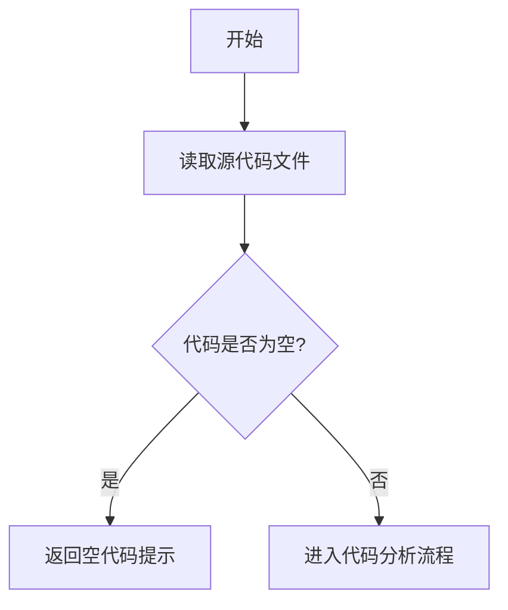

# `MinerU\mineru\model\layout\__init__.py` 详细设计文档

该文件仅包含版权声明，没有实际的代码实现。需要提供完整的源代码才能进行详细的设计文档分析。

## 整体流程



## 类结构

```
该代码没有类结构
```

## 全局变量及字段


    

## 全局函数及方法


## 关键组件


本代码片段仅包含版权声明信息，未包含任何实现代码，因此无法识别出具体的组件、功能模块或设计元素。


## 问题及建议


### 已知问题

-   代码文件仅包含版权声明，没有任何实际功能实现
-   缺少源代码文件，无法进行完整的架构设计和逻辑分析
-   没有类、函数、全局变量等可分析的技术组件

### 优化建议

-   提供完整的源代码文件以进行详细分析
-   确保代码文件包含实际的功能实现，而不仅仅是版权声明
-   如果这是占位文件，需要补充具体的业务逻辑代码
-   建议添加完整的模块化代码结构，包括必要的类定义和函数实现


## 其它


### 一段话描述

由于提供的代码仅包含版权声明（`# Copyright (c) Opendatalab. All rights reserved.`），无实际功能代码实现，因此无法提供核心功能描述。

### 文件的整体运行流程

由于代码仅包含版权声明，无实际可执行代码，因此不涉及运行流程。

### 类的详细信息

由于代码仅包含版权声明，无实际类定义，因此不涉及类结构。

### 类字段

由于代码仅包含版权声明，无实际类定义，因此不涉及类字段。

### 类方法

由于代码仅包含版权声明，无实际类定义，因此不涉及类方法。

### 全局变量

由于代码仅包含版权声明，无实际全局变量定义，因此不涉及全局变量。

### 全局函数

由于代码仅包含版权声明，无实际全局函数定义，因此不涉及全局函数。

### 关键组件信息

由于代码仅包含版权声明，无实际功能代码，因此不涉及关键组件。

### 潜在的技术债务或优化空间

由于代码仅包含版权声明，无实际代码可供分析，因此无法识别技术债务或优化空间。

### 设计目标与约束

【待补充】

### 错误处理与异常设计

【待补充】

### 数据流与状态机

【待补充】

### 外部依赖与接口契约

【待补充】

### 性能要求与指标

【待补充】

### 安全性考虑

【待补充】

### 兼容性设计

【待补充】

### 测试策略

【待补充】

### 部署与配置

【待补充】


    