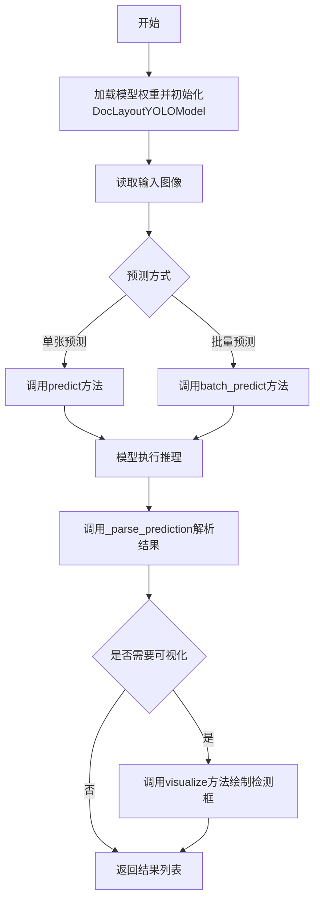
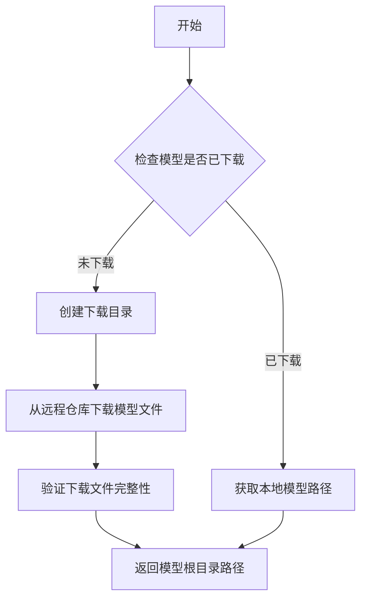
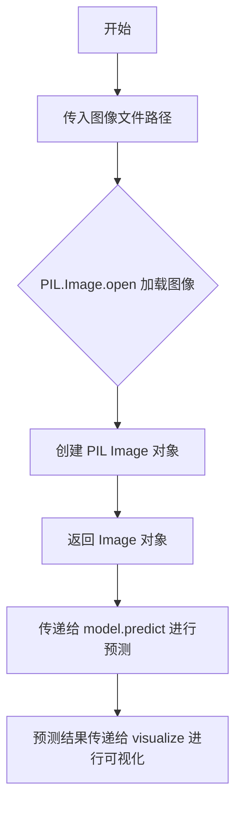
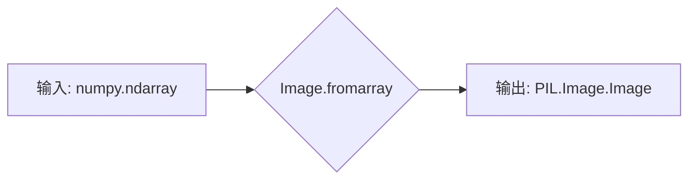
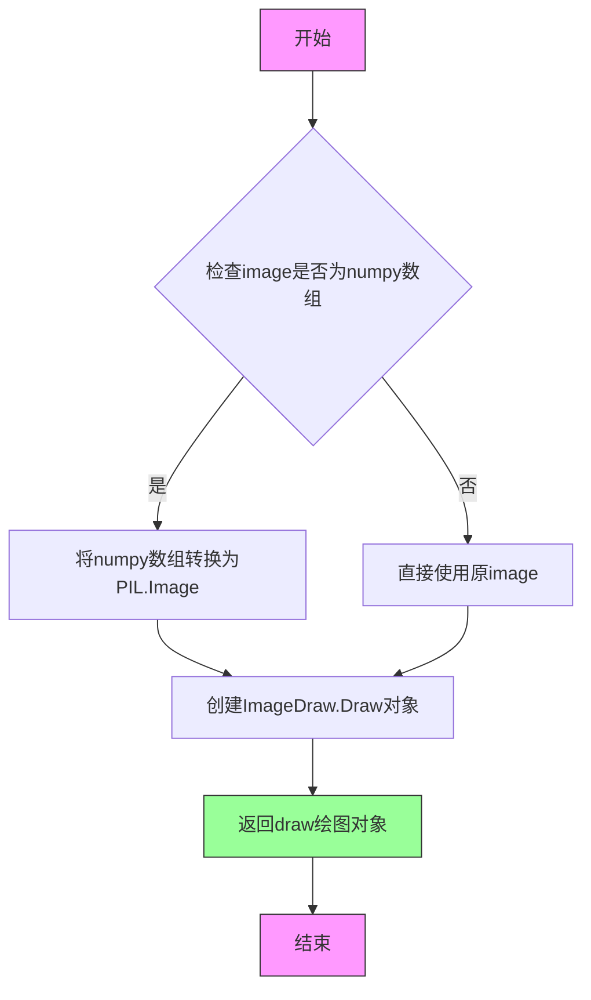
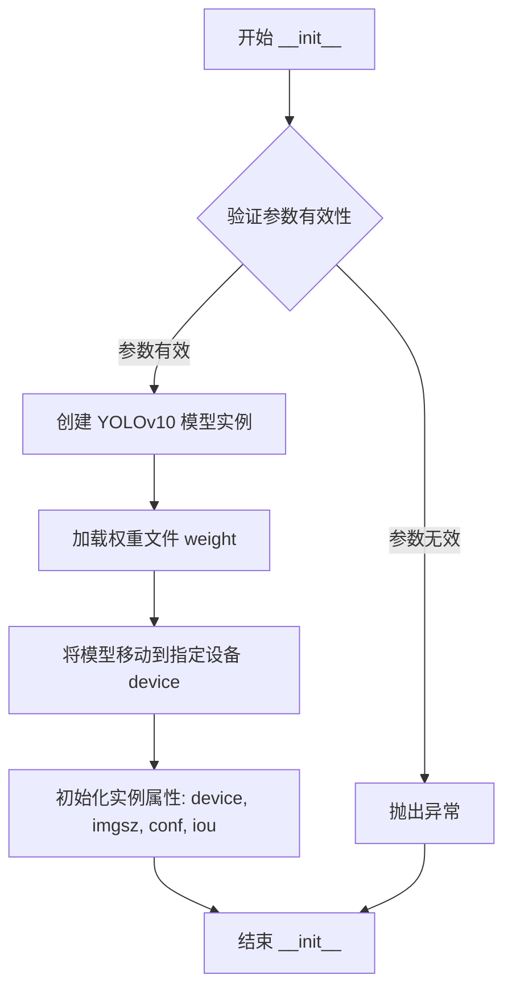
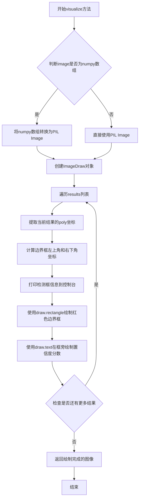

# `MinerU\mineru\model\layout\doclayoutyolo.py` 详细设计文档

这是一个文档布局检测模型封装类，基于YOLOv10实现对文档图片中的布局元素（如文本块、图像、表格等）进行目标检测，支持单张和批量预测，并提供结果可视化功能。

## 整体流程



## 类结构

```
DocLayoutYOLOModel (文档布局检测模型类)
└── YOLOv10 (底层YOLO模型，由doclayout_yolo库提供)
```

## 全局变量及字段


### `image_path`
    
测试用图片路径

类型：`str`
    


### `doclayout_yolo_weights`
    
模型权重文件路径

类型：`str`
    


### `device`
    
计算设备类型

类型：`str`
    


### `model`
    
模型实例

类型：`DocLayoutYOLOModel`
    


### `image`
    
读取的输入图像

类型：`Image.Image`
    


### `results`
    
预测结果列表

类型：`List[Dict]`
    


### `DocLayoutYOLOModel.model`
    
YOLOv10模型实例

类型：`YOLOv10`
    


### `DocLayoutYOLOModel.device`
    
运行设备（cuda/cpu）

类型：`str`
    


### `DocLayoutYOLOModel.imgsz`
    
输入图像尺寸

类型：`int`
    


### `DocLayoutYOLOModel.conf`
    
置信度阈值

类型：`float`
    


### `DocLayoutYOLOModel.iou`
    
IOU阈值

类型：`float`
    
    

## 全局函数及方法


### `auto_download_and_get_model_root_path`

自动下载并获取模型根目录路径。该函数接受一个模型路径枚举值，自动下载对应的模型文件（如果尚未下载），并返回模型文件所在的根目录路径。

参数：

- `model_path`：`ModelPath`，模型路径枚举值，指定需要下载/获取的模型类型（如 doclayout_yolo）

返回值：`str`，返回模型根目录的绝对路径

#### 流程图



#### 带注释源码

```python
# 从 mineru.utils.models_download_utils 模块导入
# 该函数定义在 mineru/utils/models_download_utils.py 文件中
from mineru.utils.models_download_utils import auto_download_and_get_model_root_path

# 使用示例（在 __main__ 方法中）
# 1. 获取 doclayout_yolo 模型的根目录路径
model_root_path = auto_download_and_get_model_root_path(ModelPath.doclayout_yolo)

# 2. 结合模型文件名获取完整权重路径
doclayout_yolo_weights = os.path.join(
    model_root_path,  # 模型根目录
    ModelPath.doclayout_yolo  # 模型文件名
)

# 3. 使用完整路径初始化模型
model = DocLayoutYOLOModel(
    weight=doclayout_yolo_weights,
    device=device,
)
```

#### 推断的实现逻辑

基于代码中的使用方式，该函数的典型实现逻辑如下：

```python
def auto_download_and_get_model_root_path(model_path: ModelPath) -> str:
    """
    自动下载模型（如果需要）并返回模型根目录路径
    
    Args:
        model_path: 模型路径枚举，包含模型名称和远程URL信息
        
    Returns:
        模型文件所在的本地根目录路径
    """
    # 1. 确定本地模型存储根目录
    # 通常在用户主目录下的 .mineru 或类似隐藏目录中
    root_dir = os.path.expanduser("~/.mineru/models")
    
    # 2. 创建目录（如果不存在）
    os.makedirs(root_dir, exist_ok=True)
    
    # 3. 构建模型特定的目标路径
    model_dir = os.path.join(root_dir, model_path.value)
    
    # 4. 检查模型文件是否已存在
    if not os.path.exists(model_dir):
        # 4.1 如果不存在，从远程URL下载
        # download_from_url(model_path.url, model_dir)
        pass
    
    # 5. 返回模型根目录路径
    return root_dir
```

#### 注意事项

- 该函数定义在外部模块 `mineru.utils.models_download_utils` 中，源代码未在当前文件中提供
- 函数内部逻辑需要访问 `ModelPath` 枚举类来获取模型名称和下载链接信息
- 实际实现可能包含下载进度显示、哈希校验、增量更新等功能
- 模型文件通常缓存在用户本地目录，以避免重复下载


### `YOLOv10`

这是来自doclayout_yolo库的YOLOv10目标检测模型类，用于文档布局分析任务。该类是YOLOv10模型的构造函数，负责加载模型权重并初始化模型实例。

参数：

- `weight`：`str`，模型权重文件路径，指定要加载的预训练模型权重

返回值：`YOLOv10`（模型实例），返回初始化后的YOLOv10模型对象

#### 流程图

```mermaid
flowchart TD
    A[开始] --> B[接收weight参数]
    B --> C[从权重文件加载模型]
    C --> D[返回YOLOv10模型实例]
    
    subgraph 在DocLayoutYOLOModel中的使用
    E[DocLayoutYOLOModel.__init__] --> F[创建YOLOv10模型实例]
    F --> G[调用.to(device)方法]
    G --> H[将模型移动到指定设备]
    end
    
    D --> E
```

#### 带注释源码

```python
# 来自 doclayout_yolo 库的 YOLOv10 模型类
# 使用方式（在 DocLayoutYOLOModel 类中）:

# 1. 导入 YOLOv10 类
from doclayout_yolo import YOLOv10

# 2. 在 DocLayoutYOLOModel 的构造函数中实例化
class DocLayoutYOLOModel:
    def __init__(
        self,
        weight: str,
        device: str = "cuda",
        imgsz: int = 1280,
        conf: float = 0.1,
        iou: float = 0.45,
    ):
        # 创建 YOLOv10 模型实例
        # 参数: weight - 模型权重路径
        # 返回: YOLOv10 模型对象
        self.model = YOLOv10(weight).to(device)  # .to(device)将模型移动到指定设备
        
        # 保存配置参数
        self.device = device
        self.imgsz = imgsz
        self.conf = conf
        self.iou = iou

# 注意: YOLOv10 类的具体源码属于 doclayout_yolo 库
# 这里展示的是该类在项目中的使用方式
# 
# YOLOv10 类的典型接口推断:
# class YOLOv10:
#     def __init__(self, weights: str):
#         """加载模型权重"""
#         ...
#     
#     def predict(self, image, imgsz=..., conf=..., iou=..., verbose=...):
#         """执行推理预测"""
#         ...
#     
#     def to(self, device):
#         """将模型移动到指定设备"""
#         ...
```


### `Image.open`

`Image.open` 是 PIL (Pillow) 库中的函数，用于打开并读取图像文件。在该代码中用于加载待检测的文档图像文件。

参数：

- `image_path`：`str`，图像文件的路径，指向待处理的图像文件（代码中为 `r"C:\Users\zhaoxiaomeng\Downloads\下载1.jpg"`）

返回值：`PIL.Image.Image`，返回打开后的 PIL 图像对象，可用于后续的预测和可视化处理

#### 流程图



#### 带注释源码

```python
# 在 main 块中使用 Image.open 打开图像文件
if __name__ == '__main__':
    image_path = r"C:\Users\zhaoxiaomeng\Downloads\下载1.jpg"  # 定义图像文件路径
    # ... 模型初始化代码 ...
    
    # 使用 PIL 的 Image.open 函数打开图像文件
    # 参数: image_path - 图像文件的路径字符串
    # 返回值: image - PIL Image 对象
    image = Image.open(image_path)
    
    # 对打开的图像进行布局检测预测
    results = model.predict(image)
    
    # 可视化检测结果
    image = model.visualize(image, results)
    
    # 显示图像
    image.show()  # 显示图像
```

**调用位置**：代码第 91 行

**上下文说明**：在 `DocLayoutYOLOModel` 类的使用示例中，`Image.open` 用于加载本地图像文件，然后将其传递给模型的 `predict` 方法进行文档布局检测。该函数是 Pillow 库的核心函数，支持多种图像格式（如 JPEG、PNG、BMP 等）的读取。


### `Image.fromarray`

该函数是 Python Pillow 库 (`PIL`) 提供的标准函数，用于将 numpy 数组转换为 PIL Image 对象。在本项目代码中，它被用于 `DocLayoutYOLOModel.visualize` 方法中，根据输入图像的类型（如果是 numpy 数组）进行转换，以便后续使用 PIL 的 `ImageDraw` 进行绘制可视化。

参数：

- `array`：`numpy.ndarray`，待转换的图像数据数组。在代码中对应传入的 `image` 变量（经 `isinstance` 检查为 numpy 数组后的参数）。

返回值：`PIL.Image.Image`，转换成功后得到的 PIL 图像对象，可用于绘图操作。

#### 流程图



#### 带注释源码

```python
# 在类 DocLayoutYOLOModel 的 visualize 方法中使用
def visualize(self, image: Union[np.ndarray, Image.Image], results: List) -> Image.Image:
    # ... 省略其他代码 ...
    
    # 容错处理与类型判断：如果输入的 image 是 numpy 数组
    if isinstance(image, np.ndarray):
        # 调用 PIL 的 Image.fromarray 将 numpy 数组转换为 PIL Image 对象
        # 这一步是为了统一图像类型，以便后续使用 ImageDraw 进行绘制
        image = Image.fromarray(image)
        
    # ... 后续绘图代码 ...
```


### `ImageDraw.Draw`

创建图像绘制对象，用于在图像上绘制矩形、文本等可视化元素

参数：

- `image`：`PIL.Image.Image`，需要进行绘制的目标图像对象，可以是RGB或其他支持的图像模式

返回值：`PIL.ImageDraw.Draw`，返回的绘图对象实例，用于在图像上执行各种绘图操作（如矩形、文本等）

#### 流程图



#### 带注释源码

```python
# 在DocLayoutYOLOModel类的visualize方法中使用ImageDraw.Draw
def visualize(
        self,
        image: Union[np.ndarray, Image.Image],
        results: List
) -> Image.Image:
    """
    可视化检测结果
    
    参数:
        image: 输入图像,可以是numpy数组或PIL图像
        results: 检测结果列表,包含每个检测框的坐标、类别和置信度
    
    返回值:
        绘制了检测框和置信度的图像
    """
    
    # 如果输入是numpy数组,将其转换为PIL Image对象
    # 这是ImageDraw.Draw所要求的输入类型
    if isinstance(image, np.ndarray):
        image = Image.fromarray(image)
    
    # ===== 核心代码:创建图像绘制对象 =====
    # ImageDraw.Draw()接受一个图像对象作为参数
    # 返回一个Draw对象,该对象提供多种绘图方法:
    # - rectangle(): 绘制矩形框
    # - text(): 在指定位置绘制文本
    # - line(): 绘制线条
    # - ellipse(): 绘制椭圆
    # - polygon(): 绘制多边形
    draw = ImageDraw.Draw(image)
    # =====================================
    
    # 遍历所有检测结果,在图像上绘制框和置信度文本
    for res in results:
        # 从poly中提取边界框坐标
        poly = res['poly']
        xmin, ymin, xmax, ymax = poly[0], poly[1], poly[4], poly[5]
        
        # 打印检测信息到控制台
        print(
            f"Detected box: {xmin}, {ymin}, {xmax}, {ymax}, "
            f"Category ID: {res['category_id']}, Score: {res['score']}"
        )
        
        # 使用draw对象的rectangle方法绘制边界框
        # 参数1: 矩形坐标 [x1, y1, x2, y2]
        # 参数2: outline="red" 设置边框颜色为红色
        # 参数3: width=2 设置边框宽度为2像素
        draw.rectangle([xmin, ymin, xmax, ymax], outline="red", width=2)
        
        # 使用draw对象的text方法在框旁边绘制置信度
        # 参数1: 文本位置 (x, y)
        # 参数2: 要绘制的文本内容
        # 参数3: fill="red" 设置文本颜色
        # 参数4: font_size 设置字体大小
        draw.text((xmax + 10, ymin + 10), f"{res['score']:.2f}", 
                  fill="red", font_size=22)
    
    # 返回绘制后的图像对象
    return image
```


### `DocLayoutYOLOModel.__init__`

该方法是 `DocLayoutYOLOModel` 类的构造函数，负责初始化模型加载和参数配置。它接受模型权重路径、计算设备、图像尺寸、置信度阈值和 IOU 阈值等参数，创建 YOLOv10 模型实例并将其移动到指定设备，同时将配置参数存储为实例属性供后续预测使用。

参数：

-  `self`：隐式参数，表示类的实例本身
-  `weight`：`str`，模型权重文件路径，指定要加载的 YOLOv10 模型权重
-  `device`：`str`，默认值为 `"cuda"`，计算设备，用于指定模型运行的硬件设备（如 cuda 或 cpu）
-  `imgsz`：`int`，默认值为 `1280`，输入图像尺寸，推理时将图像resize到此尺寸
-  `conf`：`float`，默认值为 `0.1`，置信度阈值，用于过滤低置信度的检测结果
-  `iou`：`float`，默认值为 `0.45`，IOU 阈值，用于非极大值抑制（NMS）操作

返回值：`None`，构造函数不返回值，仅初始化实例属性

#### 流程图



#### 带注释源码

```python
def __init__(
    self,
    weight: str,
    device: str = "cuda",
    imgsz: int = 1280,
    conf: float = 0.1,
    iou: float = 0.45,
):
    """
    初始化 DocLayoutYOLOModel 模型实例
    
    参数:
        weight: 模型权重文件路径
        device: 计算设备，默认为 cuda
        imgsz: 输入图像尺寸，默认为 1280
        conf: 置信度阈值，默认为 0.1
        iou: IOU 阈值，默认为 0.45
    """
    # 使用传入的权重路径创建 YOLOv10 模型，并将其移动到指定设备
    # YOLOv10 是基于 Ultralytics 框架的目标检测模型
    self.model = YOLOv10(weight).to(device)
    
    # 存储设备信息到实例属性，供后续 predict 方法使用
    self.device = device
    
    # 存储图像尺寸配置
    self.imgsz = imgsz
    
    # 存储置信度阈值，用于过滤低置信度检测框
    self.conf = conf
    
    # 存储 IOU 阈值，用于非极大值抑制
    self.iou = iou
```


### `DocLayoutYOLOModel._parse_prediction`

该方法负责将YOLO目标检测模型的原始预测结果转换为标准化的布局检测结果格式，通过解析边界框坐标、置信度分数和类别信息，并将其整理为包含类别ID、多边形坐标和置信度的字典列表。

参数：

- `prediction`：模型预测结果对象，包含`boxes`属性（包含`xyxy`、`conf`、`cls`等子属性）

返回值：`List[Dict]` ，返回标准化后的布局检测结果列表，每个元素包含`category_id`（类别ID）、`poly`（多边形坐标列表）、`score`（置信度分数）

#### 流程图

```mermaid
flowchart TD
    A[开始解析预测结果] --> B{检查 prediction.boxes 是否存在且不为空}
    B -->|否| C[返回空列表 layout_res]
    B -->|是| D[遍历 prediction.boxes 中的每个检测结果]
    D --> E[提取 xyxy 坐标并转换为整数列表]
    E --> F[解包坐标: xmin, ymin, xmax, ymax]
    F --> G[构建布局结果字典]
    G --> H[添加 category_id: 类别ID]
    G --> I[添加 poly: 矩形多边形坐标 [xmin,ymin,xmax,ymin,xmax,ymax,xmin,ymax]]
    G --> J[添加 score: 保留3位小数的置信度分数]
    H --> K[将字典添加到 layout_res 列表]
    K --> D
    D --> L[返回 layout_res 结果列表]
```

#### 带注释源码

```python
def _parse_prediction(self, prediction) -> List[Dict]:
    """
    解析YOLO模型的预测结果为标准化的布局检测格式
    
    参数:
        prediction: YOLOv10模型的预测结果对象，包含boxes属性
    
    返回:
        List[Dict]: 标准化布局结果列表，每个字典包含:
            - category_id: 类别ID (int)
            - poly: 多边形坐标列表 [xmin,ymin,xmax,ymin,xmax,ymax,xmin,ymax] (List[int])
            - score: 置信度分数，保留3位小数 (float)
    """
    # 初始化结果列表
    layout_res = []

    # 容错处理：检查prediction对象是否有boxes属性且不为None
    if not hasattr(prediction, "boxes") or prediction.boxes is None:
        return layout_res

    # 遍历所有检测到的目标
    # zip组合三个并行数据：边界框坐标、置信度、类别
    for xyxy, conf, cls in zip(
        prediction.boxes.xyxy.cpu(),      # 边界框坐标 [x1,y1,x2,y2]
        prediction.boxes.conf.cpu(),       # 置信度分数
        prediction.boxes.cls.cpu(),        # 类别ID
    ):
        # 将坐标转换为整数列表
        coords = list(map(int, xyxy.tolist()))
        
        # 解包边界框坐标
        xmin, ymin, xmax, ymax = coords
        
        # 构建标准化的布局结果字典
        # poly为8点多边形表示（矩形），按顺时针或逆时针顺序
        layout_res.append({
            "category_id": int(cls.item()),      # 转换为Python int类型
            "poly": [xmin, ymin, xmax, ymin, xmax, ymax, xmin, ymax],  # 矩形4顶点展开为8点
            "score": round(float(conf.item()), 3),  # 保留3位小数
        })
    
    # 返回标准化后的布局检测结果列表
    return layout_res
```


### `DocLayoutYOLOModel.predict`

该方法用于对单张图像进行布局检测（Layout Detection），通过调用底层的 YOLOv10 模型对输入图像进行推理，并返回解析后的布局结果列表。

参数：

-  `self`：实例对象，隐含参数
-  `image`：`Union[np.ndarray, Image.Image]`，待检测的输入图像，可以是 NumPy 数组格式或 PIL Image 对象

返回值：`List[Dict]`，布局检测结果列表，每个字典包含 `category_id`（类别 ID）、`poly`（多边形坐标列表）、`score`（置信度得分）

#### 流程图

```mermaid
flowchart TD
    A[开始: 输入图像 image] --> B{调用 self.model.predict}
    B --> C[传入参数: imgsz, conf, iou, verbose]
    C --> D[获取第一个预测结果 prediction[0]]
    D --> E[调用 self._parse_prediction 解析预测结果]
    E --> F[返回解析后的布局结果列表 List[Dict]]
    
    subgraph _parse_prediction 内部处理
        G[检查 prediction.boxes 是否存在]
        G --> H{boxes 存在?}
        H -->|否| I[返回空列表]
        H -->|是| J[遍历每个检测框]
        J --> K[提取 xyxy 坐标、置信度、类别]
        K --> L[构建包含 category_id, poly, score 的字典]
        L --> M[将字典添加到结果列表]
    end
    
    E --> G
```

#### 带注释源码

```python
def predict(self, image: Union[np.ndarray, Image.Image]) -> List[Dict]:
    """
    对单张图像进行布局检测
    
    Args:
        image: 输入图像，支持 NumPy 数组或 PIL Image 对象
        
    Returns:
        布局检测结果列表，每个元素包含:
            - category_id: 类别 ID (int)
            - poly: 多边形顶点坐标列表 [xmin, ymin, xmax, ymin, xmax, ymax, xmin, ymax] (List[int])
            - score: 置信度得分，保留3位小数 (float)
    """
    # 调用底层 YOLOv10 模型的 predict 方法进行推理
    # 参数说明:
    #   - image: 输入图像
    #   - imgsz: 输入图像尺寸，默认 1280
    #   - conf: 置信度阈值，默认 0.1
    #   - iou: NMS 的 IOU 阈值，默认 0.45
    #   - verbose: 是否输出详细日志，设为 False 减少输出
    prediction = self.model.predict(
        image,
        imgsz=self.imgsz,
        conf=self.conf,
        iou=self.iou,
        verbose=False
    )[0]  # 取第一个（也是唯一的）预测结果
    
    # 调用内部方法 _parse_prediction 将原始预测结果解析为标准格式
    return self._parse_prediction(prediction)
```


### `DocLayoutYOLOModel.batch_predict`

该方法是 DocLayoutYOLOModel 类的批量预测功能，通过分批处理图像列表来提高布局检测的效率，并根据批量大小动态调整置信度阈值，最终返回所有图像的布局检测结果列表。

参数：

- `images`：`List[Union[np.ndarray, Image.Image]]`，待检测的图像列表，支持 NumPy 数组或 PIL Image 对象
- `batch_size`：`int = 4`，每次推理的批量大小，默认为 4

返回值：`List[List[Dict]]`，返回所有图像的检测结果，外层列表长度为图像数量，内层列表为每张图像的所有检测框结果，每个检测框包含 category_id（类别 ID）、poly（多边形坐标）、score（置信度分数）

#### 流程图

```mermaid
flowchart TD
    A[开始 batch_predict] --> B[初始化空结果列表 results]
    B --> C[创建 tqdm 进度条]
    C --> D{idx < len(images)?}
    D -->|Yes| E[获取当前批次图像 batch]
    E --> F{批量大小是否为1?}
    F -->|Yes| G[设置 conf = 0.9 * self.conf]
    F -->|No| H[设置 conf = self.conf]
    G --> I[调用 model.predict 进行批量预测]
    H --> I
    I --> J[遍历预测结果]
    J --> K[调用 _parse_prediction 解析每个预测结果]
    K --> L[将解析结果添加到 results]
    L --> M[更新进度条 pbar]
    M --> D
    D -->|No| N[返回 results 结果列表]
    N --> O[结束]
```

#### 带注释源码

```python
def batch_predict(
    self,
    images: List[Union[np.ndarray, Image.Image]],
    batch_size: int = 4
) -> List[List[Dict]]:
    """
    批量图像布局检测
    
    参数:
        images: 待检测的图像列表，支持np.ndarray或PIL.Image.Image格式
        batch_size: 每次模型推理的图像数量，默认为4
    
    返回:
        所有图像的检测结果列表，每个元素是一张图像的检测结果列表
    """
    # 初始化结果列表，用于存储所有图像的检测结果
    results = []
    
    # 创建进度条，total表示总图像数量，desc为进度条描述
    with tqdm(total=len(images), desc="Layout Predict") as pbar:
        # 按batch_size步长遍历图像列表
        for idx in range(0, len(images), batch_size):
            # 获取当前批次的图像切片
            batch = images[idx: idx + batch_size]
            
            # 根据批量大小动态调整置信度阈值
            # 当批量大小为1时，降低置信度阈值以提高检测灵敏度
            if batch_size == 1:
                conf = 0.9 * self.conf
            else:
                conf = self.conf
            
            # 调用YOLO模型进行批量预测
            # imgsz: 输入图像尺寸
            # conf: 置信度阈值
            # iou: 非极大值抑制的IOU阈值
            # verbose: 关闭详细输出
            predictions = self.model.predict(
                batch,
                imgsz=self.imgsz,
                conf=conf,
                iou=self.iou,
                verbose=False,
            )
            
            # 遍历当前批次的每个预测结果
            for pred in predictions:
                # 使用_parse_prediction方法将预测结果解析为标准格式
                results.append(self._parse_prediction(pred))
            
            # 更新进度条，显示已处理的图像数量
            pbar.update(len(batch))
    
    # 返回所有图像的检测结果
    return results
```


### `DocLayoutYOLOModel.visualize`

该方法用于在图像上可视化文档布局检测结果，将检测到的布局元素（如文本块、表格、图像等）以边界框的形式绘制在原图上，并在框旁边标注检测置信度分数，便于直观查看模型预测效果。

参数：

- `self`：`DocLayoutYOLOModel`，类实例本身
- `image`：`Union[np.ndarray, Image.Image]`，输入图像，可以是NumPy数组格式或PIL Image格式
- `results`：`List`，检测结果列表，每个元素为一个字典，包含检测框的坐标、多边形点、类别ID和置信度分数

返回值：`Image.Image`，绘制了检测框和置信度分数的PIL Image对象

#### 流程图



#### 带注释源码

```python
def visualize(
        self,
        image: Union[np.ndarray, Image.Image],
        results: List
) -> Image.Image:
    """
    在图像上绘制检测结果框和置信度分数
    
    参数:
        image: 输入图像，支持numpy数组或PIL Image格式
        results: 检测结果列表，每个元素包含poly、category_id和score字段
    
    返回:
        绘制了检测框和置信度分数的PIL Image对象
    """
    
    # 如果输入是numpy数组，转换为PIL Image以便后续绘图操作
    if isinstance(image, np.ndarray):
        image = Image.fromarray(image)

    # 创建ImageDraw对象，用于在图像上绘制图形
    draw = ImageDraw.Draw(image)
    
    # 遍历每个检测结果
    for res in results:
        # 从结果中提取多边形坐标点
        poly = res['poly']
        
        # 从多边形中提取边界框坐标
        # poly格式为[x1, y1, x2, y1, x2, y2, x1, y2]
        # 所以xmin=poly[0], ymin=poly[1], xmax=poly[4], ymax=poly[5]
        xmin, ymin, xmax, ymax = poly[0], poly[1], poly[4], poly[5]
        
        # 打印检测到的框信息到控制台，便于调试和查看
        print(
            f"Detected box: {xmin}, {ymin}, {xmax}, {ymax}, Category ID: {res['category_id']}, Score: {res['score']}")
        
        # 使用PIL在图像上画红色矩形框，width=2表示线条宽度
        draw.rectangle([xmin, ymin, xmax, ymax], outline="red", width=2)
        
        # 在框右边绘制置信度分数，位置为(xmax+10, ymin+10)即框的右上角外侧
        # font_size=22设置字体大小
        draw.text((xmax + 10, ymin + 10), f"{res['score']:.2f}", fill="red", font_size=22)
    
    # 返回绘制完成的图像对象
    return image
```

## 关键组件


### 张量索引与惰性加载

代码中使用.cpu()方法将张量从GPU转移到CPU进行后续处理，使用.item()方法将张量标量转换为Python原生类型，避免了不必要的数据拷贝和GPU内存占用。

### 预测结果解析

_parse_prediction方法负责将YOLOv10模型的原始输出转换为标准化的布局检测结果格式，包含类别ID、多边形坐标和置信度分数。

### 批量预测优化

batch_predict方法实现了批量推理功能，通过动态调整置信度阈值（单图时使用0.9倍置信度）来平衡推理速度和检测精度，使用tqdm进度条提供实时反馈。

### 模型可视化

visualize方法使用PIL库在原图上绘制检测框和置信度分数，支持numpy数组和PIL图像两种输入格式。


## 问题及建议


### 已知问题

- **错误处理不足**：predict和batch_predict方法缺少对模型预测失败的异常捕获，当模型预测返回空结果或异常时可能导致程序崩溃
- **输入验证缺失**：未对输入图像的有效性进行检查，如图像格式、通道数、尺寸等，可能导致运行时错误
- **内存优化不足**：_parse_prediction方法中多次调用.cpu()和.item()，每次循环都进行张量到Python对象的转换，效率较低
- **资源管理问题**：类中没有实现模型卸载或GPU内存释放的接口，长时间运行可能导致显存泄漏
- **硬编码阈值**：batch_predict中batch_size为1时使用0.9*self.conf的逻辑缺乏文档说明，且这种动态调整阈值的策略可能导致结果不一致
- **日志输出不规范**：visualize方法中使用print语句而非标准日志模块，不利于生产环境下的日志管理
- **类型注解不完整**：visualize方法中results参数缺少具体的元素类型注解(List[Any]应更精确)
- **配置参数暴露不足**：类中没有提供动态调整conf、iou等推理参数的公共接口

### 优化建议

- 在predict和batch_predict方法中添加try-except块，捕获模型预测可能的异常情况
- 添加静态方法或验证函数检查输入图像的有效性（尺寸、格式、通道数等）
- 考虑使用向量化的张量操作一次性提取所有结果，减少循环中的.item()调用
- 实现__del__方法或在类中添加cleanup/release方法用于释放模型资源
- 将batch_size=1时的conf调整逻辑封装为可配置的方法，或提供配置选项
- 使用logging模块替代print语句
- 完善类型注解，为visualize方法的results参数添加详细的类型定义
- 添加set_conf、set_iou等方法支持运行时动态调整推理参数
- 考虑添加模型预热(warmup)接口，首次预测时可能存在CUDA内核初始化延迟
- 可以添加结果缓存机制，对于相同图像避免重复推理


## 其它


### 设计目标与约束

本模块的设计目标是通过YOLOv10模型实现文档布局检测，能够识别文档中的各类布局元素（如文本、图像、表格等），并返回检测框坐标、类别和置信度。约束条件包括：输入图像尺寸限制（默认1280x1280）、设备限制（需支持CUDA的GPU）、批量处理时内存管理、以及对推理速度的要求。

### 错误处理与异常设计

代码中包含以下错误处理机制：1）_parse_prediction方法中对prediction对象进行容错处理，检查是否存在boxes属性且不为空；2）predict方法中假设模型必然返回结果，未做异常捕获；3）batch_predict中未对空图像列表或模型预测失败进行特殊处理；4）visualize方法中对numpy数组进行PIL Image转换。改进建议：添加模型加载失败、图像格式不支持、GPU内存不足等场景的异常处理。

### 数据流与状态机

数据流主要分为三条路径：1）单图预测流程：输入图像→模型预测→解析结果→返回布局列表；2）批量预测流程：图像列表→分批处理→模型预测→解析每张图像→汇总结果；3）可视化流程：原始图像+结果列表→坐标提取→绘制矩形框和置信度→返回带标注图像。状态机相对简单，主要在批量预测时根据batch_size动态调整置信度阈值（batch_size=1时conf降低10%）。

### 外部依赖与接口契约

核心依赖包括：1）doclayout_yolo：YOLOv10模型实现；2）PIL/Pillow：图像处理和可视化；3）numpy：数值计算；4）tqdm：进度条显示；5）mineru.utils.enum_class.ModelPath和mineru.utils.models_download_utils：模型路径管理和自动下载。接口契约：predict方法接受np.ndarray或Image.Image，返回List[Dict]；batch_predict方法接受图像列表和batch_size，返回List[List[Dict]]；visualize方法接受图像和结果列表，返回带标注的Image.Image。

### 配置参数说明

关键配置参数包括：weight（模型权重路径，必填）、device（推理设备，默认cuda）、imgsz（输入图像尺寸，默认1280）、conf（置信度阈值，默认0.1）、iou（IOU阈值，默认0.45）、batch_size（批量大小，默认4）。其中conf和iou值相对较低，可能需要根据实际应用场景调整以平衡召回率和精确率。

### 性能考虑与优化建议

当前实现存在以下性能瓶颈：1）每次预测都重新设置imgsz、conf等参数，可考虑缓存；2）批量预测时逐个解析结果，可向量化处理；3）可视化方法中逐个绘制效率较低；4）未使用模型预热（warmup）机制。优化方向：添加模型预热、使用异步推理、结果缓存、GPU显存优化等措施。

### 安全性考虑

当前代码安全性考虑较少，建议添加：1）权重文件完整性校验（防止篡改）；2）输入图像尺寸和格式验证（防止恶意大图或畸形图像攻击）；3）模型路径合法性检查（防止路径遍历攻击）；4）敏感信息脱敏处理（结果中的坐标信息）。

### 版本兼容性与环境要求

依赖版本要求：Python 3.8+、torch 2.0+、CUDA 11.0+（如使用GPU）、Pillow 9.0+、numpy 1.21+、tqdm 4.60+。模型权重需与doclayout_yolo版本匹配。当前代码直接使用ModelPath枚举获取路径，需确保mineru包版本兼容性。

### 测试策略建议

建议添加单元测试覆盖：1）_parse_prediction的空输入和正常输入；2）predict方法对不同图像格式的支持；3）batch_predict的边界条件（空列表、单张图、大批量）；4）visualize方法的结果正确性验证；5）设备切换（cuda/cpu）功能；6）参数边界值测试（imgsz、conf、iou的极值）。

    