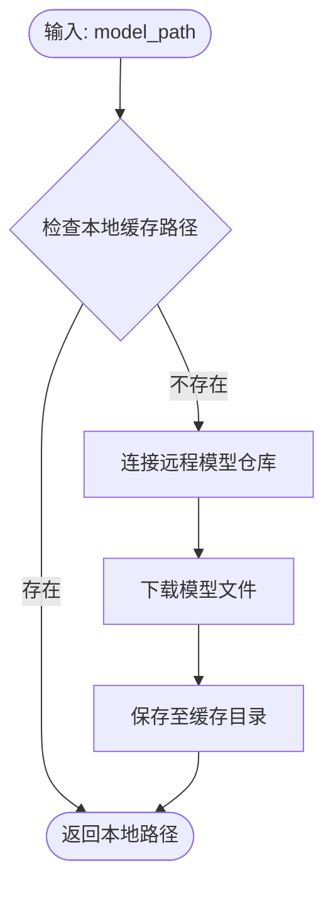
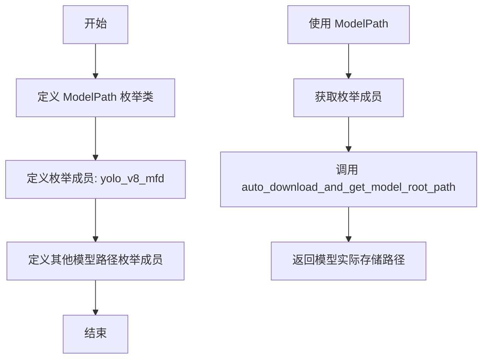
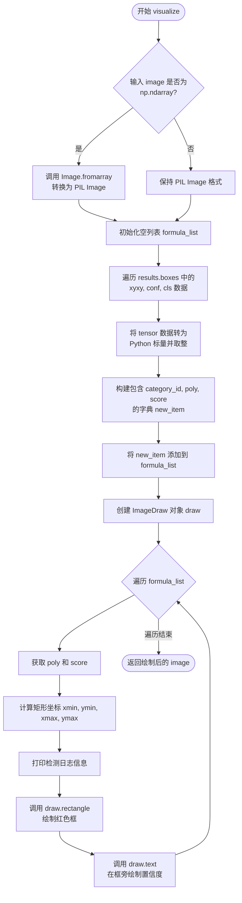

# `MinerU\mineru\model\mfd\yolo_v8.py` 详细设计文档

这是一个基于 Ultralytics YOLO v8 框架的数学公式检测（Mathematical Formula Detection, MFD）模型封装类，提供了模型加载、单图/批量推理以及可视化绘制检测框的完整流程。

## 整体流程

```mermaid
graph TD
    A[开始] --> B[初始化 YOLOv8MFDModel]
    B --> C[加载图像]
    C --> D[调用 model.predict]
    D --> E{_run_predict 执行推理}
    E --> F[YOLO Model.predict]
    F --> G[结果后处理 (CPU)]
    G --> H[返回检测结果]
    H --> I[调用 model.visualize]
    I --> J[解析结果列表]
    J --> K[使用 PIL 绘制边框和置信度]
    K --> L[结束]
```

## 类结构

```
YOLOv8MFDModel (核心模型类)
```

## 全局变量及字段


### `image_path`
    
输入图像的文件路径

类型：`str`
    


### `yolo_v8_mfd_weights`
    
模型权重文件路径 (通过 auto_download 获取)

类型：`str`
    


### `device`
    
字符串类型的设备标识 ('cuda' 或 'cpu')

类型：`str`
    


### `model`
    
YOLOv8MFDModel 的实例对象

类型：`YOLOv8MFDModel`
    


### `image`
    
PIL 加载的图像对象

类型：`PIL.Image.Image`
    


### `results`
    
模型预测返回的检测结果对象

类型：`object`
    


### `YOLOv8MFDModel.device`
    
运行设备 (cpu/cuda)

类型：`torch.device`
    


### `YOLOv8MFDModel.model`
    
Ultralytics YOLO 模型实例

类型：`YOLO`
    


### `YOLOv8MFDModel.imgsz`
    
输入图像尺寸

类型：`int`
    


### `YOLOv8MFDModel.conf`
    
置信度阈值

类型：`float`
    


### `YOLOv8MFDModel.iou`
    
NMS 的 IoU 阈值

类型：`float`
    
    

## 全局函数及方法


### `auto_download_and_get_model_root_path`

该函数是 Mineru 框架中用于模型管理的重要工具函数。它接收一个模型路径枚举作为输入，自动检查本地是否存在对应的模型文件；若本地不存在，则从远程模型仓库（如 HuggingFace）下载模型，并最终返回模型文件所在的根目录绝对路径。

参数：
-  `model_path`：`ModelPath`（枚举类型），传入的模型标识符，常见取值如 `ModelPath.yolo_v8_mfd`，对应 YOLOv8 MFD 模型。

返回值：`str`，返回模型文件的根目录（Root Directory）的绝对路径字符串。

#### 流程图



#### 带注释源码

由于该函数的实现细节未直接包含在提供的代码片段中（其为 `mineru.utils.models_download_utils` 模块的内部实现），以下为根据其调用方式和函数名称推断的逻辑实现及调用示例：

```python
# 文件: mineru/utils/models_download_utils.py (假设实现)

def auto_download_and_get_model_root_path(model_path: ModelPath) -> str:
    """
    自动下载并获取模型根目录路径。

    参数:
        model_path: ModelPath 枚举值，指定需要获取的模型名称。

    返回值:
        str: 模型文件存放的根目录绝对路径。
    """
    # 1. 确定缓存目录根路径 (通常为 ~/.cache/mineru 或类似路径)
    cache_root_dir = get_model_cache_dir()
    
    # 2. 构建完整的本地模型路径
    # 假设 ModelPath 枚举有 .value 属性获取字符串名称
    local_model_path = os.path.join(cache_root_dir, model_path.value)
    
    # 3. 检查本地是否已存在模型
    if not os.path.exists(local_model_path):
        # 4. 如果不存在，调用下载工具 (通常使用 huggingface_hub 的 snapshot_download)
        print(f"模型 {model_path.value} 本地未找到，正在从远程仓库下载...")
        download_model_from_hub(model_path)
        
    # 5. 返回根目录路径
    return local_model_dir

# ------------------- 在 provided code 中的使用示例 -------------------

# 导入函数
from mineru.utils.models_download_utils import auto_download_and_get_model_root_path
from mineru.utils.enum_class import ModelPath
import os

# 调用函数获取模型根目录
model_root = auto_download_and_get_model_root_path(ModelPath.yolo_v8_mfd)

# 拼接完整的模型权重文件路径
yolo_v8_mfd_weights = os.path.join(model_root, ModelPath.yolo_v8_mfd)
```


### `ModelPath`

定义模型路径枚举类，用于统一管理项目中各种预训练模型的路径标识符。该枚举类定义了 YOLO 系列模型、文本书写模型等多种模型的路径常量，方便模型下载和加载时的路径引用。

参数：此为枚举类，无传统意义上的函数参数

- 无

返回值：`ModelPath` 枚举类型，返回模型路径的枚举成员（如 `ModelPath.yolo_v8_mfd`）

#### 流程图



#### 带注释源码

```python
# 以下为基于代码使用方式推断的枚举类结构
# 实际定义位于 mineru.utils.enum_class 模块中

from enum import Enum

class ModelPath(str, Enum):
    """
    模型路径枚举类
    
    该枚举类定义了项目中使用的所有预训练模型的路径标识符。
    继承自 str 和 Enum，既支持字符串比较，又具有枚举的类型安全特性。
    """
    
    # YOLO 系列模型
    yolo_v8_mfd = "yolo_v8_mfd"          # YOLOv8 表格检测模型
    yolo_v8_mfr = "yolo_v8_mfr"          # YOLOv8 公式检测模型
    yolo_v8_det = "yolo_v8_det"          # YOLOv8 通用检测模型
    
    # 文本书写模型
    lanms_mfd = "lanms_mfd"              # 表格检测后处理模型
    
    # 其他模型...
    
    @classmethod
    def get_value(cls, member: 'ModelPath') -> str:
        """
        获取枚举成员的字符串值
        
        参数：
            member: ModelPath 枚举成员
            
        返回值：
            str: 模型路径的字符串标识符
        """
        return member.value
    
    def __str__(self) -> str:
        """返回枚举成员的字符串表示"""
        return self.value


# 代码中的实际使用方式
# from mineru.utils.enum_class import ModelPath
# from mineru.utils.models_download_utils import auto_download_and_get_model_root_path

# 获取模型实际存储路径
yolo_v8_mfd_weights = os.path.join(
    auto_download_and_get_model_root_path(ModelPath.yolo_v8_mfd),  # 自动下载并获取模型根路径
    ModelPath.yolo_v8_mfd                                           # 拼接模型文件名
)
```

#### 关键信息说明

| 属性 | 说明 |
|------|------|
| **来源模块** | `mineru.utils.enum_class` |
| **继承类型** | `str, Enum`（字符串枚举，支持字符串操作） |
| **主要用途** | 统一管理模型文件路径，避免硬编码字符串 |
| **使用场景** | 与 `auto_download_and_get_model_root_path` 配合使用，实现模型的自动下载和路径解析 |

#### 技术债务与优化空间

1. **枚举定义缺失**：代码中直接导入了 `ModelPath`，但未提供 `enum_class.py` 的实际源码，建议补充完整定义
2. **路径硬编码风险**：枚举值采用硬编码字符串，建议增加配置中心或环境变量支持
3. **缺乏版本管理**：模型路径未包含版本信息，可能导致模型更新后的兼容性问题


### `YOLOv8MFDModel.__init__`

构造函数，负责加载模型权重并设置参数。

参数：

- `weight`：`str`，模型权重文件路径
- `device`：`str`，计算设备，默认为 "cpu"
- `imgsz`：`int`，输入图像尺寸，默认为 1888
- `conf`：`float`，置信度阈值，默认为 0.25
- `iou`：`float`，IOU 阈值，默认为 0.45

返回值：`None`，无返回值（构造函数）

#### 流程图

```mermaid
graph TD
    A([开始]) --> B[设置设备对象<br>self.device = torch.device(device)]
    B --> C[加载YOLO模型<br>self.model = YOLO(weight)]
    C --> D[移动模型至设备<br>.to(self.device)]
    D --> E[保存推理配置<br>self.imgsz, self.conf, self.iou]
    E --> F([结束])
```

#### 带注释源码

```python
    def __init__(
        self,
        weight: str,
        device: str = "cpu",
        imgsz: int = 1888,
        conf: float = 0.25,
        iou: float = 0.45,
    ):
        # 1. 将字符串设备标识转换为 PyTorch 设备对象
        self.device = torch.device(device)
        
        # 2. 加载 YOLO 模型并将模型移动到指定计算设备
        self.model = YOLO(weight).to(self.device)
        
        # 3. 初始化并保存推理所需的配置参数
        self.imgsz = imgsz
        self.conf = conf
        self.iou = iou
```


### `YOLOv8MFDModel._run_predict`

内部私有方法，执行实际的模型预测逻辑，支持批量和单张处理。根据`is_batch`参数决定返回单个结果还是结果列表，并将结果转移到CPU上便于后续处理。

参数：

- `self`：`YOLOv8MFDModel` 实例本身，隐式参数
- `inputs`：`Union[np.ndarray, Image.Image, List]` 输入图像，可以是numpy数组、PIL图像对象或图像列表
- `is_batch`：`bool` 是否为批量处理模式，默认为False。True时返回所有结果列表，False时返回单个结果
- `conf`：`float` 置信度阈值，可选参数。如果为None则使用实例初始化时的self.conf

返回值：`Union[List, Any]` 预测结果。批量模式返回包含所有预测结果的列表，每个结果都转换为CPU张量；非批量模式返回单个预测结果（CPU张量）

#### 流程图

```mermaid
flowchart TD
    A[开始 _run_predict] --> B[接收参数: inputs, is_batch, conf]
    B --> C{conf is not None?}
    C -->|Yes| D[使用传入的conf值]
    C -->|No| E[使用self.conf实例属性]
    D --> F[调用self.model.predict]
    E --> F
    F --> G[获取模型预测结果preds]
    G --> H{is_batch == True?}
    H -->|Yes| I[遍历preds列表]
    I --> J[将每个pred移到CPU]
    J --> K[返回CPU张量列表]
    H -->|No| L[取preds[0]第一个结果]
    L --> M[将结果移到CPU]
    M --> N[返回单个CPU张量]
    K --> O[结束]
    N --> O
```

#### 带注释源码

```python
def _run_predict(
    self,
    inputs: Union[np.ndarray, Image.Image, List],
    is_batch: bool = False,
    conf: float = None,
) -> List:
    """
    内部私有方法，执行实际的模型预测逻辑
    
    参数:
        inputs: 输入图像，支持numpy数组、PIL图像或图像列表
        is_batch: 是否批量处理模式
        conf: 置信度阈值，None时使用实例默认值
    
    返回:
        预测结果列表或单个结果，所有结果已转移至CPU
    """
    # 调用ultralytics YOLO模型的predict方法进行推理
    # imgsz: 输入图像尺寸，使用实例属性self.imgsz
    # conf: 置信度阈值，如果传入参数conf不为None则使用传入值，否则使用实例属性self.conf
    # iou: IOU阈值，使用实例属性self.iou
    # verbose: 是否输出详细日志，设置为False
    # device: 运行设备，使用实例属性self.device
    preds = self.model.predict(
        inputs,
        imgsz=self.imgsz,
        conf=conf if conf is not None else self.conf,
        iou=self.iou,
        verbose=False,
        device=self.device
    )
    
    # 根据is_batch标志决定返回格式
    # 批量模式: 将所有预测结果逐个转移到CPU并返回列表
    # 非批量模式: 仅返回第一个结果并转移到CPU
    # 注意: GPU上的张量需要先移到CPU才能用于后续可视化或保存操作
    return [pred.cpu() for pred in preds] if is_batch else preds[0].cpu()
```


### `YOLOv8MFDModel.predict`

**描述**：这是一个公开的单图预测接口（Public single image prediction interface）。该方法接收一张图像（支持 NumPy 数组或 PIL Image 对象）和一个可选的置信度阈值，调用内部的 `_run_predict` 方法执行 YOLOv8 目标检测模型推理，并返回单张图像的检测结果（包含边界框、置信度和类别等信息）。

**参数**：

- `self`：实例方法隐含参数，指向模型本身。
- `image`：`Union[np.ndarray, Image.Image]`，待检测的输入图像。
- `conf`：`float`，可选参数，用于覆盖模型默认置信度阈值的检测阈值。如果为 `None`，则使用模型初始化时设置的 `self.conf`。

**返回值**：`Any`（具体为 `ultralytics.engine.results.Results` 对象），返回单张图像的目标检测结果对象，通常包含 `.boxes`（边界框）、`.masks`（掩码）等属性。

#### 流程图

```mermaid
flowchart TD
    A[Start: predict] --> B[Input: image, conf]
    B --> C{conf is None?}
    C -- Yes --> D[Use self.conf]
    C -- No --> E[Use input conf]
    D --> F[Call _run_predict]
    E --> F
    F --> G[_run_predict: Call self.model.predict]
    G --> H[Get preds list]
    H --> I[Extract first element: preds[0]]
    I --> J[Move to CPU: .cpu()]
    J --> K[Return Result Object]
```

#### 带注释源码

```python
def predict(
        self,
        image: Union[np.ndarray, Image.Image],
        conf: float = None,
):
    """
    对单张图像进行目标检测预测。

    参数:
        image (Union[np.ndarray, Image.Image]): 输入图像。
        conf (float, optional): 置信度阈值，可选。如果提供，将覆盖模型初始化时的默认阈值。

    返回:
        Any: 包含检测结果的Results对象。
    """
    # 调用内部方法 _run_predict，指定 is_batch=False 以处理单张图像
    return self._run_predict(image, is_batch=False, conf=conf)
```


### `YOLOv8MFDModel.batch_predict`

批量预测接口，通过分批处理图像列表并使用 tqdm 进度条展示预测进度，将 YOLOv8 MFD（文档图像公式检测）模型应用于多张图像，返回每张图像的预测结果列表。

参数：

- `self`：隐含的实例引用，YOLOv8MFDModel 类实例
- `images`：`List[Union[np.ndarray, Image.Image]]`，需要批量预测的图像列表，支持 numpy 数组或 PIL Image 对象
- `batch_size`：`int = 4`，每批次处理的图像数量，默认为 4
- `conf`：`float = None`，置信度阈值，可选参数，如果为 None 则使用实例化时设置的默认 conf 值

返回值：`List`，预测结果列表，每个元素对应一张图像的预测结果

#### 流程图

```mermaid
flowchart TD
    A[开始 batch_predict] --> B[初始化空结果列表 results]
    B --> C[创建 tqdm 进度条<br/>total=len(images)<br/>desc='MFD Predict']
    C --> D{idx < len(images)?}
    D -->|是 E[从 images 切片当前批次<br/>batch = images[idx:idx+batch_size]
    E --> F[调用 _run_predict 方法<br/>is_batch=True]
    F --> G[获取批次预测结果 batch_preds]
    G --> H[将 batch_preds 扩展到 results]
    H --> I[更新进度条 pbar.update]
    I --> J[idx += batch_size]
    J --> D
    D -->|否 K[返回 results 列表]
    K --> L[结束]
```

#### 带注释源码

```python
def batch_predict(
    self,
    images: List[Union[np.ndarray, Image.Image]],
    batch_size: int = 4,
    conf: float = None,
) -> List:
    """
    批量预测接口
    
    参数:
        images: 图像列表，支持 numpy 数组或 PIL Image 对象
        batch_size: 每批次处理的图像数量，默认为 4
        conf: 置信度阈值，可选，默认使用实例的 conf
    
    返回:
        预测结果列表
    """
    # 初始化结果列表，用于存储所有图像的预测结果
    results = []
    
    # 创建 tqdm 进度条，显示总图像数和描述信息
    with tqdm(total=len(images), desc="MFD Predict") as pbar:
        # 按照批次大小遍历图像列表
        for idx in range(0, len(images), batch_size):
            # 切片获取当前批次的图像
            batch = images[idx: idx + batch_size]
            
            # 调用内部预测方法进行批次预测
            # is_batch=True 表示批量预测，会返回多个结果
            batch_preds = self._run_predict(batch, is_batch=True, conf=conf)
            
            # 将当前批次的预测结果添加到结果列表
            results.extend(batch_preds)
            
            # 更新进度条，显示已处理的图像数量
            pbar.update(len(batch))
    
    # 返回所有图像的预测结果列表
    return results
```


### `YOLOv8MFDModel.visualize`

该方法接收原始图像和YOLO模型的预测结果，解析出检测框的坐标、置信度和类别信息，利用PIL库在原图上绘制红色的边界框和置信度文本，最终返回带有可视化标注的图像对象。

参数：
-  `image`：`Union[np.ndarray, Image.Image]`，需要进行可视化的原始输入图像（支持NumPy数组或PIL图像格式）。
-  `results`：`List`，YOLO模型的预测结果列表（通常为单个Result对象或包含多个结果的列表），包含boxes（边界框）、conf（置信度）、cls（类别）等属性。

返回值：`Image.Image`，绘制了检测框和置信度分数后的PIL图像对象。

#### 流程图



#### 带注释源码

```python
def visualize(
    self,
    image: Union[np.ndarray, Image.Image],
    results: List
) -> Image.Image:
    # 1. 图像类型预处理：如果输入是 NumPy 数组，则转换为 PIL Image 以便后续绘图操作
    if isinstance(image, np.ndarray):
        image = Image.fromarray(image)

    # 2. 解析检测结果：准备用于存储格式化后检测信息的列表
    formula_list = []
    # 遍历预测结果中的每一个检测框，解包坐标、置信度和类别
    for xyxy, conf, cla in zip(
            results.boxes.xyxy.cpu(), results.boxes.conf.cpu(), results.boxes.cls.cpu()
    ):
        # 将 tensor 转换为整数坐标
        xmin, ymin, xmax, ymax = [int(p.item()) for p in xyxy]
        
        # 构建检测项字典，包含调整后的类别ID、多边形坐标（矩形）和置信度分数
        new_item = {
            "category_id": 13 + int(cla.item()), # 类别ID偏移处理
            "poly": [xmin, ymin, xmax, ymin, xmax, ymax, xmin, ymax], # 构成矩形的8点坐标
            "score": round(float(conf.item()), 2), # 保留两位小数的置信度
        }
        formula_list.append(new_item)

    # 3. 绘图初始化：创建绘图对象
    draw = ImageDraw.Draw(image)
    
    # 4. 渲染循环：在图像上绘制所有检测到的公式框
    for res in formula_list:
        poly = res['poly']
        # 从poly中提取左上角和右下角坐标用于绘图
        xmin, ymin, xmax, ymax = poly[0], poly[1], poly[4], poly[5]
        
        # 打印检测到的详细信息到控制台
        print(
            f"Detected box: {xmin}, {ymin}, {xmax}, {ymax}, Category ID: {res['category_id']}, Score: {res['score']}")
        
        # 使用PIL在图像上画红色矩形框，线宽为2
        draw.rectangle([xmin, ymin, xmax, ymax], outline="red", width=2)
        
        # 在框的右上角（偏移一定像素）绘制置信度文本
        # 注意：font_size 参数可能依赖于特定的PIL版本或封装，部分环境可能需使用 font 参数
        draw.text((xmax + 10, ymin + 10), f"{res['score']:.2f}", fill="red", font_size=22)
        
    # 5. 返回绘制完成的图像对象
    return image
```

## 关键组件


### YOLOv8MFDModel 类

YOLOv8MFDModel 是基于 Ultralytics YOLOv8 的文档表单检测模型封装类，提供单张图像预测、批量预测和检测结果可视化功能，支持 CPU/GPU 设备配置和可调的推理参数。

### 模型初始化与设备管理

负责加载 YOLOv8 模型权重并配置推理参数，包括设备选择（CPU/CUDA）、图像输入尺寸、置信度阈值和 IOU 阈值，为后续推理提供基础设施。

### _run_predict 内部预测方法

封装了 YOLO 模型的 predict 调用，支持单张和批量模式，返回 CPU 张量格式的预测结果，根据 is_batch 参数决定返回列表还是单个结果。

### predict 单张图像预测

公开的单张图像推理接口，接收 numpy array 或 PIL Image 格式输入，返回检测结果，支持覆盖默认置信度阈值。

### batch_predict 批量预测

支持批量图像推理的核心方法，内部使用 tqdm 进度条显示处理进度，按指定 batch_size 分批调用模型，支持置信度阈值覆盖，返回检测结果列表。

### visualize 检测结果可视化

将模型输出的检测框绘制到原图像上，解析 xyxy 坐标、置信度和类别信息，转换为标准格式的 formula_list，使用 PIL 在图像上绘制红色边框和置信度文本，返回带标注的图像。

### 张量索引与结果解析

从 YOLO 预测结果中提取 boxes.xyxy（边界框坐标）、boxes.conf（置信度）、boxes.cls（类别），使用 .cpu() 和 .item() 将张量转换为 Python 标量进行处理。

### 图像格式支持

统一支持 numpy.ndarray 和 PIL.Image 两种输入格式，在可视化方法中通过 Image.fromarray 将 numpy 数组转换为 PIL Image 进行处理。

### 外部依赖与模型下载

通过 mineru.utils.models_download_utils 自动下载模型权重，使用 mineru.utils.enum_class.ModelPath 定义模型路径枚举，实现模型的自动获取和路径管理。


## 问题及建议


### 已知问题

-   **缺乏异常处理**：模型加载、图像读取、CUDA内存不足等关键操作均无异常捕获机制，可能导致程序崩溃
-   **资源管理不当**：模型加载后无显式释放机制，未使用 `torch.no_grad()` 或 `torch.inference_mode()` 减少推理时的显存占用
-   **内存泄漏风险**：批量推理时未及时释放中间结果，可能导致CUDA内存累积
-   **类型提示不完整**：`predict` 方法缺少返回类型注解，`batch_predict` 返回的 `List` 缺少泛型类型
-   **硬编码Magic Number**：`13 + int(cla.item())` 的category_id计算逻辑缺乏注释和配置化
-   **冗余代码**：结果解析逻辑（xyxy/conf/cls提取）在 `_run_predict` 和 `visualize` 中重复出现
-   **输入验证缺失**：`predict` 和 `batch_predict` 未对输入图像进行有效性检查
-   **批量大小固定**：`batch_predict` 每次都重新切片创建batch，可预先分批优化
-   **visualize方法兼容性问题**：PIL的 `font_size` 参数在不同版本中可能不支持
-   **日志不规范**：使用 `print` 而非标准日志框架，不利于生产环境调试

### 优化建议

-   **添加异常处理**：在模型加载、推理、图像读取等关键路径添加 try-except 包装，提供降级方案
-   **优化资源管理**：实现上下文管理器（`__enter__`/`__exit__`）或析构方法，推理时使用 `torch.inference_mode()` 包装
-   **完善类型提示**：为所有公共方法添加完整的类型注解，包括泛型 `List[Dict]`
-   **配置化管理**：将 `category_id` 计算逻辑、默认参数抽离为配置常量或类属性
-   **提取公共逻辑**：将结果解析封装为独立方法（如 `_parse_results`），避免重复代码
-   **输入验证**：在推理前检查图像格式、尺寸、batch为空等边界情况
-   **优化批量处理**：预先使用 `torch.utils.data.DataLoader` 分批，或支持动态batch_size
-   **兼容性问题修复**：使用 `ImageFont.truetype()` 加载字体替代 `font_size` 参数
-   **日志系统替换**：使用 `logging` 模块替代 print，支持多级别日志
-   **可选优化**：支持混合精度推理（FP16）、模型warm-up、推理结果缓存等高级特性


## 其它


### 设计目标与约束

该模块旨在实现一个基于YOLOv8的文档表单检测模型封装，提供模型加载、推理预测、可视化等功能，支持单张图片和批量图片的检测任务。设计约束包括：设备支持CPU和CUDA，模型输入尺寸默认为1888x1888，置信度阈值默认0.25，IOU阈值默认0.45，批量推理默认批次大小为4。

### 错误处理与异常设计

代码在以下场景缺乏异常处理：模型权重文件不存在或加载失败时未捕获异常；图片读取失败时未进行校验；批量预测过程中单个图片处理失败会导致整个批次中断；设备不可用时未做兼容性处理。建议添加try-except块捕获模型加载异常、图片格式不支持异常、设备不支持异常，并在_batch_predict中实现单张图片失败不影响其他图片处理的容错机制。

### 数据流与状态机

数据流如下：初始化阶段加载YOLO模型到指定设备→单张预测调用predict方法→批量预测调用batch_predict方法→内部调用_run_predict执行推理→返回结果→可视化调用visualize方法绘制检测框。状态机包含：模型加载态（ModelLoaded）、推理中（Predicting）、空闲（Idle）三个状态。

### 外部依赖与接口契约

核心依赖包括：torch（模型推理）、ultralytics的YOLO（目标检测框架）、PIL/Pillow（图像处理）、numpy（数组操作）、tqdm（进度条）。ModelPath枚举和auto_download_and_get_model_root_path函数来自mineru.utils包。接口契约：predict方法接受numpy数组或PIL.Image，返回检测结果；batch_predict接受图片列表，返回结果列表；visualize方法接受图片和检测结果，返回绘制后的PIL.Image。

### 性能考虑与优化空间

当前实现存在以下性能瓶颈：每次调用_run_predict都会将结果从GPU拷贝到CPU；批量预测使用串行方式未充分利用GPU并行能力；visualize方法中逐个绘制检测框效率较低。优化方向：可使用异步拷贝减少等待时间；支持动态批处理根据GPU显存自动调整batch_size；使用numpy向量化操作替代逐个绘制；可考虑添加结果缓存机制避免重复推理。

### 配置管理与参数设计

模型配置通过构造函数传入，包括：weight（权重路径）、device（设备选择）、imgsz（输入尺寸）、conf（置信度阈值）、iou（IOU阈值）。建议将默认参数抽取到配置文件或环境变量中，支持运行时动态调整。当前imgsz=1888为硬编码值，建议根据实际场景调整为更合理的默认值。

### 资源管理与生命周期

模型加载后占用GPU显存或系统内存，predict方法执行时占用推理显存。建议添加上下文管理器支持或destroy方法显式释放资源。当前代码在__main__中创建模型但未显式释放，长时间运行可能导致显存泄漏。应在使用完毕后调用del model或model.model = None来释放资源。

### 安全性考虑

weight参数未校验文件路径合法性，存在路径遍历风险；device参数未校验有效性，传入非法值会导致运行时错误；conf和iou参数未做范围校验，非法值可能导致模型推理异常。建议添加参数校验逻辑，确保weight路径存在、device可选值为cpu/cuda、conf范围[0,1]、iou范围[0,1]。

### 测试策略建议

建议添加单元测试覆盖以下场景：模型初始化（正常参数、非法设备、无效权重路径）；单张预测（不同图片格式、正常结果、空白图片）；批量预测（空列表、单张图片、多张图片、混合格式）；可视化（无检测结果、多检测结果、边界条件）。建议使用mock对象模拟YOLO模型以加速测试。

### 兼容性考虑

当前代码在Windows和Linux平台均可运行，但visualize方法中font_size参数在某些Pillow版本中可能不兼容，建议改为使用font参数指定字体文件。torch和ultralytics版本兼容性需在requirements.txt中明确指定。建议添加Python版本兼容性检查，当前代码使用typing.Union在Python 3.9以下需使用Union而非union语法。

### 日志与监控

当前代码仅在visualize方法中使用print输出检测信息，建议替换为标准logging模块并配置不同级别（DEBUG/INFO/WARNING/ERROR）。建议在模型加载、推理开始、推理结束等关键节点添加日志记录，便于生产环境监控和问题排查。

    