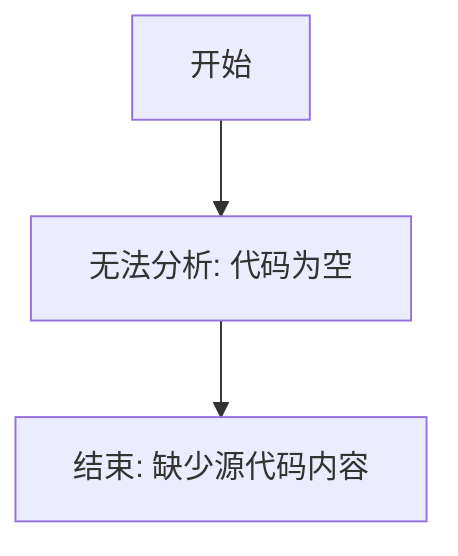

# `MinerU\mineru\model\mfr\__init__.py` 详细设计文档

该代码文件仅包含版权声明（Copyright (c) Opendatalab. All rights reserved.），未包含任何实际的功能代码或逻辑实现，因此无法进行详细的功能分析和设计文档生成。

## 整体流程



## 类结构

```
无法分析: 代码中不存在任何类定义
```

## 全局变量及字段


    

## 全局函数及方法


## 关键组件


### 无有效代码组件

提供的源代码仅包含一行版权声明，不包含任何可分析的代码组件。该代码片段无法进行架构分析、流程设计或组件识别。


## 问题及建议


### 已知问题

-   代码文件仅包含版权声明，没有任何实际功能实现，无法进行详细的技术债务和优化分析
-   缺少具体的类、函数、变量等代码实现

### 优化建议

-   需要提供完整的代码实现以进行深入的技术债务分析和优化建议
-   建议补充具体的业务逻辑代码、函数实现、类定义等相关代码块


## 其它


### 设计目标与约束

由于代码仅包含版权声明，无实际功能实现，故不适用。

### 错误处理与异常设计

由于代码仅包含版权声明，无实际功能实现，故不适用。

### 数据流与状态机

由于代码仅包含版权声明，无实际功能实现，故不适用。

### 外部依赖与接口契约

由于代码仅包含版权声明，无实际功能实现，故不适用。

### 性能要求与基准

由于代码仅包含版权声明，无实际功能实现，故不适用。

### 安全考虑

由于代码仅包含版权声明，无实际功能实现，故不适用。

### 测试策略

由于代码仅包含版权声明，无实际功能实现，故不适用。

### 部署与配置

由于代码仅包含版权声明，无实际功能实现，故不适用。

### 监控与日志

由于代码仅包含版权声明，无实际功能实现，故不适用。

### 版本兼容性

由于代码仅包含版权声明，无实际功能实现，故不适用。

### 国际化与本地化

由于代码仅包含版权声明，无实际功能实现，故不适用。


    