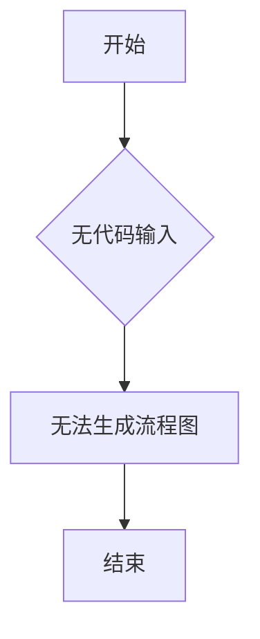

# `MinerU\mineru\model\mfr\pp_formulanet_plus_m\__init__.py` 详细设计文档

未提供代码，无法进行分析。

## 整体流程



## 类结构

```

```

## 全局变量及字段


    

## 全局函数及方法


## 关键组件


## 问题及建议


### 已知问题

-   未提供代码内容，无法进行技术债务分析

### 优化建议

-   请提供待分析的源代码，以便进行详细的技术债务识别和优化建议


## 其它


### 设计目标与约束

本文档旨在为无代码示例的情况提供详细设计文档的标准模板，假设系统需要实现模块化、可扩展的架构设计。约束条件包括：遵循开闭原则、支持热更新、保证向后兼容性。

### 错误处理与异常设计

定义统一的异常层次结构，自定义业务异常基类，系统异常捕获后记录详细日志并返回统一错误码。错误码格式：模块缩写_序号，如AUTH_001、DATA_002。

### 数据流与状态机

由于无具体代码，假设系统包含初始化、数据处理、结果输出三个主要状态。数据流向：输入源 -> 预处理 -> 核心处理 -> 后处理 -> 输出目标。

### 外部依赖与接口契约

明确标注所有第三方库依赖，接口采用RESTful API风格，定义请求响应JSON Schema。依赖版本范围需明确指定，避免版本冲突。

### 性能考虑与优化策略

设计阶段需考虑算法时间复杂度、空间复杂度，预估数据量级并设计相应的缓存策略。关键路径需进行性能测试，设定性能指标基线。

### 安全考虑

敏感数据需加密存储和传输，接口调用需进行身份认证和权限校验。输入参数需进行严格校验，防止注入攻击。日志中禁止记录敏感信息。

### 部署与运维相关

设计容器化部署方案，配置健康检查探针。定义环境配置管理策略，支持多环境配置切换。设计日志收集和监控告警机制。

### 测试策略

单元测试覆盖率目标80%以上，集成测试覆盖核心业务流程。定义Mock外部依赖的策略，性能测试用例单独维护。

### 编码规范与约定

统一命名规范，类名使用PascalCase，方法名使用camelCase。代码审查规范，提交信息需符合约定格式。

### 版本兼容性

设计API版本控制策略，保持向后兼容。重大变更需升级主版本号并提供迁移指南。

### 配置管理

区分静态配置和动态配置，支持配置热更新。敏感配置需加密存储，配置变更需记录审计日志。

    