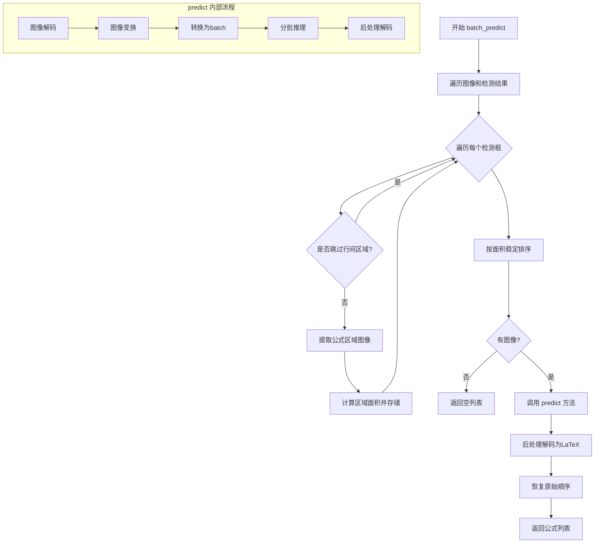
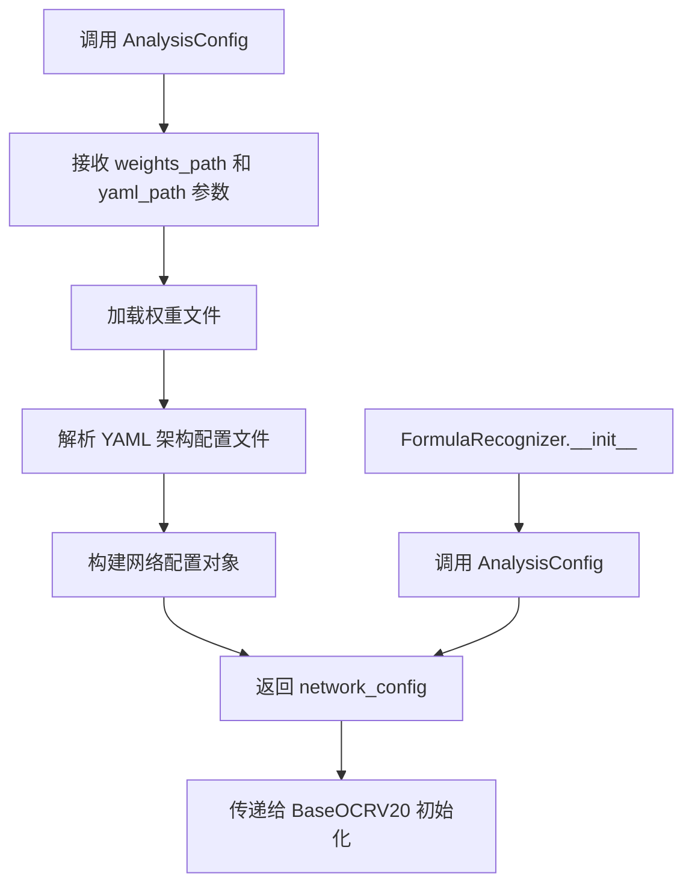
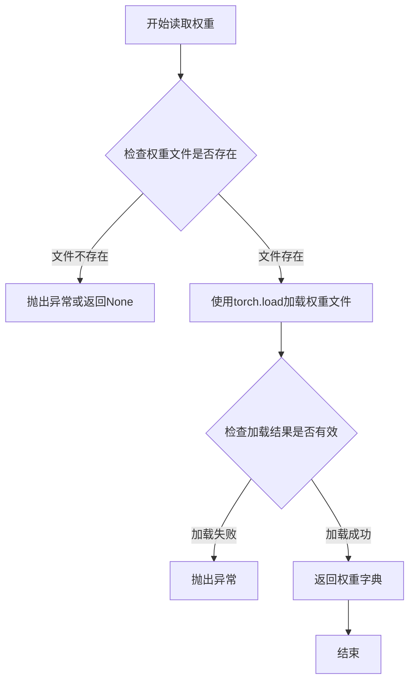
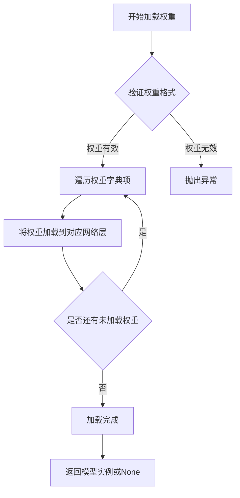
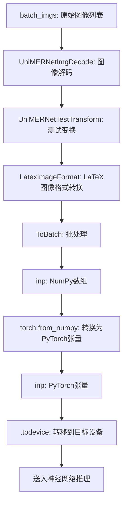
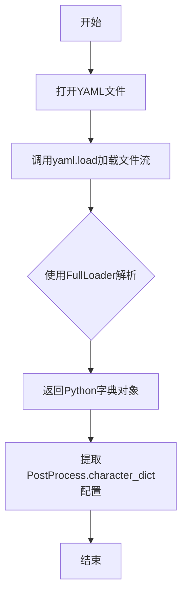
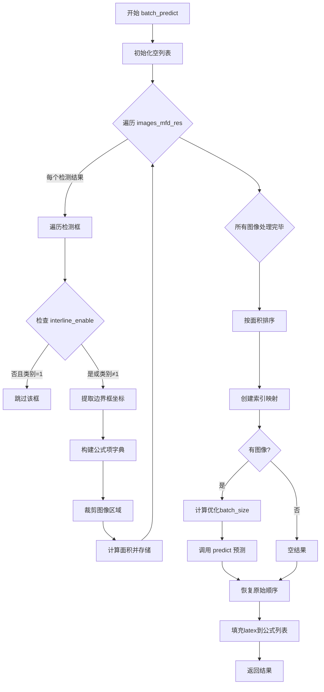

# `MinerU\mineru\model\mfr\pp_formulanet_plus_m\predict_formula.py` 详细设计文档

这是一个公式识别（Formula Recognition）模块，基于PP-FormulaNet_plus-M深度学习模型，实现从图像中识别数学公式并转换为LaTeX字符串的功能，支持批量处理、自动区域排序和后处理解码。

## 整体流程



## 类结构

```
BaseOCRV20 (抽象基类 - 来自 mineru)
└── FormulaRecognizer (主类)
```

## 全局变量及字段


### `FormulaRecognizer.weights_path`
    
模型权重文件路径

类型：`str`
    


### `FormulaRecognizer.yaml_path`
    
模型架构配置文件路径

类型：`str`
    


### `FormulaRecognizer.infer_yaml_path`
    
推理配置文件路径

类型：`str`
    


### `FormulaRecognizer.device`
    
计算设备 (CPU/CUDA)

类型：`torch.device`
    


### `FormulaRecognizer.pre_tfs`
    
预处理变换字典，包含 UniMERNetImgDecode, UniMERNetTestTransform, LatexImageFormat, ToBatch

类型：`dict`
    


### `FormulaRecognizer.post_op`
    
后处理解码器，用于将模型输出转换为LaTeX字符串

类型：`UniMERNetDecode`
    
    

## 全局函数及方法


### `pytorchocr_utility.AnalysisConfig`

该函数是外部导入的分析配置函数，用于解析模型权重文件和YAML配置文件，生成网络结构配置对象。在 `FormulaRecognizer` 类中用于获取网络模型的配置信息，以便正确初始化模型结构。

参数：

- `weights_path`：`str`，权重文件的路径（`self.weights_path`），指向预训练模型权重文件（PP-FormulaNet_plus-M.pth）
- `yaml_path`：`str`，YAML配置文件的路径（`self.yaml_path`），指向模型架构配置文件（pp_formulanet_arch_config.yaml）

返回值：`network_config`，包含网络结构配置的对象，用于初始化 `BaseOCRV20` 基类

#### 流程图



#### 带注释源码

```python
# 在 FormulaRecognizer 类中的调用方式
# 导入语句（来自外部模块）
from mineru.model.utils.tools.infer import pytorchocr_utility

class FormulaRecognizer(BaseOCRV20):
    def __init__(
        self,
        weight_dir,
        device="cpu",
    ):
        # ... 路径设置 ...
        
        # 调用外部 AnalysisConfig 函数解析模型配置
        # 参数1: weights_path - 预训练权重文件完整路径
        # 参数2: yaml_path - 模型架构YAML配置文件完整路径
        # 返回: network_config - 包含网络结构信息的配置对象
        network_config = pytorchocr_utility.AnalysisConfig(
            self.weights_path, self.yaml_path
        )
        
        # 读取PyTorch权重文件
        weights = self.read_pytorch_weights(self.weights_path)
        
        # 将配置传递给基类进行初始化
        super(FormulaRecognizer, self).__init__(network_config)
        
        # 加载权重到模型
        self.load_state_dict(weights)
        # ... 其他初始化代码 ...
```

#### 潜在技术债务与优化空间

1. **外部依赖黑盒问题**：`AnalysisConfig` 函数来自外部模块 `mineru.model.utils.tools.infer.pytorchocr_utility`，其内部实现不可见，建议添加内部封装或文档说明其返回配置的具体结构
2. **硬编码路径**：权重文件名 `PP-FormulaNet_plus-M.pth` 和配置文件名在代码中硬编码，缺乏灵活性
3. **配置解析错误处理缺失**：调用 `AnalysisConfig` 时未添加异常捕获，若文件不存在或格式错误会导致程序崩溃
4. **配置文件路径计算**：使用 `Path(__file__).parent.parent.parent` 相对路径定位配置文件，在项目结构变更时容易失效


### `BaseOCRV20.read_pytorch_weights`

该方法继承自 `BaseOCRV20` 基类，用于从指定的文件路径读取 PyTorch 模型的权重文件（.pth 格式），并将权重加载为 Python 字典对象返回，以便后续用于模型的 `load_state_dict` 方法进行权重加载。

参数：

- `self`：隐式参数，调用该方法的实例对象
- `weights_path`：`str`，要读取的 PyTorch 权重文件路径，通常为 `.pth` 格式的模型文件

返回值：`dict`，返回从权重文件中加载的参数字典，键为参数名称，值为对应的张量数据

#### 流程图



#### 带注释源码

```
# 继承自BaseOCRV20类的方法
# 用于读取PyTorch模型权重文件

weights = self.read_pytorch_weights(self.weights_path)

# 实际调用分析：
# - self.weights_path 是 FormulaRecognizer.__init__ 中设置的权重路径
# - 路径指向 "PP-FormulaNet_plus-M.pth" 文件
# - 返回的 weights 是一个字典，包含了模型的所有参数
# - 该字典随后用于 self.load_state_dict(weights) 进行权重加载
# - 如果使用 map_location='cpu'，可能需要指定设备参数
```


### `BaseOCRV20.load_state_dict`

该方法是继承自 `BaseOCRV20` 基类的模型权重加载方法，用于将预训练的 PyTorch 模型权重加载到当前网络结构中，使模型具备推理能力。

参数：

- `weights`：`dict`，从 PyTorch 模型文件（.pth）中读取的模型权重字典，通常包含模型各层的参数张量

返回值：`self`（返回模型实例本身，符合 PyTorch 的 `load_state_dict` 惯例）或 `None`

#### 流程图



#### 带注释源码

```python
# BaseOCRV20.load_state_dict 方法的调用方式
# 该方法继承自 BaseOCRV20 基类

# 1. 读取权重文件（由 FormulaRecognizer 的 read_pytorch_weights 方法完成）
weights = self.read_pytorch_weights(self.weights_path)

# 2. 调用继承的 load_state_dict 方法加载权重
# weights: dict 类型，包含从 .pth 文件加载的模型参数
self.load_state_dict(weights)

# 3. 将模型移动到指定设备
self.device = torch.device(device) if isinstance(device, str) else device
self.net.to(self.device)

# 4. 设置评估模式
self.net.eval()
```

> **注意**：由于 `BaseOCRV20` 类定义在外部模块 `mineru.model.utils.pytorchocr.base_ocr_v20` 中，其 `load_state_dict` 方法的具体实现源码未在本文件中展示。上述源码展示了该方法在 `FormulaRecognizer` 类中的调用方式及上下文。该方法的标准行为是：将传入的权重字典加载到模型的对应参数中，覆盖现有权重，通常返回 `self` 以支持链式调用。


### `torch.no_grad()`

`torch.no_grad()` 是 PyTorch 的一个上下文管理器，用于在推理阶段临时禁用梯度计算和自动微分功能，从而减少内存占用并提升推理效率。

参数： 无

返回值：`torch.no_grad` 对象，该上下文管理器不返回具体值，而是在其作用域内修改张量的计算图行为。

#### 流程图

```mermaid
flowchart TD
    A[进入 with torch.no_grad():] --> B{全局梯度标志}
    B -->|启用| C[设置 torch.is_grad_enabled = False]
    B -->|禁用| D[保持原状态]
    C --> E[执行推理代码块<br/>包括: batch_preds = self.net(batch_data)]
    E --> F[batch_preds 转换为 numpy]
    F --> G[离开上下文]
    G --> H[恢复原始梯度设置]
    H --> I[返回结果列表]
    
    style C fill:#f9f,stroke:#333
    style E fill:#ff9,stroke:#333
    style H fill:#f9f,stroke:#333
```

#### 带注释源码

```python
# torch.no_grad() 使用示例位于 FormulaRecognizer.predict 方法中
rec_formula = []  # 初始化结果列表

# 使用 torch.no_grad() 上下文管理器
# 作用：禁用梯度计算，节省内存并加速推理
with torch.no_grad():
    # 初始化进度条
    with tqdm(total=len(inp), desc="MFR Predict") as pbar:
        # 按批次迭代处理输入数据
        for index in range(0, len(inp), batch_size):
            batch_data = inp[index: index + batch_size]  # 切片获取当前批次
            
            # 前向传播 - 由于在 no_grad 块中，不会构建计算图
            batch_preds = [self.net(batch_data)]
            
            # 处理预测结果：展平并转换为 NumPy
            batch_preds = [p.reshape([-1]) for p in batch_preds[0]]
            batch_preds = [bp.cpu().numpy() for bp in batch_preds]
            
            # 后处理：将预测结果解码为公式字符串
            rec_formula += self.post_op(batch_preds)
            
            # 更新进度条
            pbar.update(len(batch_preds))

# 离开 no_grad 上下文后，梯度计算自动恢复
return rec_formula
```

#### 关键设计说明

| 特性 | 说明 |
|------|------|
| **设计目标** | 在推理时避免不必要的梯度计算，减少约 30-50% 的内存占用 |
| **约束条件** | 仅用于推理场景，训练时不可使用 |
| **错误处理** | 无异常抛出，torch 自动管理梯度状态 |
| **外部依赖** | PyTorch 核心库，无额外依赖 |


### `torch.from_numpy`

将 NumPy 数组转换为 PyTorch 张量，共享内存以提高效率。

参数：

- `ndarray`：`numpy.ndarray`，待转换的 NumPy 数组，通常是经过预处理和批处理后的图像数据

返回值：`torch.Tensor`，与输入 NumPy 数组共享内存的 PyTorch 张量，可直接在 GPU 或 CPU 设备上进行运算

#### 流程图



#### 带注释源码

```python
# 在 FormulaRecognizer.predict 方法中调用 torch.from_numpy
# 位置：predict 方法内部

# 1. 图像预处理流程（返回 NumPy 数组）
batch_imgs = self.pre_tfs["UniMERNetImgDecode"](imgs=img_list)      # 图像解码
batch_imgs = self.pre_tfs["UniMERNetTestTransform"](imgs=batch_imgs)  # 变换
batch_imgs = self.pre_tfs["LatexImageFormat"](imgs=batch_imgs)      # 格式转换
inp = self.pre_tfs["ToBatch"](imgs=batch_imgs)                      # 批处理，返回 (array,) 元组

# 2. 关键步骤：NumPy数组转换为PyTorch张量
# torch.from_numpy 会保留原始数据类型，并共享底层内存（避免内存拷贝）
# inp[0] 是因为 ToBatch 返回的是元组形式的批次数据
inp = torch.from_numpy(inp[0])

# 3. 将张量移动到指定计算设备（CPU或GPU）
inp = inp.to(self.device)

# 4. 后续用于神经网络推理
batch_preds = [self.net(batch_data)]
```

---

### 补充说明

| 项目 | 说明 |
|------|------|
| **调用位置** | `FormulaRecognizer.predict` 方法，第58行 |
| **输入数据来源** | `ToBatch` 处理器输出的 NumPy 数组，形状通常为 `(batch_size, channels, height, width)` |
| **内存共享** | `torch.from_numpy` 创建的张量与原始 NumPy 数组共享底层内存，修改一方会影响另一方 |
| **设备转移** | 转换后的张量默认在 CPU 内存，需要通过 `.to(self.device)` 移动到 GPU（如适用） |
| **数据类型** | 保持原始 NumPy 数组的数据类型（如 `float32`） |


### `yaml.load`

加载YAML配置文件，将YAML格式的配置文件解析为Python字典对象，供后续配置使用。

参数：

- `stream`：`file` 对象，从`self.infer_yaml_path`路径打开的YAML文件对象，包含待解析的YAML内容
- `Loader`：`yaml.Reader`，指定YAML解析器类型，此处使用`yaml.FullLoader`以确保安全加载

返回值：`dict`，返回解析后的YAML文件内容，包含了后处理配置信息（如字符字典等）

#### 流程图



#### 带注释源码

```python
# 打开推理配置文件
with open(self.infer_yaml_path, "r", encoding="utf-8") as yaml_file:
    # 使用yaml.FullLoader加载YAML文件内容
    # Loader参数指定使用FullLoader，相比默认Loader更安全
    # 返回解析后的Python字典对象
    data = yaml.load(yaml_file, Loader=yaml.FullLoader)

# data示例结构：
# {
#     "PostProcess": {
#         "character_dict": [...]  # 字符字典列表
#     },
#     ...
# }
```


### `FormulaRecognizer.__init__`

初始化公式识别模型，加载权重文件和配置文件，初始化预处理器和后处理器，准备好用于公式识别的完整模型 pipeline。

参数：

- `weight_dir`：`str`，模型权重文件所在目录路径，用于定位权重文件和推理配置文件
- `device`：`str` 或 `torch.device`，模型运行的设备，默认为 `"cpu"`，支持 cuda 等其他设备

返回值：`None`，该方法为构造函数，无返回值

#### 流程图

```mermaid
flowchart TD
    A[Start __init__] --> B[构建 weights_path<br/>weight_dir/PP-FormulaNet_plus-M.pth]
    B --> C[构建 yaml_path<br/>pp_formulanet_arch_config.yaml]
    C --> D[构建 infer_yaml_path<br/>weight_dir/PP-FormulaNet_plus-M_inference.yml]
    D --> E[调用 pytorchocr_utility.AnalysisConfig<br/>创建 network_config]
    E --> F[调用 read_pytorch_weights<br/>加载 .pth 权重文件]
    F --> G[调用 super().__init__<br/>初始化 BaseOCRV20 父类]
    G --> H[调用 load_state_dict<br/>加载权重到模型]
    H --> I[设置 self.device<br/>转换为 torch.device 对象]
    I --> J[self.net.to self.device<br/>模型迁移至目标设备]
    J --> K[self.net.eval<br/>设置推理模式]
    K --> L[打开并解析 infer_yaml<br/>获取后处理配置]
    L --> M[初始化 pre_tfs 字典<br/>4个预处理器]
    M --> N[初始化 post_op<br/>UniMERNetDecode 后处理器]
    N --> O[End __init__]
```

#### 带注释源码

```python
def __init__(
    self,
    weight_dir,
    device="cpu",
):
    # ============ 步骤1: 构建权重文件路径 ============
    # 组合 weight_dir 和权重文件名，得到完整的权重文件路径
    self.weights_path = os.path.join(
        weight_dir,
        "PP-FormulaNet_plus-M.pth",
    )
    
    # ============ 步骤2: 构建模型架构配置文件路径 ============
    # 从当前文件所在位置向上查找，获取项目根目录下的 pytorchocr 配置文件
    self.yaml_path = os.path.join(
        Path(__file__).parent.parent.parent,  # 项目根目录
        "utils",
        "pytorchocr",
        "utils",
        "resources",
        "pp_formulanet_arch_config.yaml"
    )
    
    # ============ 步骤3: 构建推理配置文件路径 ============
    # 推理配置位于 weight_dir 目录下
    self.infer_yaml_path = os.path.join(
        weight_dir,
        "PP-FormulaNet_plus-M_inference.yml",
    )

    # ============ 步骤4: 创建网络配置对象 ============
    # 使用 pytorchocr 工具类创建分析配置，包含模型架构定义
    network_config = pytorchocr_utility.AnalysisConfig(
        self.weights_path, self.yaml_path
    )
    
    # ============ 步骤5: 读取 PyTorch 权重文件 ============
    # 从 .pth 文件中加载预训练权重字典
    weights = self.read_pytorch_weights(self.weights_path)

    # ============ 步骤6: 初始化父类 BaseOCRV20 ============
    # 调用父类构造函数，传入网络配置，初始化网络结构
    super(FormulaRecognizer, self).__init__(network_config)

    # ============ 步骤7: 加载模型权重 ============
    # 将读取的权重加载到模型实例中
    self.load_state_dict(weights)
    
    # ============ 步骤8: 设置设备并移动模型 ============
    # 确保 device 是 torch.device 对象，然后移动模型到指定设备
    self.device = torch.device(device) if isinstance(device, str) else device
    self.net.to(self.device)
    
    # ============ 步骤9: 设置推理模式 ============
    # 切换为评估模式，关闭 dropout、batch normalization 使用训练统计值等
    self.net.eval()

    # ============ 步骤10: 加载推理配置文件 ============
    # 读取 YAML 配置文件，获取后处理所需的字符字典等配置
    with open(self.infer_yaml_path, "r", encoding="utf-8") as yaml_file:
        data = yaml.load(yaml_file, Loader=yaml.FullLoader)

    # ============ 步骤11: 初始化预处理器字典 ============
    # 预处理器 pipeline: 图像解码 -> 尺寸变换 -> LaTeX格式转换 -> 批处理
    self.pre_tfs = {
        "UniMERNetImgDecode": UniMERNetImgDecode(input_size=(384, 384)),
        "UniMERNetTestTransform": UniMERNetTestTransform(),
        "LatexImageFormat": LatexImageFormat(),
        "ToBatch": ToBatch(),
    }

    # ============ 步骤12: 初始化后处理器 ============
    # 使用配置中的字符字典初始化解码器，用于将模型输出转换为 LaTeX 字符串
    self.post_op = UniMERNetDecode(
        character_list=data["PostProcess"]["character_dict"]
    )
```


### `FormulaRecognizer.predict`

该方法是 `FormulaRecognizer` 类的核心推理功能。它接收一个图像列表和目标批大小，经过图像预处理流水线（解码、增强、格式化、组batch）、将数据传送到推理设备，然后通过循环分批调用神经网络模型进行预测，最后使用后处理器将原始预测结果解码为 LaTeX 公式字符串列表并返回。

参数：

-  `img_list`：`list`，待识别的图像列表（通常为 `numpy.ndarray` 或 `PIL.Image` 对象）。
-  `batch_size`：`int`，期望的推理批大小（方法内部会自动降低 50% 以优化内存）。

返回值：`list`，包含识别出的 LaTeX 公式字符串的列表。

#### 流程图

```mermaid
graph TD
    A([Start: predict]) --> B[Adjust Batch Size: 减半]
    B --> C[Preprocess Pipeline]
    subgraph Preprocess [图像预处理流水线]
        direction LR
        C1[UniMERNetImgDecode] --> C2[UniMERNetTestTransform] --> C3[LatexImageFormat] --> C4[ToBatch]
    end
    C --> D[Move Data to Device]
    D --> E[Init Empty List: rec_formula]
    E --> F{Loop: batch in data}
    F -->|Yes| G[Model Inference: self.net(batch_data)]
    G --> H[Reshape Predictions]
    H --> I[To NumPy]
    I --> J[Post-process: Decode to LaTeX]
    J --> K[Append to rec_formula]
    K --> F
    F -->|No| L([Return: rec_formula])
```

#### 带注释源码

```python
def predict(self, img_list, batch_size: int = 64):
    # 1. 内存优化：将请求的 batch_size 减少 50%，以避免推理时显存/内存溢出
    batch_size = int(0.5 * batch_size)

    # 2. 图像预处理流水线 (Pipeline)
    # 步骤1: 图像解码与尺寸归一化
    batch_imgs = self.pre_tfs["UniMERNetImgDecode"](imgs=img_list)
    # 步骤2: 图像变换与增强
    batch_imgs = self.pre_tfs["UniMERNetTestTransform"](imgs=batch_imgs)
    # 步骤3: LaTeX 图像格式转换
    batch_imgs = self.pre_tfs["LatexImageFormat"](imgs=batch_imgs)
    # 步骤4: 转换为模型所需的 Batch 格式 (NCHW)
    inp = self.pre_tfs["ToBatch"](imgs=batch_imgs)
    
    # 3. 数据准备：转换为 PyTorch Tensor 并移至指定设备 (CPU/GPU)
    inp = torch.from_numpy(inp[0])
    inp = inp.to(self.device)

    # 4. 初始化结果列表
    rec_formula = []
    
    # 5. 推理循环：使用 torch.no_grad() 禁用梯度计算以提升性能
    with torch.no_grad():
        # 使用 tqdm 显示推理进度条
        with tqdm(total=len(inp), desc="MFR Predict") as pbar:
            # 6. 分批处理：按照调整后的 batch_size 遍历数据
            for index in range(0, len(inp), batch_size):
                # 获取当前批次的数据
                batch_data = inp[index: index + batch_size]
                
                # 7. 模型前向传播
                batch_preds = [self.net(batch_data)]
                
                # 8. 后处理：将模型输出 reshape 为一维向量
                batch_preds = [p.reshape([-1]) for p in batch_preds[0]]
                
                # 9. 数据转移：将 GPU tensor 转换回 CPU numpy 数组
                batch_preds = [bp.cpu().numpy() for bp in batch_preds]
                
                # 10. 解码：将预测索引转换为 LaTeX 字符串
                rec_formula += self.post_op(batch_preds)
                
                # 更新进度条
                pbar.update(len(batch_preds))
    
    # 11. 返回识别结果
    return rec_formula
```


### `FormulaRecognizer.batch_predict`

批量预测接口，处理公式检测结果（MFD结果），从原始图像中裁剪出公式区域，进行排序以优化批处理，执行推理，并将预测的LaTeX公式按原始顺序返回。

参数：

- `images_mfd_res`：`list`，公式检测模型输出的结果列表，每个元素包含检测到的公式框（boxes.xyxy）、置信度（boxes.conf）和类别（boxes.cls）
- `images`：`list`，原始图像列表，与检测结果一一对应
- `batch_size`：`int`，批处理大小，默认为64
- `interline_enable`：`bool`，是否启用行间公式检测，默认为True（True=检测行间公式，False=跳过行间公式）

返回值：`list`，公式列表，每个元素包含公式信息字典（category_id、poly、score、latex）

#### 流程图



#### 带注释源码

```python
def batch_predict(
    self,
    images_mfd_res: list,
    images: list,
    batch_size: int = 64,
    interline_enable: bool = True,
) -> list:
    """批量预测接口，处理公式检测结果并返回公式列表"""
    images_formula_list = []  # 存储每张图像的公式列表
    mf_image_list = []        # 存储裁剪出的公式图像
    backfill_list = []         # 用于回填latex结果的引用列表
    image_info = []            # 存储(面积, 原始索引, 图像)元组

    # 1. 遍历检测结果，提取公式区域
    for image_index in range(len(images_mfd_res)):
        mfd_res = images_mfd_res[image_index]
        image = images[image_index]
        formula_list = []

        # 2. 遍历当前图像的所有检测框
        for idx, (xyxy, conf, cla) in enumerate(
            zip(mfd_res.boxes.xyxy, mfd_res.boxes.conf, mfd_res.boxes.cls)
        ):
            # 3. 根据interline_enable决定是否跳过行间公式(类别1)
            if not interline_enable and cla.item() == 1:
                continue  # 跳过行间区域
            # 4. 提取边界框坐标并转换为整数
            xmin, ymin, xmax, ymax = [int(p.item()) for p in xyxy]
            # 5. 构建公式项字典
            new_item = {
                "category_id": 13 + int(cla.item()),  # 类别ID偏移
                "poly": [xmin, ymin, xmax, ymin, xmax, ymax, xmin, ymax],  # 8点多边形
                "score": round(float(conf.item()), 2),  # 置信度分数
                "latex": "",  # 预设为空，后续填充
            }
            formula_list.append(new_item)
            # 6. 从原图裁剪公式区域
            bbox_img = image[ymin:ymax, xmin:xmax]
            area = (xmax - xmin) * (ymax - ymin)  # 计算面积用于排序

            curr_idx = len(mf_image_list)
            image_info.append((area, curr_idx, bbox_img))
            mf_image_list.append(bbox_img)

        images_formula_list.append(formula_list)
        backfill_list += formula_list

    # 7. 按面积升序排序，优化批处理效率
    image_info.sort(key=lambda x: x[0])  # sort by area
    sorted_indices = [x[1] for x in image_info]  # 排序后的原始索引
    sorted_images = [x[2] for x in image_info]   # 排序后的图像

    # 8. 创建索引映射: 新索引->旧索引
    index_mapping = {
        new_idx: old_idx for new_idx, old_idx in enumerate(sorted_indices)
    }

    # 9. 执行预测或返回空结果
    if len(sorted_images) > 0:
        # 动态计算优化的batch_size，使用2的幂次
        batch_size = min(batch_size, max(1, 2 ** (len(sorted_images).bit_length() - 1))) if sorted_images else 1
        rec_formula = self.predict(sorted_images, batch_size)  # 调用predict方法
    else:
        rec_formula = []

    # 10. 恢复原始顺序
    unsorted_results = [""] * len(rec_formula)
    for new_idx, latex in enumerate(rec_formula):
        original_idx = index_mapping[new_idx]
        unsorted_results[original_idx] = latex

    # 11. 将latex结果回填到公式列表
    for res, latex in zip(backfill_list, unsorted_results):
        res["latex"] = latex

    return images_formula_list
```

## 关键组件


### 张量索引与惰性加载

在batch_predict方法中，通过按面积对图像区域进行稳定排序，实现了一种惰性加载策略。代码先收集所有图像及其元信息（面积、原始索引），然后按面积排序进行推理，最后再恢复原始顺序。这种方式可以优化内存使用，但可能导致原始顺序的图像在推理时不是最优的内存布局。

### 反量化支持

在predict方法的推理循环中，代码中包含了一段被注释的torch.amp.autocast调用。该代码原本用于启用自动混合精度（AMP）推理，可以减少显存占用并提升推理速度，但由于某些原因被注释掉。这表明项目可能存在对混合精度推理的支持需求，但当前未启用。

### 量化策略

在predict方法中，batch_size被动态调整为原始值的一半（int(0.5 * batch_size)），这是一种简单的内存保护策略。同时在batch_predict中，batch_size还会根据图像数量动态选择最接近的2的幂次值（通过bit_length计算），以优化GPU内存使用效率。

### 预处理管道组件

代码通过self.pre_tfs字典构建了四阶段的预处理管道：UniMERNetImgDecode负责图像解码和尺寸调整、UniMERNetTestTransform执行测试时的数据增强、LatexImageFormat进行LaTeX图像格式转换、ToBatch将图像打包为批次。每个处理器都是独立的可调用对象，通过字典顺序依次调用。

### 后处理解码器

UniMERNetDecode后处理器使用配置文件中的character_dict将模型输出的原始预测转换为可读的LaTeX公式字符串。该解码器封装在self.post_op中，接收reshape后的模型输出并返回识别结果。

### 批量预测与结果恢复

batch_predict方法实现了完整的端到端公式识别流程：从检测结果中提取公式区域、收集图像信息、按面积排序、调用predict进行推理、最后恢复原始顺序。通过index_mapping字典维护新旧索引的映射关系，确保最终返回的结果与输入图像顺序一致。

### 动态批处理优化

在batch_predict中，batch_size根据sorted_images的长度动态计算为最接近的2的幂次值（max(1, 2 ** (len(sorted_images).bit_length() - 1))），这是一种常见的GPU内存优化策略，可以提高计算效率。


## 问题及建议


### 已知问题

- **硬编码的 batch_size 缩减**：在 `predict` 方法中使用 `batch_size = int(0.5 * batch_size)` 硬编码减少50%的批次大小，缺乏灵活性，无法根据实际 GPU 显存动态调整
- **AMP 自动混合精度被注释**：`torch.amp.autocast` 代码被注释掉，这是重要的性能优化点，会导致推理速度较慢和显存占用较高
- **YAML 加载器不安全**：使用 `yaml.FullLoader` 存在潜在的安全风险（代码执行漏洞），应使用 `yaml.SafeLoader`
- **权重加载无错误处理**：`read_pytorch_weights` 调用后直接传给父类，若权重文件损坏或路径错误会导致程序崩溃，缺乏异常捕获
- **图像坐标缺少校验**：在 `batch_predict` 中裁剪图像 `image[ymin:ymax, xmin:xmax]` 时未校验坐标是否超出图像边界，可能导致索引越界
- **推理循环内存效率低**：`batch_preds = [bp.cpu().numpy() for bp in batch_preds]` 在循环中频繁创建 numpy 数组和进行 CPU-GPU 数据传输，未使用批处理优化
- **类型注解不完整**：`predict` 和 `batch_predict` 方法缺少参数和返回值的类型注解，影响代码可维护性和 IDE 提示
- **排序后索引映射逻辑复杂**：`index_mapping` 和恢复原始顺序的逻辑过于复杂，可读性较差且容易出错
- **缺少日志记录**：仅在 `predict` 中使用 tqdm 进度条，缺乏结构化日志记录，无法追踪推理过程中的关键信息
- **设备处理冗余**：`torch.device(device) if isinstance(device, str) else device` 判断逻辑可以简化

### 优化建议

- **动态调整 batch_size**：使用 `torch.cuda.get_device_properties` 或 `torch.cuda.memory_allocated()` 动态计算合适的 batch_size，而非硬编码
- **启用 AMP**：取消注释 `torch.amp.autocast` 以启用自动混合精度，提升推理性能并降低显存占用
- **使用 SafeLoader**：将 `yaml.FullLoader` 替换为 `yaml.SafeLoader`，或使用 `yaml.CSafeLoader` 提升安全性
- **添加权重加载异常处理**：使用 try-except 捕获权重加载异常，提供友好的错误信息和降级策略
- **添加图像坐标校验**：在裁剪前检查 `xmin, ymin, xmax, ymax` 是否在图像范围内，使用 `np.clip` 或显式校验
- **优化推理循环**：将 `batch_preds` 处理移出循环，使用批量操作替代循环中的逐元素处理
- **完善类型注解**：为所有公开方法添加完整的类型注解，包括泛型支持
- **简化排序逻辑**：使用 enumerate 和字典直接建立索引映射，避免复杂的两步映射
- **添加结构化日志**：使用 logger 记录关键节点（开始、结束、异常），便于排查问题
- **统一设备处理**：直接使用 `torch.device(device)` 简化代码


## 其它


### 设计目标与约束

该模块旨在实现高效的数学公式识别功能，支持从图像中自动检测和识别数学公式，并将结果以LaTeX格式输出。核心目标包括：1) 提供高精度的公式识别能力；2) 支持批量处理以提升吞吐量；3) 支持可配置的设备选择（CPU/GPU）；4) 支持行间公式和行内公式的区分处理。约束条件包括：输入图像必须包含有效的公式区域，模型权重文件必须存在且格式正确，设备必须有足够的计算资源支持推理。

### 错误处理与异常设计

权重文件缺失或损坏时抛出FileNotFoundError；YAML配置文件解析失败时抛出yaml.YAMLError；模型加载失败时抛出RuntimeError；设备指定错误时抛出ValueError；输入图像为空或格式错误时返回空列表；GPU内存不足时自动回退到CPU或减小批处理大小。predict方法中所有张量操作均使用torch.no_grad()包裹以避免梯度计算异常。

### 数据流与状态机

数据流主要经历以下阶段：1) 图像输入阶段：接收原始图像列表；2) 预处理阶段：依次经过UniMERNetImgDecode（图像解码resize）、UniMERNetTestTransform（测试变换）、LatexImageFormat（格式转换）、ToBatch（批处理）四个处理器；3) 推理阶段：将预处理后的数据送入神经网络进行前向传播；4) 后处理阶段：使用UniMERNetDecode将网络输出解码为LaTeX字符串；5) 结果组装阶段：将识别结果按原始顺序回填到对应位置。batch_predict方法额外包含公式检测结果解析、区域裁剪、面积排序、顺序恢复等状态。

### 外部依赖与接口契约

主要依赖包括：torch（深度学习框架）、yaml（配置文件解析）、loguru（日志记录）、tqdm（进度条显示）、pathlib（路径处理）、mineru.model.utils.tools.infer.pytorchocr_utility（模型配置）、mineru.model.utils.pytorchocr.base_ocr_v20（基类）、processors模块（图像处理）。输入接口：predict方法接收img_list（图像列表）和batch_size（批大小）；batch_predict方法接收images_mfd_res（公式检测结果列表）、images（原始图像列表）、batch_size和interline_enable参数。输出接口：predict返回LaTeX字符串列表；batch_predict返回包含公式位置和LaTeX内容的字典列表。

### 性能考虑与优化

当前实现中已包含的性能优化措施：1) 使用torch.no_grad()禁用梯度计算；2) 推理时将批处理大小自动减半以避免内存问题；3) 使用批量推理替代逐张推理；4) 根据图像数量动态调整批处理大小为2的幂次。潜在优化空间：1) 可启用torch.amp.autocast启用混合精度推理；2) 可使用ONNXRuntime替代PyTorch进行推理加速；3) 可实现异步推理和结果缓存机制；4) 可对图像预处理进行GPU加速。

### 资源管理

设备管理通过torch.device进行封装，支持CPU和CUDA设备；模型权重加载后移至指定设备；推理时输入张量同步移至设备；使用torch.no_grad()避免产生梯度从而减少显存占用；批处理大小根据图像数量动态调整以适配显存容量；推理完成后张量自动释放无需手动管理。

    