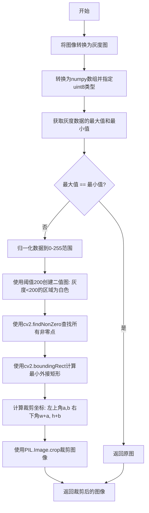
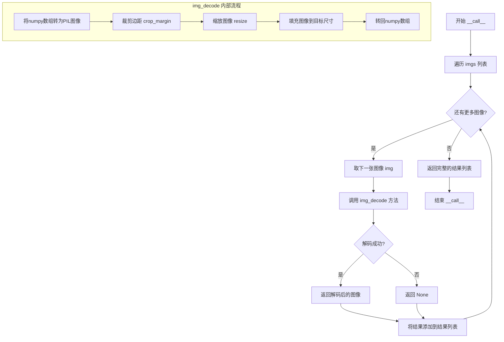
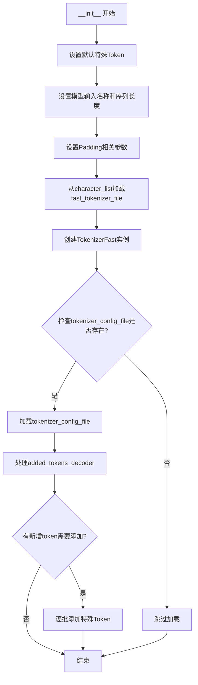
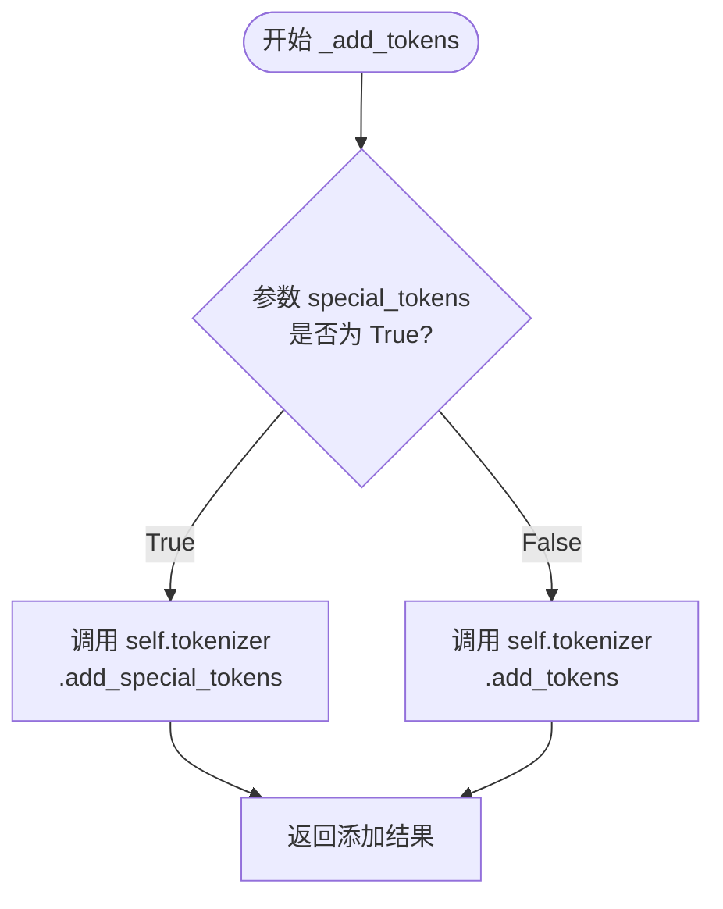
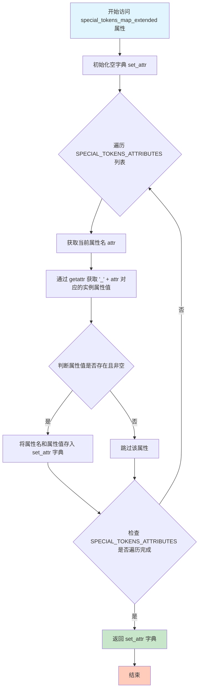
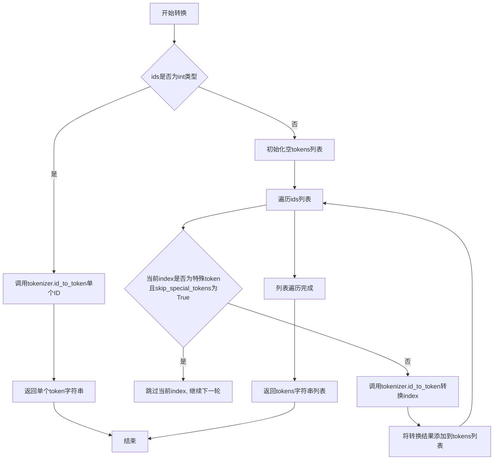

# `MinerU\mineru\model\mfr\pp_formulanet_plus_m\processors.py` 详细设计文档

这是UniMERNet模型的图像预处理与推理后处理模块。该代码主要负责将原始图像数据进行裁剪、缩放、归一化并组成batch送入模型，以及将模型输出的token ID序列解码为最终的LaTeX文本字符串，包含专门的文本清理和LaTeX修复逻辑。

## 整体流程

```mermaid
graph LR
    A[Raw Image (numpy)] --> B[UniMERNetImgDecode]
    B --> C[UniMERNetTestTransform]
    C --> D[LatexImageFormat]
    D --> E[ToBatch]
    E --> F((Model Inference))
    F --> G[Token IDs]
    G --> H[UniMERNetDecode]
    H --> I[Final Text]
```

## 类结构

```
Pipeline Components (并列)
├── UniMERNetImgDecode (图像解码与预处理)
├── UniMERNetTestTransform (图像归一化)
├── LatexImageFormat (图像尺寸对齐)
├── ToBatch (批量组装)
└── UniMERNetDecode (token解码与后处理)
```

## 全局变量及字段


### `fix_latex_left_right`
    
修复LaTeX中左右括号和定界符的函数

类型：`function`
    


### `fix_latex_environments`
    
修复LaTeX环境的函数

类型：`function`
    


### `remove_up_commands`
    
移除上行命令的函数

类型：`function`
    


### `remove_unsupported_commands`
    
移除不支持的LaTeX命令的函数

类型：`function`
    


### `UniMERNetImgDecode.input_size`
    
目标输入尺寸

类型：`Tuple[int, int]`
    


### `UniMERNetImgDecode.random_padding`
    
是否随机padding

类型：`bool`
    


### `UniMERNetTestTransform.num_output_channels`
    
输出通道数，默认为3

类型：`int`
    


### `UniMERNetDecode.SPECIAL_TOKENS_ATTRIBUTES`
    
特殊token属性列表

类型：`List[str]`
    


### `UniMERNetDecode.model_input_names`
    
模型输入名

类型：`List[str]`
    


### `UniMERNetDecode.max_seq_len`
    
最大序列长度

类型：`int`
    


### `UniMERNetDecode.pad_token_id`
    
padding token id

类型：`int`
    


### `UniMERNetDecode.bos_token_id`
    
开始token id

类型：`int`
    


### `UniMERNetDecode.eos_token_id`
    
结束token id

类型：`int`
    


### `UniMERNetDecode.padding_side`
    
padding方向

类型：`str`
    


### `UniMERNetDecode.tokenizer`
    
快速分词器实例

类型：`TokenizerFast`
    
    

## 全局函数及方法


### `UniMERNetImgDecode.crop_margin`

裁剪图像的边缘空白区域，基于灰度阈值检测文本区域并计算最小外接矩形进行裁剪。

参数：

- `img`：`PIL.Image.Image`，输入的原始图像

返回值：`PIL.Image.Image`，裁剪掉边缘空白后的图像

#### 流程图



#### 带注释源码

```python
def crop_margin(self, img: Image.Image) -> Image.Image:
    """Crops the margin of the image based on grayscale thresholding.

    Args:
        img (PIL.Image.Image): The input image.

    Returns:
        PIL.Image.Image: The cropped image."""
    # 将PIL图像转换为灰度图（"L"模式为灰度）
    data = np.array(img.convert("L"))
    # 确保数据类型为uint8（0-255范围的整数）
    data = data.astype(np.uint8)
    # 获取灰度值的最大值和最小值
    max_val = data.max()
    min_val = data.min()
    # 如果图像是纯色的（最大最小值相同），直接返回原图
    if max_val == min_val:
        return img
    # 归一化数据：将数据缩放到0-255范围
    # (data - min_val) / (max_val - min_val) * 255
    data = (data - min_val) / (max_val - min_val) * 255
    # 创建二值图：灰度值小于200的像素变为白色（255），其余为黑色（0）
    # 假设图像中文本为深色，背景为浅色，因此选择阈值200来识别文本区域
    gray = 255 * (data < 200).astype(np.uint8)
    # 使用OpenCV找到所有非零像素的坐标（即文本区域）
    coords = cv2.findNonZero(gray)  # Find all non-zero points (text)
    # 计算包含所有非零点的最小外接矩形
    # a, b为左上角坐标，w为宽度，h为高度
    a, b, w, h = cv2.boundingRect(coords)  # Find minimum spanning bounding box
    # 使用PIL的crop方法裁剪图像
    # crop参数为(左, 上, 右, 下)
    return img.crop((a, b, w + a, h + b))
```


### `UniMERNetImgDecode.get_dimensions`

获取图像的维度信息（通道数、高度和宽度）。

参数：

-  `img`：`Union[Image.Image, np.ndarray]`，输入图像，可以是 PIL 图像对象或 NumPy 数组

返回值：`List[int]`，包含通道数、高度、宽度的列表，例如 [3, 512, 256] 表示 3 通道、512 高度、256 宽度

#### 流程图

```mermaid
flowchart TD
    A[开始 get_dimensions] --> B{img 是否有 getbands 方法?}
    B -->|是| C[调用 img.getbands 获取通道列表]
    C --> D[使用 len 获取通道数]
    B -->|否| E[直接访问 img.channels]
    D --> F[获取宽度和高度: width, height = img.size]
    E --> F
    F --> G[返回列表: [channels, height, width]]
    G --> H[结束]
```

#### 带注释源码

```
def get_dimensions(self, img: Union[Image.Image, np.ndarray]) -> List[int]:
    """Gets the dimensions of the image.

    Args:
        img (PIL.Image.Image or numpy.ndarray): The input image.

    Returns:
        list: A list containing the number of channels, height, and width."""
    # 判断输入是 PIL 图像还是 NumPy 数组
    if hasattr(img, "getbands"):
        # 如果是 PIL 图像，使用 getbands() 方法获取通道信息
        # getbands() 返回例如 ('R', 'G', 'B') 对于 RGB 图像
        channels = len(img.getbands())
    else:
        # 如果是 NumPy 数组，直接访问 channels 属性
        channels = img.channels
    # 获取图像的宽度和高度（PIL 图像使用 .size 属性）
    width, height = img.size
    # 返回 [通道数, 高度, 宽度] 的列表
    return [channels, height, width]
```


### `UniMERNetImgDecode._compute_resized_output_size`

该函数是 `UniMERNetImgDecode` 类的私有方法，负责根据原始图像尺寸、目标尺寸（最小边规则或固定宽高）以及最大尺寸约束，计算图像经过缩放处理后的目标宽高尺寸。

参数：

- `self`：类实例本身。
- `image_size`：`Tuple[int, int]`，原始图像的尺寸，顺序为 (高度, 宽度)。
- `size`：`Union[int, Tuple[int, int]]`，期望的输出尺寸。可以是一个整数（表示将图像的短边缩放到该尺寸，长边按比例缩放），或者是包含 (高度, 宽度) 的元组。
- `max_size`：`Optional[int]`，可选参数，限制图像长边不允许超过的最大尺寸。

返回值：`List[int]`，返回计算后的新尺寸列表，顺序为 [新高度, 新宽度]。

#### 流程图

```mermaid
flowchart TD
    A[Start] --> B{len(size) == 1?}
    
    B -- Yes (Only specify smallest edge) --> C[Unpack image_size: h, w]
    C --> D[Identify short and long edges]
    D --> E[Calculate new_short and new_long based on ratio]
    E --> F{max_size is provided?}
    
    F -- Yes --> G{new_long > max_size?}
    G -- Yes --> H[Scale down: new_short = int(max_size * new_short / new_long), new_long = max_size]
    G -- No --> I[Keep new dimensions]
    F -- No --> I
    
    H --> J[Determine new_w and new_h based on orientation]
    I --> J
    
    B -- No (Specify both h and w) --> K[new_w = size[1], new_h = size[0]]
    
    J --> L[Return [new_h, new_w]]
    K --> L
```

#### 带注释源码

```python
def _compute_resized_output_size(
        self,
        image_size: Tuple[int, int],
        size: Union[int, Tuple[int, int]],
        max_size: Optional[int] = None,
) -> List[int]:
    """Computes the resized output size of the image.

    Args:
        image_size (tuple): The original size of the image (height, width).
        size (int or tuple): The desired size for the smallest edge or both height and width.
        max_size (int, optional): The maximum allowed size for the longer edge.

    Returns:
        list: A list containing the new height and width."""
    
    # 情况1：只指定了短边的尺寸（例如只想保持短边为224）
    if len(size) == 1:  
        h, w = image_size  # 获取原始图像的高和宽
        
        # 确定原图中的短边和长边
        short, long = (w, h) if w <= h else (h, w)
        
        # 获取期望的新短边尺寸
        requested_new_short = size if isinstance(size, int) else size[0]

        # 根据比例计算对应的长边尺寸
        new_short, new_long = requested_new_short, int(
            requested_new_short * long / short
        )

        # 如果限制了最大尺寸
        if max_size is not None:
            # 校验：max_size 必须大于请求的短边尺寸，否则无法完成缩放
            if max_size <= requested_new_short:
                raise ValueError(
                    f"max_size = {max_size} must be strictly greater than the requested "
                    f"size for the smaller edge size = {size}"
                )
            # 如果计算出的长边超过了最大限制，进行等比例缩放
            if new_long > max_size:
                new_short, new_long = int(max_size * new_short / new_long), max_size

        # 根据原图是横图还是竖图，还原回 width 和 height
        new_w, new_h = (new_short, new_long) if w <= h else (new_long, new_short)
        
    else: 
        # 情况2：直接指定了高度和宽度
        # 注意：通常传入的size元组顺序为 (height, width)，所以取法如下
        new_w, new_h = size[1], size[0]
        
    # 返回 [height, width]
    return [new_h, new_w]
```


### `UniMERNetImgDecode.resize`

该方法负责将输入图像调整到指定的目标尺寸，通过计算新的宽高比并使用 PIL 库的双三次插值法进行图像缩放，支持按最短边或同时指定高宽进行resize操作。

参数：

- `img`：`PIL.Image.Image`，输入的需要调整大小的图像对象
- `size`：`Union[int, Tuple[int, int]]`，目标尺寸，可以是整数（最短边的目标值）或元组（高度, 宽度）

返回值：`PIL.Image.Image`，调整大小后的图像对象

#### 流程图

```mermaid
flowchart TD
    A[开始 resize 方法] --> B[获取图像尺寸<br/>调用 get_dimensions 方法]
    B --> C{size 是否为整数?}
    C -->|是| D[将 size 转换为列表]
    C -->|否| E[保持 size 不变]
    D --> F[设置 max_size 为 None]
    E --> F
    F --> G[调用 _compute_resized_output_size<br/>计算输出尺寸]
    G --> H[反转输出尺寸列表<br/>output_size[::-1]]
    H --> I[调用 PIL img.resize<br/>使用双三次插值 resample=2]
    I --> J[返回调整后的图像]
    
    G --> K[_compute_resized_output_size 内部逻辑]
    K --> K1{size 长度是否为1?}
    K1 -->|是| K2[计算短边和长边比例]
    K1 -->|否| K3[直接使用指定的宽高]
    K2 --> K4[根据比例计算新尺寸]
    K3 --> K5[返回新的高度和宽度]
    K4 --> K5
```

#### 带注释源码

```python
def resize(
        self, img: Image.Image, size: Union[int, Tuple[int, int]]
) -> Image.Image:
    """Resizes the image to the specified size.

    Args:
        img (PIL.Image.Image): The input image.
        size (int or tuple): The desired size for the smallest edge or both height and width.

    Returns:
        PIL.Image.Image: The resized image."""
    # 获取图像的通道数、高度和宽度
    _, image_height, image_width = self.get_dimensions(img)
    
    # 如果 size 是整数，则转换为列表以便后续处理
    if isinstance(size, int):
        size = [size]
    
    # 设置最大尺寸为 None（此处未使用，但作为参数传入以保持接口一致性）
    max_size = None
    
    # 调用内部方法计算调整后的输出尺寸
    # 输入为原始图像尺寸(高, 宽)和目标尺寸
    output_size = self._compute_resized_output_size(
        (image_height, image_width), size, max_size
    )
    
    # PIL 的 resize 方法接受 (宽, 高) 顺序，因此需要反转列表
    # 使用双三次插值（resample=2）进行图像缩放
    img = img.resize(tuple(output_size[::-1]), resample=2)
    
    # 返回调整大小后的图像
    return img
```


### `UniMERNetImgDecode.img_decode`

该方法是 UniMERNet 的核心图像解码逻辑，负责将输入的图像数组进行预处理：包括裁剪白边/黑边、调整尺寸、以及添加填充，使图像符合模型输入的要求。支持随机填充和中心填充两种模式。

参数：

- `self`：UniMERNetImgDecode 实例本身
- `img`：`np.ndarray`，输入的图像数组

返回值：`Optional[np.ndarray]`，处理后的图像数组；若处理失败（如图像格式错误或尺寸为0）则返回 `None`

#### 流程图

```mermaid
flowchart TD
    A[开始 img_decode] --> B{尝试转换图像并裁剪边距}
    B -->|成功| C{图像尺寸是否有效?}
    B -->|OSError 异常| D[返回 None]
    C -->|是 (height=0 或 width=0)| E[返回 None]
    C -->|否| F[resize 图像到目标尺寸]
    F --> G[使用 thumbnail 限制最大尺寸]
    H[计算填充尺寸] --> I{是否随机填充?}
    G --> H
    I -->|是| J[随机生成 pad_width 和 pad_height]
    I -->|否| K[计算中心填充: pad_width = delta_width // 2]
    J --> L[构建 padding 元组]
    K --> L
    L --> M[使用 ImageOps.expand 添加填充]
    M --> N[转换为 numpy array 并返回]
```

#### 带注释源码

```python
def img_decode(self, img: np.ndarray) -> Optional[np.ndarray]:
    """Decodes the image by cropping margins, resizing, and adding padding.

    Args:
        img (numpy.ndarray): The input image array.

    Returns:
        numpy.ndarray: The decoded image array."""
    # 步骤1: 尝试将输入的 numpy 数组转换为 PIL Image 并转换为 RGB 模式，然后裁剪白边
    try:
        img = self.crop_margin(Image.fromarray(img).convert("RGB"))
    except OSError:
        # 如果图像格式错误或无法读取，直接返回 None
        return
    # 步骤2: 检查裁剪后的图像尺寸是否有效
    if img.height == 0 or img.width == 0:
        # 如果图像高度或宽度为0，返回 None
        return
    # 步骤3: 将图像 resize 到目标尺寸（按短边缩放，保持宽高比）
    img = self.resize(img, min(self.input_size))
    # 步骤4: 使用 thumbnail 将图像限制在 input_size 范围内（不改变宽高比）
    img.thumbnail((self.input_size[1], self.input_size[0]))
    # 步骤5: 计算需要填充的宽度和高度
    delta_width = self.input_size[1] - img.width   # 目标宽度 - 当前宽度
    delta_height = self.input_size[0] - img.height  # 目标高度 - 当前高度
    # 步骤6: 根据 random_padding 标志决定填充方式
    if self.random_padding:
        # 随机填充：在 [0, delta+1] 范围内随机选择填充量
        pad_width = np.random.randint(low=0, high=delta_width + 1)
        pad_height = np.random.randint(low=0, high=delta_height + 1)
    else:
        # 中心填充：左右/上下均匀分配填充
        pad_width = delta_width // 2
        pad_height = delta_height // 2
    # 步骤7: 构建填充元组 (left, top, right, bottom)
    padding = (
        pad_width,
        pad_height,
        delta_width - pad_width,
        delta_height - pad_height,
    )
    # 步骤8: 使用 ImageOps.expand 添加填充并转换为 numpy array 返回
    return np.array(ImageOps.expand(img, padding))
```


### `UniMERNetImgDecode.__call__`

该方法是UniMERNetImgDecode类的批量调用接口，接收图像数组列表，遍历调用内部的img_decode方法对每张图像进行解码处理（包括裁剪边距、缩放和填充操作），最终返回解码后的图像数组列表。

参数：

- `imgs`：`List[np.ndarray]`，输入的图像数组列表，每元素为一张图像的numpy数组表示

返回值：`List[Optional[np.ndarray]]`，解码后的图像数组列表，若某图像解码失败（如OSError或尺寸为0）则该位置为None

#### 流程图



#### 带注释源码

```python
def __call__(self, imgs: List[np.ndarray]) -> List[Optional[np.ndarray]]:
    """Calls the img_decode method on a list of images.

    Args:
        imgs (list of numpy.ndarray): The list of input image arrays.

    Returns:
        list of numpy.ndarray: The list of decoded image arrays."""
    # 使用列表推导式遍历输入的图像列表
    # 对每张图像调用 img_decode 方法进行解码处理
    # img_decode 方法内部完成了：裁剪边距、缩放、填充等操作
    return [self.img_decode(img) for img in imgs]
```

---

### 类的完整信息：`UniMERNetImgDecode`

#### 类字段

- `input_size`：`Tuple[int, int]`，目标输入尺寸（高度，宽度）
- `random_padding`：`bool`，是否使用随机填充方式

#### 类方法

| 方法名 | 功能描述 |
|--------|----------|
| `__init__` | 初始化解码器，设置输入尺寸和随机填充选项 |
| `crop_margin` | 基于灰度阈值裁剪图像边距，去除空白区域 |
| `get_dimensions` | 获取图像的通道数、高度和宽度 |
| `_compute_resized_output_size` | 计算图像缩放后的输出尺寸 |
| `resize` | 将图像缩放到指定尺寸 |
| `img_decode` | 单张图像的完整解码流程（裁剪+缩放+填充） |
| `__call__` | 批量调用img_decode处理图像列表 |

#### 关键组件信息

| 组件名称 | 描述 |
|----------|------|
| `UniMERNetImgDecode` | UniMERNet图像解码类，负责图像预处理 |
| `crop_margin` | 使用OpenCV查找非零点并计算最小外接矩形 |
| `img_decode` | 核心解码方法，整合所有图像处理步骤 |
| `input_size` | 控制模型输入的固定尺寸 |

#### 潜在技术债务与优化空间

1. **错误处理不完善**：`img_decode`中仅捕获`OSError`，其他异常（如图像格式错误、内存不足）可能导致程序崩溃
2. **随机填充的随机性**：使用`np.random.randint`可能导致结果不可复现，训练时需设置随机种子
3. **阈值硬编码**：裁剪边距使用的阈值200是硬编码值，应考虑作为可配置参数
4. **PIL与OpenCV混用**：代码同时使用PIL和OpenCV，增加了依赖和转换开销
5. **批量处理效率**：使用列表推导式逐个处理图像，未利用NumPy向量化操作，大批量时效率较低

#### 其它项目

- **设计目标**：将任意尺寸的图像标准化为模型要求的固定输入尺寸，同时保持图像内容完整
- **约束条件**：输出图像通道数固定为3（RGB），输入尺寸需为正整数元组
- **数据流**：numpy数组 → PIL Image → 裁剪/缩放/填充 → numpy数组
- **外部依赖**：PIL、OpenCV(cv2)、NumPy


### `UniMERNetTestTransform.transform`

该函数执行UniMERNet测试时的单图归一化处理，将输入图像进行标准化归一化（均值0.7931，标准差0.1738），并转换为灰度三通道格式。

参数：

- `img`：`numpy.ndarray`，输入图像数组

返回值：`numpy.ndarray`，归一化并转换后的图像数组

#### 流程图

```mermaid
flowchart TD
    A[输入图像 img] --> B[定义归一化参数]
    B --> C[计算均值数组 mean]
    B --> D[计算标准差数组 std]
    C --> E[图像类型转换 float32]
    D --> E
    E --> F[归一化处理: img = (img * scale - mean) / std]
    F --> G[转换为灰度图: cv2.COLOR_BGR2GRAY]
    G --> H[压缩维度: np.squeeze]
    H --> I[合并为3通道: cv2.merge]
    I --> J[返回处理后图像]
```

#### 带注释源码

```python
def transform(self, img: np.ndarray) -> np.ndarray:
    """
    Transforms a single image for UniMERNet testing.

    Args:
        img (numpy.ndarray): The input image.

    Returns:
        numpy.ndarray: The transformed image.
    """
    # 定义RGB通道的均值用于归一化（基于ImageNet统计或训练集）
    mean = [0.7931, 0.7931, 0.7931]
    # 定义RGB通道的标准差用于归一化
    std = [0.1738, 0.1738, 0.1738]
    # 计算缩放因子，将像素值从[0,255]归一化到[0,1]
    scale = float(1 / 255.0)
    # 定义reshape的形状用于广播运算
    shape = (1, 1, 3)
    # 将均值列表转换为numpy数组并reshape为(1,1,3)，类型转换为float32
    mean = np.array(mean).reshape(shape).astype("float32")
    # 将标准差列表转换为numpy数组并reshape为(1,1,3)，类型转换为float32
    std = np.array(std).reshape(shape).astype("float32")
    # 执行标准化归一化：先乘以scale归一化到[0,1]，再减去均值，最后除以标准差
    img = (img.astype("float32") * scale - mean) / std
    # 使用OpenCV将BGR彩色图像转换为灰度图像（单通道）
    grayscale_image = cv2.cvtColor(img, cv2.COLOR_BGR2GRAY)
    # 移除维度为1的轴，将灰度图从(H,W,1)变为(H,W)
    squeezed = np.squeeze(grayscale_image)
    # 将单通道灰度图像合并为3通道图像（复制灰度通道3次）
    img = cv2.merge([squeezed] * self.num_output_channels)
    return img
```


### `UniMERNetTestTransform.__call__`

该方法是 `UniMERNetTestTransform` 类的核心调用接口，负责接收批量图像数据，并对列表中的每一张图像执行特定的预处理流程：像素值归一化（减均值、除标准差）以及色彩空间转换（转为三通道灰度图），最终返回处理后的图像列表。

参数：

-  `imgs`：`List[np.ndarray]`，待处理的图像列表，通常是 `numpy.ndarray` 格式的图像数据（通道顺序通常为 BGR）。

返回值：`List[np.ndarray]`，处理后的图像列表，每个图像已被归一化并转换为 3 通道灰度图。

#### 流程图

```mermaid
graph TD
    A([Start __call__]) --> B{遍历图像列表 imgs}
    B -->|获取单个图像 img| C[调用 transform 方法]
    subgraph "transform(img) 详细步骤"
    direction TB
    C1[定义均值 Mean: 0.7931] --> C2[定义标准差 Std: 0.1738]
    C2 --> C3[像素值缩放: img * (1/255)]
    C3 --> C4[归一化: (img - Mean) / Std]
    C4 --> C5[BGR转灰度: cv2.cvtColor]
    C5 --> C6[通道挤压: np.squeeze]
    C6 --> C7[合并通道: cv2.merge [g,g,g]]
    end
    C --> C7
    C7 --> D[将结果加入结果列表]
    D --> B
    B -->|遍历完成| E([返回结果列表])
```

#### 带注释源码

```python
def __call__(self, imgs: List[np.ndarray]) -> List[np.ndarray]:
    """
    Applies the transform to a list of images.

    Args:
        imgs (list of numpy.ndarray): The list of input images.

    Returns:
        list of numpy.ndarray: The list of transformed images.
    """
    # 遍历图像列表，对每一张图像调用 transform 方法进行处理
    return [self.transform(img) for img in imgs]

def transform(self, img: np.ndarray) -> np.ndarray:
    """
    Transforms a single image for UniMERNet testing.

    Args:
        img (numpy.ndarray): The input image.

    Returns:
        numpy.ndarray: The transformed image.
    """
    # 1. 定义归一化参数 (UniMERNet 特定数据集的均值和标准差)
    # 这里的均值约为 0.79，标准差约为 0.17
    mean = [0.7931, 0.7931, 0.7931]
    std = [0.1738, 0.1738, 0.1738]
    
    # 2. 像素值缩放
    # 将像素值从 [0, 255] 缩放到 [0, 1]
    scale = float(1 / 255.0)
    
    # 3. 调整形状以进行广播运算
    # 将 mean 和 std 转换为 (1, 1, 3) 的形状以便与 (H, W, 3) 的图像进行运算
    shape = (1, 1, 3)
    mean = np.array(mean).reshape(shape).astype("float32")
    std = np.array(std).reshape(shape).astype("float32")
    
    # 4. 执行归一化: (img * scale - mean) / std
    img = (img.astype("float32") * scale - mean) / std
    
    # 5. 色彩空间转换：将 BGR 图像转换为灰度图
    # 注意：这里假设输入是 BGR (OpenCV 默认格式)，如果输入是 RGB 则需要调整
    grayscale_image = cv2.cvtColor(img, cv2.COLOR_BGR2GRAY)
    
    # 6. 去除单通道维度，方便后续合并
    squeezed = np.squeeze(grayscale_image)
    
    # 7. 通道复制：将单通道灰度图复制为 3 通道
    # 这是为了适配模型对 3 通道输入的期待，尽管视觉上是灰度图
    img = cv2.merge([squeezed] * self.num_output_channels)
    return img
```

#### 关键组件信息

1.  **归一化参数 (Mean/Std)**：代码中硬编码的均值 `[0.7931, ...]` 和标准差 `[0.1738, ...]`，表明这是针对特定数据集预训练的参数。
2.  **色彩空间转换 (BGR2GRAY)**：使用 OpenCV 进行灰度转换，隐式假设输入为 BGR 格式。
3.  **通道复制 (cv2.merge)**：将灰度图转换为伪三通道图像，可能是为了满足下游 CNN 骨干网络（如 ResNet）通常要求 3 通道输入的架构。

#### 潜在的技术债务或优化空间

1.  **硬编码的归一化参数**：`mean` 和 `std` 直接写在方法内部，如果需要切换到其他数据集（例如 ImageNet），需要修改源码。建议将其提取为构造函数 `__init__` 的参数或配置文件。
2.  **颜色通道假设**：代码假设输入是 BGR (`cv2.cvtColor(img, cv2.COLOR_BGR2GRAY)`)。如果上游数据源改为 RGB (如 PIL 或 Matplotlib)，会导致颜色失真（虽然这里是灰度化，影响较小，但逻辑不严谨）。建议增加输入格式校验或参数化。
3.  **批量处理效率**：使用列表推导式 `[self.transform(img) for img in imgs]` 是串行处理。在高性能推理场景下，可以考虑使用 `multiprocessing` 或在 GPU 上进行批处理。
4.  **数据类型转换**：在 `transform` 方法中经历了多次类型转换 (`astype("float32")`)，对于大规模数据可能会带来一定的 CPU 开销。


### `LatexImageFormat.format`

该方法将输入图像调整为适合 LaTeX 处理的格式，通过将图像尺寸填充到 16 的倍数来进行处理。首先获取图像的高度和宽度，然后计算需要填充到下一个 16 倍数的尺寸。接着提取图像的第一个通道，使用常量值 1 进行边界填充，最后调整数组维度以适应模型输入要求。

参数：

-  `img`：`numpy.ndarray`，输入的图像数组

返回值：`numpy.ndarray`，格式化后的图像数组，具有添加的批次和通道维度

#### 流程图

```mermaid
graph TD
    A[开始 format 方法] --> B[获取图像高度 im_h 和宽度 im_w]
    B --> C[计算目标高度 divide_h = ceil(im_h / 16) * 16]
    C --> D[计算目标宽度 divide_w = ceil(im_w / 16) * 16]
    D --> E[提取第一个通道 img = img[:, :, 0]]
    E --> F[填充图像到目标尺寸<br/>np.pad with constant_values=1]
    F --> G[扩展维度添加通道轴<br/>img[:, :, np.newaxis]]
    G --> H[转置维度 [通道, 高度, 宽度]<br/>.transpose(2, 0, 1)]
    H --> I[添加批次维度 [1, 通道, 高度, 宽度]<br/>np.newaxis]
    I --> J[返回格式化图像]
```

#### 带注释源码

```python
def format(self, img: np.ndarray) -> np.ndarray:
    """Formats a single image to the LaTeX-compatible format.

    Args:
        img (numpy.ndarray): The input image as a numpy array.

    Returns:
        numpy.ndarray: The formatted image as a numpy array with an added dimension for color.
    """
    # 获取图像的高度和宽度
    im_h, im_w = img.shape[:2]
    
    # 计算需要填充到的高度（16的倍数）
    divide_h = math.ceil(im_h / 16) * 16
    
    # 计算需要填充到的宽度（16的倍数）
    divide_w = math.ceil(im_w / 16) * 16
    
    # 提取图像的第一个通道（如果是RGB图像则取R通道）
    img = img[:, :, 0]
    
    # 使用常量值1对图像进行边界填充，填充到目标尺寸
    # 填充格式：((top, bottom), (left, right))
    img = np.pad(
        img, ((0, divide_h - im_h), (0, divide_w - im_w)), constant_values=(1, 1)
    )
    
    # 扩展维度：在末尾添加新的通道轴
    # 从 (高度, 宽度) 变为 (高度, 宽度, 1)
    img_expanded = img[:, :, np.newaxis].transpose(2, 0, 1)
    
    # 添加批次维度：从 (通道, 高度, 宽度) 变为 (1, 通道, 高度, 宽度)
    return img_expanded[np.newaxis, :]
```


### `LatexImageFormat.__call__`

该方法是 `LatexImageFormat` 类的批量调用接口，接收图像列表并对每张图像调用 `format` 方法进行格式转换，使图像适配 LaTeX 兼容的格式（确保高度和宽度为 16 的倍数，并调整维度顺序）。

参数：

-  `imgs`：`List[np.ndarray]`，输入的图像列表，每元素为三维 numpy 数组（高度 × 宽度 × 通道）

返回值：`List[np.ndarray]`，格式化后的图像列表，每元素为四维 numpy 数组（1 × 通道 × 高度 × 宽度）

#### 流程图

```mermaid
flowchart TD
    A[开始 __call__] --> B{遍历 imgs 列表}
    B -->|对每张图像| C[调用 format 方法]
    C --> D{图像处理完成?}
    D -->|是| E[将结果添加到结果列表]
    E --> B
    B -->|遍历结束| F[返回结果列表]
    F --> G[结束]
    
    subgraph format 内部流程
    H[获取图像高度 im_h 和宽度 im_w] --> I[计算需要填充的高度 divide_h = ceil(im_h/16)*16]
    I --> J[计算需要填充的宽度 divide_w = ceil(im_w/16)*16]
    J --> K[提取第一个通道 img = img[:, :, 0]]
    K --> L[使用常量值 1 对图像进行边缘填充]
    L --> M[扩展维度并转置: img_expanded = img[:, :, np.newaxis].transpose(2, 0, 1)]
    M --> N[添加批次维度: return img_expanded[np.newaxis, :]]
    end
```

#### 带注释源码

```python
def __call__(self, imgs: List[np.ndarray]) -> List[np.ndarray]:
    """Applies the format method to a list of images.

    Args:
        imgs (list of numpy.ndarray): A list of input images as numpy arrays.

    Returns:
        list of numpy.ndarray: A list of formatted images as numpy arrays.
    """
    # 使用列表推导式遍历输入的图像列表
    # 对每张图像调用 format 方法进行格式化处理
    # format 方法内部执行以下操作：
    # 1. 计算需要填充到的目标尺寸（16的倍数）
    # 2. 提取图像的第一个通道（转为灰度或单通道）
    # 3. 对图像边缘进行填充至目标尺寸
    # 4. 调整维度顺序从 HWC 变为 CHW，并添加批次维度
    return [self.format(img) for img in imgs]
```


### `ToBatch.__call__`

该方法将多个图像数组沿批次维度拼接成一个批次，并将其包装在列表中以符合常见的批处理格式。

参数：

-  `imgs`：`List[np.ndarray]`，输入的图像数组列表，每个元素为一张图像的numpy数组表示

返回值：`List[np.ndarray]`，返回包含拼接后批次图像的列表（外层列表嵌套单个numpy数组）

#### 流程图

```mermaid
flowchart TD
    A[开始 __call__] --> B[输入: imgs 图像列表]
    B --> C{检查输入列表是否为空}
    C -->|是| D[返回空列表或处理异常]
    C -->|否| E[调用 np.concatenate 沿批次维度拼接图像]
    E --> F[调用 .copy 创建数组副本确保内存连续]
    F --> G[将拼接后的数组放入列表 x = [batch_imgs]]
    G --> H[返回列表 x]
    H --> I[结束]
```

#### 带注释源码

```python
def __call__(self, imgs: List[np.ndarray]) -> List[np.ndarray]:
    """Concatenates a list of images into a single batch.

    Args:
        imgs (list): A list of image arrays to be concatenated.

    Returns:
        list: A list containing the concatenated batch of images wrapped in another list (to comply with common batch processing formats).
    """
    # 使用numpy的concatenate函数将多个图像数组沿第一个轴（批次轴/轴0）拼接成一个大数组
    # 假设输入图像shape为 [B, H, W, C]，则输出shape为 [N*B, H, W, C]（其中N为输入列表长度）
    batch_imgs = np.concatenate(imgs)
    
    # 创建数组副本，确保返回的数组是连续内存布局（C-contiguous）
    # 这对于某些需要连续内存的操作（如某些深度学习框架）是必要的
    batch_imgs = batch_imgs.copy()
    
    # 将拼接后的批次图像数组包装在列表中
    # 这种设计是为了与数据管道中其他组件的输出格式保持一致
    # 常见的数据处理流程通常是 list[Tensor] 或 list[np.ndarray] 格式
    x = [batch_imgs]
    
    return x
```


### `UniMERNetDecode.__init__`

初始化 UniMERNet 分词器解码类，加载分词器配置、设置特殊 token 属性并构建 tokenizer 实例。

参数：

- `character_list`：`Dict[str, Any]`，包含分词器配置的字典，需包含 `fast_tokenizer_file` 字段，可选包含 `tokenizer_config_file`
- `**kwargs`：`Any`，额外关键字参数，用于扩展或覆盖默认配置

返回值：`None`，该方法无返回值，仅初始化对象状态

#### 流程图



#### 带注释源码

```python
def __init__(
        self,
        character_list: Dict[str, Any],
        **kwargs,
) -> None:
    """Initializes the UniMERNetDecode class.

    Args:
        character_list (Dict[str, Any]): Dictionary containing tokenizer configuration.
        **kwargs: Additional keyword arguments.
    """

    # 1. 初始化未知token为"<unk>"
    self._unk_token = "<unk>"
    # 2. 初始化序列开始token为"<s>"
    self._bos_token = "<s>"
    # 3. 初始化序列结束token为"</s>"
    self._eos_token = "</s>"
    # 4. 初始化padding token为"<pad>"
    self._pad_token = "<pad>"
    # 5. 设置分隔符token为None（未使用）
    self._sep_token = None
    # 6. 设置类别token为None（未使用）
    self._cls_token = None
    # 7. 设置mask token为None（未使用）
    self._mask_token = None
    # 8. 初始化额外特殊token列表为空
    self._additional_special_tokens = []
    
    # 9. 设置模型输入名称列表（包含input_ids、token_type_ids、attention_mask）
    self.model_input_names = ["input_ids", "token_type_ids", "attention_mask"]
    # 10. 设置最大序列长度为2048
    self.max_seq_len = 2048
    # 11. 设置padding token ID为1
    self.pad_token_id = 1
    # 12. 设置序列开始token ID为0
    self.bos_token_id = 0
    # 13. 设置序列结束token ID为2
    self.eos_token_id = 2
    # 14. 设置padding位置为右侧
    self.padding_side = "right"
    # 15. 重复设置padding token ID（确保一致性）
    self.pad_token_id = 1
    # 16. 设置padding token字符串
    self.pad_token = "<pad>"
    # 17. 设置padding token类型ID为0
    self.pad_token_type_id = 0
    # 18. 设置padding到multiple_of倍数（None表示不限制）
    self.pad_to_multiple_of = None

    # 19. 从character_list中获取fast_tokenizer_file配置并序列化为JSON字符串
    fast_tokenizer_str = json.dumps(character_list["fast_tokenizer_file"])
    # 20. 将JSON字符串编码为UTF-8字节流
    fast_tokenizer_buffer = fast_tokenizer_str.encode("utf-8")
    # 21. 从字节流缓冲区创建TokenizerFast分词器实例
    self.tokenizer = TokenizerFast.from_buffer(fast_tokenizer_buffer)
    
    # 22. 从character_list中获取tokenizer_config_file（可选）
    tokenizer_config = (
        character_list["tokenizer_config_file"]
        if "tokenizer_config_file" in character_list
        else None
    )
    
    # 23. 初始化token解码器映射字典
    added_tokens_decoder = {}
    # 24. 初始化token字符串到对象的映射字典
    added_tokens_map = {}
    
    # 25. 如果tokenizer_config存在，则处理added_tokens_decoder
    if tokenizer_config is not None:
        init_kwargs = tokenizer_config
        # 26. 检查配置中是否有added_tokens_decoder
        if "added_tokens_decoder" in init_kwargs:
            # 27. 遍历所有token索引及其配置
            for idx, token in init_kwargs["added_tokens_decoder"].items():
                # 28. 如果是字典类型，则转换为AddedToken对象
                if isinstance(token, dict):
                    token = AddedToken(**token)
                # 29. 如果转换后是AddedToken类型，则加入解码器映射
                if isinstance(token, AddedToken):
                    added_tokens_decoder[int(idx)] = token
                    added_tokens_map[str(token)] = token
                else:
                    raise ValueError(
                        f"Found a {token.__class__} in the saved `added_tokens_decoder`, should be a dictionary or an AddedToken instance"
                    )
        
        # 30. 更新init_kwargs中的added_tokens_decoder
        init_kwargs["added_tokens_decoder"] = added_tokens_decoder
        # 31. 移除并获取added_tokens_decoder
        added_tokens_decoder = init_kwargs.pop("added_tokens_decoder", {})
        
        # 32. 构建需要添加的token列表（去重）
        tokens_to_add = [
            token
            for index, token in sorted(
                added_tokens_decoder.items(), key=lambda x: x[0]
            )
            if token not in added_tokens_decoder
        ]
        
        # 33. 创建token编码器并合并所有token字符串
        added_tokens_encoder = self.added_tokens_encoder(added_tokens_decoder)
        encoder = list(added_tokens_encoder.keys()) + [
            str(token) for token in tokens_to_add
        ]
        
        # 34. 扩展需要添加的token列表（包含所有特殊token）
        tokens_to_add += [
            token
            for token in self.all_special_tokens_extended
            if token not in encoder and token not in tokens_to_add
        ]
        
        # 35. 如果有待添加的token，则分批添加
        if len(tokens_to_add) > 0:
            is_last_special = None
            tokens = []
            # 36. 获取所有特殊token
            special_tokens = self.all_special_tokens
            # 37. 遍历待添加的token
            for token in tokens_to_add:
                # 38. 判断当前token是否为特殊token
                is_special = (
                    (token.special or str(token) in special_tokens)
                    if isinstance(token, AddedToken)
                    else str(token) in special_tokens
                )
                # 39. 如果特殊属性未变化，则累加到当前批次
                if is_last_special is None or is_last_special == is_special:
                    tokens.append(token)
                else:
                    # 40. 否则批量添加当前批次的token
                    self._add_tokens(tokens, special_tokens=is_last_special)
                    tokens = [token]
                is_last_special = is_special
            
            # 41. 添加最后一批次的token
            if tokens:
                self._add_tokens(tokens, special_tokens=is_last_special)
```


### `UniMERNetDecode._add_tokens`

该方法是一个封装方法（Adapter），用于将新的 token（普通词汇或特殊标记）注册到底层的 `TokenizerFast` 实例中。它根据传入的 `special_tokens` 标志位，代理调用 HuggingFace `tokenizers` 库的不同方法，以完成词表的扩展。

参数：

-  `new_tokens`：`List[Union[AddedToken, str]]`，需要添加的 token 列表，可以是字符串形式（如 `"<pad>"`）或 `AddedToken` 对象形式。
-  `special_tokens`：`bool`，布尔标志。设置为 `True` 时，表示待添加的 token 为特殊 token（如 BOS/EOS/PAD）；设置为 `False` 时，表示待添加的 token 为常规词汇。

返回值：`List[Union[AddedToken, str]]`，返回实际成功添加的 token 列表（由底层分词器返回）。

#### 流程图



#### 带注释源码

```python
def _add_tokens(
        self, new_tokens: "List[Union[AddedToken, str]]", special_tokens: bool = False
) -> "List[Union[AddedToken, str]]":
    """Adds new tokens to the tokenizer.

    Args:
        new_tokens (List[Union[AddedToken, str]]): Tokens to be added.
        special_tokens (bool): Indicates whether the tokens are special tokens.

    Returns:
        List[Union[AddedToken, str]]: added tokens.
    """
    # 如果标记为特殊 token，则调用分词器的 add_special_tokens 方法
    # 通常用于添加如 <s>, </s>, <pad> 等模型特定的控制符
    if special_tokens:
        return self.tokenizer.add_special_tokens(new_tokens)

    # 否则，调用 add_tokens 方法，通常用于扩展基础词表
    return self.tokenizer.add_tokens(new_tokens)
```

#### 潜在技术债务与优化空间

1.  **错误处理缺失**：当前方法直接透传底层的 `tokenizers` 库返回值，缺乏对重复 token 或无效 token 的显式校验。如果传入重复的 token，底层库可能会抛出异常或静默失败，此处缺乏明确的错误反馈机制。
2.  **返回值未充分利用**：调用方（`__init__` 方法）在循环中调用此方法，但通常未使用其返回值（返回的 `added_tokens` 列表）进行进一步的状态更新或验证，产生了计算资源的轻微浪费。

#### 外部依赖与接口契约

-   **依赖库**：依赖 `tokenizers` 库（`TokenizerFast` 实例）。
-   **接口契约**：此方法是 `UniMERNetDecode` 类的内部私有方法（以 `_` 开头），主要在类初始化 `__init__` 阶段被调用，用于将配置文件中定义的 `added_tokens_decoder` 注入到运行时的分词器中。它确保了模型配置与实际分词行为的一致性。


### `UniMERNetDecode.added_tokens_encoder`

该方法用于从 `added_tokens_decoder`（从 token ID 到 `AddedToken` 对象的映射）构建一个反向的 encoder 映射（从 token 字符串内容到 token ID），以支持 tokenizer 的特殊 token 管理。

参数：

- `added_tokens_decoder`：`Dict[int, AddedToken]` ，一个将 token ID 映射到 `AddedToken` 对象的字典

返回值：`Dict[str, int]`，返回一个新的字典，将 token 的字符串内容（content）映射到对应的 token ID

#### 流程图

```mermaid
flowchart TD
    A[输入 added_tokens_decoder] --> B[按 token ID 排序 items]
    B --> C[遍历排序后的 items]
    C --> D[提取 AddedToken 的 content 作为 key<br/>提取 token ID 作为 value]
    D --> E[构建 Dict[str, int] 字典]
    E --> F[返回 encoder 字典]
```

#### 带注释源码

```python
def added_tokens_encoder(
        self, added_tokens_decoder: "Dict[int, AddedToken]"
) -> Dict[str, int]:
    """Creates an encoder dictionary from added tokens.

    Args:
        added_tokens_decoder (Dict[int, AddedToken]): Dictionary mapping token IDs to tokens.

    Returns:
        Dict[str, int]: Dictionary mapping token strings to IDs.
    """
    # 使用字典推导式构建 encoder
    # 逻辑：sorted 按 key (token ID) 排序，然后交换 k 和 v 的位置
    # v 是 token ID (int), k 是 AddedToken 对象
    # k.content 获取 token 的字符串内容
    # 最终得到 {token_content: token_id} 的映射
    return {
        k.content: v
        for v, k in sorted(added_tokens_decoder.items(), key=lambda item: item[0])
    }
```


### `UniMERNetDecode.all_special_tokens`

该属性用于获取UniMERNet解码器中所有的特殊token（特殊标记），如开始符、结束符、填充符等。它通过调用`all_special_tokens_extended`属性并将其中所有token转换为字符串形式来构建列表。

参数：無（该方法为属性，无参数）

返回值：`List[str]`，返回所有特殊token的字符串列表

#### 流程图

```mermaid
flowchart TD
    A[开始] --> B{调用 all_special_tokens_extended 属性}
    B --> C[获取所有特殊token的列表]
    C --> D[遍历列表中的每个token]
    D --> E[使用 str() 转换为字符串]
    E --> F{是否还有未处理的token?}
    F -->|是| D
    F -->|否| G[返回字符串列表]
```

#### 带注释源码

```python
@property
def all_special_tokens(self) -> List[str]:
    """Retrieves all special tokens.

    Returns:
        List[str]: List of all special tokens as strings.
    """
    # 从 all_special_tokens_extended 属性获取所有特殊token
    # 并将每个token转换为字符串格式
    all_toks = [str(s) for s in self.all_special_tokens_extended]
    return all_toks
```


### `UniMERNetDecode.all_special_tokens_extended`

该属性方法用于检索并返回所有特殊token的扩展列表，包括字符串类型的token和`AddedToken`对象类型的token。通过遍历`special_tokens_map_extended`中的值，去除重复项后返回一个包含所有特殊token的列表。

参数：无（作为属性方法，无需显式参数）

返回值：`List[Union[str, AddedToken]]`，返回所有特殊token的列表，列表中的元素可以是字符串或`AddedToken`对象

#### 流程图

```mermaid
flowchart TD
    A[开始] --> B[创建空列表 all_tokens]
    B --> C[创建空集合 seen]
    C --> D[遍历 special_tokens_map_extended.values]
    D --> E{当前值是 list 或 tuple?}
    E -->|是| F[遍历值中的每个 token]
    E -->|否| G{str(token) 不在 seen 中?}
    F --> G
    G -->|是| H[创建 tokens_to_add 包含该 token]
    G -->|否| I[创建空的 tokens_to_add]
    H --> J[将 token 字符串添加到 seen 集合]
    I --> K[将 tokens_to_add 中的所有 token 加入 all_tokens]
    J --> K
    K --> L{还有更多值需要遍历?}
    L -->|是| D
    L -->|否| M[返回 all_tokens]
    M --> N[结束]
```

#### 带注释源码

```python
@property
def all_special_tokens_extended(self) -> "List[Union[str, AddedToken]]":
    """Retrieves all special tokens, including extended ones.

    Returns:
        List[Union[str, AddedToken]]: List of all special tokens.
    """
    # 初始化用于存储所有特殊token的列表
    all_tokens = []
    # 初始化集合用于去重，跟踪已见过的token字符串形式
    seen = set()
    # 遍历特殊token映射的扩展字典中的所有值
    for value in self.special_tokens_map_extended.values():
        # 判断值是否为列表或元组类型
        if isinstance(value, (list, tuple)):
            # 如果是列表/元组，筛选出未在seen中出现的token
            tokens_to_add = [token for token in value if str(token) not in seen]
        else:
            # 如果是单个token，检查是否已存在
            tokens_to_add = [value] if str(value) not in seen else []
        # 将待添加token的字符串形式更新到seen集合中
        seen.update(map(str, tokens_to_add))
        # 将筛选后的token添加到最终列表中
        all_tokens.extend(tokens_to_add)
    # 返回包含所有特殊token的列表
    return all_tokens
```


### `UniMERNetDecode.special_tokens_map_extended`

该属性是一个只读属性，用于检索UniMERNetDecode类中所有特殊token的扩展映射字典。它遍历预定义的特殊token属性列表（SPECIAL_TOKENS_ATTRIBUTES），从类实例属性中获取对应的值，并返回一个包含特殊token属性及其值的字典。

参数： 无（该属性不需要传入参数）

返回值：`Dict[str, Union[str, List[str]]]`，返回的字典将特殊token属性名称（如"bos_token"、"eos_token"等）映射到对应的token值（字符串或字符串列表）。

#### 流程图



#### 带注释源码

```python
@property
def special_tokens_map_extended(self) -> Dict[str, Union[str, List[str]]]:
    """Retrieves the extended map of special tokens.

    Returns:
        Dict[str, Union[str, List[str]]]: Dictionary mapping special token attributes to their values.
    """
    # 初始化一个空字典，用于存储特殊token属性及其值
    set_attr = {}
    
    # 遍历预定义的特殊token属性列表
    # SPECIAL_TOKENS_ATTRIBUTES 包含: 
    # "bos_token", "eos_token", "unk_token", "sep_token", 
    # "pad_token", "cls_token", "mask_token", "additional_special_tokens"
    for attr in self.SPECIAL_TOKENS_ATTRIBUTES:
        # 通过getattr获取实例属性，属性名以'_'开头
        # 例如: attr="bos_token" -> 获取 self._bos_token
        attr_value = getattr(self, "_" + attr)
        
        # 判断属性值是否存在且非空
        if attr_value:
            # 将属性名和属性值存入字典
            # 例如: set_attr["bos_token"] = "<s>"
            set_attr[attr] = attr_value
    
    # 返回特殊token映射字典
    return set_attr
```


### `UniMERNetDecode.convert_ids_to_tokens`

将token ID转换为对应的token字符串，支持单个ID或ID列表的转换，并可选择跳过特殊token。

参数：
- `ids`：`Union[int, List[int]]`，要转换的token ID或ID列表
- `skip_special_tokens`：`bool`，转换期间是否跳过特殊token（默认为False）

返回值：`Union[str, List[str]]`，转换后的token字符串或字符串列表

#### 流程图



#### 带注释源码

```python
def convert_ids_to_tokens(
        self, ids: Union[int, List[int]], skip_special_tokens: bool = False
) -> Union[str, List[str]]:
    """Converts token IDs to token strings.

    Args:
        ids (Union[int, List[int]]): Token ID(s) to convert.
        skip_special_tokens (bool): Whether to skip special tokens during conversion.

    Returns:
        Union[str, List[str]]: Converted token string(s).
    """
    # 如果ids是单个int类型，直接调用tokenizer的id_to_token方法进行转换
    if isinstance(ids, int):
        return self.tokenizer.id_to_token(ids)
    
    # 如果ids是列表，遍历列表逐个转换
    tokens = []
    for index in ids:
        # 确保index是int类型
        index = int(index)
        # 如果需要跳过特殊token且当前index是特殊token，则跳过
        if skip_special_tokens and index in self.all_special_ids:
            continue
        # 调用tokenizer的id_to_token方法将index转换为token字符串
        tokens.append(self.tokenizer.id_to_token(index))
    return tokens
```


### `UniMERNetDecode.detokenize`

该方法用于将模型输出的token ID列表批量转换回可读字符串，实现完整的去tokenize流程，包括特殊token处理和空格恢复。

参数：

- `tokens`：`List[List[int]]`，待解码的token ID列表（批量）

返回值：`List[List[str]]`，解码后的字符串列表

#### 流程图

```mermaid
flowchart TD
    A[输入: tokens List[List[int]]] --> B[设置特殊token]
    B --> C[遍历每个batch的token列表]
    C --> D[调用 convert_ids_to_tokens 转换ID为token]
    D --> E{遍历每个token}
    E -->|token为None| F[替换为空字符串]
    E -->|否则| G[去除Ġ前缀并strip]
    G --> H{检查是否为特殊token}
    H -->|是特殊token| I[从列表中删除]
    H -->|不是| J[保留token]
    E --> K[处理下一个token]
    K --> E
    F --> K
    I --> K
    C --> L[返回解码后的字符串列表]
```

#### 带注释源码

```python
def detokenize(self, tokens: List[List[int]]) -> List[List[str]]:
    """Detokenizes a list of token IDs back into strings.

    Args:
        tokens (List[List[int]]): List of token ID lists.

    Returns:
        List[List[str]]: List of detokenized strings.
    """
    # 设置 tokenizer 的特殊 token
    self.tokenizer.bos_token = "<s>"      # 序列开始标记
    self.tokenizer.eos_token = "</s>"     # 序列结束标记
    self.tokenizer.pad_token = "<pad>"    # 填充标记
    
    # 将 token ID 列表转换为 token 列表（二维列表）
    toks = [self.convert_ids_to_tokens(tok) for tok in tokens]
    
    # 遍历每个批次
    for b in range(len(toks)):
        # 逆序遍历每个 token（便于删除操作）
        for i in reversed(range(len(toks[b]))):
            # 处理 None 值（未知 token）
            if toks[b][i] is None:
                toks[b][i] = ""
            
            # 替换 Ġ 为空格并去除首尾空白（Ġ 是 fast tokenizer 的空格表示）
            toks[b][i] = toks[b][i].replace("Ġ", " ").strip()
            
            # 删除特殊 token（bos/eos/pad）
            if toks[b][i] in (
                    [
                        self.tokenizer.bos_token,
                        self.tokenizer.eos_token,
                        self.tokenizer.pad_token,
                    ]
            ):
                del toks[b][i]
    
    return toks
```


### `UniMERNetDecode.token2str`

该方法接收模型输出的 token ID 列表，遍历每个 token 序列并查找结束标记（EOS），然后使用分词器将 token ID 解码为字符串，最后对解码后的文本进行后处理，最终返回处理后的字符串列表。

参数：

- `token_ids`：`List[List[int]]`，待转换的 token ID 列表，每个内部列表代表一个序列的 token ID

返回值：`List[str]`，转换后的字符串列表

#### 流程图

```mermaid
graph TD
    A([开始 token2str]) --> B[接收 token_ids: List[List[int]]]
    B --> C[初始化 generated_text 空列表]
    C --> D{遍历 token_ids 中的每个 tok_id}
    D --> E[使用 np.argwhere 查找 tok_id 中值为 2 的位置]
    E --> F{是否找到结束标记}
    F -->|是| G[获取第一个结束标记的索引 end_idx]
    G --> H[截断 tok_id = tok_id[:end_idx + 1]]
    F -->|否| I[保留原始 tok_id 不变]
    H --> J[调用 tokenizer.decode 转换为字符串]
    I --> J
    J --> K[将解码结果添加到 generated_text]
    K --> L{是否还有更多 tok_id}
    L -->|是| D
    L -->|否| M[遍历 generated_text 调用 post_process]
    M --> N[返回处理后的字符串列表]
```

#### 带注释源码

```python
def token2str(self, token_ids: List[List[int]]) -> List[str]:
    """Converts a list of token IDs to strings.

    Args:
        token_ids (List[List[int]]): List of token ID lists.

    Returns:
        List[str]: List of converted strings.
    """
    # 初始化存储生成文本的列表
    generated_text = []
    
    # 遍历每一个 token 序列（每个序列对应一个输出结果）
    for tok_id in token_ids:
        # 使用 numpy 查找值为 2 的位置（即 eos_token_id）
        # eos_token_id = 2 表示序列的结束标记
        end_idx = np.argwhere(tok_id == 2)
        
        # 如果找到了结束标记
        if len(end_idx) > 0:
            # 获取第一个结束标记的索引位置
            end_idx = int(end_idx[0][0])
            # 截断 token 序列，保留从开始到结束标记的内容
            tok_id = tok_id[: end_idx + 1]
        
        # 调用分词器的 decode 方法将 token ID 转换为字符串
        # skip_special_tokens=True 表示跳过特殊标记（如 <pad>, <s>, </s> 等）
        generated_text.append(
            self.tokenizer.decode(tok_id, skip_special_tokens=True)
        )
    
    # 对每个解码后的文本进行后处理
    # 包括移除中文文本包装、修复 Unicode 问题、修复 LaTeX 格式等
    generated_text = [self.post_process(text) for text in generated_text]
    
    # 返回处理后的字符串列表
    return generated_text
```


### `UniMERNetDecode.normalize`

对输入的LaTeX文本字符串进行规范化处理，通过移除不必要的空格来优化文本格式，同时保留LaTeX命令和特殊字符的适当间距。

参数：

- `s`：`str`，待规范化的LaTeX文本字符串

返回值：`str`，规范化处理后的字符串

#### 流程图

```mermaid
flowchart TD
    A[开始 normalize] --> B[定义正则表达式]
    B --> C{查找 LaTeX 命令}
    C -->|找到| D[遍历匹配的 LaTeX 命令]
    C -->|未找到| G[进入空格规范化循环]
    
    D --> E{检查命令是否为非目标命令}
    E -->|是| F[替换命令并添加标记 XXXXXXX, 移除空格]
    E -->|否| C
    
    F --> C
    
    D --> C
    
    G[初始化 news = s] --> H[循环替换多余空格]
    H --> I{news 与 s 是否相同}
    I -->|否| J[更新 s = news]
    J --> H
    I -->|是| K[退出循环]
    
    K --> L[替换 XXXXXXX 为空格]
    L --> M[返回规范化后的字符串]
```

#### 带注释源码

```
def normalize(self, s: str) -> str:
    """Normalizes a string by removing unnecessary spaces.

    Args:
        s (str): String to normalize.

    Returns:
        str: Normalized string.
    """
    # 定义匹配 LaTeX 命令的正则表达式: \operatorname{...}, \mathrm{...}, \text{...}, \mathbf{...}
    text_reg = r"(\\(operatorname|mathrm|text|mathbf)\s?\*? {.*?})"
    
    # 定义字母和非字母字符的正则类
    letter = "[a-zA-Z]"
    noletter = r"[\W_^\d]"
    
    # 用于存储处理过的命令名称
    names = []
    
    # 遍历所有匹配到的 LaTeX 命令
    for x in re.findall(text_reg, s):
        # 匹配 LaTeX 命令后跟字母或右花括号的情况
        pattern = r"(\\[a-zA-Z]+)\s(?=\w)|\\[a-zA-Z]+\s(?=})"
        
        # 查找所有匹配项
        matches = re.findall(pattern, x[0])
        
        # 遍历每个匹配
        for m in matches:
            # 如果命令不在排除列表中且不为空
            if (
                    m
                    not in [
                "\\operatorname",
                "\\mathrm",
                "\\text",
                "\\mathbf",
            ]
                    and m.strip() != ""
            ):
                # 在命令后添加临时标记 XXXXXXX，并将空格移除
                s = s.replace(m, m + "XXXXXXX")
                s = s.replace(" ", "")
                # 将处理后的结果存入 names 列表
                names.append(s)
    
    # 如果有处理过的命令，将其替换回原位置
    if len(names) > 0:
        s = re.sub(text_reg, lambda match: str(names.pop(0)), s)
    
    # 开始规范化空格的处理循环
    news = s
    while True:
        s = news
        # 替换非字母字符之间的多余空格
        news = re.sub(r"(?!\\ )(%s)\s+?(%s)" % (noletter, noletter), r"\1\2", s)
        # 替换非字母字符和字母之间的多余空格
        news = re.sub(r"(?!\\ )(%s)\s+?(%s)" % (noletter, letter), r"\1\2", news)
        # 替换字母和非字母字符之间的多余空格
        news = re.sub(r"(%s)\s+?(%s)" % (letter, noletter), r"\1\2", news)
        # 如果没有更多可替换的空格，退出循环
        if news == s:
            break
    
    # 将临时标记 XXXXXXX 替换回空格
    return s.replace("XXXXXXX", " ")
```


### `UniMERNetDecode.remove_chinese_text_wrapping`

该方法用于从 LaTeX 公式中移除中文文本的 `\text{}` 包裹层，使中文字符直接暴露在公式环境中，便于后续处理。

参数：

- `formula`：`str`，输入的 LaTeX 公式字符串

返回值：`str`，移除中文文本包裹后的 LaTeX 公式字符串

#### 流程图

```mermaid
flowchart TD
    A[开始] --> B[定义正则表达式模式<br/>匹配 \\text{中文内容}]
    B --> C[定义替换函数 replacer<br/>返回捕获组1即中文内容]
    D[输入 formula] --> E{使用正则替换}
    E --> F[pattern.sub replacer formula]
    F --> G{处理双引号}
    G --> H[formula.replace<br/>'&quot;' → '']
    H --> I[返回处理后的公式]
    I --> J[结束]
    
    style A fill:#e1f5fe
    style J fill:#e1f5fe
    style I fill:#c8e6c9
```

#### 带注释源码

```python
def remove_chinese_text_wrapping(self, formula):
    """移除 LaTeX 公式中中文文本的 \text{} 包裹。
    
    该方法查找公式中的 \\text{...} 模式，其中包含中文字符，
    并将其中文内容提取出来，移除 \\text 包装。
    
    Args:
        formula: str, 输入的 LaTeX 公式字符串
        
    Returns:
        str, 移除中文包裹后的 LaTeX 公式
    """
    # 定义正则表达式：匹配 \text{ 中间包含中文字符的内容 }
    # \\text: 匹配 \text 命令
    # \\s*: 匹配零个或多个空格
    # {: 匹配左花括号
    # \\s*: 匹配零个或多个空格
    # ([^}]*?[\u4e00-\u9fff]+[^}]*?): 捕获组，匹配任意非}字符+中文字符+任意非}字符
    # \\s*: 匹配零个或多个空格
    # }: 匹配右花括号
    pattern = re.compile(r"\\text\s*{\s*([^}]*?[\u4e00-\u9fff]+[^}]*?)\s*}")

    # 定义替换函数，返回捕获组中的中文内容（即去除 \text{} 包裹）
    def replacer(match):
        # match.group(1) 获取第一个捕获组的内容，即中文文本部分
        return match.group(1)

    # 使用正则替换，将匹配到的 \text{中文} 替换为仅中文内容
    replaced_formula = pattern.sub(replacer, formula)
    
    # 移除公式中的双引号字符
    return replaced_formula.replace('"', "")
```


### `UniMERNetDecode.post_process`

该方法是 UniMERNetDecode 类中的后处理函数，主要功能是对模型生成的文本进行规范化处理，包括去除中文文本包装、修复文本编码问题以及修复 LaTeX 格式。

参数：

- `text`：`str`，需要后处理的原始文本字符串

返回值：`str`，后处理并规范化后的文本字符串

#### 流程图

```mermaid
flowchart TD
    A[开始 post_process] --> B[调用 remove_chinese_text_wrapping]
    B --> C[去除中文文本包装]
    C --> D[调用 fix_text]
    D --> E[修复文本编码问题]
    E --> F[调用 fix_latex]
    F --> G[修复 LaTeX 格式]
    G --> H[返回处理后的文本]
    H --> I[结束]
```

#### 带注释源码

```python
def post_process(self, text: str) -> str:
    """Post-processes a string by fixing text and normalizing it.

    Args:
        text (str): String to post-process.

    Returns:
        str: Post-processed string.
    """
    # 导入 ftfy 库用于修复文本编码问题
    from ftfy import fix_text

    # 步骤1: 去除中文文本包装
    # 调用 remove_chinese_text_wrapping 方法移除 LaTeX 中的中文文本包装
    text = self.remove_chinese_text_wrapping(text)
    
    # 步骤2: 修复文本编码问题
    # 使用 ftfy 库修复常见的文本编码错误，如 UTF-8 编码问题、损坏的字符等
    text = fix_text(text)
    # logger.debug(f"Text after ftfy fix: {text}")
    
    # 步骤3: 修复 LaTeX 格式
    # 调用 fix_latex 方法修复 LaTeX 公式中的格式问题
    text = self.fix_latex(text)
    # logger.debug(f"Text after LaTeX fix: {text}")
    
    # 返回最终处理后的文本
    return text
```


### `UniMERNetDecode.fix_latex`

该方法用于修复 LaTeX 字符串中的常见语法错误和格式问题。它通过调用 `mineru.model.mfr.utils` 中的四个辅助函数（分别处理左右定界符、环境、命令和Unsupported命令），对输入文本进行流水线式的清洗和规范化。

参数：

-  `text`：`str`，需要修复的 LaTeX 公式或文本字符串。

返回值：`str`，修复并规范化后的 LaTeX 字符串。

#### 流程图

```mermaid
graph LR
    A[输入: text] --> B[fix_latex_left_right]
    B --> C[fix_latex_environments]
    C --> D[remove_up_commands]
    D --> E[remove_unsupported_commands]
    E --> F[输出: text]
```

#### 带注释源码

```python
def fix_latex(self, text: str) -> str:
    """Fixes LaTeX formatting in a string.

    Args:
        text (str): String to fix.

    Returns:
        str: Fixed string.
    """
    # 1. 修复 LaTeX 中的 \left, \right 等命令
    text = fix_latex_left_right(text, fix_delimiter=False)
    # 2. 修复常见的 LaTeX 环境，例如 equation, align 等
    text = fix_latex_environments(text)
    # 3. 移除特定的 up 命令
    text = remove_up_commands(text)
    # 4. 移除不支持的 LaTeX 命令
    text = remove_unsupported_commands(text)
    # (可选) 规范化处理，目前被注释掉
    # text = self.normalize(text)
    return text
```


### `UniMERNetDecode.__call__`

该方法是 UniMERNet 解码器的核心调用接口，负责将模型预测的 token ID 转换为可读文本字符串。根据运行模式（train/eval）处理预测结果，并可选地同时处理标签数据。

参数：

- `preds`：`np.ndarray`，模型输出的预测 logits，通常形状为 [batch_size, seq_len, vocab_size]
- `label`：`Optional[np.ndarray]`，真实的标签数据，用于评估或训练时返回文本对，默认为 None
- `mode`：`str`，操作模式，'train' 模式会对预测结果取 argmax，'eval' 模式直接处理，默认为 "eval"
- `*args`：可变位置参数，用于扩展兼容
- `**kwargs`：可变关键字参数，用于扩展兼容

返回值：`Union[List[str], tuple]`，当 label 为 None 时返回解码后的文本列表；当 label 不为 None 时，返回包含（解码文本，解码标签）的元组

#### 流程图

```mermaid
flowchart TD
    A[开始 __call__] --> B{mode == 'train'?}
    B -->|Yes| C[preds.argmax(axis=2) 获取预测索引]
    B -->|No| D[直接使用 preds]
    C --> E[token2str 转换为文本]
    D --> E
    E --> F{label is not None?}
    F -->|Yes| G[token2str 转换 label 为文本]
    F -->|No| H[返回 text 列表]
    G --> I[返回 (text, label) 元组]
    H --> J[结束]
    I --> J
```

#### 带注释源码

```python
def __call__(
        self,
        preds: np.ndarray,
        label: Optional[np.ndarray] = None,
        mode: str = "eval",
        *args,
        **kwargs,
) -> Union[List[str], tuple]:
    """Processes predictions and optionally labels, returning the decoded text.

    Args:
        preds (np.ndarray): Model predictions.
        label (Optional[np.ndarray]): True labels, if available.
        mode (str): Mode of operation, either 'train' or 'eval'.

    Returns:
        Union[List[str], tuple]: Decoded text, optionally with labels.
    """
    # 根据 mode 选择处理方式
    if mode == "train":
        # 训练模式：对预测 logits 在词汇维度(axis=2)取 argmax，获取每个位置的预测 token ID
        preds_idx = np.array(preds.argmax(axis=2))
        # 将 token ID 转换为字符串文本
        text = self.token2str(preds_idx)
    else:
        # 评估/推理模式：直接使用预测结果（假设已经是 token ID 形式）
        text = self.token2str(np.array(preds))
    
    # 如果没有提供标签，直接返回解码后的文本列表
    if label is None:
        return text
    
    # 如果提供了标签，同样将其转换为文本
    label = self.token2str(np.array(label))
    # 返回文本和标签的元组
    return text, label
```

## 关键组件


### UniMERNetImgDecode

图像解码与预处理组件，负责对输入图像进行页边距裁剪、尺寸调整和填充操作，以适配UniMERNet模型的输入要求。支持随机填充或中心填充模式，确保输出图像符合指定的输入尺寸。

### UniMERNetTestTransform

图像标准化与格式转换组件，负责将图像进行归一化处理（减去均值并除以标准差），同时将彩色图像转换为三通道灰度图，以符合UniMERNet测试阶段的输入规范。

### LatexImageFormat

LaTeX兼容图像格式化组件，负责将图像填充至16的倍数尺寸以满足模型要求，并对图像维度进行调整（添加批次维度和通道维度），确保输出格式与后续模型推理兼容。

### ToBatch

图像批次处理组件，负责将多个图像数组合并为单个批次数组，以适配深度学习框架的批量推理需求。

### UniMERNetDecode

令牌解码与后处理组件，负责将模型输出的token ID序列转换为可读文本。包含tokenizer初始化、ID到令牌的转换、文本后处理（LaTeX格式修复、特殊字符处理）等功能，是连接模型输出与最终文本结果的关键组件。

### 图像处理流程

整个代码实现了一个完整的图像到文本的处理流水线：图像首先经过UniMERNetImgDecode裁剪和调整尺寸，然后通过UniMERNetTestTransform进行标准化，再由LatexImageFormat进行格式调整，接着通过ToBatch进行批次合并，最后由UniMERNetDecode将模型输出解码为最终文本。


## 问题及建议


### 已知问题

-   **硬编码阈值**：在 `UniMERNetImgDecode.crop_margin` 方法中使用硬编码的阈值200来检测文本区域，不适用于所有图像，可能导致边缘裁剪不当。
-   **未使用的参数**：`UniMERNetImgDecode.resize` 方法中 `max_size` 参数始终为 `None`，未实际发挥作用；`UniMERNetTestTransform` 中的 `mean` 和 `std` 也是硬编码的，缺乏灵活性。
-   **重复代码**：`UniMERNetDecode` 类中 `detokenize` 和 `token2str` 方法有重复的字符串处理逻辑（如替换 `Ġ` 符号），可以提取为公共方法。
-   **不一致的图像格式处理**：`UniMERNetTestTransform.transform` 中使用 `cv2.cvtColor(img, cv2.COLOR_BGR2GRAY)`，但输入图像经过前面步骤转换后可能是RGB格式，存在潜在的颜色通道顺序不一致问题。
-   **缺乏输入验证**：多个类的 `__call__` 方法缺乏对输入数据的类型和维度验证，可能导致运行时错误。
-   **不必要的拷贝**：`ToBatch` 类中 `batch_imgs.copy()` 创建了不必要的内存拷贝，在处理大图像时可能影响性能。
-   **日志记录不完整**：导入了 `logger` 但大部分关键操作位置没有日志记录，难以进行调试和监控。
-   **魔法数字**：代码中多处使用魔法数字（如16、2048、255等），缺乏常量定义，影响可读性和可维护性。

### 优化建议

-   **参数化配置**：将硬编码的阈值、均值、标准差、块大小等提取为类属性或构造函数参数，提高代码的通用性。
-   **提取公共方法**：将 `detokenize` 和 `token2str` 中重复的字符串处理逻辑提取为私有方法，如 `_clean_token` 方法。
-   **添加输入验证**：在各个类的 `__call__` 方法入口添加类型检查和维度验证，确保输入符合预期。
-   **优化内存使用**：移除 `ToBatch` 中不必要的 `copy()` 操作，或使用视图替代拷贝。
-   **统一图像格式**：在图像处理流程的起始阶段明确图像的色彩空间（RGB vs BGR），避免在中间步骤出现不一致。
-   **添加日志记录**：在关键操作节点（如图像解码、格式化、tokenize等）添加适当的日志记录，便于调试和问题追踪。
-   **定义常量类**：创建一个常量配置类或模块，集中管理所有魔法数字，提高代码可维护性。

## 其它


### 设计目标与约束

**设计目标**：为UniMERNet数学公式识别模型提供完整的图像预处理和预测解码pipeline，包括图像裁剪、缩放、padding、归一化、tokenizer解码、LaTeX格式修复等功能。

**核心约束**：
- 输入图像尺寸需统一到指定大小（input_size参数）
- 仅支持3通道RGB图像处理
- Tokenizer配置依赖于外部JSON文件（fast_tokenizer_file和tokenizer_config_file）
- 图像处理采用PIL/OpenCV/numpy混合方案，需确保数据类型一致性

---

### 错误处理与异常设计

**图像解码异常（UniMERNetImgDecode）**：
- OSError捕获：当图像文件损坏或格式不支持时，img_decode方法返回None而非抛出异常
- 尺寸校验：检测到图像高度或宽度为0时返回None
- 阈值假设：crop_margin方法假设有效内容的像素值<200

**Tokenizer加载异常（UniMERNetDecode）**：
- JSON解析异常：fast_tokenizer_file格式错误时from_buffer将抛出异常
- AddedToken类型校验：tokenizer_config中的added_tokens_decoder项类型必须是dict或AddedToken实例
- 异常传播：解码过程中的异常未捕获，会直接向上传播

**改进建议**：
- 添加更细粒度的异常捕获，如图像格式不支持、tokenizer文件缺失等
- 为关键方法添加输入参数校验，抛出具体的ValueError
- 建立统一的日志记录机制替代部分print/注释调试

---

### 数据流与状态机

**主数据流**：
```
输入图像(np.ndarray) 
    → UniMERNetImgDecode.img_decode() 
        → crop_margin() [裁剪白边]
        → resize() [等比缩放]
        → padding [填充到固定尺寸]
    → UniMERNetTestTransform.transform()
        → 归一化(scale, mean, std)
        → BGR→GRAY→3通道转换
    → LatexImageFormat.format()
        → 按16对齐padding
        → 维度变换(H,W,C)→(C,H,W)→(1,C,H,W)
    → ToBatch
        → np.concatenate
    → 模型推理
    → UniMERNetDecode.__call__()
        → token2str() [id→字符串]
        → post_process() [ftfy+LaTeX修复]
    → 输出文本List[str]
```

**无显式状态机**：各转换类为无状态函数式设计，通过__call__方法实现可调用对象协议

---

### 外部依赖与接口契约

**核心依赖**：
| 库名 | 版本要求 | 用途 |
|------|---------|------|
| numpy | - | 数组操作 |
| opencv-python(cv2) | - | 图像处理、轮廓查找 |
| PIL(Pillow) | - | 图像加载、变换 |
| tokenizers | - | HuggingFace fast tokenizer |
| ftfy | - | 文本编码修复 |
| loguru | - | 日志记录 |

**接口契约**：
- UniMERNetImgDecode: 输入List[np.ndarray]，输出List[Optional[np.ndarray]]
- UniMERNetTestTransform: 输入List[np.ndarray]，输出List[np.ndarray]
- LatexImageFormat: 输入List[np.ndarray]，输出List[np.ndarray]
- ToBatch: 输入List[np.ndarray]，输出List[np.ndarray]（batch维度）
- UniMERNetDecode: 输入np.ndarray(preds)，输出Union[List[str], tuple]

---

### 配置管理

**配置参数**：
- UniMERNetImgDecode: input_size(Tuple[int,int]), random_padding(bool)
- UniMERNetTestTransform: 硬编码mean=[0.7931,0.7931,0.7931], std=[0.1738,0.1738,0.1738]
- UniMERNetDecode: max_seq_len=2048, pad_token_id=1, bos_token_id=0, eos_token_id=2

**问题**：归一化参数硬编码在代码中，无法通过配置动态调整

---

### 性能优化空间

**当前实现**：
- 图像resize使用PIL而非cv2，可能存在性能瓶颈
- List comprehension逐个处理图像，未利用numpy向量化
- crop_margin中多次数组转换(L→np→uint8)

**优化建议**：
- 使用cv2.resize替代PIL.resize
- 批量处理时合并循环减少函数调用开销
- crop_margin可考虑使用numpy-only实现减少PIL转换

---

### 数据一致性保证

- dtype转换显式：img.astype("float32")、data.astype(np.uint8)
- 通道顺序：BGR(cv2) ↔ RGB(PIL) 混用需注意
- 维度顺序：PIL(size)=>(W,H)，numpy/cv2=>(H,W)，模型=>(C,H,W)

---

### 代码组织与模块职责

**模块划分**：
- 图像预处理：UniMERNetImgDecode、UniMERNetTestTransform、LatexImageFormat、ToBatch
- 文本后处理：UniMERNetDecode（包含tokenizer和文本修复）

**设计模式**：
- Strategy模式：各Transform类实现__call__接口
- 无单例/工厂模式：每次使用需实例化

---

### 已知限制

1. crop_margin假设有效内容像素<200，纯白或纯黑图像会返回原图
2. resize保持宽高比但max_size参数未使用
3. normalize方法在post_process中被注释未调用
4. 硬编码的special tokens(<s>, </s>, <pad>)与tokenizer配置可能不一致


    