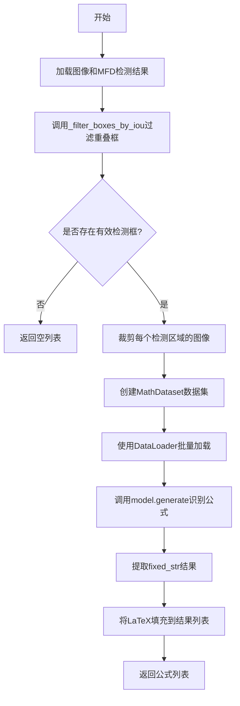
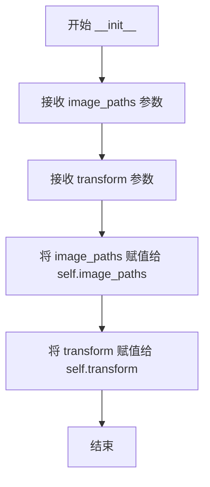
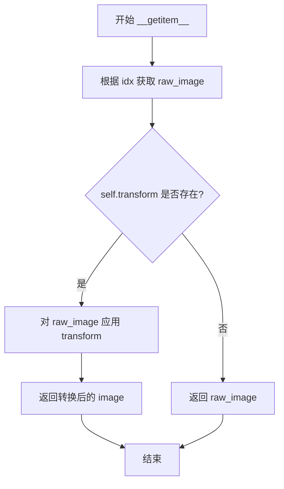
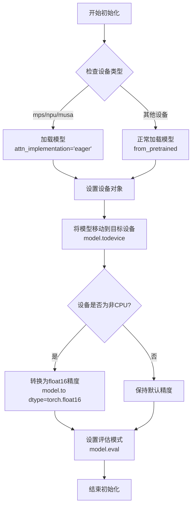
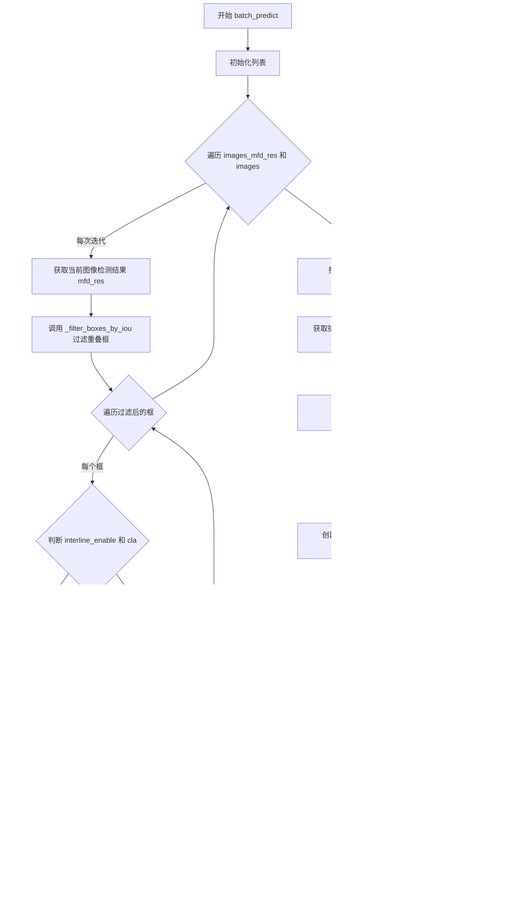
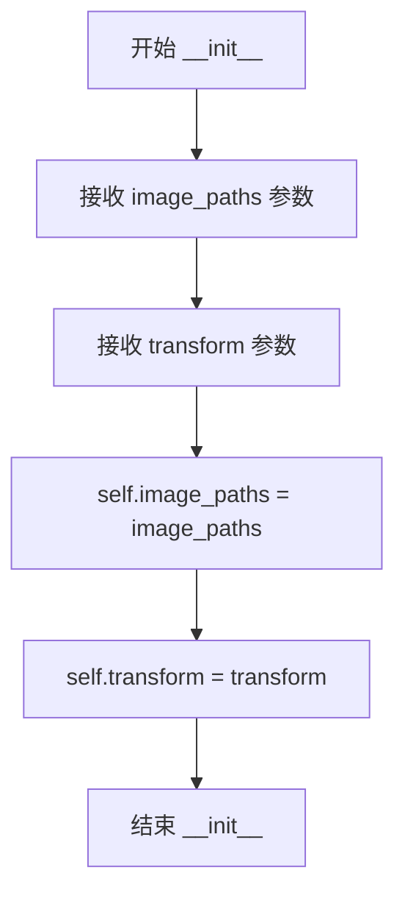
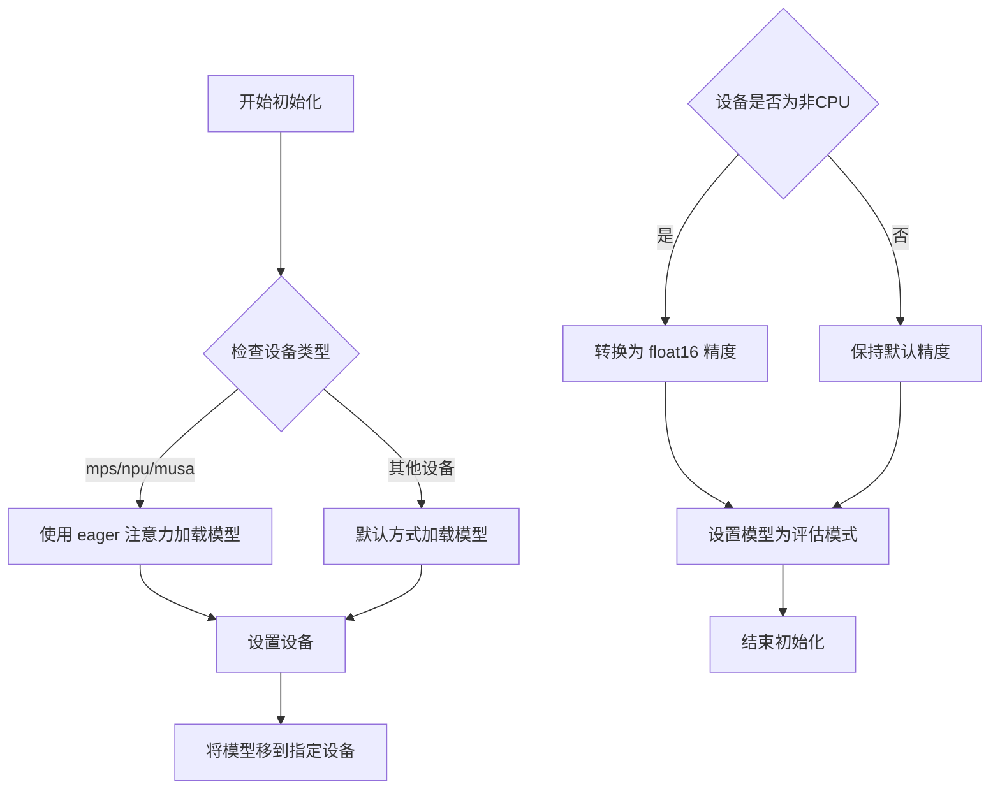
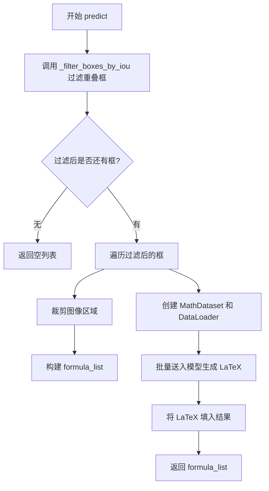
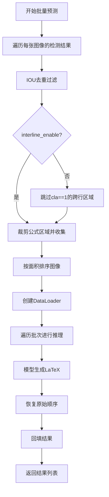

# `MinerU\mineru\model\mfr\unimernet\Unimernet.py` 详细设计文档

这是一个数学公式识别(MFR)模块,接收图像中检测到的数学公式区域(MFD结果),通过IOU去重过滤重叠框,使用Unimernet深度学习模型识别公式图像并转换为LaTeX文本输出。

## 整体流程



## 类结构

```
MathDataset (继承Dataset)
└── __init__, __len__, __getitem__

UnimernetModel
├── __init__ (模型加载与初始化)
├── _filter_boxes_by_iou (IOU去重静态方法)
├── predict (单图预测)
└── batch_predict (批量预测)
```

## 全局变量及字段


### `torch`
    
PyTorch张量计算库

类型：`module`
    


### `DataLoader`
    
PyTorch数据加载器

类型：`class`
    


### `Dataset`
    
PyTorch数据集基类

类型：`class`
    


### `tqdm`
    
进度条库

类型：`module`
    


### `calculate_iou`
    
IOU计算函数(外部导入)

类型：`function`
    


### `MathDataset.image_paths`
    
图像路径列表

类型：`list`
    


### `MathDataset.transform`
    
图像变换函数

类型：`callable`
    


### `UnimernetModel.model`
    
深度学习模型实例

类型：`UnimernetModel`
    


### `UnimernetModel.device`
    
计算设备(CPU/CUDA/MPS/NPU)

类型：`torch.device`
    
    

## 全局函数及方法


### `MathDataset.__init__`

初始化 MathDataset 数据集实例，用于存储图像路径和图像变换函数。

参数：

- `self`：`MathDataset` 实例本身，隐式参数
- `image_paths`：`list`，图像文件的路径列表，存储所有待处理的图像路径
- `transform`：可选的 `callable` 类型，表示对图像进行预处理的变换函数（如数据增强），默认为 `None`

返回值：`None`，无返回值（`__init__` 方法用于初始化对象状态）

#### 流程图



#### 带注释源码

```python
def __init__(self, image_paths, transform=None):
    """初始化 MathDataset 数据集对象。

    Args:
        image_paths: 图像文件的路径列表，用于后续的图像加载
        transform: 可选的图像变换函数，默认为 None
    """
    # 将传入的图像路径列表存储为实例属性，供 __getitem__ 方法使用
    self.image_paths = image_paths

    # 将图像变换函数（如果有）存储为实例属性，在加载图像时应用
    self.transform = transform
```


### `MathDataset.__len__`

该方法实现了 Python 的特殊方法 `__len__`，用于返回数据集的大小，即图像路径列表的长度，使该数据集对象可以与 Python 的 `len()` 函数配合使用，支持 DataLoader 自动计算数据集大小。

参数：无（继承自 Python 特殊方法，无需显式参数）

返回值：`int`，返回 `self.image_paths` 列表的长度，表示数据集中包含的图像数量。

#### 流程图

```mermaid
flowchart TD
    A[__len__ 被调用] --> B{执行}
    B --> C[返回 len(self.image_paths)]
    C --> D[返回整数值]
```

#### 带注释源码

```python
def __len__(self):
    """
    返回数据集的长度。
    
    该方法实现了 Python 的特殊方法 __len__，使得 MathDataset 实例
    可以与 len() 函数配合使用。PyTorch 的 DataLoader 在内部会调用
    此方法来确定数据集的大小，以便进行批次划分和迭代控制。
    
    Returns:
        int: 数据集中图像路径的数量，即 self.image_paths 列表的长度。
    """
    return len(self.image_paths)
```


### MathDataset.__getitem__

获取指定索引的图像数据，如果存在转换器则对图像进行转换后返回，否则返回原始图像。

参数：

- `idx`：`int`，要获取的图像在数据集中的索引

返回值：`torch.Tensor` 或原始图像对象，经过 transform 处理后的图像（如果 transform 存在），如果没有 transform 则返回原始图像。

#### 流程图



#### 带注释源码

```python
def __getitem__(self, idx):
    """获取指定索引的图像数据
    
    Args:
        idx: 要获取的图像索引
        
    Returns:
        经过 transform 处理后的图像张量，如果 transform 为 None 则返回原始图像
    """
    # 根据索引从图像路径列表中获取原始图像数据
    raw_image = self.image_paths[idx]
    
    # 检查是否定义了数据转换 transform
    if self.transform:
        # 如果存在 transform，则对原始图像应用转换处理
        image = self.transform(raw_image)
        # 返回转换后的图像
        return image
    
    # 注意：这里存在潜在的逻辑缺陷
    # 如果 self.transform 为 None，方法将不返回任何值
    # 正确的实现应该是直接返回 raw_image
    # 但根据调用方 MathDataset 的使用场景（UnimernetModel.predict 和 batch_predict）
    # 总是会传入 self.model.transform，所以这个分支不会被执行
```


### `UnimernetModel.__init__`

该方法用于加载预训练的Unimernet模型并初始化模型设备、精度等运行环境。根据设备类型（mps/npu/musa）选择不同的注意力实现方式，并将模型转换为半精度（float16）以提升推理速度（除CPU外）。

参数：

- `weight_dir`：`str`，预训练模型权重目录路径，用于加载模型参数
- `_device_`：`str`，目标计算设备，默认为"cpu"，支持"cuda"、"mps"、"npu"等设备

返回值：`None`，无返回值（`__init__` 方法）

#### 流程图



#### 带注释源码

```
def __init__(self, weight_dir, _device_="cpu"):
    # 从相对导入中获取UnimernetModel类
    # 这里使用延迟导入避免循环依赖
    from .unimernet_hf import UnimernetModel
    
    # 判断设备类型，针对特定设备使用eager注意力实现
    # mps: Apple Silicon GPU, npu: 华为昇腾, musa: 摩尔线程
    if _device_.startswith("mps") or _device_.startswith("npu") or _device_.startswith("musa"):
        # 使用eager模式加载模型，避免某些设备不支持的注意力机制
        self.model = UnimernetModel.from_pretrained(weight_dir, attn_implementation="eager")
    else:
        # 默认方式加载预训练模型
        self.model = UnimernetModel.from_pretrained(weight_dir)
    
    # 创建PyTorch设备对象
    self.device = torch.device(_device_)
    
    # 将模型参数移动到指定设备（CPU/GPU/NPU等）
    self.model.to(self.device)
    
    # 非CPU设备使用半精度浮点数以减少显存占用和加速推理
    if not _device_.startswith("cpu"):
        self.model = self.model.to(dtype=torch.float16)
    
    # 设置为评估模式，关闭dropout和batch normalization的训练行为
    self.model.eval()
```


### `UnimernetModel._filter_boxes_by_iou`

该静态方法用于根据IOU（Intersection over Union）阈值过滤重叠的边界框，保留置信度较高的框，适用于目标检测结果的后处理。

参数：

- `xyxy`：`torch.Tensor`，边界框坐标张量，shape为(N, 4)，格式为[x1, y1, x2, y2]
- `conf`：`torch.Tensor`，置信度张量，shape为(N,)
- `cla`：`torch.Tensor`，类别张量，shape为(N,)
- `iou_threshold`：`float`，IOU阈值，默认0.8，用于判断两个框是否重叠过高

返回值：`tuple[torch.Tensor, torch.Tensor, torch.Tensor]`，过滤后的( xyxy, conf, cla )三个张量，如果所有框都保留则返回原始输入

#### 流程图

```mermaid
flowchart TD
    A[开始] --> B{xyxy是否为空}
    B -->|是| C[直接返回原始xyxy, conf, cla]
    B -->|否| D[转换为CPU张量]
    D --> E[初始化keep标志列表为True]
    E --> F[外层循环: 遍历每个框i]
    F --> G{keep[i]是否为True}
    G -->|否| H[跳到下一个i]
    G -->|是| I[获取第i个框bbox1]
    I --> J[内层循环: 遍历i+1到n的框j]
    J --> K{keep[j]是否为True}
    K -->|否| L[跳到下一个j]
    K -->|是| M[获取第j个框bbox2]
    M --> N[计算bbox1和bbox2的IOU]
    N --> O{IOU > iou_threshold}
    O -->|否| P[继续下一个j]
    O -->|是| Q{conf[i] >= conf[j]}
    Q -->|是| R[keep[j] = False, 保留i]
    Q -->|否| S[keep[i] = False, break]
    R --> P
    S --> T[收集keep[i]为True的索引]
    P --> J
    H --> F
    F --> T
    T --> U{保留的索引数量 == n}
    U -->|是| V[返回原始输入]
    U -->|否| W[根据索引过滤张量]
    W --> X[返回过滤后的xyxy, conf, cla]
    C --> X
    V --> X
```

#### 带注释源码

```python
@staticmethod
def _filter_boxes_by_iou(xyxy, conf, cla, iou_threshold=0.8):
    """过滤IOU超过阈值的重叠框，保留置信度较高的框。

    Args:
        xyxy: 框坐标张量，shape为(N, 4)
        conf: 置信度张量，shape为(N,)
        cla: 类别张量，shape为(N,)
        iou_threshold: IOU阈值，默认0.8

    Returns:
        过滤后的xyxy, conf, cla张量
    """
    # 边界情况处理：空框直接返回
    if len(xyxy) == 0:
        return xyxy, conf, cla

    # 转换为CPU进行处理，避免GPU计算冲突
    xyxy_cpu = xyxy.cpu()
    conf_cpu = conf.cpu()

    n = len(xyxy_cpu)
    # keep列表标记每个框是否被保留
    keep = [True] * n

    # 双重循环遍历所有框对，比较IOU
    for i in range(n):
        # 已删除的框直接跳过
        if not keep[i]:
            continue
        bbox1 = xyxy_cpu[i].tolist()
        # 从i+1开始避免重复比较和自比较
        for j in range(i + 1, n):
            if not keep[j]:
                continue
            bbox2 = xyxy_cpu[j].tolist()
            # 计算两个框的IOU
            iou = calculate_iou(bbox1, bbox2)
            # 如果IOU超过阈值，保留置信度较高的框
            if iou > iou_threshold:
                # 保留置信度较高的框
                if conf_cpu[i] >= conf_cpu[j]:
                    keep[j] = False  # 删除j
                else:
                    keep[i] = False  # 删除i
                    break  # i被删除，跳出内循环

    # 收集保留的框的索引
    keep_indices = [i for i in range(n) if keep[i]]
    # 如果没有框被过滤，直接返回原始张量（保持引用）
    if len(keep_indices) == n:
        return xyxy, conf, cla

    # 根据保留的索引过滤张量
    keep_indices = torch.tensor(keep_indices, dtype=torch.long)
    return xyxy[keep_indices], conf[keep_indices], cla[keep_indices]
```


### `UnimernetModel.predict`

该方法负责接收公式检测模型（MFD）的输出和原始图像，对检测到的公式区域进行图像裁剪、预处理，并调用底层深度学习模型进行公式识别（OCR），最终将识别出的 LaTeX 字符串填充回结果结构中并返回。

参数：

- `self`：实例方法，包含模型权重和推理配置。
- `mfd_res`：`Any` (假设为包含 `boxes` 属性的对象，如 `mfd_res.boxes.xyxy`, `mfd_res.boxes.conf`, `mfd_res.boxes.cls`)，表示公式检测的结果，包含检测框坐标、置信度和类别。
- `image`：`Any` (通常为 `numpy.ndarray` 或 `torch.Tensor`)，输入的原始图像，用于根据检测框坐标裁剪出公式区域。

返回值：`List[Dict]`，返回一个包含多个字典的列表。每个字典代表一个识别出的公式，包含 `category_id`（类别ID）、`poly`（多边形坐标）、`score`（置信度）和 `latex`（识别出的 LaTeX 字符串）。

#### 流程图

```mermaid
graph TD
    A[输入: mfd_res, image] --> B{调用 _filter_boxes_by_iou 过滤重叠框}
    B --> C[遍历过滤后的框: xyxy, conf, cla]
    C --> D[计算坐标并整型化: xmin, ymin, xmax, ymax]
    D --> E[构建结果项 new_item: category_id, poly, score, latex='']
    E --> F[裁剪图像: bbox_img = image[ymin:ymax, xmin:xmax]]
    F --> G[将 new_item 和 bbox_img 加入列表]
    C --> H[构建 MathDataset 和 DataLoader]
    H --> I[遍历 DataLoader (batch)]
    I --> J[调用 self.model.generate 推理]
    J --> K[提取结果 'fixed_str']
    K --> L[将识别结果填入对应 formula_list 项]
    L --> M[返回 formula_list]
```

#### 带注释源码

```python
def predict(self, mfd_res, image):
    """单图像公式识别预测

    Args:
        mfd_res: 公式检测结果对象，需包含 .boxes.xyxy, .boxes.conf, .boxes.cls
        image: 原始图像数据

    Returns:
        包含识别结果和位置信息的字典列表
    """
    formula_list = []  # 最终返回的公式列表
    mf_image_list = [] # 用于模型推理的裁剪图像列表

    # 1. 对检测框进行IOU去重，保留置信度较高的框
    # 调用静态方法过滤重叠的检测框，避免重复识别同一个公式
    xyxy_filtered, conf_filtered, cla_filtered = self._filter_boxes_by_iou(
        mfd_res.boxes.xyxy, mfd_res.boxes.conf, mfd_res.boxes.cls
    )

    # 2. 遍历过滤后的检测框，处理每一个公式区域
    for xyxy, conf, cla in zip(
        xyxy_filtered.cpu(), conf_filtered.cpu(), cla_filtered.cpu()
    ):
        # 转换坐标为整数
        xmin, ymin, xmax, ymax = [int(p.item()) for p in xyxy]
        
        # 构建结果项结构
        new_item = {
            "category_id": 13 + int(cla.item()), # 根据类别偏移计算ID
            "poly": [xmin, ymin, xmax, ymin, xmax, ymax, xmin, ymax], # 矩形坐标
            "score": round(float(conf.item()), 2), # 置信度
            "latex": "", # 预占位，识别后再填充
        }
        formula_list.append(new_item)
        
        # 3. 根据坐标裁剪原始图像中的公式区域
        bbox_img = image[ymin:ymax, xmin:xmax]
        mf_image_list.append(bbox_img)

    # 4. 构建数据集并加载
    # 使用模型自带的 transform 进行预处理
    dataset = MathDataset(mf_image_list, transform=self.model.transform)
    dataloader = DataLoader(dataset, batch_size=32, num_workers=0)
    
    mfr_res = [] # 存储模型识别结果
    
    # 5. 遍历数据加载器进行批量推理
    for mf_img in dataloader:
        # 确保数据类型和设备与模型一致
        mf_img = mf_img.to(dtype=self.model.dtype)
        mf_img = mf_img.to(self.device)
        
        # 关闭梯度计算以加速推理
        with torch.no_grad():
            output = self.model.generate({"image": mf_img})
        
        # 收集识别出的字符串
        mfr_res.extend(output["fixed_str"])
        
    # 6. 将识别出的 Latex 字符串填充回结果列表
    for res, latex in zip(formula_list, mfr_res):
        res["latex"] = latex
        
    return formula_list
```


### `UnimernetModel.batch_predict`

该方法实现批量图像公式识别（Math Formula Recognition, MFR）预测功能。它接收一批图像及其对应的检测结果（由文字检测模型MFD提供），对每个图像的检测框进行IOU去重和行间公式过滤，根据图像块面积排序以优化推理效率，最后通过DataLoader批量调用模型生成公式，并将结果按原始顺序回填到对应图像的公式列表中。

参数：

- `self`：类的实例对象。
- `images_mfd_res`：`list`，图像检测结果列表。每个元素对应一张图像的MFD（Math Formula Detection）结果，通常包含`boxes.xyxy`（边界框坐标）、`boxes.conf`（置信度）、`boxes.cls`（类别）等属性。
- `images`：`list`，原始图像列表，元素类型通常为numpy数组或PIL图像。
- `batch_size`：`int`，模型推理时的批大小，默认为64。方法内部会对其进行调整以确保不超过图像数量且为2的幂次（如果可能）。
- `interline_enable`：`bool`，是否启用行间公式识别。默认为True。若设为False，将跳过类别为1（行间公式）的检测框。

返回值：`list`，包含每张图像公式识别结果的列表。每个元素是一个字典列表，字典包含`category_id`（类别ID）、`poly`（多边形坐标）、`score`（置信度）、`latex`（识别出的LaTeX公式字符串）。

#### 流程图



#### 带注释源码

```python
def batch_predict(
        self,
        images_mfd_res: list,
        images: list,
        batch_size: int = 64,
        interline_enable: bool = True,
) -> list:
    """批量图像公式识别预测

    Args:
        images_mfd_res: 图像检测结果列表，每个元素包含 boxes (xyxy, conf, cls)
        images: 原始图像列表
        batch_size: 推理批次大小
        interline_enable: 是否启用行间公式识别

    Returns:
        包含每张图像公式列表的列表
    """
    images_formula_list = []  # 存储每张图像的公式列表
    mf_image_list = []        # 存储所有待识别的图像块
    backfill_list = []        # 存储扁平化的公式项，用于后续填充结果
    image_info = []           # 存储 (面积, 原始索引, 图像块) 元组

    # 1. 遍历每张图像及其检测结果
    for image_index in range(len(images_mfd_res)):
        mfd_res = images_mfd_res[image_index]
        image = images[image_index]
        formula_list = []

        # 对检测框进行IOU去重，保留置信度较高的框
        xyxy_filtered, conf_filtered, cla_filtered = self._filter_boxes_by_iou(
            mfd_res.boxes.xyxy, mfd_res.boxes.conf, mfd_res.boxes.cls
        )

        # 2. 遍历每个过滤后的检测框
        for idx, (xyxy, conf, cla) in enumerate(zip(
                xyxy_filtered, conf_filtered, cla_filtered
        )):
            # 如果不启用行间公式识别且当前框为行间类别(1)，则跳过
            if not interline_enable and cla.item() == 1:
                continue 
            
            # 提取坐标并转换为整数
            xmin, ymin, xmax, ymax = [int(p.item()) for p in xyxy]
            
            # 构建公式项结构
            new_item = {
                "category_id": 13 + int(cla.item()),  # 类别ID偏移
                "poly": [xmin, ymin, xmax, ymin, xmax, ymax, xmin, ymax],  # 8点多边形
                "score": round(float(conf.item()), 2),
                "latex": "",
            }
            formula_list.append(new_item)
            
            # 裁剪图像块
            bbox_img = image[ymin:ymax, xmin:xmax]
            area = (xmax - xmin) * (ymax - ymin)  # 计算面积

            # 记录当前图像块信息，用于后续排序
            curr_idx = len(mf_image_list)
            image_info.append((area, curr_idx, bbox_img))
            mf_image_list.append(bbox_img)

        # 保存当前图像的公式列表
        images_formula_list.append(formula_list)
        # 追加到扁平列表中
        backfill_list += formula_list

    # 3. 按面积排序图像块（优化推理效率，通常小图在前可快速返回结果或平衡负载）
    image_info.sort(key=lambda x: x[0])  # sort by area
    sorted_indices = [x[1] for x in image_info]
    sorted_images = [x[2] for x in image_info]

    # 4. 创建索引映射：将排序后的新索引映射回在 mf_image_list 中的旧索引
    index_mapping = {new_idx: old_idx for new_idx, old_idx in enumerate(sorted_indices)}

    # 5. 创建数据集和 DataLoader
    dataset = MathDataset(sorted_images, transform=self.model.transform)

    # 动态调整 batch_size：如果图像数量少于 batch_size，则设为不超过图像数量的最大2的幂
    if sorted_images:
        # bit_length - 1 得到最大的幂次，例如 15(1111) -> 4 -> 2^3=8
        batch_size = min(batch_size, max(1, 2 ** (len(sorted_images).bit_length() - 1)))
    else:
        batch_size = 1
        
    dataloader = DataLoader(dataset, batch_size=batch_size, num_workers=0)

    # 6. 批量推理
    mfr_res = []

    with tqdm(total=len(sorted_images), desc="MFR Predict") as pbar:
        for index, mf_img in enumerate(dataloader):
            # 转换数据类型和设备
            mf_img = mf_img.to(dtype=self.model.dtype)
            mf_img = mf_img.to(self.device)
            
            # 推理
            with torch.no_grad():
                output = self.model.generate({"image": mf_img}, batch_size=batch_size)
            
            # 收集结果
            mfr_res.extend(output["fixed_str"])

            # 更新进度条
            current_batch_size = min(batch_size, len(sorted_images) - index * batch_size)
            pbar.update(current_batch_size)

    # 7. 恢复原始顺序
    unsorted_results = [""] * len(mfr_res)
    for new_idx, latex in enumerate(mfr_res):
        # new_idx 是排序后的索引，需要找到它对应的原始 mf_image_list 中的索引
        original_idx = index_mapping[new_idx]
        unsorted_results[original_idx] = latex

    # 8. 将结果填充回对应的公式项
    for res, latex in zip(backfill_list, unsorted_results):
        res["latex"] = latex

    return images_formula_list
```


### `MathDataset.__init__`

该方法是 `MathDataset` 类的构造函数，用于初始化数据集实例。它接收图像路径列表和可选的图像变换函数，并将它们存储为实例属性，以供后续的 `__len__` 和 `__getitem__` 方法使用。

参数：

- `self`：隐式参数，表示数据集实例本身
- `image_paths`：`list`，图像文件的路径列表，用于指定数据集中的图像来源
- `transform`：`Callable | None`，可选的图像变换函数，默认为 `None`，用于对原始图像进行预处理或数据增强

返回值：`None`，该方法不返回任何值，仅初始化实例属性

#### 流程图



#### 带注释源码

```python
def __init__(self, image_paths, transform=None):
    """初始化 MathDataset 数据集实例。

    Args:
        image_paths: 图像文件的路径列表，类型为 list
        transform: 可选的图像变换函数，类型为 Callable 或 None，默认为 None
    """
    # 将传入的图像路径列表存储为实例属性，供后续方法使用
    self.image_paths = image_paths
    
    # 将可选的图像变换函数存储为实例属性，用于 __getitem__ 中的图像预处理
    self.transform = transform
```

#### 补充说明

| 属性 | 类型 | 描述 |
|------|------|------|
| `self.image_paths` | `list` | 存储图像文件的路径列表 |
| `self.transform` | `Callable \| None` | 存储图像变换函数，用于数据预处理 |

#### 技术债务与优化空间

1. **缺少参数类型注解**：建议添加类型注解以提高代码可读性和 IDE 支持
2. **缺少输入验证**：建议对 `image_paths` 参数进行类型检查和非空验证
3. **文档不完整**：建议添加更详细的类文档说明，包括使用示例


### `MathDataset.__len__`

该方法是Python数据集类的标准长度方法，返回数据集中图像的数量，使DataLoader能够确定数据集的大小以便进行批量迭代。

参数：

-  `self`：`MathDataset` 实例本身，不需要显式传递

返回值：`int`，返回数据集中图像的数量，即`image_paths`列表的长度

#### 流程图

```mermaid
flowchart TD
    A[开始 __len__] --> B[返回 len(self.image_paths)]
    B --> C[结束]
```

#### 带注释源码

```python
def __len__(self):
    """返回数据集的长度，即图像路径的数量。
    
    此方法是Python Dataset类的标准接口的一部分，
    使DataLoader能够确定需要迭代的批次数。
    
    Returns:
        int: 数据集中图像的总数
    """
    return len(self.image_paths)
```


### `MathDataset.__getitem__`

该方法实现了 PyTorch Dataset 类的数据获取接口，根据传入的索引从图像路径列表中读取原始图像，并对其进行数据增强转换，最终返回转换后的图像张量供模型使用。

参数：

- `idx`：`int`，数据集的索引，用于从 `self.image_paths` 列表中获取对应的原始图像

返回值：`torch.Tensor` 或 `None`，经过 `self.transform` 转换后的图像张量；如果 `self.transform` 为 `None`，则直接返回 `None`（代码潜在问题：未处理 transform 为 None 的情况）

#### 流程图

```mermaid
flowchart TD
    A[接收索引 idx] --> B{检查 idx 是否在有效范围内}
    B -->|是| C[从 self.image_paths 获取原始图像 raw_image]
    B -->|否| D[抛出 IndexError 异常]
    C --> E{检查 self.transform 是否存在}
    E -->|是| F[调用 transform 对 raw_image 进行转换]
    E -->|否| G[返回 None]
    F --> H[返回转换后的图像 image]
    
    style G fill:#ffcccc
    note "潜在问题: transform 为 None 时返回 None，可能导致后续处理出错"
```

#### 带注释源码

```python
def __getitem__(self, idx):
    """根据索引获取数据集中的单个样本
    
    Args:
        idx: int，数据集中的索引位置
        
    Returns:
        经过 transform 转换后的图像张量，如果 transform 为 None 则返回 None
    """
    # 从图像路径列表中根据索引获取原始图像路径
    raw_image = self.image_paths[idx]
    
    # 检查是否定义了数据转换 transform
    if self.transform:
        # 如果存在 transform，则对原始图像进行转换处理
        # transform 通常包含图像预处理操作，如 resize、normalize、augmentation 等
        image = self.transform(raw_image)
        
        # 返回转换后的图像张量
        return image
    
    # 注意：此处存在潜在逻辑缺陷
    # 如果 self.transform 为 None，方法将隐式返回 None
    # 调用方需要自行处理 None 的情况，否则可能导致后续代码报错
```


### `UnimernetModel.__init__`

该方法为 UnimernetModel 类的构造函数，负责加载预训练模型权重到指定设备，并根据设备类型配置模型精度（CPU 设备使用默认精度，其他设备使用 float16）。

参数：

- `weight_dir`：`str`，预训练模型权重目录路径
- `_device_`：`str`，指定计算设备，默认为 "cpu"，支持 "cpu"、"mps"、"npu"、"musa" 等设备

返回值：`None`，无返回值（构造函数）

#### 流程图



#### 带注释源码

```python
def __init__(self, weight_dir, _device_="cpu"):
    """初始化 UnimernetModel 模型实例。
    
    Args:
        weight_dir: 预训练模型权重目录路径
        _device_: 计算设备，默认为 "cpu"
    """
    # 从相对导入中获取 UnimernetModel 类
    from .unimernet_hf import UnimernetModel
    
    # 根据设备类型选择不同的模型加载方式
    # 对于 mps (Apple Silicon)、npu (华为昇腾)、musa (摩尔线程) 等特殊设备
    # 需要使用 eager 注意力实现以确保兼容性
    if _device_.startswith("mps") or _device_.startswith("npu") or _device_.startswith("musa"):
        self.model = UnimernetModel.from_pretrained(weight_dir, attn_implementation="eager")
    else:
        # 默认使用 flash attention 或其他优化注意力机制
        self.model = UnimernetModel.from_pretrained(weight_dir)
    
    # 将设备字符串转换为 PyTorch 的 device 对象
    self.device = torch.device(_device_)
    
    # 将模型参数和缓冲区移到指定设备
    self.model.to(self.device)
    
    # 如果设备不是 CPU，则使用半精度浮点数以节省显存和提高推理速度
    if not _device_.startswith("cpu"):
        self.model = self.model.to(dtype=torch.float16)
    
    # 设置模型为评估模式，禁用 dropout 等训练时特定的行为
    self.model.eval()
```


### `UnimernetModel._filter_boxes_by_iou`

该函数是一个静态方法，用于对目标检测结果进行非极大值抑制（NMS）处理，通过计算框之间的IOU（交并比）来过滤重叠框，保留置信度较高的框。

参数：

- `xyxy`：`torch.Tensor`，框坐标张量，shape为(N, 4)，格式为[x1, y1, x2, y2]
- `conf`：`torch.Tensor`，置信度张量，shape为(N,)
- `cla`：`torch.Tensor`，类别张量，shape为(N,)
- `iou_threshold`：`float`，IOU阈值，默认为0.8，用于判断框是否重叠

返回值：`tuple`，返回过滤后的`(xyxy, conf, cla)`三个张量

#### 流程图

```mermaid
flowchart TD
    A[开始] --> B{xyxy是否为空}
    B -->|是| C[直接返回原始xyxy, conf, cla]
    B -->|否| D[将xyxy和conf转换为CPU张量]
    D --> E[初始化keep标志列表, 长度为n, 全部为True]
    E --> F[外层循环: 遍历i从0到n-1]
    F --> G{keep[i]是否为True}
    G -->|否| H[继续下一个i]
    G -->|是| I[获取第i个框bbox1]
    I --> J[内层循环: 遍历j从i+1到n-1]
    J --> K{keep[j]是否为True}
    K -->|否| L[继续下一个j]
    K -->|是| M[获取第j个框bbox2]
    M --> N[计算bbox1和bbox2的IOU]
    N --> O{IOU是否大于iou_threshold}
    O -->|否| P[继续下一个j]
    O -->|是| Q{conf[i] >= conf[j]?}
    Q -->|是| R[keep[j] = False, 保留i]
    Q -->|否| S[keep[i] = False, 跳出内循环]
    R --> P
    S --> T
    H --> F
    F --> U[收集keep[i]为True的索引]
    U --> V{保留数量是否等于n}
    V -->|是| C
    V -->|否| W[根据保留索引过滤xyxy, conf, cla]
    W --> X[返回过滤后的张量]
```

#### 带注释源码

```python
@staticmethod
def _filter_boxes_by_iou(xyxy, conf, cla, iou_threshold=0.8):
    """过滤IOU超过阈值的重叠框，保留置信度较高的框。

    Args:
        xyxy: 框坐标张量，shape为(N, 4)
        conf: 置信度张量，shape为(N,)
        cla: 类别张量，shape为(N,)
        iou_threshold: IOU阈值，默认0.8

    Returns:
        过滤后的xyxy, conf, cla张量
    """
    # 如果没有框，直接返回空输入
    if len(xyxy) == 0:
        return xyxy, conf, cla

    # 转换为CPU进行处理，避免GPU与CPU张量混合计算问题
    xyxy_cpu = xyxy.cpu()
    conf_cpu = conf.cpu()

    n = len(xyxy_cpu)  # 获取框的数量
    keep = [True] * n  # 初始化保留标志列表

    # 双重循环遍历所有框对
    for i in range(n):
        if not keep[i]:  # 如果当前框已被标记为删除，跳过
            continue
        bbox1 = xyxy_cpu[i].tolist()  # 获取第i个框的坐标
        for j in range(i + 1, n):  # 只遍历i之后的框，避免重复计算
            if not keep[j]:  # 如果框已被标记为删除，跳过
                continue
            bbox2 = xyxy_cpu[j].tolist()  # 获取第j个框的坐标
            iou = calculate_iou(bbox1, bbox2)  # 计算两个框的IOU
            if iou > iou_threshold:  # 如果IOU超过阈值
                # 保留置信度较高的框
                if conf_cpu[i] >= conf_cpu[j]:
                    keep[j] = False  # 删除框j
                else:
                    keep[i] = False  # 删除框i
                    break  # i被删除，跳出内循环

    # 收集保留框的索引
    keep_indices = [i for i in range(n) if keep[i]]
    
    # 如果所有框都被保留，直接返回原始张量（避免不必要的数据拷贝）
    if len(keep_indices) == n:
        return xyxy, conf, cla

    # 根据保留索引过滤张量
    keep_indices = torch.tensor(keep_indices, dtype=torch.long)
    return xyxy[keep_indices], conf[keep_indices], cla[keep_indices]
```


### `UnimernetModel.predict`

该方法接收目标检测结果和原始图像，使用IOU过滤去除重叠检测框，裁剪公式区域图像，调用深度学习模型生成LaTeX公式，最终返回包含坐标、类别、置信度和LaTeX公式的列表。

参数：

- `mfd_res`：检测结果对象，包含 `boxes.xyxy`（边界框坐标）、`boxes.conf`（置信度）、`boxes.cls`（类别）
- `image`：原始图像数据（numpy数组或类似格式）

返回值：`list[dict]`，返回包含公式检测结果的字典列表，每个字典包含 `category_id`、`poly`、`score`、`latex` 字段

#### 流程图



#### 带注释源码

```python
def predict(self, mfd_res, image):
    """
    对输入图像进行公式识别预测
    
    Args:
        mfd_res: 目标检测结果对象，包含boxes属性
        image: 原始图像数据
    
    Returns:
        包含检测框信息和识别结果的字典列表
    """
    # 初始化结果列表和图像片段列表
    formula_list = []
    mf_image_list = []

    # 第一步：对检测框进行IOU去重，保留置信度较高的框
    # 调用静态方法 _filter_boxes_by_iou 过滤重叠检测框
    xyxy_filtered, conf_filtered, cla_filtered = self._filter_boxes_by_iou(
        mfd_res.boxes.xyxy, mfd_res.boxes.conf, mfd_res.boxes.cls
    )

    # 第二步：遍历过滤后的检测框，处理每个公式区域
    for xyxy, conf, cla in zip(
        xyxy_filtered.cpu(), conf_filtered.cpu(), cla_filtered.cpu()
    ):
        # 将张量转换为Python标量并取整
        xmin, ymin, xmax, ymax = [int(p.item()) for p in xyxy]
        
        # 构建公式项字典，包含类别ID、多边形坐标、置信度
        new_item = {
            "category_id": 13 + int(cla.item()),  # 类别ID偏移
            "poly": [xmin, ymin, xmax, ymin, xmax, ymax, xmin, ymax],  # 8点多边形
            "score": round(float(conf.item()), 2),  # 置信度保留两位小数
            "latex": "",  # 初始为空，等待后续填充识别结果
        }
        formula_list.append(new_item)
        
        # 裁剪图像中的公式区域
        bbox_img = image[ymin:ymax, xmin:xmax]
        mf_image_list.append(bbox_img)

    # 第三步：创建数据集和数据加载器
    # 使用 MathDataset 封装图像列表，并应用模型自带的transform
    dataset = MathDataset(mf_image_list, transform=self.model.transform)
    # batch_size=32, num_workers=0 表示单进程加载
    dataloader = DataLoader(dataset, batch_size=32, num_workers=0)

    # 第四步：遍历数据加载器，逐批进行推理
    mfr_res = []  # 存储识别结果
    for mf_img in dataloader:
        # 转换数据类型和设备
        mf_img = mf_img.to(dtype=self.model.dtype)  # 使用模型指定的数据类型
        mf_img = mf_img.to(self.device)  # 移动到指定设备
        
        # 禁用梯度计算以提高推理效率
        with torch.no_grad():
            # 调用模型的generate方法进行公式识别
            output = self.model.generate({"image": mf_img})
        
        # 收集识别结果（fixed_str为LaTeX字符串）
        mfr_res.extend(output["fixed_str"])

    # 第五步：将识别结果填入对应的结果项中
    for res, latex in zip(formula_list, mfr_res):
        res["latex"] = latex

    # 返回完整的公式检测与识别结果列表
    return formula_list
```


### `UnimernetModel.batch_predict`

该方法是一个批量预测接口，用于对多个图像中的数学公式进行识别。它接收多个图像的检测结果（包含检测框信息）和原始图像列表，通过IOU过滤重叠框，按面积排序后批量处理，最后将识别结果按原始顺序返回。

参数：

- `images_mfd_res`：`list`，多个图像的检测结果列表，每个元素包含检测到的公式框（boxes）、置信度（conf）和类别（cls）
- `images`：`list`，原始图像列表，与检测结果列表一一对应
- `batch_size`：`int`，批处理大小，默认值为64，用于控制DataLoader的批次大小
- `interline_enable`：`bool`，是否启用行间公式识别，默认为True；当为False时跳过类别为1的行间区域

返回值：`list`，返回每个图像的公式列表，每个公式包含类别ID、多边形坐标、置信度和LaTeX字符串

#### 流程图

```mermaid
flowchart TD
    A[开始 batch_predict] --> B[初始化空列表]
    B --> C[遍历 images_mfd_res 和 images]
    C --> D{当前索引 < 列表长度?}
    D -->|是| E[获取当前图像的检测结果和原始图像]
    E --> F[调用 _filter_boxes_by_iou 过滤重叠框]
    F --> G[遍历过滤后的检测框]
    G --> H{interline_enable 为 True 或 cla != 1?}
    H -->|是| I[构建 formula_list 条目]
    I --> J[裁剪图像区域并计算面积]
    J --> K[添加到 mf_image_list 和 image_info]
    H -->|否| L[跳过当前框]
    L --> G
    G --> M{还有更多检测框?}
    M -->|是| G
    M -->|否| N[保存当前图像的 formula_list]
    N --> C
    D -->|否| O[按面积排序 image_info]
    O --> P[创建 sorted_indices 和 sorted_images]
    P --> Q[创建 index_mapping 映射表]
    Q --> R[创建 MathDataset 和 DataLoader]
    R --> S[使用 tqdm 遍历 DataLoader]
    S --> T[将图像转换为模型 dtype 和 device]
    T --> U[调用 model.generate 进行推理]
    U --> V[获取 output['fixed_str'] 结果]
    V --> W[更新进度条]
    W --> S
    S --> X{还有更多批次?}
    X -->|是| S
    X -->|否| Y[根据 index_mapping 恢复原始顺序]
    Y --> Z[将 latex 结果填回 backfill_list]
    Z --> AA[返回 images_formula_list]
    AA --> BB[结束]
```

#### 带注释源码

```python
def batch_predict(
        self,
        images_mfd_res: list,
        images: list,
        batch_size: int = 64,
        interline_enable: bool = True,
) -> list:
    """批量预测多个图像中的数学公式
    
    Args:
        images_mfd_res: 多个图像的检测结果列表
        images: 原始图像列表
        batch_size: 批处理大小，默认64
        interline_enable: 是否启用行间公式识别，默认True
    
    Returns:
        每个图像的公式识别结果列表
    """
    images_formula_list = []  # 存储每个图像的公式列表
    mf_image_list = []        # 存储所有裁剪的公式图像
    backfill_list = []        # 用于回填结果的引用列表
    image_info = []           # 存储(面积, 原始索引, 图像)元组

    # 遍历所有图像的检测结果
    for image_index in range(len(images_mfd_res)):
        mfd_res = images_mfd_res[image_index]  # 当前图像的检测结果
        image = images[image_index]             # 当前原始图像
        formula_list = []

        # 对检测框进行IOU去重，保留置信度较高的框
        xyxy_filtered, conf_filtered, cla_filtered = self._filter_boxes_by_iou(
            mfd_res.boxes.xyxy, mfd_res.boxes.conf, mfd_res.boxes.cls
        )

        # 遍历过滤后的每个检测框
        for idx, (xyxy, conf, cla) in enumerate(zip(
                xyxy_filtered, conf_filtered, cla_filtered
        )):
            # 如果未启用行间公式识别且当前类别为1（行间），则跳过
            if not interline_enable and cla.item() == 1:
                continue  # Skip interline regions if not enabled
            
            # 解析边界框坐标
            xmin, ymin, xmax, ymax = [int(p.item()) for p in xyxy]
            
            # 构建公式条目字典
            new_item = {
                "category_id": 13 + int(cla.item()),  # 类别ID偏移13
                "poly": [xmin, ymin, xmax, ymin, xmax, ymax, xmin, ymax],  # 多边形顶点
                "score": round(float(conf.item()), 2),  # 置信度得分
                "latex": "",  # 初始为空，识别后填充
            }
            formula_list.append(new_item)
            
            # 裁剪图像区域
            bbox_img = image[ymin:ymax, xmin:xmax]
            area = (xmax - xmin) * (ymax - ymin)  # 计算面积用于排序

            # 记录当前索引和图像信息
            curr_idx = len(mf_image_list)
            image_info.append((area, curr_idx, bbox_img))
            mf_image_list.append(bbox_img)

        # 保存当前图像的公式列表到结果中
        images_formula_list.append(formula_list)
        # 追加到回填列表（扁平化存储所有公式项）
        backfill_list += formula_list

    # 按面积从小到大排序（更小的先处理，可能更有利于显存管理）
    image_info.sort(key=lambda x: x[0])  # sort by area
    sorted_indices = [x[1] for x in image_info]   # 排序后的原始索引
    sorted_images = [x[2] for x in image_info]   # 排序后的图像列表

    # 创建索引映射：排序后索引 -> 原始索引
    index_mapping = {new_idx: old_idx for new_idx, old_idx in enumerate(sorted_indices)}

    # 创建数据集和数据加载器
    dataset = MathDataset(sorted_images, transform=self.model.transform)

    # 如果batch_size大于图像数量，则设置为不超过图像数量的2的幂
    batch_size = min(batch_size, max(1, 2 ** (len(sorted_images).bit_length() - 1))) if sorted_images else 1

    dataloader = DataLoader(dataset, batch_size=batch_size, num_workers=0)

    # 存储模型识别结果
    mfr_res = []

    # 使用tqdm显示进度
    with tqdm(total=len(sorted_images), desc="MFR Predict") as pbar:
        # 遍历每个批次
        for index, mf_img in enumerate(dataloader):
            # 转换数据类型和设备
            mf_img = mf_img.to(dtype=self.model.dtype)
            mf_img = mf_img.to(self.device)
            
            # 禁用梯度计算，进行推理
            with torch.no_grad():
                output = self.model.generate({"image": mf_img}, batch_size=batch_size)
            
            # 获取识别结果字符串
            mfr_res.extend(output["fixed_str"])

            # 更新进度条
            current_batch_size = min(batch_size, len(sorted_images) - index * batch_size)
            pbar.update(current_batch_size)

    # 恢复原始顺序：创建结果数组并按映射填充
    unsorted_results = [""] * len(mfr_res)
    for new_idx, latex in enumerate(mfr_res):
        original_idx = index_mapping[new_idx]
        unsorted_results[original_idx] = latex

    # 将识别结果回填到对应的公式项中
    for res, latex in zip(backfill_list, unsorted_results):
        res["latex"] = latex

    return images_formula_list
```

## 关键组件


### 核心功能概述

该代码实现了一个数学公式识别（Math Formula Recognition, MFR）系统，通过Unimernet模型对图像中的数学公式进行检测和识别，支持批量处理、IOU去重、跨行公式过滤等功能，并能根据设备类型自动选择量化策略（CPU使用float32，非CPU设备使用float16）以优化推理性能。

### 文件整体运行流程

1. **数据准备阶段**：接收检测结果（mfd_res）和原始图像，通过IOU过滤消除重叠框
2. **图像裁剪阶段**：根据过滤后的边界框坐标裁剪出公式图像区域
3. **批量排序阶段**：按裁剪区域面积排序以优化批处理效率
4. **模型推理阶段**：使用DataLoader批量加载图像，调用Unimernet模型生成LaTeX公式
5. **结果恢复阶段**：将推理结果按原始顺序回填到结果列表中

### 类详细信息

#### MathDataset类

| 字段名称 | 类型 | 描述 |
|---------|------|------|
| image_paths | list | 图像路径或图像数据列表 |
| transform | callable | 图像预处理变换函数 |

| 方法名称 | 参数 | 参数类型 | 参数描述 | 返回值类型 | 返回值描述 |
|---------|------|---------|---------|-----------|-----------|
| __init__ | image_paths, transform | list, callable | 初始化数据集，image_paths为图像列表，transform为变换函数 | None | 初始化对象 |
| __len__ | 无 | - | 返回数据集长度 | int | 图像数量 |
| __getitem__ | idx | int | 根据索引获取图像并应用变换 | Tensor | 变换后的图像张量 |

**带注释源码：**
```python
class MathDataset(Dataset):
    def __init__(self, image_paths, transform=None):
        self.image_paths = image_paths  # 存储图像路径列表
        self.transform = transform      # 存储图像变换函数

    def __len__(self):
        return len(self.image_paths)   # 返回图像总数

    def __getitem__(self, idx):
        raw_image = self.image_paths[idx]  # 根据索引获取原始图像
        if self.transform:
            image = self.transform(raw_image)  # 应用变换（如归一化、resize等）
            return image
```

#### UnimernetModel类

| 字段名称 | 类型 | 描述 |
|---------|------|------|
| model | UnimernetModel | HuggingFace格式的Unimernet模型实例 |
| device | torch.device | 模型运行设备 |

| 方法名称 | 参数 | 参数类型 | 参数描述 | 返回值类型 | 返回值描述 |
|---------|------|---------|---------|-----------|-----------|
| __init__ | weight_dir, _device_ | str, str | 权重目录路径和设备类型，_device_支持cpu/mps/npu/musa等 | None | 初始化模型并加载权重，根据设备选择量化策略 |
| _filter_boxes_by_iou | xyxy, conf, cla, iou_threshold | Tensor, Tensor, Tensor, float | 过滤重叠框，xyxy为边界框坐标，conf为置信度，cla为类别，iou_threshold为IOU阈值 | tuple | 过滤后的xyxy, conf, cla张量元组 |
| predict | mfd_res, image | object, ndarray | 单图预测，mfd_res为检测结果，image为原图 | list | 公式列表，每项包含category_id、poly、score、latex |
| batch_predict | images_mfd_res, images, batch_size, interline_enable | list, list, int, bool | 批量预测，images_mfd_res为检测结果列表，images为原图列表，batch_size为批大小，interline_enable为是否启用跨行公式识别 | list | 每张图像的公式识别结果列表 |

**Mermaid流程图（batch_predict方法）：**


**带注释源码（核心方法）：**
```python
def predict(self, mfd_res, image):
    formula_list = []
    mf_image_list = []

    # 对检测框进行IOU去重，保留置信度较高的框
    xyxy_filtered, conf_filtered, cla_filtered = self._filter_boxes_by_iou(
        mfd_res.boxes.xyxy, mfd_res.boxes.conf, mfd_res.boxes.cls
    )

    # 遍历每个过滤后的检测框
    for xyxy, conf, cla in zip(
            xyxy_filtered.cpu(), conf_filtered.cpu(), cla_filtered.cpu()
    ):
        xmin, ymin, xmax, ymax = [int(p.item()) for p in xyxy]  # 张量索引转为Python标量
        new_item = {
            "category_id": 13 + int(cla.item()),
            "poly": [xmin, ymin, xmax, ymin, xmax, ymax, xmin, ymax],  # 边界框多边形表示
            "score": round(float(conf.item()), 2),
            "latex": "",
        }
        formula_list.append(new_item)
        bbox_img = image[ymin:ymax, xmin:xmax]  # 图像裁剪：numpy数组索引
        mf_image_list.append(bbox_img)

    # 创建数据集和DataLoader
    dataset = MathDataset(mf_image_list, transform=self.model.transform)
    dataloader = DataLoader(dataset, batch_size=32, num_workers=0)
    
    # 模型推理
    mfr_res = []
    for mf_img in dataloader:
        mf_img = mf_img.to(dtype=self.model.dtype)  # 类型转换：与模型权重类型匹配
        mf_img = mf_img.to(self.device)              # 设备迁移：张量移至指定设备
        with torch.no_grad():
            output = self.model.generate({"image": mf_img})
        mfr_res.extend(output["fixed_str"])
    
    # 填充识别结果
    for res, latex in zip(formula_list, mfr_res):
        res["latex"] = latex
    return formula_list
```

### 全局函数详细信息

| 函数名称 | 参数 | 参数类型 | 参数描述 | 返回值类型 | 返回值描述 |
|---------|------|---------|---------|-----------|-----------|
| calculate_iou | bbox1, bbox2 | list, list | 计算两个边界框的IOU，bbox1和bbox2为[xmin, ymin, xmax, ymax]格式 | float | IOU值，范围[0, 1] |

### 关键组件信息

#### 张量索引与惰性加载

代码中通过numpy数组切片 `image[ymin:ymax, xmin:xmax]` 实现张量索引，进行图像裁剪。惰性加载通过MathDataset类的`__getitem__`方法实现，仅在迭代时加载图像数据，而非一次性全部加载到内存。

#### 反量化支持

模型推理时通过 `mf_img.to(dtype=self.model.dtype)` 将输入张量转换为与模型权重一致的dtype，实现数据的反量化（从float32转换为float16）。

#### 量化策略

根据设备类型选择不同的量化策略：
- 非CPU设备（mps/npu/musa）：使用float16量化，通过 `self.model.to(dtype=torch.float16)` 实现
- CPU设备：保持float32精度

#### IOU去重算法

`_filter_boxes_by_iou`方法实现了基于IOU的非极大值抑制（NMS）变体，采用贪心策略保留高置信度框。

#### 批量排序优化

`batch_predict`方法按裁剪区域面积排序图像，旨在优化批处理效率，但该策略可能导致内存碎片化。

### 潜在的技术债务或优化空间

1. **张量设备转换冗余**：每次推理都执行`.cpu()`和`.to(device)`转换，可考虑批量处理时预先统一设备
2. **排序策略的权衡**：按面积排序虽能优化内存使用，但破坏了原始检测顺序，增加了结果恢复复杂度
3. **硬编码的batch_size计算**：batch_size调整逻辑复杂且可能不是最优，可考虑自适应batch_size
4. **异常处理缺失**：模型加载和推理过程中缺乏完善的异常捕获机制
5. **num_workers固定为0**：数据加载未利用多进程优化
6. **跨设备兼容性**：IOU计算强制转到CPU处理，增加了设备间数据传输开销

### 其它项目

#### 设计目标与约束

- **目标**：高效识别图像中的数学公式并转换为LaTeX表示
- **约束**：需支持多种设备（CPU/MPS/NPU/MUSA），内存受限场景需优化

#### 错误处理与异常设计

- 模型加载失败时未捕获异常
- 空检测结果时返回空列表
- 数据类型不匹配时可能抛出RuntimeError

#### 数据流与状态机

```
输入图像 → 检测框过滤 → 图像裁剪 → 排序 → 批量推理 → 结果恢复 → 输出LaTeX列表
```

#### 外部依赖与接口契约

- 依赖`mineru.utils.boxbase.calculate_iou`计算IOU
- 依赖HuggingFace的UnimernetModel
- 输入格式：mfd_res需包含boxes.xyxy/conf/cls属性
- 输出格式：list[dict]，每项包含category_id, poly, score, latex字段


## 问题及建议


### 已知问题

-   **MathDataset的`__getitem__`方法存在逻辑缺陷**：当`self.transform`为`None`时，方法没有返回值（返回`None`），导致DataLoader获取数据时可能出错
-   **`_filter_boxes_by_iou`方法效率低下**：使用双重循环O(n²)复杂度，且每次迭代都调用`.cpu()`和`.tolist()`进行数据转换，应使用向量化操作或仅在开始时转换一次
-   **`predict`方法缺少输入验证**：没有对`mfd_res`和`image`进行空值或类型检查，可能导致后续操作失败
-   **`batch_predict`方法中存在死代码**：第129行有被注释掉的`for mf_img in dataloader:`循环
-   **进度条更新逻辑可能不准确**：第153行`current_batch_size = len(sorted_images) - index * batch_size`计算的是剩余样本数而非当前batch实际大小，应使用`mf_img.shape[0]`
-   **`batch_predict`方法存在冗余数据操作**：`backfill_list += formula_list`与`images_formula_list.append(formula_list)`重复，且后续使用`backfill_list`进行结果回填时索引对应关系不清晰
-   **类型提示不完整**：多个方法缺少参数类型和返回值类型提示，影响代码可维护性和IDE支持
-   **设备检测逻辑脆弱**：使用字符串`startswith`判断设备类型不够严谨，可能遗漏某些设备类型
-   **资源管理不完善**：模型推理后没有显式的缓存清理或显存释放机制

### 优化建议

-   修复`MathDataset.__getitem__`方法，确保无论transform是否存在都返回有效数据
-   重构`_filter_boxes_by_iou`方法，使用torch的向量运算或预先转换为CPU张量，避免循环中的频繁转换
-   为所有公开方法添加输入验证和类型检查，处理异常输入并给出明确错误信息
-   删除死代码并简化`batch_predict`方法的逻辑，澄清数据流转过程
-   完善类型提示，使用Python的`typing`模块标注参数和返回值类型
-   改进设备检测逻辑，使用`torch.cuda.is_available()`等官方API或枚举类型
-   考虑添加上下文管理器或显式的资源清理方法
-   提取重复的IOU过滤逻辑到独立方法，减少代码冗余

## 其它


### 设计目标与约束

**设计目标**：实现高效的数学公式识别（Math Formula Recognition，MFR）功能，支持对图像中检测到的公式区域进行识别，并将识别结果以LaTeX格式返回。

**约束条件**：
- 设备兼容性：支持CPU、 MPS（Apple Silicon）、NPU（华为昇腾）、MUSA（摩尔线程）等多种设备
- 内存限制：批处理大小需根据图像数量动态调整，最大不超过2的幂次
- 精度要求：非CPU设备默认使用float16以提升推理速度
- 依赖约束：依赖UnimernetModel、HuggingFace Transformers库

### 错误处理与异常设计

**模型加载异常**：
- 权重目录不存在或格式错误时，from_pretrained抛出异常
- 设备类型不支持时可能导致推理失败

**输入数据验证**：
- images_mfd_res与images列表长度需一致，否则会导致索引越界
- mfd_res.boxes属性需包含xyxy、conf、cls三个张量
- 图像坐标需在有效范围内，否则切片操作会返回空数组

**边界条件处理**：
- 空检测结果时返回空列表
- 过滤后无有效框时直接返回空formula_list
- batch_size为0或负数时的默认处理

### 数据流与状态机

**单图推理流程（predict方法）**：
1. 接收mfd_res（公式检测结果）和image（原始图像）
2. 调用_filter_boxes_by_iou对检测框进行IOU去重
3. 遍历过滤后的检测框，提取ROI图像块
4. 构建MathDataset并使用DataLoader批量推理
5. 将识别结果填充回formula_list并返回

**批量推理流程（batch_predict方法）**：
1. 接收images_mfd_res（检测结果列表）和images（原始图像列表）
2. 遍历每张图像，提取公式区域并按面积排序
3. 创建DataLoader进行批量推理
4. 根据index_mapping将结果恢复原始顺序
5. 将识别结果填充回对应的formula_list并返回

**状态转换**：
- 初始状态 → 检测框过滤状态 → ROI提取状态 → 排序状态 → 推理状态 → 结果填充状态 → 完成

### 外部依赖与接口契约

**核心依赖**：
- torch：深度学习框架
- torch.utils.data.DataLoader, Dataset：数据加载
- tqdm：进度条显示
- mineru.utils.boxbase.calculate_iou：IOU计算工具

**模块级依赖**：
- .unimernet_hf.UnimernetModel：HuggingFace格式的Unimernet模型

**接口契约**：
- predict(mfd_res, image)：输入检测结果和图像，返回公式列表
- batch_predict(images_mfd_res, images, batch_size, interline_enable)：批量推理接口
- _filter_boxes_by_iou(xyxy, conf, cla, iou_threshold)：静态方法，用于IOU过滤

**数据类型约定**：
- xyxy：张量，shape为(N, 4)，格式为[x1, y1, x2, y2]
- conf：浮点张量，shape为(N,)
- cla：整型张量，shape为(N,)
- formula_list：字典列表，每个字典包含category_id、poly、score、latex字段

### 性能优化策略

**动态批处理**：
- batch_size根据图像数量动态调整，不超过2的幂次
- 最后一个batch可能小于batch_size

**内存优化**：
- 非CPU设备使用float16减少显存占用
- 及时释放中间张量（使用cpu()转移）

**推理优化**：
- 使用torch.no_grad()禁用梯度计算
- 模型eval()模式禁用Dropout等训练层

### 兼容性设计

**设备兼容性**：
- CPU：使用默认精度
- MPS/NPU/MUSA：使用eager模式的attention实现（兼容性问题）
- 其他设备：自动选择最优配置

**数据类型兼容性**：
- 不同设备支持不同的dtype，需进行适配转换

### 版本与环境要求

**Python版本**：建议Python 3.8+

**PyTorch版本**：需支持torch.float16、torch.device等特性

**设备驱动**：
- MPS需macOS 12.3+和PyTorch MPS支持
- NPU需华为昇腾驱动和PyTorch NPU支持
- MUSA需摩尔线程驱动支持


    