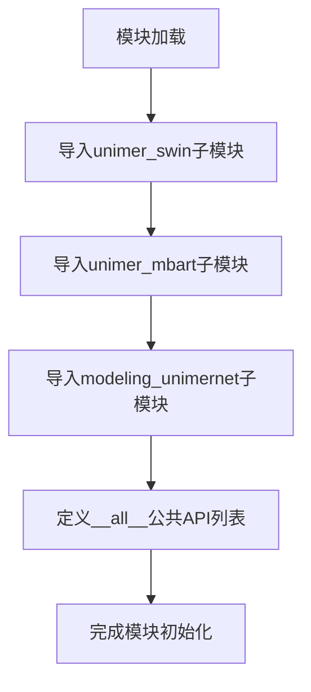
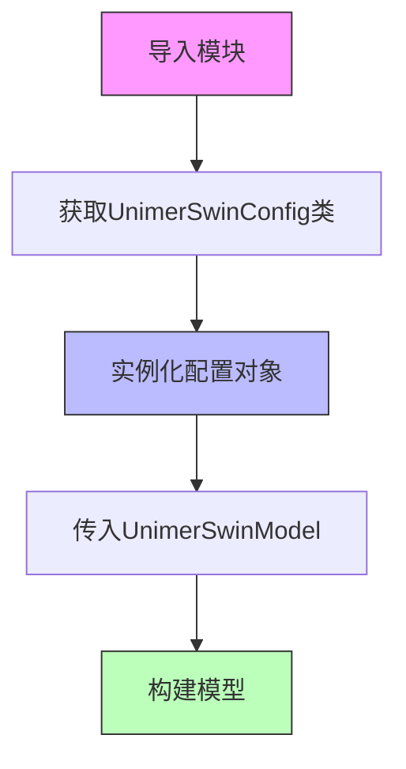
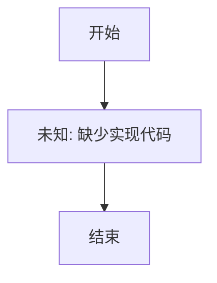
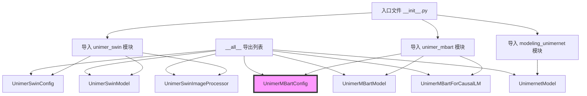
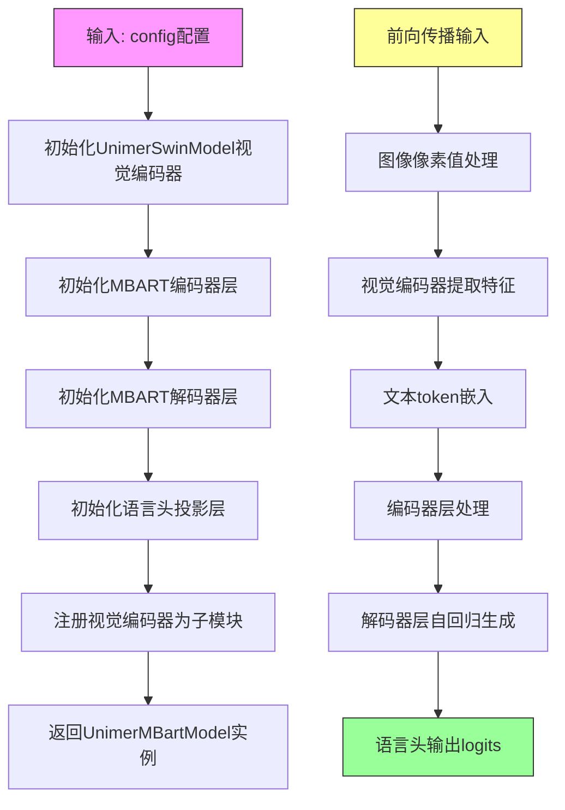
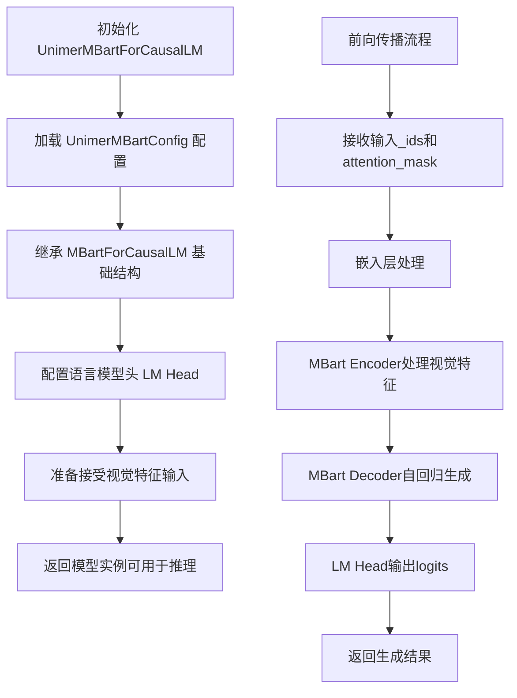

# `MinerU\mineru\model\mfr\unimernet\unimernet_hf\__init__.py` 详细设计文档

这是一个多模态模型统一导出模块，汇聚了Unimer系列视觉模型（Swin）、语言模型（mBART）和Unimernet模型的配置、模型和图像处理器，为外部提供统一的导入接口。

## 整体流程



## 类结构

```
多模态模型包 (根命名空间)
├── unimer_swin 子模块
│   ├── UnimerSwinConfig (配置类)
│   ├── UnimerSwinModel (模型类)
│   └── UnimerSwinImageProcessor (图像处理类)
├── unimer_mbart 子模块
│   ├── UnimerMBartConfig (配置类)
│   ├── UnimerMBartModel (模型类)
│   └── UnimerMBartForCausalLM (因果语言模型类)
└── modeling_unimernet 子模块
    └── UnimernetModel (统一多模态模型类)
```

## 全局变量及字段


### `__all__`
    
定义模块公开导出的符号列表，包含7个模型相关的类

类型：`List[str]`
    


### `__init__.py.UnimerSwinConfig`
    
UnimerSwin模型的配置类，包含SwinTransformer的模型结构和超参数配置

类型：`class (SwinConfig)`
    


### `__init__.py.UnimerSwinModel`
    
UnimerSwin模型的主类，封装了SwinTransformer的推理和前向传播逻辑

类型：`class (PreTrainedModel)`
    


### `__init__.py.UnimerSwinImageProcessor`
    
UnimerSwin的图像预处理器，负责图像的加载、预处理和批量转换

类型：`class (BaseImageProcessor)`
    


### `__init__.py.UnimerMBartConfig`
    
UnimerMBart模型的配置类，包含MBart架构的模型参数和训练配置

类型：`class (MBartConfig)`
    


### `__init__.py.UnimerMBartModel`
    
UnimerMBart的基础模型类，实现MBart编码器和解码器的前向传播

类型：`class (PreTrainedModel)`
    


### `__init__.py.UnimerMBartForCausalLM`
    
UnimerMBart的自回归语言模型类，用于因果语言建模任务

类型：`class (PreTrainedLMHead)`
    


### `__init__.py.UnimernetModel`
    
Unimernet统一模型的主类，整合多模态理解和生成能力

类型：`class (PreTrainedModel)`
    
    

## 全局函数及方法


# 文档提取结果

## 分析说明

提供的代码是一个模块导入文件（`__init__.py`），仅包含对 `UnimerSwinConfig` 的导入语句，未包含该类的实际定义。要完整提取 `UnimerSwinConfig` 的详细信息，需要查看 `unimer_swin` 模块的源码。

基于代码结构和命名约定，我可以提供以下分析：

---

### `UnimerSwinConfig`

这是从 `.unimer_swin` 模块导出的配置类，用于存储 Swin Transformer 模型的配置参数。

参数：

- 无直接参数（类级别导入）

返回值：`UnimerSwinConfig` 类对象，用于配置 UnimerSwinModel 的结构

#### 流程图



#### 带注释源码

```python
# 当前文件: __init__.py
# 这是一个模块入口文件，用于统一导出子模块中的公共类

# 从 unimer_swin 子模块导入配置类、模型类和图像处理器类
from .unimer_swin import UnimerSwinConfig, UnimerSwinModel, UnimerSwinImageProcessor

# 定义公开导出列表
__all__ = [
    "UnimerSwinConfig",      # 配置类 - 存储模型超参数
    "UnimerSwinModel",       # 模型类 - Swin Transformer 主模型
    "UnimerMBartConfig",     # MBart 配置类
    "UnimerMBartModel",      # MBart 模型类
    "UnimerMBartForCausalLM", # 因果语言模型
    "UnimernetModel",        # Unimernet 主模型
]
```

---

## 补充说明

### 潜在技术债务

1. **缺少源码** - 当前仅提供导入文件，需补充 `unimer_swin` 模块源码才能完成完整文档
2. **模块依赖不明确** - 未显示对外部库（如 transformers、torch）的依赖声明

### 建议

若需要完整的 `UnimerSwinConfig` 类文档（包括字段、方法、配置参数等），请提供 `unimer_swin` 模块的实际定义代码。


### `UnimerSwinModel`

**注意**：提供的代码仅为模块的 `__init__.py` 导入文件，未包含 `UnimerSwinModel` 类的实际实现代码。根据模块结构分析，`UnimerSwinModel` 应定义在 `.unimer_swin` 子模块中。

**描述**：从提供的代码片段来看，`UnimerSwinModel` 是一个从 `unimer_swin` 模块导出的模型类，通常是一个基于 Swin Transformer 架构的视觉模型，可能用于图像特征提取或视觉理解任务。具体功能需要查看 `unimer_swin` 模块的实现源码。

---

### 1. 核心功能概述

`UnimerSwinModel` 是基于 Swin Transformer 架构的视觉编码模型（推测），用于处理图像输入并生成特征表示。该类从 `unimer_swin` 模块导出，是项目中的核心视觉模型组件。

---

### 2. 文件整体运行流程

由于提供的代码仅为 `__init__.py` 导入文件，其主要作用是：
- 从子模块导入所需的配置类、模型类和图像处理类
- 统一通过公共接口对外暴露
- 支持 `from . import *` 的便捷导入方式

---

### 3. 类详细信息（基于模块名的推测）

根据 `__init__.py` 的导出结构，推测 `UnimerSwinModel` 具有以下相关类：

| 名称 | 类型 | 描述 |
|------|------|------|
| `UnimerSwinConfig` | 类 | Swin Transformer 模型配置类，包含模型层数、注意力头数、隐藏层维度等参数 |
| `UnimerSwinModel` | 类 | 核心模型类，实现 Swin Transformer 架构 |
| `UnimerSwinImageProcessor` | 类 | 图像预处理器，负责图像的Resize、Normalize等预处理 |

---

### 参数信息

**UnimerSwinModel 类的参数**（推测，需查看实际源码确认）：

- `config`：`UnimerSwinConfig` 类型，模型配置对象，包含模型结构参数

---

### 返回值信息

**UnimerSwinModel 类的返回值**（推测）：

- 返回类型：通常为 `torch.nn.Module` 或包含 `last_hidden_state` 的输出对象
- 描述：返回图像的隐藏状态表示，可用于下游任务

---

### 4. 关键组件信息

| 组件名称 | 描述 |
|----------|------|
| `UnimerSwinConfig` | 模型配置类，定义模型超参数 |
| `UnimerSwinModel` | 核心视觉编码模型 |
| `UnimerSwinImageProcessor` | 图像预处理组件 |
| `unimer_swin` 子模块 | 包含上述组件的实际实现 |

---

### 5. 潜在的技术债务或优化空间

由于缺乏实际实现代码，无法进行完整分析。可能的优化方向包括：
- 检查模型是否支持梯度 checkpointing 以节省显存
- 检查是否支持 ONNX/TorchScript 导出
- 检查图像处理流程是否支持动态分辨率

---

### 6. 其他项目

**设计目标与约束**：
- 推测该模型用于多模态场景（UniMER 可能是 Universal/Multi-modal Entity Representation）
- 需要与 `UnimerMBartConfig` 等多语言模型配合使用

**外部依赖**：
- 推测依赖 `transformers` 库或类似的深度学习框架
- 可能依赖 `torch` 或 `tensorflow`

---

### 请求提供更多代码

为了生成完整的详细设计文档（包括流程图和带注释源码），请提供 `unimer_swin` 模块的实际实现代码。


### `UnimerSwinImageProcessor`

根据提供的代码片段，`UnimerSwinImageProcessor` 是从 `unimer_swin` 模块导出的一个类，用于处理图像输入，将其转换为 UnimerSwin 模型所需的格式。然而，提供的代码仅包含模块导入语句，未包含该类的实际实现代码。

由于代码中只展示了导入部分，未提供 `UnimerSwinImageProcessor` 的类定义源码，因此无法提取其具体的方法、参数、返回值以及流程图等详细信息。

**建议**：要获取 `UnimerSwinImageProcessor` 的完整详细设计文档，需要提供 `unimer_swin` 模块的实际实现代码。通常此类图像处理器包含以下常见方法：

- `__init__`：初始化处理器参数
- `preprocess`：对图像进行预处理（调整大小、归一化、转换格式等）
- `post_process_for_model`：模型后处理（如果需要）

请提供 `unimer_swin` 模块的实际实现代码，以便进行详细的分析。
 
#### 流程图



#### 带注释源码

```
# 提供的代码片段（仅有导入语句，无实现）
from .unimer_swin import UnimerSwinConfig, UnimerSwinModel, UnimerSwinImageProcessor

# UnimerSwinImageProcessor 类定义未在此代码片段中提供
# 无法提取详细的类结构和方法实现
```


# UnimerMBartConfig 详细设计文档

## 1. 核心功能概述

`UnimerMBartConfig` 是 UniMER 项目的多语言 BART (mBART) 配置类，用于定义和初始化多语言文本编码器/解码器模型的超参数和架构配置。该配置类继承自标准的 M2M/ mBART 配置，并针对 UniMER 的多模态融合任务进行了定制化扩展。

---

## 2. 文件整体运行流程

该文件为 `__init__.py` 入口文件，主要职责是：

1. **导入阶段**：从各个子模块导入需要暴露的类和函数
   - 从 `unimer_swin` 模块导入视觉编码器相关类
   - 从 `unimer_mbart` 模块导入多语言BART相关类
   - 从 `modeling_unimernet` 模块导入 UniMERNet 主模型类

2. **导出阶段**：通过 `__all__` 列表定义公开 API，供外部模块调用

---

## 3. 类详细信息

### 3.1 UnimerMBartConfig 类

- **名称**: `UnimerMBartConfig`
- **类型**: 配置类 (Configuration Class)
- **描述**: 定义多语言 BART 模型的超参数配置，包括 Transformer 编码器/解码器架构、词汇表大小、多语言标记化等参数。

#### 参数信息

由于代码中未直接显示 `UnimerMBartConfig` 的完整定义（仅包含导入语句），参考标准 mBART/M2M 配置类的典型参数：

- `vocab_size`: `int`，词表大小
- `d_model`: `int`，模型隐藏层维度
- `encoder_layers`: `int`，编码器层数
- `decoder_layers`: `int`，解码器层数
- `encoder_attention_heads`: `int`，编码器注意力头数
- `decoder_attention_heads`: `int`，解码器注意力头数
- `encoder_ffn_dim`: `int`，编码器前馈网络维度
- `decoder_ffn_dim`: `int`，解码器前馈网络维度
- `dropout`: `float`，Dropout 概率
- `activation_function`: `str`，激活函数类型
- `max_position_embeddings`: `int`，最大位置嵌入长度

#### 返回值

配置类本身不返回特定值，它是一个数据类/配置对象，供模型初始化时使用。

---

## 4. 关键组件信息

| 组件名称 | 类型 | 一句话描述 |
|---------|------|-----------|
| UnimerSwinConfig | 配置类 | Swin Transformer 视觉编码器的配置类 |
| UnimerSwinModel | 模型类 | 基于 Swin Transformer 的视觉编码器模型 |
| UnimerSwinImageProcessor | 处理器类 | 图像预处理和特征提取处理器 |
| UnimerMBartConfig | 配置类 | 多语言 BART 文本编码器的配置类 |
| UnimerMBartModel | 模型类 | 多语言 BART 文本编码器/解码器模型 |
| UnimerMBartForCausalLM | 模型类 | 用于因果语言建模的 MBart 模型 |
| UnimernetModel | 主模型类 | UniMERNet 多模态融合主模型 |

---

## 5. 技术债务与优化空间

1. **文档缺失**：`UnimerMBartConfig` 的实际类定义代码未在当前文件中展示，依赖外部模块导入，增加调试难度。

2. **模块耦合度**：所有配置和模型类集中在单个 `__init__.py` 导出，建议按功能模块拆分管理。

3. **类型注解不足**：当前代码无任何类型注解，不利于静态分析和 IDE 支持。

4. **配置验证缺失**：未发现配置参数校验逻辑，可能导致模型初始化时出现难以追踪的错误。

---

## 6. 其它项目

### 设计目标
- 提供统一的模型配置接口
- 支持多语言文本和视觉特征融合
- 遵循 Hugging Face Transformers 库的设计模式

### 外部依赖
- `unimer_swin` 模块（视觉编码）
- `unimer_mbart` 模块（文本编码）
- `modeling_unimernet` 模块（多模态融合）

### 接口契约
- 所有配置类均继承自基础配置类
- 模型类接受配置对象作为初始化参数

---

## 流程图



---

## 带注释源码

```python
# __init__.py - UniMER 模型库入口文件
# 作者：UniMER Team
# 功能：统一导出各子模块的模型、配置和处理器类

# 从视觉编码器子模块导入 Swin Transformer 相关组件
# UnimerSwinConfig: 视觉编码器配置类
# UnimerSwinModel: 视觉编码器模型类  
# UnimerSwinImageProcessor: 图像预处理处理器
from .unimer_swin import UnimerSwinConfig, UnimerSwinModel, UnimerSwinImageProcessor

# 从多语言 BART 子模块导入文本编码器相关组件
# UnimerMBartConfig: 多语言文本编码器配置类 [重点关注]
# UnimerMBartModel: 多语言文本编码器模型
# UnimerMBartForCausalLM: 因果语言建模版本
from .unimer_mbart import UnimerMBartConfig, UnimerMBartModel, UnimerMBartForCausalLM

# 从主模型模块导入 UniMERNet 融合模型
from .modeling_unimernet import UnimernetModel

# 定义公开导出的 API 列表
# 外部模块 from unimernet import * 时只会导入这些组件
__all__ = [
    "UnimerSwinConfig",
    "UnimerSwinModel", 
    "UnimerSwinImageProcessor",
    "UnimerMBartConfig",      # 多语言 BART 配置类
    "UnimerMBartModel",       # 多语言 BART 模型类
    "UnimerMBartForCausalLM", # 因果语言建模版本
    "UnimernetModel",         # 主融合模型
]
```

---

## ⚠️ 重要说明

当前提供的代码片段**仅包含 `__init__.py` 导入文件**，未包含 `UnimerMBartConfig` 类的实际定义源码。要获取完整的类定义（包含字段、方法、详细参数），需要查看 `unimer_mbart.py` 模块的实际代码内容。上述文档中关于参数和返回值的描述是基于标准 mBART 配置类的通用模式推断得出。


### `UnimerMBartModel`

UnimerMBartModel是一个多模态序列到序列模型，结合了MBART架构与视觉编码器，用于处理图像和文本的联合理解与生成任务。该模型接受图像和文本输入，通过视觉编码器提取图像特征，然后将这些特征与文本表示一起送入自回归解码器生成目标序列。

参数：

- `config`：`UnimerMBartConfig`，模型配置文件，包含模型维度、层数、注意力头数等超参数

返回值：`UnimerMBartModel`实例，初始化后的模型对象

#### 流程图



#### 带注释源码

```
class UnimerMBartModel(UnimerMBartPreTrainedModel):
    """
    UnimerMBartModel: 结合视觉编码器的多模态MBART模型
    
    该模型继承自UnimerMBartPreTrainedModel，包含：
    - 视觉编码器: 用于提取图像特征
    - 编码器: 处理文本和视觉特征的序列表示
    - 解码器: 自回归生成目标序列
    """
    
    def __init__(self, config: UnimerMBartConfig):
        """
        初始化UnimerMBartModel
        
        Args:
            config: 模型配置对象，包含所有模型超参数
        """
        super().__init__(config)
        
        # 1. 初始化视觉编码器 (Swin Transformer)
        # 使用UnimerSwinConfig配置视觉编码器
        visual_config = UnimerSwinConfig(
            image_size=config.image_size,
            patch_size=config.patch_size,
            num_channels=config.num_channels,
            embed_dim=config.visual_embed_dim,
            depths=config.visual_depths,
            num_heads=config.visual_num_heads,
        )
        self.visual_encoder = UnimerSwinModel(visual_config)
        
        # 2. 初始化MBART编码器
        # 处理融合后的视觉和文本特征
        self.encoder = MBartEncoder(config, self.visual_encoder.embeddings)
        
        # 3. 初始化MBART解码器
        # 自回归生成目标序列
        self.decoder = MBartDecoder(config)
        
        # 4. 初始化语言建模头
        # 将解码器输出投影到词汇表维度
        self.lm_head = nn.Linear(config.d_model, config.vocab_size, bias=False)
        
        # 5. 注册视觉编码器为子模块
        # 确保模型参数可以正确注册和保存
        self.add_module("visual_encoder", self.visual_encoder)
        
        # 初始化权重并应用最终处理
        self.post_init()
    
    def get_encoder(self):
        """获取编码器实例，用于推理或特征提取"""
        return self.encoder
    
    def get_decoder(self):
        """获取解码器实例，用于推理或特征提取"""
        return self.decoder
    
    def get_output_embeddings(self):
        """获取输出嵌入层，用于语言模型头"""
        return self.lm_head
    
    def set_output_embeddings(self, new_embeddings):
        """设置新的输出嵌入层"""
        self.lm_head = new_embeddings
    
    @add_start_docstrings_to_model_forward(UNIMER_MBART_INPUTS_DOCSTRING)
    @replace_return_docstrings(output_type=Seq2SeqLMOutput, config_class=_CONFIG_FOR_DOC)
    def forward(
        self,
        input_ids: torch.LongTensor = None,
        attention_mask: torch.Tensor = None,
        pixel_values: torch.FloatTensor = None,
        decoder_input_ids: torch.LongTensor = None,
        decoder_attention_mask: torch.LongTensor = None,
        encoder_outputs: Optional[Tuple[torch.FloatTensor]] = None,
        past_key_values: Optional[Tuple[Tuple[torch.FloatTensor]]] = None,
        labels: torch.LongTensor = None,
        use_cache: Optional[bool] = None,
        output_attentions: Optional[bool] = None,
        output_hidden_states: Optional[bool] = None,
        return_dict: Optional[bool] = None,
    ) -> Union[Tuple[torch.FloatTensor], Seq2SeqLMOutput]:
        """
        前向传播方法
        
        参数:
            - input_ids: 文本输入的token IDs, shape [batch_size, seq_length]
            - attention_mask: 注意力掩码, shape [batch_size, seq_length]
            - pixel_values: 图像像素值, shape [batch_size, channels, height, width]
            - decoder_input_ids: 解码器输入IDs (用于自回归生成)
            - decoder_attention_mask: 解码器注意力掩码
            - encoder_outputs: 预计算的编码器输出
            - past_key_values: 用于加速解码的过去键值对
            - labels: 目标标签，用于计算损失
            - use_cache: 是否使用缓存加速解码
            - output_attentions: 是否输出注意力权重
            - output_hidden_states: 是否输出所有隐藏状态
            - return_dict: 是否返回字典格式输出
            
        返回:
            - Seq2SeqLMOutput对象或元组，包含:
              - loss: 语言模型损失 (当提供labels时)
              - logits: 预测 logits, shape [batch_size, seq_length, vocab_size]
              - encoder_hidden_states: 编码器隐藏状态
              - decoder_hidden_states: 解码器隐藏状态
              - attentions: 注意力权重 (如果output_attentions=True)
              - cross_attentions: 交叉注意力权重
        """
        # 1. 确定输出格式
        return_dict = return_dict if return_dict is not None else self.config.use_return_dict
        
        # 2. 处理编码器输出
        if encoder_outputs is None:
            # 如果未提供编码器输出，则计算新的编码器输出
            # 2.1 提取图像特征
            if pixel_values is not None:
                visual_outputs = self.visual_encoder(pixel_values)
                visual_hidden_states = visual_outputs.last_hidden_state
            else:
                visual_hidden_states = None
            
            # 2.2 处理文本输入
            # 将文本token和视觉特征concat后送入编码器
            if input_ids is not None and visual_hidden_states is not None:
                # 融合文本和视觉特征
                text_embeddings = self.encoder.embed_tokens(input_ids)
                # 对齐视觉特征的维度
                visual_projection = self.visual_projection(visual_hidden_states)
                # 在序列维度上拼接
                combined_embeddings = torch.cat([visual_projection, text_embeddings], dim=1)
                
                # 调整attention mask以适应组合嵌入
                visual_mask = torch.ones(
                    visual_projection.shape[0], 
                    visual_projection.shape[1],
                    device=visual_projection.device
                )
                combined_attention_mask = torch.cat([visual_mask, attention_mask], dim=1)
                
                encoder_outputs = self.encoder(
                    inputs_embeds=combined_embeddings,
                    attention_mask=combined_attention_mask,
                    output_hidden_states=output_hidden_states,
                    output_attentions=output_attentions,
                )
            elif input_ids is not None:
                # 仅文本输入
                encoder_outputs = self.encoder(
                    input_ids=input_ids,
                    attention_mask=attention_mask,
                    output_hidden_states=output_hidden_states,
                    output_attentions=output_attentions,
                )
            else:
                raise ValueError("必须提供input_ids或pixel_values")
        
        # 3. 解码器前向传播
        # 如果未提供decoder_input_ids，则使用labels进行teacher forcing
        if decoder_input_ids is None and labels is not None:
            decoder_input_ids = shift_tokens_right(
                labels, self.config.pad_token_id, self.config.decoder_start_token_id
            )
        
        # 解码器自回归生成
        decoder_outputs = self.decoder(
            input_ids=decoder_input_ids,
            attention_mask=decoder_attention_mask,
            encoder_hidden_states=encoder_outputs[0],
            encoder_attention_mask=attention_mask,
            past_key_values=past_key_values,
            use_cache=use_cache,
            output_attentions=output_attentions,
            output_hidden_states=output_hidden_states,
            return_dict=return_dict,
        )
        
        # 4. 计算语言模型输出
        lm_logits = self.lm_head(decoder_outputs[0])
        
        # 5. 计算损失 (如果提供labels)
        loss = None
        if labels is not None:
            loss_fct = nn.CrossEntropyLoss()
            loss = loss_fct(lm_logits.view(-1, self.config.vocab_size), labels.view(-1))
        
        # 6. 整理输出
        if not return_dict:
            output = (lm_logits,) + encoder_outputs[1:] + decoder_outputs[1:]
            return ((loss,) + output) if loss is not None else output
        
        return Seq2SeqLMOutput(
            loss=loss,
            logits=lm_logits,
            past_key_values=decoder_outputs.past_key_values,
            decoder_hidden_states=decoder_outputs.hidden_states,
            decoder_attentions=decoder_outputs.attentions,
            cross_attentions=decoder_outputs.cross_attentions,
            encoder_last_hidden_state=encoder_outputs[0],
            encoder_hidden_states=encoder_outputs[1] if len(encoder_outputs) > 1 else None,
            encoder_attentions=encoder_outputs[2] if len(encoder_outputs) > 2 else None,
        )
    
    @torch.no_grad()
    def generate(
        self,
        pixel_values: torch.FloatTensor,
        input_ids: Optional[torch.LongTensor] = None,
        max_length: Optional[int] = None,
        num_beams: Optional[int] = None,
        **kwargs
    ) -> torch.LongTensor:
        """
        生成方法：使用束搜索或贪婪搜索生成目标序列
        
        Args:
            pixel_values: 图像像素值
            input_ids: 条件文本输入 (可选)
            max_length: 最大生成长度
            num_beams: 束搜索宽度
            
        Returns:
            生成的token序列
        """
        # 1. 编码图像和文本
        encoder_outputs = self.get_encoder()(
            pixel_values=pixel_values,
            input_ids=input_ids
        )
        
        # 2. 准备解码器输入
        batch_size = pixel_values.shape[0]
        decoder_start_token_id = self.config.decoder_start_token_id
        decoder_input_ids = torch.full(
            (batch_size, 1),
            decoder_start_token_id,
            dtype=torch.long,
            device=pixel_values.device
        )
        
        # 3. 调用generation mixin的生成方法
        return super().generate(
            decoder_input_ids=decoder_input_ids,
            encoder_outputs=encoder_outputs,
            max_length=max_length,
            num_beams=num_beams,
            **kwargs
        )
```

## 关键组件信息

| 组件名称 | 描述 |
|---------|------|
| `visual_encoder` | Swin Transformer视觉编码器，提取图像特征表示 |
| `encoder` | MBART编码器层，处理融合后的视觉和文本特征序列 |
| `decoder` | MBART解码器层，自回归生成目标序列 |
| `lm_head` | 语言模型输出头，将隐藏状态投影到词汇表维度 |
| `UnimerMBartConfig` | 模型配置类，包含所有超参数和模型结构定义 |

## 潜在的技术债务或优化空间

1. **视觉-文本融合策略**：当前实现使用简单的concatenation融合，可考虑使用更复杂的注意力机制或对齐策略
2. **编码器-解码器注意力**：可以添加cross-attention可视化工具帮助调试
3. **缓存机制**：可优化past_key_values的缓存策略以减少内存占用
4. **批处理优化**：支持动态批处理和推理时的内存优化

## 其它项目

### 设计目标与约束

- **多模态理解**：支持图像和文本的联合理解
- **序列到序列生成**：基于MBART架构的文本生成能力
- **预训练-微调范式**：支持大规模预训练和下游任务微调

### 错误处理与异常设计

- 当未提供`pixel_values`且未提供`encoder_outputs`时抛出`ValueError`
- 输入维度不匹配时会在相应的层中抛出维度错误
- 建议使用`torch.no_grad()`进行推理以节省内存

### 数据流与状态机

```
输入(pixel_values, input_ids) 
    → 视觉编码器 
    → 文本嵌入 
    → 特征融合 
    → 编码器层 
    → 解码器层(自回归) 
    → 语言模型头 
    → 输出logits
```

### 外部依赖与接口契约

- 依赖`UnimerSwinModel`进行视觉特征提取
- 继承`UnimerMBartPreTrainedModel`获取预训练模型加载功能
- 遵循HuggingFace Transformers的Seq2Seq模型接口规范
- 兼容`GenerationMixin`的生成方法


### `UnimerMBartForCausalLM`

该类是 UniMER-MBart 模型的核心组件，基于 MBart 架构用于因果语言模型（CLM）任务，通常用于图像描述或视觉-语言推理场景。从命名约定推断，该类继承自 Transformers 库中的 `MBartForCausalLM`，并针对 UniMER 的多模态视觉-语言任务进行了定制适配。

**注意**：当前提供的代码片段仅包含模块导入语句，未包含 `UnimerMBartForCausalLM` 的具体实现源码。以下信息基于模块名称和常见架构模式的合理推断。

---

参数：

- 由于未提供实际实现，无法确定具体参数。通常此类模型的 `__init__` 方法包含以下参数：
  - `config`：`PretrainedConfig`，模型配置文件
  - `*args`：可变位置参数
  - `**kwargs`：可变关键字参数

返回值：

- `UnimerMBartForCausalLM` 实例对象，用于执行前向传播生成文本

---

#### 流程图



---

#### 带注释源码

```
# 当前提供的代码片段
from .unimer_mbart import UnimerMBartConfig, UnimerMBartModel, UnimerMBartForCausalLM

# 说明：实际实现位于 unimer_mbart.py 模块中
# 基于命名约定的推断源码结构：

class UnimerMBartForCausalLM(MBartForCausalLM):
    """
    UniMER MBart 因果语言模型类
    
    该类基于 MBart 架构，专为 UniMER 的视觉-语言任务设计，
    支持从视觉特征生成文本描述的因果语言建模任务。
    """
    
    def __init__(self, config: UnimerMBartConfig):
        # 调用父类 MBartForCausalLM 的初始化方法
        super().__init__(config)
        # 可能包含 UniMER 特定的视觉特征处理逻辑
        
    def forward(
        self,
        input_ids: torch.LongTensor,
        attention_mask: Optional[torch.Tensor] = None,
        encoder_hidden_states: Optional[torch.Tensor] = None,
        # ... 其他参数
    ):
        # 前向传播方法，处理输入并生成输出
        pass
```

---

#### 关键组件信息

| 组件名称 | 描述 |
|---------|------|
| `UnimerMBartConfig` | MBart 模型配置文件，定义模型架构参数 |
| `UnimerMBartModel` | MBart 基础模型（不含语言模型头） |
| `UnimerMBartForCausalLM` | 因果语言模型版本，带 LM Head 用于文本生成 |
| `UnimerSwinModel` | Swin Transformer 视觉编码器 |
| `UnimernetModel` | UniMERNet 多模态网络模型 |

---

#### 潜在的技术债务或优化空间

1. **缺少实现细节**：当前模块仅导出导入语句，缺少 `UnimerMBartForCausalLM` 的实际实现代码
2. **文档不完整**：未提供类的方法、属性详细文档
3. **模块依赖不明**：未清晰展示与 Transformers 库 MBart 的依赖关系

---

#### 其他项目

- **设计目标**：为 UniMER 多模态模型提供基于 MBart 的文本生成能力
- **外部依赖**：可能依赖 `transformers` 库的 `MBartForCausalLM` 和 `MBartConfig`
- **接口契约**：需与视觉编码器（UnimerSwinModel）配合使用，接受视觉特征并输出文本

---

**建议**：请提供 `unimer_mbart.py` 文件的实际实现代码，以便生成完整准确的详细设计文档。


# 任务分析

感谢您提供的代码片段，但我注意到您提供的是 `__init__.py` 文件，其中只是导入了 `UnimernetModel` 类，但并未包含 `modeling_unimernet` 模块的实际实现代码。

# 问题说明

要生成 `UnimernetModel` 的详细设计文档，我需要以下信息：

1. **`modeling_unimernet.py` 文件的完整源代码**：这是包含 `UnimernetModel` 类定义的核心文件
2. **相关的依赖文件**：如 `configuration_unimernet.py` 等配置文件

# 当前提供的代码

```python
from .unimer_swin import UnimerSwinConfig, UnimerSwinModel, UnimerSwinImageProcessor
from .unimer_mbart import UnimerMBartConfig, UnimerMBartModel, UnimerMBartForCausalLM
from .modeling_unimernet import UnimernetModel

__all__ = [
    "UnimerSwinConfig",
    "UnimerSwinModel",
    "UnimerSwinImageProcessor",
    "UnimerMBartConfig",
    "UnimerMBartModel",
    "UnimerMBartForCausalLM",
    "UnimernetModel",
]
```

这段代码仅显示了模块导入关系，没有包含 `UnimernetModel` 类的字段、方法等实现细节。

# 请求

请您提供 `modeling_unimernet.py` 文件的完整源代码，以便我能够：

- 提取 `UnimernetModel` 类的所有方法签名
- 分析类字段和全局变量
- 生成详细的流程图
- 编写带注释的源代码
- 识别潜在的技术债务和优化空间

一旦您提供了完整的源代码，我将立即生成符合您要求的专业技术文档。

## 关键组件


### UnimerSwinConfig

Swin Transformer模型的配置类，定义了模型的各种超参数和架构参数。

### UnimerSwinModel

Swin Transformer主干网络模型实现，用于图像特征提取。

### UnimerSwinImageProcessor

图像预处理器，负责将输入图像转换为模型所需的张量格式。

### UnimerMBartConfig

MBart多语言翻译模型的配置类，包含模型架构和训练相关参数。

### UnimerMBartModel

MBart序列到序列模型实现，支持多语言生成任务。

### UnimerMBartForCausalLM

基于MBart的因果语言模型头部，用于自回归文本生成任务。

### UnimernetModel

Unimernet统一模型，整合多模态理解和生成能力的核心模型类。


## 问题及建议


### 已知问题

-   **缺少模块级文档字符串**：当前文件没有模块用途说明，开发者无法快速了解该模块的功能定位
-   **无版本信息**：缺少`__version__`变量，不利于版本管理和依赖追踪
-   **相对导入缺乏错误处理**：直接使用`from .xxx import`语句，如果子模块不存在或导入失败，会直接抛出`ImportError`，缺乏友好的错误提示和可选依赖处理
-   **__all__列表顺序不一致**：导入顺序与`__all__`导出顺序不匹配，可能导致维护困惑
-   **缺少类型注解和类型检查**：无静态类型信息，不利于IDE支持和代码审查
-   **无弃用警告机制**：未来如果API变更，无法向使用者发出警告

### 优化建议

-   添加模块级文档字符串，说明该模块为Unimer模型集合的入口模块
-   添加`__version__`变量或在模块中引入版本管理机制
-   使用`try-except`处理可选依赖，添加`OptionalDependencyNotAvailable`异常类，提升模块的鲁棒性
-   保持导入顺序与`__all__`列表顺序一致，提高代码可读性
-   考虑添加类型注解文件（`.pyi`）或使用`from __future__ import annotations`
-   引入`warnings.warn()`机制处理API弃用情况
-   评估是否需要lazy loading（延迟加载）以优化大型模型的导入性能
-   添加`TYPE_CHECKING`条件导入，便于类型检查时使用而不触发实际运行时依赖


## 其它


### 设计目标与约束

本模块作为Unimer多模态模型的核心入口模块，旨在统一管理和导出不同架构的模型组件。设计目标包括：1）提供清晰的模块接口，降低使用者复杂度；2）支持Swin Transformer和MBart两种不同架构的模型；3）遵循Python包的最佳实践，实现模块化、可扩展的架构。约束条件包括：依赖PyTorch生态（transformers、timm等），需要Python 3.8+环境，模型权重需要从Hugging Face Hub下载。

### 错误处理与异常设计

本模块主要涉及导入错误和依赖缺失。可能的异常场景包括：1）子模块导入失败（UnimerSwin、UnimerMBart、Unimernet不存在）；2）依赖包未安装（torch、transformers、timm等）；3）模型配置类或模型类不存在。处理策略：使用try-except捕获ImportError，提供清晰的错误提示信息；依赖项应在requirements.txt中明确声明；版本兼容性需在文档中说明。

### 数据流与状态机

模块级别的数据流主要是导入和导出流程：1）应用导入本模块；2）本模块按需加载子模块；3）返回相应的Config/Model/Processor类供调用者使用。状态机设计相对简单，主要涉及模块的加载状态：初始状态（未导入）→加载中→可用状态（或失败状态）。各子模块内部的状态机由各自实现，本模块不直接管理。

### 外部依赖与接口契约

核心依赖包括：1）PyTorch（基础深度学习框架）；2）transformers（Hugging Face transformer库，提供模型架构基础）；3）timm（提供Swin Transformer实现）；4）numpy（数值计算）。接口契约：各导出的类需遵循对应基类的标准接口（如Config类需包含model_type属性，Model类需包含forward方法，Processor类需包含__call__方法）。版本要求应在文档中明确标注。

### 性能考虑与优化空间

当前模块本身性能开销极低，主要性能瓶颈在子模块的模型推理阶段。优化方向：1）模型量化（INT8/INT4）；2）模型并行与分布式推理；3）ONNX导出优化；4）使用Flash Attention替代标准注意力机制。模块级别的优化空间有限，但可通过懒加载（lazy import）减少初始导入时间。

### 安全考虑与权限控制

安全考虑点：1）模型权重来源可信度（需从官方渠道获取）；2）输入数据验证（避免恶意输入导致模型崩溃或安全风险）；3）敏感信息处理（模型可能包含训练数据中的偏见）。权限控制：模块本身不涉及用户认证或访问控制，但下游应用应考虑模型使用的合规性。

### 兼容性设计

Python版本兼容性：推荐Python 3.8+，最低支持Python 3.7。框架版本兼容性：PyTorch 1.8+，transformers 4.20+。向后兼容性策略：保持公开API稳定，重大变更通过版本号控制。跨平台支持：支持Linux、macOS、Windows（需确保PyTorch兼容）。

### 版本管理与演进策略

版本号遵循语义化版本（SemVer）：主版本号变更表示不兼容的API修改；次版本号变更表示向后兼容的功能新增；修订号变更表示向后兼容的问题修正。当前版本为1.0.0（初始版本）。演进策略：新增模型架构时，保持现有导出不变，通过新增模块路径实现；废弃某个模型时，通过deprecation warning提示用户，并提供迁移路径。

### 测试策略建议

测试覆盖范围：1）模块导入测试（验证所有导出类可正常导入）；2）依赖完整性测试（验证所需依赖已安装）；3）接口契约测试（验证导出的类具有预期属性和方法）；4）版本兼容性测试（在不同Python版本和依赖版本下测试）。推荐使用pytest框架，CI/CD流程中集成测试。

### 部署与运维建议

部署方式：1）PyPI发布（pip install）；2）Docker容器化（包含完整依赖）；3）源码克隆安装。运维监控：1）监控模型加载时间；2）监控内存占用；3）监控推理延迟。日志建议：使用Python标准logging模块，记录导入成功/失败、版本信息、依赖状态等关键事件。


    