# `MinerU\mineru\model\mfr\unimernet\unimernet_hf\modeling_unimernet.py` 详细设计文档

该代码实现了一个名为UnimernetModel的视觉-语言模型，继承自VisionEncoderDecoderModel，集成了UnimerSwin作为编码器和UnimerMBart作为解码器，并提供了TokenizerWrapper工具类用于文本tokenization和detokenization，支持从checkpoint加载模型权重和文本生成功能。

## 整体流程

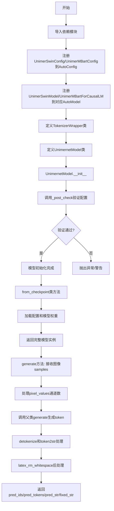

## 类结构

```
object
├── TokenizerWrapper (包装tokenizer的工具类)
└── UnimernetModel (继承VisionEncoderDecoderModel)
    ├── __init__
    ├── _post_check
    ├── from_checkpoint (类方法)
    ├── forward_bak
    └── generate
```

## 全局变量及字段


### `base_model_logger`
    
Transformers库中VisionEncoderDecoderModel的日志记录器，用于临时禁用模型检查日志

类型：`logging.Logger`
    


### `TokenizerWrapper.tokenizer`
    
封装的Hugging Face分词器对象，用于文本的编码和解码

类型：`PreTrainedTokenizer`
    


### `TokenizerWrapper.pad_token_id`
    
填充token的ID，用于批处理时对齐序列长度

类型：`int`
    


### `TokenizerWrapper.bos_token_id`
    
序列开始token的ID，用于标记生成文本的起始位置

类型：`int`
    


### `TokenizerWrapper.eos_token_id`
    
序列结束token的ID，用于标记生成文本的终止位置

类型：`int`
    


### `UnimernetModel.transform`
    
图像预处理器，用于将输入图像转换为模型所需的像素值张量

类型：`UnimerSwinImageProcessor`
    


### `UnimernetModel.tokenizer`
    
文本分词器封装对象，负责文本的tokenize、detokenize和token2str操作

类型：`TokenizerWrapper`
    
    

## 全局函数及方法


### `fix_text`

该函数是从外部库 `ftfy` 导入的实用工具函数，用于检测并修复文本中的编码问题（如 mojibake 字符混乱），确保文本正确显示。在 `TokenizerWrapper.token2str` 方法中被调用，对解码后的文本进行编码修复。

参数：

-  `text`：`str`，需要修复编码问题的文本字符串

返回值：`str`，修复编码问题后的文本字符串

#### 流程图

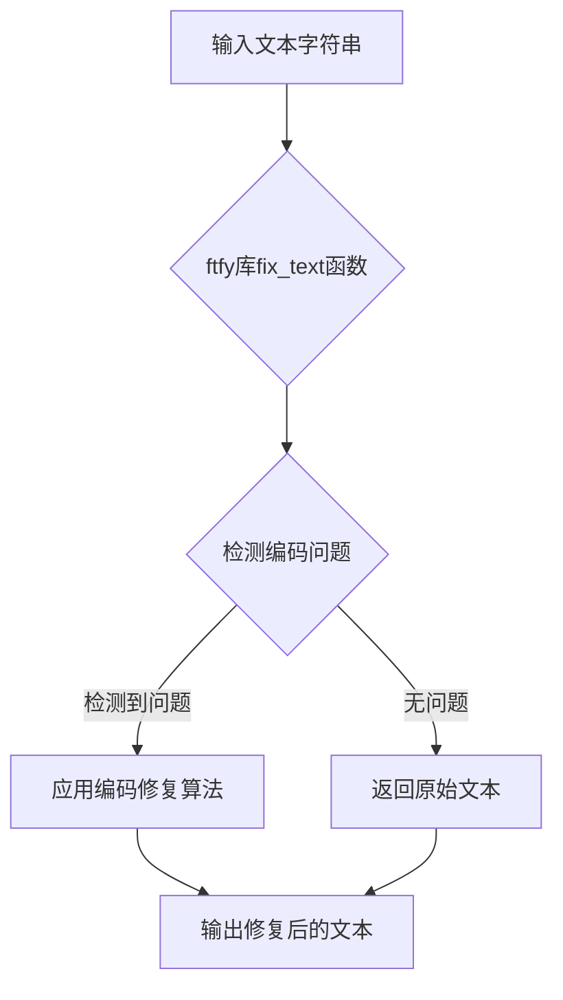

#### 带注释源码

```python
# fix_text 是从 ftfy 库导入的外部函数
# 官方文档：https://ftfy.readthedocs.io/
# 用途：修复文本中的编码错误，特别是由 mojibake 引起的问题
# 例如：将 "é" 修复为 "é"，将 "’" 修复为 "'" 等

from ftfy import fix_text  # 导入外部库函数

# 在 TokenizerWrapper.token2str 方法中的使用示例：
def token2str(self, tokens) -> list:
    # 1. 使用 tokenizer 将 token IDs 解码为文本
    generated_text = self.tokenizer.batch_decode(tokens, skip_special_tokens=True)
    
    # 2. 对每个文本应用 fix_text 修复编码问题
    generated_text = [fix_text(text) for text in generated_text]
    
    # 3. 返回修复后的文本列表
    return generated_text
```

#### 额外说明

| 项目 | 详情 |
|------|------|
| **来源** | `ftfy` 外部库 |
| **主要功能** | 修复 UTF-8 编码错误、mojibake、HTML 实体等问题 |
| **调用场景** | `TokenizerWrapper.token2str` 方法中，对模型生成的文本进行后处理 |
| **依赖** | 需要安装 `ftfy` 库（`pip install ftfy`） |

#### 技术债务/优化空间

1. **外部依赖风险**：`fix_text` 是外部库函数，若库版本更新或废弃，可能影响功能
2. **性能开销**：对每个生成的文本都调用 `fix_text`，在大批量生成时可能带来性能开销
3. **可替代方案**：可以考虑使用 Python 内置的 `codecs` 或自定义编码修复逻辑，减少外部依赖


### `latex_rm_whitespace`

该函数从 `...utils` 模块导入，用于移除 LaTeX 字符串中的多余空白字符，确保输出格式整洁。

参数：

-  `s`：`str`，需要处理的 LaTeX 字符串

返回值：`str`，处理后移除多余空白字符的字符串

#### 流程图

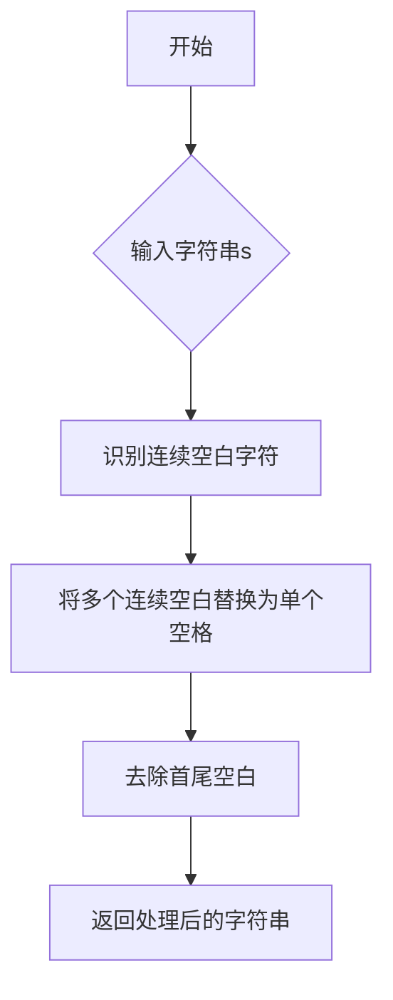

#### 带注释源码

```
# 注意：该函数在代码中通过以下方式导入
from ...utils import latex_rm_whitespace

# 在 UnimernetModel.generate 方法中的使用示例
fixed_str = [latex_rm_whitespace(s) for s in pred_str]

# 该函数接收一个字符串参数 s，
# 返回移除多余空白字符后的字符串。
# 具体实现位于 ...utils 模块中，当前代码文件仅引用使用。
```


### `AutoConfig.register`

将自定义模型配置类注册到Transformers库的AutoConfig系统中，使AutoConfig能够根据模型类型自动加载对应的配置类。

参数：

- `model_type`：`str`，模型的类型标识符（例如"unimer_swin"），用于在AutoConfig.from_pretrained()时识别配置类型
- `config`：`type[PretrainedConfig]`，配置类，必须是PretrainedConfig的子类，包含模型的具体配置信息

返回值：`None`，无返回值，该方法仅执行注册操作

#### 流程图

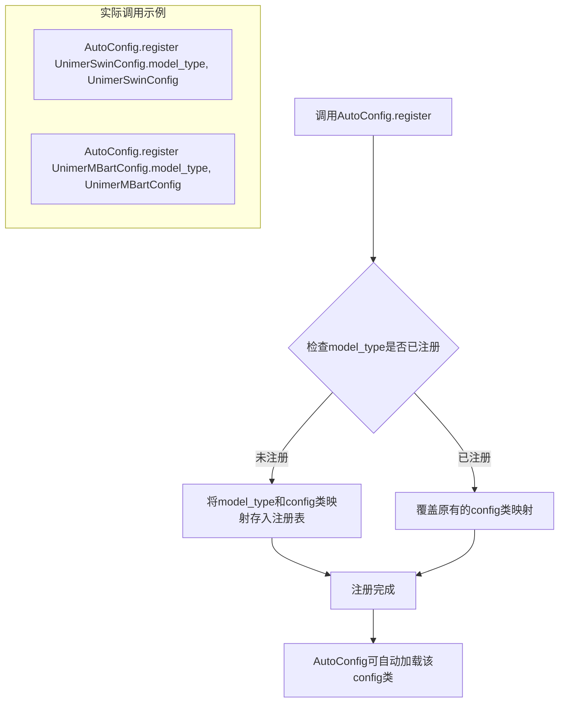

#### 带注释源码

```python
# 注册UnimerSwinConfig到AutoConfig，使AutoConfig能够识别unimer_swin类型的配置
AutoConfig.register(UnimerSwinConfig.model_type, UnimerSwinConfig)

# 注册UnimerMBartConfig到AutoConfig，使AutoConfig能够识别unimer_mbart类型的配置
AutoConfig.register(UnimerMBartConfig.model_type, UnimerMBartConfig)

# 注册完成后，AutoConfig.from_pretrained('path/to/unimer_swin_model') 
# 会自动使用UnimerSwinConfig类来加载配置

# 注册PreTrainedModel子类到AutoModel，使AutoModel能自动加载UnimerSwinModel
AutoModel.register(UnimerSwinConfig, UnimerSwinModel)

# 注册PreTrainedModel子类到AutoModelForCausalLM，使AutoModelForCausalLM能自动加载UnimerMBartForCausalLM
AutoModelForCausalLM.register(UnimerMBartConfig, UnimerMBartForCausalLM)
```

#### 详细说明

该方法调用是Transformers库的核心扩展机制，允许开发者将自定义模型配置和模型类集成到Auto系列方法中：

1. **AutoConfig.register**：将配置类与模型类型字符串关联，使`AutoConfig.from_pretrained()`能根据模型类型自动选择正确的配置类

2. **AutoModel.register**：将模型类与配置类关联，使`AutoModel.from_pretrained()`能根据配置自动实例化正确的模型

3. **AutoModelForCausalLM.register**：类似AutoModel，但用于因果语言模型（如GPT类）的自动加载

这种注册机制实现了配置与模型的解耦，使得使用预训练模型时无需手动指定具体的配置和模型类。


### `AutoModel.register`

这是 `transformers` 库中 `AutoModel` 类的类方法，用于注册新的模型配置类和模型实现类，使得 `AutoModel` 能够自动加载自定义的模型。

参数：

- `config_class`：`UnimerSwinConfig`（或 `PretrainedConfig` 子类），需要注册的配置类，用于标识模型类型
- `model_class`：`UnimerSwinModel`（或 `PreTrainedModel` 子类），配置类对应的模型实现类

返回值：`None`，无返回值（类方法直接修改注册表）

#### 流程图

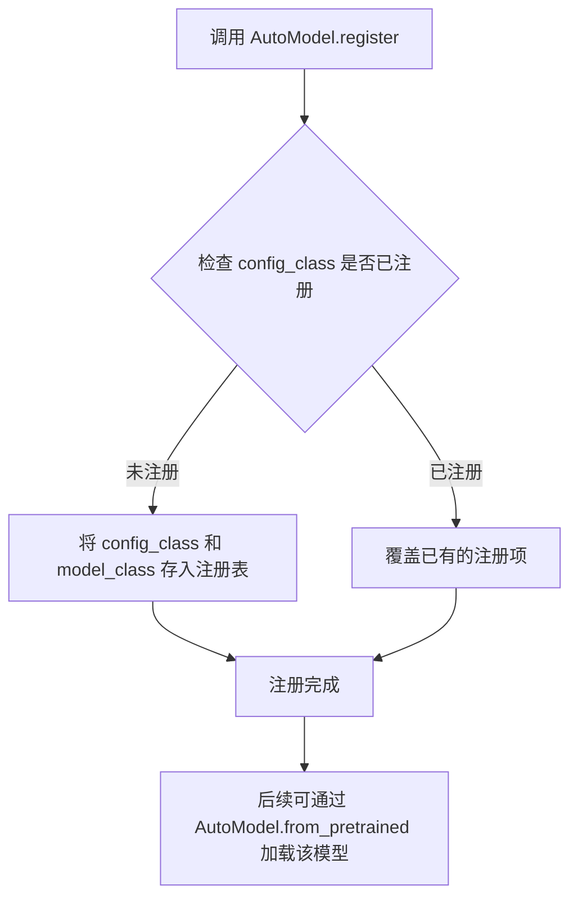

#### 带注释源码

```python
# 注册 Swin Transformer 视觉编码器模型
# 将 UnimerSwinConfig 配置类与 UnimerSwinModel 模型类关联
# 注册后可以使用 AutoModel.from_pretrained() 自动加载基于 UnimerSwinConfig 的模型
AutoModel.register(UnimerSwinConfig, UnimerSwinModel)

# 注册 MBART 因果语言模型
# 将 UnimerMBartConfig 配置类与 UnimerMBartForCausalLM 模型类关联
AutoModelForCausalLM.register(UnimerMBartConfig, UnimerMBartForCausalLM)

# 同时也需要注册配置类本身到 AutoConfig
AutoConfig.register(UnimerSwinConfig.model_type, UnimerSwinConfig)
AutoConfig.register(UnimerMBartConfig.model_type, UnimerMBartConfig)
```


### `AutoModelForCausalLM.register`

这是 Transformers 库的一个类方法，用于将自定义的模型配置类（Config）和模型类（Model）注册到 `AutoModelForCausalLM` 的自动加载映射中。通过注册，Transformers 的 `AutoModelForCausalLM` 能够识别并实例化这些非官方的自定义模型。

参数：
- `config_class`：`Type[PretrainedConfig]`，需要注册的配置类（例如代码中的 `UnimerMBartConfig`），该类必须继承自 `PretrainedConfig`。
- `model_class`：`Type[PreTrainedModel]`，需要注册的模型类（例如代码中的 `UnimerMBartForCausalLM`），该类必须继承自 `PreTrainedModel`。

返回值：`None`，该方法通常不返回任何值，仅执行注册操作。

#### 流程图

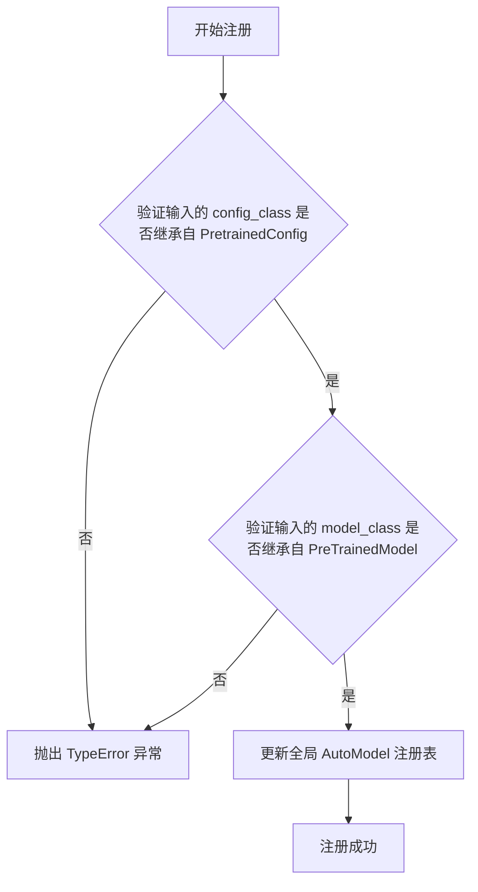

#### 带注释源码

```python
# 这是一个 Transformers 库的类方法调用
# 位于代码文件的顶层，在类定义之外
# 作用：将 UnimerMBartConfig 和 UnimerMBartForCausalLM 配对注册到 AutoModelForCausalLM
# 这样 AutoModelForCausalLM.from_pretrained('path_to_unimer_mbart_model') 就能加载 UnimerMBartForCausalLM

# 注册模型配置类和模型类
# 参数1: UnimerMBartConfig 类 (必须继承自 PretrainedConfig)
# 参数2: UnimerMBartForCausalLM 类 (必须继承自 PreTrainedModel，用于因果语言建模)
AutoModelForCausalLM.register(UnimerMBartConfig, UnimerMBartForCausalLM)
```


### VisionEncoderDecoderConfig.from_pretrained

该方法是从 Hugging Face Transformers 库中继承的类方法，用于从预训练模型路径加载视觉编码器-解码器配置。在 `UnimernetModel.from_checkpoint` 方法中调用此方法创建模型配置对象。

参数：

- `pretrained_model_name_or_path`：`str`，模型路径或模型名称，用于定位配置文件（config.json）
- `**kwargs`：`Any`，可选参数，支持如 `cache_dir`、`force_download`、`resume_download` 等标准 Hugging Face 模型加载参数

返回值：`VisionEncoderDecoderConfig`，返回加载后的视觉编码器-解码器配置对象，包含 encoder 和 decoder 的完整配置信息

#### 流程图

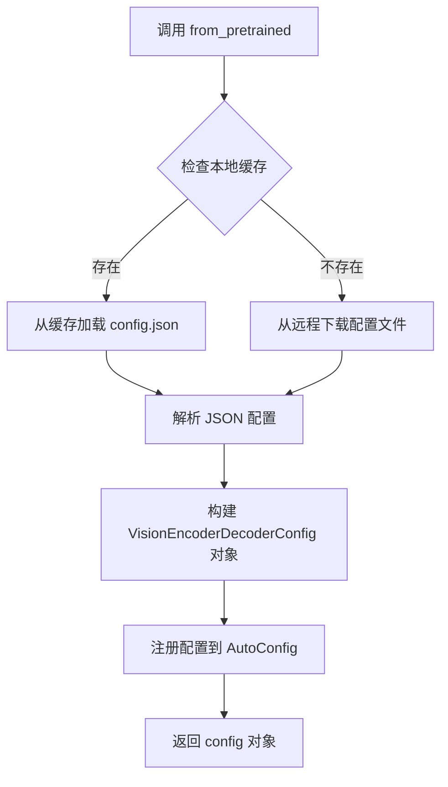

#### 带注释源码

```python
# 在 UnimernetModel.from_checkpoint 方法中的调用方式
config = VisionEncoderDecoderConfig.from_pretrained(model_path)
config._name_or_path = model_path
config.encoder = UnimerSwinConfig(**vars(config.encoder))
config.decoder = UnimerMBartConfig(**vars(config.decoder))
```

> **注意**：该方法的完整源码位于 Hugging Face Transformers 库中（`transformers.models.vision_encoder_decoder.configuration_vision_encoder_decoder.VisionEncoderDecoderConfig.from_pretrained`），不是在本项目代码中直接实现的。在本项目中仅作为外部依赖被调用使用。


### `AutoTokenizer.from_pretrained`

这是Hugging Face Transformers库中的类方法，用于从预训练模型路径或模型名称加载分词器（Tokenizer）。在当前代码中，它被用于为UnimernetModel加载与模型配套的分词器。

参数：

- `pretrained_model_name_or_path`：`str`，预训练模型的名称（如 "bert-base-uncased"）或本地模型目录路径
- `cache_dir`：`Optional[str]`，可选参数，指定缓存目录路径
- `force_download`：`Optional[bool]`，可选参数，是否强制重新下载模型（默认False）
- `resume_download`：`Optional[bool]`，可选参数，是否允许恢复中断的下载（默认True）
- `proxies`：`Optional[dict]`，可选参数，代理服务器设置
- `token`：`Optional[Union[str, bool]]`，可选参数，用于认证的访问令牌
- `revision`：`Optional[str]`，可选参数，要加载的模型版本（默认"main"）
- `trust_remote_code`：`Optional[bool]`，可选参数，是否信任远程代码执行（默认False）
- `torch_dtype`：`Optional[torch.dtype]`，可选参数，指定torch数据类型
- `device_map`：`Optional[Union[dict, str]]`，可选参数，模型在设备上的映射分布
- `max_memory`：`Optional[dict]`，可选参数，每个设备的最大内存限制
- `use_safetensors`：`Optional[bool]`，可选参数，是否使用safetensors格式（默认False）
- `resume_download`：`Optional[bool]`，可选参数，是否恢复中断的下载

返回值：`PreTrainedTokenizer`（或继承自该类的具体分词器），返回加载的预训练分词器对象

#### 流程图

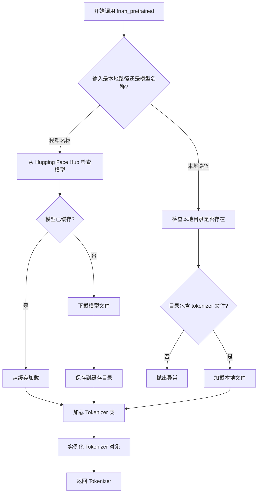

#### 带注释源码

```python
# AutoTokenizer.from_pretrained 的实际调用示例
# 位于 UnimernetModel.__init__ 方法中

# 模型路径来自 config._name_or_path
model_path = config._name_or_path

# 调用 AutoTokenizer.from_pretrained 加载分词器
# 这是一个类方法，直接通过 AutoTokenizer 类调用
self.tokenizer = TokenizerWrapper(AutoTokenizer.from_pretrained(model_path))

# from_pretrained 方法的内部实现逻辑简述：
# 1. 解析 pretrained_model_name_or_path 参数
#    - 如果是本地路径：检查目录结构和必要文件（tokenizer.json, vocab.txt 等）
#    - 如果是模型名称：从 Hugging Face Hub 获取模型信息
# 
# 2. 确定要加载的 Tokenizer 类
#    - 根据模型名称或 config.json 中的 tokenizer_class 字段
#    - 可能需要下载 tokenizer 相关的配置文件
# 
# 3. 实例化 Tokenizer
#    - 加载词表（vocab）
#    - 加载 tokenizer 配置文件
#    - 初始化特殊 token（pad, bos, eos, unk 等）
#    - 设置最大序列长度等属性
# 
# 4. 返回 PreTrainedTokenizer 或其子类的实例
#    - 在本代码中，返回的对象被包装到 TokenizerWrapper 类中
#    - TokenizerWrapper 提供了额外的 tokenize, token2str, detokenize 方法
```

#### 在项目中的使用上下文

```python
class UnimernetModel(VisionEncoderDecoderModel):
    def __init__(
        self,
        config: Optional[PretrainedConfig] = None,
        encoder: Optional[PreTrainedModel] = None,
        decoder: Optional[PreTrainedModel] = None,
    ):
        # ... 省略部分代码 ...
        
        if not config or not hasattr(config, "_name_or_path"):
            raise RuntimeError("config._name_or_path is required by UnimernetModel.")

        model_path = config._name_or_path  # 从配置中获取模型路径
        self.transform = UnimerSwinImageProcessor()
        
        # 关键调用：加载与模型配套的分词器
        # AutoTokenizer.from_pretrained 会根据 model_path 加载对应的分词器
        self.tokenizer = TokenizerWrapper(AutoTokenizer.from_pretrained(model_path))
        
        self._post_check()
```


### `torch.load`

这是PyTorch的模型加载函数，用于从磁盘加载序列化的模型检查点（checkpoint）。在代码中，它被用于加载预训练模型的权重字典。

参数：

- `model_file_path`：`str`，模型文件的完整路径，由`os.path.join(model_path, model_filename)`构建
- `map_location`：`str`，默认为`"cpu"`，指定将模型权重加载到哪个设备上（本代码固定为CPU）
- `weights_only`：`bool`，默认为`True`，如果为`True`，则只加载张量、字典等基本类型，不加载Python对象（可防止恶意代码执行）

返回值：`Any`（通常为`dict`），返回检查点对象，包含模型权重（`model`键）或其他保存的数据

#### 流程图

```mermaid
flowchart TD
    A[开始调用torch.load] --> B{检查weights_only参数}
    B -->|True| C[只加载张量/字典等基础类型]
    B -->|False| D[允许加载任意Python对象]
    C --> E[将模型权重映射到CPU设备]
    D --> E
    E --> F[从磁盘读取pickle文件]
    F --> G[返回checkpoint对象]
    G --> H{检查checkpoint中是否有'model'键}
    H -->|是| I[提取state_dict = checkpoint['model']]
    H -->|否| J[直接使用checkpoint作为state_dict]
    I --> K[结束]
    J --> K
```

#### 带注释源码

```python
# 在 UnimernetModel.from_checkpoint 方法中调用 torch.load
# 用于加载预训练模型的权重文件

# 构建模型文件路径：model_path/pytorch_model.pth
model_file_path = os.path.join(model_path, model_filename)

# 调用 torch.load 加载模型权重
# 参数说明：
# - model_file_path: 模型文件路径
# - map_location="cpu": 将模型加载到CPU内存（无论原始保存设备是什么）
# - weights_only=True: 只加载张量等基础数据类型，不加载Python函数/类对象（安全考虑）
checkpoint = torch.load(model_file_path, map_location="cpu", weights_only=True)

# 从checkpoint中提取state_dict
# 如果checkpoint是字典且包含'model'键，则使用checkpoint['model']作为state_dict
# 否则直接使用整个checkpoint作为state_dict
state_dict = checkpoint["model"] if "model" in checkpoint else checkpoint

# 验证state_dict非空
if not state_dict:
    raise RuntimeError("state_dict is empty.")

# 如果指定了前缀剥离，则移除state_dict中的键前缀
# 例如：将"model.model.encoder.weight"转换为"encoder.weight"
if state_dict_strip_prefix:
    state_dict = {
        k[len(state_dict_strip_prefix):] if k.startswith(state_dict_strip_prefix) else k: v
        for k, v in state_dict.items()
    }

# 加载权重到模型，允许缺少或多余的键
missing_keys, unexpected_keys = model.load_state_dict(state_dict, strict=False)

# 检查意外的键（可能是保存时多余的权重）
if len(unexpected_keys) > 0:
    warnings.warn("Unexpected key(s) in state_dict: {}.".format(", ".join(f'"{k}"' for k in unexpected_keys)))

# 检查缺失的键（模型期望但未加载的权重）
if len(missing_keys) > 0:
    raise RuntimeError("Missing key(s) in state_dict: {}.".format(", ".join(f'"{k}"' for k in missing_keys)))

# 返回完整的模型实例
return model
```


### `TokenizerWrapper.__init__`

这是 `TokenizerWrapper` 类的构造函数，用于初始化分词器包装对象，将传入的 Hugging Face Transformers 分词器对象包装起来，并提取常用的特殊 token ID 供后续使用。

参数：

- `tokenizer`：`transformers.PreTrainedTokenizer` 或类似对象，Hugging Face Transformers 库中的分词器实例，用于文本的分词和解码操作

返回值：`None`，该方法为构造函数，不返回任何值

#### 流程图

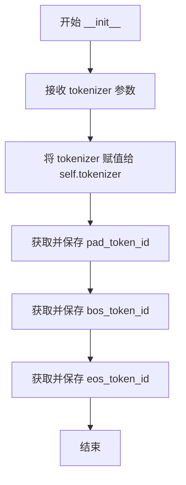

#### 带注释源码

```python
def __init__(self, tokenizer):
    """
    初始化 TokenizerWrapper 对象
    
    参数:
        tokenizer: transformers 库中的分词器对象
    """
    # 将传入的分词器对象保存为实例属性，供类中其他方法使用
    self.tokenizer = tokenizer
    
    # 从分词器中提取 pad token 的 id，用于后续处理填充标记
    self.pad_token_id = self.tokenizer.pad_token_id
    
    # 从分词器中提取 bos (beginning of sequence) token 的 id
    self.bos_token_id = self.tokenizer.bos_token_id
    
    # 从分词器中提取 eos (end of sequence) token 的 id
    self.eos_token_id = self.tokenizer.eos_token_id
```


### `TokenizerWrapper.__len__`

该方法是Python的特殊方法（dunder method），用于让`TokenizerWrapper`类的实例支持内置的`len()`函数调用，从而返回底层tokenizer的词汇表大小。

参数： 无（仅隐式包含`self`参数）

返回值：`int`，返回tokenizer的词汇表大小（即tokenizer中包含的token总数）

#### 流程图

```mermaid
flowchart TD
    A[调用 len(tokenizer_wrapper_instance)] --> B{执行 __len__ 方法}
    B --> C[访问 self.tokenizer]
    C --> D[调用 len(self.tokenizer)]
    D --> E[返回 tokenizer 的词汇表大小]
```

#### 带注释源码

```python
def __len__(self):
    """
    返回底层tokenizer的词汇表大小。
    
    该方法使得TokenizerWrapper实例可以像普通序列一样使用len()函数，
    实际上是委托调用内部tokenizer的__len__方法。
    
    Returns:
        int: tokenizer的词汇表大小，即tokenizer中token的总数量。
    """
    return len(self.tokenizer)  # 调用tokenizer对象的__len__方法并返回其结果
```


### `TokenizerWrapper.tokenize`

该方法是对Hugging Face Transformers库中Tokenizer的封装调用，将输入文本转换为模型所需的PyTorch张量格式（input_ids和attention_mask），并设置了默认的填充和截断策略。

参数：

- `text`：需要分词的输入文本，可以是单个字符串或字符串列表
- `**kwargs`：可变关键字参数，会传递给底层的tokenizer，支持如`max_length`、`add_special_tokens`等额外配置

返回值：`dict`，返回一个包含`input_ids`和`attention_mask`键的字典，其中`input_ids`是分词后的token ID张量，`attention_mask`是标识有效token的注意力掩码张量

#### 流程图

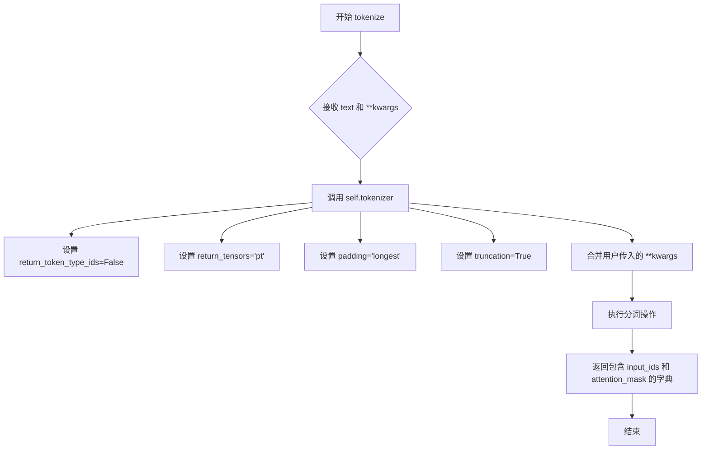

#### 带注释源码

```python
def tokenize(self, text, **kwargs):
    """
    将输入文本分词为PyTorch张量格式
    
    该方法是对Hugging Face Transformers库Tokenizer的封装，提供了默认的
    分词参数配置：返回PyTorch张量、最长填充、启用截断。
    
    参数:
        text: 需要分词的输入文本，支持单个字符串或字符串列表
        **kwargs: 额外的关键字参数，会传递给底层tokenizer
    
    返回:
        包含以下键的字典:
            - input_ids: 分词后的token ID张量
            - attention_mask: 注意力掩码张量，标识有效token位置
    """
    # 调用底层tokenizer进行分词
    # 设置return_token_type_ids=False表示不返回token类型ID
    # 设置return_tensors="pt"表示返回PyTorch张量
    # 设置padding="longest"表示将批次中的序列填充到最长序列的长度
    # 设置truncation=True表示当序列超过模型最大长度时进行截断
    # **kwargs允许用户传入额外参数如max_length等覆盖默认行为
    return self.tokenizer(
        text,
        return_token_type_ids=False,
        return_tensors="pt",
        padding="longest",
        truncation=True,
        **kwargs,
    )
```


### `TokenizerWrapper.token2str`

该方法用于将模型生成的 token IDs 解码为可读的字符串文本。它首先使用分词器的 `batch_decode` 方法将 token 批量解码为字符串，然后使用 `ftfy` 库的 `fix_text` 函数对文本进行编码修复，以确保文本的正确性。

参数：

- `tokens`：`torch.Tensor` 或 `numpy.ndarray`，需要解码的 token 序列，通常是模型生成的输出

返回值：`list`，解码后的字符串列表

#### 流程图

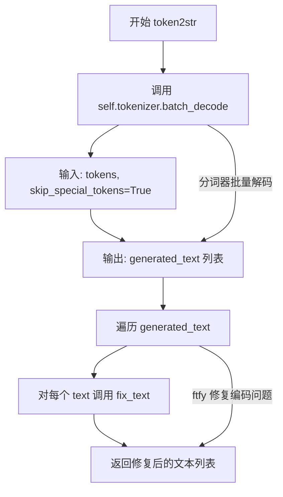

#### 带注释源码

```
def token2str(self, tokens) -> list:
    """
    将 token 序列解码为字符串文本
    
    参数:
        tokens: 模型生成的 token 序列，可以是 torch.Tensor 或 numpy.ndarray
        
    返回:
        list: 解码后的字符串列表
    """
    # 步骤1: 使用分词器的 batch_decode 方法批量解码 token
    # skip_special_tokens=True 表示跳过特殊 token（如 pad、bos、eos 等）
    generated_text = self.tokenizer.batch_decode(tokens, skip_special_tokens=True)
    
    # 步骤2: 对每个解码后的文本进行编码修复
    # fix_text 用于修复常见的编码问题，如 UTF-8 编码错误、mojibake 等
    generated_text = [fix_text(text) for text in generated_text]
    
    # 步骤3: 返回修复后的文本列表
    return generated_text
```


### `TokenizerWrapper.detokenize`

该方法负责将模型生成的token ID序列转换为可读的token列表，同时清理特殊字符（将BPE编码中的'Ġ'替换为空格）、去除特殊标记（bos、eos、pad token），以便后续的文本解码处理。

参数：

- `tokens`：`torch.Tensor` 或 `numpy.ndarray`，需要解token化的token ID序列，通常是模型生成的输出

返回值：`List[List[str]]`，返回解token化后的token列表，每个子列表对应一个批次样本的token序列

#### 流程图

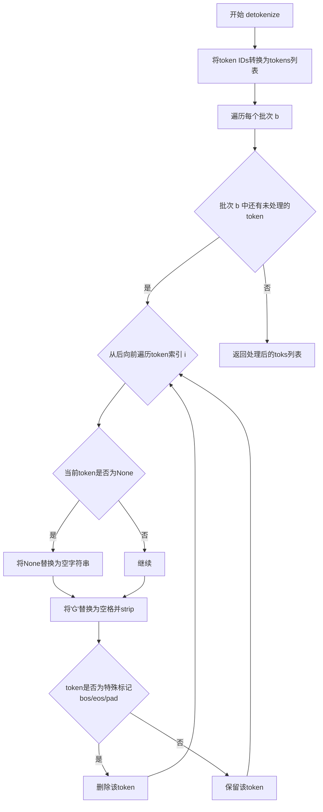

#### 带注释源码

```python
def detokenize(self, tokens):
    """
    将token ID序列解token化为token字符串列表
    
    处理流程：
    1. 将token IDs转换为tokens
    2. 遍历每个token，清理特殊字符
    3. 移除特殊标记（bos/eos/pad）
    
    参数:
        tokens: 模型输出的token ID序列，通常为numpy数组或tensor
        
    返回:
        解token化后的token列表
    """
    # Step 1: 将token IDs转换为token字符串
    # convert_ids_to_tokens是transformers库的方法，将token id转换为对应的token字符串
    toks = [self.tokenizer.convert_ids_to_tokens(tok) for tok in tokens]
    
    # Step 2: 遍历每个批次
    for b in range(len(toks)):
        # Step 3: 从后向前遍历（避免删除元素时索引错位）
        for i in reversed(range(len(toks[b]))):
            # 处理None值（某些tokenizer可能返回None）
            if toks[b][i] is None:
                toks[b][i] = ''
            
            # Step 4: 清理token
            # 'Ġ' 是BPE tokenizer中代表空格的前缀字符，需要替换为空格
            # 然后去除首尾空格
            toks[b][i] = toks[b][i].replace('Ġ', ' ').strip()
            
            # Step 5: 移除特殊标记
            # 删除bos、eos、pad token，这些是特殊控制 token，不需要保留在最终输出中
            if toks[b][i] in ([self.tokenizer.bos_token, self.tokenizer.eos_token, self.tokenizer.pad_token]):
                del toks[b][i]
    
    # Step 6: 返回处理后的token列表
    return toks
```


### `UnimernetModel.__init__`

这是 `UnimernetModel` 类的初始化方法，负责加载预训练配置、初始化编码器和解码器、设置图像处理器和分词器，并进行后检查以确保模型配置与分词器配置一致。

参数：

- `self`：隐式参数，代表实例本身
- `config`：`Optional[PretrainedConfig]`，模型的预训练配置对象，用于初始化 VisionEncoderDecoderModel
- `encoder`：`Optional[PreTrainedModel]`，可选的编码器模型（VisionEncoderDecoderModel 的编码器部分）
- `decoder`：`Optional[PreTrainedModel]`，可选的解码器模型（VisionEncoderDecoderModel 的解码器部分）

返回值：无（`None`），构造函数不返回任何值

#### 流程图

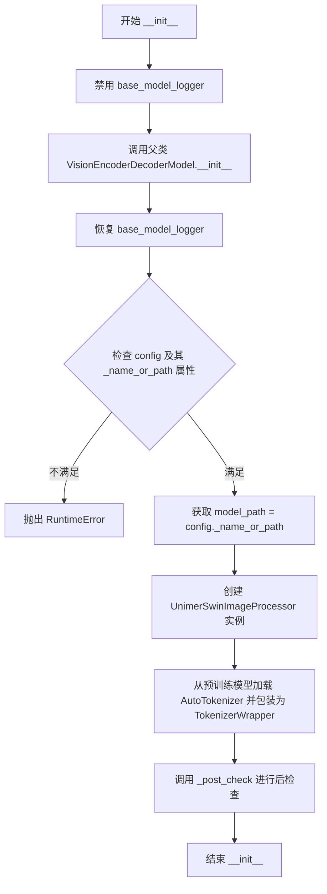

#### 带注释源码

```python
def __init__(
    self,
    config: Optional[PretrainedConfig] = None,
    encoder: Optional[PreTrainedModel] = None,
    decoder: Optional[PreTrainedModel] = None,
):
    # VisionEncoderDecoderModel's checking log has bug, disable for temp.
    # 暂时禁用 VisionEncoderDecoderModel 的日志记录，因为其检查日志存在 bug
    base_model_logger.disabled = True
    try:
        # 调用父类 VisionEncoderDecoderModel 的初始化方法
        super().__init__(config, encoder, decoder)
    finally:
        # 确保无论是否发生异常，都恢复日志记录状态
        base_model_logger.disabled = False

    # 验证 config 对象存在且包含 _name_or_path 属性
    # 该属性对于 UnimernetModel 是必需的，用于定位预训练模型
    if not config or not hasattr(config, "_name_or_path"):
        raise RuntimeError("config._name_or_path is required by UnimernetModel.")

    # 从配置中获取模型路径
    model_path = config._name_or_path
    
    # 初始化图像处理器，用于预处理输入图像
    self.transform = UnimerSwinImageProcessor()
    
    # 加载与模型配套的分词器，并包装为 TokenizerWrapper 以提供统一接口
    self.tokenizer = TokenizerWrapper(AutoTokenizer.from_pretrained(model_path))
    
    # 执行后检查，验证分词器与模型配置的一致性
    self._post_check()
```


### `UnimernetModel._post_check`

该方法用于在模型初始化后进行配置一致性检查和调整，确保tokenizer的配置与模型decoder的配置相匹配，包括tokenizer的最大长度、词汇表大小、起始token和padding token等关键参数。

参数：
- 无（仅包含self参数）

返回值：`None`，无返回值

#### 流程图

```mermaid
flowchart TD
    A[开始 _post_check] --> B[获取 self.tokenizer]
    B --> C{tokenizer.model_max_length == config.decoder.max_position_embeddings?}
    C -->|否| D[发出警告信息]
    D --> E[设置 tokenizer.model_max_length = config.decoder.max_position_embeddings]
    C -->|是| F[继续执行]
    E --> F
    F --> G[断言: decoder.vocab_size == len(tokenizer)]
    G --> H[断言: decoder_start_token_id == tokenizer.bos_token_id]
    H --> I[断言: pad_token_id == tokenizer.pad_token_id]
    I --> J[结束]
    
    G -.->|失败| K[抛出 AssertionError]
    H -.->|失败| K
    I -.->|失败| K
```

#### 带注释源码

```python
def _post_check(self):
    """
    在模型初始化后进行配置一致性检查和调整
    
    检查并确保tokenizer的配置与模型decoder配置相匹配，
    包括最大长度、词汇表大小、起始token和padding token等。
    """
    # 获取模型关联的tokenizer包装器实例
    tokenizer = self.tokenizer

    # 检查tokenizer的最大长度与decoder配置的最大位置嵌入数是否一致
    if tokenizer.tokenizer.model_max_length != self.config.decoder.max_position_embeddings:
        # 如果不一致，发出警告提示用户
        warnings.warn(
            f"decoder.max_position_embeddings={self.config.decoder.max_position_embeddings}," +
            f" but tokenizer.model_max_length={tokenizer.tokenizer.model_max_length}, will set" +
            f" tokenizer.model_max_length to {self.config.decoder.max_position_embeddings}.")
        # 强制将tokenizer的最大长度调整为decoder配置的值
        tokenizer.tokenizer.model_max_length = self.config.decoder.max_position_embeddings

    # 断言：验证decoder的词汇表大小与tokenizer的词汇表大小一致
    assert self.config.decoder.vocab_size == len(tokenizer)
    
    # 断言：验证decoder起始token ID与tokenizer的bos_token_id一致
    assert self.config.decoder_start_token_id == tokenizer.bos_token_id
    
    # 断言：验证padding token ID与tokenizer的pad_token_id一致
    assert self.config.pad_token_id == tokenizer.pad_token_id
```


### `UnimernetModel.from_checkpoint`

这是一个类方法，用于从预训练检查点加载完整的 UnimernetModel 模型，包括配置、编码器、解码器和权重。

参数：

- `model_path`：`str`，模型权重和配置文件的根目录路径
- `model_filename`：`str`，检查点文件名，默认为 `"pytorch_model.pth"`
- `state_dict_strip_prefix`：`str`，状态字典键名前缀，用于去除不必要的键名前缀，默认为 `"model.model."`

返回值：`UnimernetModel`，返回加载完成的模型实例

#### 流程图

```mermaid
flowchart TD
    A[开始 from_checkpoint] --> B[加载 VisionEncoderDecoderConfig]
    B --> C[设置 config._name_or_path]
    C --> D[创建 UnimerSwinConfig 和 UnimerMBartConfig]
    D --> E[实例化 UnimerSwinModel 编码器]
    E --> F[实例化 UnimerMBartForCausalLM 解码器]
    F --> G[创建完整的 UnimernetModel]
    G --> H[拼接模型文件完整路径]
    H --> I[使用 torch.load 加载检查点]
    I --> J{检查点中是否有 'model' 键}
    J -->|是| K[提取 checkpoint['model']] 
    J -->|否| L[直接使用 checkpoint]
    K --> M{state_dict 是否为空}
    L --> M
    M -->|是| N[抛出 RuntimeError]
    M -->|否| O[根据前缀处理 state_dict 键名]
    O --> P[调用 model.load_state_dict 加载权重]
    P --> Q{检查 unexpected_keys}
    Q -->|有| R[发出警告]
    Q -->|无| S{检查 missing_keys}
    S -->|有| T[抛出 RuntimeError]
    S -->|无| U[返回加载完成的模型]
    R --> U
```

#### 带注释源码

```python
@classmethod
def from_checkpoint(cls, model_path: str, model_filename: str = "pytorch_model.pth", state_dict_strip_prefix="model.model."):
    # 1. 从预训练路径加载 VisionEncoderDecoderConfig 配置
    config = VisionEncoderDecoderConfig.from_pretrained(model_path)
    # 2. 设置配置的对象路径为模型路径
    config._name_or_path = model_path
    # 3. 重新包装 encoder 配置为 UnimerSwinConfig
    config.encoder = UnimerSwinConfig(**vars(config.encoder))
    # 4. 重新包装 decoder 配置为 UnimerMBartConfig
    config.decoder = UnimerMBartConfig(**vars(config.decoder))

    # 5. 实例化编码器模型 (UnimerSwinModel)
    encoder = UnimerSwinModel(config.encoder)
    # 6. 实例化解码器模型 (UnimerMBartForCausalLM)
    decoder = UnimerMBartForCausalLM(config.decoder)
    # 7. 使用类构造器创建完整的 UnimernetModel 实例
    model = cls(config, encoder, decoder)

    # ========== 加载模型权重 ==========
    # 8. 拼接检查点文件的完整路径
    model_file_path = os.path.join(model_path, model_filename)
    # 9. 使用 torch 加载检查点到 CPU 内存
    checkpoint = torch.load(model_file_path, map_location="cpu", weights_only=True)
    # 10. 尝试从检查点中提取 "model" 键，若无则直接使用整个 checkpoint
    state_dict = checkpoint["model"] if "model" in checkpoint else checkpoint
    # 11. 检查 state_dict 是否为空，为空则抛出异常
    if not state_dict:
        raise RuntimeError("state_dict is empty.")
    # 12. 如果指定了前缀，则去除 state_dict 中对应键的前缀
    if state_dict_strip_prefix:
        state_dict = {
            k[len(state_dict_strip_prefix):] if k.startswith(state_dict_strip_prefix) else k: v
            for k, v in state_dict.items()
        }
    # 13. 加载权重到模型，返回缺失和意外的键
    missing_keys, unexpected_keys = model.load_state_dict(state_dict, strict=False)
    # 14. 如果存在意外键，发出警告
    if len(unexpected_keys) > 0:
        warnings.warn("Unexpected key(s) in state_dict: {}.".format(", ".join(f'"{k}"' for k in unexpected_keys)))
    # 15. 如果存在缺失键，抛出运行时错误
    if len(missing_keys) > 0:
        raise RuntimeError("Missing key(s) in state_dict: {}.".format(", ".join(f'"{k}"' for k in missing_keys)))
    # 16. 返回加载完成的模型实例
    return model
```


### `UnimernetModel.forward_bak`

该方法是 `UnimernetModel` 类的反向传播前向计算函数，用于对图像-文本对进行模型前向计算并返回损失值。

参数：

- `samples`：`Dict[str, Any]`，包含图像像素值和文本输入的样本字典，必须包含键 "image"（图像张量）和 "text_input"（文本字符串列表）

返回值：`Dict[str, torch.Tensor]`，包含损失值的字典，如 `{"loss": loss}`

#### 流程图

```mermaid
flowchart TD
    A[开始 forward_bak] --> B[从 samples 提取 pixel_values 和 text]
    B --> C[调用 tokenizer.tokenize 对文本进行分词]
    C --> D[提取 decoder_input_ids 和 decoder_attention_mask]
    D --> E{检查通道数是否为1}
    E -->|是| F[将单通道图像重复3次转为三通道]
    E -->|否| G[跳过通道转换]
    F --> G
    G --> H[复制 decoder_input_ids 作为 labels]
    H --> I[将 padding token 位置标记为 -100]
    I --> J[调用 self.model 执行前向计算]
    J --> K[提取 loss 值]
    K --> L[返回 {'loss': loss}]
```

#### 带注释源码

```python
def forward_bak(self, samples):
    """
    前向传播函数，用于计算模型损失
    
    参数:
        samples: 包含图像和文本的字典，必须包含 'image' 和 'text_input' 键
    
    返回:
        包含损失值的字典 {'loss': loss}
    """
    # 从样本中提取图像像素值和文本输入
    # samples["image"]: 图像张量，形状为 [batch, channels, height, width]
    # samples["text_input"]: 文本字符串列表
    pixel_values, text = samples["image"], samples["text_input"]

    # 使用 tokenizer 对文本进行分词处理，返回 input_ids 和 attention_mask
    # 并将结果移动到与 pixel_values 相同的设备上（CPU/GPU）
    text_inputs = self.tokenizer.tokenize(text).to(pixel_values.device)
    
    # 提取解码器输入 IDs 和注意力掩码
    decoder_input_ids, decoder_attention_mask = text_inputs["input_ids"], text_inputs["attention_mask"]

    # 获取图像通道数
    num_channels = pixel_values.shape[1]
    
    # 如果是单通道图像（如灰度图），则复制为三通道（RGB）
    if num_channels == 1:
        pixel_values = pixel_values.repeat(1, 3, 1, 1)

    # 复制 decoder_input_ids 作为标签（用于计算损失）
    labels = decoder_input_ids * 1
    
    # 将 padding token 对应的位置标记为 -100，在损失计算时忽略这些位置
    # 这是 Hugging Face 的标准做法
    labels = labels.masked_fill(labels == self.tokenizer.pad_token_id, -100)

    # 调用底层模型进行前向计算
    # decoder_input_ids[:, :-1]: 去掉最后一个 token，作为输入
    # labels[:, 1:]: 去掉第一个 token（start token），作为标签
    # 模型会自动计算预测 token 与 labels 之间的交叉熵损失
    loss = self.model(
        pixel_values=pixel_values,
        decoder_input_ids=decoder_input_ids[:, :-1],
        decoder_attention_mask=decoder_attention_mask[:, :-1],
        labels=labels[:, 1:],
    ).loss
    
    # 返回包含损失的字典
    return {"loss": loss}
```


### UnimernetModel.generate

该方法是UnimernetModel类的核心生成方法，负责将图像输入转换为文本输出。它首先处理图像数据（确保通道数为3），然后根据是否采样选择性地设置采样参数，接着根据批次大小动态调整tokenizer的最大长度，调用父类的generate方法进行生成，最后对生成的token进行解码、后处理（去除特殊字符、修复LaTeX空格等）并返回多种格式的预测结果。

参数：

- `self`：UnimernetModel实例本身
- `samples`：`Dict`，包含图像数据的字典，必须包含"image"键，值为图像的像素值张量
- `do_sample`：`bool`，是否使用采样策略生成文本，默认为False（使用贪婪搜索）
- `temperature`：`float`，采样时的温度参数，控制生成随机性，默认为0.2
- `top_p`：`float`，核采样（nucleus sampling）的概率阈值，默认为0.95
- `batch_size`：`int`，批次大小，用于决定tokenizer的最大长度，默认为64

返回值：`Dict`，包含以下键的字典：
- `pred_ids`：生成的token ID数组（numpy格式）
- `pred_tokens`：解码后的token列表
- `pred_str`：转换为字符串后的预测结果
- `fixed_str`：经过fix_text和latex_rm_whitespace处理后的最终字符串

#### 流程图

```mermaid
flowchart TD
    A[开始 generate 方法] --> B[从 samples 提取 pixel_values]
    B --> C{图像通道数 == 1?}
    C -->|是| D[将单通道图像重复3次变为3通道]
    C -->|否| E[跳过重复步骤]
    D --> E
    E --> F{do_sample == True?}
    F -->|是| G[设置 temperature 和 top_p 到 kwargs]
    F -->|否| H[kwargs 保持为空]
    G --> I
    H --> I
    I{tokenizer.model_max_length > 1152?}
    I -->|是| J{batch_size <= 32?}
    I -->|否| K[跳过长度调整]
    J -->|是| L[设置 model_max_length = 1152]
    J -->|否| M[设置 model_max_length = 1344]
    L --> N
    M --> N
    K --> N
    N[调用父类 VisionEncoderDecoderModel.generate] --> O[获取生成的 token IDs]
    O --> P[切片去除起始token: outputs[:, 1:]]
    P --> Q[转换为 CPU numpy 数组]
    Q --> R[调用 detokenize 获取 token 列表]
    R --> S[调用 token2str 转换为字符串]
    S --> T[对每个字符串应用 latex_rm_whitespace]
    T --> U[返回结果字典]
```

#### 带注释源码

```python
def generate(self, samples, do_sample: bool = False, temperature: float = 0.2, top_p: float = 0.95, batch_size=64):
    """
    从图像生成文本描述的核心方法
    
    参数:
        samples: 包含图像数据的字典，必须有 "image" 键
        do_sample: 是否使用采样策略，False 为贪婪搜索
        temperature: 采样温度，控制随机性，越高越随机
        top_p: 核采样阈值，只从累积概率达 top_p 的 token 中选择
        batch_size: 批次大小，影响生成时的最大生成长度
    
    返回:
        包含 pred_ids, pred_tokens, pred_str, fixed_str 的字典
    """
    # 从输入样本中提取图像像素值
    pixel_values = samples["image"]
    
    # 检查图像通道数，如果是单通道则重复3次变为RGB三通道
    num_channels = pixel_values.shape[1]
    if num_channels == 1:
        pixel_values = pixel_values.repeat(1, 3, 1, 1)
    
    # 初始化 kwargs 字典，用于存储采样参数
    kwargs = {}
    # 如果启用采样，则设置温度和 top_p 参数
    if do_sample:
        kwargs["temperature"] = temperature
        kwargs["top_p"] = top_p

    # 根据批次大小动态调整 tokenizer 的最大生成长度
    # 以适应不同显存限制: 32以下用1152 tokens, 以上用1344 tokens
    if self.tokenizer.tokenizer.model_max_length > 1152:
        if batch_size <= 32:
            self.tokenizer.tokenizer.model_max_length = 1152  # 6g
        else:
            self.tokenizer.tokenizer.model_max_length = 1344  # 8g

    # 调用父类 VisionEncoderDecoderModel 的 generate 方法进行生成
    # - pixel_values: 编码器的图像输入
    # - max_new_tokens: 最大生成 token 数
    # - decoder_start_token_id: 解码器起始 token
    # - do_sample: 是否采样
    outputs = super().generate(
        pixel_values=pixel_values,
        max_new_tokens=self.tokenizer.tokenizer.model_max_length, # required
        decoder_start_token_id=self.tokenizer.tokenizer.bos_token_id,
        do_sample=do_sample,
        **kwargs,
    )

    # 去除第一个 token (BOS token)，只保留生成的文本部分
    outputs = outputs[:, 1:].cpu().numpy()
    
    # 将 token IDs 解码为 token 列表
    pred_tokens = self.tokenizer.detokenize(outputs)
    
    # 将 token IDs 转换为字符串
    pred_str = self.tokenizer.token2str(outputs)
    
    # 对字符串进行后处理: 修复文本编码问题 + 移除 LaTeX 多余空格
    fixed_str = [latex_rm_whitespace(s) for s in pred_str]
    
    # 返回多种格式的预测结果
    return {"pred_ids": outputs, "pred_tokens": pred_tokens, "pred_str": pred_str, "fixed_str": fixed_str}
```

## 关键组件


### TokenizerWrapper

用于包装HuggingFace Transformers的tokenizer，提供统一的接口来进行tokenize、detokenize和token2str操作，支持特殊token处理和文本修复。

### UnimerSwinConfig & UnimerSwinModel

视觉编码器的配置类和模型实现，基于Swin Transformer架构，负责将图像转换为特征表示。

### UnimerMBartConfig & UnimerMBartForCausalLM

语言解码器的配置类和因果语言模型实现，基于mBART架构，负责根据视觉特征生成文本。

### UnimernetModel

继承自VisionEncoderDecoderModel的主模型类，封装了视觉编码器和解码器的组合逻辑，提供forward_bak训练和generate生成接口。

### from_checkpoint

类方法，负责从指定路径加载预训练检查点，支持state_dict前缀 stripping、权重加载和键值验证，实现模型的惰性加载。

### generate

生成方法，实现图像到文本的推理过程，支持do_sample、temperature、top_p采样参数，根据batch_size动态调整model_max_length（6G/8G显存适配），输出token ids、tokens和修复后的字符串。

### 张量索引与通道处理

在forward_bak和generate中对pixel_values进行通道数检查，将单通道图像重复扩展为三通道，以适配模型输入要求。

### 配置注册机制

通过AutoConfig、AutoModel、AutoModelForCausalLM的register方法将UnimerSwinConfig、UnimerMBartConfig注册到HuggingFace Transformers的自动加载体系中。

### 显存自适应策略

在generate中根据batch_size动态调整tokenizer的model_max_length（32以下为1152，否则为1344），适配不同显存限制。


## 问题及建议


### 已知问题

-   **硬编码的Magic Numbers**：在`generate`方法中，`batch_size <= 32`时设置`model_max_length = 1152`，否则设置为`1344`，这些数值没有注释说明其来源或依据，难以理解和维护。
-   **临时禁用日志的方式不优雅**：使用`base_model_logger.disabled = True/False`来绕过父类的检查日志，这种方式全局影响日志状态，可能影响其他代码的日志输出。
-   **代码重复**：图像通道数检查逻辑（`if num_channels == 1: pixel_values = pixel_values.repeat(1, 3, 1, 1)`）在`forward_bak`和`generate`方法中重复出现。
-   **使用assertions进行配置验证**：在`_post_check`方法中使用`assert`语句进行配置验证，当断言失败时会抛出`AssertionError`，不如自定义异常或warnings友好。
-   **TODO标记未完成**：代码中有`# TODO: rewrite tokenizer`注释，表明tokenizer相关功能可能不完善或需要重写。
-   **类型提示不完整**：例如`generate`方法的`samples`参数没有类型提示，`forward_bak`方法的参数也缺少类型提示。
-   **遗留的备份方法**：`forward_bak`方法名称包含`_bak`后缀，表明这是一个临时或废弃的方法，但仍然保留在代码中，可能造成混淆。
-   **直接修改tokenizer属性**：在`generate`和`_post_check`中直接修改`tokenizer.tokenizer.model_max_length`属性，可能影响tokenizer的原始状态，带来副作用。
-   **缺失的文档字符串**：类和主要方法都缺少docstring，难以理解其设计意图和使用方式。

### 优化建议

-   **消除Magic Numbers**：将硬编码的数值提取为类属性或配置文件，并添加注释说明其含义（如1152对应6G显存，1344对应8G显存）。
-   **改进日志管理方式**：考虑使用上下文管理器或更细粒度的日志控制，而不是全局禁用日志。
-   **提取公共逻辑**：将图像通道数检查逻辑提取为类方法或工具函数，避免代码重复。
-   **改进错误处理**：将assertions替换为更友好的错误处理机制，如抛出自定义异常或使用warnings.warn。
-   **完成TODO项**：优先处理tokenizer的重写工作，或在代码中添加更详细的说明为什么需要重写。
-   **完善类型提示**：为所有公共方法参数和返回值添加完整的类型提示。
-   **清理废弃代码**：移除`forward_bak`方法或将其重命名为更明确的名称，如`_legacy_forward`。
-   **使用配置对象**：考虑创建配置对象来管理tokenizer的修改，而不是直接修改属性。
-   **添加文档字符串**：为所有类和方法添加详细的docstring，说明功能、参数、返回值和示例。


## 其它


### 设计目标与约束

本模块旨在实现UnimernetModel多模态理解与生成模型，核心设计目标是将视觉编码器（Swin Transformer）与语言解码器（MBART）通过VisionEncoderDecoder架构进行统一，支持图像到文本的生成任务。设计约束包括：1) 必须注册自定义配置类型（UnimerSwinConfig、UnimerMBartConfig）到AutoConfig/AutoModel；2) tokenizer的model_max_length必须与decoder.max_position_embeddings对齐；3) vocab_size、decoder_start_token_id、pad_token_id必须保持一致。

### 错误处理与异常设计

本模块采用分层错误处理策略：**关键错误**（导致程序终止）包括：config._name_or_path缺失时抛出RuntimeError；state_dict为空时抛出RuntimeError；存在missing_keys时抛出RuntimeError。**警告级别**（不影响执行但需关注）包括：unexpected_keys存在时发出warnings.warn；tokenizer.model_max_length与decoder.max_position_embeddings不一致时发出warnings.warn。**临时修复**：禁用base_model_logger以绕过VisionEncoderDecoderModel构造函数中的日志bug。

### 数据流与状态机

数据流分为**推理流程**和**训练流程**：推理时，输入图像经UnimerSwinImageProcessor预处理，pixel_values送入编码器提取特征，super().generate执行自回归解码，输出token经detokenize和token2str转换，最后fix_text和latex_rm_whitespace进行后处理。训练时，forward_bak方法将图像和文本转为tensor，构造labels（pad_token位置置-100），计算cross-entropy loss。

### 外部依赖与接口契约

**核心依赖**：torch>=1.9（张量计算）；transformers（模型架构）；ftfy（文本编码修复）；loguru（日志）；unimer_swin和unimer_mbart（自定义模块）。**接口契约**：from_checkpoint(model_path, model_filename, state_dict_strip_prefix)方法期望模型目录下存在pytorch_model.pth文件，checkpoint包含model键或直接为state_dict；generate方法接收samples字典，需包含"image"键，输出包含pred_ids、pred_tokens、pred_str、fixed_str的字典；TokenizerWrapper.tokenize返回包含input_ids和attention_mask的字典。

### 配置与初始化

模型通过VisionEncoderDecoderConfig进行配置管理，encoder_config由UnimerSwinConfig实例化，decoder_config由UnimerMBartConfig实例化。初始化时自动加载tokenizer（AutoTokenizer.from_pretrained），并执行_post_check验证配置一致性。tokenizer.model_max_length会根据batch_size动态调整为1152（batch≤32）或1344（batch>32）以适配不同显存约束。

### 性能考虑与优化空间

**当前优化**：图像单通道自动扩展为三通道（repeat(1,3,1,1)）；tokenizer长度根据batch_size动态调整；使用weights_only=True减少内存占用。**潜在优化空间**：1) forward_bak未使用torch.no_grad()装饰器，训练时可能导致梯度计算开销；2) generate方法中model_max_length硬编码1152/1344，可考虑提取为配置参数；3) detokenize使用嵌套循环实现，建议向量化以提升性能；4) 缺少torch.compile()或ONNX导出支持；5) TokenizerWrapper的token2str每次调用都fix_text，可考虑缓存；6) from_checkpoint的state_dict_strip_prefix为硬编码字符串，应提取为配置参数。

### 安全性与限制

本模块存在以下安全限制：weights_only=True仅加载.float32/.float16权重，不支持int8/int4等量化权重；strict=False允许部分加载权重但可能引入隐蔽bug；checkpoint路径未做路径遍历检查（依赖上层调用方保证）；模型生成依赖max_new_tokens限制，无超时保护。

    