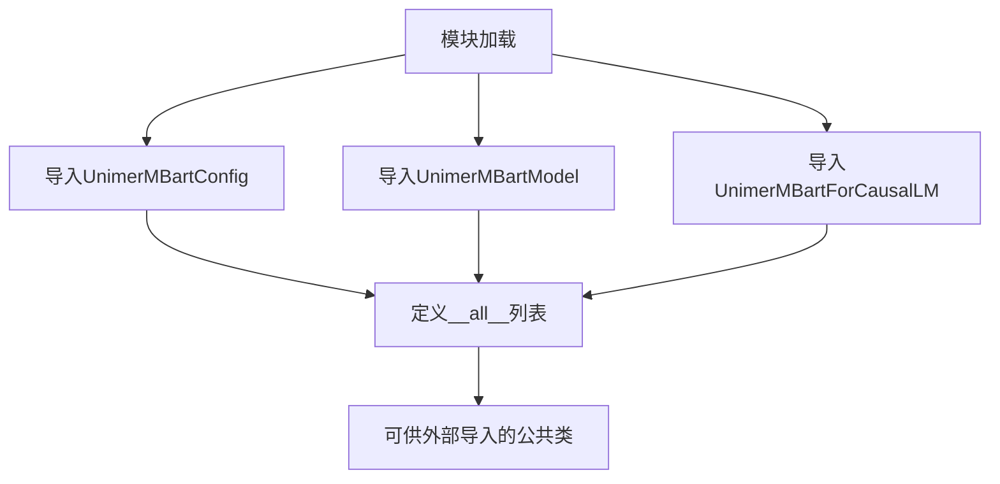

# `MinerU\mineru\model\mfr\unimernet\unimernet_hf\unimer_mbart\__init__.py` 详细设计文档

这是一个Hugging Face Transformers风格的模型包初始化文件，用于统一导出UniMER M-BART模型的配置类、基础模型类和支持因果语言建模的模型类，为上层提供清晰的公共API接口。

## 整体流程



## 类结构

```
无本地类定义（仅为导入导出模块）
├── 导入源模块
│   ├── configuration_unimer_mbart.UnimerMBartConfig
│   └── modeling_unimer_mbart.UnimerMBartModel, UnimerMBartForCausalLM
```

## 全局变量及字段


### `UnimerMBartConfig`
    
UnimerMBart模型的配置类，包含模型的结构参数和训练超参数

类型：`class`
    


### `UnimerMBartModel`
    
UnimerMBart的基础模型类，提供模型的前向传播和推理功能

类型：`class`
    


### `UnimerMBartForCausalLM`
    
UnimerMBart的因果语言模型类，用于因果语言建模任务

类型：`class`
    


### `__all__`
    
模块的公共接口列表，定义了可以被from module import *导入的类

类型：`list`
    


    

## 全局函数及方法


## 关键组件


### UnimerMBartConfig

配置类，定义UnimerMBart模型的超参数和架构参数。

### UnimerMBartModel

核心模型类，实现UnimerMBart的神经网络结构。

### UnimerMBartForCausalLM

因果语言模型类，基于UnimerMBart模型用于生成任务。


## 问题及建议


### 已知问题

-   **模块文档缺失**：该 `__init__.py` 文件缺少模块级文档字符串（docstring），无法快速了解该模块的核心用途和设计背景
-   **版本信息缺失**：未定义 `__version__` 变量，不利于版本管理和依赖追踪
-   **导入容错性不足**：直接导入配置类和模型类，若依赖模块不存在或接口变更，会导致整个包无法导入，缺乏渐进式失败机制
-   **类型注解缺失**：未使用 `from __future__ import annotations` 或提供类型提示，影响静态分析和 IDE 支持
-   **API 暴露粒度不明确**：仅导出三个核心类，若后续新增配置类、工具函数或枚举类型，需手动同步更新 `__all__` 列表
-   **依赖关系不透明**：未通过文档或类型别名声明对 `transformers` 库的实际依赖

### 优化建议

-   添加模块级文档字符串，说明 UnimerMBart 是多语言 BART 变体模型的设计背景及核心能力
-   显式定义 `__version__` 并从版本文件或 `pyproject.toml` 导入，保持版本一致性
-   考虑使用延迟导入（lazy import）或 `try-except` 包装导入语句，提供更友好的导入错误信息
-   添加 `from __future__ import annotations` 以提升类型注解的前向兼容性
-   在 `__all__` 中增加类型别名或配置工厂函数，统一管理公共 API 暴露策略
-   在模块 docstring 或独立 README 中明确声明对 `transformers` 库的版本依赖范围
</think>

## 其它


### 设计目标与约束

本模块作为UniMER MBart模型的对外接口层，目标是提供统一的配置管理、基础模型和因果语言模型功能。设计约束包括：保持与HuggingFace Transformers库的高度兼容性，遵循标准的模型加载和推理流程，最小化外部依赖，仅导出核心类以保证API的清晰性。

### 错误处理与异常设计

模块级错误处理主要依赖于导入时各子模块的异常传播。当UnimerMBartConfig、UnimerMBartModel或UnimerMBartForCausalLM类无法从子模块导入时，会抛出ImportError。建议在外部使用时添加try-except块捕获导入异常，并提供友好的错误提示信息。

### 外部依赖与接口契约

本模块依赖于configuration_unimer_mbart和modeling_unimer_mbart两个子模块。对外承诺的接口契约包括：UnimerMBartConfig类提供模型配置管理，UnimerMBartModel类提供基础模型结构，UnimerMBartForCausalLM类提供因果语言建模能力。所有导出类均应遵循HuggingFace Transformers库的标准接口规范。

### 使用示例与集成指南

典型使用流程为：首先导入所需配置或模型类，然后通过配置类初始化模型参数，最后实例化模型进行推理或微调。建议按照以下顺序使用：1) 导入UnimerMBartConfig创建配置对象，2) 使用配置初始化UnimerMBartForCausalLM，3) 调用模型的forward方法进行推理。

### 性能考虑与优化建议

模块本身为纯导入层，无运行时性能开销。模型层面的性能优化应在modeling_unimer_mbart子模块中实现，包括：使用FP16/INT8量化加速推理，启用gradient checkpointing节省显存，采用批量处理提高吞吐量。建议在生产环境中根据硬件条件选择合适的推理优化策略。

### 版本兼容性信息

当前模块版本与UniMER项目其他模块保持同步。依赖的configuration_unimer_mbart和modeling_unimer_mbart子模块应保持相同的版本号。建议锁定具体版本号以避免因子模块API变更导致的兼容性问题。

### 安全性考虑

模块本身不涉及敏感数据处理或网络请求。模型加载时应验证模型文件的完整性和来源可靠性，防止潜在的恶意模型文件攻击。在生产环境中部署时，应确保模型文件和配置文件的访问权限得到适当控制。

### 未来扩展计划

可能的扩展方向包括：1) 添加更多模型变体（如UnimerMBartForSequenceClassification），2) 支持更多的预训练模型格式，3) 集成更多的推理优化特性。设计时应保持接口的向后兼容性，确保现有代码不会因扩展而中断。

    