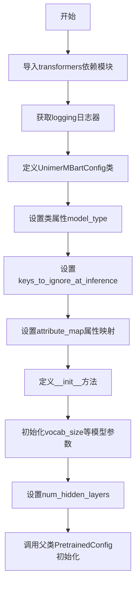
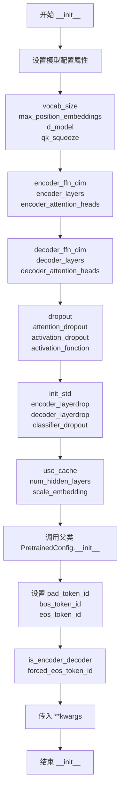

# `MinerU\mineru\model\mfr\unimernet\unimernet_hf\unimer_mbart\configuration_unimer_mbart.py` 详细设计文档

UniMER MBART模型的配置文件，继承自HuggingFace Transformers的PretrainedConfig，用于定义MBART编码器-解码器架构的模型超参数，包括注意力头数、层数、维度等核心配置

## 整体流程



## 类结构

```
PretrainedConfig (基类)
└── UnimerMBartConfig
```

## 全局变量及字段


### `logger`
    
用于记录日志的全局日志对象

类型：`logging.Logger`
    


### `UnimerMBartConfig.model_type`
    
模型类型标识符，用于模型注册和加载

类型：`str`
    


### `UnimerMBartConfig.keys_to_ignore_at_inference`
    
推理时需要忽略的键列表，通常用于缓存的键值对

类型：`list`
    


### `UnimerMBartConfig.attribute_map`
    
属性映射字典，用于兼容不同命名约定的配置

类型：`dict`
    


### `UnimerMBartConfig.vocab_size`
    
词汇表大小，定义模型可以处理的不同token的数量

类型：`int`
    


### `UnimerMBartConfig.max_position_embeddings`
    
最大位置嵌入长度，模型能处理的最大序列长度

类型：`int`
    


### `UnimerMBartConfig.d_model`
    
模型隐藏层维度，决定模型表示能力的宽度

类型：`int`
    


### `UnimerMBartConfig.qk_squeeze`
    
查询/键的压缩比例，用于降低注意力计算的维度

类型：`int`
    


### `UnimerMBartConfig.encoder_ffn_dim`
    
编码器前馈网络的中间层维度

类型：`int`
    


### `UnimerMBartConfig.encoder_layers`
    
编码器 Transformer 层的数量

类型：`int`
    


### `UnimerMBartConfig.encoder_attention_heads`
    
编码器中每个注意力层的注意力头数量

类型：`int`
    


### `UnimerMBartConfig.decoder_ffn_dim`
    
解码器前馈网络的中间层维度

类型：`int`
    


### `UnimerMBartConfig.decoder_layers`
    
解码器 Transformer 层的数量

类型：`int`
    


### `UnimerMBartConfig.decoder_attention_heads`
    
解码器中每个注意力层的注意力头数量

类型：`int`
    


### `UnimerMBartConfig.dropout`
    
全连接层的 dropout 概率，用于防止过拟合

类型：`float`
    


### `UnimerMBartConfig.attention_dropout`
    
注意力概率的 dropout 概率

类型：`float`
    


### `UnimerMBartConfig.activation_dropout`
    
激活函数的 dropout 概率

类型：`float`
    


### `UnimerMBartConfig.activation_function`
    
激活函数类型，如 gelu、relu、silu 等

类型：`str`
    


### `UnimerMBartConfig.init_std`
    
权重矩阵初始化时截断正态分布的标准差

类型：`float`
    


### `UnimerMBartConfig.encoder_layerdrop`
    
编码器层的 LayerDrop 概率，用于正则化

类型：`float`
    


### `UnimerMBartConfig.decoder_layerdrop`
    
解码器层的 LayerDrop 概率，用于正则化

类型：`float`
    


### `UnimerMBartConfig.classifier_dropout`
    
分类器的 dropout 概率

类型：`float`
    


### `UnimerMBartConfig.use_cache`
    
是否缓存解码器输出的 key/value 以加速推理

类型：`bool`
    


### `UnimerMBartConfig.num_hidden_layers`
    
隐藏层的总数，等同于 encoder_layers

类型：`int`
    


### `UnimerMBartConfig.scale_embedding`
    
是否对嵌入向量乘以 sqrt(d_model) 进行缩放

类型：`bool`
    
    

## 全局函数及方法


### `UnimerMBartConfig.__init__`

用于初始化UniMER-MBART模型的配置对象，设置模型的各种超参数（如词汇表大小、层数、注意力头数、维度等），并调用父类PretrainedConfig的初始化方法完成基础配置。

参数：

- `vocab_size`：`int`，可选，默认50265，词汇表大小，定义模型可表示的不同token数量
- `max_position_embeddings`：`int`，可选，默认1024，模型可能使用的最大序列长度
- `encoder_layers`：`int`，可选，默认12，编码器的层数
- `encoder_ffn_dim`：`int`，可选，默认4096，编码器前馈（feed-forward）层的维度
- `encoder_attention_heads`：`int`，可选，默认16，编码器中每个注意力层的注意力头数
- `decoder_layers`：`int`，可选，默认12，解码器的层数
- `decoder_ffn_dim`：`int`，可选，默认4096，解码器前馈层的维度
- `decoder_attention_heads`：`int`，可选，默认16，解码器中每个注意力层的注意力头数
- `encoder_layerdrop`：`float`，可选，默认0.0，编码器的LayerDrop概率
- `decoder_layerdrop`：`float`，可选，默认0.0，解码器的LayerDrop概率
- `use_cache`：`bool`，可选，默认True，是否使用缓存存储最后的key/values注意力
- `is_encoder_decoder`：`bool`，可选，默认True，是否为编码器-解码器架构
- `activation_function`：`str`或`function`，可选，默认"gelu"，编码器和pooler中的非线性激活函数
- `d_model`：`int`，可选，默认1024，层的维度和pooler层的维度
- `qk_squeeze`：`int`，可选，默认2，查询/键输出维度的压缩比，用于加速注意力计算
- `dropout`：`float`，可选，默认0.1，所有全连接层的dropout概率
- `attention_dropout`：`float`，可选，默认0.0，注意力概率的dropout比率
- `activation_dropout`：`float`，可选，默认0.0，全连接层内激活函数的dropout比率
- `init_std`：`float`，可选，默认0.02，初始化所有权重矩阵的截断正态分布标准差
- `classifier_dropout`：`float`，可选，默认0.0，分类器的dropout比率
- `scale_embedding`：`bool`，可选，默认False，是否通过除以sqrt(d_model)来缩放嵌入
- `pad_token_id`：`int`，可选，默认1，填充token的ID
- `bos_token_id`：`int`，可选，默认0，序列开始token的ID
- `eos_token_id`：`int`，可选，默认2，序列结束token的ID
- `forced_eos_token_id`：`int`，可选，默认2，达到max_length时强制作为最后生成token的ID
- `**kwargs`：`dict`，可选，传递给父类的其他关键字参数

返回值：`None`，无返回值（构造函数）

#### 流程图



#### 带注释源码

```python
def __init__(
    self,
    vocab_size=50265,              # 词汇表大小，默认50265
    max_position_embeddings=1024,  # 最大位置嵌入数，默认1024
    encoder_layers=12,             # 编码器层数，默认12
    encoder_ffn_dim=4096,          # 编码器前馈网络维度，默认4096
    encoder_attention_heads=16,    # 编码器注意力头数，默认16
    decoder_layers=12,             # 解码器层数，默认12
    decoder_ffn_dim=4096,          # 解码器前馈网络维度，默认4096
    decoder_attention_heads=16,    # 解码器注意力头数，默认16
    encoder_layerdrop=0.0,          # 编码器LayerDrop概率，默认0.0
    decoder_layerdrop=0.0,         # 解码器LayerDrop概率，默认0.0
    use_cache=True,                # 是否使用缓存，默认True
    is_encoder_decoder=True,       # 是否为编码器-解码器架构，默认True
    activation_function="gelu",    # 激活函数，默认"gelu"
    d_model=1024,                  # 模型维度，默认1024
    qk_squeeze=2,                  # Query/Key压缩比，默认2（UniMERNet特性）
    dropout=0.1,                   # Dropout概率，默认0.1
    attention_dropout=0.0,         # 注意力dropout，默认0.0
    activation_dropout=0.0,        # 激活函数dropout，默认0.0
    init_std=0.02,                 # 权重初始化标准差，默认0.02
    classifier_dropout=0.0,        # 分类器dropout，默认0.0
    scale_embedding=False,         # 是否缩放嵌入，默认False
    pad_token_id=1,                # 填充token ID，默认1
    bos_token_id=0,                # 开始token ID，默认0
    eos_token_id=2,                 # 结束token ID，默认2
    forced_eos_token_id=2,         # 强制结束token ID，默认2
    **kwargs,                      # 其他传递给父类的参数
):
    # === 模型架构配置属性 ===
    self.vocab_size = vocab_size              # 词汇表大小
    self.max_position_embeddings = max_position_embeddings  # 最大序列长度
    self.d_model = d_model                    # 模型隐藏层维度
    self.qk_squeeze = qk_squeeze              # Query/Key压缩比（UniMERNet特有）
    self.encoder_ffn_dim = encoder_ffn_dim    # 编码器前馈网络维度
    self.encoder_layers = encoder_layers     # 编码器层数
    self.encoder_attention_heads = encoder_attention_heads  # 编码器注意力头数
    self.decoder_ffn_dim = decoder_ffn_dim    # 解码器前馈网络维度
    self.decoder_layers = decoder_layers     # 解码器层数
    self.decoder_attention_heads = decoder_attention_heads  # 解码器注意力头数
    
    # === Dropout配置 ===
    self.dropout = dropout                    # 主dropout概率
    self.attention_dropout = attention_dropout  # 注意力dropout
    self.activation_dropout = activation_dropout  # 激活函数dropout
    self.activation_function = activation_function  # 激活函数类型
    self.init_std = init_std                  # 权重初始化标准差
    
    # === LayerDrop配置 ===
    self.encoder_layerdrop = encoder_layerdrop  # 编码器LayerDrop
    self.decoder_layerdrop = decoder_layerdrop  # 解码器LayerDrop
    self.classifier_dropout = classifier_dropout  # 分类器dropout
    
    # === 其他配置 ===
    self.use_cache = use_cache                # 是否使用KV缓存
    self.num_hidden_layers = encoder_layers  # 隐藏层数量（等于编码器层数）
    self.scale_embedding = scale_embedding    # 是否缩放嵌入（乘以sqrt(d_model)）
    
    # === 调用父类初始化 ===
    # 将token ID和架构类型等参数传递给PretrainedConfig
    super().__init__(
        pad_token_id=pad_token_id,            # 填充token ID
        bos_token_id=bos_token_id,            # 开始token ID
        eos_token_id=eos_token_id,            # 结束token ID
        is_encoder_decoder=is_encoder_decoder, # 是否为编码器-解码器
        forced_eos_token_id=forced_eos_token_id,  # 强制EOS token
        **kwargs,                              # 其他额外参数
    )
```

## 关键组件


### UnimerMBartConfig

UnimerMBartConfig 是 UniMER-MBART 模型的配置类，继承自 HuggingFace 的 PretrainedConfig，用于定义模型架构的所有超参数，包括编码器/解码器层数、注意力头数、隐藏层维度、dropout 比率等，并提供了 qk_squeeze 参数用于压缩注意力计算的查询键空间以加速推理。

### qk_squeeze 参数

qk_squeeze 是 UniMERNet 特有的压缩比参数，用于将 Query 和 Key 映射到低维空间，在减少计算量的同时保持关键信息，是该模型的核心优化特性。

### vocab_size

词汇表大小参数，定义模型可以处理的不同 token 数量，默认值为 50265。

### d_model

模型隐藏层维度，定义 Transformer 层和池化层的维度，默认值为 1024。

### encoder_layers / decoder_layers

编码器和解码器的层数，默认均为 12 层，决定模型的深度和容量。

### encoder_attention_heads / decoder_attention_heads

编码器和解码器中每个注意力层的注意力头数，默认均为 16 个头。

### encoder_ffn_dim / decoder_ffn_dim

编码器和解码器中前馈神经网络的隐藏层维度，默认均为 4096。

### dropout / attention_dropout / activation_dropout / classifier_dropout

各种 dropout 概率参数，分别用于全连接层、注意力概率、激活函数和分类器，用于防止过拟合。

### activation_function

激活函数类型，支持 "gelu"、"relu"、"silu" 和 "gelu_new"，默认使用 "gelu"。

### use_cache

控制模型是否返回最后一个 key/value 注意力，用于推理时的缓存加速，支持惰性加载。

### scale_embedding

布尔参数，决定是否将 embeddings 除以 sqrt(d_model) 进行缩放。

### is_encoder_decoder

标志位，指示该模型是否为编码器-解码器架构，此处默认为 True。

### max_position_embeddings

模型最大序列长度，默认 1024，定义位置编码的范围。

### init_std

权重矩阵初始化时的标准差，默认 0.02，用于 truncated_normal_initializer。

### encoder_layerdrop / decoder_layerdrop

编码器和解码器的 LayerDrop 概率，用于逐层随机丢弃以提高鲁棒性。

### pad_token_id / bos_token_id / eos_token_id / forced_eos_token_id

特殊 token 的 ID，分别对应填充、句子开始、句子结束和强制结束 token。

### model_type

模型类型标识符，值为 "unimer-mbart"，用于模型识别和加载。

### attribute_map

属性映射字典，将 num_attention_heads 映射到 encoder_attention_heads，hidden_size 映射到 d_model，提供向后兼容性。

### keys_to_ignore_at_inference

推理时需要忽略的键列表，包含 "past_key_values"，用于推理优化。


## 问题及建议


### 已知问题

- 文档字符串与类名不匹配：文档中多处引用`MBartModel`而非`UnimerMBartConfig`，可能导致使用者混淆。
- 缺少参数验证：`__init__`方法中未对参数如`qk_squeeze`、`d_model`等进行有效性检查，可能导致运行时错误。
- 注释错误：文档字符串中描述`encoder_ffn_dim`和`decoder_ffn_dim`时，误将"encoder"写为"decoder"（The "intermediate" (often named feed-forward) layer in decoder.）。
- 参数冗余：`num_hidden_layers`被设置为`encoder_layers`，但在解码器中可能需要独立的层数配置，当前实现未明确区分。
- 默认值硬编码：一些默认值（如`vocab_size=50265`）特定于预训练模型，可能不适用于所有场景，缺乏灵活性。
- 继承依赖：直接继承`PretrainedConfig`并使用`**kwargs`传递，可能隐藏必需的父类参数，导致初始化失败时难以调试。
- 魔法数字：代码中多处使用数字如`pad_token_id=1`、`bos_token_id=0`等，缺乏常量定义，可读性差。

### 优化建议

- 添加参数验证逻辑：在`__init__`中检查`qk_squeeze`为正整数、`d_model`能被`encoder_attention_heads`整除等约束条件。
- 统一文档字符串：将所有`MBartModel`引用替换为`UnimerMBartConfig`，并修正注释错误。
- 使用枚举或常量类：为token ID定义常量，提高可维护性。
- 考虑拆分配置类：若encoder和decoder层数可能不同，应移除`num_hidden_layers`的单一赋值，允许独立配置。
- 增强类型提示：为所有参数添加类型注解，并使用`dataclass`或`pydantic`进行更严格的配置管理。
- 简化继承调用：明确列出父类必需参数，避免依赖`**kwargs`隐式传递，减少隐藏的依赖性。
- 添加配置验证方法：覆盖`PretrainedConfig`的验证方法，确保配置在实例化前符合模型要求。


## 其它


### 设计目标与约束

本配置类旨在为UnimerMBART模型提供统一的配置管理能力，封装模型架构的所有超参数，确保模型实例化的可重复性和配置的一致性。设计约束包括：必须继承自PretrainedConfig以保持与HuggingFace Transformers生态的兼容性；所有配置参数需提供合理的默认值以支持快速原型开发；参数命名需遵循Transformers库的命名约定（如encoder_attention_heads对应num_attention_heads）。

### 错误处理与异常设计

配置类本身主要负责参数存储，错误处理主要依赖父类PretrainedConfig实现。参数验证在__init__方法中进行，类型检查由Python解释器自动处理。对于数值参数（如dropout、layerdrop）的取值范围未做显式校验，可能导致无效值（如负数或大于1的概率值）被接受。建议在未来的版本中添加参数范围验证逻辑，确保dropout类参数在[0,1]范围内，维度参数为正整数。

### 外部依赖与接口契约

主要依赖transformers.configuration_utils.PretrainedConfig基类和transformers.utils.logging模块进行日志记录。配置类需遵守PretrainedConfig定义的接口契约，包括：to_dict()方法将配置序列化为字典；from_dict()类方法从字典反序列化；save_pretrained()和from_pretrained()方法支持模型配置的持久化和加载。vocab_size、d_model等属性需与tokenizer配置保持一致。

### 版本兼容性

该配置类使用model_type = "unimer-mbart"标识自身，需确保Transformers库版本支持此模型类型注册。当前配置继承自PretrainedConfig，假设兼容Transformers 4.x系列。随着Transformers库更新，可能需要调整attribute_map或继承层级以保持兼容性。

### 序列化与反序列化

配置对象支持两种序列化方式：to_dict()方法将所有非继承属性转换为Python字典；__init__参数可直接传递字典进行反序列化。保存时通过save_pretrained(save_directory)写入config.json文件，加载时通过from_pretrained(pretrained_model_name_or_path)读取。序列化时仅保存self属性，不包含继承自父类的属性。

### 扩展性设计

配置类通过**kwargs机制支持向父类传递额外参数，允许在不修改本类的情况下扩展功能。新的配置参数可直接在__init__方法中添加，并通过self.xxx赋值。attribute_map提供了参数别名映射机制，便于后续添加参数别名以保持向后兼容。

### 使用示例与用例

典型用例包括：使用默认配置创建模型；自定义特定参数（如d_model、encoder_layers）创建轻量级模型；通过from_pretrained加载预训练配置；修改配置参数后保存供后续复用。配置对象通常与UnimerMBartModel和UnimerMBartTokenizer配合使用，需确保vocab_size、pad_token_id、bos_token_id、eos_token_id等参数与tokenizer配置匹配。

    