# `MinerU\mineru\model\mfr\unimernet\unimernet_hf\unimer_mbart\modeling_unimer_mbart.py` 详细设计文档

UnimerMBart是一个基于PyTorch实现的多语言序列到序列预训练模型，源自Facebook的MBART架构，支持翻译、摘要生成、条件生成等多种自然语言生成任务。该模型采用对称的Encoder-Decoder结构，支持多种注意力机制实现（eager、flash_attention_2、sdpa），并集成了计数预测等扩展功能。

## 整体流程

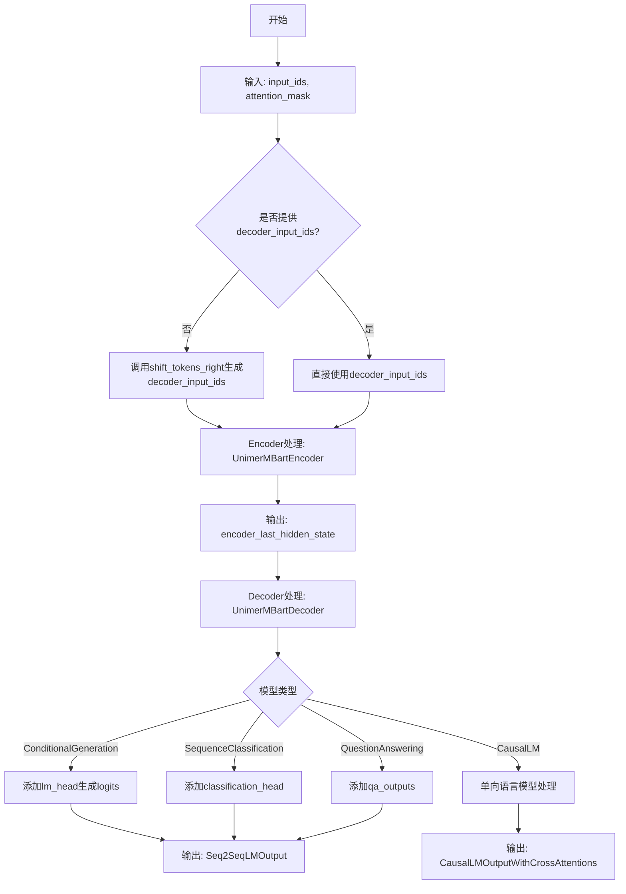

## 类结构

```
PreTrainedModel (transformers基类)
└── UnimerMBartPreTrainedModel
    ├── UnimerMBartModel (基础Seq2Seq模型)
    │   ├── UnimerMBartEncoder
    │   │   └── UnimerMBartEncoderLayer
    │   │       └── UnimerMBartAttention (3种实现)
    │   └── UnimerMBartDecoder
    │       └── UnimerMBartDecoderLayer
    │           ├── UnimerMBartAttention (自注意力)
    │           └── UnimerMBartAttention (交叉注意力)
    ├── UnimerMBartForConditionalGeneration (条件生成)
    ├── UnimerMBartForSequenceClassification (序列分类)
    ├── UnimerMBartForQuestionAnswering (问答)
    ├── UnimerMBartDecoderWrapper (Decoder包装器)
    └── UnimerMBartForCausalLM (因果语言模型)
        └── UnimerMBartDecoderWrapper
            └── UnimerMBartDecoder
```

## 全局变量及字段


### `logger`
    
Logger instance for the module.

类型：`logging.Logger`
    


### `_CHECKPOINT_FOR_DOC`
    
Default checkpoint name for documentation.

类型：`str`
    


### `_CONFIG_FOR_DOC`
    
Configuration class name for documentation.

类型：`str`
    


### `_EXPECTED_OUTPUT_SHAPE`
    
Expected shape of model output for documentation.

类型：`list`
    


### `UNIMER_MBART_ATTENTION_CLASSES`
    
Mapping from attention implementation names to attention classes.

类型：`dict`
    


### `MBART_START_DOCSTRING`
    
Documentation string for MBart model class.

类型：`str`
    


### `MBART_GENERATION_EXAMPLE`
    
Example code for generation using MBart.

类型：`str`
    


### `MBART_INPUTS_DOCSTRING`
    
Documentation string for input arguments.

类型：`str`
    


### `CausalLMOutputWithCrossAttentionsAndCounting.counting`
    
Optional tensor storing counting predictions for the output.

类型：`Optional[torch.FloatTensor]`
    


### `UnimerMBartLearnedPositionalEmbedding.offset`
    
Offset added to position indices to account for special tokens.

类型：`int`
    


### `UnimerMBartScaledWordEmbedding.embed_scale`
    
Scaling factor multiplied with word embeddings.

类型：`Optional[float]`
    


### `UnimerMBartAttention.embed_dim`
    
Dimensionality of the model's hidden states.

类型：`int`
    


### `UnimerMBartAttention.num_heads`
    
Number of attention heads.

类型：`int`
    


### `UnimerMBartAttention.dropout`
    
Dropout probability for attention weights.

类型：`float`
    


### `UnimerMBartAttention.head_dim`
    
Dimensionality of each attention head.

类型：`int`
    


### `UnimerMBartAttention.config`
    
Model configuration object.

类型：`UnimerMBartConfig`
    


### `UnimerMBartAttention.squeeze_dim`
    
Dimension after squeezing key/value projections.

类型：`int`
    


### `UnimerMBartAttention.squeeze_head_dim`
    
Head dimension after squeezing.

类型：`int`
    


### `UnimerMBartAttention.scaling`
    
Scaling factor for attention scores (inverse square root of head dimension).

类型：`float`
    


### `UnimerMBartAttention.is_decoder`
    
Whether the layer is used as a decoder.

类型：`bool`
    


### `UnimerMBartAttention.is_causal`
    
Whether causal masking is applied.

类型：`bool`
    


### `UnimerMBartAttention.q_proj`
    
Linear projection for query.

类型：`nn.Linear`
    


### `UnimerMBartAttention.k_proj`
    
Linear projection for key.

类型：`nn.Linear`
    


### `UnimerMBartAttention.v_proj`
    
Linear projection for value.

类型：`nn.Linear`
    


### `UnimerMBartAttention.out_proj`
    
Linear projection for output.

类型：`nn.Linear`
    


### `UnimerMBartFlashAttention2._flash_attn_uses_top_left_mask`
    
Whether flash attention uses top-left causal mask (depends on Flash Attention version).

类型：`bool`
    


### `UnimerMBartEncoderLayer.embed_dim`
    
Dimensionality of the encoder layer's hidden states.

类型：`int`
    


### `UnimerMBartEncoderLayer.self_attn`
    
Self-attention module for encoder.

类型：`nn.Module`
    


### `UnimerMBartEncoderLayer.self_attn_layer_norm`
    
Layer normalization after self-attention.

类型：`nn.LayerNorm`
    


### `UnimerMBartEncoderLayer.dropout`
    
Dropout probability.

类型：`float`
    


### `UnimerMBartEncoderLayer.activation_fn`
    
Activation function (e.g., gelu).

类型：`Callable`
    


### `UnimerMBartEncoderLayer.activation_dropout`
    
Dropout after activation.

类型：`float`
    


### `UnimerMBartEncoderLayer.fc1`
    
First fully connected layer in feed-forward network.

类型：`nn.Linear`
    


### `UnimerMBartEncoderLayer.fc2`
    
Second fully connected layer in feed-forward network.

类型：`nn.Linear`
    


### `UnimerMBartEncoderLayer.final_layer_norm`
    
Layer normalization after feed-forward network.

类型：`nn.LayerNorm`
    


### `UnimerMBartDecoderLayer.embed_dim`
    
Dimensionality of decoder layer's hidden states.

类型：`int`
    


### `UnimerMBartDecoderLayer.self_attn`
    
Self-attention module for decoder.

类型：`nn.Module`
    


### `UnimerMBartDecoderLayer.self_attn_layer_norm`
    
Layer normalization after self-attention.

类型：`nn.LayerNorm`
    


### `UnimerMBartDecoderLayer.dropout`
    
Dropout probability.

类型：`float`
    


### `UnimerMBartDecoderLayer.activation_fn`
    
Activation function.

类型：`Callable`
    


### `UnimerMBartDecoderLayer.activation_dropout`
    
Dropout after activation.

类型：`float`
    


### `UnimerMBartDecoderLayer.encoder_attn`
    
Encoder-decoder cross-attention module.

类型：`nn.Module`
    


### `UnimerMBartDecoderLayer.encoder_attn_layer_norm`
    
Layer normalization after cross-attention.

类型：`nn.LayerNorm`
    


### `UnimerMBartDecoderLayer.fc1`
    
First fully connected layer in decoder feed-forward.

类型：`nn.Linear`
    


### `UnimerMBartDecoderLayer.fc2`
    
Second fully connected layer in decoder feed-forward.

类型：`nn.Linear`
    


### `UnimerMBartDecoderLayer.final_layer_norm`
    
Layer normalization after decoder feed-forward.

类型：`nn.LayerNorm`
    


### `UnimerMBartClassificationHead.dense`
    
Dense layer for classification.

类型：`nn.Linear`
    


### `UnimerMBartClassificationHead.dropout`
    
Dropout layer.

类型：`nn.Dropout`
    


### `UnimerMBartClassificationHead.out_proj`
    
Output projection to number of classes.

类型：`nn.Linear`
    


### `UnimerMBartPreTrainedModel.config_class`
    
Configuration class for this pretrained model.

类型：`type`
    


### `UnimerMBartPreTrainedModel.base_model_prefix`
    
Prefix for base model in hierarchical naming.

类型：`str`
    


### `UnimerMBartPreTrainedModel.supports_gradient_checkpointing`
    
Whether the model supports gradient checkpointing.

类型：`bool`
    


### `UnimerMBartPreTrainedModel._no_split_modules`
    
List of module names that should not be split across devices.

类型：`list`
    


### `UnimerMBartPreTrainedModel._supports_flash_attn_2`
    
Whether the model supports Flash Attention 2.

类型：`bool`
    


### `UnimerMBartPreTrainedModel._supports_sdpa`
    
Whether the model supports SDPA attention.

类型：`bool`
    


### `UnimerMBartEncoder.dropout`
    
Dropout probability.

类型：`float`
    


### `UnimerMBartEncoder.layerdrop`
    
Encoder layer dropout probability.

类型：`float`
    


### `UnimerMBartEncoder.padding_idx`
    
Index of padding token in vocabulary.

类型：`int`
    


### `UnimerMBartEncoder.max_source_positions`
    
Maximum source sequence length.

类型：`int`
    


### `UnimerMBartEncoder.embed_tokens`
    
Token embedding layer.

类型：`nn.Embedding`
    


### `UnimerMBartEncoder.embed_positions`
    
Positional embedding layer.

类型：`nn.Embedding`
    


### `UnimerMBartEncoder.layers`
    
List of encoder layers.

类型：`nn.ModuleList`
    


### `UnimerMBartEncoder._use_flash_attention_2`
    
Flag to use Flash Attention 2.

类型：`bool`
    


### `UnimerMBartEncoder._use_sdpa`
    
Flag to use SDPA attention.

类型：`bool`
    


### `UnimerMBartEncoder.layernorm_embedding`
    
Layer normalization applied to embeddings.

类型：`nn.LayerNorm`
    


### `UnimerMBartEncoder.layer_norm`
    
Final layer normalization.

类型：`nn.LayerNorm`
    


### `UnimerMBartEncoder.gradient_checkpointing`
    
Whether gradient checkpointing is enabled.

类型：`bool`
    


### `UnimerMBartDecoder.dropout`
    
Dropout probability.

类型：`float`
    


### `UnimerMBartDecoder.layerdrop`
    
Decoder layer dropout probability.

类型：`float`
    


### `UnimerMBartDecoder.padding_idx`
    
Padding token index.

类型：`int`
    


### `UnimerMBartDecoder.max_target_positions`
    
Maximum target sequence length.

类型：`int`
    


### `UnimerMBartDecoder.embed_tokens`
    
Token embedding layer.

类型：`nn.Embedding`
    


### `UnimerMBartDecoder.embed_positions`
    
Positional embedding layer.

类型：`nn.Embedding`
    


### `UnimerMBartDecoder.layers`
    
List of decoder layers.

类型：`nn.ModuleList`
    


### `UnimerMBartDecoder._use_flash_attention_2`
    
Flag to use Flash Attention 2.

类型：`bool`
    


### `UnimerMBartDecoder._use_sdpa`
    
Flag to use SDPA attention.

类型：`bool`
    


### `UnimerMBartDecoder.layernorm_embedding`
    
Layer normalization for embeddings.

类型：`nn.LayerNorm`
    


### `UnimerMBartDecoder.layer_norm`
    
Final layer normalization.

类型：`nn.LayerNorm`
    


### `UnimerMBartDecoder.gradient_checkpointing`
    
Whether gradient checkpointing is enabled.

类型：`bool`
    


### `UnimerMBartModel.shared`
    
Shared word embedding.

类型：`nn.Embedding`
    


### `UnimerMBartModel.encoder`
    
The encoder part of the model.

类型：`UnimerMBartEncoder`
    


### `UnimerMBartModel.decoder`
    
The decoder part of the model.

类型：`UnimerMBartDecoder`
    


### `UnimerMBartForConditionalGeneration.model`
    
The underlying Seq2Seq model.

类型：`UnimerMBartModel`
    


### `UnimerMBartForConditionalGeneration.final_logits_bias`
    
Bias added to logits for token predictions.

类型：`torch.Tensor`
    


### `UnimerMBartForConditionalGeneration.lm_head`
    
Linear head for language modeling.

类型：`nn.Linear`
    


### `UnimerMBartForSequenceClassification.model`
    
The underlying Seq2Seq model.

类型：`UnimerMBartModel`
    


### `UnimerMBartForSequenceClassification.classification_head`
    
Classification head for sequence classification.

类型：`UnimerMBartClassificationHead`
    


### `UnimerMBartForQuestionAnswering.model`
    
The underlying Seq2Seq model.

类型：`UnimerMBartModel`
    


### `UnimerMBartForQuestionAnswering.qa_outputs`
    
Output linear layer for question answering.

类型：`nn.Linear`
    


### `UnimerMBartForQuestionAnswering.num_labels`
    
Number of labels for QA output.

类型：`int`
    


### `UnimerMBartDecoderWrapper.decoder`
    
Wrapped decoder.

类型：`UnimerMBartDecoder`
    


### `UnimerMBartForCausalLM.model`
    
The decoder-only model.

类型：`UnimerMBartDecoderWrapper`
    


### `UnimerMBartForCausalLM.lm_head`
    
Linear head for causal language modeling.

类型：`nn.Linear`
    
    

## 全局函数及方法


### `_get_unpad_data`

该函数用于从注意力掩码中提取Flash Attention所需的关键数据，包括有效token的索引、序列累积长度和批次最大序列长度，以便在可变长度序列场景下正确执行Flash Attention计算。

参数：

- `attention_mask`：`torch.Tensor`，注意力掩码张量，形状为`(batch_size, seq_len)`，其中1表示有效token，0表示padding

返回值：`(torch.Tensor, torch.Tensor, int)`，返回一个元组，包含：
- `indices`：所有有效token位置的索引，形状为`(total_valid_tokens,)`
- `cu_seqlens`：累积序列长度，用于Flash Attention，形状为`(batch_size + 1,)`
- `max_seqlen_in_batch`：批次中的最大序列长度，整数类型

#### 流程图

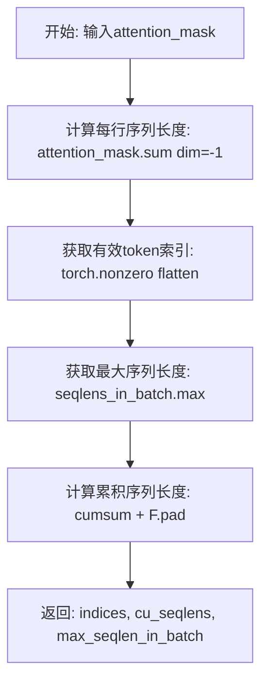

#### 带注释源码

```python
# Copied from transformers.models.llama.modeling_llama._get_unpad_data
def _get_unpad_data(attention_mask):
    """
    从注意力掩码中提取Flash Attention所需的数据。
    
    用于处理可变长度序列的padding，将attention_mask转换为
    Flash Attention API所需的格式。
    
    Args:
        attention_mask: 注意力掩码，形状为 (batch_size, seq_len)，
                       1表示有效位置，0表示padding
    
    Returns:
        包含以下元素的元组:
        - indices: 所有有效token的索引（展平后的位置）
        - cu_seqlens: 累积序列长度，用于Flash Attention的序列划分
        - max_seqlen_in_batch: 批次中最大的有效序列长度
    """
    # 计算每个样本的序列长度（有效token数量）
    # 结果形状: (batch_size,)
    seqlens_in_batch = attention_mask.sum(dim=-1, dtype=torch.int32)
    
    # 获取所有非零（有效）位置的索引
    # attention_mask.flatten() 展平为 1D，nonzero 找出值为1的位置
    # 结果形状: (total_valid_tokens,)
    indices = torch.nonzero(attention_mask.flatten(), as_tuple=False).flatten()
    
    # 获取批次中的最大序列长度
    max_seqlen_in_batch = seqlens_in_batch.max().item()
    
    # 计算累积序列长度（cumulative sequence lengths）
    # 先对seqlens_in_batch进行累积求和，然后使用F.pad在前面填充一个0
    # 这样得到的长度数组第一个元素是0，后面每个元素表示到该位置的累积长度
    # 结果形状: (batch_size + 1,)
    # 例如: seqlens=[2,3,1] -> cumsum=[2,5,6] -> pad后=[0,2,5,6]
    cu_seqlens = F.pad(torch.cumsum(seqlens_in_batch, dim=0, dtype=torch.int32), (1, 0))
    
    return (
        indices,
        cu_seqlens,
        max_seqlen_in_batch,
    )
```


### shift_tokens_right

该函数是 MBART 模型中用于将输入 token 序列向右移动一位，并将最后一个非 pad token（语言 ID token）作为解码器起始 token 的全局辅助函数。这在 MBART 的去噪预训练任务中用于生成 decoder 输入。

参数：

- `input_ids`：`torch.Tensor`，输入的 token ID 张量，形状为 (batch_size, sequence_length)
- `pad_token_id`：`int`，用于填充的 token ID，必须提供该参数

返回值：`torch.Tensor`，处理后的 token 张量，形状与输入相同，其中序列向右移动了一位，首位被设置为原序列最后一个非 pad token

#### 流程图

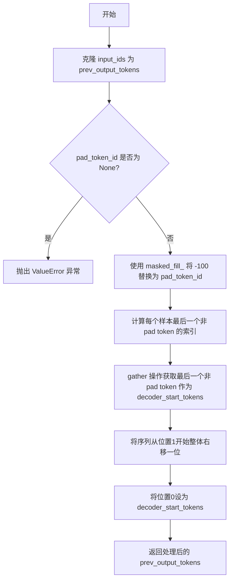

#### 带注释源码

```python
def shift_tokens_right(input_ids: torch.Tensor, pad_token_id: int):
    """
    Shift input ids one token to the right, and wrap the last non pad token (the <LID> token) 
    Note that MBart does not have a single `decoder_start_token_id` in contrast to other Bart-like models.
    """
    # 克隆输入张量，避免修改原始数据
    prev_output_tokens = input_ids.clone()

    # 检查 pad_token_id 是否已定义，MBART 必须配置该参数
    if pad_token_id is None:
        raise ValueError("self.model.config.pad_token_id has to be defined.")
    
    # 在标签中用 pad_token_id 替换可能的 -100 值
    # -100 通常用于在损失计算中标记需要忽略的位置
    prev_output_tokens.masked_fill_(prev_output_tokens == -100, pad_token_id)

    # 计算每个样本中最后一个非 pad token 的索引位置
    # ne(pad_token_id) 创建一个布尔张量，标记非 pad 位置
    # sum(dim=1) 统计每行的非 pad token 数量
    # -1 获取最后一个非 pad token 的索引
    index_of_eos = (prev_output_tokens.ne(pad_token_id).sum(dim=1) - 1).unsqueeze(-1)
    
    # 使用 gather 操作获取每个样本的 decoder 起始 token（即最后一个非 pad token）
    decoder_start_tokens = prev_output_tokens.gather(1, index_of_eos).squeeze()
    
    # 将序列整体向右移动一位：positions[1:] = positions[:-1]
    prev_output_tokens[:, 1:] = prev_output_tokens[:, :-1].clone()
    
    # 将第一个位置设置为从序列末尾收集的 decoder 起始 token
    prev_output_tokens[:, 0] = decoder_start_tokens

    return prev_output_tokens
```


### `UnimerMBartLearnedPositionalEmbedding.forward`

该方法是 UnimerMBartLearnedPositionalEmbedding 类的前向传播函数，用于根据输入的 token ID 张量生成对应的可学习位置嵌入。在 MBart 架构中，位置嵌入通过一个可学习的嵌入矩阵实现，支持通过偏移量（offset=2）来兼容特殊的 padding 处理。

参数：

- `input_ids`：`torch.Tensor`，输入的 token ID 张量，形状为 `[batch_size, sequence_length]`
- `past_key_values_length`：`int`，可选（默认值 0），用于 past key values 的长度偏移，通常在解码器使用缓存时用于生成正确的位置索引

返回值：`torch.Tensor`，位置嵌入张量，形状为 `[batch_size, sequence_length, embedding_dim]`

#### 流程图

```mermaid
flowchart TD
    A[输入 input_ids 和 past_key_values_length] --> B[解构 input_ids 形状: bsz, seq_len]
    C[生成位置序列] --> D[从 past_key_values_length 开始<br/>到 past_key_values_length + seq_len 结束<br/>步长为 1]
    D --> E[扩展位置向量<br/>expand to [bsz, -1]]
    F[位置向量 + offset] --> G[调用父类 nn.Embedding.forward<br/>获取位置嵌入]
    E --> F
    G --> H[返回位置嵌入张量]
```

#### 带注释源码

```python
def forward(self, input_ids: torch.Tensor, past_key_values_length: int = 0):
    """
    `input_ids' shape is expected to be [bsz x seqlen].
    
    参数:
        input_ids: 输入的token ID张量，形状为 [batch_size, sequence_length]
        past_key_values_length: 用于past key values的长度偏移，默认值为0
    
    返回:
        位置嵌入张量，形状为 [batch_size, sequence_length, embedding_dim]
    """
    
    # 获取输入的batch大小和序列长度
    bsz, seq_len = input_ids.shape[:2]
    
    # 生成位置索引序列
    # 从 past_key_values_length 开始，生成 seq_len 个位置
    # dtype=torch.long: 确保位置索引为长整型
    # device=self.weight.device: 确保位置张量与嵌入矩阵在同一设备上
    positions = torch.arange(
        past_key_values_length, past_key_values_length + seq_len, 
        dtype=torch.long, device=self.weight.device
    ).expand(bsz, -1)  # 扩展为 [bsz, seq_len]，-1 表示自动推断维度
    
    # 调用父类 nn.Embedding 的 forward 方法
    # 加上 self.offset (值为 2) 是因为 MBart 使用了特殊的 padding 处理方式
    # 需要将位置索引偏移 2 个单位
    return super().forward(positions + self.offset)
```


### `UnimerMBartScaledWordEmbedding.forward`

该方法是 `UnimerMBartScaledWordEmbedding` 类的正向传播函数，继承自 PyTorch 的 `nn.Embedding`，通过乘以嵌入缩放因子（`embed_scale`）来调整嵌入向量的尺度。这是 MBart 模型中特有的嵌入层实现，用于在嵌入后应用缩放因子，以提升模型训练的数值稳定性或适配特定的嵌入空间配置。

参数：

- `input_ids`：`torch.Tensor`，输入的令牌 ID 张量，形状为 `(batch_size, sequence_length)`，表示批次中每个序列的令牌索引。

返回值：`torch.Tensor`，经过缩放后的嵌入向量，形状为 `(batch_size, sequence_length, embedding_dim)`，其中 `embedding_dim` 是嵌入向量的维度。

#### 流程图

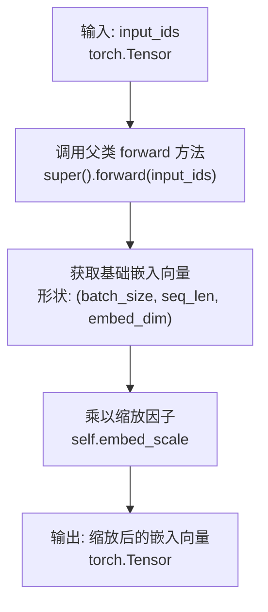

#### 带注释源码

```python
def forward(self, input_ids: torch.Tensor):
    """
    前向传播方法，对输入的 token IDs 进行嵌入并缩放。

    Args:
        input_ids (torch.Tensor): 
            输入的令牌 ID 张量，形状为 (batch_size, sequence_length)。
            每个值代表词汇表中对应词的索引。

    Returns:
        torch.Tensor: 
            经过缩放后的嵌入向量，形状为 (batch_size, sequence_length, embedding_dim)。
            通过将基础嵌入向量乘以 embed_scale 得到。
    """
    # 调用 PyTorch  nn.Embedding 的 forward 方法，获取基础的词嵌入向量
    # 父类方法会根据 input_ids 中的索引从嵌入矩阵中查找对应的嵌入向量
    embeddings = super().forward(input_ids)
    
    # 将基础嵌入向量乘以缩放因子 embed_scale
    # embed_scale 在初始化时设置，通常为 sqrt(embed_dim) 或其他自定义值
    # 这一步骤可以调整嵌入向量的尺度，可能有助于模型的数值稳定性或性能
    return embeddings * self.embed_scale
```


### `UnimerMBartAttention._shape_qk`

该方法用于将输入的张量重新整形为多头注意力机制所需的四维张量形状，专门用于 Query 和 Key 投影。与 Value 的形状处理不同，该方法使用了压缩后的 `squeeze_head_dim`，这是因为在 UniMER-MBART 架构中引入了 QK 压缩机制，通过 `qk_squeeze` 参数减少 Key 和 Value 的维度以提高计算效率。

参数：

- `tensor`：`torch.Tensor`，输入的 Query 或 Key 投影张量，形状为 (bsz, seq_len, squeeze_dim)
- `seq_len`：`int`，序列长度维度
- `bsz`：`int`，批次大小维度

返回值：`torch.Tensor`，重新整形后的张量，形状为 (bsz, num_heads, seq_len, squeeze_head_dim)，且在内存中是连续的

#### 流程图

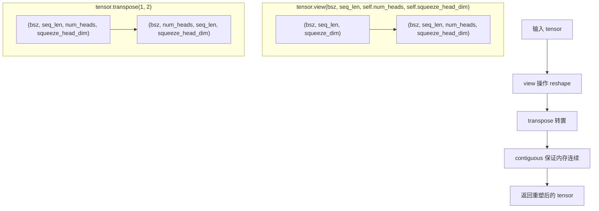

#### 带注释源码

```python
def _shape_qk(self, tensor: torch.Tensor, seq_len: int, bsz: int):
    """
    将输入的 Query/Key 张量重新整形为多头注意力的标准形状
    
    参数:
        tensor: 来自 q_proj 或 k_proj 投影的输出张量
                形状为 (bsz, seq_len, squeeze_dim)，其中 squeeze_dim = embed_dim // qk_squeeze
        seq_len: 序列长度，如果为 -1 则自动推断
        bsz: 批次大小
    
    返回:
        形状为 (bsz, num_heads, seq_len, squeeze_head_dim) 的张量
        其中 squeeze_head_dim = squeeze_dim // num_heads
        使用 contiguous() 确保张量在内存中是连续的，以支持后续的 view 操作
    """
    return tensor.view(bsz, seq_len, self.num_heads, self.squeeze_head_dim).transpose(1, 2).contiguous()
```


### `UnimerMBartAttention._shape_v`

该方法用于将 Value 张量 reshape 为多头注意力计算的格式。它将输入张量从 (bsz, seq_len, num_heads * head_dim) 的形状变换为 (bsz, num_heads, seq_len, head_dim) 的形状，并确保内存连续。

参数：

- `self`：隐式参数，指向 UnimerMBartAttention 类实例本身
- `tensor`：`torch.Tensor`，需要被 reshape 的输入张量，通常是经过 V 投影后的张量
- `seq_len`：`int`，序列长度维度
- `bsz`：`int`，批次大小维度

返回值：`torch.Tensor`，经过 reshape 和转置后的张量，形状为 (bsz, num_heads, seq_len, head_dim)，且在内存中是连续的

#### 流程图

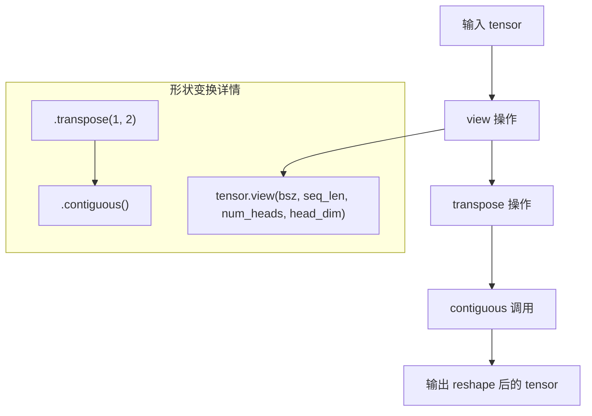

#### 带注释源码

```python
def _shape_v(self, tensor: torch.Tensor, seq_len: int, bsz: int):
    """
    将 Value 张量 reshape 为多头注意力计算的格式
    
    参数:
        tensor: torch.Tensor - 输入张量，通常是经过 v_proj 投影后的张量
        seq_len: int - 序列长度维度
        bsz: int - 批次大小
    
    返回:
        torch.Tensor - 形状为 (bsz, num_heads, seq_len, head_dim) 的连续张量
    """
    # 第一步：使用 view 将张量从 (bsz, seq_len, embed_dim) 变换为 (bsz, seq_len, num_heads, head_dim)
    # 其中 embed_dim = num_heads * head_dim
    # 例如：如果 embed_dim=1024, num_heads=8, head_dim=128
    # 则 tensor 从 (batch_size, seq_len, 1024) 变为 (batch_size, seq_len, 8, 128)
    return tensor.view(bsz, seq_len, self.num_heads, self.head_dim).transpose(1, 2).contiguous()
    #                                                                              |
    #                                                                              └─ transpose(1, 2) 将维度重新排列为 (bsz, num_heads, seq_len, head_dim)
    #                                                                                           |
    #                                                                                           └─ contiguous() 确保张量在内存中是连续的，这对于后续的矩阵乘法操作很重要
```


### `UnimerMBartAttention.forward`

实现多头注意力机制，支持自注意力、交叉注意力，并处理 kv 缓存。核心是通过 q、k、v 投影将输入转换为查询、键、值向量，计算注意力权重后加权求和得到输出。

参数：

- `hidden_states`：`torch.Tensor`，输入隐藏状态，形状为 (batch_size, tgt_len, embed_dim)
- `key_value_states`：`Optional[torch.Tensor]`，用于交叉注意力的键值状态，若为 None 则执行自注意力
- `past_key_value`：`Optional[Tuple[torch.Tensor]]`，缓存的键值状态元组，用于自回归生成加速
- `attention_mask`：`Optional[torch.Tensor]`，注意力掩码，形状为 (batch_size, 1, tgt_len, src_len)
- `layer_head_mask`：`Optional[torch.Tensor]`，用于掩码特定注意力头的掩码
- `output_attentions`：`bool`，是否返回注意力权重

返回值：`Tuple[torch.Tensor, Optional[torch.Tensor], Optional[Tuple[torch.Tensor]]]`，包含注意力输出 (batch_size, tgt_len, embed_dim)、可选的注意力权重 (batch_size, num_heads, tgt_len, src_len)、可选的缓存键值对

#### 流程图

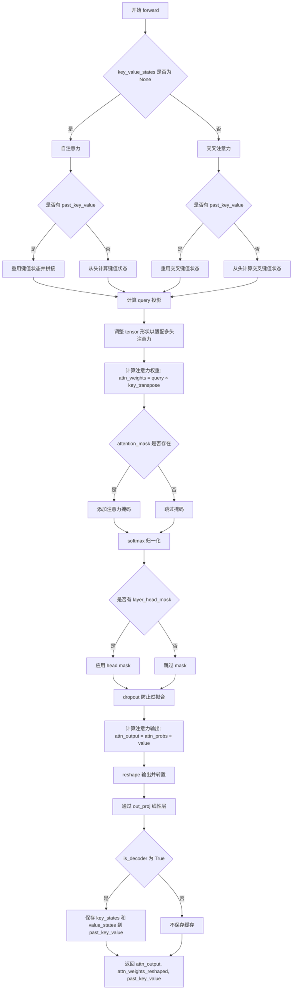

#### 带注释源码

```python
def forward(
    self,
    hidden_states: torch.Tensor,
    key_value_states: Optional[torch.Tensor] = None,
    past_key_value: Optional[Tuple[torch.Tensor]] = None,
    attention_mask: Optional[torch.Tensor] = None,
    layer_head_mask: Optional[torch.Tensor] = None,
    output_attentions: bool = False,
) -> Tuple[torch.Tensor, Optional[torch.Tensor], Optional[Tuple[torch.Tensor]]]:
    """Input shape: Batch x Time x Channel"""

    # 判断是否为交叉注意力：如果提供了 key_value_states，则该层用作解码器的交叉注意力层
    is_cross_attention = key_value_states is not None

    # 获取批次大小、目标序列长度和隐藏维度
    bsz, tgt_len, _ = hidden_states.size()

    # 计算 query 投影并乘以缩放因子
    query_states = self.q_proj(hidden_states) * self.scaling
    
    # 获取 key 和 value 投影
    # past_key_value[0].shape[2] == key_value_states.shape[1] 用于验证 past_key_value 的序列长度
    # 与提供的 key_value_states 支持前缀调优
    if (
        is_cross_attention
        and past_key_value is not None
        and past_key_value[0].shape[2] == key_value_states.shape[1]
    ):
        # 复用交叉注意力的 k、v
        key_states = past_key_value[0]
        value_states = past_key_value[1]
    elif is_cross_attention:
        # 交叉注意力：使用 key_value_states 计算 key 和 value
        key_states = self._shape_qk(self.k_proj(key_value_states), -1, bsz)
        value_states = self._shape_v(self.v_proj(key_value_states), -1, bsz)
    elif past_key_value is not None:
        # 复用自注意力的 k、v，并拼接历史状态
        key_states = self._shape_qk(self.k_proj(hidden_states), -1, bsz)
        value_states = self._shape_v(self.v_proj(hidden_states), -1, bsz)
        key_states = torch.cat([past_key_value[0], key_states], dim=2)
        value_states = torch.cat([past_key_value[1], value_states], dim=2)
    else:
        # 自注意力：从头计算 key 和 value
        key_states = self._shape_qk(self.k_proj(hidden_states), -1, bsz)
        value_states = self._shape_v(self.v_proj(hidden_states), -1, bsz)

    # 如果是解码器，保存键值状态用于缓存
    if self.is_decoder:
        past_key_value = (key_states, value_states)

    # 调整形状以适配多头注意力计算
    proj_shape = (bsz * self.num_heads, -1, self.squeeze_head_dim)
    value_shape = (bsz * self.num_heads, -1, self.head_dim)
    query_states = self._shape_qk(query_states, tgt_len, bsz).view(*proj_shape)
    key_states = key_states.reshape(*proj_shape)
    value_states = value_states.reshape(*value_shape)

    # 计算注意力权重矩阵
    src_len = key_states.size(1)
    attn_weights = torch.bmm(query_states, key_states.transpose(1, 2))

    # 验证注意力权重形状
    if attn_weights.size() != (bsz * self.num_heads, tgt_len, src_len):
        raise ValueError(
            f"Attention weights should be of size {(bsz * self.num_heads, tgt_len, src_len)}, but is"
            f" {attn_weights.size()}"
        )

    # 应用注意力掩码
    if attention_mask is not None:
        if attention_mask.size() != (bsz, 1, tgt_len, src_len):
            raise ValueError(
                f"Attention mask should be of size {(bsz, 1, tgt_len, src_len)}, but is {attention_mask.size()}"
            )
        attn_weights = attn_weights.view(bsz, self.num_heads, tgt_len, src_len) + attention_mask
        attn_weights = attn_weights.view(bsz * self.num_heads, tgt_len, src_len)

    # softmax 归一化
    attn_weights = nn.functional.softmax(attn_weights, dim=-1)

    # 应用层头掩码
    if layer_head_mask is not None:
        if layer_head_mask.size() != (self.num_heads,):
            raise ValueError(
                f"Head mask for a single layer should be of size {(self.num_heads,)}, but is"
                f" {layer_head_mask.size()}"
            )
        attn_weights = layer_head_mask.view(1, -1, 1, 1) * attn_weights.view(bsz, self.num_heads, tgt_len, src_len)
        attn_weights = attn_weights.view(bsz * self.num_heads, tgt_len, src_len)

    # 处理注意力权重的梯度
    if output_attentions:
        attn_weights_reshaped = attn_weights.view(bsz, self.num_heads, tgt_len, src_len)
        attn_weights = attn_weights_reshaped.view(bsz * self.num_heads, tgt_len, src_len)
    else:
        attn_weights_reshaped = None

    # dropout 并计算注意力输出
    attn_probs = nn.functional.dropout(attn_weights, p=self.dropout, training=self.training)
    attn_output = torch.bmm(attn_probs, value_states)

    # 验证输出形状
    if attn_output.size() != (bsz * self.num_heads, tgt_len, self.head_dim):
        raise ValueError(
            f"`attn_output` should be of size {(bsz * self.num_heads, tgt_len, self.head_dim)}, but is"
            f" {attn_output.size()}"
        )

    # 调整输出形状
    attn_output = attn_output.view(bsz, self.num_heads, tgt_len, self.head_dim)
    attn_output = attn_output.transpose(1, 2)
    # 使用配置中的 embed_dim（而非 hidden_state），以支持张量并行
    attn_output = attn_output.reshape(bsz, tgt_len, self.embed_dim)

    # 通过输出投影层
    attn_output = self.out_proj(attn_output)

    return attn_output, attn_weights_reshaped, past_key_value
```


### `UnimerMBartFlashAttention2._shape_qk`

该方法用于将输入的 Q/K 张量重新整形为适合 Flash Attention 计算的维度格式。它将原始张量视图化为 `(batch_size, seq_len, num_heads, squeeze_head_dim)` 的形状，用于后续的注意力计算。

参数：

- `tensor`：`torch.Tensor`，经过 Q/K 投影层后的输入张量，形状为 `(batch_size, seq_len, squeeze_dim)`
- `seq_len`：`int`，序列长度，通常为 -1 表示使用张量的实际长度
- `bsz`：`int`，批量大小

返回值：`torch.Tensor`，重塑后的张量，形状为 `(batch_size, num_heads, seq_len, squeeze_head_dim)`

#### 流程图

```mermaid
flowchart TD
    A[输入 tensor: (bsz, seq_len, squeeze_dim)] --> B[调用 tensor.view 方法]
    B --> C{重塑维度}
    C --> D[输出: (bsz, seq_len, num_heads, squeeze_head_dim)]
    D --> E[转置维度 1 和 2]
    E --> F[输出: (bsz, num_heads, seq_len, squeeze_head_dim)]
    F --> G[连续内存存储 .contiguous]
    G --> H[返回最终形状的张量]
```

#### 带注释源码

```python
def _shape_qk(self, tensor: torch.Tensor, seq_len: int, bsz: int):
    """
    将 Q/K 张量重新整形为 Flash Attention 所需的格式。
    
    Args:
        tensor: 经过 Q/K 投影后的张量，形状为 (batch_size, seq_len, squeeze_dim)
        seq_len: 序列长度，通常传入 -1 表示使用 tensor 的实际第二维长度
        bsz: 批量大小
    
    Returns:
        重塑后的张量，形状为 (batch_size, num_heads, seq_len, squeeze_head_dim)
    """
    return tensor.view(bsz, seq_len, self.num_heads, self.squeeze_head_dim)
```


### `UnimerMBartFlashAttention2._shape_v`

该方法用于将输入的 value 张量重塑为适合多头注意力计算的 4D 张量形状（batch_size, seq_len, num_heads, head_dim），是父类 `UnimerMBartAttention._shape_v` 的重写版本，与父类不同之处在于该方法不执行 transpose 和 contiguous 操作，直接返回 reshape 后的结果，这是为了适配 Flash Attention 的计算需求。

参数：

- `tensor`：`torch.Tensor`，需要被重塑的 value 张量，通常是经过线性投影后的 value 表示
- `seq_len`：`int`，序列长度维度的大小
- `bsz`：`int`，批处理大小（batch size）

返回值：`torch.Tensor`，重塑后的 4D 张量，形状为 (batch_size, seq_len, num_heads, head_dim)

#### 流程图

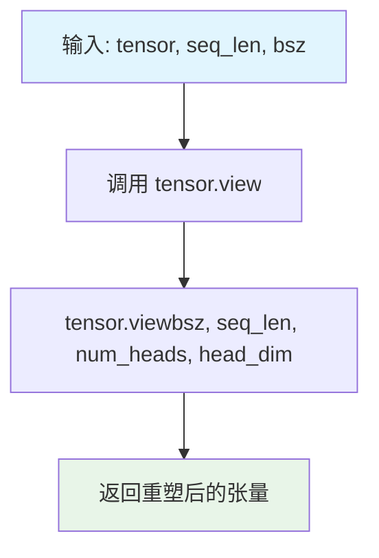

#### 带注释源码

```python
def _shape_v(self, tensor: torch.Tensor, seq_len: int, bsz: int):
    """
    重塑 value 张量以适配多头注意力计算。
    
    与父类 UnimerMBartAttention._shape_v 不同，该方法不执行 transpose 和 contiguous 操作，
    这是因为 Flash Attention 的前向传播实现中已经处理了张量布局，直接返回 view 即可。
    
    参数:
        tensor: 输入的 value 张量，形状为 (batch_size * seq_len, embed_dim) 或类似形式
        seq_len: 序列长度
        bsz: 批处理大小
    
    返回:
        重塑后的 4D 张量，形状为 (batch_size, seq_len, num_heads, head_dim)
    """
    return tensor.view(bsz, seq_len, self.num_heads, self.head_dim)
```


### UnimerMBartFlashAttention2.forward

该方法是 UnimerMBartFlashAttention2 类的核心前向传播函数，继承自 UnimerMBartAttention。它使用 Flash Attention 2 加速机制来计算自注意力或交叉注意力，通过调用 flash_attn_func 或 flash_attn_varlen_func 实现高效的注意力计算，并处理填充标记（padding tokens）以支持变长序列。

参数：

- `hidden_states`：`torch.Tensor`，形状为 (batch_size, seq_len, embed_dim)，输入的隐藏状态
- `key_value_states`：`Optional[torch.Tensor]`，可选的键值状态，用于交叉注意力
- `past_key_value`：`Optional[Tuple[torch.Tensor]]`，可选的过去键值状态，用于缓存和解码
- `attention_mask`：`Optional[torch.Tensor]`，可选的注意力掩码，用于处理填充标记
- `layer_head_mask`：`Optional[torch.Tensor]`，可选的头掩码，用于掩码特定注意力头
- `output_attentions`：`bool`，是否返回注意力权重（Flash Attention 2 不支持此选项）

返回值：`Tuple[torch.Tensor, Optional[torch.Tensor], Optional[Tuple[torch.Tensor]]]`，包含注意力输出、注意力权重（始终为 None）和过去键值

#### 流程图

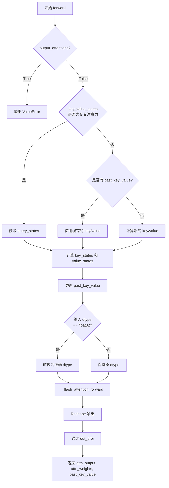

#### 带注释源码

```python
def forward(
    self,
    hidden_states: torch.Tensor,
    key_value_states: Optional[torch.Tensor] = None,
    past_key_value: Optional[Tuple[torch.Tensor]] = None,
    attention_mask: Optional[torch.Tensor] = None,
    layer_head_mask: Optional[torch.Tensor] = None,
    output_attentions: bool = False,
) -> Tuple[torch.Tensor, Optional[torch.Tensor], Optional[Tuple[torch.Tensor]]]:
    # Flash Attention 2 不支持 output_attentions
    if output_attentions:
        raise ValueError("MBartFlashAttention2 attention does not support output_attentions")

    # 判断是否为交叉注意力（解码器使用）
    is_cross_attention = key_value_states is not None

    # 获取批次大小和序列长度
    bsz, q_len, _ = hidden_states.size()

    # 获取查询投影
    query_states = self._shape_qk(self.q_proj(hidden_states), -1, bsz)

    # 获取键值投影
    # 检查 past_key_value 的序列长度是否与 key_value_states 相同，以支持前缀调优
    if (
        is_cross_attention
        and past_key_value is not None
        and past_key_value[0].shape[2] == key_value_states.shape[1]
    ):
        # 复用跨注意力的 k, v
        key_states = past_key_value[0].transpose(1, 2)
        value_states = past_key_value[1].transpose(1, 2)
    elif is_cross_attention:
        # 跨注意力
        key_states = self._shape_qk(self.k_proj(key_value_states), -1, bsz)
        value_states = self._shape_v(self.v_proj(key_value_states), -1, bsz)
    elif past_key_value is not None:
        # 复用自注意力的 k, v
        key_states = self._shape_qk(self.k_proj(hidden_states), -1, bsz)
        value_states = self._shape_v(self.v_proj(hidden_states), -1, bsz)
        # 拼接过去的 key/value 和当前的 key/value
        key_states = torch.cat([past_key_value[0].transpose(1, 2), key_states], dim=1)
        value_states = torch.cat([past_key_value[1].transpose(1, 2), value_states], dim=1)
    else:
        # 自注意力
        key_states = self._shape_qk(self.k_proj(hidden_states), -1, bsz)
        value_states = self._shape_v(self.v_proj(hidden_states), -1, bsz)

    # 如果是解码器，保存 key/value 状态供后续使用
    if self.is_decoder:
        past_key_value = (key_states.transpose(1, 2), value_states.transpose(1, 2))

    # 计算键值序列长度
    kv_seq_len = key_states.shape[-2]
    if past_key_value is not None:
        kv_seq_len += past_key_value[0].shape[-2]

    # 处理输入数据类型转换（PEFT 中常将 LayerNorm 转为 float32）
    input_dtype = query_states.dtype
    if input_dtype == torch.float32:
        if torch.is_autocast_enabled():
            target_dtype = torch.get_autocast_gpu_dtype()
        elif hasattr(self.config, "_pre_quantization_dtype"):
            target_dtype = self.config._pre_quantization_dtype
        else:
            target_dtype = self.q_proj.weight.dtype

        logger.warning_once(
            f"The input hidden states seems to be silently casted in float32, this might be related to"
            f" the fact you have upcasted embedding or layer norm layers in float32. We will cast back the input in"
            f" {target_dtype}."
        )

        # 将查询、键、值转换回目标数据类型
        query_states = query_states.to(target_dtype)
        key_states = key_states.to(target_dtype)
        value_states = value_states.to(target_dtype)

    # 调用 Flash Attention 前向方法
    attn_output = self._flash_attention_forward(
        query_states, key_states, value_states, attention_mask, q_len, dropout=self.dropout
    )

    # 重塑输出并通过输出投影层
    attn_output = attn_output.reshape(bsz, q_len, -1)
    attn_output = self.out_proj(attn_output)

    # Flash Attention 2 不返回注意力权重
    if not output_attentions:
        attn_weights = None

    return attn_output, attn_weights, past_key_value
```


### `UnimerMBartFlashAttention2._flash_attention_forward`

该方法是 Flash Attention 2 的核心前向传播实现，负责调用 Flash Attention API 进行高效注意力计算。当输入序列包含 padding token 时，先对输入进行 unpadding 处理以移除 padding，然后计算注意力分数并对结果进行 padding 还原；当输入不含 padding 时，直接调用标准 Flash Attention 函数。同时处理了不同版本 Flash Attention 的因果掩码兼容性问题和自动类型转换。

#### 参数

- `self`：类的实例引用
- `query_states`：`torch.Tensor`，输入查询向量，用于计算注意力分数
- `key_states`：`torch.Tensor`，输入键向量，与查询向量计算注意力权重
- `value_states`：`torch.Tensor`，输入值向量，用于加权求和得到输出
- `attention_mask`：`torch.Tensor`，注意力掩码，0 表示 padding 位置，1 表示有效位置
- `query_length`：`int`，查询序列的长度
- `dropout`：`float`，注意力机制的 dropout 概率，默认为 0.0
- `softmax_scale`：`float`，可选参数，softmax 前的缩放因子，默认为 1/sqrt(head_dim)

#### 返回值

`torch.Tensor`，经过 Flash Attention 计算后的输出张量

#### 流程图

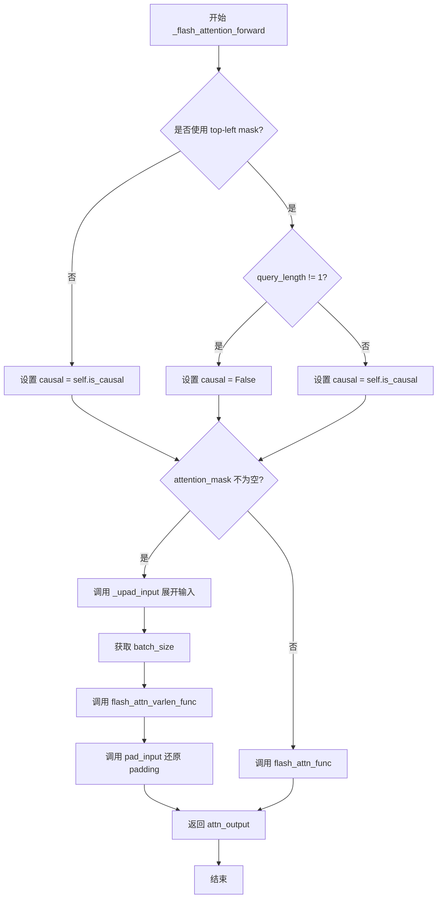

#### 带注释源码

```python
def _flash_attention_forward(
    self, query_states, key_states, value_states, attention_mask, query_length, dropout=0.0, softmax_scale=None
):
    """
    调用 Flash Attention 的前向方法 - 如果输入隐藏状态包含至少一个 padding token，
    首先对输入进行 unpadding，然后计算注意力分数并对最终的注意力分数进行 padding 还原。

    Args:
        query_states (torch.Tensor): 要传递给 Flash Attention API 的输入查询状态
        key_states (torch.Tensor): 要传递给 Flash Attention API 的输入键状态
        value_states (torch.Tensor): 要传递给 Flash Attention API 的输入值状态
        attention_mask (torch.Tensor): 填充掩码 - 对应大小为 (batch_size, seq_len) 的张量，
            其中 0 表示填充 token 的位置，1 表示非填充 token 的位置
        dropout (float): 注意力 dropout
        softmax_scale (float, optional): softmax 前对 QK^T 的缩放因子，默认为 1 / sqrt(head_dim)
    """
    # 确定因果掩码的使用方式
    if not self._flash_attn_uses_top_left_mask:
        # Flash Attention >= 2.1 使用 bottom-right 对齐
        causal = self.is_causal
    else:
        # Flash Attention < 2.1 使用 top-left 对齐，需要特殊处理
        # 只有当 query_length != 1 时才使用因果掩码，避免错误的掩码生成
        causal = self.is_causal and query_length != 1

    # 判断序列中是否包含至少一个填充 token
    if attention_mask is not None:
        batch_size = query_states.shape[0]

        # 对输入进行 unpadding 处理：移除 padding token，获取有效数据的索引和序列长度信息
        query_states, key_states, value_states, indices_q, cu_seq_lens, max_seq_lens = self._upad_input(
            query_states, key_states, value_states, attention_mask, query_length
        )

        # 提取序列长度信息用于调用 flash_attn_varlen_func
        cu_seqlens_q, cu_seqlens_k = cu_seq_lens
        max_seqlen_in_batch_q, max_seqlen_in_batch_k = max_seq_lens

        # 调用变长序列的 Flash Attention 函数，处理包含 padding 的输入
        attn_output_unpad = flash_attn_varlen_func(
            query_states,
            key_states,
            value_states,
            cu_seqlens_q=cu_seqlens_q,
            cu_seqlens_k=cu_seqlens_k,
            max_seqlen_q=max_seqlen_in_batch_q,
            max_seqlen_k=max_seqlen_in_batch_k,
            dropout_p=dropout,
            softmax_scale=softmax_scale,
            causal=causal,
        )

        # 将 unpadding 后的输出重新 pad 还原为原始序列长度
        attn_output = pad_input(attn_output_unpad, indices_q, batch_size, query_length)
    else:
        # 输入不包含 padding，直接调用标准 Flash Attention 函数
        attn_output = flash_attn_func(
            query_states, key_states, value_states, dropout, softmax_scale=softmax_scale, causal=causal
        )

    return attn_output
```


### UnimerMBartFlashAttention2._upad_input

该方法用于在Flash Attention计算前对包含填充标记的输入进行"解填充"（unpad）处理。它从注意力掩码中提取序列长度信息，并将查询、键、值张量重新索引为不包含填充标记的紧凑形式，以便Flash Attention API能够高效处理变长序列。

参数：

- `query_layer`：`torch.Tensor`，查询层张量，形状为 `(batch_size, query_length, num_heads, head_dim)`
- `key_layer`：`torch.Tensor`，键层张量，形状为 `(batch_size, kv_seq_len, num_key_value_heads, head_dim)`
- `value_layer`：`torch.Tensor`，值层张量，形状为 `(batch_size, kv_seq_len, num_key_value_heads, head_dim)`
- `attention_mask`：`torch.Tensor`，注意力掩码张量，形状为 `(batch_size, seq_len)`，其中0表示填充位置，1表示有效位置
- `query_length`：`int`，查询序列的长度

返回值：`Tuple`，包含以下七个元素：

- `query_layer`：解填充后的查询层张量
- `key_layer`：解填充后的键层张量
- `value_layer`：解填充后的值层张量
- `indices_q`：`torch.Tensor`，查询位置的索引
- `(cu_seqlens_q, cu_seqlens_k)`：`Tuple[torch.Tensor, torch.Tensor]`，查询和键值的累积序列长度
- `(max_seqlen_in_batch_q, max_seqlen_in_batch_k)`：`Tuple[int, int]`，批次中查询和键值的最大序列长度

#### 流程图

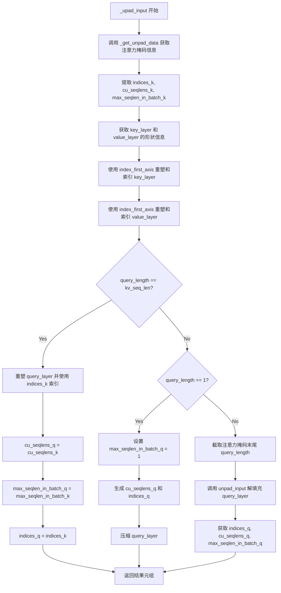

#### 带注释源码

```python
def _upad_input(self, query_layer, key_layer, value_layer, attention_mask, query_length):
    """
    在Flash Attention计算前对输入进行解填充处理。
    当输入包含填充标记时，需要将张量压缩为仅包含有效标记的紧凑形式。

    参数:
        query_layer: 查询层张量 (batch_size, query_length, num_heads, head_dim)
        key_layer: 键层张量 (batch_size, kv_seq_len, num_key_value_heads, head_dim)
        value_layer: 值层张量 (batch_size, kv_seq_len, num_key_value_heads, head_dim)
        attention_mask: 注意力掩码 (batch_size, seq_len)，0为填充，1为有效
        query_length: 查询序列长度

    返回:
        包含解填充后的张量及相关信息的元组
    """
    # 从注意力掩码中提取序列长度信息
    # indices_k: 非填充位置的索引
    # cu_seqlens_k: 累积序列长度（用于Flash Attention变长API）
    # max_seqlen_in_batch_k: 批次中最大序列长度
    indices_k, cu_seqlens_k, max_seqlen_in_batch_k = _get_unpad_data(attention_mask)
    
    # 获取键值层的形状信息
    batch_size, kv_seq_len, num_key_value_heads, head_dim = key_layer.shape

    # 对key_layer进行重塑和索引：
    # 1. 将 (batch_size, kv_seq_len, num_key_value_heads, head_dim) 
    #    重塑为 (batch_size * kv_seq_len, num_key_value_heads, head_dim)
    # 2. 使用indices_k索引，移除填充位置
    key_layer = index_first_axis(
        key_layer.reshape(batch_size * kv_seq_len, num_key_value_heads, head_dim), indices_k
    )
    
    # 对value_layer进行相同的重塑和索引操作
    value_layer = index_first_axis(
        value_layer.reshape(batch_size * kv_seq_len, num_key_value_heads, head_dim), indices_k
    )

    # 根据query_length与kv_seq_len的关系分三种情况处理query_layer
    if query_length == kv_seq_len:
        # 情况1：查询长度等于键值长度（常见情况）
        # 使用与key相同的索引方式处理query
        query_layer = index_first_axis(
            query_layer.reshape(batch_size * kv_seq_len, self.num_heads, head_dim), indices_k
        )
        # 序列长度信息与key相同
        cu_seqlens_q = cu_seqlens_k
        max_seqlen_in_batch_q = max_seqlen_in_batch_k
        indices_q = indices_k
        
    elif query_length == 1:
        # 情况2：查询长度为1（解码器自回归生成时的单步查询）
        max_seqlen_in_batch_q = 1
        # 为每个样本生成累积序列长度 [0, 1, 2, ..., batch_size]
        cu_seqlens_q = torch.arange(
            batch_size + 1, dtype=torch.int32, device=query_layer.device
        )  # There is a memcpy here, that is very bad.
        # 索引为 cu_seqlens_q[:-1] 即 [0, 1, 2, ..., batch_size-1]
        indices_q = cu_seqlens_q[:-1]
        # 移除中间维度（因为query_length=1）
        query_layer = query_layer.squeeze(1)
        
    else:
        # 情况3：查询长度小于键值长度（可能存在填充差异）
        # 假设左侧填充，截取注意力掩码的右侧query_length部分
        attention_mask = attention_mask[:, -query_length:]
        # 使用unpad_input函数解填充query_layer
        query_layer, indices_q, cu_seqlens_q, max_seqlen_in_batch_q = unpad_input(
            query_layer, attention_mask
        )

    # 返回解填充后的所有张量及辅助信息
    # 供flash_attn_varlen_func使用
    return (
        query_layer,          # 解填充后的查询层
        key_layer,            # 解填充后的键层
        value_layer,          # 解填充后的值层
        indices_q,            # 查询位置索引
        (cu_seqlens_q, cu_seqlens_k),  # 累积序列长度元组
        (max_seqlen_in_batch_q, max_seqlen_in_batch_k),  # 最大序列长度元组
    )
```


### `UnimerMBartSdpaAttention.forward`

该方法是 `UnimerMBartSdpaAttention` 类的前向传播函数，继承自 `UnimerMBartAttention`，实现了基于 PyTorch SDPA（Scaled Dot Product Attention）的高效注意力机制。该方法通过 `torch.nn.functional.scaled_dot_product_attention` 执行自注意力或交叉注意力计算，支持 KV 缓存以加速解码，并处理因果（causal）掩码。

参数：

- `hidden_states`：`torch.Tensor`，输入的隐藏状态张量，形状为 (batch_size, sequence_length, embed_dim)
- `key_value_states`：`Optional[torch.Tensor] = None`，用于交叉注意力的键值状态，若为 None 则执行自注意力
- `past_key_value`：`Optional[Tuple[torch.Tensor]] = None`，过去缓存的键值对元组，用于解码阶段的 KV 缓存
- `attention_mask`：`Optional[torch.Tensor] = None`，注意力掩码，用于处理填充标记或控制注意力范围
- `layer_head_mask`：`Optional[torch.Tensor] = None`，针对单个注意力层的头掩码，用于丢弃特定头
- `output_attentions`：`bool = False`，是否返回注意力权重（SDPA 不支持，强制回退到手动实现）

返回值：`Tuple[torch.Tensor, Optional[torch.Tensor], Optional[Tuple[torch.Tensor]]]`，包含：
- `attn_output`：注意力输出张量，形状为 (batch_size, sequence_length, embed_dim)
- `attn_weights_reshaped`：始终为 None（SDPA 不返回注意力权重）
- `past_key_value`：更新后的键值对元组，供后续解码使用

#### 流程图

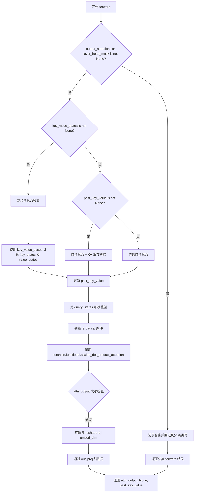

#### 带注释源码

```python
def forward(
    self,
    hidden_states: torch.Tensor,
    key_value_states: Optional[torch.Tensor] = None,
    past_key_value: Optional[Tuple[torch.Tensor]] = None,
    attention_mask: Optional[torch.Tensor] = None,
    layer_head_mask: Optional[torch.Tensor] = None,
    output_attentions: bool = False,
) -> Tuple[torch.Tensor, Optional[torch.Tensor], Optional[Tuple[torch.Tensor]]]:
    """Input shape: Batch x Time x Channel"""
    
    # 如果需要输出注意力权重或使用层头掩码，SDPA 不支持，回退到手动实现
    if output_attentions or layer_head_mask is not None:
        # TODO: Improve this warning with e.g. `model.config._attn_implementation = "manual"` once this is implemented.
        logger.warning(
            "BartModel is using BartSdpaAttention, but `torch.nn.functional.scaled_dot_product_attention` does not support `output_attentions=True` or `layer_head_mask` not None. Falling back to the manual attention"
            ' implementation, but specifying the manual implementation will be required from Transformers version v5.0.0 onwards. This warning can be removed using the argument `attn_implementation="eager"` when loading the model.'
        )
        return super().forward(
            hidden_states,
            key_value_states=key_value_states,
            past_key_value=past_key_value,
            attention_mask=attention_mask,
            layer_head_mask=layer_head_mask,
            output_attentions=output_attentions,
        )

    # 如果提供了 key_value_states，则此层用作解码器的交叉注意力层
    is_cross_attention = key_value_states is not None

    # 获取批量大小、目标长度和隐藏维度
    bsz, tgt_len, _ = hidden_states.size()

    # 获取查询投影 (query projection)，不乘以缩放因子，SDPA 内部处理
    query_states = self.q_proj(hidden_states)
    
    # 获取键值投影 (key/value projection)
    # 检查 past_key_value 的序列长度是否与 key_value_states 相同，以支持前缀调优
    if (
        is_cross_attention
        and past_key_value is not None
        and past_key_value[0].shape[2] == key_value_states.shape[1]
    ):
        # 复用缓存的交叉注意力键值
        key_states = past_key_value[0]
        value_states = past_key_value[1]
    elif is_cross_attention:
        # 交叉注意力：使用 key_value_states 计算键值
        key_states = self._shape_qk(self.k_proj(key_value_states), -1, bsz)
        value_states = self._shape_v(self.v_proj(key_value_states), -1, bsz)
    elif past_key_value is not None:
        # 自注意力 + KV 缓存拼接
        key_states = self._shape_qk(self.k_proj(hidden_states), -1, bsz)
        value_states = self._shape_v(self.v_proj(hidden_states), -1, bsz)
        # 将缓存的键值与新计算的键值拼接
        key_states = torch.cat([past_key_value[0], key_states], dim=2)
        value_states = torch.cat([past_key_value[1], value_states], dim=2)
    else:
        # 普通自注意力
        key_states = self._shape_qk(self.k_proj(hidden_states), -1, bsz)
        value_states = self._shape_v(self.v_proj(hidden_states), -1, bsz)

    # 如果是解码器，保存当前的键值状态用于缓存
    if self.is_decoder:
        past_key_value = (key_states, value_states)

    # 对查询状态进行形状重塑
    query_states = self._shape_qk(query_states, tgt_len, bsz)

    # 确定是否为因果注意力
    # SDPA 需要显式指定 is_causal 参数
    # tgt_len > 1 是为了与 AttentionMaskConverter.to_causal_4d 匹配
    is_causal = True if self.is_causal and attention_mask is None and tgt_len > 1 else False

    # 调用 PyTorch 的 SDPA 注意力函数
    # 支持 Flash Attention 或高效内核后端
    attn_output = torch.nn.functional.scaled_dot_product_attention(
        query_states,
        key_states,
        value_states,
        attn_mask=attention_mask,
        dropout_p=self.dropout if self.training else 0.0,
        is_causal=is_causal,
    )

    # 检查注意力输出形状
    if attn_output.size() != (bsz, self.num_heads, tgt_len, self.head_dim):
        raise ValueError(
            f"`attn_output` should be of size {(bsz, self.num_heads, tgt_len, self.head_dim)}, but is"
            f" {attn_output.size()}"
        )

    # 转置维度：(batch, num_heads, tgt_len, head_dim) -> (batch, tgt_len, num_heads, head_dim)
    attn_output = attn_output.transpose(1, 2)

    # 使用配置中的 embed_dim（而非 hidden_state）进行 reshape，以支持张量并行
    attn_output = attn_output.reshape(bsz, tgt_len, self.embed_dim)

    # 通过输出投影层
    attn_output = self.out_proj(attn_output)

    # SDPA 不返回注意力权重，始终返回 None
    return attn_output, None, past_key_value
```


### UnimerMBartEncoderLayer.forward

该方法是 UnimerMBartEncoderLayer 的前向传播函数，实现了 Transformer 编码器层的核心逻辑：接收隐藏状态，经过自注意力机制、残差连接、前馈神经网络和最终层归一化，输出变换后的隐藏状态 optionally 包含注意力权重。

参数：

- `hidden_states`：`torch.Tensor`，输入到层的形状为 `(batch, seq_len, embed_dim)` 的隐藏状态张量
- `attention_mask`：`torch.Tensor`，大小为 `(batch, 1, tgt_len, src_len)` 的注意力掩码，其中填充元素由非常大的负值表示
- `layer_head_mask`：`torch.Tensor`，给定层中注意力头的掩码，大小为 `(encoder_attention_heads,)`
- `output_attentions`：`bool`，可选参数，是否返回所有注意力层的注意力张量

返回值：`torch.Tensor`，输出元组，包含隐藏状态和可选的注意力权重

#### 流程图

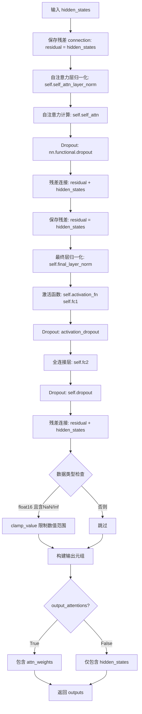

#### 带注释源码

```python
def forward(
    self,
    hidden_states: torch.Tensor,
    attention_mask: torch.Tensor,
    layer_head_mask: torch.Tensor,
    output_attentions: bool = False,
) -> torch.Tensor:
    """
    Args:
        hidden_states (`torch.FloatTensor`): input to the layer of shape `(batch, seq_len, embed_dim)`
        attention_mask (`torch.FloatTensor`): attention mask of size
            `(batch, 1, tgt_len, src_len)` where padding elements are indicated by very large negative values.
        layer_head_mask (`torch.FloatTensor`): mask for attention heads in a given layer of size
            `(encoder_attention_heads,)`.
        output_attentions (`bool`, *optional*):
            Whether or not to return the attentions tensors of all attention layers. See `attentions` under
            returned tensors for more detail.
    """
    # ===== 第一部分：自注意力块 (Self-Attention Block) =====
    # 保存原始 hidden_states 用于残差连接
    residual = hidden_states
    
    # 对输入进行 LayerNorm
    hidden_states = self.self_attn_layer_norm(hidden_states)
    
    # 执行自注意力计算，返回 (attn_output, attn_weights, past_key_value)
    hidden_states, attn_weights, _ = self.self_attn(
        hidden_states=hidden_states,
        attention_mask=attention_mask,
        layer_head_mask=layer_head_mask,
        output_attentions=output_attentions,
    )
    
    # 应用 Dropout
    hidden_states = nn.functional.dropout(hidden_states, p=self.dropout, training=self.training)
    
    # 残差连接 (Residual Connection)
    hidden_states = residual + hidden_states

    # ===== 第二部分：前馈神经网络块 (Feed-Forward Block) =====
    # 保存 hidden_states 用于第二个残差连接
    residual = hidden_states
    
    # 最终层归一化
    hidden_states = self.final_layer_norm(hidden_states)
    
    # 第一个全连接层：扩展维度 (embed_dim -> encoder_ffn_dim)
    hidden_states = self.activation_fn(self.fc1(hidden_states))
    
    # 激活函数后的 Dropout
    hidden_states = nn.functional.dropout(hidden_states, p=self.activation_dropout, training=self.training)
    
    # 第二个全连接层：压缩维度 (encoder_ffn_dim -> embed_dim)
    hidden_states = self.fc2(hidden_states)
    
    # 全连接层后的 Dropout
    hidden_states = nn.functional.dropout(hidden_states, p=self.dropout, training=self.training)
    
    # 第二个残差连接
    hidden_states = residual + hidden_states

    # ===== 数值稳定性检查 =====
    # 检查 hidden_states 是否为 float16 且包含无穷大或 NaN 值
    if hidden_states.dtype == torch.float16 and (
        torch.isinf(hidden_states).any() or torch.isnan(hidden_states).any()
    ):
        # 如果是，则进行数值截断以避免数值溢出
        clamp_value = torch.finfo(hidden_states.dtype).max - 1000
        hidden_states = torch.clamp(hidden_states, min=-clamp_value, max=clamp_value)

    # ===== 构建输出 =====
    outputs = (hidden_states,)

    # 如果需要输出注意力权重，则添加到输出元组中
    if output_attentions:
        outputs += (attn_weights,)

    return outputs
```


### UnimerMBartDecoderLayer.forward

该方法是UnimerMBartDecoderLayer类的前向传播函数，实现了MBART解码器单层的前向计算，包括自注意力机制、跨注意力机制（编码器-解码器注意力）和前馈神经网络三个核心步骤，是Transformer解码器层的基础构建块。

参数：

- `hidden_states`：`torch.Tensor`，输入到该层的隐藏状态，形状为`(batch, seq_len, embed_dim)`
- `attention_mask`：`Optional[torch.Tensor]`，注意力掩码，形状为`(batch, 1, tgt_len, src_len)`，填充元素用非常大的负值表示
- `encoder_hidden_states`：`Optional[torch.Tensor]`，跨注意力输入，形状为`(batch, seq_len, embed_dim)`
- `encoder_attention_mask`：`Optional[torch.Tensor]`，编码器注意力掩码，形状为`(batch, 1, tgt_len, src_len)`
- `layer_head_mask`：`Optional[torch.Tensor]`，给定层中注意力头的掩码，形状为`(encoder_attention_heads,)`
- `cross_attn_layer_head_mask`：`Optional[torch.Tensor]`，给定层中跨注意力头的掩码，形状为`(decoder_attention_heads,)`
- `past_key_value`：`Optional[Tuple[torch.Tensor]]`，缓存的过去键值投影状态
- `output_attentions`：`Optional[bool] = False`，是否返回所有注意力层的注意力张量
- `use_cache`：`Optional[bool] = True`，是否使用缓存以加速解码

返回值：`torch.Tensor`，包含隐藏状态的可选注意力元组

#### 流程图

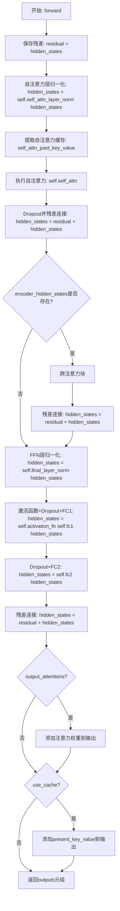

#### 带注释源码

```python
def forward(
    self,
    hidden_states: torch.Tensor,
    attention_mask: Optional[torch.Tensor] = None,
    encoder_hidden_states: Optional[torch.Tensor] = None,
    encoder_attention_mask: Optional[torch.Tensor] = None,
    layer_head_mask: Optional[torch.Tensor] = None,
    cross_attn_layer_head_mask: Optional[torch.Tensor] = None,
    past_key_value: Optional[Tuple[torch.Tensor]] = None,
    output_attentions: Optional[bool] = False,
    use_cache: Optional[bool] = True,
) -> torch.Tensor:
    """
    Args:
        hidden_states (`torch.FloatTensor`): 输入到该层的隐藏状态，形状为`(batch, seq_len, embed_dim)`
        attention_mask (`torch.FloatTensor`): 注意力掩码，形状为`(batch, 1, tgt_len, src_len)`，填充元素用非常大的负值表示
        encoder_hidden_states (`torch.FloatTensor`): 跨注意力输入，来自编码器的隐藏状态，形状为`(batch, seq_len, embed_dim)`
        encoder_attention_mask (`torch.FloatTensor`): 编码器注意力掩码，形状为`(batch, 1, tgt_len, src_len)`
        layer_head_mask (`torch.FloatTensor`): 给定层中注意力头的掩码，形状为`(encoder_attention_heads,)`
        cross_attn_layer_head_mask (`torch.FloatTensor`): 给定层中跨注意力头的掩码，形状为`(decoder_attention_heads,)`
        past_key_value (`Tuple(torch.FloatTensor)`): 缓存的过去键值投影状态
        output_attentions (`bool`, *optional*): 是否返回所有注意力层的注意力张量
    """
    # -------- 第一部分：自注意力机制 --------
    # 保存残差连接用的原始隐藏状态
    residual = hidden_states
    
    # 对输入进行层归一化
    hidden_states = self.self_attn_layer_norm(hidden_states)

    # 解码器单向自注意力的缓存键值元组位于位置1,2
    # 从past_key_value中提取前两个元素作为自注意力的过去键值
    self_attn_past_key_value = past_key_value[:2] if past_key_value is not None else None
    
    # 执行自注意力计算，返回：隐藏状态、自注意力权重、当前键值元组
    hidden_states, self_attn_weights, present_key_value = self.self_attn(
        hidden_states=hidden_states,
        past_key_value=self_attn_past_key_value,
        attention_mask=attention_mask,
        layer_head_mask=layer_head_mask,
        output_attentions=output_attentions,
    )
    
    # 应用Dropout并进行残差连接
    hidden_states = nn.functional.dropout(hidden_states, p=self.dropout, training=self.training)
    hidden_states = residual + hidden_states

    # -------- 第二部分：跨注意力机制（编码器-解码器注意力）--------
    cross_attn_present_key_value = None
    cross_attn_weights = None
    
    # 如果提供了编码器隐藏状态，则执行跨注意力块
    if encoder_hidden_states is not None:
        # 保存残差连接
        residual = hidden_states
        
        # 对隐藏状态进行层归一化
        hidden_states = self.encoder_attn_layer_norm(hidden_states)

        # 跨注意力的缓存键值元组位于位置3,4
        cross_attn_past_key_value = past_key_value[-2:] if past_key_value is not None else None
        
        # 执行跨注意力计算
        hidden_states, cross_attn_weights, cross_attn_present_key_value = self.encoder_attn(
            hidden_states=hidden_states,
            key_value_states=encoder_hidden_states,
            attention_mask=encoder_attention_mask,
            layer_head_mask=cross_attn_layer_head_mask,
            past_key_value=cross_attn_past_key_value,
            output_attentions=output_attentions,
        )
        
        # 应用Dropout并进行残差连接
        hidden_states = nn.functional.dropout(hidden_states, p=self.dropout, training=self.training)
        hidden_states = residual + hidden_states

        # 将跨注意力键值添加到present_key_value元组的位置3,4
        present_key_value = present_key_value + cross_attn_present_key_value

    # -------- 第三部分：前馈神经网络（全连接层）--------
    # 保存残差连接
    residual = hidden_states
    
    # 最终层归一化
    hidden_states = self.final_layer_norm(hidden_states)
    
    # 激活函数 + 第一个线性变换 + Dropout
    hidden_states = self.activation_fn(self.fc1(hidden_states))
    hidden_states = nn.functional.dropout(hidden_states, p=self.activation_dropout, training=self.training)
    
    # 第二个线性变换 + Dropout
    hidden_states = self.fc2(hidden_states)
    hidden_states = nn.functional.dropout(hidden_states, p=self.dropout, training=self.training)
    
    # 残差连接
    hidden_states = residual + hidden_states

    # -------- 输出处理 --------
    outputs = (hidden_states,)

    # 如果需要输出注意力权重
    if output_attentions:
        outputs += (self_attn_weights, cross_attn_weights)

    # 如果使用缓存，则添加present_key_value
    if use_cache:
        outputs += (present_key_value,)

    return outputs
```


### `UnimerMBartClassificationHead.forward`

该方法是 UnimerMBartClassificationHead 类的正向传播函数，负责对句子级分类任务进行特征转换和 logits 计算。输入的隐藏状态经过 Dropout、Dense 线性层、Tanh 激活后，通过输出投影层得到分类 logits。

参数：

- `hidden_states`：`torch.Tensor`，输入的隐藏状态张量，通常来自模型的最后一层隐藏状态，形状为 `(batch_size, hidden_dim)`

返回值：`torch.Tensor`，分类 logits，形状为 `(batch_size, num_classes)`

#### 流程图

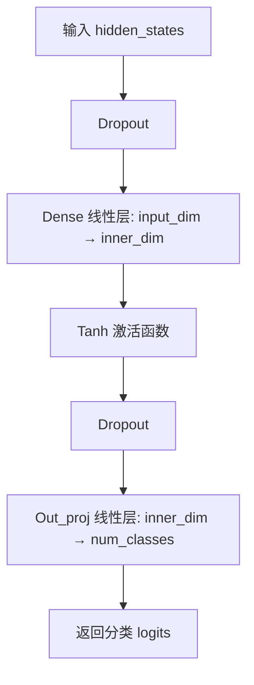

#### 带注释源码

```python
def forward(self, hidden_states: torch.Tensor) -> torch.Tensor:
    """
    正向传播函数，对隐藏状态进行分类转换
    
    Args:
        hidden_states: 输入的隐藏状态张量
        
    Returns:
        分类 logits 张量
    """
    # 第一次 Dropout，防止过拟合
    hidden_states = self.dropout(hidden_states)
    
    # 线性变换：将输入维度映射到内部维度
    hidden_states = self.dense(hidden_states)
    
    # Tanh 激活函数，增加非线性
    hidden_states = torch.tanh(hidden_states)
    
    # 第二次 Dropout
    hidden_states = self.dropout(hidden_states)
    
    # 输出投影：将内部维度映射到类别数，得到分类 logits
    hidden_states = self.out_proj(hidden_states)
    
    return hidden_states
```


### `UnimerMBartPreTrainedModel._init_weights`

该方法是 PyTorch 模块的权重初始化函数，用于在模型创建时初始化神经网络层的参数。它根据模块类型（线性层或嵌入层）采用正态分布初始化权重，并根据配置参数 `init_std` 设置标准差，对于偏置项则初始化为零，对于嵌入层还会将填充索引对应的权重向量置零。

参数：

- `module`：`torch.nn.Module`，需要进行权重初始化的 PyTorch 模块，可以是线性层（nn.Linear）或嵌入层（nn.Embedding）

返回值：`None`，无返回值（该方法直接修改传入模块的权重参数）

#### 流程图

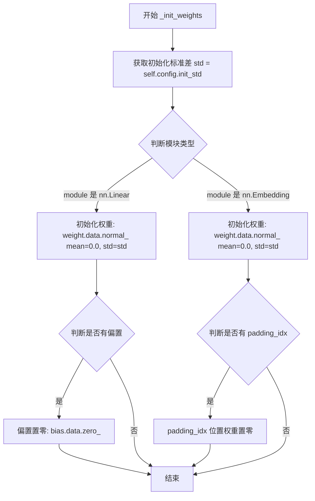

#### 带注释源码

```python
def _init_weights(self, module):
    """
    初始化模型权重。

    该方法在模型首次创建时自动调用，用于对模型中的各个模块进行权重初始化。
    根据模块类型采用不同的初始化策略：
    - nn.Linear: 使用正态分布初始化权重，偏置置零
    - nn.Embedding: 使用正态分布初始化权重，padding_idx 对应位置置零

    Args:
        module (torch.nn.Module): 需要初始化的 PyTorch 模块。
            支持的模块类型:
            - nn.Linear: 线性变换层
            - nn.Embedding: 词嵌入层
    """
    # 从配置中获取初始化标准差
    std = self.config.init_std
    
    # 判断模块是否为线性层 (nn.Linear)
    if isinstance(module, nn.Linear):
        # 使用正态分布初始化权重，均值为0，标准差为配置中的 init_std
        module.weight.data.normal_(mean=0.0, std=std)
        
        # 如果线性层有偏置项，将其初始化为零
        if module.bias is not None:
            module.bias.data.zero_()
    
    # 判断模块是否为嵌入层 (nn.Embedding)
    elif isinstance(module, nn.Embedding):
        # 使用正态分布初始化嵌入权重矩阵
        module.weight.data.normal_(mean=0.0, std=std)
        
        # 如果指定了 padding_idx，将填充 token 对应的嵌入向量置零
        if module.padding_idx is not None:
            module.weight.data[module.padding_idx].zero_()
```


### `UnimerMBartPreTrainedModel.dummy_inputs`

该属性用于生成模型推理所需的虚拟输入，通常在模型导出、trace或获取模型结构信息时使用。它根据配置中的 `pad_token_id` 构造一个包含 `input_ids` 和 `attention_mask` 的字典，用于模拟真实的输入数据。

参数：无

返回值：`Dict[str, torch.Tensor]`，返回一个包含 `attention_mask` 和 `input_ids` 两个键的字典，分别表示注意力掩码和输入ID，用于模型的前向传播或导出。

#### 流程图

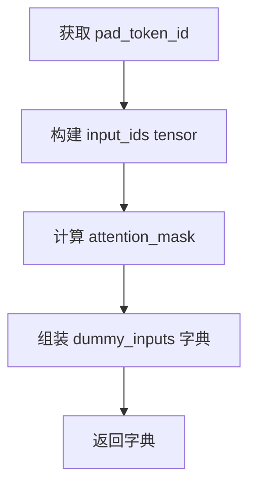

#### 带注释源码

```python
@property
def dummy_inputs(self):
    """
    生成用于模型导出的虚拟输入数据。
    这些虚拟输入通常用于模型的trace、shape inference或保存时获取模型结构信息。
    """
    # 从模型配置中获取padding token的ID
    pad_token = self.config.pad_token_id
    
    # 构造一个示例输入tensor，形状为 [batch_size=2, seq_len=5]
    # 第一行: [0, 6, 10, 4, 2]
    # 第二行: [0, 8, 12, 2, pad_token]
    input_ids = torch.tensor([[0, 6, 10, 4, 2], [0, 8, 12, 2, pad_token]], device=self.device)
    
    # 通过比较input_ids与pad_token是否不相等来生成attention_mask
    # 不相等的位置为True（1），相等的位置为False（0）
    dummy_inputs = {
        "attention_mask": input_ids.ne(pad_token),
        "input_ids": input_ids,
    }
    
    # 返回包含attention_mask和input_ids的字典
    return dummy_inputs
```


### `UnimerMBartEncoder._backward_compatibility_gradient_checkpointing`

该方法是一个向后兼容性方法，用于处理从旧版本模型配置中迁移的梯度检查点设置。如果模型配置中启用了梯度检查点功能（`gradient_checkpointing=True`），则自动调用 `gradient_checkpointing_enable()` 方法来启用该功能，避免因配置遗留导致的兼容性问题。

参数：

- 无显式参数（仅包含隐式 `self` 参数）

返回值：`None`，无返回值

#### 流程图

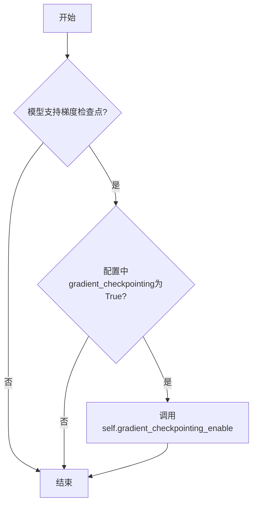

#### 带注释源码

```python
def _backward_compatibility_gradient_checkpointing(self):
    # 覆盖此方法以避免从配置中删除属性
    # 如果模型支持梯度检查点且配置中启用了梯度_checkpoin_ting，则启用梯度检查点
    if self.supports_gradient_checkpointing and getattr(self.config, "gradient_checkpointing", False):
        self.gradient_checkpointing_enable()
```


### UnimerMBartEncoder.forward

该方法是UnimerMBartEncoder的前向传播函数，负责将输入的token ID或嵌入向量通过多层Transformer编码器层进行处理，输出编码后的隐藏状态序列。

参数：

- `input_ids`：`torch.LongTensor`，输入序列的token索引，形状为`(batch_size, sequence_length)`
- `attention_mask`：`Optional[torch.Tensor]`，注意力掩码，用于遮盖padding token，形状为`(batch_size, sequence_length)`
- `head_mask`：`Optional[torch.Tensor]`，用于遮盖特定的注意力头，形状为`(encoder_layers, encoder_attention_heads)`
- `inputs_embeds`：`Optional[torch.FloatTensor]`，可选的嵌入表示，直接传入而非input_ids，形状为`(batch_size, sequence_length, hidden_size)`
- `output_attentions`：`Optional[bool]`，是否返回所有层的注意力权重
- `output_hidden_states`：`Optional[bool]`，是否返回所有层的隐藏状态
- `return_dict`：`Optional[bool]`，是否返回`BaseModelOutput`字典格式

返回值：`Union[Tuple, BaseModelOutput]`，返回编码器输出，包括最后的隐藏状态、可选的隐藏状态序列和注意力权重序列

#### 流程图

```mermaid
flowchart TD
    A[开始 forward] --> B{检查 input_ids 和 inputs_embeds}
    B -->|同时指定| B1[抛出 ValueError]
    B -->|指定 input_ids| B2[获取 input 并展开]
    B -->|指定 inputs_embeds| B3[获取最后一位]
    B -->|都未指定| B4[抛出 ValueError]
    
    B2 --> C[通过 embed_tokens 转换为嵌入向量]
    B3 --> C
    
    C --> D[获取位置编码 embed_positions]
    E[inputs_embeds + embed_pos] --> F[LayerNorm 归一化]
    F --> G[Dropout 正则化]
    
    G --> H{attention_mask 是否存在}
    H -->|是| I[根据注意力实现类型准备掩码]
    H -->|否| J[设为 None]
    I --> K
    J --> K
    
    K[初始化 encoder_states 和 all_attentions] --> L[遍历编码器层]
    
    L --> M{当前层是否被 drop}
    M -->|是| M1[layer_outputs = (None, None)]
    M -->|否| N{是否使用梯度检查点}
    
    N -->|是| O[使用 gradient_checkpointing_func]
    N -->|否| P[直接调用 encoder_layer]
    
    O --> Q[获取 layer_outputs[0] 作为新的 hidden_states]
    P --> Q
    
    Q --> R{是否记录隐藏状态}
    R -->|是| R1[添加到 encoder_states]
    R -->|否| S
    
    S{是否记录注意力}
    S -->|是| S1[添加到 all_attentions]
    S -->|否| L
    
    L --> T[所有层处理完毕]
    T --> U[最终 LayerNorm]
    U --> V{return_dict}
    V -->|是| W[返回 BaseModelOutput]
    V -->|否| X[返回元组]
```

#### 带注释源码

```python
def forward(
    self,
    input_ids: torch.LongTensor = None,
    attention_mask: Optional[torch.Tensor] = None,
    head_mask: Optional[torch.Tensor] = None,
    inputs_embeds: Optional[torch.FloatTensor] = None,
    output_attentions: Optional[bool] = None,
    output_hidden_states: Optional[bool] = None,
    return_dict: Optional[bool] = None,
) -> Union[Tuple, BaseModelOutput]:
    r"""
    Args:
        input_ids (`torch.LongTensor` of shape `(batch_size, sequence_length)`):
            Indices of input sequence tokens in the vocabulary. Padding will be ignored by default should you
            provide it.

            Indices can be obtained using [`AutoTokenizer`]. See [`PreTrainedTokenizer.encode`] and
            [`PreTrainedTokenizer.__call__`] for details.

            [What are input IDs?](../glossary#input-ids)
        attention_mask (`torch.Tensor` of shape `(batch_size, sequence_length)`, *optional*):
            Mask to avoid performing attention on padding token indices. Mask values selected in `[0, 1]`:

            - 1 for tokens that are **not masked**,
            - 0 for tokens that are **masked**.

            [What are attention masks?](../glossary#attention-mask)
        head_mask (`torch.Tensor` of shape `(encoder_layers, encoder_attention_heads)`, *optional*):
            Mask to nullify selected heads of the attention modules. Mask values selected in `[0, 1]`:

            - 1 indicates the head is **not masked**,
            - 0 indicates the head is **masked**.

        inputs_embeds (`torch.FloatTensor` of shape `(batch_size, sequence_length, hidden_size)`, *optional*):
            Optionally, instead of passing `input_ids` you can choose to directly pass an embedded representation.
            This is useful if you want more control over how to convert `input_ids` indices into associated vectors
            than the model's internal embedding lookup matrix.
        output_attentions (`bool`, *optional*):
            Whether or not to return the attentions tensors of all attention layers. See `attentions` under
            returned tensors for more detail.
        output_hidden_states (`bool`, *optional*):
            Whether or not to return the hidden states of all layers. See `hidden_states` under returned tensors
            for more detail.
        return_dict (`bool`, *optional*):
            Whether or not to return a [`~utils.ModelOutput`] instead of a plain tuple.
    """
    # 从配置中获取默认值
    output_attentions = output_attentions if output_attentions is not None else self.config.output_attentions
    output_hidden_states = (
        output_hidden_states if output_hidden_states is not None else self.config.output_hidden_states
    )
    return_dict = return_dict if return_dict is not None else self.config.use_return_dict

    # 检索 input_ids 和 inputs_embeds
    if input_ids is not None and inputs_embeds is not None:
        # 不能同时指定两者
        raise ValueError("You cannot specify both input_ids and inputs_embeds at the same time")
    elif input_ids is not None:
        # 使用 input_ids，获取原始输入形状
        input = input_ids
        input_shape = input.shape
        # 展平为 2D
        input_ids = input_ids.view(-1, input_shape[-1])
    elif inputs_embeds is not None:
        # 使用 inputs_embeds，获取最后一个维度
        input = inputs_embeds[:, :, -1]
    else:
        raise ValueError("You have to specify either input_ids or inputs_embeds")

    # 如果没有提供 inputs_embeds，则通过 embedding 层获取
    if inputs_embeds is None:
        inputs_embeds = self.embed_tokens(input_ids)

    # 获取位置编码
    embed_pos = self.embed_positions(input)

    # 将 token 嵌入与位置编码相加
    hidden_states = inputs_embeds + embed_pos.to(inputs_embeds.device)
    # 进行 LayerNorm
    hidden_states = self.layernorm_embedding(hidden_states)
    # 应用 Dropout
    hidden_states = nn.functional.dropout(hidden_states, p=self.dropout, training=self.training)

    # 扩展 attention_mask 为 4D
    if attention_mask is not None:
        # [bsz, seq_len] -> [bsz, 1, tgt_seq_len, src_seq_len]
        if self._use_flash_attention_2:
            # Flash Attention 2: 如果有 padding token 则保留，否则设为 None
            attention_mask = attention_mask if 0 in attention_mask else None
        elif self._use_sdpa and head_mask is None and not output_attentions:
            # SDPA: 使用优化的 4D 掩码准备函数
            attention_mask = _prepare_4d_attention_mask_for_sdpa(attention_mask, inputs_embeds.dtype)
        else:
            # 标准的 4D 掩码准备
            attention_mask = _prepare_4d_attention_mask(attention_mask, inputs_embeds.dtype)

    # 初始化输出容器
    encoder_states = () if output_hidden_states else None
    all_attentions = () if output_attentions else None

    # 检查 head_mask 的层数是否正确
    if head_mask is not None:
        if head_mask.size()[0] != len(self.layers):
            raise ValueError(
                f"The head_mask should be specified for {len(self.layers)} layers, but it is for"
                f" {head_mask.size()[0]}."
            )

    # 遍历所有编码器层
    for idx, encoder_layer in enumerate(self.layers):
        if output_hidden_states:
            # 记录每一层的隐藏状态
            encoder_states = encoder_states + (hidden_states,)

        # LayerDrop: 训练时随机跳过层
        to_drop = False
        if self.training:
            dropout_probability = torch.rand([])
            if dropout_probability < self.layerdrop:  # skip the layer
                to_drop = True

        if to_drop:
            # 跳过该层
            layer_outputs = (None, None)
        else:
            if self.gradient_checkpointing and self.training:
                # 使用梯度检查点节省显存
                layer_outputs = self._gradient_checkpointing_func(
                    encoder_layer.__call__,
                    hidden_states,
                    attention_mask,
                    (head_mask[idx] if head_mask is not None else None),
                    output_attentions,
                )
            else:
                # 正常前向传播
                layer_outputs = encoder_layer(
                    hidden_states,
                    attention_mask,
                    layer_head_mask=(head_mask[idx] if head_mask is not None else None),
                    output_attentions=output_attentions,
                )

        # 更新隐藏状态
        hidden_states = layer_outputs[0]

        # 记录注意力权重
        if output_attentions:
            all_attentions = all_attentions + (layer_outputs[1],)

    # 最终 LayerNorm
    hidden_states = self.layer_norm(hidden_states)

    # 添加最后一层隐藏状态
    if output_hidden_states:
        encoder_states = encoder_states + (hidden_states,)

    # 根据 return_dict 决定返回格式
    if not return_dict:
        return tuple(v for v in [hidden_states, encoder_states, all_attentions] if v is not None)
    return BaseModelOutput(
        last_hidden_state=hidden_states, hidden_states=encoder_states, attentions=all_attentions
    )
```


### `UnimerMBartDecoder.get_input_embeddings`

该方法用于获取解码器的输入嵌入层（embed_tokens），允许外部访问或修改解码器所使用的词嵌入矩阵。

参数：

- 该方法无参数（`self` 为实例引用）

返回值：`nn.Embedding`（具体为 `UnimerMBartScaledWordEmbedding` 类型），返回解码器的词嵌入层对象

#### 流程图

```mermaid
flowchart TD
    A[调用 get_input_embeddings] --> B{self.embed_tokens 是否存在}
    B -->|是| C[返回 self.embed_tokens 嵌入层]
    B -->|否| D[返回 None 或抛出异常]
```

#### 带注释源码

```python
def get_input_embeddings(self):
    """
    获取解码器的输入嵌入层。
    
    该方法返回解码器内部使用的词嵌入矩阵（embed_tokens），
    使得外部可以访问或替换解码器的嵌入层。
    
    Returns:
        nn.Embedding: 解码器的词嵌入层对象（UnimerMBartScaledWordEmbedding实例）
    """
    return self.embed_tokens
```


### UnimerMBartDecoder.set_input_embeddings

该方法用于设置解码器的输入嵌入层（embedding layer）。在Transformer架构中，输入嵌入将 token ID 转换为密集的向量表示，此方法允许在模型构建或微调后动态替换嵌入矩阵。

参数：

-  `value`：`nn.Embedding`，新的嵌入层实例，用于替换解码器现有的 `embed_tokens`

返回值：`None`，该方法直接修改对象状态，无返回值

#### 流程图

```mermaid
flowchart TD
    A[开始] --> B[接收新嵌入层 value]
    --> C{value 是否为 None?}
    -->|否| D[将 value 赋值给 self.embed_tokens]
    --> E[结束]
    -->|是| F[直接赋值 None 或保持原值]
    --> E
```

#### 带注释源码

```python
def set_input_embeddings(self, value):
    """
    设置解码器的输入嵌入层。
    
    此方法允许动态替换解码器的嵌入矩阵。在模型微调、权重加载或
    嵌入维度变更等场景中使用。
    
    Args:
        value (nn.Embedding): 新的嵌入层实例，需与模型配置匹配
    """
    self.embed_tokens = value
```


### UnimerMBartDecoder.forward

该方法是 UnimerMBartDecoder 的核心前向传播方法，负责执行 Transformer 解码器的自回归解码过程。它接收编码器的输出作为交叉注意力输入，通过多个解码器层处理输入序列，应用因果掩码进行自回归生成，并支持 KV 缓存以加速推理。

参数：

- `self`：UnimerMBartDecoder 实例本身
- `input_ids`：`torch.LongTensor`，形状为 `(batch_size, sequence_length)`，解码器输入序列的 token 索引
- `attention_mask`：`Optional[torch.Tensor]`，形状为 `(batch_size, sequence_length)`，避免对填充 token 进行注意力计算
- `count_pred`：`Optional[torch.FloatTensor]`，计数预测结果，用于计算计数上下文权重
- `encoder_hidden_states`：`Optional[torch.FloatTensor]`，形状为 `(batch_size, encoder_sequence_length, hidden_size)`，编码器的最后隐藏状态
- `encoder_attention_mask`：`Optional[torch.LongTensor]`，形状为 `(batch_size, encoder_sequence_length)`，编码器注意力掩码
- `head_mask`：`Optional[torch.Tensor]`，形状为 `(decoder_layers, decoder_attention_heads)`，用于屏蔽解码器注意力头
- `cross_attn_head_mask`：`Optional[torch.Tensor]`，形状为 `(decoder_layers, decoder_attention_heads)`，用于屏蔽交叉注意力头
- `past_key_values`：`Optional[Tuple[Tuple[torch.FloatTensor]]]`，缓存的过去键值对，用于加速自回归解码
- `inputs_embeds`：`Optional[torch.FloatTensor]`，形状为 `(batch_size, sequence_length, hidden_size)`，直接传入的嵌入表示
- `use_cache`：`Optional[bool]`：是否使用 KV 缓存加速解码
- `output_attentions`：`Optional[bool]`：是否返回所有层的注意力权重
- `output_hidden_states`：`Optional[bool]`：是否返回所有层的隐藏状态
- `return_dict`：`Optional[bool]`：是否返回字典格式的输出

返回值：`Union[Tuple, BaseModelOutputWithPastAndCrossAttentions]`，包含最后隐藏状态、过去键值对、隐藏状态序列、自注意力权重和交叉注意力权重

#### 流程图

```mermaid
flowchart TD
    A[开始 forward] --> B{检查 input_ids 和 inputs_embeds}
    B -->|同时指定| B1[抛出 ValueError]
    B -->|只有 input_ids| B2[获取 input 并展开]
    B -->|只有 inputs_embeds| B3[获取 inputs_embeds]
    B -->|都没有| B3error[抛出 ValueError]
    
    B2 --> C[计算 past_key_values_length]
    B3 --> C
    
    C --> D{inputs_embeds 为空?}
    D -->|是| E[通过 embed_tokens 嵌入 input_ids]
    D -->|否| F[使用传入的 inputs_embeds]
    
    E --> G[准备注意力掩码]
    F --> G
    
    G --> H{使用 flash_attention_2?}
    H -->|是| H1[处理 2D 掩码]
    H -->|否| I{使用 sdpa 且无交叉注意力掩码?}
    
    I -->|是| I1[准备 4D 因果掩码 for sdpa]
    I -->|否| I2[准备 4D 因果掩码]
    
    H1 --> J
    I1 --> J
    I2 --> J
    
    J[扩展 encoder_attention_mask] --> K[计算位置嵌入]
    K --> L[将位置嵌入加到 hidden_states]
    
    L --> M{count_pred 不为空?}
    M -->|是| N[计算计数上下文权重并加入]
    M -->|否| O
    
    N --> O[应用 layernorm_embedding 和 dropout]
    O --> P[初始化缓存变量]
    
    P --> Q[遍历所有解码器层]
    Q --> R{当前层是训练模式?}
    R -->|是| S[应用 LayerDrop]
    R -->|否| T[直接获取 past_key_value]
    
    S --> U{被 dropout 跳过?}
    U -->|是| V[设置 layer_outputs 为 None]
    U -->|否| W{使用 gradient_checkpointing?}
    
    W -->|是| X[使用梯度检查点调用]
    W -->|否| Y[直接调用 decoder_layer]
    
    V --> Z
    X --> Z
    Y --> Z
    
    Z[更新 hidden_states] --> AA{使用 cache?}
    AA -->|是| AB[更新 next_decoder_cache]
    AA -->|否| AC
    
    AB --> AC{output_attentions?}
    AC -->|是| AD[收集 attention weights]
    AC -->|否| Q
    
    Q --> AE[最后一层?]
    AE -->|否| Q
    AE -->|是| AF[应用最终 layer_norm]
    
    AF --> AG[添加最后的隐藏状态]
    AG --> AH{return_dict?}
    
    AH -->|是| AI[返回 BaseModelOutputWithPastAndCrossAttentions]
    AH -->|否| AJ[返回元组]
```

#### 带注释源码

```python
def forward(
    self,
    input_ids: torch.LongTensor = None,
    attention_mask: Optional[torch.Tensor] = None,
    count_pred: Optional[torch.FloatTensor] = None,
    encoder_hidden_states: Optional[torch.FloatTensor] = None,
    encoder_attention_mask: Optional[torch.LongTensor] = None,
    head_mask: Optional[torch.Tensor] = None,
    cross_attn_head_mask: Optional[torch.Tensor] = None,
    past_key_values: Optional[Tuple[Tuple[torch.FloatTensor]]] = None,
    inputs_embeds: Optional[torch.FloatTensor] = None,
    use_cache: Optional[bool] = None,
    output_attentions: Optional[bool] = None,
    output_hidden_states: Optional[bool] = None,
    return_dict: Optional[bool] = None,
) -> Union[Tuple, BaseModelOutputWithPastAndCrossAttentions]:
    # 从配置中获取默认值
    output_attentions = output_attentions if output_attentions is not None else self.config.output_attentions
    output_hidden_states = (
        output_hidden_states if output_hidden_states is not None else self.config.output_hidden_states
    )
    use_cache = use_cache if use_cache is not None else self.config.use_cache
    return_dict = return_dict if return_dict is not None else self.config.use_return_dict

    # 检索 input_ids 和 inputs_embeds，不能同时指定
    if input_ids is not None and inputs_embeds is not None:
        raise ValueError("You cannot specify both decoder_input_ids and decoder_inputs_embeds at the same time")
    elif input_ids is not None:
        input = input_ids
        input_shape = input.size()
        # 展平为 (batch_size * seq_len,)
        input_ids = input_ids.view(-1, input_shape[-1])
    elif inputs_embeds is not None:
        input_shape = inputs_embeds.size()[:-1]
        input = inputs_embeds[:, :, -1]
    else:
        raise ValueError("You have to specify either decoder_input_ids or decoder_inputs_embeds")

    # 计算 past_key_values_length，用于位置编码
    past_key_values_length = 0
    if past_key_values is not None:
        if isinstance(past_key_values, (list, tuple)) and past_key_values:
            past_key_values_length = past_key_values[0][0].shape[2]

    # 如果没有传入嵌入，则使用 embed_tokens 将 input_ids 转为嵌入
    if inputs_embeds is None:
        inputs_embeds = self.embed_tokens(input_ids)

    # 根据注意力实现方式准备注意力掩码
    if self._use_flash_attention_2:
        # Flash Attention 2: 2D 掩码，忽略填充位置
        attention_mask = attention_mask if (attention_mask is not None and 0 in attention_mask) else None
    elif self._use_sdpa and not output_attentions and cross_attn_head_mask is None:
        # SDPA: 准备 4D 因果掩码
        attention_mask = _prepare_4d_causal_attention_mask_for_sdpa(
            attention_mask,
            input_shape,
            inputs_embeds,
            past_key_values_length,
        )
    else:
        # 手动实现: 准备 4D 因果掩码
        attention_mask = _prepare_4d_causal_attention_mask(
            attention_mask, input_shape, inputs_embeds, past_key_values_length
        )

    # 扩展编码器注意力掩码
    if encoder_hidden_states is not None and encoder_attention_mask is not None:
        if self._use_flash_attention_2:
            encoder_attention_mask = encoder_attention_mask if 0 in encoder_attention_mask else None
        elif self._use_sdpa and cross_attn_head_mask is None and not output_attentions:
            encoder_attention_mask = _prepare_4d_attention_mask_for_sdpa(
                encoder_attention_mask,
                inputs_embeds.dtype,
                tgt_len=input_shape[-1],
            )
        else:
            encoder_attention_mask = _prepare_4d_attention_mask(
                encoder_attention_mask, inputs_embeds.dtype, tgt_len=input_shape[-1]
            )

    # 嵌入位置编码
    positions = self.embed_positions(input, past_key_values_length)

    # 将位置编码加到 hidden_states
    hidden_states = inputs_embeds + positions.to(inputs_embeds.device)

    # 如果有计数预测，添加计数上下文权重
    if count_pred is not None:
        count_context_weight = self.counting_context_weight(count_pred)
        hidden_states = hidden_states + 0.5 * count_context_weight.unsqueeze(1)

    # 应用层归一化和 dropout
    hidden_states = self.layernorm_embedding(hidden_states)
    hidden_states = nn.functional.dropout(hidden_states, p=self.dropout, training=self.training)

    # 梯度检查点与 use_cache 互斥
    if self.gradient_checkpointing and self.training:
        if use_cache:
            logger.warning_once(
                "`use_cache=True` is incompatible with gradient checkpointing`. Setting `use_cache=False`..."
            )
            use_cache = False

    # 初始化输出变量
    all_hidden_states = () if output_hidden_states else None
    all_self_attns = () if output_attentions else None
    all_cross_attentions = () if (output_attentions and encoder_hidden_states is not None) else None
    next_decoder_cache = () if use_cache else None

    # 检查 head_mask 和 cross_attn_head_mask 的层数是否正确
    for attn_mask, mask_name in zip([head_mask, cross_attn_head_mask], ["head_mask", "cross_attn_head_mask"]):
        if attn_mask is not None:
            if attn_mask.size()[0] != len(self.layers):
                raise ValueError(
                    f"The `{mask_name}` should be specified for {len(self.layers)} layers, but it is for"
                    f" {attn_mask.size()[0]}."
                )

    # 遍历每个解码器层
    for idx, decoder_layer in enumerate(self.layers):
        # 如果输出隐藏状态，保存当前层的隐藏状态
        if output_hidden_states:
            all_hidden_states += (hidden_states,)
        
        # 训练时应用 LayerDrop
        if self.training:
            dropout_probability = torch.rand([])
            if dropout_probability < self.layerdrop:
                continue

        # 获取当前层的 past_key_value
        past_key_value = past_key_values[idx] if (
                past_key_values is not None and
                isinstance(past_key_values, (list, tuple)) and
                idx < len(past_key_values)
        ) else None

        # 根据是否使用梯度检查点选择调用方式
        if self.gradient_checkpointing and self.training:
            layer_outputs = self._gradient_checkpointing_func(
                decoder_layer.__call__,
                hidden_states,
                attention_mask,
                encoder_hidden_states,
                encoder_attention_mask,
                head_mask[idx] if head_mask is not None else None,
                cross_attn_head_mask[idx] if cross_attn_head_mask is not None else None,
                None,
                output_attentions,
                use_cache,
            )
        else:
            layer_outputs = decoder_layer(
                hidden_states,
                attention_mask=attention_mask,
                encoder_hidden_states=encoder_hidden_states,
                encoder_attention_mask=encoder_attention_mask,
                layer_head_mask=(head_mask[idx] if head_mask is not None else None),
                cross_attn_layer_head_mask=(
                    cross_attn_head_mask[idx] if cross_attn_head_mask is not None else None
                ),
                past_key_value=past_key_value,
                output_attentions=output_attentions,
                use_cache=use_cache,
            )
        
        # 更新隐藏状态
        hidden_states = layer_outputs[0]

        # 如果使用 cache，保存当前层的 KV 缓存
        if use_cache:
            # layer_outputs 结构: (hidden_states, self_attn_weights, cross_attn_weights, present_key_value)
            next_decoder_cache += (layer_outputs[3 if output_attentions else 1],)

        # 如果输出注意力权重，保存
        if output_attentions:
            all_self_attns += (layer_outputs[1],)
            if encoder_hidden_states is not None:
                all_cross_attentions += (layer_outputs[2],)

    # 最终层归一化
    hidden_states = self.layer_norm(hidden_states)

    # 添加最后一层的隐藏状态
    if output_hidden_states:
        all_hidden_states += (hidden_states,)

    # 整理缓存
    next_cache = next_decoder_cache if use_cache else None

    # 根据 return_dict 决定返回格式
    if not return_dict:
        return tuple(
            v
            for v in [hidden_states, next_cache, all_hidden_states, all_self_attns, all_cross_attentions]
            if v is not None
        )
    
    # 返回带过去键值的模型输出
    return BaseModelOutputWithPastAndCrossAttentions(
        last_hidden_state=hidden_states,
        past_key_values=next_cache,
        hidden_states=all_hidden_states,
        attentions=all_self_attns,
        cross_attentions=all_cross_attentions,
    )
```


### `UnimerMBartModel.get_input_embeddings`

该方法用于获取模型共享的输入嵌入层（embedding layer），即 `self.shared` 成员变量，该嵌入层负责将输入的 token IDs 转换为对应的向量表示。

参数：
- 无（仅包含隐式参数 `self`）

返回值：`nn.Embedding`，返回模型的共享嵌入层，用于将词汇表中的 token ID 映射为 d_model 维度的向量表示。

#### 流程图

```mermaid
flowchart TD
    A[调用 get_input_embeddings] --> B{方法调用}
    B --> C[返回 self.shared]
    C --> D[获取共享嵌入层 nn.Embedding]
    
    style A fill:#f9f,stroke:#333
    style D fill:#9f9,stroke:#333
```

#### 带注释源码

```python
def get_input_embeddings(self):
    """
    获取模型的输入嵌入层。
    
    该方法返回模型中共享的嵌入层（self.shared），
    该嵌入层在模型初始化时创建，用于将词汇表中的token ID
    映射为d_model维度的向量表示。
    
    Returns:
        nn.Embedding: 共享的词嵌入矩阵，用于将input_ids转换为嵌入向量
    """
    return self.shared
```


### `UnimerMBartModel.set_input_embeddings`

该方法用于设置模型的输入嵌入层（input embeddings），将新的嵌入矩阵应用到模型的共享嵌入以及编码器和解码器的嵌入层中，从而实现对预训练词嵌入的动态替换。

参数：

- `value`：`nn.Embedding`，要设置的新嵌入层（embedding layer），用于替换模型现有的词嵌入。

返回值：`None`，该方法无返回值，直接修改模型内部状态。

#### 流程图

```mermaid
flowchart TD
    A[开始 set_input_embeddings] --> B[将 value 赋值给 self.shared]
    B --> C[将 self.shared 赋值给 self.encoder.embed_tokens]
    C --> D[将 self.shared 赋值给 self.decoder.embed_tokens]
    D --> E[结束]
```

#### 带注释源码

```python
def set_input_embeddings(self, value):
    """
    设置模型的输入嵌入层。

    该方法会将新的嵌入层同时应用到：
    1. 模型共享的嵌入层（self.shared）
    2. 编码器的嵌入层（self.encoder.embed_tokens）
    3. 解码器的嵌入层（self.decoder.embed_tokens）

    Args:
        value (nn.Embedding): 新的嵌入层对象

    Returns:
        None
    """
    # 1. 更新模型级别的共享嵌入
    self.shared = value
    
    # 2. 更新编码器的嵌入层，使其指向新的嵌入
    self.encoder.embed_tokens = self.shared
    
    # 3. 更新解码器的嵌入层，使其指向新的嵌入
    self.decoder.embed_tokens = self.shared
```


### `UnimerMBartModel.get_encoder`

该方法是一个简单的getter方法，用于获取UnimerMBartModel模型中的编码器（encoder）组件，返回模型内部封装的UnimerMBartEncoder实例，使得外部可以访问和操作编码器部分。

参数：
- 该方法无参数

返回值：`UnimerMBartEncoder`，返回模型内部的编码器实例

#### 流程图

```mermaid
flowchart TD
    A[调用 get_encoder] --> B[返回 self.encoder]
    B --> C[获取 UnimerMBartEncoder 实例]
```

#### 带注释源码

```python
def get_encoder(self):
    """
    获取模型的编码器组件
    
    Returns:
        UnimerMBartEncoder: 模型中的编码器实例，可以用于获取编码器的配置、
        输入嵌入、层信息等，或在推理/生成过程中直接调用编码器进行编码操作
    """
    return self.encoder
```


### `UnimerMBartModel.get_decoder`

该方法是一个简单的访问器方法，用于获取 UnimerMBartModel 模型中的解码器（decoder）组件。它返回预先生成的 `UnimerMBartDecoder` 实例，该解码器是 MBART 风格编码器-解码器架构的核心部分，负责从编码器输出和之前生成的 token 生成目标序列。

参数：

- 该方法没有显式参数（仅包含 `self`）

返回值：`UnimerMBartDecoder`，返回模型的解码器组件实例

#### 流程图

```mermaid
flowchart TD
    A[调用 get_decoder 方法] --> B{检查模型初始化状态}
    B -->|正常| C[返回 self.decoder]
    C --> D[获取 UnimerMBartDecoder 对象]
    D --> E[流程结束]
```

#### 带注释源码

```python
def get_decoder(self):
    """
    获取模型的解码器组件。
    
    该方法是一个简单的访问器（getter）方法，返回在模型初始化时创建的解码器实例。
    解码器用于自回归生成任务，例如翻译或摘要生成。
    
    Returns:
        UnimerMBartDecoder: 模型中的解码器模块实例，可以用于:
            - 获取解码器的输入嵌入 (get_input_embeddings)
            - 执行前向传播 (forward)
            - 访问解码器的层配置和参数
    
    Example:
        >>> model = UnimerMBartModel(config)
        >>> decoder = model.get_decoder()
        >>> # 可以对 decoder 进行进一步操作
        >>> decoder_output = decoder(input_ids=...)
    """
    return self.decoder
```


### `UnimerMBartModel._tie_weights`

该方法用于将编码器和解码器的词嵌入权重与模型的共享嵌入层进行绑定，以实现权重共享，从而减少模型参数数量并提高性能。

参数：
- 该方法无显式参数（隐式参数 `self` 为模型实例本身）

返回值：`None`，该方法无返回值（隐式返回 `None`）

#### 流程图

```mermaid
flowchart TD
    A[开始 _tie_weights] --> B{self.config.tie_word_embeddings == True?}
    B -->|是| C[self._tie_or_clone_weights<br/>encoder.embed_tokens<br/>get_input_embeddings]
    C --> D[self._tie_or_clone_weights<br/>decoder.embed_tokens<br/>get_input_embeddings]
    D --> E[结束]
    B -->|否| E
```

#### 带注释源码

```python
def _tie_weights(self):
    """
    将编码器和解码器的词嵌入权重绑定到共享的输入嵌入层。
    
    该方法检查模型配置中的 tie_word_embeddings 参数，如果为 True，
    则将编码器和解码器的 embed_tokens 权重绑定到通过 get_input_embeddings()
    获取的共享嵌入层，从而实现权重共享。这是 BART/mBART 架构中常用的
    权重共享技术，可以减少参数量并可能提升模型性能。
    """
    # 检查配置中是否启用了词嵌入权重绑定
    if self.config.tie_word_embeddings:
        # 将编码器的嵌入层权重与共享输入嵌入层绑定
        self._tie_or_clone_weights(self.encoder.embed_tokens, self.get_input_embeddings())
        
        # 将解码器的嵌入层权重与共享输入嵌入层绑定
        self._tie_or_clone_weights(self.decoder.embed_tokens, self.get_input_embeddings())
```


### UnimerMBartModel.forward

这是UnimerMBartModel类的前向传播方法，实现了MBart编码器-解码器架构的核心逻辑。该方法接收源序列和目标序列的输入，通过编码器处理源序列获取上下文表示，再通过解码器自回归地生成目标序列表示，最终返回包含编码器和解码器隐藏状态及注意力权重的Seq2SeqModelOutput对象。

参数：

- `input_ids`：`torch.LongTensor`，源语言的输入序列token索引，形状为(batch_size, sequence_length)
- `attention_mask`：`Optional[torch.Tensor]`，源序列的注意力掩码，用于标识padding位置，0表示padding，1表示有效token
- `decoder_input_ids`：`Optional[torch.LongTensor]`，目标语言的输入序列token索引，若未提供则自动从input_ids右移生成
- `decoder_attention_mask`：`Optional[torch.LongTensor]`，目标序列的注意力掩码
- `head_mask`：`Optional[torch.Tensor]`，编码器注意力头的掩码，形状为(encoder_layers, encoder_attention_heads)
- `decoder_head_mask`：`Optional[torch.Tensor]`，解码器注意力头的掩码，形状为(decoder_layers, decoder_attention_heads)
- `cross_attn_head_mask`：`Optional[torch.Tensor]`，解码器交叉注意力头的掩码
- `encoder_outputs`：`Optional[Tuple[Tuple[torch.FloatTensor]]]`，若提供，则直接使用该编码器输出而不重新计算
- `past_key_values`：`Optional[Tuple[Tuple[torch.FloatTensor]]]`，用于加速解码的缓存key-value状态
- `inputs_embeds`：`Optional[torch.FloatTensor]`，直接提供的输入嵌入表示，替代input_ids
- `decoder_inputs_embeds`：`Optional[torch.FloatTensor]`，直接提供的解码器输入嵌入
- `use_cache`：`Optional[bool]`：是否使用kv缓存加速解码
- `output_attentions`：`Optional[bool]`，是否返回所有层的注意力权重
- `output_hidden_states`：`Optional[bool]`，是否返回所有层的隐藏状态
- `return_dict`：`Optional[bool]`，是否返回字典格式的输出

返回值：`Union[Seq2SeqModelOutput, Tuple[torch.FloatTensor]]`，返回包含解码器最后隐藏状态、past_key_values、编解码器隐藏状态和注意力权重的对象，若return_dict=False则返回元组

#### 流程图

```mermaid
flowchart TD
    A[forward开始] --> B{decoder_input_ids和decoder_inputs_embeds是否都为空}
    B -->|是| C[调用shift_tokens_right生成decoder_input_ids]
    B -->|否| D{encoder_outputs是否为None}
    C --> D
    D -->|是| E[调用self.encoder处理input_ids]
    D -->|否| F[检查encoder_outputs类型并包装为BaseModelOutput]
    E --> G[获取编码器输出last_hidden_state]
    F --> G
    G --> H[调用self.decoder处理decoder_input_ids]
    H --> I[传入encoder_hidden_states执行交叉注意力]
    I --> J{return_dict是否为True}
    J -->|是| K[返回Seq2SeqModelOutput对象]
    J -->|否| L[返回decoder_outputs + encoder_outputs元组]
    K --> M[forward结束]
    L --> M
```

#### 带注释源码

```
def forward(
    self,
    input_ids: torch.LongTensor = None,
    attention_mask: Optional[torch.Tensor] = None,
    decoder_input_ids: Optional[torch.LongTensor] = None,
    decoder_attention_mask: Optional[torch.LongTensor] = None,
    head_mask: Optional[torch.Tensor] = None,
    decoder_head_mask: Optional[torch.Tensor] = None,
    cross_attn_head_mask: Optional[torch.Tensor] = None,
    encoder_outputs: Optional[Tuple[Tuple[torch.FloatTensor]]] = None,
    past_key_values: Optional[Tuple[Tuple[torch.FloatTensor]]] = None,
    inputs_embeds: Optional[torch.FloatTensor] = None,
    decoder_inputs_embeds: Optional[torch.FloatTensor] = None,
    use_cache: Optional[bool] = None,
    output_attentions: Optional[bool] = None,
    output_hidden_states: Optional[bool] = None,
    return_dict: Optional[bool] = None,
) -> Union[Seq2SeqModelOutput, Tuple[torch.FloatTensor]]:
    # 从配置中获取默认参数值
    output_attentions = output_attentions if output_attentions is not None else self.config.output_attentions
    output_hidden_states = (
        output_hidden_states if output_hidden_states is not None else self.config.output_hidden_states
    )
    use_cache = use_cache if use_cache is not None else self.config.use_cache
    return_dict = return_dict if return_dict is not None else self.config.use_return_dict

    # MBart与其他模型不同，会自动从input_ids创建decoder_input_ids
    # 如果没有提供decoder_input_ids和decoder_inputs_embeds，则右移token
    if decoder_input_ids is None and decoder_inputs_embeds is None:
        decoder_input_ids = shift_tokens_right(input_ids, self.config.pad_token_id)

    # 如果没有提供编码器输出，则先计算编码器输出
    if encoder_outputs is None:
        encoder_outputs = self.encoder(
            input_ids=input_ids,
            attention_mask=attention_mask,
            head_mask=head_mask,
            inputs_embeds=inputs_embeds,
            output_attentions=output_attentions,
            output_hidden_states=output_hidden_states,
            return_dict=return_dict,
        )
    # 如果用户传入的是元组格式的encoder_outputs，且return_dict=True，则包装为BaseModelOutput
    elif return_dict and not isinstance(encoder_outputs, BaseModelOutput):
        encoder_outputs = BaseModelOutput(
            last_hidden_state=encoder_outputs[0],
            hidden_states=encoder_outputs[1] if len(encoder_outputs) > 1 else None,
            attentions=encoder_outputs[2] if len(encoder_outputs) > 2 else None,
        )

    # 解码器输出包含(dec_features, past_key_value, dec_hidden, dec_attn)
    decoder_outputs = self.decoder(
        input_ids=decoder_input_ids,
        attention_mask=decoder_attention_mask,
        # 将编码器的最后隐藏状态作为交叉注意力的key
        encoder_hidden_states=encoder_outputs[0],
        # 使用源序列的attention_mask作为编码器注意力掩码
        encoder_attention_mask=attention_mask,
        head_mask=decoder_head_mask,
        cross_attn_head_mask=cross_attn_head_mask,
        past_key_values=past_key_values,
        inputs_embeds=decoder_inputs_embeds,
        use_cache=use_cache,
        output_attentions=output_attentions,
        output_hidden_states=output_hidden_states,
        return_dict=return_dict,
    )

    # 如果不返回字典格式，则拼接编码器和解码器输出
    if not return_dict:
        return decoder_outputs + encoder_outputs

    # 返回Seq2SeqModelOutput对象，包含完整的编解码器信息
    return Seq2SeqModelOutput(
        last_hidden_state=decoder_outputs.last_hidden_state,
        past_key_values=decoder_outputs.past_key_values,
        decoder_hidden_states=decoder_outputs.hidden_states,
        decoder_attentions=decoder_outputs.attentions,
        cross_attentions=decoder_outputs.cross_attentions,
        encoder_last_hidden_state=encoder_outputs.last_hidden_state,
        encoder_hidden_states=encoder_outputs.hidden_states,
        encoder_attentions=encoder_outputs.attentions,
    )
```


### UnimerMBartForConditionalGeneration.get_encoder

返回模型的编码器（encoder）组件，允许外部访问编码器进行推理或特征提取。

参数：

-  `self`：`UnimerMBartForConditionalGeneration`，隐式参数，方法所属的实例

返回值：`UnimerMBartEncoder`，返回模型的编码器实例，使调用者能够直接使用编码器进行前向传播或提取中间表示。

#### 流程图

```mermaid
graph TD
    A[调用 get_encoder] --> B[返回 self.model.get_encoder]
    B --> C[返回 UnimerMBartEncoder 实例]
```

#### 带注释源码

```python
def get_encoder(self):
    """
    返回模型的编码器（encoder）组件。
    
    该方法是对内部模型对象的简单封装，通过调用 self.model.get_encoder() 
    来获取编码器实例。编码器用于处理输入序列，生成隐藏状态表示。
    
    Returns:
        UnimerMBartEncoder: 模型的内置编码器实例
    """
    return self.model.get_encoder()
```


### `UnimerMBartForConditionalGeneration.get_decoder`

该方法是一个简单的访问器方法，用于获取UnimerMBartForConditionalGeneration模型内部包含的UnimerMBartModel的解码器（decoder）组件，使得外部可以访问解码器进行进一步操作或检查。

参数：无

返回值：`UnimerMBartDecoder`，返回模型内部的解码器模块

#### 流程图

```mermaid
flowchart TD
    A[调用 get_decoder] --> B{检查模型是否存在}
    B -->|是| C[返回 self.model.get_decoder]
    B -->|否| D[返回 None]
    C --> E[返回 UnimerMBartDecoder 对象]
```

#### 带注释源码

```python
def get_decoder(self):
    """
    获取模型的解码器模块。
    
    该方法是一个简单的访问器方法，返回UnimerMBartForConditionalGeneration模型
    内部包含的UnimerMBartModel的解码器组件。
    
    Returns:
        UnimerMBartDecoder: 模型内部的解码器模块，可以用于获取解码器的配置、
                          状态或进行进一步的推理操作。
    """
    # 调用内部model对象的get_decoder方法，返回UnimerMBartDecoder实例
    return self.model.get_decoder()
```


### `UnimerMBartForConditionalGeneration.resize_token_embeddings`

该方法用于调整模型词表嵌入层的大小，同时同步调整最终logits偏置以匹配新的词汇表维度，确保模型在词汇表扩展或缩减后仍能正常进行语言建模任务。

参数：

- `new_num_tokens`：`int`，目标词汇表大小，即调整后嵌入层的词 token 数量
- `pad_to_multiple_of`：`Optional[int]`，可选参数，指定将词汇表大小填充到的倍数（通常用于硬件优化）

返回值：`nn.Embedding`，返回调整大小后的嵌入层对象

#### 流程图

```mermaid
flowchart TD
    A[调用 resize_token_embeddings] --> B{调用父类方法}
    B --> C[super().resize_token_embeddings<br/>调整嵌入层大小]
    C --> D[获取新嵌入层权重维度]
    D --> E[调用 _resize_final_logits_bias<br/>调整 logits 偏置]
    E --> F[返回新嵌入层]
    
    style A fill:#f9f,color:#000
    style C fill:#ff9,color:#000
    style E fill:#9ff,color:#000
    style F fill:#9f9,color:#000
```

#### 带注释源码

```python
def resize_token_embeddings(self, new_num_tokens: int, pad_to_multiple_of: Optional[int] = None) -> nn.Embedding:
    """
    调整模型的词嵌入层大小，使其与新的词汇表大小匹配。
    
    该方法继承自 PreTrainedModel，并额外处理 final_logits_bias 的维度调整，
    确保语言模型头部的偏置与新的词汇表维度保持一致。
    
    Args:
        new_num_tokens: 目标词汇表大小
        pad_to_multiple_of: 可选，指定词汇表大小应填充到的倍数
    
    Returns:
        nn.Embedding: 调整大小后的词嵌入层
    """
    # 1. 调用父类方法调整共享嵌入层的大小
    #    父类方法会创建新的嵌入层并复制原有权重
    new_embeddings = super().resize_token_embeddings(new_num_tokens, pad_to_multiple_of)
    
    # 2. 同步调整 final_logits_bias 以匹配新的词汇表大小
    #    final_logits_bias 用于语言模型输出的偏置调整
    self._resize_final_logits_bias(new_embeddings.weight.shape[0])
    
    # 3. 返回调整后的嵌入层，供调用者使用
    return new_embeddings
```

#### 配套方法 `_resize_final_logits_bias`

该函数负责实际调整 `final_logits_bias` 张量的维度：

```python
def _resize_final_logits_bias(self, new_num_tokens: int) -> None:
    """
    调整 final_logits_bias 张量的大小以匹配新的词汇表维度。
    
    当词汇表扩展时，添加零偏置；当词汇表缩减时，截断多余部分。
    
    Args:
        new_num_tokens: 新的词汇表大小
    """
    # 获取当前偏置的词汇表大小
    old_num_tokens = self.final_logits_bias.shape[-1]
    
    if new_num_tokens <= old_num_tokens:
        # 词汇表缩减：直接截取前面的偏置值
        new_bias = self.final_logits_bias[:, :new_num_tokens]
    else:
        # 词汇表扩展：追加零偏置以填充新增的 token
        extra_bias = torch.zeros((1, new_num_tokens - old_num_tokens), device=self.final_logits_bias.device)
        new_bias = torch.cat([self.final_logits_bias, extra_bias], dim=1)
    
    # 重新注册 buffer，确保模型参数同步更新
    self.register_buffer("final_logits_bias", new_bias)
```


### `UnimerMBartForConditionalGeneration._resize_final_logits_bias`

该方法用于调整模型的最终logits偏置（final_logits_bias），当token embeddings的大小发生变化时（例如扩展词汇表），确保偏置张量的维度与新的词汇表大小匹配。

参数：

- `new_num_tokens`：`int`，调整后的新token数量（即新的词汇表大小）

返回值：`None`，该方法无返回值，通过修改类的`final_logits_bias`缓冲区来更新状态

#### 流程图

```mermaid
flowchart TD
    A[开始] --> B[获取旧的token数量<br/>old_num_tokens = final_logits_bias.shape[-1]]
    B --> C{new_num_tokens <= old_num_tokens?}
    C -->|是| D[截取偏置张量<br/>new_bias = final_logits_bias[:, :new_num_tokens]]
    C -->|否| E[创建额外的零偏置<br/>extra_bias = torch.zeros<br/>(1, new_num_tokens - old_num_tokens)]
    E --> F[拼接偏置张量<br/>new_bias = torch.cat<br/>([final_logits_bias, extra_bias], dim=1)]
    D --> G[注册新的偏置缓冲区<br/>register_buffer<br/>('final_logits_bias', new_bias)]
    F --> G
    G --> H[结束]
```

#### 带注释源码

```python
def _resize_final_logits_bias(self, new_num_tokens: int) -> None:
    """
    调整 final_logits_bias 的大小以匹配新的词汇表大小。
    
    当扩展或缩小词汇表时，需要相应调整最终的logits偏置矩阵，
    以确保模型在生成时能够正确处理所有token的偏置。
    
    Args:
        new_num_tokens: 调整后的新token数量（即新的词汇表大小）
    
    Returns:
        None：直接修改类的 final_logits_bias 属性
    """
    # 获取当前偏置的token数量（最后一维的大小）
    old_num_tokens = self.final_logits_bias.shape[-1]
    
    # 判断是缩小还是扩大词汇表
    if new_num_tokens <= old_num_tokens:
        # === 缩小词汇表 ===
        # 直接截取前面new_num_tokens个token的偏置
        new_bias = self.final_logits_bias[:, :new_num_tokens]
    else:
        # === 扩大词汇表 ===
        # 1. 创建额外的零偏置（形状为 [1, 新增token数]）
        extra_bias = torch.zeros(
            (1, new_num_tokens - old_num_tokens), 
            device=self.final_logits_bias.device  # 保持与原偏置相同的设备
        )
        # 2. 将原偏置与新增零偏置在列维度（dim=1）上拼接
        new_bias = torch.cat([self.final_logits_bias, extra_bias], dim=1)
    
    # 使用register_buffer将更新后的偏置重新注册为模型的缓冲区
    # 这样可以确保该张量被正确保存到模型检查点中
    self.register_buffer("final_logits_bias", new_bias)
```


### `UnimerMBartForConditionalGeneration.get_output_embeddings`

获取语言模型输出层的嵌入矩阵，用于将 decoder 隐藏状态转换为词汇表大小的 logits。

参数：

- 该方法无参数（仅包含 self）

返回值：`nn.Linear`，返回语言模型的输出头（lm_head），该线性层将隐藏状态映射到词汇表空间的 logits。

#### 流程图

```mermaid
flowchart TD
    A[调用 get_output_embeddings] --> B{检查 lm_head 是否存在}
    B -->|是| C[返回 self.lm_head 线性层]
    B -->|否| D[返回 None 或抛出异常]
```

#### 带注释源码

```python
def get_output_embeddings(self):
    """
    获取语言模型的输出嵌入层。

    该方法返回语言模型的头部线性层（lm_head），该层负责将 decoder
    输出的隐藏状态转换为词汇表大小的 logits，用于后续的词表预测任务。

    Returns:
        nn.Linear: 语言模型的输出头，用于将隐藏状态映射到词汇表空间。
    """
    return self.lm_head
```


### `UnimerMBartForConditionalGeneration.set_output_embeddings`

设置模型的输出嵌入层（lm_head），用于替换语言模型的头部线性层。

参数：

- `new_embeddings`：`nn.Linear`，新的输出嵌入层，用于替换模型内部的 `lm_head`

返回值：`None`，该方法直接修改模型内部状态，无返回值。

#### 流程图

```mermaid
flowchart TD
    A[开始 set_output_embeddings] --> B{检查 new_embeddings 是否为 None}
    B -->|否| C[将 new_embeddings 赋值给 self.lm_head]
    C --> D[结束方法]
    B -->|是| D
```

#### 带注释源码

```python
def set_output_embeddings(self, new_embeddings):
    """
    设置模型的输出嵌入层（lm_head）。
    
    该方法允许在模型训练或推理过程中动态替换语言模型的头部层，
    常用于模型微调、词汇表扩展或模型压缩等场景。
    
    Args:
        new_embeddings (nn.Linear): 新的线性层，用于替换原始的 lm_head。
            该层的输入维度应与模型的隐藏维度匹配，输出维度应与词汇表大小匹配。
    """
    self.lm_head = new_embeddings  # 直接替换模型的 lm_head 引用
```


### `UnimerMBartForConditionalGeneration.forward`

该方法是 UnimerMBartForConditionalGeneration 模型的前向传播函数，负责执行完整的序列到序列条件生成任务。它首先检查并处理输入（包括自动生成 decoder_input_ids），然后通过编码器-解码器架构（self.model）进行前向计算，最后将解码器输出通过语言模型头（lm_head）映射到词汇表空间，并可选地计算语言建模损失。

参数：

- `input_ids`：`torch.LongTensor`，形状为 `(batch_size, sequence_length)`，输入序列 token 的索引
- `attention_mask`：`Optional[torch.Tensor]`，形状为 `(batch_size, sequence_length)`，避免对 padding token 进行注意力计算的掩码
- `decoder_input_ids`：`Optional[torch.LongTensor]`，形状为 `(batch_size, target_sequence_length)`，解码器输入序列的 token 索引
- `decoder_attention_mask`：`Optional[torch.LongTensor]`，解码器的注意力掩码
- `head_mask`：`Optional[torch.Tensor]`，编码器注意力头的掩码
- `decoder_head_mask`：`Optional[torch.Tensor]`，解码器注意力头的掩码
- `cross_attn_head_mask`：`Optional[torch.Tensor]`，解码器交叉注意力头的掩码
- `encoder_outputs`：`Optional[Tuple[Tuple[torch.FloatTensor]]]`，编码器的输出
- `past_key_values`：`Optional[Tuple[Tuple[torch.FloatTensor]]]`，用于加速解码的缓存键值对
- `inputs_embeds`：`Optional[torch.FloatTensor]`，直接传入的输入嵌入表示
- `decoder_inputs_embeds`：`Optional[torch.FloatTensor]`，直接传入的解码器嵌入表示
- `labels`：`Optional[torch.LongTensor]`，用于计算 masked language modeling 损失的标签
- `use_cache`：`Optional[bool]`，是否使用缓存加速解码
- `output_attentions`：`Optional[bool]`，是否返回所有注意力权重
- `output_hidden_states`：`Optional[bool]`，是否返回所有隐藏状态
- `return_dict`：`Optional[bool]`，是否返回字典格式的输出

返回值：`Union[Seq2SeqLMOutput, Tuple[torch.FloatTensor]]`，包含 loss（如果有）、logits、past_key_values、decoder_hidden_states、decoder_attentions、cross_attentions、encoder_last_hidden_state、encoder_hidden_states、encoder_attentions

#### 流程图

```mermaid
flowchart TD
    A[开始 forward] --> B{labels 是否为 None?}
    B -->|否| C[设置 use_cache=False]
    B -->|是| D{decoder_input_ids 和 decoder_inputs_embeds 是否都为 None?}
    C --> D
    D -->|是| E[调用 shift_tokens_right 生成 decoder_input_ids]
    D -->|否| F[调用 self.model 进行前向传播]
    E --> F
    F --> G[获取 model 输出: outputs]
    G --> H[计算 lm_logits: self.lm_head(outputs[0]) + final_logits_bias]
    H --> I{labels 是否为 None?}
    I -->|否| J[计算 CrossEntropyLoss: masked_lm_loss]
    I -->|是| K[设置 masked_lm_loss=None]
    J --> L[构建输出元组或 Seq2SeqLMOutput]
    K --> L
    L --> M[返回结果]
```

#### 带注释源码

```python
def forward(
    self,
    input_ids: torch.LongTensor = None,
    attention_mask: Optional[torch.Tensor] = None,
    decoder_input_ids: Optional[torch.LongTensor] = None,
    decoder_attention_mask: Optional[torch.LongTensor] = None,
    head_mask: Optional[torch.Tensor] = None,
    decoder_head_mask: Optional[torch.Tensor] = None,
    cross_attn_head_mask: Optional[torch.Tensor] = None,
    encoder_outputs: Optional[Tuple[Tuple[torch.FloatTensor]]] = None,
    past_key_values: Optional[Tuple[Tuple[torch.FloatTensor]]] = None,
    inputs_embeds: Optional[torch.FloatTensor] = None,
    decoder_inputs_embeds: Optional[torch.FloatTensor] = None,
    labels: Optional[torch.LongTensor] = None,
    use_cache: Optional[bool] = None,
    output_attentions: Optional[bool] = None,
    output_hidden_states: Optional[bool] = None,
    return_dict: Optional[bool] = None,
) -> Union[Seq2SeqLMOutput, Tuple[torch.FloatTensor]]:
    r"""
    labels (`torch.LongTensor` of shape `(batch_size, sequence_length)`, *optional*):
        Labels for computing the masked language modeling loss. Indices should either be in `[0, ...,
        config.vocab_size]` or -100 (see `input_ids` docstring). Tokens with indices set to `-100` are ignored
        (masked), the loss is only computed for the tokens with labels in `[0, ..., config.vocab_size]`.

    Returns:

    """
    # 确定是否使用字典返回格式，默认从配置中获取
    return_dict = return_dict if return_dict is not None else self.config.use_return_dict

    # 如果提供了 labels，需要处理相关逻辑
    if labels is not None:
        # 训练时不使用缓存，因为需要计算损失
        if use_cache:
            logger.warning("The `use_cache` argument is changed to `False` since `labels` is provided.")
        use_cache = False
        # 如果没有提供 decoder_input_ids 和 decoder_inputs_embeds，
        # 则通过将 labels 向右移动一位来生成 decoder_input_ids（MBart 的特殊处理）
        if decoder_input_ids is None and decoder_inputs_embeds is None:
            decoder_input_ids = shift_tokens_right(labels, self.config.pad_token_id)

    # 调用内部模型（UnimerMBartModel）进行前向传播
    # 这会依次经过编码器和解码器
    outputs = self.model(
        input_ids,
        attention_mask=attention_mask,
        decoder_input_ids=decoder_input_ids,
        encoder_outputs=encoder_outputs,
        decoder_attention_mask=decoder_attention_mask,
        head_mask=head_mask,
        decoder_head_mask=decoder_head_mask,
        cross_attn_head_mask=cross_attn_head_mask,
        past_key_values=past_key_values,
        inputs_embeds=inputs_embeds,
        decoder_inputs_embeds=decoder_inputs_embeds,
        use_cache=use_cache,
        output_attentions=output_attentions,
        output_hidden_states=output_hidden_states,
        return_dict=return_dict,
    )
    
    # 解码器输出的第一项是 last_hidden_state，通过 lm_head 映射到词汇表空间
    # 加上 final_logits_bias（用于调整词汇表中特殊 token 的 logits）
    lm_logits = self.lm_head(outputs[0]) + self.final_logits_bias

    # 如果提供了 labels，计算 masked language modeling 损失
    masked_lm_loss = None
    if labels is not None:
        # 使用交叉熵损失函数
        loss_fct = CrossEntropyLoss()
        # 将 logits 和 labels 展平以计算损失
        masked_lm_loss = loss_fct(lm_logits.view(-1, self.config.vocab_size), labels.view(-1))

    # 如果不返回字典格式，则返回元组
    if not return_dict:
        output = (lm_logits,) + outputs[1:]
        # 如果有损失，将损失放在最前面
        return ((masked_lm_loss,) + output) if masked_lm_loss is not None else output

    # 返回 Seq2SeqLMOutput 对象，包含所有输出信息
    return Seq2SeqLMOutput(
        loss=masked_lm_loss,
        logits=lm_logits,
        past_key_values=outputs.past_key_values,
        decoder_hidden_states=outputs.decoder_hidden_states,
        decoder_attentions=outputs.decoder_attentions,
        cross_attentions=outputs.cross_attentions,
        encoder_last_hidden_state=outputs.encoder_last_hidden_state,
        encoder_hidden_states=outputs.encoder_hidden_states,
        encoder_attentions=outputs.encoder_attentions,
    )
```


### `UnimerMBartForConditionalGeneration.prepare_inputs_for_generation`

该方法用于在自回归生成过程中准备解码器的输入，处理 `past_key_values`（缓存的键值对），确保只传递必要的输入给下一步生成，同时裁剪过长的 `decoder_input_ids` 以适配缓存长度。

参数：

- `decoder_input_ids`：`torch.LongTensor`，解码器的输入 token ID 序列
- `past_key_values`：`Optional[Tuple[Tuple[torch.FloatTensor]]]`，可选的缓存键值对，用于加速解码
- `attention_mask`：`Optional[torch.Tensor]`，输入序列的注意力掩码
- `head_mask`：`Optional[torch.Tensor]`，编码器注意力头部的掩码
- `decoder_head_mask`：`Optional[torch.Tensor]`，解码器注意力头部的掩码
- `cross_attn_head_mask`：`Optional[torch.Tensor]`，交叉注意力头部的掩码
- `use_cache`：`Optional[bool]`，是否使用缓存加速解码
- `encoder_outputs`：`Optional[Tuple[Tuple[torch.FloatTensor]]]`，编码器的输出结果
- `**kwargs`：其他可选关键字参数

返回值：`Dict`，返回一个包含以下键的字典：
- `input_ids`：`None`（因为 encoder_outputs 已定义，不需要 input_ids）
- `encoder_outputs`：编码器输出
- `past_key_values`：缓存的键值对
- `decoder_input_ids`：处理后的解码器输入 ID
- `attention_mask`：注意力掩码
- `head_mask`：编码器头掩码
- `decoder_head_mask`：解码器头掩码
- `cross_attn_head_mask`：交叉注意力头掩码
- `use_cache`：是否使用缓存

#### 流程图

```mermaid
flowchart TD
    A[开始] --> B{检查 past_key_values 是否存在}
    B -->|是| C[获取过去序列长度 past_length]
    B -->|否| H[直接返回输入字典]
    
    C --> D{decoder_input_ids 长度 > past_length?}
    D -->|是| E[设置 remove_prefix_length = past_length]
    D -->|否| F[设置 remove_prefix_length = decoder_input_ids 长度 - 1]
    
    E --> G[裁剪 decoder_input_ids: [:, remove_prefix_length:]
    F --> G
    
    H --> I[构建返回字典]
    G --> I
    
    I --> J[返回包含所有输入的字典]
    J --> K[结束]
```

#### 带注释源码

```python
def prepare_inputs_for_generation(
    self,
    decoder_input_ids,
    past_key_values=None,
    attention_mask=None,
    head_mask=None,
    decoder_head_mask=None,
    cross_attn_head_mask=None,
    use_cache=None,
    encoder_outputs=None,
    **kwargs,
):
    """
    准备解码器输入用于生成过程。
    
    该方法处理以下情况：
    1. 当存在 past_key_values 时，裁剪 decoder_input_ids 以只保留未缓存的部分
    2. 整理并返回所有必要的输入参数给下一步生成
    
    参数:
        decoder_input_ids: 解码器的输入 token ID
        past_key_values: 缓存的键值对（来自之前的生成步骤）
        attention_mask: 注意力掩码
        head_mask: 编码器头掩码
        decoder_head_mask: 解码器头掩码
        cross_attn_head_mask: 交叉注意力头掩码
        use_cache: 是否使用缓存
        encoder_outputs: 编码器输出结果
        **kwargs: 其他关键字参数
    
    返回:
        包含所有必要输入的字典，用于模型的下一步生成
    """
    
    # 如果使用了 past_key_values（缓存），则裁剪 decoder_input_ids
    if past_key_values is not None:
        # 获取过去缓存的序列长度
        past_length = past_key_values[0][0].shape[2]

        # 部分生成方法已经只传递了最后一个输入 ID
        if decoder_input_ids.shape[1] > past_length:
            # 保留从 past_length 开始的部分（未缓存的新 token）
            remove_prefix_length = past_length
        else:
            # 默认行为：只保留最后一个 ID
            remove_prefix_length = decoder_input_ids.shape[1] - 1

        # 裁剪 decoder_input_ids，移除已缓存的前缀部分
        decoder_input_ids = decoder_input_ids[:, remove_prefix_length:]

    # 返回整理好的输入字典，供模型 forward 使用
    return {
        "input_ids": None,  # encoder_outputs 已定义，不需要 input_ids
        "encoder_outputs": encoder_outputs,  # 编码器输出用于交叉注意力
        "past_key_values": past_key_values,  # 缓存的 KV 用于加速解码
        "decoder_input_ids": decoder_input_ids,  # 处理后的解码器输入
        "attention_mask": attention_mask,  # 注意力掩码
        "head_mask": head_mask,  # 编码器头掩码
        "decoder_head_mask": decoder_head_mask,  # 解码器头掩码
        "cross_attn_head_mask": cross_attn_head_mask,  # 交叉注意力头掩码
        "use_cache": use_cache,  # 控制是否使用缓存（可用于调试）
    }
```


### `UnimerMBartForConditionalGeneration.prepare_decoder_input_ids_from_labels`

该方法是将用于语言建模的标签（labels）转换为解码器输入（decoder input ids）的关键函数。它通过调用 `shift_tokens_right` 函数，将标签序列向右移动一位，并将最后一个非 pad token 作为解码器的起始 token。这是 MBart 系列模型特有的设计，因为它没有像其他 Bart-like 模型那样的单一 `decoder_start_token_id`。

参数：

- `labels`：`torch.Tensor`，用于语言建模的标签张量，形状为 `(batch_size, sequence_length)`

返回值：`torch.Tensor`，向右移动后的解码器输入 IDs，形状为 `(batch_size, sequence_length)`

#### 流程图

```mermaid
flowchart TD
    A[输入: labels] --> B{检查 pad_token_id 是否为 None}
    B -->|是| C[抛出 ValueError]
    B -->|否| D[克隆 labels 到 prev_output_tokens]
    D --> E[将 -100 替换为 pad_token_id]
    E --> F[找到每行最后一个非 pad token 的索引]
    F --> G[获取最后一个非 pad token 作为 decoder_start_token]
    H[将序列向右移动一位] --> I[将 decoder_start_token 放到序列开头]
    I --> J[返回处理后的 decoder_input_ids]
```

#### 带注释源码

```python
def prepare_decoder_input_ids_from_labels(self, labels: torch.Tensor):
    """
    将用于语言建模的标签转换为解码器输入。
    
    该方法是 MBart 模型训练流程中的关键步骤，用于将预测目标（labels）
    转换为解码器期望的输入格式。
    
    参数:
        labels: 形状为 (batch_size, sequence_length) 的标签张量，
               其中 -100 表示需要忽略的 token
        
    返回:
        形状为 (batch_size, sequence_length) 的解码器输入张量
    """
    # 调用 shift_tokens_right 函数进行 token 偏移
    # 参数:
    #   - labels: 原始标签张量
    #   - self.config.pad_token_id: 填充 token 的 ID，用于处理 padding 和获取 decoder start token
    return shift_tokens_right(labels, self.config.pad_token_id)
```

---

### `shift_tokens_right` (全局函数)

这是实际执行 token 偏移的函数，实现了对 MBart 模型的特殊解码器输入处理逻辑。

参数：

- `input_ids`：`torch.Tensor`，输入的 token ID 序列
- `pad_token_id`：`int`，填充 token 的 ID

返回值：`torch.Tensor`，向右移动后的 token 序列

#### 带注释源码

```python
def shift_tokens_right(input_ids: torch.Tensor, pad_token_id: int):
    """
    将输入 ID 向右移动一个 token，并在开头插入特殊的 decoder start token。
    
    MBart 与其他 Bart-like 模型不同，它没有单一的 decoder_start_token_id。
    该方法通过以下步骤实现向右移动：
    1. 克隆输入以避免修改原始数据
    2. 将标签中的 -100（通常表示 masked 或忽略的 token）替换为 pad_token_id
    3. 找到每行最后一个非 pad token 的位置
    4. 将该 token 作为 decoder start token
    5. 将整个序列向右移动一位
    6. 在开头插入 decoder start token
    
    参数:
        input_ids: 形状为 (batch_size, seq_len) 的输入张量
        pad_token_id: 填充 token 的 ID
        
    返回:
        形状为 (batch_size, seq_len) 的偏移后张量
    """
    # 克隆输入以避免修改原始数据
    prev_output_tokens = input_ids.clone()

    # 检查 pad_token_id 是否定义
    if pad_token_id is None:
        raise ValueError("self.model.config.pad_token_id has to be defined.")
    
    # 将标签中的 -100 值替换为 pad_token_id
    # -100 通常用于 HuggingFace 中表示需要忽略的 token
    prev_output_tokens.masked_fill_(prev_output_tokens == -100, pad_token_id)

    # 找到每行最后一个非 pad token 的索引
    # .ne(pad_token_id) 创建一个布尔张量，非 pad token 位置为 True
    # .sum(dim=1, dtype=torch.long) 计算每行的非 pad token 数量
    # -1 获取最后一个非 pad token 的位置（0-indexed）
    index_of_eos = (prev_output_tokens.ne(pad_token_id).sum(dim=1) - 1).unsqueeze(-1)
    
    # 提取最后一个非 pad token 作为 decoder start token
    # gather 操作根据索引提取对应的 token 值
    decoder_start_tokens = prev_output_tokens.gather(1, index_of_eos).squeeze()

    # 将序列向右移动一位：[:-1] 去除最后一个元素，[:] 复制前面的元素
    prev_output_tokens[:, 1:] = prev_output_tokens[:, :-1].clone()
    
    # 在开头插入 decoder start token
    prev_output_tokens[:, 0] = decoder_start_tokens

    return prev_output_tokens
```


### `UnimerMBartForConditionalGeneration._reorder_cache`

该方法用于在 Beam Search 解码过程中重新排序 past_key_values 缓存，以便将每个 beam 的缓存状态与对应的 beam 索引对齐。这是生成过程中 Beam Search 重新排序操作的关键步骤。

参数：

- `past_key_values`：`Tuple[Tuple[torch.FloatTensor]]`，解码器过去的时间步键值对缓存，包含自注意力层和交叉注意力层的键值状态
- `beam_idx`：`torch.Tensor`，Beam Search 产生的 beam 索引，用于指定每个beam的排列顺序

返回值：`Tuple[Tuple[torch.FloatTensor]]`，重新排序后的 past_key_values 缓存，其维度顺序已按照 beam_idx 调整

#### 流程图

```mermaid
flowchart TD
    A[开始 _reorder_cache] --> B[初始化空元组 reordered_past]
    B --> C[遍历每一层的 past_key_values]
    C --> D{检查是否为自注意力状态}
    D -->|是| E[对 layer_past[:2] 的键值状态<br/>使用 index_select 按 beam_idx 重排序]
    D -->|否| F[直接保留原始交叉注意力状态<br/>layer_past[2:] 不需要重排序]
    E --> G[将重排序后的状态拼接]
    F --> G
    G --> H[将处理后的层状态添加到 reordered_past]
    H --> I{是否还有下一层?}
    I -->|是| C
    I -->|否| J[返回 reordered_past]
    J --> K[结束]
```

#### 带注释源码

```python
@staticmethod
def _reorder_cache(past_key_values, beam_idx):
    """
    重新排序 past_key_values 缓存以匹配 Beam Search 的 beam 排列顺序。
    
    此方法在 Beam Search 解码过程中被调用，以确保每个 hypothesis (beam) 
    的键值状态缓存与其对应的索引对齐。
    
    Args:
        past_key_values: 包含每一层过去键值状态的元组，结构为
            (self_attn_kv, self_attn_v, cross_attn_kv, cross_attn_v) 或类似结构
        beam_idx: 表示 Beam 排列顺序的索引张量，用于从缓存中选择对应位置的状态
            
    Returns:
        重新排序后的 past_key_values 缓存
    """
    # 初始化用于存储重排序后缓存的空元组
    reordered_past = ()
    
    # 遍历解码器的每一层（每层都有独立的键值缓存）
    for layer_past in past_key_values:
        # 跨注意力（cross-attention）的缓存状态不需要重新排序，
        # 因为它们对于所有 beam 都是相同的（来自编码器）
        # 这里只对自注意力（self-attention）的键值对进行重排序
        reordered_past += (
            # 对每层的第一个和第二个状态（通常是 self-attention 的 k 和 v）
            # 使用 index_select 在维度 0（batch 维度）上重新排序
            # beam_idx 包含当前 beam 的排列顺序
            tuple(past_state.index_select(0, beam_idx.to(past_state.device)) 
                  for past_state in layer_past[:2])
            # 保留该层的其余部分（如 cross-attention 状态）不变
            + layer_past[2:],
        )
    
    return reordered_past
```


### UnimerMBartForSequenceClassification.forward

该方法是 UniMER MBART 序列分类模型的前向传播函数，通过编码器-解码器架构提取序列表示，并在句子级别（eos 位置）执行分类任务，支持回归、单标签分类和多标签分类三种损失计算方式。

参数：

- `self`：隐式参数，模型实例本身
- `input_ids`：`torch.LongTensor`，形状为 `(batch_size, sequence_length)`，输入序列的 token ID，填充部分将被注意力掩码忽略
- `attention_mask`：`Optional[torch.Tensor]`，形状为 `(batch_size, sequence_length)`，注意力掩码，1 表示非掩码 token，0 表示掩码 token
- `decoder_input_ids`：`Optional[torch.LongTensor]`，形状为 `(batch_size, target_sequence_length)`，解码器输入序列的 token ID
- `decoder_attention_mask`：`Optional[torch.LongTensor]`，形状为 `(batch_size, target_sequence_length)`，解码器注意力掩码
- `head_mask`：`Optional[torch.Tensor]`，形状为 `(encoder_layers, encoder_attention_heads)`，编码器注意力头掩码
- `decoder_head_mask`：`Optional[torch.Tensor]`，形状为 `(decoder_layers, decoder_attention_heads)`，解码器注意力头掩码
- `cross_attn_head_mask`：`Optional[torch.Tensor]`，形状为 `(decoder_layers, decoder_attention_heads)`，交叉注意力头掩码
- `encoder_outputs`：`Optional[List[torch.FloatTensor]]`，编码器输出，可为预计算的隐藏状态元组
- `inputs_embeds`：`Optional[torch.FloatTensor]`，形状为 `(batch_size, sequence_length, hidden_size)`，输入的嵌入表示
- `decoder_inputs_embeds`：`Optional[torch.FloatTensor]`，形状为 `(batch_size, target_sequence_length, hidden_size)`，解码器嵌入表示
- `labels`：`Optional[torch.LongTensor]`，形状为 `(batch_size,)` 或 `(batch_size, sequence_length)`，分类标签，用于计算损失
- `use_cache`：`Optional[bool]`，是否使用缓存加速解码
- `output_attentions`：`Optional[bool]`，是否返回所有层的注意力权重
- `output_hidden_states`：`Optional[bool]`，是否返回所有层的隐藏状态
- `return_dict`：`Optional[bool]`，是否返回字典格式的输出

返回值：`Union[Tuple, Seq2SeqSequenceClassifierOutput]`，当 `return_dict=True` 时返回 `Seq2SeqSequenceClassifierOutput` 对象，包含 loss、logits、past_key_values、decoder_hidden_states、decoder_attentions、cross_attentions、encoder_last_hidden_state、encoder_hidden_states、encoder_attentions；否则返回元组

#### 流程图

```mermaid
flowchart TD
    A[forward 方法开始] --> B{return_dict 是否为 None?}
    B -->|是| C[使用配置默认值]
    B -->|否| D[使用传入值]
    C --> E{labels 是否为 None?}
    D --> E
    E -->|否| F[设置 use_cache = False]
    E -->|是| G{input_ids 是否为 None 且 inputs_embeds 不为 None?}
    F --> G
    G -->|是| H[抛出 NotImplementedError]
    G -->|否| I[调用 self.model 前向传播]
    I --> J[获取 last_hidden_state]
    J --> K[创建 eos_mask: input_ids == eos_token_id]
    K --> L[验证所有样本的 eos 数量相同]
    L --> M[提取句子表示: hidden_states[eos_mask, :].view(..., -1, hidden_size)[:, -1, :]]
    M --> N[通过 classification_head 获取 logits]
    N --> O{labels 是否为 None?}
    O -->|否| P[根据 problem_type 计算 loss]
    O -->|是| Q{return_dict?}
    P --> Q
    Q -->|否| R[返回元组: (loss,) + outputs[1:] 或 outputs]
    Q -->|是| S[返回 Seq2SeqSequenceClassifierOutput 对象]
    R --> T[流程结束]
    S --> T
    H --> T
```

#### 带注释源码

```python
def forward(
    self,
    input_ids: torch.LongTensor = None,
    attention_mask: Optional[torch.Tensor] = None,
    decoder_input_ids: Optional[torch.LongTensor] = None,
    decoder_attention_mask: Optional[torch.LongTensor] = None,
    head_mask: Optional[torch.Tensor] = None,
    decoder_head_mask: Optional[torch.Tensor] = None,
    cross_attn_head_mask: Optional[torch.Tensor] = None,
    encoder_outputs: Optional[List[torch.FloatTensor]] = None,
    inputs_embeds: Optional[torch.FloatTensor] = None,
    decoder_inputs_embeds: Optional[torch.FloatTensor] = None,
    labels: Optional[torch.LongTensor] = None,
    use_cache: Optional[bool] = None,
    output_attentions: Optional[bool] = None,
    output_hidden_states: Optional[bool] = None,
    return_dict: Optional[bool] = None,
) -> Union[Tuple, Seq2SeqSequenceClassifierOutput]:
    r"""
    labels (`torch.LongTensor` of shape `(batch_size,)`, *optional*):
        Labels for computing the sequence classification/regression loss. Indices should be in `[0, ...,
        config.num_labels - 1]`. If `config.num_labels > 1` a classification loss is computed (Cross-Entropy).
    """
    # 确定返回格式：使用传入值或配置默认值
    return_dict = return_dict if return_dict is not None else self.config.use_return_dict
    
    # 如果提供标签，禁用缓存（训练时不需要缓存）
    if labels is not None:
        use_cache = False

    # 验证输入：不能同时提供 input_ids 和 inputs_embeds
    if input_ids is None and inputs_embeds is not None:
        raise NotImplementedError(
            f"Passing input embeddings is currently not supported for {self.__class__.__name__}"
        )

    # 调用内部模型（MBartModel）进行前向传播
    # 这会执行编码器-解码器的前向计算，返回 decoder 的 last_hidden_state
    outputs = self.model(
        input_ids,
        attention_mask=attention_mask,
        decoder_input_ids=decoder_input_ids,
        decoder_attention_mask=decoder_attention_mask,
        head_mask=head_mask,
        decoder_head_mask=decoder_head_mask,
        cross_attn_head_mask=cross_attn_head_mask,
        encoder_outputs=encoder_outputs,
        inputs_embeds=inputs_embeds,
        decoder_inputs_embeds=decoder_inputs_embeds,
        use_cache=use_cache,
        output_attentions=output_attentions,
        output_hidden_states=output_hidden_states,
        return_dict=return_dict,
    )
    
    # 获取解码器最后一层的隐藏状态，形状: (batch_size, seq_len, hidden_size)
    hidden_states = outputs[0]  # last hidden state

    # 创建 eos 标记掩码，用于定位每个序列的结束位置
    # input_ids.eq(self.config.eos_token_id) 返回布尔张量，标记 eos 位置
    eos_mask = input_ids.eq(self.config.eos_token_id).to(hidden_states.device)

    # 验证所有样本的 eos 数量一致，确保后续操作有效
    if len(torch.unique_consecutive(eos_mask.sum(1))) > 1:
        raise ValueError("All examples must have the same number of <eos> tokens.")
    
    # 提取句子级别表示：
    # 1. eos_mask, : 获取所有 eos 位置的隐藏状态
    # 2. .view(hidden_states.size(0), -1, hidden_states.size(-1)) 重塑为 (batch, num_eos, hidden)
    # 3. [:, -1, :] 取每个样本最后一个 eos 位置对应的隐藏状态作为句子表示
    sentence_representation = hidden_states[eos_mask, :].view(hidden_states.size(0), -1, hidden_states.size(-1))[
        :, -1, :
    ]
    
    # 通过分类头将句子表示映射到类别 logits
    # 输入: (batch_size, hidden_size) -> 输出: (batch_size, num_labels)
    logits = self.classification_head(sentence_representation)

    # 初始化损失为 None
    loss = None
    # 如果提供了标签，计算损失
    if labels is not None:
        # 将标签移到 logits 相同的设备上
        labels = labels.to(logits.device)
        
        # 根据配置确定问题类型（如果未设置）
        if self.config.problem_type is None:
            if self.config.num_labels == 1:
                # 回归问题：只有一个输出标签
                self.config.problem_type = "regression"
            elif self.config.num_labels > 1 and (labels.dtype == torch.long or labels.dtype == torch.int):
                # 单标签分类：多类别分类任务
                self.config.problem_type = "single_label_classification"
            else:
                # 多标签分类：每个样本可以有多个标签
                self.config.problem_type = "multi_label_classification"

        # 根据问题类型选择损失函数并计算损失
        if self.config.problem_type == "regression":
            loss_fct = MSELoss()  # 均方误差损失
            if self.config.num_labels == 1:
                loss = loss_fct(logits.squeeze(), labels.squeeze())
            else:
                loss = loss_fct(logits, labels)
        elif self.config.problem_type == "single_label_classification":
            loss_fct = CrossEntropyLoss()  # 交叉熵损失
            loss = loss_fct(logits.view(-1, self.config.num_labels), labels.view(-1))
        elif self.config.problem_type == "multi_label_classification":
            loss_fct = BCEWithLogitsLoss()  # 二元交叉熵损失
            loss = loss_fct(logits, labels)
    
    # 根据返回格式决定输出内容
    if not return_dict:
        # 返回元组格式：(logits,) + outputs[1:]，如果有损失则包含损失
        output = (logits,) + outputs[1:]
        return ((loss,) + output) if loss is not None else output

    # 返回 Seq2SeqSequenceClassifierOutput 字典格式
    return Seq2SeqSequenceClassifierOutput(
        loss=loss,
        logits=logits,
        past_key_values=outputs.past_key_values,
        decoder_hidden_states=outputs.decoder_hidden_states,
        decoder_attentions=outputs.decoder_attentions,
        cross_attentions=outputs.cross_attentions,
        encoder_last_hidden_state=outputs.encoder_last_hidden_state,
        encoder_hidden_states=outputs.encoder_hidden_states,
        encoder_attentions=outputs.encoder_attentions,
    )
```


### UnimerMBartForQuestionAnswering.forward

该方法是 UnimerMBartForQuestionAnswering 模型的前向传播函数，用于执行序列到序列的问答任务（类似于 SQuAD），通过编码器-解码器结构预测答案的起始和结束位置。

参数：

- `input_ids`：`torch.Tensor`，输入序列的 token ID，形状为 `(batch_size, sequence_length)`
- `attention_mask`：`Optional[torch.Tensor]`，注意力掩码，用于指示哪些位置是 padding，形状为 `(batch_size, sequence_length)`
- `decoder_input_ids`：`Optional[torch.LongTensor]`，解码器输入的 token ID，形状为 `(batch_size, target_sequence_length)`
- `decoder_attention_mask`：`Optional[torch.LongTensor]`，解码器的注意力掩码
- `head_mask`：`Optional[torch.Tensor]`，编码器注意力头的掩码
- `decoder_head_mask`：`Optional[torch.Tensor]`，解码器注意力头的掩码
- `cross_attn_head_mask`：`Optional[torch.Tensor]`，跨注意力头的掩码
- `encoder_outputs`：`Optional[List[torch.FloatTensor]]`，编码器的输出，可选
- `start_positions`：`Optional[torch.LongTensor]`，答案起始位置标签，用于计算损失
- `end_positions`：`Optional[torch.LongTensor]`，答案结束位置标签，用于计算损失
- `inputs_embeds`：`Optional[torch.FloatTensor]`，输入的嵌入表示
- `decoder_inputs_embeds`：`Optional[torch.FloatTensor]`，解码器的嵌入表示
- `use_cache`：`Optional[bool]`，是否使用缓存加速解码
- `output_attentions`：`Optional[bool]`，是否输出注意力权重
- `output_hidden_states`：`Optional[bool]`，是否输出所有隐藏状态
- `return_dict`：`Optional[bool]`，是否返回字典格式的输出

返回值：`Union[Tuple, Seq2SeqQuestionAnsweringModelOutput]`，当 `return_dict=True` 时返回 `Seq2SeqQuestionAnsweringModelOutput`，包含 loss、start_logits、end_logits、past_key_values、decoder_hidden_states、decoder_attentions、cross_attentions、encoder_last_hidden_state、encoder_hidden_states、encoder_attentions；否则返回元组

#### 流程图

```mermaid
flowchart TD
    A[forward 输入] --> B{start_positions 和 end_positions 是否存在?}
    B -->|是| C[设置 use_cache = False]
    B -->|否| D[保持 use_cache 不变]
    C --> E[调用 self.model 获取编码器-解码器输出]
    D --> E
    E --> F[获取 sequence_output = outputs[0]]
    F --> G[qa_outputs = self.qa_outputs sequence_output]
    G --> H[分割 logits 为 start_logits 和 end_logits]
    H --> I{start_positions 和 end_positions 是否存在?}
    I -->|是| J[计算 CrossEntropyLoss]
    J --> K[计算 total_loss = (start_loss + end_loss) / 2]
    I -->|否| L[total_loss = None]
    K --> M{return_dict?}
    L --> M
    M -->|是| N[返回 Seq2SeqQuestionAnsweringModelOutput]
    M -->|否| O[返回元组]
```

#### 带注释源码

```python
def forward(
    self,
    input_ids: torch.Tensor = None,
    attention_mask: Optional[torch.Tensor] = None,
    decoder_input_ids: Optional[torch.LongTensor] = None,
    decoder_attention_mask: Optional[torch.LongTensor] = None,
    head_mask: Optional[torch.Tensor] = None,
    decoder_head_mask: Optional[torch.Tensor] = None,
    cross_attn_head_mask: Optional[torch.Tensor] = None,
    encoder_outputs: Optional[List[torch.FloatTensor]] = None,
    start_positions: Optional[torch.LongTensor] = None,
    end_positions: Optional[torch.LongTensor] = None,
    inputs_embeds: Optional[torch.FloatTensor] = None,
    decoder_inputs_embeds: Optional[torch.FloatTensor] = None,
    use_cache: Optional[bool] = None,
    output_attentions: Optional[bool] = None,
    output_hidden_states: Optional[bool] = None,
    return_dict: Optional[bool] = None,
) -> Union[Tuple, Seq2SeqQuestionAnsweringModelOutput]:
    r"""
    start_positions (`torch.LongTensor` of shape `(batch_size,)`, *optional*):
        Labels for position (index) of the start of the labelled span for computing the token classification loss.
        Positions are clamped to the length of the sequence (*sequence_length*). Position outside of the sequence
        are not taken into account for computing the loss.
    end_positions (`torch.LongTensor` of shape `(batch_size,)`, *optional*):
        Labels for position (index) of the end of the labelled span for computing the token classification loss.
        Positions are clamped to the length of the sequence (*sequence_length*). Position outside of the sequence
        are not taken into account for computing the loss.
    """
    # 确定是否使用字典返回格式，默认使用配置中的设置
    return_dict = return_dict if return_dict is not None else self.config.use_return_dict
    
    # 如果提供了起始和结束位置，禁用缓存（训练时不需要缓存）
    if start_positions is not None and end_positions is not None:
        use_cache = False

    # 调用底层的 MBartModel 获取编码器-解码器输出
    outputs = self.model(
        input_ids,
        attention_mask=attention_mask,
        decoder_input_ids=decoder_input_ids,
        decoder_attention_mask=decoder_attention_mask,
        head_mask=head_mask,
        decoder_head_mask=decoder_head_mask,
        cross_attn_head_mask=cross_attn_head_mask,
        encoder_outputs=encoder_outputs,
        inputs_embeds=inputs_embeds,
        decoder_inputs_embeds=decoder_inputs_embeds,
        use_cache=use_cache,
        output_attentions=output_attentions,
        output_hidden_states=output_hidden_states,
        return_dict=return_dict,
    )

    # 获取序列输出（解码器最后一层的隐藏状态）
    sequence_output = outputs[0]

    # 通过 QA 输出层获取 logits
    logits = self.qa_outputs(sequence_output)
    
    # 将 logits 分割为起始和结束位置 logits
    start_logits, end_logits = logits.split(1, dim=-1)
    # 压缩维度以便于后续计算
    start_logits = start_logits.squeeze(-1).contiguous()
    end_logits = end_logits.squeeze(-1).contiguous()

    # 初始化总损失
    total_loss = None
    # 如果提供了起始和结束位置标签，计算损失
    if start_positions is not None and end_positions is not None:
        # 如果在多 GPU 环境下，调整维度以匹配
        if len(start_positions.size()) > 1:
            start_positions = start_positions.squeeze(-1)
        if len(end_positions.size()) > 1:
            end_positions = end_positions.squeeze(-1)
        
        # 对于超出模型输入范围的位置，忽略这些术语
        ignored_index = start_logits.size(1)
        # 限制位置在有效范围内
        start_positions = start_positions.clamp(0, ignored_index)
        end_positions = end_positions.clamp(0, ignored_index)

        # 使用交叉熵损失函数计算起始和结束位置损失
        loss_fct = CrossEntropyLoss(ignore_index=ignored_index)
        start_loss = loss_fct(start_logits, start_positions)
        end_loss = loss_fct(end_logits, end_positions)
        # 计算平均损失
        total_loss = (start_loss + end_loss) / 2

    # 如果不返回字典格式，返回元组
    if not return_dict:
        output = (
            start_logits,
            end_logits,
        ) + outputs[1:]
        return ((total_loss,) + output) if total_loss is not None else output

    # 返回 Seq2SeqQuestionAnsweringModelOutput 对象
    return Seq2SeqQuestionAnsweringModelOutput(
        loss=total_loss,
        start_logits=start_logits,
        end_logits=end_logits,
        past_key_values=outputs.past_key_values,
        decoder_hidden_states=outputs.decoder_hidden_states,
        decoder_attentions=outputs.decoder_attentions,
        cross_attentions=outputs.cross_attentions,
        encoder_last_hidden_state=outputs.encoder_last_hidden_state,
        encoder_hidden_states=outputs.encoder_hidden_states,
        encoder_attentions=outputs.encoder_attentions,
    )
```


### `UnimerMBartDecoderWrapper.forward`

这是 UnimerMBartDecoderWrapper 类的 forward 方法，作为 UnimerMBartDecoder 的轻量级包装器，用于在 EncoderDecoderModel 框架中正确加载预训练检查点。它将所有参数直接转发给内部的 UnimerMBartDecoder 进行处理。

参数：

- `*args`：可变位置参数，直接传递给 UnimerMBartDecoder
- `**kwargs`：可变关键字参数，直接传递给 UnimerMBartDecoder

返回值：返回 UnimerMBartDecoder 的前向传播结果，类型为 `Union[Tuple, BaseModelOutputWithPastAndCrossAttentions]`，包含解码器的隐藏状态、过去键值、注意力权重等信息

#### 流程图

```mermaid
graph TD
    A[UnimerMBartDecoderWrapper.forward] --> B{传入参数}
    B --> C[直接将 args 和 kwargs 传递给 self.decoder]
    C --> D[调用 UnimerMBartDecoder.forward]
    D --> E[返回解码器输出]
    
    subgraph UnimerMBartDecoder.forward 内部流程
        E1[获取 input_ids 和 inputs_embeds] --> E2[处理 attention_mask]
        E2 --> E3[添加位置嵌入]
        E3 --> E4{传入 count_pred?}
        E4 -->|是| E5[添加计数上下文权重]
        E4 -->|否| E6[跳过]
        E5 --> E6
        E6 --> E7[遍历所有解码器层]
        E7 --> E8[执行自注意力]
        E8 --> E9[执行交叉注意力]
        E9 --> E10[执行前馈网络]
        E10 --> E11[返回输出]
    end
    
    E -.-> E1
```

#### 带注释源码

```python
# Copied from transformers.models.bart.modeling_bart.BartDecoderWrapper with Bart->MBart
class UnimerMBartDecoderWrapper(UnimerMBartPreTrainedModel):
    """
    This wrapper class is a helper class to correctly load pretrained checkpoints when the causal language model is
    used in combination with the [`EncoderDecoderModel`] framework.
    """

    def __init__(self, config):
        super().__init__(config)
        # 初始化内部的 UnimerMBartDecoder
        self.decoder = UnimerMBartDecoder(config)

    def forward(self, *args, **kwargs):
        """
        前向传播方法，将所有参数直接转发给内部的 decoder
        
        参数:
            *args: 可变位置参数，直接传递给 UnimerMBartDecoder
            **kwargs: 可变关键字参数，直接传递给 UnimerMBartDecoder
        
        返回:
            UnimerMBartDecoder 的前向传播结果
        """
        # 直接调用内部 decoder 的 forward 方法，透传所有参数
        return self.decoder(*args, **kwargs)
```


### `UnimerMBartForCausalLM.get_input_embeddings`

该方法用于获取 UnimerMBartForCausalLM 模型中解码器的输入嵌入层（embedding layer），返回嵌入矩阵以供外部访问或修改。

参数：无

返回值：`nn.Embedding`，返回解码器的词嵌入层（`self.model.decoder.embed_tokens`），类型为 PyTorch 的嵌入层模块。

#### 流程图

```mermaid
graph LR
    A[调用 get_input_embeddings] --> B{返回嵌入层}
    B --> C[self.model.decoder.embed_tokens]
```

#### 带注释源码

```python
def get_input_embeddings(self):
    """
    获取解码器的输入嵌入层。
    
    该方法返回模型中解码器部分的嵌入层（embed_tokens），
    使得外部可以访问或修改词嵌入矩阵。
    
    Returns:
        nn.Embedding: 解码器的词嵌入层对象
    """
    return self.model.decoder.embed_tokens
```


### `UnimerMBartForCausalLM.set_input_embeddings`

该方法用于设置 `UnimerMBartForCausalLM` 模型的输入嵌入层。它是一个简单的赋值操作，将新的嵌入矩阵赋值给解码器的 `embed_tokens` 属性，从而允许在模型运行时动态替换输入嵌入。

参数：

- `value`：`nn.Embedding`，要设置的新输入嵌入层

返回值：`None`，无返回值（setter 方法）

#### 流程图

```mermaid
flowchart TD
    A[set_input_embeddings 调用] --> B{检查 value 是否有效}
    B -->|是| C[赋值: self.model.decoder.embed_tokens = value]
    B -->|否| D[抛出异常或静默失败]
    C --> E[更新完成]
```

#### 带注释源码

```python
def set_input_embeddings(self, value):
    """
    设置解码器的输入嵌入层。

    参数:
        value (nn.Embedding): 新的嵌入层实例，用于替换当前的 embed_tokens

    返回:
        None: 此方法为 setter，不返回任何值

    示例:
        >>> # 获取当前嵌入
        >>> old_emb = model.get_input_embeddings()
        >>> # 创建新的嵌入层
        >>> new_emb = nn.Embedding(new_vocab_size, hidden_size)
        >>> # 设置新的嵌入
        >>> model.set_input_embeddings(new_emb)
    """
    # 将传入的嵌入层直接赋值给解码器的 embed_tokens
    # 这样在后续的前向传播中会自动使用新的嵌入
    self.model.decoder.embed_tokens = value
```


### `UnimerMBartForCausalLM.get_output_embeddings`

该方法是 `UnimerMBartForCausalLM` 类的成员方法，用于获取模型的语言模型输出头（lm_head），即用于从隐藏状态生成词汇表 logits 的线性层。

参数：
- 无（仅包含隐式参数 `self`）

返回值：`nn.Linear`，返回语言模型的输出嵌入层（lm_head），用于将解码器的隐藏状态映射到词汇表大小的 logits。

#### 流程图

```mermaid
flowchart TD
    A[开始 get_output_embeddings] --> B[返回 self.lm_head]
    B --> C[结束]
```

#### 带注释源码

```python
def get_output_embeddings(self):
    """
    返回模型的语言模型输出嵌入层。
    
    该方法获取用于将解码器隐藏状态转换为词汇表logits的线性层（lm_head）。
    在语言模型中，这个层通常将模型最后一层的隐藏表示映射到词汇表大小的向量，
    以便进行下一个token的预测。
    
    Returns:
        nn.Linear: 语言模型的输出头，用于生成logits
    """
    return self.lm_head
```


### `UnimerMBartForCausalLM.set_output_embeddings`

该方法用于设置因果语言模型（CAusal LM）的输出嵌入层（lm_head），允许在模型构建后动态替换语言模型的头部权重，以适配不同的词汇表或进行微调。

参数：

- `new_embeddings`：`torch.nn.Linear`，新的线性层作为语言模型的输出头，用于将隐藏状态映射到词汇表空间

返回值：`None`，该方法直接修改模型内部状态，无返回值

#### 流程图

```mermaid
flowchart TD
    A[开始 set_output_embeddings] --> B[接收 new_embeddings 参数]
    B --> C[将 self.lm_head 设置为 new_embeddings]
    D[模型内部 lm_head 已更新] --> E[结束]
    
    style A fill:#f9f,stroke:#333
    style C fill:#9f9,stroke:#333
    style E fill:#9f9,stroke:#333
```

#### 带注释源码

```python
def set_output_embeddings(self, new_embeddings):
    """
    设置因果语言模型的输出嵌入层（lm_head）
    
    该方法允许在模型初始化后替换语言模型的头部，通常用于：
    1. 调整词汇表大小
    2. 加载微调的输出层权重
    3. 动态更改模型的预测能力
    
    参数:
        new_embeddings (torch.nn.Linear): 新的线性层，用于将隐藏状态映射到词汇表维度
            - 输入维度应与隐藏层大小匹配
            - 输出维度对应目标词汇表大小
    
    返回:
        None: 直接修改实例属性，无返回值
    
    示例:
        >>> # 替换为新的输出层
        >>> new_lm_head = nn.Linear(config.hidden_size, new_vocab_size, bias=False)
        >>> model.set_output_embeddings(new_lm_head)
    """
    self.lm_head = new_embeddings
```


### `UnimerMBartForCausalLM.set_decoder`

该方法用于设置 `UnimerMBartForCausalLM` 模型内部的解码器（decoder），允许动态替换模型使用的解码器组件。

参数：

- `decoder`：`UnimerMBartDecoder` 类型，需要替换的解码器实例

返回值：`None`，无返回值

#### 流程图

```mermaid
flowchart TD
    A[开始 set_decoder] --> B{检查 decoder 参数}
    B -->|有效| C[将 decoder 赋值给 self.model.decoder]
    C --> D[结束]
    
    style A fill:#f9f,color:#000
    style D fill:#9f9,color:#000
```

#### 带注释源码

```python
def set_decoder(self, decoder):
    """
    设置解码器

    参数:
        decoder: UnimerMBartDecoder 实例，用于替换模型内部的解码器

    返回:
        None
    """
    # 将传入的解码器赋值给模型的 decoder 属性
    # self.model 是 UnimerMBartDecoderWrapper 的实例
    # 该方法允许在模型构建后动态更换解码器组件
    self.model.decoder = decoder
```


### `UnimerMBartForCausalLM.get_decoder`

该方法是一个简单的访问器（getter），用于获取 `UnimerMBartForCausalLM` 模型中封装的解码器（decoder）组件，以便外部可以访问或操作底层的解码器结构。

参数：无

返回值：`UnimerMBartDecoder`，返回模型内部的解码器组件

#### 流程图

```mermaid
graph TD
    A[开始] --> B{调用 get_decoder}
    B --> C[返回 self.model.decoder]
    C --> D[结束]
```

#### 带注释源码

```python
def get_decoder(self):
    """
    获取模型内部的解码器组件。
    
    UnimerMBartForCausalLM 模型在初始化时创建了一个 UnimerMBartDecoderWrapper 实例 (self.model)，
    该实例内部包含一个 UnimerMBartDecoder 解码器。此方法提供直接访问该解码器的途径，
    允许外部调用者获取解码器实例以进行进一步的操作，例如：
    - 获取解码器的输入嵌入
    - 获取解码器的配置信息
    - 在推理过程中访问解码器的状态
    
    Returns:
        UnimerMBartDecoder: 模型内部的解码器组件
    """
    return self.model.decoder
```


### UnimerMBartForCausalLM.forward

该方法是UnimerMBartForCausalLM类的前向传播函数，实现了基于MBART架构的因果语言模型（Causal LM）。它接收输入序列 token ID，经过解码器处理，输出语言模型 logits，可用于自回归生成任务。

参数：

- `input_ids`：`torch.LongTensor`，输入序列的 token ID，形状为 `(batch_size, sequence_length)`
- `attention_mask`：`Optional[torch.Tensor]`，注意力掩码，用于指示 padding 位置，形状为 `(batch_size, sequence_length)`
- `encoder_hidden_states`：`Optional[torch.FloatTensor]`，编码器的输出隐藏状态，用于交叉注意力，形状为 `(batch_size, encoder_sequence_length, hidden_size)`
- `encoder_attention_mask`：`Optional[torch.FloatTensor]`，编码器注意力掩码，用于交叉注意力模块
- `head_mask`：`Optional[torch.Tensor]`，解码器注意力头掩码，用于掩码特定注意力头
- `cross_attn_head_mask`：`Optional[torch.Tensor]`，交叉注意力头掩码
- `past_key_values`：`Optional[List[torch.FloatTensor]]`，用于缓存的过去 key-value 状态，加速自回归生成
- `inputs_embeds`：`Optional[torch.FloatTensor]`，直接输入的嵌入表示，形状为 `(batch_size, sequence_length, hidden_size)`
- `labels`：`Optional[torch.LongTensor]`，用于计算语言模型损失的标签，形状为 `(batch_size, sequence_length)`
- `use_cache`：`Optional[bool]`，是否使用缓存加速生成
- `output_attentions`：`Optional[bool]`，是否输出注意力权重
- `output_hidden_states`：`Optional[bool]`，是否输出所有层的隐藏状态
- `return_dict`：`Optional[bool]`，是否返回字典格式的输出
- `count_gt`：`Optional[torch.LongTensor]`，用于计数任务的真实标签（未在forward中使用）
- `**kwargs`：其他关键字参数

返回值：`Union[Tuple, CausalLMOutputWithCrossAttentionsAndCounting]`，包含 loss（可选）、logits、past_key_values、hidden_states、attentions、cross_attentions 和 counting 的输出对象

#### 流程图

```mermaid
flowchart TD
    A[开始 forward] --> B{return_dict 是否为 None?}
    B -- 是 --> C[使用 config.use_return_dict]
    B -- 否 --> D[使用传入的 return_dict]
    C --> E[设置 return_dict]
    D --> E
    E --> F[count_pred 初始化为 None]
    F --> G[调用 self.model.decoder 进行解码]
    G --> H[输入包括: input_ids, attention_mask, count_pred, encoder_hidden_states 等]
    H --> I[获取 decoder 输出]
    J --> K[使用 lm_head 计算 logits]
    K --> L{labels 是否存在?}
    L -- 是 --> M[将 labels 移到 logits 设备]
    M --> N[使用 CrossEntropyLoss 计算 loss]
    L -- 否 --> O[loss = None]
    N --> P
    O --> P
    P{return_dict 为 False?}
    P -- 是 --> Q[返回 tuple 格式: loss, logits, outputs[1:]...]
    P -- 否 --> R[返回 CausalLMOutputWithCrossAttentionsAndCounting 对象]
    Q --> S[结束]
    R --> S
```

#### 带注释源码

```python
@replace_return_docstrings(output_type=CausalLMOutputWithCrossAttentionsAndCounting, config_class=_CONFIG_FOR_DOC)
def forward(
    self,
    input_ids: torch.LongTensor = None,
    attention_mask: Optional[torch.Tensor] = None,
    encoder_hidden_states: Optional[torch.FloatTensor] = None,
    encoder_attention_mask: Optional[torch.FloatTensor] = None,
    head_mask: Optional[torch.Tensor] = None,
    cross_attn_head_mask: Optional[torch.Tensor] = None,
    past_key_values: Optional[List[torch.FloatTensor]] = None,
    inputs_embeds: Optional[torch.FloatTensor] = None,
    labels: Optional[torch.LongTensor] = None,
    use_cache: Optional[bool] = None,
    output_attentions: Optional[bool] = None,
    output_hidden_states: Optional[bool] = None,
    return_dict: Optional[bool] = None,
    count_gt: Optional[torch.LongTensor] = None,
    **kwargs,
) -> Union[Tuple, CausalLMOutputWithCrossAttentions]:
    r"""
    Args:
        input_ids: 输入序列的 token ID
        attention_mask: 注意力掩码
        encoder_hidden_states: 编码器输出隐藏状态
        encoder_attention_mask: 编码器注意力掩码
        head_mask: 注意力头掩码
        cross_attn_head_mask: 交叉注意力头掩码
        past_key_values: 缓存的 key-value 状态
        inputs_embeds: 输入嵌入
        labels: 语言模型训练标签
        use_cache: 是否使用缓存
        output_attentions: 是否输出注意力
        output_hidden_states: 是否输出隐藏状态
        return_dict: 是否返回字典格式
        count_gt: 计数任务标签（当前未使用）
    """

    # 从配置或参数获取输出选项
    output_attentions = output_attentions if output_attentions is not None else self.config.output_attentions
    output_hidden_states = (
        output_hidden_states if output_hidden_states is not None else self.config.output_hidden_states
    )
    return_dict = return_dict if return_dict is not None else self.config.use_return_dict

    # 初始化计数预测（当前未使用）
    count_pred = None

    # 调用解码器进行前向传播
    # 解码器输出包含: dec_features, layer_state, dec_hidden, dec_attn
    outputs = self.model.decoder(
        input_ids=input_ids,
        attention_mask=attention_mask,
        count_pred=count_pred,  # 当前为 None
        encoder_hidden_states=encoder_hidden_states,
        encoder_attention_mask=encoder_attention_mask,
        head_mask=head_mask,
        cross_attn_head_mask=cross_attn_head_mask,
        past_key_values=past_key_values,
        inputs_embeds=inputs_embeds,
        use_cache=use_cache,
        output_attentions=output_attentions,
        output_hidden_states=output_hidden_states,
        return_dict=return_dict,
    )

    # 使用语言模型头计算 logits
    # outputs[0] 是解码器的 last_hidden_state
    logits = self.lm_head(outputs[0])

    # 计算损失（如果提供了标签）
    loss = None
    if labels is not None:
        # 将标签移到 logits 相同的设备上
        labels = labels.to(logits.device)
        # 使用交叉熵损失
        loss_fct = CrossEntropyLoss()
        # 计算语言模型损失
        loss = loss_fct(logits.view(-1, self.config.vocab_size), labels.view(-1))

    # 根据 return_dict 返回结果
    if not return_dict:
        # 返回 tuple 格式: (loss,) + (logits,) + outputs[1:]
        output = (logits,) + outputs[1:]
        return (loss,) + output if loss is not None else output

    # 返回带计数的因果语言模型输出
    return CausalLMOutputWithCrossAttentionsAndCounting(
        loss=loss,
        logits=logits,
        past_key_values=outputs.past_key_values,
        hidden_states=outputs.hidden_states,
        attentions=outputs.attentions,
        cross_attentions=outputs.cross_attentions,
        counting=count_pred,
    )
```


### `UnimerMBartForCausalLM.prepare_inputs_for_generation`

该方法是自回归语言模型（因果语言模型）生成过程中的关键函数，负责为下一轮解码准备输入数据。当模型使用 KV Cache（键值缓存）加速推理时，此方法会裁剪过长的 input_ids，只保留需要预测的最后一个 token，同时确保 attention_mask 正确覆盖当前输入序列。

参数：

- `self`：实例本身，指向前缀 `UnimerMBartForCausalLM` 类
- `input_ids`：`torch.LongTensor`，当前生成的输入 token IDs，形状为 `(batch_size, sequence_length)`
- `past_key_values`：`Optional[Tuple[Tuple[torch.FloatTensor]]]`，可选参数，用于加速解码的键值缓存，来源于上一轮的输出
- `attention_mask`：`Optional[torch.Tensor]`，可选参数，注意力掩码，用于标识 padding 位置
- `use_cache`：`Optional[bool]`，可选参数，是否使用缓存加速推理
- `**kwargs`：可选参数，接收其他未明确命名的关键字参数

返回值：`Dict[str, Any]`，返回一个包含以下键的字典：

- `"input_ids"`：`torch.Tensor`，处理后的输入 token IDs
- `"attention_mask"`：`torch.Tensor`，更新后的注意力掩码
- `"past_key_values"`：传入的缓存对象或 None
- `"use_cache"`：布尔值，表示是否启用缓存

#### 流程图

```mermaid
flowchart TD
    A[开始准备输入] --> B{attention_mask是否为None?}
    B -- 是 --> C[创建全1注意力掩码]
    B -- 否 --> D{使用past_key_values?}
    C --> D
    D -- 否 --> E[返回初始输入字典]
    D -- 是 --> F[获取缓存长度 past_length]
    F --> G{input_ids长度 > past_length?}
    G -- 是 --> H[remove_prefix_length = past_length]
    G -- 否 --> I[remove_prefix_length = input_ids长度 - 1]
    H --> J[裁剪input_ids保留后缀]
    I --> J
    J --> K[返回更新后的输入字典]
    
    style A fill:#f9f,color:#333
    style K fill:#9f9,color:#333
```

#### 带注释源码

```python
def prepare_inputs_for_generation(
    self, input_ids, past_key_values=None, attention_mask=None, use_cache=None, **kwargs
):
    """
    准备解码器输入数据，用于自回归生成过程。
    
    当使用 KV Cache 加速时，需要裁剪过长的 input_ids 以避免重复计算；
    同时确保 attention_mask 与实际输入序列长度匹配。
    """
    # if model is used as a decoder in encoder-decoder model, the decoder attention mask is created on the fly
    # 如果模型作为解码器使用且未提供注意力掩码，则创建全1掩码（表示所有位置都可见）
    if attention_mask is None:
        attention_mask = input_ids.new_ones(input_ids.shape)

    # 检查是否存在过去的键值缓存（用于增量解码）
    if past_key_values:
        # 获取过去缓存的序列长度
        past_length = past_key_values[0][0].shape[2]

        # Some generation methods already pass only the last input ID
        # 某些生成方法已经只传递了最后一个输入ID
        if input_ids.shape[1] > past_length:
            # 如果当前输入比缓存长，保留从缓存结束位置开始的后缀
            remove_prefix_length = past_length
        else:
            # Default to old behavior: keep only final ID
            # 默认行为：只保留最后一个ID
            remove_prefix_length = input_ids.shape[1] - 1

        # 裁剪 input_ids，移除已缓存的前缀部分
        input_ids = input_ids[:, remove_prefix_length:]
        
    # first step, decoder_cached_states are empty
    # 返回包含所有必要信息的字典，供模型forward使用
    return {
        "input_ids": input_ids,  # encoder_outputs is defined. input_ids not needed
        "attention_mask": attention_mask,
        "past_key_values": past_key_values,
        "use_cache": use_cache,
    }
```


### `UnimerMBartForCausalLM._reorder_cache`

该方法用于在Beam Search生成过程中，根据Beam索引重新排序past key values缓存。这是自回归语言模型在执行Beam Search时必需的操作，确保每条生成序列都能正确使用对应的历史键值状态。

参数：

- `past_key_values`：`tuple[tuple[torch.Tensor]]`，过去键值状态的缓存，由多层组成，每层包含自注意力（可能还有交叉注意力）的key和value状态
- `beam_idx`：`torch.Tensor`，Beam搜索过程中选择的Beam索引，用于指定每个序列应使用哪个Beam的缓存

返回值：`tuple[tuple[torch.Tensor]]`，重新排序后的过去键值状态，结构与输入相同

#### 流程图

```mermaid
flowchart TD
    A[开始] --> B[初始化空元组 reordered_past]
    B --> C{遍历 past_key_values 中的每一层}
    C -->|每层| D[创建当前层的重排序元组]
    D --> E{遍历当前层的每个 past_state}
    E -->|每个状态| F[将 beam_idx 移动到 past_state 相同设备]
    F --> G[使用 index_select 根据 beam_idx 重排序]
    G --> E
    E -->|完成| H[将重排序后的层添加到 reordered_past]
    H --> C
    C -->|完成| I[返回 reordered_past]
    I --> J[结束]
```

#### 带注释源码

```python
@staticmethod
def _reorder_cache(past_key_values, beam_idx):
    """
    重新排序past key values缓存，用于Beam Search中的多路径生成。
    
    在Beam Search过程中，我们需要为每个假设维护其对应的key/value缓存。
    当从多个Beam中选择出最佳的若干个Beam后，需要将这些Beam对应的缓存重新排列，
    以确保每个序列都能使用其对应历史状态的缓存。
    
    Args:
        past_key_values: 过去键值状态元组，结构为 (num_layers, 2或4, batch_size, num_heads, seq_len, head_dim)
                        对于纯解码器模型通常是2个元素(self-attention的k和v)
                        对于编码器-解码器模型可能包含4个元素(self-attention的k,v和cross-attention的k,v)
        beam_idx: Beam索引张量，形状为 (batch_size * num_beams,)，表示每个序列选择的Beam编号
    
    Returns:
        重新排序后的past_key_values，结构保持不变
    """
    # 初始化输出元组
    reordered_past = ()
    
    # 遍历每一层的past key values
    for layer_past in past_key_values:
        # 对当前层的每个状态(通常是k和v)使用beam_idx进行索引选择
        # index_select(0, beam_idx) 表示沿着第0维(batch维度)根据beam_idx重新排序
        # 同时确保beam_idx与past_state在同一个设备上(可能是CPU或GPU)
        reordered_past += (
            tuple(
                past_state.index_select(0, beam_idx.to(past_state.device)) 
                for past_state in layer_past
            ),
        )
    
    return reordered_past
```

## 关键组件


### 张量索引与惰性加载

负责从attention mask中提取批次序列信息，实现非填充token的高效索引，用于Flash Attention等优化注意力机制中。

### 反量化支持

在FlashAttention前向传播中检测float32自动转换情况，通过config._pre_quantization_dtype属性恢复正确的量化数据类型，确保量化模型的数值精度。

### 量化策略

在模型输入为float32时自动处理类型转换，根据config判断是否为量化模型，并回退到_pre_quantization_dtype进行正确的dtype转换。

### MBartAttention (标准注意力)

实现多头注意力机制，支持qk_squeeze维度压缩功能，通过q_proj、k_proj、v_proj、out_proj四个线性层完成注意力计算。

### MBartFlashAttention2 (Flash Attention优化)

继承自UnimerMBartAttention，使用flash_attn_func和flash_attn_varlen_func实现显存优化的注意力计算，支持padding token处理和动态序列长度。

### MBartSdpaAttention (SDPA优化)

基于torch.nn.functional.scaled_dot_product_attention实现高效注意力，支持Flash Attention回退和手动实现的条件判断。

### UnimerMBartEncoderLayer

编码器层，包含自注意力、层归一化和前馈网络，执行残差连接和dropout。

### UnimerMBartDecoderLayer

解码器层，包含自注意力、交叉注意力和前馈网络，支持past_key_value缓存和use_cache加速解码。

### UnimerMBartEncoder

由多个UnimerMBartEncoderLayer组成的Transformer编码器，支持embedding、位置编码和梯度检查点。

### UnimerMBartDecoder

支持count_pred计数的Transformer解码器，将计数预测作为上下文权重添加到hidden_states。

### UnimerMBartModel

完整的Seq2Seq模型，包含共享embedding的encoder和decoder，支持条件生成。

### UnimerMBartForConditionalGeneration

带语言模型头的条件生成模型，用于翻译和摘要任务，包含final_logits_bias和lm_head。

### UnimerMBartForCausalLM

因果语言模型，支持单向生成，配置为is_decoder=True，包含CausalLMOutputWithCrossAttentionsAndCounting输出。

### shift_tokens_right

将输入token向右移动一位，将最后一个非pad token作为decoder_start_token，用于MBart的特有训练方式。

### _get_unpad_data

从attention mask提取批次序列信息：非零索引、累积序列长度、批次最大序列长度，用于Flash Attention的高效实现。

### CausalLMOutputWithCrossAttentionsAndCounting

扩展的因果LM输出类，增加counting字段用于返回计数预测结果。

### UNIMER_MBART_ATTENTION_CLASSES

注意力类字典，支持三种实现：eager(标准)、flash_attention_2、sdpa，根据配置选择。


## 问题及建议


### 已知问题

-   **命名不一致**：类注释中存在命名错误，如`UnimerMBartAttention`注释引用"BartSqueezeAttention"，而`UnimerMBartPreTrainedModel`中的`_no_split_modules`使用了"MBartDecoderLayer"和"MBartSqueezeAttention"但实际类名是"UnimerMBartDecoderLayer"和"UnimerMBartAttention"
-   **功能未完全实现**：代码中存在TODO注释 `# TODO: add counting context weight to hidden_states`，`count_pred`参数被传入但实际未使用，`CausalLMOutputWithCrossAttentionsAndCounting`类定义了`counting`字段但在模型中未被赋值
-   **硬编码魔法数字**：`UnimerMBartLearnedPositionalEmbedding`中`self.offset = 2`被硬编码，`count_context_weight`的权重`0.5`也是硬编码值，缺乏配置化
-   **代码重复**：三种注意力实现（eager、flash_attention_2、sdpa）之间存在大量重复代码，特别是`_shape_qk`、`_shape_v`方法在不同类中重复定义
-   **文档错误**：多处docstring中仍使用"Bart"模型名称而非"UnimerMBart"，例如`MBART_START_DOCSTRING`和`UnimerMBartEncoderLayer`的参数描述
-   **类型注解不完整**：部分函数如`_get_unpad_data`的返回类型注解使用了简写，缺少详细的泛型参数说明

### 优化建议

-   **统一命名规范**：将所有类名、变量名、注释中的命名统一为"UnimerMBart"前缀，清理遗留的"Bart"命名
-   **完成功能实现**：若counting功能为实验性功能，应添加明确的功能开关或将其实现完整；若不需要，应移除相关代码以减少理解成本
-   **配置化解耦**：将硬编码的`offset`值和权重系数提取到`UnimerMBartConfig`配置类中，通过配置管理
-   **抽象注意力基类**：将三种注意力实现的公共逻辑抽取到基类中，减少代码重复，提高可维护性
-   **完善文档**：更新所有docstring，确保模型名称和参数描述准确反映代码实现
-   **添加类型注解**：完善函数的类型注解，特别是泛型参数，提高代码可读性和IDE支持

## 其它


### 设计目标与约束

本UnimerMBART模型旨在实现一个基于MBART架构的多语言序列到序列预训练模型，支持翻译、摘要等条件生成任务。设计目标包括：(1) 继承MBART的encoder-decoder架构，支持多语言预训练和微调；(2) 通过qk_squeeze参数实现查询和键的维度压缩，降低计算复杂度；(3) 支持多种注意力实现方式(eager、flash_attention_2、sdpa)；(4) 支持计数预测(counting)功能扩展。约束条件包括：必须继承PreTrainedModel以兼容HuggingFace Transformers生态；需支持梯度检查点(gradient checkpointing)以节省显存；必须支持past_key_values缓存以加速解码。

### 错误处理与异常设计

模型中的错误处理主要体现在以下几个方面：(1) 维度检查：在UnimerMBartAttention中验证embed_dim能被num_heads整除，验证注意力权重维度匹配；(2) 输入验证：检查input_ids和inputs_embeds不能同时提供；(3) 配置验证：确保pad_token_id已定义；(4) 数值稳定性：在前向传播中检测inf/nan并使用clamp_value进行截断；(5) Flash Attention兼容性：检测版本并处理top-left mask差异。异常处理采用raise ValueError方式直接抛出，并附带详细的错误信息和期望维度。

### 数据流与状态机

数据流遵循以下路径：输入文本→Token Embedding→位置编码→Encoder层(自注意力+FFN)→Encoder输出→Decoder层(自注意力+交叉注意力+FFN)→LM Head→Logits输出。状态机方面：训练模式(self.training=True)启用dropout，推理模式(self.training=False)关闭dropout；使用past_key_values实现自回归解码的状态保持；count_pred状态通过counting_context_weight模块注入到Decoder的hidden_states中。关键状态转换包括：gradient_checkpointing启用时use_cache自动置为False；labels提供时use_cache自动置为False。

### 外部依赖与接口契约

主要外部依赖包括：(1) torch>=1.8.0：基础深度学习框架；(2) transformers：提供PreTrainedModel基类、ACT2FN激活函数、注意力掩码工具函数；(3) flash_attn：可选依赖，提供Flash Attention加速(当is_flash_attn_2_available()返回True时)。接口契约方面：模型必须实现get_input_embeddings()、set_input_embeddings()、get_encoder()、get_decoder()等标准接口；forward方法必须兼容HuggingFace的标准输入输出格式；prepare_inputs_for_generation方法需支持自回归生成；需支持HuggingFace的GenerationMixin以启用generate方法。

### 配置与超参数

核心配置类为UnimerMBartConfig，包含：d_model(默认1024)为模型隐藏层维度；encoder_layers和decoder_layers控制层数；encoder_attention_heads和decoder_attention_heads控制注意力头数；qk_squeeze(默认4)控制Q/K的压缩比例；activation_function指定FFN激活函数；dropout和attention_dropout控制Dropout比例；max_position_embeddings控制最大序列长度；vocab_size控制词表大小；is_decoder标志是否为纯解码器模式；_attn_implementation指定注意力实现方式("eager"、"flash_attention_2"或"sdpa")。

### 性能考虑与优化空间

性能优化策略包括：(1) Flash Attention 2支持：通过flash_attn_func和flash_attn_varlen_func实现高效的注意力计算；(2) SDPA支持：利用torch.nn.functional.scaled_dot_product_attention；(3) 梯度检查点：通过checkpointing减少显存占用；(4) 缓存优化：使用past_key_values加速自回归解码。潜在优化空间：(1) 当前count_pred功能尚未完全实现(在UnimerMBartDecoder中counting_context_weight模块未定义)；(2) 可考虑支持torch.compile以进一步加速；(3) 可加入混合精度训练支持；(4) 可添加分布式训练支持。

### 版本兼容性与迁移指南

兼容性考虑：(1) Flash Attention版本检测：is_flash_attn_2_available()和is_flash_attn_greater_or_equal_2_10()用于检测并适配不同版本；(2) SDPA兼容性：fallback机制确保在不支持的场景下回退到manual实现；(3) 注意力掩码兼容：针对不同实现(_use_flash_attention_2、_use_sdpa)准备不同的掩码预处理函数。迁移指南：从标准MBART迁移时需注意qk_squeeze参数带来的维度变化；注意力实现方式可通过config._attn_implementation切换；计数功能需确保count_pred正确传入。

    