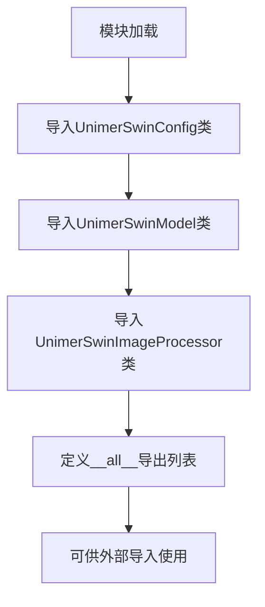

# `MinerU\mineru\model\mfr\unimernet\unimernet_hf\unimer_swin\__init__.py` 详细设计文档

这是UNIMER SWIN Transformer模型在HuggingFace Transformers库中的接口模块，通过统一导出配置类、模型类和图像处理器类，为用户提供便捷的模型加载和使用入口。

## 整体流程



## 类结构

```
UnimerSwin模块
├── UnimerSwinConfig (配置类)
├── UnimerSwinModel (模型类)
└── UnimerSwinImageProcessor (图像处理类)
```

## 全局变量及字段


### `__all__`
    
定义模块的公共接口，指定使用 from module import * 时导出的类名列表

类型：`list[str]`
    


    

## 全局函数及方法


## 关键组件


### UnimerSwinConfig

配置模块，定义UnimerSwin模型的超参数和架构配置，包括模型层数、隐藏维度、注意力头数等关键参数。

### UnimerSwinModel

模型核心模块，实现UnimerSwinTransformer模型的前向传播，包含Swin Transformer编码器、特征融合层和下游任务头，支持多模态输入处理。

### UnimerSwinImageProcessor

图像预处理模块，负责图像的加载、预处理和批处理，包括图像resize、归一化、裁剪等操作，将原始图像转换为模型所需的张量格式。


## 问题及建议


### 已知问题

-   **缺少模块级文档字符串**：该`__init__.py`文件没有模块级docstring来描述整个包的用途
-   **无导入错误处理**：如果某个子模块导入失败（如依赖缺失），会直接导致整个包无法导入，缺乏友好的错误提示
-   **无版本信息**：缺少`__version__`等版本管理机制
-   **无类型注解**：缺乏静态类型检查支持
-   **无lazy loading机制**：导入时会立即加载所有子模块，可能影响启动性能
-   **缺少异常导出**：子模块中可能存在的自定义异常未被暴露

### 优化建议

-   添加模块级docstring，描述UnimerSwin多模态模型的用途和功能
-   实现lazy loading（延迟加载）机制，使用`__getattr__`动态导入，减少初始导入开销
-   添加try-except包装导入语句，提供友好的错误信息（如提示缺少torch等依赖）
-   暴露子模块中的异常类，便于外部调用者进行错误处理
-   添加`__version__`变量管理版本信息
-   考虑使用`TYPE_CHECKING`添加类型注解支持
-   如有需要，可添加`__all__`之外的辅助工具导出


## 其它


### 设计目标与约束
该模块是UniMER-Swin多模态模型的核心入口模块，旨在提供一个统一的接口来访问配置、模型和图像处理功能。设计约束包括：需与HuggingFace Transformers库风格保持一致；配置类需支持序列化/反序列化；模型类需支持预训练权重加载和推理；图像处理器需支持多种输入格式。

### 错误处理与异常设计
该模块本身不直接处理错误，错误处理由底层模块实现。预期错误场景包括：导入模块时找不到依赖包（如torch、transformers）抛出ImportError；配置类实例化时参数验证失败抛出ValueError；模型加载时权重文件不存在抛出FileNotFoundError；图像处理器输入格式不支持时抛出NotImplementedError。

### 数据流与状态机
数据流遵循以下路径：用户创建UnimerSwinConfig配置对象 → 使用配置初始化UnimerSwinModel模型对象 → 使用UnimerSwinImageProcessor处理输入图像 → 将处理后的图像输入模型进行推理或特征提取。状态机主要涉及模型的三种状态：初始化状态（配置加载完成）、预训练权重加载状态（模型参数已加载）、推理/训练状态。

### 外部依赖与接口契约
核心依赖包括：torch（PyTorch深度学习框架）、transformers（提供基础模型架构）、PIL/Pillow（图像处理）、numpy（数值计算）。接口契约：UnimerSwinConfig必须提供to_dict()和from_dict()方法；UnimerSwinModel必须继承PreTrainedModel并实现forward()方法；UnimerSwinImageProcessor必须实现preprocess()和post_process()方法。

### 版本兼容性信息
最低Python版本要求：3.8+；PyTorch版本要求：1.8+；Transformers版本要求：4.20+；推荐使用CUDA 11.0+以获得最佳GPU性能。模块遵循语义化版本控制（Semantic Versioning）。

### 使用示例
```python
from unimer_swin import UnimerSwinConfig, UnimerSwinModel, UnimerSwinImageProcessor

# 初始化配置
config = UnimerSwinConfig()

# 加载预训练模型
model = UnimerSwinModel.from_pretrained("unimer-swin-base")

# 创建图像处理器
processor = UnimerSwinImageProcessor()

# 处理图像并推理
image = Image.open("example.jpg")
inputs = processor(image, return_tensors="pt")
outputs = model(**inputs)
```

### 性能考虑与优化建议
模型推理内存占用取决于模型规模（base/large变体）；建议使用batch处理提升吞吐量；可通过启用torch.cuda.amp实现混合精度推理减少显存占用；图像预处理阶段可考虑使用torchvision transforms替代PIL以提升性能；长期优化方向包括：支持ONNX导出、集成DeepSpeed推理加速。

    