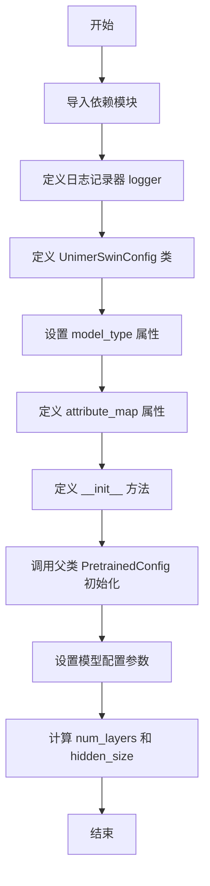
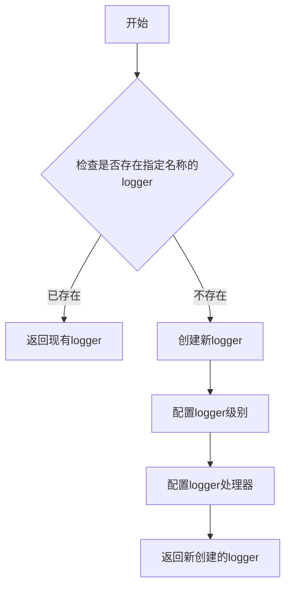

# `MinerU\mineru\model\mfr\unimernet\unimernet_hf\unimer_swin\configuration_unimer_swin.py` 详细设计文档

这是一个用于配置 UnimerSwin Transformer 模型的配置类，继承自 HuggingFace Transformers 的 PretrainedConfig，用于定义 Swin Transformer 的架构参数（如图像尺寸、patch 大小、注意力头数、层深度等），可实例化对应的模型。

## 整体流程



## 类结构

```
PretrainedConfig (HuggingFace 基类)
└── UnimerSwinConfig (配置类)
```

## 全局变量及字段


### `logger`
    
日志记录器对象

类型：`logging.Logger`
    


### `UnimerSwinConfig.image_size`
    
输入图像的尺寸（分辨率）

类型：`int`
    


### `UnimerSwinConfig.patch_size`
    
每个 patch 的尺寸（分辨率）

类型：`int`
    


### `UnimerSwinConfig.num_channels`
    
输入通道数

类型：`int`
    


### `UnimerSwinConfig.embed_dim`
    
Patch embedding 的维度

类型：`int`
    


### `UnimerSwinConfig.depths`
    
Transformer 编码器每层的深度

类型：`list`
    


### `UnimerSwinConfig.num_heads`
    
Transformer 编码器每层的注意力头数

类型：`list`
    


### `UnimerSwinConfig.window_size`
    
窗口大小

类型：`int`
    


### `UnimerSwinConfig.mlp_ratio`
    
MLP 隐藏层维度与 embedding 维度的比值

类型：`float`
    


### `UnimerSwinConfig.qkv_bias`
    
是否对查询、键、值添加可学习的偏置

类型：`bool`
    


### `UnimerSwinConfig.hidden_dropout_prob`
    
嵌入层和编码器中全连接层的 dropout 概率

类型：`float`
    


### `UnimerSwinConfig.attention_probs_dropout_prob`
    
注意力概率的 dropout 比率

类型：`float`
    


### `UnimerSwinConfig.drop_path_rate`
    
随机深度率

类型：`float`
    


### `UnimerSwinConfig.hidden_act`
    
编码器中的非线性激活函数

类型：`str 或 function`
    


### `UnimerSwinConfig.use_absolute_embeddings`
    
是否添加绝对位置嵌入到 patch embedding

类型：`bool`
    


### `UnimerSwinConfig.initializer_range`
    
初始化所有权重矩阵的截断正态分布标准差

类型：`float`
    


### `UnimerSwinConfig.layer_norm_eps`
    
层归一化层使用的 epsilon

类型：`float`
    


### `UnimerSwinConfig.num_layers`
    
层数，由 depths 计算得出

类型：`int`
    


### `UnimerSwinConfig.hidden_size`
    
最后一阶段的通道维度，用于 VisionEncoderDecoderModel

类型：`int`
    
    

## 全局函数及方法


### `logging.get_logger`

获取与指定模块关联的日志记录器实例，用于在项目中记录日志信息。

参数：

- `name`：`str`，模块的 `__name__` 属性，用于标识日志来源，通常传入 `__name__` 以获取当前模块的日志记录器。

返回值：`logging.Logger`，返回一个日志记录器对象，可用于记录不同级别的日志信息（如 debug、info、warning、error、critical）。

#### 流程图



#### 带注释源码

```python
# 从transformers.utils模块导入logging对象
from transformers.utils import logging

# 调用get_logger函数，传入当前模块的__name__
# 该函数返回与当前模块关联的日志记录器实例
# 用于后续的日志记录操作（如logger.info, logger.warning等）
logger = logging.get_logger(__name__)
```


### UnimerSwinConfig.__init__

该方法是 `UnimerSwinConfig` 类的构造函数，用于初始化 Donut Swin Transformer 模型的配置参数。它接收一系列模型架构相关的超参数（如图像尺寸、patch 大小、嵌入维度、注意力头数等），将这些参数存储为实例属性，并设置隐藏层数量和隐藏大小等派生属性，最终将所有参数传递给父类 `PretrainedConfig` 进行初始化。

参数：

- `image_size`：`int`，可选，默认值为 224，表示输入图像的尺寸（分辨率）
- `patch_size`：`int`，可选，默认值为 4，表示每个 patch 的尺寸（分辨率）
- `num_channels`：`int`，可选，默认值为 3，表示输入通道数
- `embed_dim`：`int`，可选，默认值为 96，表示 patch 嵌入的维度
- `depths`：`list(int)`，可选，默认值为 [2, 2, 6, 2]，表示 Transformer 编码器中每层的深度
- `num_heads`：`list(int)`，可选，默认值为 [3, 6, 12, 24]，表示 Transformer 编码器每层的注意力头数
- `window_size`：`int`，可选，默认值为 7，表示窗口大小
- `mlp_ratio`：`float`，可选，默认值为 4.0，表示 MLP 隐藏层维度与嵌入维度的比值
- `qkv_bias`：`bool`，可选，默认值为 True，表示是否对查询、键和值添加可学习的偏置
- `hidden_dropout_prob`：`float`，可选，默认值为 0.0，表示嵌入层和编码器中全连接层的 dropout 概率
- `attention_probs_dropout_prob`：`float`，可选，默认值为 0.0，表示注意力概率的 dropout 比率
- `drop_path_rate`：`float`，可选，默认值为 0.1，表示随机深度率
- `hidden_act`：`str` 或 `function`，可选，默认值为 "gelu"，表示编码器中的非线性激活函数
- `use_absolute_embeddings`：`bool`，可选，默认值为 False，表示是否将绝对位置嵌入添加到 patch 嵌入中
- `initializer_range`：`float`，可选，默认值为 0.02，用于初始化所有权重矩阵的截断正态分布标准差
- `layer_norm_eps`：`float`，可选，默认值为 1e-5，表示层归一化层使用的 epsilon 值
- `**kwargs`：任意关键字参数，传递给父类 PretrainedConfig

返回值：无（`None`），构造函数不返回值

#### 流程图

```mermaid
flowchart TD
    A[开始 __init__] --> B[调用父类 PretrainedConfig.__init__(**kwargs)]
    B --> C[设置基本图像参数<br/>image_size, patch_size, num_channels]
    C --> D[设置模型架构参数<br/>embed_dim, depths, num_heads, window_size]
    D --> E[设置训练参数<br/>mlp_ratio, qkv_bias, hidden_dropout_prob,<br/>attention_probs_dropout_prob, drop_path_rate]
    E --> F[设置激活函数和初始化参数<br/>hidden_act, use_absolute_embeddings,<br/>layer_norm_eps, initializer_range]
    F --> G[计算派生属性<br/>num_layers = len(depths)]
    G --> H[计算隐藏层大小<br/>hidden_size = embed_dim * 2^(len(depths)-1)]
    H --> I[结束 __init__]
```

#### 带注释源码

```python
def __init__(
    self,
    image_size=224,           # 输入图像尺寸，默认224x224
    patch_size=4,             # 每个patch的尺寸，将图像划分为4x4的patches
    num_channels=3,           # 输入通道数，RGB图像为3
    embed_dim=96,             # patch嵌入的维度，决定模型初始特征维度
    depths=[2, 2, 6, 2],      # 每个stage的层数，构成4个stage的Transformer编码器
    num_heads=[3, 6, 12, 24], # 每个stage的注意力头数，与embed_dim配合计算注意力
    window_size=7,            # 窗口大小，用于局部注意力机制
    mlp_ratio=4.0,            # MLP隐藏层维度比例，隐藏层=embed_dim*mlp_ratio
    qkv_bias=True,            # 是否使用QKV偏置，影响注意力计算的表达能力
    hidden_dropout_prob=0.0, # 嵌入层和编码器全连接层的dropout概率
    attention_probs_dropout_prob=0.0, # 注意力权重的dropout比率，用于正则化
    drop_path_rate=0.1,      # 随机深度rate，控制网络路径的随机跳过
    hidden_act="gelu",       # 激活函数类型，支持gelu/relu/selu/gelu_new
    use_absolute_embeddings=False, # 是否使用绝对位置编码
    initializer_range=0.02,  # 权重初始化标准差，影响训练稳定性
    layer_norm_eps=1e-5,     # 层归一化的epsilon，防止除零错误
    **kwargs,                # 传递给父类的额外参数
):
    # 调用父类PretrainedConfig的初始化方法
    # 使配置对象能够被HuggingFace的transformers库统一管理
    super().__init__(**kwargs)

    # 图像相关基础参数
    self.image_size = image_size
    self.patch_size = patch_size
    self.num_channels = num_channels
    
    # 模型嵌入参数
    self.embed_dim = embed_dim
    self.depths = depths
    
    # 计算并存储层数，由depths列表长度决定
    self.num_layers = len(depths)
    
    # 注意力机制参数
    self.num_heads = num_heads
    
    # 窗口大小参数，用于Swin Transformer的移位窗口注意力
    self.window_size = window_size
    
    # MLP比例参数
    self.mlp_ratio = mlp_ratio
    
    # QKV偏置参数
    self.qkv_bias = qkv_bias
    
    # Dropout参数
    self.hidden_dropout_prob = hidden_dropout_prob
    self.attention_probs_dropout_prob = attention_probs_dropout_prob
    
    # 随机深度参数
    self.drop_path_rate = drop_path_rate
    
    # 激活函数参数
    self.hidden_act = hidden_act
    
    # 位置编码参数
    self.use_absolute_embeddings = use_absolute_embeddings
    
    # 归一化参数
    self.layer_norm_eps = layer_norm_eps
    
    # 初始化范围参数
    self.initializer_range = initializer_range
    
    # 设置隐藏大小属性，使Swin能与VisionEncoderDecoderModel配合工作
    # 表示模型最后阶段之后的通道维度
    # 计算方式：基础维度 * 2^(总层数-1)，即最后一stage的输出维度
    self.hidden_size = int(embed_dim * 2 ** (len(depths) - 1))
```

## 关键组件


### UnimerSwinConfig类

Swin Transformer模型的配置类，继承自PretrainedConfig，用于存储模型架构的所有超参数配置，包括图像尺寸、patch大小、嵌入维度、层深度、注意力头数等。

### model_type类属性

模型类型标识符，值为"unimer-swin"，用于模型注册和加载时的类型识别。

### attribute_map类属性

属性名称映射字典，将"num_attention_heads"映射到"num_heads"，"num_hidden_layers"映射到"num_layers"，以兼容不同命名规范。

### __init__方法

初始化方法，接收所有模型超参数并存储为实例属性，包括image_size、patch_size、num_channels、embed_dim、depths、num_heads、window_size、mlp_ratio、qkv_bias、hidden_dropout_prob、attention_probs_dropout_prob、drop_path_rate、hidden_act、use_absolute_embeddings、initializer_range、layer_norm_eps等参数。

### hidden_size计算逻辑

根据embed_dim和depths计算最后一个阶段的通道维度，公式为int(embed_dim * 2 ** (len(depths) - 1))，用于与VisionEncoderDecoderModel兼容。

### 配置参数集

模型的核心超参数集合，包括：image_size(图像分辨率)、patch_size(patch分辨率)、num_channels(输入通道数)、embed_dim(patch嵌入维度)、depths(每层Transformer编码器的深度)、num_heads(每层注意力头数)、window_size(窗口大小)、mlp_ratio(MLP隐藏层与嵌入层维度比)、qkv_bias(QKV偏置)、hidden_dropout_prob(隐藏层dropout概率)、attention_probs_dropout_prob(注意力概率dropout)、drop_path_rate(随机深度率)、hidden_act(激活函数)、use_absolute_embeddings(绝对位置嵌入)、initializer_range(初始化范围)、layer_norm_eps(层归一化epsilon)。


## 问题及建议


### 已知问题

- **文档与实现不一致**：文档字符串描述的是"Donut Swin Transformer"和Donut模型相关内容，但类名是`UnimerSwinConfig`，存在命名与文档描述不匹配的问题
- **attribute_map映射问题**：`attribute_map`将`num_hidden_layers`映射到`num_layers`，但`num_layers`是通过`len(depths)`计算得出的动态属性，而非直接存储的配置值，这种隐式依赖可能导致意外的兼容性行为
- **缺少类型注解**：所有参数和方法都缺乏Python类型注解（type hints），降低代码的可读性和IDE支持
- **参数验证缺失**：`depths`和`num_heads`的长度一致性没有验证，如果两者长度不匹配可能导致后续模型构建出错
- **隐藏大小计算假设**：使用固定公式`int(embed_dim * 2 ** (len(depths) - 1))`计算`hidden_size`，假设了特定的架构模式，缺乏灵活性
- **文档示例过期**：示例代码引用的是`naver-clova-ix/donut-base`，但实际类名和架构可能已不匹配

### 优化建议

- 修正文档字符串，使其与类名`UnimerSwinConfig`和实际功能一致
- 为所有参数添加类型注解（如`depths: List[int]`, `num_heads: List[int]`等）
- 在`__init__`中添加参数验证逻辑，确保`len(depths) == len(num_heads)`
- 考虑将`hidden_size`的计算改为可选的显式参数，允许用户自定义
- 更新或移除attribute_map中关于`num_layers`的映射，或明确其动态计算特性
- 为关键属性添加`__init__`后的验证方法，确保配置的有效性

## 其它


### 设计目标与约束

设计目标：提供一种灵活且可扩展的配置机制，用于实例化和定制UnimerSwinTransformer模型。通过统一的配置接口，实现模型的标准化创建、参数自定义和预训练权重的兼容性处理。设计约束：必须继承自PretrainedConfig以保持与HuggingFace Transformers库的兼容性；所有配置参数必须有合理的默认值；配置参数必须与模型实际构建逻辑保持一致；hidden_size等派生属性需要在初始化时自动计算。

### 错误处理与异常设计

参数类型检查：在__init__方法中未对输入参数类型进行显式校验，建议添加类型检查逻辑防止传入错误类型。参数值范围校验：对于image_size、patch_size、window_size等具有实际物理意义的参数，应添加有效性验证，例如patch_size应大于0且能被image_size整除。depths和num_heads列表长度一致性：应确保depths和num_heads两个列表长度一致，否则在模型构建时会导致错误。默认值一致性：depths默认值为[2,2,6,2]，num_heads默认值为[3,6,12,24]，长度均为4，需在文档中明确说明这种对应关系。

### 外部依赖与接口契约

依赖的外部模块：transformers.configuration_utils.PretrainedConfig - 提供预训练模型配置的基础功能；transformers.utils.logging - 提供日志记录功能。接口契约：model_type类属性必须设置为"unimer-swin"，用于模型类型识别；attribute_map定义了属性别名映射关系；所有配置属性可通过config.image_size等方式访问；配置对象可传递给UnimerSwinModel用于模型实例化。向后兼容性：继承自PretrainedConfig的kwargs机制允许传递额外的未定义参数，保证向后兼容性。

### 配置版本管理与兼容性

版本控制机制：当前未显式定义配置版本号，建议添加config_version属性用于版本追踪。模型类型标识：model_type="unimer-swin"用于标识模型类型，配合from_pretrained方法实现不同版本配置的识别。默认值演变：默认参数值基于naver-clova-ix/donut-base架构，当默认值发生变更时需要更新文档说明。配置序列化：继承自PretrainedConfig的to_dict、to_json_string等方法用于配置序列化与反序列化。

### 使用示例与最佳实践

基本使用示例：from transformers import UnimerSwinConfig, UnimerSwinModel; config = UnimerSwinConfig(); model = UnimerSwinModel(config)。自定义配置：可以通过传递参数自定义配置，如UnimerSwinConfig(image_size=512, patch_size=8, depths=[2,2,18,2])。从预训练加载：UnimerSwinConfig.from_pretrained("model_path")用于加载预训练配置。配置验证：建议在实例化模型前验证配置参数的合理性，特别是自定义参数值。

### 配置参数映射关系

hidden_size派生逻辑：self.hidden_size = int(embed_dim * 2 ** (len(depths) - 1))，计算最后一个stage的输出通道数。num_layers派生：self.num_layers = len(depths)，通过depths列表长度自动计算总层数。attribute_map作用：将num_attention_heads映射到num_heads，num_hidden_layers映射到num_layers，提供API层面的兼容性。mlp_ratio含义：MLP隐藏层维度与输入嵌入维度的比率，用于控制FFN中间层宽度。

### 文档与注释完整性

类文档字符串：包含详细的参数说明和使用示例，符合HuggingFace文档规范。参数描述完整性：所有公开参数都有类型标注和默认值说明。代码注释：hidden_size属性设置有注释说明用于VisionEncoderDecoderModel兼容性。日志记录：logger用于记录配置相关的警告和信息，但当前未实际使用。

### 扩展性与未来考虑

可扩展参数：**kwargs机制允许传递额外参数。配置类扩展：可通过继承UnimerSwinConfig添加领域特定配置。模型变体支持：不同的模型变体可通过不同的配置实例表示。配置验证框架：建议添加_validate方法用于自定义验证逻辑。


    