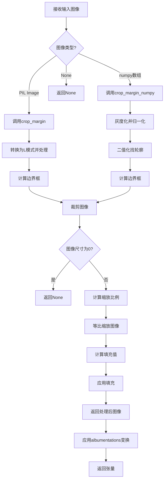
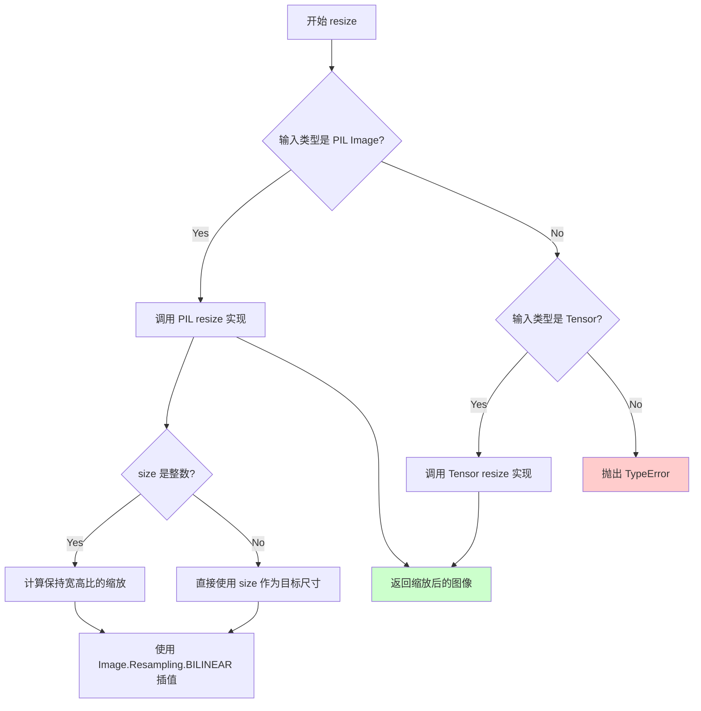
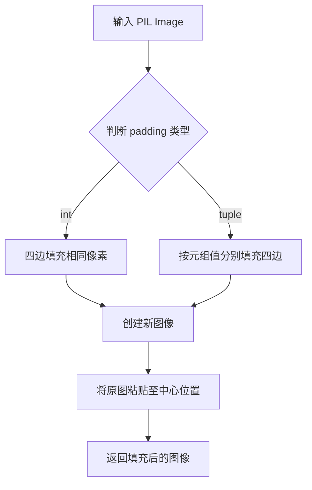
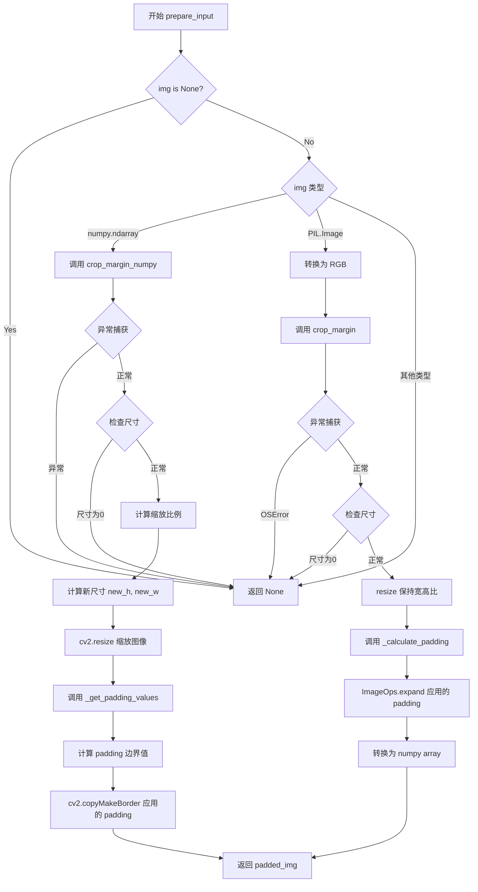
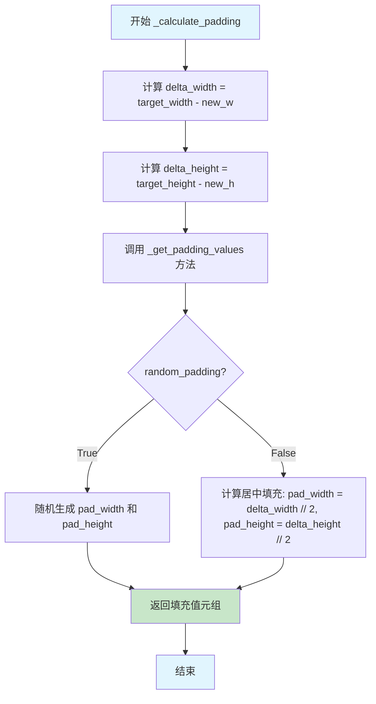

# `MinerU\mineru\model\mfr\unimernet\unimernet_hf\unimer_swin\image_processing_unimer_swin.py` 详细设计文档

UnimerSwinImageProcessor是一个图像预处理类，继承自transformers库的BaseImageProcessor，用于对输入图像进行自动化处理：裁剪边距、调整尺寸保持宽高比、填充至目标尺寸，并转换为PyTorch张量格式，适用于视觉语言模型的输入准备。

## 整体流程



## 类结构

```
UnimerSwinImageProcessor (继承自BaseImageProcessor)
└── BaseImageProcessor (来自transformers库)
```

## 全局变量及字段


### `UnimerSwinImageProcessor.input_size`
    
目标图像尺寸 [height, width]

类型：`List[int]`
    


### `UnimerSwinImageProcessor.transform`
    
albumentations图像变换组合

类型：`alb.Compose`
    
    

## 全局函数及方法


### `torchvision.transforms.functional.resize`

`resize` 函数是 torchvision.transforms.functional 模块中的图像缩放核心函数，用于将输入图像调整到指定的目标尺寸，同时支持多种插值方式和不同的输出格式。该函数是图像预处理流水线中的关键组件，被 `UnimerSwinImageProcessor.prepare_input` 方法在处理 PIL Image 时调用，以在保持宽高比的前提下将图像缩放到目标尺寸。

参数：

-  `img`：`PIL.Image.Image` 或 `torch.Tensor`，输入图像，支持 PIL 图像或张量格式
-  `size`：`int` 或 `Sequence[int]`，目标尺寸，可以是整数（将短边调整为该值）或序列 [height, width]
-  `interpolation`：`int`（默认值：`Image.BILINEAR`），插值方法，如 `Image.NEAREST`、`Image.BILINEAR`、`Image.BICUBIC` 等
-  `max_`：`Optional[int]`（可选），如果提供，将调整图像使最大边等于该值
-  `antialias`：`Optional[bool]`（可选），是否使用抗锯齿，默认为 None

返回值：`PIL.Image.Image` 或 `torch.Tensor`，返回调整大小后的图像，类型与输入类型一致

#### 流程图



#### 带注释源码

```python
# torchvision.transforms.functional.resize 源码分析

# 函数签名 (基于 torchvision 0.15+ 版本)
def resize(
    img: Union[PIL.Image.Image, Tensor],  # 输入图像
    size: Union[int, Sequence[int]],      # 目标尺寸
    interpolation: int = Image.BILINEAR,  # 插值方式
    max_: Optional[int] = None,            # 最大边限制
    antialias: Optional[bool] = None      # 抗锯齿选项
) -> Union[PIL.Image.Image, Tensor]:
    """
    将输入图像调整到指定大小。
    
    参数:
        img: 输入图像 (PIL Image 或 Tensor)
        size: 目标尺寸，整数或 [height, width] 序列
        interpolation: 插值方法，默认为双线性插值
        max_: 可选的最大边限制
        antialias: 是否启用抗锯齿
    
    返回:
        调整大小后的图像
    """
    
    # 检查输入有效性
    if not isinstance(img, (PILImage, Tensor)):
        raise TypeError(f"img should be PIL Image or Tensor. Got {type(img)}")
    
    # 如果 size 是整数，调整短边使其等于 size，保持宽高比
    if isinstance(size, int):
        # 计算缩放比例，使短边 = size
        w, h = get_image_size(img)  # 获取图像宽高
        if (w <= h and w == size) or (h <= w and h == size):
            return img
        
        # 计算新的宽高，保持宽高比
        if w < h:
            ow = size
            oh = int(size * h / w)
        else:
            oh = size
            ow = int(size * w / h)
    else:
        # size 是 [height, width] 序列
        oh, ow = size  # 注意：size 顺序是 [height, width]
    
    # 根据图像类型调用对应的 resize 实现
    if isinstance(img, PILImage):
        # PIL Image 路径：使用 PIL 的 resize 方法
        return img.resize((ow, oh), interpolation)
    else:
        # Tensor 路径：使用 torch.nn.functional.interpolate
        return F.interpolate(img, size=(oh, ow), mode=interpolation, 
                            antialias=antialias)


# ============================================================
# 在 UnimerSwinImageProcessor 中的实际调用方式
# ============================================================

# 代码中的调用 (prepare_input 方法，PIL Image 分支):
img = resize(img, min(self.input_size))  # 将图像短边调整到 input_size 中的较小值
img.thumbnail((self.input_size[1], self.input_size[0]))  # 然后使用 thumbnail 保持宽高比进行进一步缩放

# 解析：
# 1. resize(img, min(self.input_size)) - 将图像短边调整为 input_size 中的最小值
#    例如 input_size = (192, 672)，则 min(self.input_size) = 192
#    这样可以保证图像被缩放到合适的大小，同时保持宽高比
# 2. thumbnail() - 进一步将图像缩放到不超过目标尺寸，同时保持宽高比
#    这里是确保图像不会超过 (672, 192) 的边界
```


### `ImageOps.expand` (PIL)

该函数是 PIL 库中的图像填充（expand）操作，用于在图像周围添加边框。在 `UnimerSwinImageProcessor` 中，它被用于在保持宽高比调整图像大小后，将图像填充至目标尺寸。

参数：

-  `img`：`PIL.Image.Image`，输入的 PIL 图像对象（已经过 resize 和 thumbnail 处理）
-  `padding`：`int` 或 `tuple`，填充的像素宽度。若为整数，则四边填充相同值；若为四元组 `(left, top, right, bottom)`，则分别指定各边的填充量

返回值：`PIL.Image.Image`，填充后的新图像对象

#### 流程图



#### 带注释源码

```python
# ImageOps.expand 函数调用示例（位于 prepare_input 方法中）
# 参数说明：
#   img: 经过 resize 和 thumbnail 处理后的 PIL Image 对象
#   padding: _calculate_padding 返回的四元组 (left, top, right, bottom)

padding = self._calculate_padding(new_w, new_h, random_padding)
# padding 格式: (pad_width, pad_height, delta_width - pad_width, delta_height - pad_height)
# 即 (左边填充, 上边填充, 右边填充, 下边填充)

# 调用 PIL ImageOps.expand 进行图像填充
# 函数原型: ImageOps.expand(image, border, fill=0)
#   - image: 输入图像
#   - border: 填充宽度，可为 int 或 (left, top, right, bottom) 元组
#   - fill: 填充颜色，默认为黑色 (0)
padded_image = ImageOps.expand(img, padding)

# 转换为 numpy 数组返回
return np.array(padded_image)
```

#### 实际调用上下文源码

```python
def prepare_input(self, img, random_padding: bool = False):
    """处理 PIL Image 路径"""
    # ... 前面的 crop_margin 和 resize 处理 ...
    
    # Resize while preserving aspect ratio
    img = resize(img, min(self.input_size))
    img.thumbnail((self.input_size[1], self.input_size[0]))
    new_w, new_h = img.width, img.height

    # 计算填充值
    # _calculate_padding 返回 (left, top, right, bottom) 四元组
    padding = self._calculate_padding(new_w, new_h, random_padding)
    
    # ImageOps.expand 在图像周围添加边框，使图像达到目标尺寸
    # padding 为 4 元组时: (left, top, right, bottom)
    return np.array(ImageOps.expand(img, padding))
```

#### 技术说明

| 项目 | 说明 |
|------|------|
| **函数位置** | `PIL.ImageOps.expand` |
| **调用场景** | 在保持宽高比缩放后，将图像填充至统一的输入尺寸 |
| **填充策略** | 居中填充，默认使用黑色 (0) 填充 |
| **与 numpy 方式对比** | 代码中 numpy 路径使用 `cv2.copyMakeBorder`，PIL 路径使用 `ImageOps.expand` |


### `UnimerSwinImageProcessor.__init__`

该方法是`UnimerSwinImageProcessor`类的构造函数，用于初始化图像处理器。它接收目标图像大小参数，将图像尺寸规范化为整数列表，创建数据增强转换流水线（包括灰度转换、标准化和张量转换）。

参数：

- `image_size`：`Tuple[int, int]`，目标图像尺寸，默认为(192, 672)，用于指定处理后图像的宽度和高度

返回值：`None`，构造函数不返回值

#### 流程图

```mermaid
flowchart TD
    A[开始 __init__] --> B{接收 image_size 参数}
    B --> C[默认值 (192, 672)]
    C --> D[将 image_size 转换为整数列表]
    D --> E[input_size = [192, 672]]
    E --> F[验证 input_size 长度为2]
    F --> G[断言 assert len == 2]
    G --> H[创建 alb.Compose 转换流水线]
    H --> I[ToGray 灰度转换]
    I --> J[Normalize 标准化 mean=0.7931 std=0.1738]
    J --> K[ToTensorV2 转换为张量]
    K --> L[赋值 self.transform]
    L --> M[结束]
```

#### 带注释源码

```python
def __init__(
        self,
        image_size = (192, 672),
    ):
    """
    初始化图像处理器
    
    参数:
        image_size: 目标图像尺寸，默认为 (192, 672)，格式为 (高度, 宽度)
    """
    
    # 将输入的 image_size 元组转换为整数列表
    # 例如: (192, 672) -> [192, 672]
    self.input_size = [int(_) for _ in image_size]
    
    # 断言验证输入尺寸是否为二维（高度和宽度）
    assert len(self.input_size) == 2
    
    # 创建数据增强转换流水线 (albumentations)
    # 流水线包含以下步骤:
    # 1. ToGray: 将图像转换为灰度图
    # 2. Normalize: 标准化图像，使用预计算的均值和标准差
    #    - 均值: (0.7931, 0.7931, 0.7931)
    #    - 标准差: (0.1738, 0.1738, 0.1738)
    # 3. ToTensorV2: 将图像转换为 PyTorch 张量
    self.transform = alb.Compose(
        [
            alb.ToGray(),
            alb.Normalize((0.7931, 0.7931, 0.7931), (0.1738, 0.1738, 0.1738)),
            # alb.Sharpen()  # 注释掉的锐化操作
            ToTensorV2(),
        ]
    )
```


### `UnimerSwinImageProcessor.__call__`

该方法是 `UnimerSwinImageProcessor` 类的核心调用入口，接收图像输入（支持 PIL Image 或 numpy array 格式），通过 `prepare_input` 方法完成图像的边距裁剪、宽高比保持的缩放以及目标尺寸填充，最后应用 albumentations 变换链（灰度化、归一化、转换为张量）并返回处理后的图像张量（取第一个通道）。

参数：

- `item`：`Any`，待处理的图像输入，支持 PIL Image 或 numpy array 格式

返回值：`torch.Tensor`，处理后的图像张量，形状为 (1, H, W)，其中 H 和 W 为目标尺寸

#### 流程图

```mermaid
flowchart TD
    A[开始 __call__] --> B{item 是否为空}
    B -->|是| C[返回 None]
    B -->|否| D[调用 prepare_input 处理图像]
    D --> E[调用 self.transform 进行图像变换]
    E --> F[提取 'image' 字段]
    F --> G[取第一个通道 [:1]]
    G --> H[返回处理后的张量]
```

#### 带注释源码

```python
def __call__(self, item):
    """
    处理输入图像的主入口方法
    
    参数:
        item: 输入图像，PIL Image 或 numpy array 格式
        
    返回:
        处理后的图像张量，形状为 (1, H, W)
    """
    # Step 1: 调用 prepare_input 对图像进行预处理
    # 预处理包括：裁剪白边、保持宽高比缩放、填充到目标尺寸
    image = self.prepare_input(item)
    
    # Step 2: 使用 albumentations 变换链处理图像
    # 变换链包含：ToGray() -> Normalize() -> ToTensorV2()
    # transform 返回字典 {'image': tensor}
    transformed = self.transform(image=image)
    
    # Step 3: 提取图像张量并取第一个通道
    # ToGray() 将图像转为灰度（单通道），[:1] 确保返回 (1, H, W) 形状
    return transformed['image'][:1]
```


### `UnimerSwinImageProcessor.crop_margin`

该函数是一个静态方法，用于裁剪图像的白色/空白边距，保留包含内容的最小矩形区域。它通过灰度转换、归一化、二值化处理和OpenCV轮廓检测来定位图像内容的边界，并返回裁剪后的PIL图像。

参数：

-  `img`：`Image.Image`，输入的PIL图像对象

返回值：`Image.Image`，裁剪边距后的图像对象

#### 流程图

```mermaid
flowchart TD
    A[开始: 接收PIL图像] --> B[转换为灰度图并转为numpy数组]
    B --> C[获取数组最大值和最小值]
    C --> D{最大值 == 最小值?}
    D -->|是| E[直接返回原图像]
    D -->|否| F[归一化数据到0-255范围]
    F --> G[阈值处理: 创建二值化图像<br/>gray = 255 * (data < 200)]
    G --> H[使用cv2.findNonZero查找非零点坐标]
    H --> I[使用cv2.boundingRect计算边界矩形]
    I --> J[裁剪图像: img.crop(a, b, w+a, h+b)]
    J --> K[返回裁剪后的图像]
    E --> K
```

#### 带注释源码

```python
@staticmethod
def crop_margin(img: Image.Image) -> Image.Image:
    """
    裁剪图像的空白边距，保留内容区域
    
    参数:
        img: 输入的PIL图像对象
    
    返回:
        裁剪后的PIL图像对象
    """
    # 将PIL图像转换为灰度图并转换为numpy数组
    data = np.array(img.convert("L"))
    # 确保数据类型为uint8
    data = data.astype(np.uint8)
    
    # 获取灰度图的最大值和最小值
    max_val = data.max()
    min_val = data.min()
    
    # 如果图像是单色的（最大等于最小），直接返回原图
    if max_val == min_val:
        return img
    
    # 归一化处理：将数据缩放到0-255范围
    # (data - min_val) / (max_val - min_val) * 255
    data = (data - min_val) / (max_val - min_val) * 255
    
    # 二值化处理：像素值小于200的设为白色(255)，否则为黑色(0)
    # 这样可以将文本/内容区域变为黑色，便于查找轮廓
    gray = 255 * (data < 200).astype(np.uint8)

    # 查找所有非零像素点（即内容区域的轮廓）
    coords = cv2.findNonZero(gray)
    
    # 计算包含所有非零点的最小边界矩形
    # 返回: a=x坐标, b=y坐标, w=宽度, h=高度
    a, b, w, h = cv2.boundingRect(coords)
    
    # 裁剪图像: 左上角(a, b), 右下角(w+a, h+b)
    return img.crop((a, b, w + a, h + b))
```


### `UnimerSwinImageProcessor.crop_margin_numpy`

该函数是一个静态方法，用于通过NumPy和OpenCV操作裁剪图像的白色边距（页边距），常用于文档图像处理，去除扫描图像中的多余边框。

参数：

- `img`：`np.ndarray`，输入的图像数据，支持灰度图或RGB彩色图像

返回值：`np.ndarray`，裁剪后的图像数据

#### 流程图

```mermaid
flowchart TD
    A[开始: 输入图像 img] --> B{图像维度检查}
    B -->|3通道彩色图像| C[使用cv2.cvtColor转灰度图]
    B -->|灰度图像| D[复制图像为灰度图]
    C --> E{检查灰度图max == min}
    D --> E
    E -->|是| F[返回原图]
    E -->|否| G[归一化到0-255范围]
    G --> H[二值化: 阈值200]
    H --> I[使用cv2.findNonZero找非零点]
    I --> J[使用cv2.boundingRect计算边界框]
    J --> K[裁剪图像: img[y:y+h, x:x+w]
    K --> L[返回裁剪后图像]
    F --> L
```

#### 带注释源码

```python
@staticmethod
def crop_margin_numpy(img: np.ndarray) -> np.ndarray:
    """Crop margins of image using NumPy operations"""
    
    # 判断是否为彩色图像（3通道）
    if len(img.shape) == 3 and img.shape[2] == 3:
        # 使用OpenCV将RGB转换为灰度图
        gray = cv2.cvtColor(img, cv2.COLOR_RGB2GRAY)
    else:
        # 已经是灰度图，直接复制
        gray = img.copy()

    # 检查图像是否为常数图像（即全黑或全白）
    # 如果max等于min，说明图像没有内容差异，直接返回原图
    if gray.max() == gray.min():
        return img

    # 归一化处理：将图像像素值归一化到0-255范围
    # 公式: (x - min) / (max - min) * 255
    normalized = (((gray - gray.min()) / (gray.max() - gray.min())) * 255).astype(np.uint8)
    
    # 二值化处理：像素值小于200的设为白色(255)，大于等于200的设为黑色(0)
    # 这样可以把文字/内容区域变成黑色，边距区域变成白色
    binary = 255 * (normalized < 200).astype(np.uint8)

    # 查找所有非零像素的位置（即内容区域的像素）
    coords = cv2.findNonZero(binary)  # Find all non-zero points (text)
    
    # 计算包含所有非零像素的最小外接矩形
    x, y, w, h = cv2.boundingRect(coords)  # Find minimum spanning bounding box

    # 根据边界框坐标裁剪图像，返回裁剪后的图像
    return img[y:y + h, x:x + w]
```


### `UnimerSwinImageProcessor.prepare_input`

该方法负责将 PIL Image 或 numpy array 格式的输入图像转换为统一尺寸的目标图像，处理流程包括：裁剪白边/黑边、保持宽高比缩放、计算并应用 padding，支持随机 padding 策略。

参数：

- `img`：Union[Image.Image, np.ndarray]，输入图像，支持 PIL Image 或 numpy array 格式
- `random_padding`：bool，是否使用随机 padding（默认为 False），若为 True 则在图像四周随机分配 padding 量

返回值：`Optional[np.ndarray]`，处理后的图像（numpy array 格式），若输入无效或处理失败返回 None

#### 流程图



#### 带注释源码

```python
def prepare_input(self, img, random_padding: bool = False):
    """
    Convert PIL Image or numpy array to properly sized and padded image after:
        - crop margins
        - resize while maintaining aspect ratio
        - pad to target size
    """
    # 参数检查：如果输入图像为空，直接返回 None
    if img is None:
        return None

    # 处理 numpy array 类型的输入
    elif isinstance(img, np.ndarray):
        try:
            # 尝试裁剪图像白边/黑边（使用 NumPy 版本）
            img = self.crop_margin_numpy(img)
        except Exception:
            # 捕获异常：可能因文件损坏而抛出错误
            return None

        # 检查裁剪后的图像尺寸是否有效
        if img.shape[0] == 0 or img.shape[1] == 0:
            return None

        # 获取当前图像的高宽
        h, w = img.shape[:2]
        # 获取目标尺寸
        target_h, target_w = self.input_size

        # 计算保持宽高比的缩放比例（取较小值以确保图像完整放入目标框）
        scale = min(target_h / h, target_w / w)

        # 计算缩放后的新尺寸
        new_h, new_w = int(h * scale), int(w * scale)

        # 使用 OpenCV 缩放图像（保持宽高比）
        resized_img = cv2.resize(img, (new_w, new_h))

        # 计算需要填充的总宽度和高度
        delta_width = target_w - new_w
        delta_height = target_h - new_h

        # 计算 padding 值（考虑是否随机 padding）
        pad_width, pad_height = self._get_padding_values(new_w, new_h, random_padding)

        # 确定填充颜色（根据图像通道数）
        padding_color = [0, 0, 0] if len(img.shape) == 3 else [0]

        # 使用 OpenCV 的 copyMakeBorder 应用的 padding
        # 参数顺序：top, bottom, left, right
        padded_img = cv2.copyMakeBorder(
            resized_img,
            pad_height,                   # top
            delta_height - pad_height,   # bottom
            pad_width,                    # left
            delta_width - pad_width,     # right
            cv2.BORDER_CONSTANT,
            value=padding_color
        )

        return padded_img

    # 处理 PIL Image 类型的输入
    elif isinstance(img, Image.Image):
        try:
            # 转换为 RGB 并裁剪白边/黑边
            img = self.crop_margin(img.convert("RGB"))
        except OSError:
            # 捕获 OS 错误：可能因文件损坏而抛出错误
            return None

        # 检查裁剪后的图像尺寸是否有效
        if img.height == 0 or img.width == 0:
            return None

        # 使用 torchvision 的 resize 保持宽高比调整大小
        # 先将图像缩放到最小边等于 input_size 的最小值
        img = resize(img, min(self.input_size))
        # 再使用 thumbnail 确保图像不超过目标尺寸
        img.thumbnail((self.input_size[1], self.input_size[0]))
        new_w, new_h = img.width, img.height

        # 计算并应用的 padding
        padding = self._calculate_padding(new_w, new_h, random_padding)
        # 使用 PIL 的 ImageOps.expand 应用的 padding，并转换为 numpy array
        return np.array(ImageOps.expand(img, padding))

    # 不支持的输入类型，返回 None
    else:
        return None
```


### `UnimerSwinImageProcessor._calculate_padding`

该方法用于计算图像填充（padding）值，根据目标尺寸与调整大小后图像尺寸的差异，返回上下左右四个方向的填充量，用于将调整大小后的图像居中或随机放置在目标尺寸的画布中。

参数：

- `new_w`：`int`，调整大小后图像的宽度
- `new_h`：`int`，调整大小后图像的高度
- `random_padding`：`bool`，是否使用随机填充策略，True 时随机选择填充位置，False 时居中填充

返回值：`Tuple[int, int, int, int]`，返回四个整数的元组，分别表示左、上、右、下的填充像素数量

#### 流程图



#### 带注释源码

```python
def _calculate_padding(self, new_w, new_h, random_padding):
    """Calculate padding values for PIL images"""
    
    # 计算目标宽度与当前图像宽度的差值
    # delta_width 表示水平方向需要填充的总像素数
    delta_width = self.input_size[1] - new_w
    
    # 计算目标高度与当前图像高度的差值
    # delta_height 表示垂直方向需要填充的总像素数
    delta_height = self.input_size[0] - new_h

    # 调用内部方法获取具体的填充值
    # 根据 random_padding 参数决定是随机填充还是居中填充
    pad_width, pad_height = self._get_padding_values(new_w, new_h, random_padding)

    # 返回填充值的元组，格式符合 PIL ImageOps.expand 的要求
    # (left, top, right, bottom)
    # right = 总宽度差 - 左侧填充量
    # bottom = 总高度差 - 顶部填充量
    return (
        pad_width,           # 左侧填充像素数
        pad_height,          # 顶部填充像素数
        delta_width - pad_width,   # 右侧填充像素数
        delta_height - pad_height, # 底部填充像素数
    )
```

#### 依赖方法信息

**`_get_padding_values` 方法**

- **参数**：
  - `new_w`：`int`，调整大小后图像的宽度
  - `new_h`：`int`，调整大小后图像的高度
  - `random_padding`：`bool`，是否使用随机填充
- **返回值**：`Tuple[int, int]`，返回 (pad_width, pad_height) 元组
- **逻辑**：
  - 当 `random_padding=True` 时，在 [0, delta] 范围内随机生成填充值
  - 当 `random_padding=False` 时，使用整数除法实现居中填充


### `UnimerSwinImageProcessor._get_padding_values`

该方法用于根据图像尺寸和填充策略计算填充值，支持两种模式：居中填充（默认）和随机填充。

参数：

- `new_w`：`int`，resize 后的图像宽度
- `new_h`：`int`，resize 后的图像高度
- `random_padding`：`bool`，是否使用随机填充策略

返回值：`Tuple[int, int]`，返回填充宽度(pad_width)和填充高度(pad_height)元组，用于图像的中心对齐或随机偏移。

#### 流程图

```mermaid
flowchart TD
    A[开始 _get_padding_values] --> B[计算 delta_width = input_size[1] - new_w]
    B --> C[计算 delta_height = input_size[0] - new_h]
    C --> D{random_padding?}
    D -->|True| E[pad_width = randint(0, delta_width+1)]
    D -->|False| F[pad_width = delta_width // 2]
    E --> G[pad_height = randint(0, delta_height+1)]
    F --> H[pad_height = delta_height // 2]
    G --> I[返回 (pad_width, pad_height)]
    H --> I
```

#### 带注释源码

```python
def _get_padding_values(self, new_w, new_h, random_padding):
    """Get padding values based on image dimensions and padding strategy"""
    # 计算宽度方向的填充量（目标宽度 - 当前宽度）
    delta_width = self.input_size[1] - new_w
    # 计算高度方向的填充量（目标高度 - 当前高度）
    delta_height = self.input_size[0] - new_h

    # 根据填充策略选择填充方式
    if random_padding:
        # 随机填充模式：在 [0, delta+1] 范围内随机选择填充量
        # 允许图像在任意位置偏移，而非强制居中
        pad_width = np.random.randint(low=0, high=delta_width + 1)
        pad_height = np.random.randint(low=0, high=delta_height + 1)
    else:
        # 居中填充模式：将填充量平均分配到两侧
        # 实现图像在目标区域中居中显示
        pad_width = delta_width // 2
        pad_height = delta_height // 2

    # 返回填充值元组
    # pad_width: 左侧填充量（右侧自动计算为 delta_width - pad_width）
    # pad_height: 顶部填充量（底部自动计算为 delta_height - pad_height）
    return pad_width, pad_height
```

## 关键组件


### UnimerSwinImageProcessor 类

主图像处理器类，继承自 BaseImageProcessor，负责将 PIL Image 或 numpy 数组转换为符合模型输入要求的处理后图像，支持边距裁剪、保持宽高比调整大小和填充。

### 图像预处理流程

使用 albumentations 库定义的图像转换管道，包含灰度化、归一化和张量转换操作，将图像标准化为 (0.7931, 0.1738) 均值的张量格式。

### crop_margin 静态方法

对 PIL Image 进行边距裁剪，通过灰度化、归一化和阈值处理提取文字区域的外边界矩形，实现文档图像的无边距裁剪。

### crop_margin_numpy 静态方法

对 numpy 数组进行边距裁剪，逻辑与 crop_margin 相同但针对 numpy 数组优化，使用 OpenCV 进行阈值处理和边界框查找。

### prepare_input 方法

输入准备主方法，处理 PIL Image 或 numpy 数组，执行边距裁剪、保持宽高比调整大小和填充到目标尺寸，支持随机填充选项。

### _calculate_padding 私有方法

计算 PIL 图像的填充值，根据目标尺寸与实际尺寸的差值，确定上、下、左、右四个方向的填充像素数。

### _get_padding_values 私有方法

获取填充值的核心方法，支持两种策略：随机填充（random_padding=True）和居中填充（random_padding=False），返回左右和上下的填充像素数。

### 图像尺寸配置

通过 image_size 参数配置目标输入尺寸，默认为 (192, 672)，用于将图像调整到统一尺寸以适配模型。

### OpenCV 依赖

代码依赖 OpenCV (cv2) 进行图像处理操作，存在潜在的 cv2 依赖优化空间（代码中的 TODO 注释）。


## 问题及建议


### 已知问题

-   **cv2依赖冗余**: 代码同时依赖cv2和PIL，且存在TODO注释"dereference cv2 if possible"，表明cv2依赖应被移除但尚未实现
-   **代码重复**: `crop_margin`（PIL版本）和`crop_margin_numpy`（NumPy版本）包含几乎相同的归一化和二值化逻辑，未实现代码复用
-   **图像处理逻辑不一致**: `prepare_input`方法对numpy数组和PIL Image采用完全不同的处理方式（cv2 vs torchvision），可能导致相同输入产生不同输出
-   **错误处理不完善**: 异常捕获仅返回None，缺少日志记录，无法追踪错误原因；且多处返回None会使调用方难以区分具体失败原因
-   **硬编码值过多**: 归一化均值(0.7931)和标准差(0.1738)、阈值200等均硬编码在代码中，缺乏可配置性
-   **transform输出逻辑异常**: `__call__`方法中`transform`返回图像后使用`[:1]`切片，可能只保留第一通道，但注释表明期望灰度图处理
-   **参数设计缺陷**: `prepare_input`的`random_padding`参数在numpy数组分支中未被使用，可能为未完成的功能
-   **类型注解缺失**: 大多数方法缺少参数和返回值类型注解，影响代码可维护性和IDE支持

### 优化建议

-   **统一图像处理框架**: 移除cv2依赖，统一使用PIL或纯NumPy处理图像，增强代码可移植性
-   **消除重复代码**: 提取`crop_margin`和`crop_margin_numpy`的公共逻辑为私有方法，如`_normalize_and_threshold`
-   **统一numpy和PIL处理流程**: 使两种输入类型经过相同的处理步骤，确保输出一致性
-   **改进错误处理**: 使用自定义异常类替代None返回，或返回包含错误信息的字典；添加日志记录
-   **参数化硬编码值**: 将均值、标准差、阈值等提取为类的实例变量或配置参数
-   **完善类型注解**: 为所有方法和函数添加类型注解，提升代码质量
-   **完成或移除未实现功能**: 若`random_padding`暂不需要，应从方法签名中移除；若需要，应在numpy分支中实现
-   **简化padding逻辑**: 重构`_get_padding_values`和`_calculate_padding`，避免重复计算delta值

## 其它


### 设计目标与约束

本图像处理器的设计目标是提供一个统一的图像预处理流程，用于将任意尺寸的输入图像转换为统一尺寸的张量格式，以便后续的UnimerSwin模型推理使用。核心约束包括：输入图像必须是PIL Image或numpy数组格式，输出必须是单通道张量，图像尺寸必须保持宽高比，目标尺寸默认为(192, 672)。

### 错误处理与异常设计

在prepare_input方法中，针对不同输入类型有不同的错误处理策略：对于numpy数组，使用try-except捕获所有异常并返回None；对于PIL Image，捕获OSError异常（可能是损坏的文件）并返回None。同时对裁剪后的图像进行尺寸有效性检查（height==0或width==0），确保返回有效图像。静态方法crop_margin和crop_margin_numpy中，当图像最大最小值相等（灰度图像为纯色）时直接返回原图，避免除零错误。

### 数据流与状态机

数据流遵循以下路径：输入(item) -> prepare_input() -> 图像类型判断 -> 裁剪边缘(crop_margin/crop_margin_numpy) -> 等比例缩放(resize) -> 填充到目标尺寸(padding) -> 转换为张量(transform) -> 输出单通道张量。状态机包含三种输入状态：None、PIL Image、numpy数组，处理流程根据输入类型分发到不同分支。

### 外部依赖与接口契约

主要依赖包括：PIL(Pillow)用于图像基本操作，numpy用于数值计算，cv2(opencv-python)用于图像处理和轮廓查找，albumentations用于图像增强和归一化，torchvision用于张量转换，transformers库的BaseImageProcessor作为基类。接口契约要求输入item可以是None、PIL Image或numpy数组，输出为torch.Tensor，形状为(1, H, W)，其中H=192, W=672。

### 配置参数说明

image_size参数指定目标输出尺寸，默认为(192, 672)，长度为2的元组/列表。random_padding参数控制填充策略，默认为False（居中填充），True时使用随机填充。transform属性包含图像转换管道，包括灰度转换、归一化参数（均值0.7931，标准差0.1738）和张量转换。

### 使用示例

```python
# 初始化处理器
processor = UnimerSwinImageProcessor(image_size=(192, 672))

# 处理PIL Image
image = Image.open("input.jpg")
result = processor(image)

# 处理numpy数组
image_array = cv2.imread("input.jpg")
result = processor(image_array)

# 带随机填充的处理
result = processor.prepare_input(image, random_padding=True)
```

### 性能考虑

当前实现存在潜在性能瓶颈：cv2.findNonZero和cv2.boundingRect在处理大图像时可能较慢；numpy数组和PIL Image两套处理逻辑存在代码重复；TODO标记提到需要解耦cv2依赖。建议优化方向：对于纯色图像直接跳过轮廓查找、使用Cython或Numba加速边缘检测、考虑使用torchvision的替代实现减少依赖。

### 兼容性说明

代码兼容Python 3.x版本，需要opencv-python>=4.5，albumentations>=1.0，torch>=1.0，transformers>=4.0。由于使用ToTensorV2，要求torch环境。归一化参数针对特定模型训练数据集设计，更换模型时可能需要调整。输出为单通道张量，与Swin Transformer的1通道输入要求一致。

### 版本历史与变更记录

初始版本v1.0：实现基本的图像预处理流程，包括边缘裁剪、缩放、填充和张量转换。后续迭代添加了crop_margin_numpy方法以支持numpy数组的直接处理，增加了random_padding选项支持数据增强。代码中包含TODO注释标记cv2依赖解耦的技术债务。

### 测试考虑

建议添加以下测试用例：空输入(None)处理、纯色图像处理、极小尺寸图像处理、极大尺寸图像处理、方形和长宽比差异大的图像处理、损坏图像文件处理、PIL与numpy数组输入一致性验证、输出张量尺寸验证、归一化数值范围验证、random_padding随机性验证。

    