# `MinerU\mineru\model\mfr\unimernet\unimernet_hf\unimer_swin\modeling_unimer_swin.py` 详细设计文档

这是一个基于PyTorch实现的UnimerSwin Transformer模型（视觉Transformer变体），核心功能是将图像像素值转换为高级语义特征表示。该模型采用分层Swin Transformer架构，通过窗口注意力机制和补丁嵌入技术处理视觉输入，支持图像分类和特征提取任务。

## 整体流程

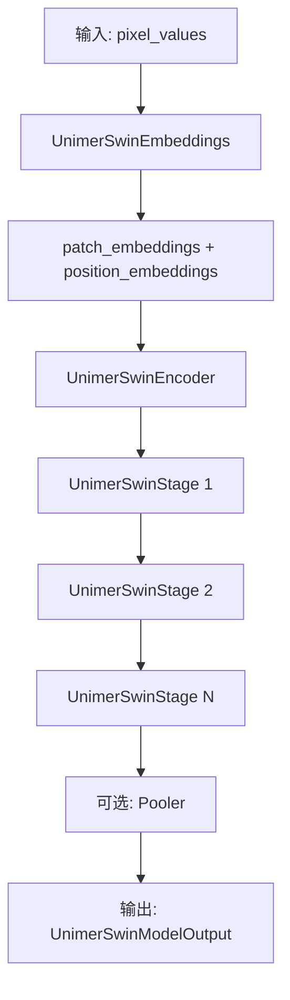

## 类结构

```
UnimerSwinPreTrainedModel (抽象基类)
└── UnimerSwinModel (主模型类)
    ├── UnimerSwinEmbeddings (嵌入层)
    │   ├── UnimerSwinPatchEmbeddings
    │   └── StemLayer
    ├── UnimerSwinEncoder (编码器)
    │   └── UnimerSwinStage × N
    │       └── UnimerSwinLayer × depth
    │           ├── UnimerSwinAttention
    │           │   ├── UnimerSwinSelfAttention
    │           │   └── UnimerSwinSelfOutput
    │           ├── UnimerSwinIntermediate
    │           ├── UnimerSwinOutput
    │           └── ConvEnhance × 2
    └── nn.AdaptiveAvgPool1d (池化层)
```

## 全局变量及字段


### `logger`
    
用于记录日志的全局日志记录器对象

类型：`logging.Logger`
    


### `_CONFIG_FOR_DOC`
    
文档字符串中使用的配置类名称

类型：`str`
    


### `_CHECKPOINT_FOR_DOC`
    
文档中引用的预训练模型检查点URL

类型：`str`
    


### `_EXPECTED_OUTPUT_SHAPE`
    
模型预期输出形状列表[batch, sequence_length, hidden_size]

类型：`List[int]`
    


### `UnimerSwinEncoderOutput.last_hidden_state`
    
编码器最后一层的隐藏状态，形状为(batch_size, sequence_length, hidden_size)

类型：`torch.FloatTensor`
    


### `UnimerSwinEncoderOutput.hidden_states`
    
所有层的隐藏状态元组，包含初始嵌入和每层输出

类型：`Optional[Tuple[torch.FloatTensor, ...]]`
    


### `UnimerSwinEncoderOutput.attentions`
    
所有注意力层的注意力权重元组

类型：`Optional[Tuple[torch.FloatTensor, ...]]`
    


### `UnimerSwinEncoderOutput.reshaped_hidden_states`
    
重塑为(batch_size, hidden_size, height, width)格式的隐藏状态元组

类型：`Optional[Tuple[torch.FloatTensor, ...]]`
    


### `UnimerSwinModelOutput.last_hidden_state`
    
模型最后一层的隐藏状态

类型：`torch.FloatTensor`
    


### `UnimerSwinModelOutput.pooler_output`
    
平均池化后的最后一层隐藏状态，形状为(batch_size, hidden_size)

类型：`Optional[torch.FloatTensor]`
    


### `UnimerSwinModelOutput.hidden_states`
    
模型所有层的隐藏状态元组

类型：`Optional[Tuple[torch.FloatTensor, ...]]`
    


### `UnimerSwinModelOutput.attentions`
    
模型所有注意力层的注意力权重元组

类型：`Optional[Tuple[torch.FloatTensor, ...]]`
    


### `UnimerSwinModelOutput.reshaped_hidden_states`
    
重塑为包含空间维度的隐藏状态元组

类型：`Optional[Tuple[torch.FloatTensor, ...]]`
    


### `UnimerSwinEmbeddings.patch_embeddings`
    
将像素值转换为补丁嵌入的模块

类型：`UnimerSwinPatchEmbeddings`
    


### `UnimerSwinEmbeddings.patch_grid`
    
补丁网格的尺寸(height, width)

类型：`tuple`
    


### `UnimerSwinEmbeddings.mask_token`
    
用于掩码训练的掩码令牌参数

类型：`nn.Parameter`
    


### `UnimerSwinEmbeddings.position_embeddings`
    
位置嵌入参数，用于编码序列位置信息

类型：`nn.Parameter`
    


### `UnimerSwinEmbeddings.row_embeddings`
    
2D嵌入模式的行位置嵌入参数

类型：`nn.Parameter`
    


### `UnimerSwinEmbeddings.column_embeddings`
    
2D嵌入模式的列位置嵌入参数

类型：`nn.Parameter`
    


### `UnimerSwinEmbeddings.norm`
    
对嵌入进行层归一化的模块

类型：`nn.LayerNorm`
    


### `UnimerSwinEmbeddings.dropout`
    
对嵌入应用dropout的模块

类型：`nn.Dropout`
    


### `StemLayer.conv1`
    
Stem层第一个卷积层，用于初步特征提取

类型：`nn.Conv2d`
    


### `StemLayer.norm1`
    
第一个卷积后的归一化层序列

类型：`nn.Sequential`
    


### `StemLayer.act`
    
激活函数层，使用GELU激活

类型：`nn.GELU`
    


### `StemLayer.conv2`
    
Stem层第二个卷积层，用于进一步特征提取

类型：`nn.Conv2d`
    


### `UnimerSwinPatchEmbeddings.image_size`
    
输入图像的尺寸(height, width)

类型：`tuple`
    


### `UnimerSwinPatchEmbeddings.patch_size`
    
每个补丁的尺寸(height, width)

类型：`tuple`
    


### `UnimerSwinPatchEmbeddings.num_channels`
    
输入图像的通道数

类型：`int`
    


### `UnimerSwinPatchEmbeddings.num_patches`
    
图像生成的补丁总数

类型：`int`
    


### `UnimerSwinPatchEmbeddings.grid_size`
    
补丁网格的尺寸(num_patches_height, num_patches_width)

类型：`tuple`
    


### `UnimerSwinPatchEmbeddings.projection`
    
将图像投影为补丁嵌入的Stem层

类型：`StemLayer`
    


### `UnimerSwinPatchMerging.input_resolution`
    
输入特征的分辨率(height, width)

类型：`Tuple[int]`
    


### `UnimerSwinPatchMerging.dim`
    
输入特征的通道维度

类型：`int`
    


### `UnimerSwinPatchMerging.reduction`
    
将4倍维度降至2倍的线性变换层

类型：`nn.Linear`
    


### `UnimerSwinPatchMerging.norm`
    
补丁合并前的归一化层

类型：`nn.LayerNorm`
    


### `UnimerSwinDropPath.drop_prob`
    
随机深度路径丢弃的概率

类型：`Optional[float]`
    


### `UnimerSwinSelfAttention.num_attention_heads`
    
注意力头的数量

类型：`int`
    


### `UnimerSwinSelfAttention.attention_head_size`
    
每个注意力头的维度大小

类型：`int`
    


### `UnimerSwinSelfAttention.all_head_size`
    
所有注意力头的总维度大小

类型：`int`
    


### `UnimerSwinSelfAttention.window_size`
    
窗口注意力机制的窗口尺寸

类型：`tuple`
    


### `UnimerSwinSelfAttention.relative_position_bias_table`
    
相对位置偏置查找表参数

类型：`nn.Parameter`
    


### `UnimerSwinSelfAttention.relative_position_index`
    
注册的相对位置索引缓冲区

类型：`register_buffer`
    


### `UnimerSwinSelfAttention.query`
    
计算查询向量的线性层

类型：`nn.Linear`
    


### `UnimerSwinSelfAttention.key`
    
计算键向量的线性层

类型：`nn.Linear`
    


### `UnimerSwinSelfAttention.value`
    
计算值向量的线性层

类型：`nn.Linear`
    


### `UnimerSwinSelfAttention.dropout`
    
注意力概率的dropout层

类型：`nn.Dropout`
    


### `UnimerSwinSelfOutput.dense`
    
自注意力输出的线性变换层

类型：`nn.Linear`
    


### `UnimerSwinSelfOutput.dropout`
    
自注意力输出的dropout层

类型：`nn.Dropout`
    


### `UnimerSwinAttention.self`
    
自注意力机制模块

类型：`UnimerSwinSelfAttention`
    


### `UnimerSwinAttention.output`
    
自注意力输出模块

类型：`UnimerSwinSelfOutput`
    


### `UnimerSwinAttention.pruned_heads`
    
已剪枝的注意力头集合

类型：`set`
    


### `UnimerSwinIntermediate.dense`
    
中间FFN的线性投影层

类型：`nn.Linear`
    


### `UnimerSwinIntermediate.intermediate_act_fn`
    
中间层的激活函数

类型：`Callable`
    


### `UnimerSwinOutput.dense`
    
FFN输出的线性投影层

类型：`nn.Linear`
    


### `UnimerSwinOutput.dropout`
    
FFN输出的dropout层

类型：`nn.Dropout`
    


### `ConvEnhance.proj`
    
深度卷积投影层，用于提取位置信息

类型：`nn.Conv2d`
    


### `ConvEnhance.act_fn`
    
卷积增强后的激活函数

类型：`Callable`
    


### `UnimerSwinLayer.chunk_size_feed_forward`
    
前馈网络分块处理的块大小

类型：`int`
    


### `UnimerSwinLayer.shift_size`
    
窗口移位的像素数，用于SW-MSA

类型：`int`
    


### `UnimerSwinLayer.window_size`
    
注意力窗口的尺寸大小

类型：`int`
    


### `UnimerSwinLayer.input_resolution`
    
输入特征的分辨率

类型：`tuple`
    


### `UnimerSwinLayer.layernorm_before`
    
注意力层之前的层归一化

类型：`nn.LayerNorm`
    


### `UnimerSwinLayer.ce`
    
卷积增强模块列表，用于增强特征表示

类型：`nn.ModuleList[ConvEnhance]`
    


### `UnimerSwinLayer.attention`
    
窗口注意力机制模块

类型：`UnimerSwinAttention`
    


### `UnimerSwinLayer.drop_path`
    
随机深度路径丢弃模块

类型：`Union[UnimerSwinDropPath, nn.Identity]`
    


### `UnimerSwinLayer.layernorm_after`
    
注意力层之后的层归一化

类型：`nn.LayerNorm`
    


### `UnimerSwinLayer.intermediate`
    
前馈中间层模块

类型：`UnimerSwinIntermediate`
    


### `UnimerSwinLayer.output`
    
前馈输出层模块

类型：`UnimerSwinOutput`
    


### `UnimerSwinStage.config`
    
模型配置对象

类型：`Any`
    


### `UnimerSwinStage.dim`
    
当前阶段的特征维度

类型：`int`
    


### `UnimerSwinStage.blocks`
    
该阶段所有Swin层的模块列表

类型：`nn.ModuleList[UnimerSwinLayer]`
    


### `UnimerSwinStage.downsample`
    
补丁合并下采样模块

类型：`Optional[UnimerSwinPatchMerging]`
    


### `UnimerSwinStage.pointing`
    
标记是否指向的布尔值

类型：`bool`
    


### `UnimerSwinEncoder.num_layers`
    
编码器中阶段的总数

类型：`int`
    


### `UnimerSwinEncoder.config`
    
模型配置对象

类型：`Any`
    


### `UnimerSwinEncoder.layers`
    
编码器所有阶段的模块列表

类型：`nn.ModuleList[UnimerSwinStage]`
    


### `UnimerSwinEncoder.gradient_checkpointing`
    
梯度检查点标志，用于节省显存

类型：`bool`
    


### `UnimerSwinPreTrainedModel.config_class`
    
模型配置类

类型：`Any`
    


### `UnimerSwinPreTrainedModel.base_model_prefix`
    
基础模型前缀名称

类型：`str`
    


### `UnimerSwinPreTrainedModel.main_input_name`
    
主要输入参数名称

类型：`str`
    


### `UnimerSwinPreTrainedModel.supports_gradient_checkpointing`
    
是否支持梯度检查点

类型：`bool`
    


### `UnimerSwinPreTrainedModel._no_split_modules`
    
不可分割的模块列表

类型：`List[str]`
    


### `UnimerSwinModel.config`
    
模型配置对象

类型：`Any`
    


### `UnimerSwinModel.num_layers`
    
模型层数

类型：`int`
    


### `UnimerSwinModel.num_features`
    
最终特征维度

类型：`int`
    


### `UnimerSwinModel.embeddings`
    
图像嵌入模块

类型：`UnimerSwinEmbeddings`
    


### `UnimerSwinModel.encoder`
    
Transformer编码器模块

类型：`UnimerSwinEncoder`
    


### `UnimerSwinModel.pooler`
    
平均池化层，用于池化序列输出

类型：`Optional[nn.AdaptiveAvgPool1d]`
    
    

## 全局函数及方法


### `window_partition`

将输入特征张量按照指定的窗口大小划分为多个不重叠的窗口块，以便后续进行窗口注意力机制计算。

参数：

- `input_feature`：`torch.Tensor`，形状为 `(batch_size, height, width, num_channels)`，输入的4D特征张量，包含批量大小、高度、宽度和通道数
- `window_size`：`int`，窗口的尺寸大小，用于将输入特征划分为 `window_size × window_size` 的块

返回值：`torch.Tensor`，形状为 `(batch_size * num_windows, window_size, window_size, num_channels)`，划分后的窗口张量，其中 `num_windows = (height // window_size) * (width // window_size)`

#### 流程图

```mermaid
graph TD
    A[开始: window_partition] --> B[获取输入形状<br/>batch_size, height, width, num_channels = input_feature.shape]
    B --> C[重塑张量<br/>view to (batch_size, h//ws, ws, w//ws, ws, num_channels)]
    C --> D[置换维度顺序<br/>permute(0, 1, 3, 2, 4, 5)]
    D --> E[内存连续化<br/>contiguous]
    E --> F[展平为窗口<br/>view to (batch_size*num_windows, ws, ws, num_channels)]
    F --> G[返回划分后的窗口张量]
```

#### 带注释源码

```python
def window_partition(input_feature, window_size):
    """
    Partitions the given input into windows.
    
    该函数将输入的4D特征张量划分为多个非重叠的窗口块。这是Swin Transformer中
    窗口注意力机制（Window Attention）的关键预处理步骤。通过将特征图分割成
    固定大小的窗口，可以大幅降低自注意力的计算复杂度从O(n²)降到O(w²)，其中
    w是窗口大小。
    
    Args:
        input_feature (torch.Tensor): 输入张量，形状为 
            (batch_size, height, width, num_channels)，通常是从图像特征经过
            排列操作后得到的4D张量，通道维在最后
        window_size (int): 窗口大小，决定了每个窗口的边长。
            必须是height和width的因数
    
    Returns:
        torch.Tensor: 划分后的窗口，形状为 
            (batch_size * num_windows, window_size, window_size, num_channels)
            其中 num_windows = (height // window_size) * (width // window_size)
    """
    # 解包获取输入特征的各个维度信息
    # batch_size: 批量大小
    # height: 特征图高度
    # width: 特征图宽度  
    # num_channels: 通道数
    batch_size, height, width, num_channels = input_feature.shape
    
    # 使用view操作将输入特征重塑为包含多个窗口的形状
    # 转换后的形状维度解释:
    # - batch_size: 保持不变
    # - height // window_size: 高度方向上的窗口数量
    # - window_size: 每个窗口的高度
    # - width // window_size: 宽度方向上的窗口数量
    # - window_size: 每个窗口的宽度
    # - num_channels: 保持不变
    # 这一步将特征图划分为 grid_y × grid_x 个窗口
    input_feature = input_feature.view(
        batch_size, height // window_size, window_size, width // window_size, window_size, num_channels
    )
    
    # 使用permute调整维度顺序，将窗口维度重组
    # 从 (batch, grid_y, win_y, grid_x, win_x, channels)
    # 变为 (batch, grid_y, grid_x, win_y, win_x, channels)
    # 这样可以让每个窗口的数据在内存中连续存储
    windows = input_feature.permute(0, 1, 3, 2, 4, 5).contiguous().view(
        -1, window_size, window_size, num_channels
    )
    # 最后使用view将所有窗口展平为一个批量维度和窗口空间维度
    # -1 表示自动计算批量大小 * 窗口数量的结果
    # 最终形状: (batch_size * grid_y * grid_x, window_size, window_size, num_channels)
    # 即 (batch_size * num_windows, window_size, window_size, num_channels)
    
    return windows
```


### `window_reverse`

该函数用于将窗口分区后的特征重新合并成高分辨率特征，是Swin Transformer中窗口注意力机制的关键逆向操作，与`window_partition`函数互为逆操作。

参数：

- `windows`：`torch.Tensor`，分区后的窗口特征，形状为 `(batch_size * num_windows, window_size, window_size, num_channels)`，其中 `num_windows = (height // window_size) * (width // window_size)`
- `window_size`：`int`，窗口大小
- `height`：`int`，原始输入的高度
- `width`：`int`，原始输入的宽度

返回值：`torch.Tensor`，合并后的高分辨率特征，形状为 `(batch_size, height, width, num_channels)`

#### 流程图

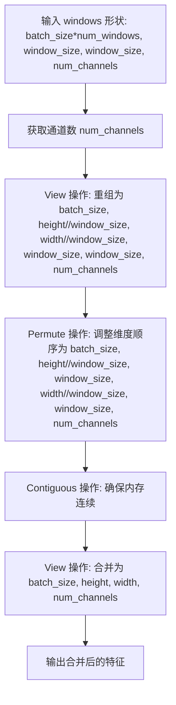

#### 带注释源码

```python
def window_reverse(windows, window_size, height, width):
    """
    Merges windows to produce higher resolution features.
    """
    # 获取最后一个维度的大小，即通道数
    num_channels = windows.shape[-1]
    
    # 将 windows 重新reshape为:
    # batch_size 个 (height//window_size) x (window_size) x (width//window_size) x (window_size) x num_channels
    # 这样可以将每个窗口的空间位置对应回原始特征图的位置
    windows = windows.view(
        -1,                          # batch_size (实际上是 batch_size * num_windows)
        height // window_size,       # 高度方向的窗口数
        width // window_size,        # 宽度方向的窗口数
        window_size,                 # 窗口高度
        window_size,                 # 窗口宽度
        num_channels                 # 通道数
    )
    
    # 使用permute调整维度顺序:
    # 从 (batch, h//ws, w//ws, ws, ws, c) 调整为 (batch, h//ws, ws, w//ws, ws, c)
    # 这样可以让窗口的空间维度与原始特征图的空间维度对应起来
    windows = windows.permute(0, 1, 3, 2, 4, 5).contiguous().view(-1, height, width, num_channels)
    
    # 最后的view操作将所有窗口合并成完整的特征图
    # 输出形状: (batch_size, height, width, num_channels)
    return windows
```


### `drop_path`

该函数实现了随机深度（Stochastic Depth）技术，通过在残差块的主路径上随机丢弃路径来正则化神经网络，从而改善训练稳定性和模型泛化能力。

参数：

- `input`：`torch.Tensor`，输入的张量，通常是残差块的输出
- `drop_prob`：`float`，丢弃路径的概率，值为0到1之间（默认为0.0）
- `training`：`bool`，指示当前是否处于训练模式（默认为False）

返回值：`torch.Tensor`，经过随机深度处理后的输出张量

#### 流程图

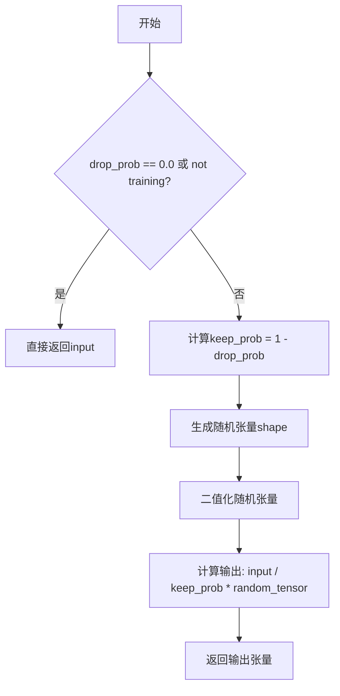

#### 带注释源码

```python
# Copied from transformers.models.beit.modeling_beit.drop_path
def drop_path(input: torch.Tensor, drop_prob: float = 0.0, training: bool = False) -> torch.Tensor:
    """
    Drop paths (Stochastic Depth) per sample (when applied in main path of residual blocks).

    Comment by Ross Wightman: This is the same as the DropConnect impl I created for EfficientNet, etc networks,
    however, the original name is misleading as 'Drop Connect' is a different form of dropout in a separate paper...
    See discussion: https://github.com/tensorflow/tpu/issues/494#issuecomment-532968956 ... I've opted for changing the
    layer and argument names to 'drop path' rather than mix DropConnect as a layer name and use 'survival rate' as the
    argument.
    """
    # 如果drop_prob为0（即不进行随机深度），或者不在训练模式，则直接返回输入，不做任何处理
    if drop_prob == 0.0 or not training:
        return input
    
    # 计算保留概率（survival probability）
    keep_prob = 1 - drop_prob
    
    # 构建与输入张量batch维度相同的随机掩码shape
    # 例如：对于输入shape [B, H, W, C]，生成的shape为 [B, 1, 1, 1]
    # 这种方式使得函数可以处理任意维度的张量，不仅限于2D卷积网络
    shape = (input.shape[0],) + (1,) * (input.ndim - 1)
    
    # 生成随机张量，值域为[0, 1)
    random_tensor = keep_prob + torch.rand(shape, dtype=input.dtype, device=input.device)
    random_tensor.floor_()  # 将随机张量二值化，值变为0或1
    
    # 输出张量计算：将输入除以keep_prob（补偿期望值），然后乘以二值化的随机掩码
    # 这样可以保持输出的期望值与输入一致
    output = input.div(keep_prob) * random_tensor
    
    return output
```


### UnimerSwinEmbeddings.interpolate_pos_encoding

该方法用于在更高分辨率图像上使用模型时，对预训练的位置编码进行插值处理。它通过双线性插值（bicubic）将原始位置编码调整到目标分辨率，以适应不同的输入图像尺寸。

参数：

- `self`：类实例本身，包含位置编码信息
- `embeddings`：`torch.Tensor`，输入的嵌入向量张量，形状为 `(batch_size, sequence_length, hidden_size)`
- `height`：`int`，输入图像的高度（像素单位）
- `width`：`int`，输入图像的宽度（像素单位）

返回值：`torch.Tensor`，插值后的位置编码张量，形状为 `(1, num_patches + 1, hidden_size)`

#### 流程图

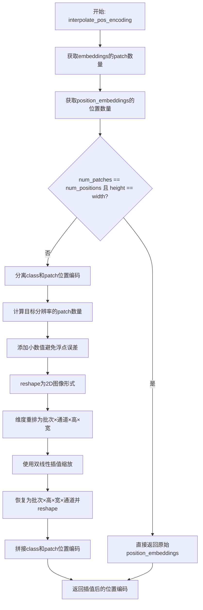

#### 带注释源码

```python
def interpolate_pos_encoding(self, embeddings: torch.Tensor, height: int, width: int) -> torch.Tensor:
    """
    This method allows to interpolate the pre-trained position encodings, to be able to use the model on higher
    resolution images.

    Source:
    https://github.com/facebookresearch/dino/blob/de9ee3df6cf39fac952ab558447af1fa1365362a/vision_transformer.py#L174
    """

    # 计算输入嵌入中的patch数量（减1是因为包含[class] token）
    num_patches = embeddings.shape[1] - 1
    # 计算位置编码中的位置数量（减1是因为第一个位置是[class] token）
    num_positions = self.position_embeddings.shape[1] - 1
    
    # 如果patch数量和位置数量相等，且图像为正方形，则无需插值
    if num_patches == num_positions and height == width:
        return self.position_embeddings
    
    # 分离[class]位置编码和patch位置编码
    class_pos_embed = self.position_embeddings[:, 0]  # [batch, hidden_size]
    patch_pos_embed = self.position_embeddings[:, 1:]  # [batch, num_positions, hidden_size]
    
    # 获取嵌入维度
    dim = embeddings.shape[-1]
    
    # 计算目标分辨率下的patch数量
    h0 = height // self.config.patch_size
    w0 = width // self.config.patch_size
    
    # 添加小数值避免插值时的浮点误差
    # 参考: https://github.com/facebookresearch/dino/issues/8
    h0, w0 = h0 + 0.1, w0 + 0.1
    
    # 将patch位置编码reshape为2D图像形式 [1, sqrt(num_positions), sqrt(num_positions), dim]
    patch_pos_embed = patch_pos_embed.reshape(
        1, 
        int(math.sqrt(num_positions)), 
        int(math.sqrt(num_positions)), 
        dim
    )
    
    # 维度重排: [batch, height, width, channels] -> [batch, channels, height, width]
    patch_pos_embed = patch_pos_embed.permute(0, 3, 1, 2)
    
    # 使用双线性插值进行缩放
    patch_pos_embed = nn.functional.interpolate(
        patch_pos_embed,
        scale_factor=(h0 / math.sqrt(num_positions), w0 / math.sqrt(num_positions)),
        mode="bicubic",
        align_corners=False,
    )
    
    # 恢复维度并reshape回序列形式: [batch, channels, height, width] -> [1, h*w, dim]
    patch_pos_embed = patch_pos_embed.permute(0, 2, 3, 1).view(1, -1, dim)
    
    # 拼接[class] token的位置编码和patch的位置编码
    return torch.cat((class_pos_embed.unsqueeze(0), patch_pos_embed), dim=1)
```


### UnimerSwinEmbeddings.forward

该方法是 UnimerSwin 模型中嵌入层的正向传播函数，负责将输入的像素值（pixel_values）转换为patch嵌入，并可选地添加位置编码（包括2D位置编码）和mask token，最终返回嵌入向量和输出维度信息。

参数：

- `self`：类实例本身，包含模型的配置和参数
- `pixel_values`：`Optional[torch.FloatTensor]`，输入的像素值张量，形状为 `(batch_size, num_channels, height, width)`
- `bool_masked_pos`：`Optional[torch.BoolTensor]`，布尔类型的mask位置张量，形状为 `(batch_size, num_patches)`，用于掩码预训练任务，指示哪些patch被mask
- `interpolate_pos_encoding`：`bool`，是否插值位置编码，默认为 False

返回值：`Tuple[torch.Tensor]`，返回一个元组，包含：
- 嵌入向量 `torch.Tensor`，形状为 `(batch_size, seq_len, embed_dim)`
- 输出维度 `Tuple[int]`，形状为 `(height, width)`

#### 流程图

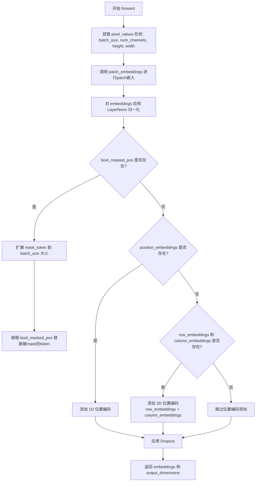

#### 带注释源码

```python
def forward(
    self,
    pixel_values: Optional[torch.FloatTensor],
    bool_masked_pos: Optional[torch.BoolTensor] = None,
    interpolate_pos_encoding: bool = False,
) -> Tuple[torch.Tensor]:
    """
    正向传播函数，将像素值转换为patch嵌入并添加位置编码
    
    参数:
        pixel_values: 输入图像的像素值，形状为 (batch_size, num_channels, height, width)
        bool_masked_pos: 布尔类型的mask位置，用于掩码预训练
        interpolate_pos_encoding: 是否插值位置编码（当前未使用）
    
    返回:
        tuple: (embeddings, output_dimensions)
            - embeddings: 形状为 (batch_size, seq_len, embed_dim) 的嵌入张量
            - output_dimensions: 形状为 (height, width) 的输出维度元组
    """
    # 从像素值中获取批量大小、通道数、高度和宽度
    _, num_channels, height, width = pixel_values.shape
    
    # 通过 patch_embeddings 将像素值转换为 patch 嵌入
    # 返回嵌入向量和输出维度信息
    embeddings, output_dimensions = self.patch_embeddings(pixel_values)
    
    # 对嵌入向量进行 LayerNorm 归一化
    embeddings = self.norm(embeddings)
    
    # 获取嵌入向量的批量大小和序列长度
    batch_size, seq_len, _ = embeddings.size()

    # 如果提供了 bool_masked_pos，则进行掩码处理
    if bool_masked_pos is not None:
        # 将 mask_token 扩展到与批量大小和序列长度相同的维度
        mask_tokens = self.mask_token.expand(batch_size, seq_len, -1)
        # 将 bool_masked_pos 扩展为与 mask_tokens 相同的类型和维度
        mask = bool_masked_pos.unsqueeze(-1).type_as(mask_tokens)
        # 根据 mask 进行替换：未被mask的部分保留原始embeddings，被mask的部分替换为mask_tokens
        # 公式: embeddings = embeddings * (1.0 - mask) + mask_tokens * mask
        # 当 mask=1 时使用 mask_tokens，当 mask=0 时保留原始 embeddings
        embeddings = embeddings * (1.0 - mask) + mask_tokens * mask

    # 如果存在 1D 位置编码（position_embeddings），则添加到embeddings中
    if self.position_embeddings is not None:
        # 截取与序列长度匹配的位置编码并相加
        # 使用 [:seq_len, :] 确保位置编码与patch数量匹配
        embeddings = embeddings + self.position_embeddings[:, :seq_len, :]

    # 如果存在 2D 位置编码（row_embeddings 和 column_embeddings），则添加
    # 这是代码中添加的新功能，用于更精确的空间位置表示
    if self.row_embeddings is not None and self.column_embeddings is not None:
        # 行嵌入：沿y轴重复，以便每个y位置有对应的嵌入
        # repeat_interleave 在指定维度上重复元素
        # 例如: [0,1,2,3] -> [0,0,1,1,2,2,3,3] 当 repeat 次数为 2
        row_embeddings = self.row_embeddings[:, :output_dimensions[0], :].repeat_interleave(output_dimensions[1], dim=1)
        
        # 列嵌入：沿x轴重复，以便每个x位置有对应的嵌入
        # repeat 在指定维度上重复整个张量
        column_embeddings = self.column_embeddings[:, :output_dimensions[1], :].repeat(1, output_dimensions[0], 1)
        
        # 将 2D 位置编码添加到 embeddings 中
        embeddings = embeddings + row_embeddings + column_embeddings

    # 应用 Dropout 以防止过拟合
    embeddings = self.dropout(embeddings)

    # 返回最终的嵌入向量和输出维度
    return embeddings, output_dimensions
```


### `StemLayer.build_norm_layer`

该方法用于构建归一化层，根据传入的归一化类型（目前仅支持 BN）创建相应的归一化模块序列。这是 InternImage 架构中 Stem 层的组成部分，用于对卷积输出进行归一化处理。

参数：

- `dim`：`int`，输入特征的通道数维度
- `norm_layer`：`str`，归一化层的类型标识符，当前支持 'BN'（BatchNorm2d）

返回值：`nn.Sequential`，包含归一化层的顺序容器

#### 流程图

```mermaid
flowchart TD
    A[开始 build_norm_layer] --> B{norm_layer == 'BN'?}
    B -->|Yes| C[创建 nn.BatchNorm2d(dim)]
    B -->|No| D[抛出 NotImplementedError]
    C --> E[将 BatchNorm2d 添加到 layers 列表]
    E --> F[返回 nn.Sequential(*layers)]
    D --> G[结束]
    F --> G
```

#### 带注释源码

```python
def build_norm_layer(self, dim, norm_layer):
    """
    构建归一化层
    
    Args:
        dim (int): 输入特征的通道数
        norm_layer (str): 归一化层类型，当前仅支持 'BN'
    
    Returns:
        nn.Sequential: 包含归一化层的顺序容器
    """
    layers = []
    if norm_layer == 'BN':
        # 如果归一化类型为 BN，创建 BatchNorm2d 层
        layers.append(nn.BatchNorm2d(dim))
    else:
        # 如果不支持的归一化类型，抛出未实现错误
        raise NotImplementedError(f'build_norm_layer does not support {norm_layer}')
    # 将层列表转换为 Sequential 并返回
    return nn.Sequential(*layers)
```


### StemLayer.forward

这是 `StemLayer` 类的前向传播方法，负责对输入图像进行初步的卷积处理，提取特征并降低分辨率。该方法通过两个连续的卷积-归一化-激活块对输入进行处理，是整个模型（InternImage/Swin）的起始特征提取层。

参数：

- `x`：`torch.Tensor`，输入张量，形状为 `(batch_size, in_chans, height, width)`，表示批量图像数据，其中 `in_chans` 默认为 3（RGB 图像）

返回值：`torch.Tensor`，输出张量，形状为 `(batch_size, out_chans, height//4, width//4)`，经过两次步长为 2 的卷积后，高度和宽度各降低 4 倍

#### 流程图

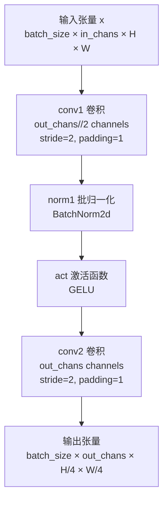

#### 带注释源码

```python
def forward(self, x):
    """
    Stem层的前向传播，对输入图像进行特征提取和下采样
    
    处理流程：
    1. 第一次卷积：将通道数从 in_chans 扩展到 out_chans//2，分辨率减半
    2. 批归一化：对卷积输出进行标准化，加速训练稳定
    3. 激活函数：应用 GELU 激活，增加非线性表达能力
    4. 第二次卷积：将通道数从 out_chans//2 扩展到 out_chans，分辨率再次减半
    
    最终输出高度和宽度均为输入的 1/4，通道数为 out_chans
    
    Args:
        x: 输入张量，形状为 (batch_size, in_chans, height, width)
        
    Returns:
        torch.Tensor: 输出张量，形状为 (batch_size, out_chans, height//4, width//4)
    """
    # 第一次卷积：通道变换 + 空间下采样
    # 输入: (B, 3, H, W) -> 输出: (B, out_chans//2, H/2, W/2)
    x = self.conv1(x)
    
    # 批归一化：规范化特征分布，提高训练稳定性
    x = self.norm1(x)
    
    # 激活函数：GELU 平滑非线性变换
    x = self.act(x)
    
    # 第二次卷积：通道变换 + 空间下采样
    # 输入: (B, out_chans//2, H/2, W/2) -> 输出: (B, out_chans, H/4, W/4)
    x = self.conv2(x)
    
    return x
```


### `UnimerSwinPatchEmbeddings.maybe_pad`

该方法用于对输入的像素值张量进行填充（padding），使其高度和宽度能够被 patch_size 整除，从而确保后续的卷积投影操作能够完整地处理输入图像而不会因尺寸不匹配而产生错误。

参数：

- `self`：类方法的隐含参数，表示 `UnimerSwinPatchEmbeddings` 实例本身
- `pixel_values`：`torch.FloatTensor`，输入的像素值张量，形状为 `(batch_size, num_channels, height, width)`
- `height`：`int`，输入图像的高度
- `width`：`int`，输入图像的宽度

返回值：`torch.FloatTensor`，填充后的像素值张量，形状为 `(batch_size, num_channels, padded_height, padded_width)`，其中 padded_height 和 padded_width 分别是能够被 patch_size 整除的高度和宽度

#### 流程图

```mermaid
flowchart TD
    A[开始 maybe_pad] --> B{width % patch_size[1] != 0?}
    B -- 是 --> C[计算右侧填充宽度 pad_width = patch_size[1] - width % patch_size[1]]
    C --> D[使用 nn.functional.pad 在右侧填充]
    D --> E{height % patch_size[0] != 0?}
    B -- 否 --> E
    E -- 是 --> F[计算底部填充高度 pad_height = patch_size[0] - height % patch_size[0]]
    F --> G[使用 nn.functional.pad 在底部填充]
    E -- 否 --> H[返回填充后的 pixel_values]
    G --> H
    H --> I[结束 maybe_pad]
```

#### 带注释源码

```python
def maybe_pad(self, pixel_values, height, width):
    """
    对输入的像素值张量进行填充，使其尺寸能够被 patch_size 整除。
    
    参数:
        pixel_values: 输入的像素值张量，形状为 (batch_size, num_channels, height, width)
        height: 输入图像的高度
        width: 输入图像的宽度
        
    返回:
        填充后的像素值张量，尺寸能够被 patch_size 整除
    """
    # 检查宽度是否需要填充
    # 如果宽度不能被 patch_size[1] 整除，则在右侧进行填充
    if width % self.patch_size[1] != 0:
        # 计算需要填充的宽度：patch_size[1] - (width % patch_size[1])
        # pad_values 格式为 (left, right, top, bottom)
        pad_values = (0, self.patch_size[1] - width % self.patch_size[1])
        # 使用 PyTorch 的 functional.pad 进行填充，只在右侧填充
        pixel_values = nn.functional.pad(pixel_values, pad_values)
    
    # 检查高度是否需要填充
    # 如果高度不能被 patch_size[0] 整除，则在底部进行填充
    if height % self.patch_size[0] != 0:
        # 计算需要填充的高度：patch_size[0] - (height % patch_size[0])
        # pad_values 格式为 (left, right, top, bottom)
        pad_values = (0, 0, 0, self.patch_size[0] - height % self.patch_size[0])
        # 使用 PyTorch 的 functional.pad 进行填充，只在底部填充
        pixel_values = nn.functional.pad(pixel_values, pad_values)
    
    # 返回填充后的像素值张量
    return pixel_values
```


### `UnimerSwinPatchEmbeddings.forward`

该方法将输入的像素值（pixel_values）转换为Transformer可处理的patch嵌入向量。它首先对输入图像进行填充以满足patch尺寸要求，然后通过StemLayer卷积层进行特征提取，最后将输出特征图展平并转置为序列形式，同时返回输出维度信息供后续网络层使用。

#### 参数

- `pixel_values`：`Optional[torch.FloatTensor]`，形状为`(batch_size, num_channels, height, width)`的输入图像张量

#### 返回值

- `Tuple[torch.Tensor, Tuple[int]]`：返回一个元组，包含：
  - `embeddings`：`torch.Tensor`，形状为`(batch_size, seq_length, hidden_size)`的patch嵌入向量
  - `output_dimensions`：`Tuple[int]`，输出特征图的高度和宽度`(height, width)`

#### 流程图

```mermaid
flowchart TD
    A[输入 pixel_values] --> B[获取输入形状: batch_size, num_channels, height, width]
    B --> C[调用 maybe_pad 进行填充]
    C --> D[通过 self.projection 卷积层]
    D --> E[获取输出形状: batch_size, hidden_size, height, width]
    E --> F[记录 output_dimensions = (height, width)]
    F --> G[flatten(2) 展平空间维度]
    G --> H[transpose(1, 2) 交换维度]
    H --> I[返回 embeddings 和 output_dimensions]
```

#### 带注释源码

```python
def forward(self, pixel_values: Optional[torch.FloatTensor]) -> Tuple[torch.Tensor, Tuple[int]]:
    """
    将像素值转换为patch嵌入向量
    
    参数:
        pixel_values: 输入图像张量，形状为 (batch_size, num_channels, height, width)
    
    返回:
        embeddings: patch嵌入向量，形状为 (batch_size, seq_length, hidden_size)
        output_dimensions: 输出维度 (height, width)
    """
    # 获取输入形状信息
    _, num_channels, height, width = pixel_values.shape
    
    # 步骤1: 填充输入使其可被 patch_size 整除
    # 调用 maybe_pad 方法处理边界情况
    pixel_values = self.maybe_pad(pixel_values, height, width)
    
    # 步骤2: 通过卷积层进行特征提取
    # 这里使用 StemLayer 替代了原始的 Conv2d，以增强特征提取能力
    embeddings = self.projection(pixel_values)
    
    # 步骤3: 获取输出特征图的形状
    _, _, height, width = embeddings.shape
    
    # 步骤4: 记录输出维度，供后续网络层使用（如位置编码插值）
    output_dimensions = (height, width)
    
    # 步骤5: 展平空间维度并转置
    # 从 (batch_size, hidden_size, height, width) 
    # 转换为 (batch_size, height*width, hidden_size)
    # 即 (batch_size, seq_length, hidden_size)
    embeddings = embeddings.flatten(2).transpose(1, 2)
    
    # 返回嵌入向量和输出维度
    return embeddings, output_dimensions


def maybe_pad(self, pixel_values, height, width):
    """确保输入宽度和高度可被 patch_size 整除"""
    # 检查宽度是否需要填充
    if width % self.patch_size[1] != 0:
        pad_values = (0, self.patch_size[1] - width % self.patch_size[1])
        pixel_values = nn.functional.pad(pixel_values, pad_values)
    # 检查高度是否需要填充
    if height % self.patch_size[0] != 0:
        pad_values = (0, 0, 0, self.patch_size[0] - height % self.patch_size[0])
        pixel_values = nn.functional.pad(pixel_values, pad_values)
    return pixel_values
```


### `UnimerSwinPatchMerging.maybe_pad`

该方法用于在Patch Merging操作前对输入特征进行填充，确保输入的高度和宽度能够被2整除，以便后续进行4个相邻patch的拼接操作。

参数：

- `input_feature`：`torch.Tensor`，输入的特征张量，形状为 `(batch_size, height, width, num_channels)`
- `height`：`int`，输入特征的高度
- `width`：`int`，输入特征的宽度

返回值：`torch.Tensor`，填充后的特征张量，如果不需要填充则返回原始输入

#### 流程图

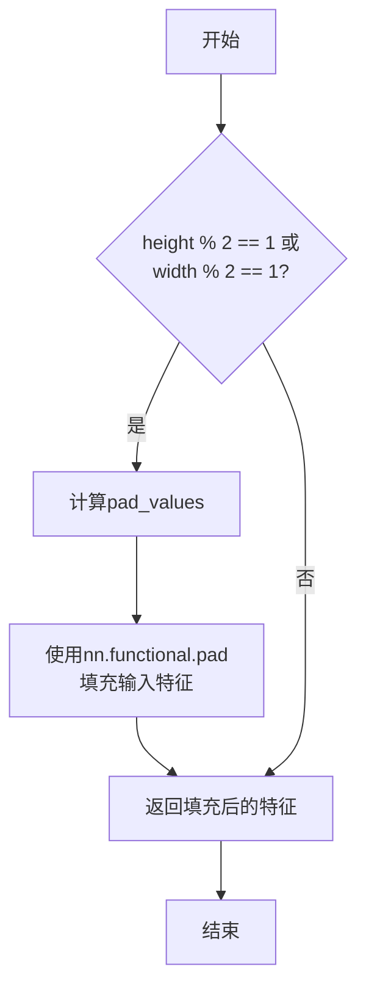

#### 带注释源码

```python
def maybe_pad(self, input_feature, height, width):
    """
    如果输入特征的宽高不能被2整除，则对其进行填充操作。
    这是Patch Merging层的必要预处理步骤，确保后续的2x2下采样能够正确执行。
    
    参数:
        input_feature: 输入特征张量，形状为 (batch_size, height, width, num_channels)
        height: 输入特征的高度
        width: 输入特征的宽度
        
    返回:
        填充后的特征张量
    """
    # 判断是否需要进行填充
    should_pad = (height % 2 == 1) or (width % 2 == 1)
    
    # 如果高度或宽度为奇数，则需要进行填充
    if should_pad:
        # 计算填充值
        # pad_values 格式为 (left, right, top, bottom)
        # 当 width 为奇数时，width % 2 = 1，需要在右侧填充1列
        # 当 height 为奇数时，height % 2 = 1，需要在底部填充1行
        pad_values = (0, 0, 0, width % 2, 0, height % 2)
        
        # 使用 PyTorch 的 functional.pad 进行填充
        # 填充顺序: (left, right, top, bottom)
        input_feature = nn.functional.pad(input_feature, pad_values)
    
    return input_feature
```


### `UnimerSwinPatchMerging.forward`

该方法是UnimerSwinPatchMerging类的前向传播函数，实现Swin Transformer中的Patch Merging操作，通过对相邻patch进行下采样合并来减少空间分辨率并增加通道维度。

参数：

- `input_feature`：`torch.Tensor`，输入特征张量，形状为(batch_size, height*width, num_channels)
- `input_dimensions`：`Tuple[int, int]`，输入的空间维度(height, width)

返回值：`torch.Tensor`，经过patch merging后的输出张量，形状为(batch_size, (height/2)*(width/2), 2*num_channels)

#### 流程图

```mermaid
flowchart TD
    A[input_feature: (B, H×W, C)] --> B[获取height, width from input_dimensions]
    B --> C[获取batch_size, dim, num_channels]
    C --> D[reshape to (B, H, W, C)]
    D --> E{maybe_pad检查}
    E -->|需要填充| F[pad input_feature]
    E -->|不需要填充| G[继续]
    F --> G
    G --> H[提取4个下采样patch<br/>input_feature_0: 0::2, 0::2<br/>input_feature_1: 1::2, 0::2<br/>input_feature_2: 0::2, 1::2<br/>input_feature_3: 1::2, 1::2]
    H --> I[concat: (B, H/2, W/2, 4*C)]
    I --> J[reshape: (B, H/2×W/2, 4*C)]
    J --> K[norm: LayerNorm(4*C)]
    K --> L[reduction: Linear(4*C → 2*C)]
    L --> M[output: (B, H/2×W/2, 2*C)]
```

#### 带注释源码

```python
def forward(self, input_feature: torch.Tensor, input_dimensions: Tuple[int, int]) -> torch.Tensor:
    """
    Patch Merging Layer的前向传播方法。
    
    参数:
        input_feature: 输入特征张量，形状为 (batch_size, height*width, num_channels)
        input_dimensions: 输入的空间维度元组 (height, width)
    
    返回:
        经过patch merging后的张量，形状为 (batch_size, (height/2)*(width/2), 2*num_channels)
    """
    # 从input_dimensions解包出高度和宽度
    height, width = input_dimensions
    # `dim` 表示 height * width
    # 获取输入特征的形状信息
    batch_size, dim, num_channels = input_feature.shape

    # 将输入特征从 (batch_size, height*width, num_channels) 
    # reshape 为 (batch_size, height, width, num_channels)
    input_feature = input_feature.view(batch_size, height, width, num_channels)
    
    # 如果需要，对输入进行填充使其可被width和height整除
    input_feature = self.maybe_pad(input_feature, height, width)
    
    # [batch_size, height/2, width/2, num_channels]
    # 通过步长为2的切片提取左上区域
    input_feature_0 = input_feature[:, 0::2, 0::2, :]
    # [batch_size, height/2, width/2, num_channels]
    # 通过步长为2的切片提取右上区域
    input_feature_1 = input_feature[:, 1::2, 0::2, :]
    # [batch_size, height/2, width/2, num_channels]
    # 通过步长为2的切片提取左下区域
    input_feature_2 = input_feature[:, 0::2, 1::2, :]
    # [batch_size, height/2, width/2, num_channels]
    # 通过步长为2的切片提取右下区域
    input_feature_3 = input_feature[:, 1::2, 1::2, :]
    
    # 将四个patch在通道维度上拼接
    # 结果形状: batch_size, height/2, width/2, 4*num_channels
    input_feature = torch.cat([input_feature_0, input_feature_1, input_feature_2, input_feature_3], -1)
    
    # reshape为 (batch_size, height/2*width/2, 4*num_channels)
    input_feature = input_feature.view(batch_size, -1, 4 * num_channels)

    # 应用LayerNorm归一化
    input_feature = self.norm(input_feature)
    # 通过线性层进行维度压缩: 4*dim -> 2*dim
    input_feature = self.reduction(input_feature)

    return input_feature
```


### `UnimerSwinDropPath.forward`

该方法是 `UnimerSwinDropPath` 类的成员方法，实现了 Stochastic Depth（随机深度）技术，用于在残差块的主路径上按样本随机丢弃路径，以减少过拟合。

参数：

- `hidden_states`：`torch.Tensor`，输入的隐藏状态张量，形状为任意维度

返回值：`torch.Tensor`，经过随机深度处理后的张量，形状与输入相同

#### 流程图

```mermaid
flowchart TD
    A[开始: hidden_states输入] --> B{drop_prob == 0.0<br/>或 not training?}
    B -->|Yes| C[直接返回input]
    B -->|No| D[计算keep_prob = 1 - drop_prob]
    D --> E[生成随机张量shape<br/>= batch_size + 1*(dim-1)]
    E --> F[random_tensor = keep_prob<br/>+ torch.rand<br/>结果向下取整]
    F --> G[output = input / keep_prob<br/>* random_tensor]
    G --> H[返回output]
```

#### 带注释源码

```python
def forward(self, hidden_states: torch.Tensor) -> torch.Tensor:
    """
    执行随机深度（Drop Path）操作。
    
    参数:
        hidden_states: 输入的隐藏状态张量，形状为 (batch_size, ...)
    
    返回:
        经过随机深度处理后的张量，形状与输入相同
    """
    # 调用 drop_path 工具函数，传入：
    # - hidden_states: 输入张量
    # - self.drop_prob: 丢弃概率
    # - self.training: 当前是否处于训练模式
    return drop_path(hidden_states, self.drop_prob, self.training)
```


### `UnimerSwinDropPath.extra_repr`

该方法用于为 `UnimerSwinDropPath` 模块提供额外的字符串表示信息，通常在打印模型或调试时显示 dropout 概率值。

参数：无（仅包含 `self`）

返回值：`str`，返回描述 dropout 概率的字符串，格式为 `p={drop_prob}`。

#### 流程图

```mermaid
flowchart TD
    A[开始 extra_repr] --> B{self.drop_prob 是否为 None}
    B -->|是| C[返回 'p=None']
    B -->|否| D[返回 f'p={self.drop_prob}']
    C --> E[结束]
    D --> E
```

#### 带注释源码

```python
def extra_repr(self) -> str:
    """
    提供额外的字符串表示信息，用于模型打印和调试。
    
    Returns:
        str: 格式化字符串，包含当前的 drop_prob 值。
             格式为 'p={drop_prob}'，例如 'p=0.1' 或 'p=None'。
    """
    return "p={}".format(self.drop_prob)
```


### `UnimerSwinSelfAttention.transpose_for_scores`

该方法用于将输入张量重新整形并置换维度，以便进行自注意力分数计算。它将隐藏状态的形状从 (batch_size, seq_length, hidden_size) 转换为 (batch_size, num_heads, seq_length, head_size)，从而支持多头注意力的并行计算。

参数：

- `x`：`torch.Tensor`，输入的张量，通常是经过线性层变换后的查询、键或值张量，形状为 (batch_size, seq_length, all_head_size)

返回值：`torch.Tensor`，重新整形和置换后的张量，形状为 (batch_size, num_attention_heads, seq_length, attention_head_size)

#### 流程图

```mermaid
flowchart TD
    A[输入张量 x] --> B[获取原始形状<br/>x.size()[:-1]]
    B --> C[构建新形状<br/>原形状 + (num_attention_heads, attention_head_size)]
    C --> D[使用 view 重新整形<br/>x.view(new_x_shape)]
    D --> E[使用 permute 置换维度<br/>x.permute(0, 2, 1, 3)]
    E --> F[输出张量<br/>(batch, num_heads, seq_len, head_size)]
    
    style A fill:#e1f5fe
    style F fill:#e8f5e8
```

#### 带注释源码

```python
def transpose_for_scores(self, x):
    """
    将输入张量重新整形为多头注意力所需的形状。
    
    该方法将形状为 (batch_size, seq_length, hidden_size) 的张量
    转换为 (batch_size, num_heads, seq_length, head_size) 的形状，
    以便进行并行多头注意力计算。
    
    参数:
        x: 输入张量，形状为 (batch_size, seq_length, all_head_size)
           其中 all_head_size = num_attention_heads * attention_head_size
    
    返回:
        重新整形后的张量，形状为 (batch_size, num_attention_heads, 
                 seq_length, attention_head_size)
    """
    # 获取输入张量除最后一维外的所有维度，并在末尾添加注意力头数和每个头的维度
    # 例如: (batch_size, seq_length, hidden_size) -> (batch_size, seq_length, num_heads, head_size)
    new_x_shape = x.size()[:-1] + (self.num_attention_heads, self.attention_head_size)
    
    # 使用 view 方法重新整形张量，将隐藏大小拆分为多头
    x = x.view(new_x_shape)
    
    # 使用 permute 重新排列维度顺序
    # 从 (batch, seq, num_heads, head_size) -> (batch, num_heads, seq, head_size)
    # 这样每个注意力头可以独立计算注意力分数
    return x.permute(0, 2, 1, 3)
```


### `UnimerSwinSelfAttention.forward`

实现 Swin Transformer 的自注意力机制，负责计算查询、键、值的点积注意力，并加入相对位置偏置。

参数：

- `hidden_states`：`torch.Tensor`，输入的隐藏状态张量，形状为 `(batch_size, num_channels, hidden_size)`
- `attention_mask`：`Optional[torch.FloatTensor]`，注意力掩码，用于遮蔽特定位置的注意力权重
- `head_mask`：`Optional[torch.FloatTensor]`，头掩码，用于遮蔽特定注意力头的输出
- `output_attentions`：`Optional[bool]`，是否返回注意力权重

返回值：`Tuple[torch.Tensor]`，包含上下文层 `context_layer` 和可选的注意力概率 `attention_probs`

#### 流程图

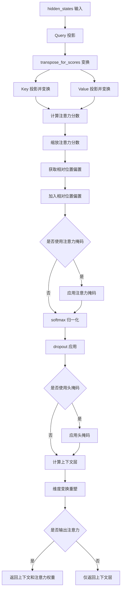

#### 带注释源码

```python
def forward(
    self,
    hidden_states: torch.Tensor,
    attention_mask: Optional[torch.FloatTensor] = None,
    head_mask: Optional[torch.FloatTensor] = None,
    output_attentions: Optional[bool] = False,
) -> Tuple[torch.Tensor]:
    # 获取输入维度信息：batch_size, num_channels, hidden_size
    batch_size, dim, num_channels = hidden_states.shape
    
    # 1. 对 hidden_states 进行 Query 投影，得到混合查询层
    # 使用单一线性层将输入映射到查询空间
    mixed_query_layer = self.query(hidden_states)

    # 2. 对 hidden_states 分别进行 Key 和 Value 的投影
    # 并通过 transpose_for_scores 变换维度以便计算注意力分数
    # 变换后形状: (batch_size, num_heads, seq_len, head_size)
    key_layer = self.transpose_for_scores(self.key(hidden_states))
    value_layer = self.transpose_for_scores(self.value(hidden_states))
    query_layer = self.transpose_for_scores(mixed_query_layer)

    # 3. 计算原始注意力分数
    # 对 query 和 key 进行矩阵乘法，得到原始注意力分数
    # 形状: (batch_size, num_heads, seq_len, seq_len)
    attention_scores = torch.matmul(query_layer, key_layer.transpose(-1, -2))

    # 4. 缩放注意力分数
    # 除以 sqrt(attention_head_size) 进行缩放，防止梯度消失/爆炸
    attention_scores = attention_scores / math.sqrt(self.attention_head_size)

    # 5. 获取相对位置偏置
    # 从预定义的相对位置偏置表中提取当前窗口的偏置值
    # 形状: (window_size*window_size, window_size*window_size, num_heads)
    relative_position_bias = self.relative_position_bias_table[self.relative_position_index.view(-1)]
    relative_position_bias = relative_position_bias.view(
        self.window_size[0] * self.window_size[1], self.window_size[0] * self.window_size[1], -1
    )

    # 6. 对相对位置偏置进行维度调整并加入注意力分数
    # 调整形状以便广播到注意力分数张量
    relative_position_bias = relative_position_bias.permute(2, 0, 1).contiguous()
    attention_scores = attention_scores + relative_position_bias.unsqueeze(0)

    # 7. 应用注意力掩码（如果提供）
    # 用于遮蔽特定位置，使其不参与注意力计算
    if attention_mask is not None:
        # 调整注意力掩码形状以匹配注意力分数
        mask_shape = attention_mask.shape[0]
        attention_scores = attention_scores.view(
            batch_size // mask_shape, mask_shape, self.num_attention_heads, dim, dim
        )
        # 广播掩码到注意力分数
        attention_scores = attention_scores + attention_mask.unsqueeze(1).unsqueeze(0)
        # 恢复原始形状
        attention_scores = attention_scores.view(-1, self.num_attention_heads, dim, dim)

    # 8. 将注意力分数归一化为概率分布
    # 使用 softmax 函数在最后一个维度上进行归一化
    attention_probs = nn.functional.softmax(attention_scores, dim=-1)

    # 9. 应用 dropout，防止过拟合
    # 这是原始 Transformer 论文中提出的技术
    attention_probs = self.dropout(attention_probs)

    # 10. 应用头掩码（如果提供）
    # 用于遮蔽特定的注意力头
    if head_mask is not None:
        attention_probs = attention_probs * head_mask

    # 11. 计算上下文层
    # 将注意力概率与 value 相乘，得到上下文表示
    context_layer = torch.matmul(attention_probs, value_layer)
    
    # 12. 调整上下文层维度顺序
    # 从 (batch, heads, seq, head_size) 调整为 (batch, seq, heads, head_size)
    context_layer = context_layer.permute(0, 2, 1, 3).contiguous()
    
    # 13. 重新调整形状，将多头合并为单头
    # 形状: (batch, seq, all_head_size)
    new_context_layer_shape = context_layer.size()[:-2] + (self.all_head_size,)
    context_layer = context_layer.view(new_context_layer_shape)

    # 14. 根据 output_attentions 决定返回内容
    # 如果需要输出注意力权重，返回 (context_layer, attention_probs)
    # 否则只返回 context_layer
    outputs = (context_layer, attention_probs) if output_attentions else (context_layer,)

    return outputs
```


### `UnimerSwinSelfOutput.forward`

这是 UnimerSwinTransformer 模型中的自注意力输出层，负责对自注意力机制的输出进行线性变换和 dropout 处理。该类是 SwinTransformer 标准实现的副本，经过轻微修改以适配 UniMER 项目。

参数：

- `hidden_states`：`torch.Tensor`，输入的隐藏状态张量，形状为 `(batch_size, seq_length, hidden_size)`
- `input_tensor`：`torch.Tensor`，输入张量（残差连接中的原始输入），在该实现中未被使用，仅为保持接口一致性而保留

返回值：`torch.Tensor`，经过全连接层变换和 dropout 后的隐藏状态张量，形状与输入 `hidden_states` 相同

#### 流程图

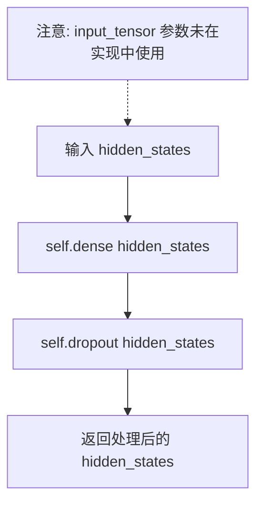

#### 带注释源码

```python
class UnimerSwinSelfOutput(nn.Module):
    """
    自注意力机制的输出层，负责对注意力输出进行线性变换和 dropout。
    这是一个标准的 Transformer 前馈网络块。
    """
    
    def __init__(self, config, dim):
        """
        初始化自注意力输出层
        
        参数:
            config: 模型配置对象，包含隐藏层dropout概率等参数
            dim: 输入/输出的隐藏维度
        """
        super().__init__()
        # 全连接层，将隐藏状态从 dim 维度映射到 dim 维度
        self.dense = nn.Linear(dim, dim)
        # Dropout 层，根据配置的概率随机丢弃隐藏状态单元
        self.dropout = nn.Dropout(config.attention_probs_dropout_prob)

    def forward(self, hidden_states: torch.Tensor, input_tensor: torch.Tensor) -> torch.Tensor:
        """
        前向传播方法
        
        参数:
            hidden_states: 来自注意力机制的输出张量，形状为 (batch_size, seq_length, hidden_size)
            input_tensor: 原始输入张量，用于残差连接（在该实现中未使用）
            
        返回值:
            经过全连接变换和 dropout 后的隐藏状态张量
        """
        # 通过全连接层进行线性变换
        hidden_states = self.dense(hidden_states)
        # 应用 dropout 以防止过拟合
        hidden_states = self.dropout(hidden_states)

        # 注意：虽然标准实现会包含残差连接 (hidden_states + input_tensor)，
        # 但该实现中直接返回变换后的结果，残差连接在外部的 UnimerSwinAttention 层处理
        return hidden_states
```


### `UnimerSwinAttention.prune_heads`

该方法用于剪枝（移除）注意力机制中的特定注意力头，通过调整线性层的权重矩阵并更新相关的超参数，以减少模型的计算开销和参数量。

参数：

- `heads`：`Set[int]`，需要剪枝的注意力头索引集合

返回值：`None`，该方法直接修改实例状态，不返回任何值

#### 流程图

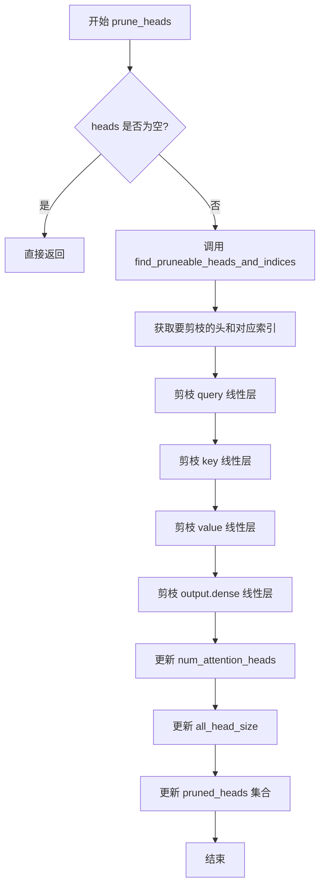

#### 带注释源码

```python
def prune_heads(self, heads: Set[int]) -> None:
    """
    剪枝指定的注意力头
    
    Args:
        heads: 需要剪枝的注意力头索引集合
    
    Returns:
        None: 直接修改实例状态
    """
    # 如果没有要剪枝的头，直接返回
    if len(heads) == 0:
        return
    
    # 找出可以剪枝的头及其对应的索引
    # 参数: 要剪枝的头集合, 注意力头总数, 每个头的维度, 已剪枝的头集合
    heads, index = find_pruneable_heads_and_indices(
        heads, self.self.num_attention_heads, self.self.attention_head_size, self.pruned_heads
    )

    # 剪枝查询(Q)线性层
    self.self.query = prune_linear_layer(self.self.query, index)
    
    # 剪枝键(K)线性层
    self.self.key = prune_linear_layer(self.key, index)
    
    # 剪枝值(V)线性层
    self.self.value = prune_linear_layer(self.value, index)
    
    # 剪枝输出投影线性层 (dim=1 表示按特征维度剪枝)
    self.output.dense = prune_linear_layer(self.output.dense, index, dim=1)

    # 更新超参数：减少注意力头的数量
    self.self.num_attention_heads = self.self.num_attention_heads - len(heads)
    
    # 重新计算所有头的总维度
    self.self.all_head_size = self.self.attention_head_size * self.self.num_attention_heads
    
    # 将新剪枝的头加入到已剪枝集合中
    self.pruned_heads = self.pruned_heads.union(heads)
```


### `UnimerSwinAttention.forward`

该方法是 UnimerSwinTransformer 模型中注意力机制的前向传播实现，封装了自注意力计算（UnimerSwinSelfAttention）和输出线性变换（UnimerSwinSelfOutput），用于计算带有多头注意力的特征表示。

参数：

- `self`：类实例本身，包含自注意力模块（self.self）和输出模块（self.output）
- `hidden_states`：`torch.Tensor`，输入的隐藏状态张量，形状为 (batch_size, num_channels, channels)，用于计算查询、键、值向量
- `attention_mask`：`Optional[torch.FloatTensor]`，可选的注意力掩码张量，用于在注意力计算时屏蔽特定位置
- `head_mask`：`Optional[torch.FloatTensor]`，可选的头掩码张量，用于屏蔽特定注意力头
- `output_attentions`：`Optional[bool]`，是否返回注意力权重，默认为 False

返回值：`Tuple[torch.Tensor]`，包含注意力输出张量以及可选的注意力权重（当 output_attentions 为 True 时）

#### 流程图

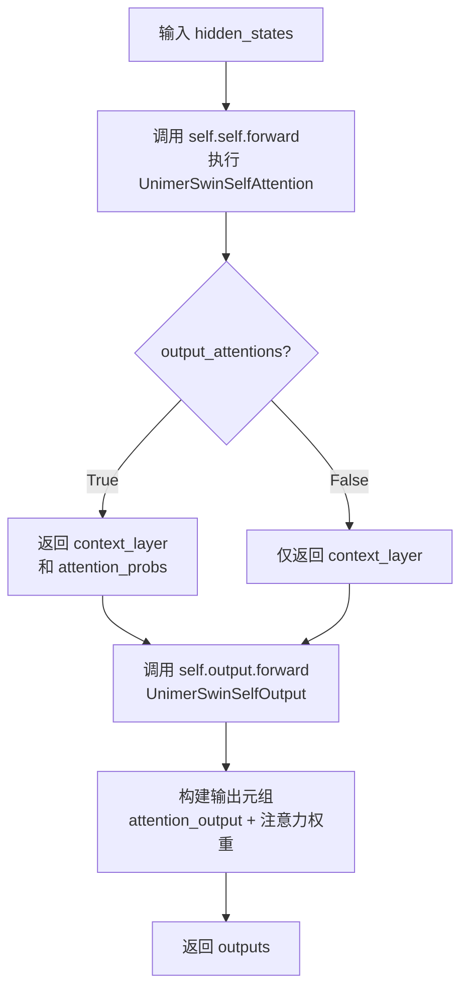

#### 带注释源码

```python
def forward(
    self,
    hidden_states: torch.Tensor,
    attention_mask: Optional[torch.FloatTensor] = None,
    head_mask: Optional[torch.FloatTensor] = None,
    output_attentions: Optional[bool] = False,
) -> Tuple[torch.Tensor]:
    """
    UnimerSwinAttention 的前向传播方法
    
    参数:
        hidden_states: 输入的隐藏状态，形状为 (batch_size, num_channels, channels)
        attention_mask: 可选的注意力掩码，用于屏蔽特定位置
        head_mask: 可选的头掩码，用于屏蔽特定注意力头
        output_attentions: 是否返回注意力权重
    
    返回:
        包含注意力输出和可选注意力权重的元组
    """
    # 调用自注意力模块进行核心注意力计算
    # self.self 是 UnimerSwinSelfAttention 实例
    # 返回 (context_layer, attention_probs) 或仅 (context_layer,)
    self_outputs = self.self(hidden_states, attention_mask, head_mask, output_attentions)
    
    # 将自注意力输出传入输出层
    # self.output 是 UnimerSwinSelfOutput 实例，执行线性变换和 dropout
    # 第一个参数是注意力输出，第二个参数是原始输入（用于残差连接）
    attention_output = self.output(self_outputs[0], hidden_states)
    
    # 组装最终输出元组：注意力输出 + 可选的注意力权重
    # 如果 output_attentions 为 True，则添加 attention_probs
    outputs = (attention_output,) + self_outputs[1:]  # add attentions if we output them
    
    return outputs
```


### `UnimerSwinIntermediate.forward`

该方法实现了 UnimerSwin Transformer 的中间层（FFN），即前馈神经网络部分。首先通过一个线性层将输入的隐藏状态维度扩展到 `mlp_ratio * dim`，然后应用激活函数进行非线性变换，最后返回处理后的隐藏状态。

参数：

- `hidden_states`：`torch.Tensor`，输入的隐藏状态，形状为 `(batch_size, sequence_length, hidden_size)`

返回值：`torch.Tensor`，经过前馈网络处理后的隐藏状态，形状与输入相同 `(batch_size, sequence_length, hidden_size)`

#### 流程图

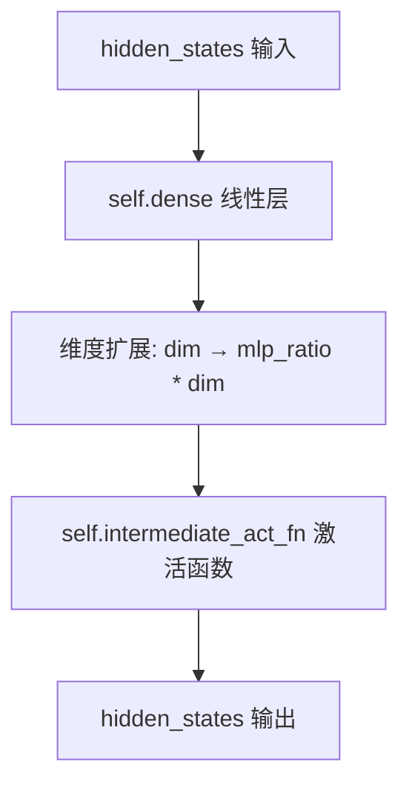

#### 带注释源码

```python
def forward(self, hidden_states: torch.Tensor) -> torch.Tensor:
    """
    UnimerSwin Intermediate Forward Pass
    
    This method implements the feed-forward network (FFN) part of the Swin Transformer block.
    It consists of a linear projection to expand the hidden dimension followed by an activation function.
    
    Args:
        hidden_states (torch.Tensor): Input tensor of shape 
            (batch_size, sequence_length, hidden_size)
    
    Returns:
        torch.Tensor: Output tensor after FFN processing, same shape as input
            (batch_size, sequence_length, hidden_size)
    """
    # Step 1: Apply linear transformation to expand hidden dimension
    # The dimension is expanded from 'dim' to 'int(config.mlp_ratio * dim)'
    # This allows the model to learn more expressive representations
    hidden_states = self.dense(hidden_states)
    
    # Step 2: Apply activation function
    # The activation function is specified in config.hidden_act (e.g., 'gelu', 'relu')
    # ACT2FN is a dictionary mapping activation names to PyTorch functions
    hidden_states = self.intermediate_act_fn(hidden_states)
    
    # Return the processed hidden states
    return hidden_states
```


### UnimerSwinOutput.forward

这是 UnimerSwinOutput 类的前向传播方法，属于 Swin Transformer 的 MLP（多层感知机）块的输出层。该方法接收中间层产生的隐藏状态，通过线性变换和 Dropout 处理后输出。

参数：

- `hidden_states`：`torch.Tensor`，来自中间层（UnimerSwinIntermediate）的隐藏状态张量，形状为 `(batch_size, sequence_length, intermediate_dim)`

返回值：`torch.Tensor`，经过线性变换和 Dropout 后的隐藏状态张量，形状与输入相同 `(batch_size, sequence_length, dim)`

#### 流程图

```mermaid
flowchart TD
    A[开始: hidden_states输入] --> B[线性变换: self.dense]
    B --> C[Dropout: self.dropout]
    C --> D[返回: hidden_states输出]
```

#### 带注释源码

```python
def forward(self, hidden_states: torch.Tensor) -> torch.Tensor:
    """
    UnimerSwinOutput 的前向传播方法
    
    参数:
        hidden_states (torch.Tensor): 来自中间层的隐藏状态张量
        
    返回:
        torch.Tensor: 经过全连接层变换和Dropout后的隐藏状态
    """
    # 第一步：通过全连接层进行维度变换
    # 将中间维度 int(config.mlp_ratio * dim) 映射回原始维度 dim
    hidden_states = self.dense(hidden_states)
    
    # 第二步：应用 Dropout 正则化
    # 按照配置的概率随机丢弃部分神经元输出，防止过拟合
    hidden_states = self.dropout(hidden_states)
    
    # 返回变换后的隐藏状态
    return hidden_states
```


### `ConvEnhance.forward`

该方法实现了一个深度可分离卷积（Depth-wise Convolution）模块，用于增强输入特征的位置信息。它接收形状为 (B, N, C) 的序列特征，将其重塑为 (B, C, H, W) 的图像形式，应用卷积和激活函数后，再将增强的特征加回到原始输入中。

参数：

- `self`：ConvEnhance 实例本身
- `x`：`torch.Tensor`，输入张量，形状为 (batch_size, sequence_length, hidden_dim)，即 (B, N, C)
- `size`：`Tuple[int, int]`，图像的高度和宽度 (H, W)，用于将序列特征重塑为二维图像形式

返回值：`torch.Tensor`，返回增强后的特征张量，形状为 (batch_size, sequence_length, hidden_dim)，即 (B, N, C)

#### 流程图

```mermaid
flowchart TD
    A[输入 x: (B, N, C) 和 size: (H, W)] --> B[从 x 获取 batch_size B, seq_len N, channels C]
    --> C[从 size 获取高度 H 和宽度 W]
    --> D{断言检查 N == H * W}
    D -->|是| E[transpose: (B, N, C) -> (B, C, N)]
    E --> F[view: (B, C, N) -> (B, C, H, W)]
    F --> G[卷积 self.proj: (B, C, H, W) -> (B, C, H, W)]
    --> H[激活函数 self.act_fn]
    --> I[flatten: (B, C, H, W) -> (B, C, H*W)]
    --> J[transpose: (B, C, N) -> (B, N, C)]
    --> K[x = x + feat: 残差连接]
    --> L[输出: (B, N, C)]
    D -->|否| M[抛出断言错误]
```

#### 带注释源码

```python
def forward(self, x, size: Tuple[int, int]):
    """
    ConvEnhance 的前向传播方法，使用深度可分离卷积增强位置信息。
    
    参数:
        x: 输入张量，形状为 (batch_size, sequence_length, hidden_dim)
        size: Tuple[int, int]，表示特征图的高度和宽度 (H, W)
    
    返回:
        增强后的特征张量，形状为 (batch_size, sequence_length, hidden_dim)
    """
    # 获取输入的维度信息
    # B: batch size, N: sequence length, C: hidden dimension
    B, N, C = x.shape
    
    # 从 size 元组获取高度和宽度
    H, W = size
    
    # 断言检查：序列长度必须等于高度乘以宽度
    # 这是为了确保序列可以正确重塑为二维图像形式
    assert N == H * W
    
    # 步骤1: 将输入从 (B, N, C) 转置为 (B, C, N)
    # 这是为了能够 view 成 (B, C, H, W) 的图像形式
    feat = x.transpose(1, 2).view(B, C, H, W)
    
    # 步骤2: 应用深度可分离卷积 (Depth-wise Convolution)
    # groups=dim 表示每个输入通道独立进行卷积，类似于可分离卷积
    # 卷积核大小为 kxk，步长为 1，padding 为 k//2
    feat = self.proj(feat)
    
    # 步骤3: 应用激活函数 (如 GELU, ReLU 等)
    feat = self.act_fn(feat)
    
    # 步骤4: 将特征图展平并转置回 (B, N, C) 形式
    # flatten(2) 将 (B, C, H, W) 变为 (B, C, H*W)
    # transpose(1, 2) 将 (B, C, N) 变为 (B, N, C)
    feat = feat.flatten(2).transpose(1, 2)
    
    # 步骤5: 残差连接，将增强后的特征加到原始输入上
    x = x + feat
    
    # 返回增强后的特征
    return x
```


### `UnimerSwinLayer.set_shift_and_window_size`

该方法用于根据输入分辨率动态调整窗口大小（window_size）和移位大小（shift_size）。当输入分辨率小于等于窗口大小时，强制不进行窗口分区（即将shift_size设为0），同时将window_size调整为输入分辨率的最小值，以适应较小的输入。

参数：

- `input_resolution`：`Tuple[int, int]`，表示输入特征图的高度和宽度，用于决定是否需要调整窗口参数

返回值：`None`，该方法直接修改类的实例属性，不返回任何值

#### 流程图

```mermaid
flowchart TD
    A[开始 set_shift_and_window_size] --> B{检查: min(input_resolution) <= self.window_size}
    B -->|是| C[设置 self.shift_size = 0]
    C --> D{检查: torch.jit.is_tracing()}
    D -->|是| E[self.window_size = torch.min(torch.tensor(input_resolution))]
    D -->|否| F[self.window_size = min(input_resolution)]
    E --> G[结束]
    F --> G
    B -->|否| G
```

#### 带注释源码

```python
def set_shift_and_window_size(self, input_resolution):
    """
    根据输入分辨率设置窗口大小和移位大小。
    
    如果输入分辨率小于等于窗口大小，则不进行窗口分区，
    将shift_size设为0，并将window_size调整为输入分辨率的最小值。
    """
    # 判断输入分辨率是否小于等于配置的窗口大小
    if min(input_resolution) <= self.window_size:
        # 如果窗口大小大于输入分辨率，则不进行窗口分区
        # 将shift_size设为0，表示不使用移位操作
        self.shift_size = torch_int(0)
        
        # 根据是否在JIT追踪模式下，选择合适的最小值计算方式
        # JIT追踪时使用torch.min将输入转为tensor，非追踪时使用Python内置min
        self.window_size = (
            torch.min(torch.tensor(input_resolution)) if torch.jit.is_tracing() else min(input_resolution)
        )
```


### `UnimerSwinLayer.get_attn_mask`

该函数用于计算Shifted Window Multi-Head Self-Attention (SW-MSA)的注意力掩码。当shift_size大于0时，通过创建掩码来区分不同的窗口位置，确保在执行循环移位操作后，不同窗口之间的注意力计算正确。

参数：

- `height`：`int`，输入特征图的高度（经过padding后）
- `width`：`int`，输入特征图的宽度（经过padding后）
- `dtype`：`torch.dtype`，掩码张量的数据类型
- `device`：`torch.device`，掩码张量所在的设备

返回值：`Optional[torch.Tensor]`，返回注意力掩码张量。当shift_size为0时返回None，否则返回形状为`(num_windows, num_windows)`的掩码矩阵，其中num_windows = (height // window_size) * (width // window_size)。

#### 流程图

```mermaid
flowchart TD
    A[开始] --> B{self.shift_size > 0?}
    B -->|否| C[attn_mask = None]
    C --> D[返回 attn_mask]
    B -->|是| E[创建 img_mask 全零张量]
    E --> F[计算 height_slices 切片]
    F --> G[计算 width_slices 切片]
    G --> H[初始化 count = 0]
    H --> I{遍历 height_slices}
    I -->|遍历每个height_slice| J{遍历 width_slices}
    J -->|遍历每个width_slice| K[img_mask[:, height_slice, width_slice, :] = count]
    K --> L[count += 1]
    L --> J
    J -->|width循环结束| M{height循环结束?}
    M -->|否| I
    M -->|是| N[window_partition 分区]
    N --> O[view 操作展平]
    O --> P[计算差值: unsqueeze(1) - unsqueeze(2)]
    P --> Q[masked_fill: 非零值设为-100.0, 零值设为0.0]
    Q --> D
```

#### 带注释源码

```python
def get_attn_mask(self, height, width, dtype, device):
    """
    生成用于Shifted Window MSA的注意力掩码。
    
    当shift_size > 0时，需要创建掩码来处理循环移位后的窗口边界情况。
    掩码确保来自不同位置的token不会互相注意力。
    
    参数:
        height: 填充后的特征图高度
        width: 填充后的特征图宽度
        dtype: 输出张量的数据类型
        device: 输出张量所在的设备
    
    返回:
        注意力掩码张量或None
    """
    if self.shift_size > 0:
        # 计算SW-MSA的注意力掩码
        # 创建一个形状为(1, height, width, 1)的零张量
        # 用于标记每个位置的窗口编号
        img_mask = torch.zeros((1, height, width, 1), dtype=dtype, device=device)
        
        # 将height方向划分为3个切片：
        # slice(0, -window_size): 第一个窗口
        # slice(-window_size, -shift_size): 中间部分
        # slice(-shift_size, None): 最后一个窗口（会移位到前面）
        height_slices = (
            slice(0, -self.window_size),
            slice(-self.window_size, -self.shift_size),
            slice(-self.shift_size, None),
        )
        
        # 将width方向划分为3个切片，与height_slices配合
        width_slices = (
            slice(0, -self.window_size),
            slice(-self.window_size, -self.shift_size),
            slice(-self.shift_size, None),
        )
        
        # 为每个(height_slice, width_slice)组合分配唯一的编号
        # 这样可以区分9个不同的窗口区域
        count = 0
        for height_slice in height_slices:
            for width_slice in width_slices:
                # 将对应区域标记为count值
                img_mask[:, height_slice, width_slice, :] = count
                count += 1
        
        # 使用window_partition将img_mask划分为多个窗口
        # 形状从(1, height, width, 1)变为(num_windows, window_size, window_size, 1)
        mask_windows = window_partition(img_mask, self.window_size)
        
        # 展平窗口，形状变为(num_windows, window_size * window_size)
        mask_windows = mask_windows.view(-1, self.window_size * self.window_size)
        
        # 计算窗口间的注意力掩码
        # 通过广播机制计算每对窗口间的差异
        # 形状: (num_windows, 1, window_size^2) - (num_windows, window_size^2, 1)
        # 结果: (num_windows, window_size^2, window_size^2)
        attn_mask = mask_windows.unsqueeze(1) - mask_windows.unsqueeze(2)
        
        # 将非零值（不同窗口）设为很小的负数(-100.0)，使softmax后注意力接近0
        # 将零值（相同窗口）设为0，保持正常注意力
        attn_mask = attn_mask.masked_fill(attn_mask != 0, float(-100.0)).masked_fill(attn_mask == 0, float(0.0))
    else:
        # 如果shift_size为0，不需要使用移位窗口注意力
        attn_mask = None
    
    return attn_mask
```


### `UnimerSwinLayer.maybe_pad`

该函数用于将输入的隐藏状态张量填充（padding）到能够被窗口大小（window_size）整除的尺寸，以确保Swin Transformer的窗口注意力机制能够正确工作。如果输入尺寸已经能被窗口大小整除，则不进行填充。

参数：

- `hidden_states`：`torch.Tensor`，输入的隐藏状态张量，形状为 `(batch_size, height, width, channels)`
- `height`：`int`，输入张量的高度维度
- `width`：`int`，输入张量的宽度维度

返回值：

- `hidden_states`：`torch.Tensor`，填充后的隐藏状态张量
- `pad_values`：`Tuple[int, int, int, int, int, int]`，填充值元组，格式为 `(left, right, top, bottom)` 的两对值，用于记录填充信息以便后续可能需要移除填充

#### 流程图

```mermaid
flowchart TD
    A[开始 maybe_pad] --> B[计算 pad_right]
    B --> C{width % window_size == 0?}
    C -->|是| D[pad_right = 0]
    C -->|否| E[pad_right = window_size - width % window_size]
    D --> F[计算 pad_bottom]
    E --> F
    F --> G{height % window_size == 0?}
    G -->|是| H[pad_bottom = 0]
    G -->|否| I[pad_bottom = window_size - height % window_size]
    H --> J[构建 pad_values 元组]
    I --> J
    J --> K[调用 nn.functional.pad 进行填充]
    K --> L[返回填充后的张量和 pad_values]
```

#### 带注释源码

```python
def maybe_pad(self, hidden_states, height, width):
    """
    对隐藏状态进行填充，使其高度和宽度能够被 window_size 整除。
    
    参数:
        hidden_states: 输入的隐藏状态张量
        height: 输入高度
        width: 输入宽度
        
    返回:
        填充后的隐藏状态和填充值元组
    """
    # 计算宽度方向需要填充的列数
    # 使用模运算确保：如果是整除的情况，pad_right 为 0；否则为需要补足的差值
    pad_right = (self.window_size - width % self.window_size) % self.window_size
    
    # 计算高度方向需要填充的行数
    pad_bottom = (self.window_size - height % self.window_size) % self.window_size
    
    # 构建填充值元组，格式: (left, right, top, bottom)
    # 这里的 (0, 0, 0, pad_right, 0, pad_bottom) 对应 nn.functional.pad 的参数顺序
    # 实际上 nn.functional.pad 的参数是 (left, right, top, bottom)
    # 但由于我们输入的是 4D 张量 (batch, height, width, channels)
    # PyTorch 会将前两个值应用于最后一个维度（channels），后四个值应用于 height 和 width
    # 仔细看这里的参数: (0, 0, 0, pad_right, 0, pad_bottom)
    # 实际上 nn.functional.pad 对 4D 张量的 pad 参数是 (left, right, top, bottom)
    # 也就是对最后一个维度（channels）不填充，对 height 和 width 填充
    # 正确的解读是: 不填充 channels 维度，right 填充 pad_right，bottom 填充 pad_bottom
    pad_values = (0, 0, 0, pad_right, 0, pad_bottom)
    
    # 使用 PyTorch 的功能填充函数对张量进行零填充
    hidden_states = nn.functional.pad(hidden_states, pad_values)
    
    return hidden_states, pad_values
```


### `UnimerSwinLayer.forward`

该方法是 UnimerSwinTransformer 模型中单个 Swin Transformer 层的核心前向传播实现，负责对输入的隐藏状态进行窗口注意力计算、特征增强和残差连接，最终输出变换后的特征表示。

参数：

- `hidden_states`：`torch.Tensor`，输入的隐藏状态张量，形状为 `(batch_size, seq_length, channels)`
- `input_dimensions`：`Tuple[int, int]`，输入的空间维度，即高度和宽度 `(height, width)`
- `head_mask`：`Optional[torch.FloatTensor]`，可选的头掩码，用于选择性地掩码注意力头，形状为 `(num_heads,)` 或 `(num_layers, num_heads)`
- `output_attentions`：`Optional[bool]`，是否返回注意力权重，默认为 `False`
- `always_partition`：`Optional[bool]`，是否强制执行窗口分区，默认为 `False`

返回值：`Tuple[torch.Tensor, torch.Tensor]`，返回包含层输出和可选注意力权重的元组。如果 `output_attentions` 为 `True`，则返回 `(layer_output, attention_probs)`；否则仅返回 `(layer_output,)`

#### 流程图

```mermaid
flowchart TD
    A[开始 forward] --> B{always_partition?}
    B -->|False| C[set_shift_and_window_size]
    B -->|True| D[跳过设置]
    C --> E[提取 height, width, batch_size, channels]
    E --> F[ce0 增强特征]
    F --> G[保存 shortcut]
    G --> H[LayerNorm 归一化]
    H --> I[reshape 为 height×width×channels]
    I --> J[maybe_pad 填充到 window_size 倍数]
    J --> K{shift_size > 0?}
    K -->|Yes| L[cyclic shift 移动]
    K -->|No| M[直接使用]
    L --> N[window_partition 划分窗口]
    M --> N
    N --> O[get_attn_mask 计算注意力掩码]
    O --> P[attention 计算注意力]
    P --> Q[view 恢复窗口形状]
    Q --> R[window_reverse 合并窗口]
    R --> S{shift_size > 0?}
    S -->|Yes| T[reverse cyclic shift]
    S -->|No| U[直接使用]
    T --> V[去除填充]
    U --> V
    V --> W[reshape 恢复序列形式]
    W --> X[shortcut + drop_path 残差连接]
    X --> Y[ce1 再次特征增强]
    Y --> Z[LayerNorm 归一化]
    Z --> AA[intermediate 前馈网络]
    AA --> AB[output 投影并 dropout]
    AB --> AC[hidden_states + output 残差连接]
    AC --> AD{output_attentions?}
    AD -->|Yes| AE[返回 layer_output, attention_probs]
    AD -->|No| AF[仅返回 layer_output]
```

#### 带注释源码

```python
def forward(
    self,
    hidden_states: torch.Tensor,
    input_dimensions: Tuple[int, int],
    head_mask: Optional[torch.FloatTensor] = None,
    output_attentions: Optional[bool] = False,
    always_partition: Optional[bool] = False,
) -> Tuple[torch.Tensor, torch.Tensor]:
    # 如果不是强制分区模式，则根据输入分辨率设置窗口大小和移位大小
    if not always_partition:
        self.set_shift_and_window_size(input_dimensions)
    else:
        pass
    
    # 解码输入维度：高度和宽度
    height, width = input_dimensions
    # 获取批量大小、通道数
    batch_size, _, channels = hidden_states.size()
    
    # 第一层卷积增强模块，使用 ConvEnhance 进行特征增强
    hidden_states = self.ce[0](hidden_states, input_dimensions)
    # 保存残差连接的 shortcut
    shortcut = hidden_states
    
    # 第一次 LayerNorm 归一化
    hidden_states = self.layernorm_before(hidden_states)
    # 将隐藏状态从 (batch, seq_len, channels) reshape 为 (batch, height, width, channels)
    hidden_states = hidden_states.view(batch_size, height, width, channels)
    
    # pad hidden_states 到 window_size 的倍数，以支持窗口分区
    hidden_states, pad_values = self.maybe_pad(hidden_states, height, width)
    
    # 获取填充后的高度和宽度
    _, height_pad, width_pad, _ = hidden_states.shape
    # 循环移位操作：如果 shift_size > 0，则进行 SW-MSA
    if self.shift_size > 0:
        shifted_hidden_states = torch.roll(hidden_states, shifts=(-self.shift_size, -self.shift_size), dims=(1, 2))
    else:
        shifted_hidden_states = hidden_states
    
    # 窗口分区：将特征划分为不重叠的窗口
    hidden_states_windows = window_partition(shifted_hidden_states, self.window_size)
    hidden_states_windows = hidden_states_windows.view(-1, self.window_size * self.window_size, channels)
    # 计算注意力掩码，用于处理移位窗口中的自注意力
    attn_mask = self.get_attn_mask(
        height_pad, width_pad, dtype=hidden_states.dtype, device=hidden_states_windows.device
    )
    
    # 执行自注意力计算
    attention_outputs = self.attention(
        hidden_states_windows, attn_mask, head_mask, output_attentions=output_attentions
    )
    
    # 获取注意力输出
    attention_output = attention_outputs[0]
    
    # 将注意力输出 reshape 回窗口形式 (window_size, window_size, channels)
    attention_windows = attention_output.view(-1, self.window_size, self.window_size, channels)
    # 窗口反向合并，恢复原始空间结构
    shifted_windows = window_reverse(attention_windows, self.window_size, height_pad, width_pad)
    
    # 反向循环移位：如果之前进行了移位，则恢复
    if self.shift_size > 0:
        attention_windows = torch.roll(shifted_windows, shifts=(self.shift_size, self.shift_size), dims=(1, 2))
    else:
        attention_windows = shifted_windows
    
    # 检查是否进行了填充，如果是则去除填充部分
    was_padded = pad_values[3] > 0 or pad_values[5] > 0
    if was_padded:
        attention_windows = attention_windows[:, :height, :width, :].contiguous()
    
    # 恢复为序列形式 (batch, seq_len, channels)
    attention_windows = attention_windows.view(batch_size, height * width, channels)
    
    # 残差连接：shortcut + drop_path(attention_windows)
    hidden_states = shortcut + self.drop_path(attention_windows)
    
    # 第二层卷积增强模块
    hidden_states = self.ce[1](hidden_states, input_dimensions)
    # 第二次 LayerNorm 归一化
    layer_output = self.layernorm_after(hidden_states)
    # 前馈网络中间层
    layer_output = self.intermediate(layer_output)
    # 前馈网络输出层 + 残差连接
    layer_output = hidden_states + self.output(layer_output)
    
    # 组装输出：如果需要输出注意力，则包含注意力权重
    layer_outputs = (layer_output, attention_outputs[1]) if output_attentions else (layer_output,)
    return layer_outputs
```


### `UnimerSwinStage.forward`

该方法实现了 UnimerSwin 阶段（Stage）的前向传播，负责对输入的隐藏状态进行多层 Transformer 块处理，并在必要时通过下采样层（patch merging）降低空间分辨率。

参数：

- `hidden_states`：`torch.Tensor`，输入的隐藏状态张量，形状为 `(batch_size, sequence_length, channels)`
- `input_dimensions`：`Tuple[int, int]`，输入的空间维度 `(height, width)`
- `head_mask`：`Optional[torch.FloatTensor]`，可选的注意力头掩码，用于控制哪些注意力头被屏蔽
- `output_attentions`：`Optional[bool]`，是否返回所有注意力权重，默认为 `False`
- `always_partition`：`Optional[bool]`，是否强制使用窗口分区，默认为 `False`

返回值：`Tuple[torch.Tensor]`，包含以下元素：

- 第一个元素：处理后的隐藏状态
- 第二个元素：下采样前的隐藏状态
- 第三个元素：输出维度元组 `(height, width, height_downsampled, width_downsampled)`
- 如果 `output_attentions` 为 `True`，还会包含注意力权重

#### 流程图

```mermaid
flowchart TD
    A[输入 hidden_states<br/>input_dimensions] --> B[遍历每一层 layer_module]
    B --> C{当前层索引 i}
    C -->|获取对应 head_mask| D[layer_module.forward]
    D --> E[layer_outputs[0] 更新 hidden_states]
    E --> F{是否还有更多层?}
    F -->|是| B
    F -->|否| G[保存 hidden_states_before_downsampling]
    G --> H{downsample 是否存在?}
    H -->|是| I[计算 downsampled 尺寸<br/>height_downsampled, width_downsampled]
    I --> J[执行下采样<br/>self.downsample]
    H -->|否| K[output_dimensions = (height, width, height, width)]
    J --> L[组装 stage_outputs]
    K --> L
    L --> M{output_attentions?}
    M -->|是| N[添加 layer_outputs[1:] 到输出]
    M -->|否| O[返回 stage_outputs]
    N --> O
```

#### 带注释源码

```python
def forward(
    self,
    hidden_states: torch.Tensor,
    input_dimensions: Tuple[int, int],
    head_mask: Optional[torch.FloatTensor] = None,
    output_attentions: Optional[bool] = False,
    always_partition: Optional[bool] = False,
) -> Tuple[torch.Tensor]:
    """
    UnimerSwinStage 的前向传播方法
    
    参数:
        hidden_states: 输入的隐藏状态，形状为 (batch_size, seq_len, channels)
        input_dimensions: 输入的空间维度 (height, width)
        head_mask: 注意力头掩码，可选
        output_attentions: 是否输出注意力权重
        always_partition: 是否强制进行窗口分区
    
    返回:
        包含隐藏状态、downsampling前状态和输出维度的元组
    """
    # 1. 解析输入维度，获取高度和宽度
    height, width = input_dimensions
    
    # 2. 遍历当前 stage 中的所有 Transformer 层
    for i, layer_module in enumerate(self.blocks):
        # 获取当前层的注意力头掩码（如果提供）
        layer_head_mask = head_mask[i] if head_mask is not None else None
        
        # 3. 调用每一层的前向传播
        layer_outputs = layer_module(
            hidden_states, 
            input_dimensions, 
            layer_head_mask, 
            output_attentions, 
            always_partition
        )
        
        # 4. 更新隐藏状态为当前层的输出
        hidden_states = layer_outputs[0]
    
    # 5. 保存下采样前的隐藏状态（用于输出隐藏状态）
    hidden_states_before_downsampling = hidden_states
    
    # 6. 判断是否需要进行下采样（patch merging）
    if self.downsample is not None:
        # 计算下采样后的空间维度
        height_downsampled, width_downsampled = (height + 1) // 2, (width + 1) // 2
        # 组装输出维度信息：原始尺寸 + 下采样后尺寸
        output_dimensions = (height, width, height_downsampled, width_downsampled)
        # 执行下采样操作
        hidden_states = self.downsample(hidden_states_before_downsampling, input_dimensions)
    else:
        # 如果没有下采样层，输出尺寸保持不变
        output_dimensions = (height, width, height, width)
    
    # 7. 组装阶段输出：隐藏状态、下采样前状态、输出维度
    stage_outputs = (hidden_states, hidden_states_before_downsampling, output_dimensions)
    
    # 8. 如果需要输出注意力权重，将其添加到输出中
    if output_attentions:
        stage_outputs += layer_outputs[1:]
    
    # 9. 返回最终输出
    return stage_outputs
```


### `UnimerSwinEncoder.forward`

该方法是 UnimerSwinEncoder 的前向传播函数，负责将输入的隐藏状态通过多个 Swin 阶段（Stage）进行处理，每个阶段包含多个 Swin 注意力层，并可选地输出隐藏状态和注意力权重。

参数：

- `hidden_states`：`torch.Tensor`，输入的隐藏状态，通常来自嵌入层的输出
- `input_dimensions`：`Tuple[int, int]`，输入的尺寸维度，表示 (height, width)
- `head_mask`：`Optional[torch.FloatTensor]`，可选的头部掩码，用于掩码注意力头
- `output_attentions`：`Optional[bool]`，是否输出注意力权重，默认为 False
- `output_hidden_states`：`Optional[bool]`，是否输出所有层的隐藏状态，默认为 False
- `output_hidden_states_before_downsampling`：`Optional[bool]`，是否输出下采样前的隐藏状态，默认为 False
- `always_partition`：`Optional[bool]`，是否始终使用分区，默认为 False
- `return_dict`：`Optional[bool]`，是否返回字典格式的输出，默认为 True

返回值：`Union[Tuple, UnimerSwinEncoderOutput]`，返回编码器的输出，可以是元组或 UnimerSwinEncoderOutput 对象，包含 last_hidden_state、hidden_states、attentions 和 reshaped_hidden_states

#### 流程图

```mermaid
flowchart TD
    A[开始 forward] --> B{output_hidden_states?}
    B -->|Yes| C[初始化 all_hidden_states 和 all_reshaped_hidden_states]
    B -->|No| D[初始化为 None]
    C --> E{output_attentions?}
    D --> E
    E -->|Yes| F[初始化 all_self_attentions]
    E -->|No| G[初始化为 None]
    F --> H[遍历每一层 layer_module]
    G --> H
    H --> I{使用 gradient_checkpointing?}
    I -->|Yes| J[调用 _gradient_checkpointing_func]
    I -->|No| K[直接调用 layer_module]
    J --> L[获取 layer_outputs]
    K --> L
    L --> M[更新 hidden_states 和其他输出]
    M --> N{还有更多层?}
    N -->|Yes| H
    N -->|No| O{return_dict?}
    O -->|Yes| P[返回 UnimerSwinEncoderOutput]
    O -->|No| Q[返回元组]
    P --> R[结束]
    Q --> R
```

#### 带注释源码

```python
def forward(
    self,
    hidden_states: torch.Tensor,
    input_dimensions: Tuple[int, int],
    head_mask: Optional[torch.FloatTensor] = None,
    output_attentions: Optional[bool] = False,
    output_hidden_states: Optional[bool] = False,
    output_hidden_states_before_downsampling: Optional[bool] = False,
    always_partition: Optional[bool] = False,
    return_dict: Optional[bool] = True,
) -> Union[Tuple, UnimerSwinEncoderOutput]:
    """
    UnimerSwinEncoder 的前向传播方法

    参数:
        hidden_states: 输入的隐藏状态张量
        input_dimensions: 输入的尺寸 (高度, 宽度)
        head_mask: 注意力头的掩码
        output_attentions: 是否输出注意力权重
        output_hidden_states: 是否输出所有隐藏状态
        output_hidden_states_before_downsampling: 是否输出下采样前的隐藏状态
        always_partition: 是否始终使用分区
        return_dict: 是否返回字典格式

    返回:
        Union[Tuple, UnimerSwinEncoderOutput]: 编码器输出
    """
    # 初始化存储所有隐藏状态的元组
    all_hidden_states = () if output_hidden_states else None
    # 初始化存储重塑后隐藏状态的元组
    all_reshaped_hidden_states = () if output_hidden_states else None
    # 初始化存储所有自注意力的元组
    all_self_attentions = () if output_attentions else None

    # 如果需要输出隐藏状态
    if output_hidden_states:
        batch_size, _, hidden_size = hidden_states.shape
        # 重新排列 b (h w) c -> b c h w
        reshaped_hidden_state = hidden_states.view(batch_size, *input_dimensions, hidden_size)
        reshaped_hidden_state = reshaped_hidden_state.permute(0, 3, 1, 2)
        all_hidden_states += (hidden_states,)
        all_reshaped_hidden_states += (reshaped_hidden_state,)

    # 遍历每一层
    for i, layer_module in enumerate(self.layers):
        # 获取当前层的头部掩码
        layer_head_mask = head_mask[i] if head_mask is not None else None

        # 根据是否使用梯度检查点选择不同的前向传播方式
        if self.gradient_checkpointing and self.training:
            layer_outputs = self._gradient_checkpointing_func(
                layer_module.__call__,
                hidden_states,
                input_dimensions,
                layer_head_mask,
                output_attentions,
                always_partition,
            )
        else:
            layer_outputs = layer_module(
                hidden_states, input_dimensions, layer_head_mask, output_attentions, always_partition
            )

        # 更新隐藏状态
        hidden_states = layer_outputs[0]
        hidden_states_before_downsampling = layer_outputs[1]
        output_dimensions = layer_outputs[2]

        # 更新输入尺寸为下采样后的尺寸
        input_dimensions = (output_dimensions[-2], output_dimensions[-1])

        # 根据配置选择性地收集隐藏状态
        if output_hidden_states and output_hidden_states_before_downsampling:
            batch_size, _, hidden_size = hidden_states_before_downsampling.shape
            # 使用原始的高度和宽度进行重塑
            reshaped_hidden_state = hidden_states_before_downsampling.view(
                batch_size, *(output_dimensions[0], output_dimensions[1]), hidden_size
            )
            reshaped_hidden_state = reshaped_hidden_state.permute(0, 3, 1, 2)
            all_hidden_states += (hidden_states_before_downsampling,)
            all_reshaped_hidden_states += (reshaped_hidden_state,)
        elif output_hidden_states and not output_hidden_states_before_downsampling:
            batch_size, _, hidden_size = hidden_states.shape
            reshaped_hidden_state = hidden_states.view(batch_size, *input_dimensions, hidden_size)
            reshaped_hidden_state = reshaped_hidden_state.permute(0, 3, 1, 2)
            all_hidden_states += (hidden_states,)
            all_reshaped_hidden_states += (reshaped_hidden_state,)

        # 收集注意力权重
        if output_attentions:
            all_self_attentions += layer_outputs[3:]

    # 根据 return_dict 返回结果
    if not return_dict:
        return tuple(v for v in [hidden_states, all_hidden_states, all_self_attentions] if v is not None)

    return UnimerSwinEncoderOutput(
        last_hidden_state=hidden_states,
        hidden_states=all_hidden_states,
        attentions=all_self_attentions,
        reshaped_hidden_states=all_reshaped_hidden_states,
    )
```


### `UnimerSwinPreTrainedModel._init_weights`

该方法负责初始化 UnimerSwinPreTrainedModel 模型中各层权重，采用正态分布初始化线性层和卷积层权重，LayerNorm 层权重初始化为 1.0，偏置初始化为 0。

参数：

- `self`：`UnimerSwinPreTrainedModel`，模型实例本身
- `module`：`nn.Module`，需要初始化权重的 PyTorch 模块

返回值：无（`None`），直接修改传入模块的参数

#### 流程图

```mermaid
flowchart TD
    A[开始初始化权重] --> B{判断 module 类型}
    B -->|nn.Linear 或 nn.Conv2d| C[使用正态分布初始化权重]
    C --> D{module.bias 是否存在}
    D -->|是| E[将偏置置零]
    D -->|否| F[结束]
    B -->|nn.LayerNorm| G[将偏置置零]
    G --> H[将权重填充为 1.0]
    E --> F
    H --> F
```

#### 带注释源码

```python
def _init_weights(self, module):
    """
    Initialize the weights
    初始化模型权重，根据模块类型采用不同的初始化策略
    """
    # 检查是否为线性层或卷积层
    if isinstance(module, (nn.Linear, nn.Conv2d)):
        # 使用正态分布初始化权重，均值为0.0，标准差为配置中的initializer_range
        # 与TF版本略有不同，TF使用截断正态分布
        # 参考: https://github.com/pytorch/pytorch/pull/5617
        module.weight.data.normal_(mean=0.0, std=self.config.initializer_range)
        
        # 如果模块有偏置项，将其初始化为零
        if module.bias is not None:
            module.bias.data.zero_()
    
    # 检查是否为LayerNorm层
    elif isinstance(module, nn.LayerNorm):
        # 将偏置项置零
        module.bias.data.zero_()
        # 将权重填充为1.0
        module.weight.data.fill_(1.0)
```


### `UnimerSwinModel.get_input_embeddings`

该方法用于获取模型的输入嵌入层（patch embeddings），该层负责将输入的像素值转换为 Transformer 可处理的 patch 表示。

参数：

- 该方法无参数

返回值：`UnimerSwinPatchEmbeddings`，返回模型的 patch 嵌入层，用于将像素值转换为 patch 表示。

#### 流程图

```mermaid
flowchart TD
    A[开始 get_input_embeddings] --> B[返回 self.embeddings.patch_embeddings]
    B --> C[结束]
```

#### 带注释源码

```python
def get_input_embeddings(self):
    """
    获取模型的输入嵌入层。
    
    该方法返回 UnimerSwinEmbeddings 中的 patch_embeddings 子模块，
    该子模块负责将输入的像素值（pixel_values）转换为 patch 表示。
    patch embeddings 的输出形状为 (batch_size, seq_length, hidden_size)。
    
    Returns:
        UnimerSwinPatchEmbeddings: 模型的 patch 嵌入层
    """
    return self.embeddings.patch_embeddings
```


### UnimerSwinModel._prune_heads

该方法用于对模型的多头注意力机制进行头部剪枝，通过接收一个字典参数指定各层需要剪枝的头部编号，然后遍历编码器的每一层并调用对应注意力模块的剪枝方法，从而实现模型推理加速或模型压缩。

参数：

- `heads_to_prune`：`Dict[int, List[int]]`，字典类型，键为层编号（layer_num），值为该层需要剪枝的头部编号列表（list of heads to prune in this layer）

返回值：`None`，该方法无返回值，直接修改模型内部状态

#### 流程图

```mermaid
flowchart TD
    A[开始 _prune_heads] --> B{检查 heads_to_prune 是否为空}
    B -->|否| C[遍历 heads_to_prune.items]
    C --> D[获取当前层编号 layer]
    D --> E[获取当前层要剪枝的头部列表 heads]
    E --> F[调用 self.encoder.layer[layer].attention.prune_heads]
    F --> G{继续遍历下一层}
    G -->|是| C
    G -->|否| H[结束]
    B -->|是| H
```

#### 带注释源码

```python
def _prune_heads(self, heads_to_prune):
    """
    Prunes heads of the model. heads_to_prune: dict of {layer_num: list of heads to prune in this layer} See base
    class PreTrainedModel
    """
    # 遍历字典，layer 表示编码器的层编号，heads 表示该层需要剪枝的头部列表
    for layer, heads in heads_to_prune.items():
        # 通过 encoder 获取对应层的 attention 模块，并调用其 prune_heads 方法
        # self.encoder.layer[layer] 获取第 layer 层的 UnimerSwinStage
        # .attention 获取该层的 UnimerSwinAttention 实例
        # .prune_heads(heads) 执行具体的头部剪枝操作
        self.encoder.layer[layer].attention.prune_heads(heads)
```


### UnimerSwinModel.forward

该方法是UnimerSwinModel模型的前向传播方法，负责将像素值输入转换为隐藏状态输出，支持掩码处理、注意力头掩码控制以及隐藏状态和注意力的可选输出。

参数：

- `self`：`UnimerSwinModel`类实例，模型本身
- `pixel_values`：`Optional[torch.FloatTensor]`，像素值张量，形状为`(batch_size, num_channels, height, width)`，模型的视觉输入
- `bool_masked_pos`：`Optional[torch.BoolTensor]`，布尔掩码位置，形状为`(batch_size, num_patches)`，指示哪些 patches 被掩码
- `head_mask`：`Optional[torch.FloatTensor]`，注意力头掩码，形状为`(num_heads,)`或`(num_layers, num_heads)`，用于屏蔽特定注意力头
- `output_attentions`：`Optional[bool]`，是否返回所有层的注意力张量，默认从配置中获取
- `output_hidden_states`：`Optional[bool]`，是否返回所有层的隐藏状态，默认从配置中获取
- `interpolate_pos_encoding`：`bool`，是否插值预训练的位置编码以适应不同分辨率的输入图像
- `return_dict`：`Optional[bool]`，是否返回字典格式的输出，默认从配置中获取

返回值：`Union[Tuple, UnimerSwinModelOutput]`，如果`return_dict=True`返回`UnimerSwinModelOutput`对象，否则返回元组，包含`last_hidden_state`、`pooler_output`（可选）、`hidden_states`（可选）和`attentions`（可选）

#### 流程图

```mermaid
flowchart TD
    A[开始 forward] --> B{pixel_values是否存在?}
    B -->|否| C[抛出ValueError: 必须指定pixel_values]
    B -->|是| D[获取输出配置]
    D --> E[准备head_mask]
    E --> F[调用embeddings方法]
    F --> G[获取embedding_output和input_dimensions]
    G --> H[调用encoder前向传播]
    H --> I[获取sequence_output]
    J{是否需要pooler?}
    I --> J
    J -->|是| K[执行自适应平均池化并flatten]
    J -->|否| L[pooled_output=None]
    K --> M
    L --> M{return_dict是否为True?}
    M -->|是| N[返回UnimerSwinModelOutput对象]
    M -->|否| O[返回元组]
    N --> P[结束]
    O --> P
    C --> P
```

#### 带注释源码

```python
def forward(
    self,
    pixel_values: Optional[torch.FloatTensor] = None,
    bool_masked_pos: Optional[torch.BoolTensor] = None,
    head_mask: Optional[torch.FloatTensor] = None,
    output_attentions: Optional[bool] = None,
    output_hidden_states: Optional[bool] = None,
    interpolate_pos_encoding: bool = False,
    return_dict: Optional[bool] = None,
) -> Union[Tuple, UnimerSwinModelOutput]:
    r"""
    bool_masked_pos (`torch.BoolTensor` of shape `(batch_size, num_patches)`):
        Boolean masked positions. Indicates which patches are masked (1) and which aren't (0).
    """
    # 从配置或参数获取输出控制标志
    output_attentions = output_attentions if output_attentions is not None else self.config.output_attentions
    output_hidden_states = (
        output_hidden_states if output_hidden_states is not None else self.config.output_hidden_states
    )
    return_dict = return_dict if return_dict is not None else self.config.use_return_dict

    # 验证必需输入
    if pixel_values is None:
        raise ValueError("You have to specify pixel_values")

    # 准备注意力头掩码
    # head_mask中的1.0表示保留该注意力头
    # attention_probs形状为 bsz x n_heads x N x N
    # 输入head_mask形状为[num_heads]或[num_hidden_layers x num_heads]
    # 转换为[num_hidden_layers x batch x num_heads x seq_length x seq_length]
    head_mask = self.get_head_mask(head_mask, len(self.config.depths))

    # 通过嵌入层处理输入像素值
    # 返回嵌入输出和输入维度信息
    embedding_output, input_dimensions = self.embeddings(
        pixel_values, bool_masked_pos=bool_masked_pos, interpolate_pos_encoding=interpolate_pos_encoding
    )

    # 通过编码器处理嵌入输出
    encoder_outputs = self.encoder(
        embedding_output,
        input_dimensions,
        head_mask=head_mask,
        output_attentions=output_attentions,
        output_hidden_states=output_hidden_states,
        return_dict=return_dict,
    )

    # 获取序列输出（最后一层隐藏状态）
    sequence_output = encoder_outputs[0]

    # 初始化池化输出
    pooled_output = None
    # 如果存在池化层，则进行池化操作
    if self.pooler is not None:
        # 转置以适应1D池化: (batch, seq_len, hidden) -> (batch, hidden, seq_len)
        pooled_output = self.pooler(sequence_output.transpose(1, 2))
        # 展平为 (batch, hidden_size)
        pooled_output = torch.flatten(pooled_output, 1)

    # 根据return_dict决定返回格式
    if not return_dict:
        # 返回元组格式: (sequence_output, pooled_output) + encoder_outputs[1:]
        output = (sequence_output, pooled_output) + encoder_outputs[1:]
        return output

    # 返回命名输出对象
    return UnimerSwinModelOutput(
        last_hidden_state=sequence_output,
        pooler_output=pooled_output,
        hidden_states=encoder_outputs.hidden_states,
        attentions=encoder_outputs.attentions,
        reshaped_hidden_states=encoder_outputs.reshaped_hidden_states,
    )
```

## 关键组件


### 张量索引与窗口划分

`window_partition` 和 `window_reverse` 函数实现了张量的窗口划分与重组，用于Swin Transformer的滑动窗口注意力机制，将输入特征划分为非重叠窗口以便高效计算局部注意力。

### 惰性加载与梯度检查点

`UnimerSwinEncoder` 中的 `gradient_checkpointing` 属性支持梯度检查点技术，通过在前向传播中不保存中间激活值而在反向传播时重新计算，实现内存惰性加载以降低显存占用。

### 2D位置编码

`UnimerSwinEmbeddings` 类新增了 `row_embeddings` 和 `column_embeddings` 参数，支持2D位置编码，通过分别编码行和列位置信息来增强空间位置表示，适用于非方形图像场景。

### Stem层设计

`StemLayer` 类替代了标准的单层Conv2d投影，使用两层卷积（3x3, stride=2）作为patch嵌入的stem结构，增强了特征提取的层次性和感受野，比原始Swin的简单卷积更加灵活。

### 深度卷积位置增强

`ConvEnhance` 类使用深度可分离卷积（depth-wise convolution）在通道维度上提取局部位置信息，通过k×k的卷积核获取空间位置偏差，引入到注意力机制中增强位置感知能力。

### 循环位移掩码

`UnimerSwinLayer` 中的 `get_attn_mask` 方法为Swin-MSA（移动窗口多头自注意力）生成注意力掩码，通过循环位移实现不同窗口间的信息交互，是Swin Transformer的核心注意力分发机制。

### 随机深度drop path

`UnimerSwinDropPath` 和 `drop_path` 函数实现了随机深度技术，在训练时随机丢弃残差路径以改善深层网络的训练稳定性和泛化能力。

### Patch合并下采样

`UnimerSwinPatchMerging` 实现Patch Merging层，通过2x2窗口内相邻patch的拼接将特征图尺寸减半同时翻倍通道数，是SwinTransformer实现层级结构的关键下采样模块。

### 编码器输出结构

`UnimerSwinEncoderOutput` 和 `UnimerSwinModelOutput` 定义了模型输出的数据结构和包含字段，支持返回last_hidden_state、pooler_output、hidden_states、attentions和reshaped_hidden_states等多种输出选项。

### 预训练模型基类

`UnimerSwinPreTrainedModel` 继承自PreTrainedModel，提供了权重初始化、梯度检查点支持、模型下载加载等标准接口，是整个模型的基础架构类。

### 集成注意力模块

`UnimerSwinAttention` 组合了自注意力层和输出层，提供完整的注意力计算流程，支持head剪枝功能以优化模型效率。

### 层级结构设计

`UnimerSwinStage` 堆叠多个Transformer层并可选地添加下采样层，`UnimerSwinEncoder` 包含多个Stage形成完整的编码器，实现了Swin的层级金字塔结构。


## 问题及建议


### 已知问题

-   **开发遗留标记未清理**：代码中多处出现"### code added. ###"、"### code edited. ###"、"######"等开发过程中的标记，表明代码可能仍在开发中，未进行最终清理。
-   **注释掉的代码未删除**：在`UnimerSwinEmbeddings.forward`方法中，`interpolate_pos_encoding`相关逻辑被注释掉但未删除，影响代码可读性。
-   **重复的代码复制**：多个函数和类注释标明"Copied from transformers.models.swin.modeling_swin"，表明大量代码是从其他文件直接复制而非通过继承或导入实现，造成代码冗余。
-   **硬编码参数**：`ConvEnhance`类中卷积核大小k=3被硬编码，未通过config参数化，降低了灵活性。
-   **重复的maybe_pad逻辑**：`UnimerSwinPatchEmbeddings`和`UnimerSwinLayer`中都实现了`maybe_pad`方法，违反了DRY原则。
-   **配置不一致**：`UnimerSwinEmbeddings`中根据`use_2d_embeddings`添加了row/column embeddings，但这个配置的默认值和一致性未在config类中明确体现。
-   **未使用的变量**：`UnimerSwinStage`中的`self.pointing`变量被初始化但从未使用。
-   **类型注解不完整**：部分方法参数缺少类型注解，如`StemLayer.build_norm_layer`中`dim`参数。
-   **冗余计算**：在`UnimerSwinLayer.forward`中，每forward一次都会调用`set_shift_and_window_size`检查输入分辨率，可以在初始化时确定而非每次前向传播时重复计算。
-   **命名不一致**：部分注释使用中文，部分使用英文，团队协作时可能造成理解障碍。

### 优化建议

-   **清理开发标记**：移除所有"code added"、"code edited"等开发标记，删除注释掉的代码块。
-   **重构继承结构**：考虑使用继承或组合模式复用Swin Transformer的通用逻辑，而非大量复制粘贴代码。
-   **参数化硬编码值**：将`ConvEnhance`中的k值、窗口大小等可配置参数移至config类中。
-   **提取公共方法**：将重复的`maybe_pad`方法提取到基类或工具模块中，避免代码重复。
-   **优化计算路径**：在`UnimerSwinLayer.__init__`中预先计算并缓存window_size相关的配置，而非每次forward都重新计算。
-   **统一注释语言**：建议统一使用英文注释，保持代码风格一致。
-   **添加配置验证**：在`UnimerSwinConfig`中添加对`use_2d_embeddings`等新增配置的默认值和合法性验证。
-   **移除未使用代码**：删除`self.pointing`等未使用的变量，或明确其未来用途。
-   **完善类型注解**：补充所有方法的完整类型注解，提高代码可维护性和IDE支持。


## 其它


### 设计目标与约束

本模型的设计目标是为多模态统一表示学习提供高效的视觉编码器，核心约束包括：1) 遵循Swin Transformer的层级结构设计，通过窗口注意力机制降低计算复杂度；2) 支持可变分辨率图像输入，并可通过插值位置编码适应不同尺寸；3) 模型权重可通过HuggingFace Hub加载，支持下游任务微调；4) 与原始Swin Transformer保持接口兼容性，仅去除最终层归一化以适配多模态融合场景。

### 错误处理与异常设计

主要异常场景包括：1) **输入维度不匹配**：当`pixel_values`为None时抛出`ValueError("You have to specify pixel_values")`；2) **注意力头数配置错误**：当隐藏维度不能被注意力头数整除时抛出`ValueError`；3) **梯度检查点兼容性**：仅在`self.gradient_checkpointing`为True且处于训练模式时启用梯度检查点；4) **模型加载错误**：通过`PreTrainedModel`基类继承的权重初始化逻辑处理参数加载异常。

### 数据流与状态机

模型前向传播数据流如下：1) **输入预处理阶段**：`pixel_values`经过`UnimerSwinEmbeddings`中的`StemLayer`或`UnimerSwinPatchEmbeddings`转换为补丁嵌入；2) **位置编码阶段**：可选地添加1D位置嵌入或2D行列位置嵌入；3) **编码器阶段**：数据流经多个`UnimerSwinStage`，每个Stage包含多个`UnimerSwinLayer`，每层包含窗口分区、注意力计算、窗口反卷积操作；4) **输出池化阶段**：可选地通过`AdaptiveAvgPool1d`进行全局池化。

### 外部依赖与接口契约

核心依赖包括：1) `torch>=1.7.0` - 深度学习框架；2) `transformers`库 - 提供`PreTrainedModel`基类、`ACT2FN`激活函数映射、`logging`工具；3) `configuration_unimer_swin.UnimerSwinConfig` - 模型配置文件。输入接口约定：`pixel_values`需为`torch.FloatTensor`，形状`(batch_size, num_channels, height, width)`；输出接口约定：返回`UnimerSwinModelOutput`或元组，包含`last_hidden_state`、`pooler_output`、`hidden_states`、`attentions`等字段。

### 性能特征与优化建议

计算复杂度主要体现在：1) 自注意力层复杂度为O(n²d)，通过窗口机制降至O(nW²d)；2) 补丁合并操作将特征图尺寸逐层减半；3) 支持梯度检查点(`gradient_checkpointing`)以显存换计算。优化建议：1) 可考虑集成`flash_attention`以加速注意力计算；2) 当前2D位置编码使用可学习参数，可探索绝对位置编码的更高效实现；3) `ConvEnhance`模块可考虑使用深度可分离卷积降低参数量。

### 配置参数详细说明

关键配置参数来自`UnimerSwinConfig`：1) `embed_dim` - 嵌入维度；2) `num_heads` - 每层注意力头数列表；3) `depths` - 每层Transformer块数量；4) `window_size` - 注意力窗口大小；5) `mlp_ratio` - MLP扩展比例；6) `drop_path_rate` - 随机深度丢弃率；7) `use_absolute_embeddings` - 是否使用绝对位置编码；8) `use_2d_embeddings` - 是否使用2D行列位置编码。

### 关键设计决策记录

1. **StemLayer替换Conv2d**：原始Swin使用单个大卷积核 Conv2d 作为 patch projection，本代码使用类似 InternImage 的 StemLayer（两层3x3卷积）增强特征提取能力；2. **ConvEnhance模块**：在每个 Swin Layer 中集成卷积增强模块，增强局部位置信息建模；3. **2D位置编码**：通过 `row_embeddings` 和 `column_embeddings` 分别编码行列位置，适用于非方形图像；4. **去除最终层归一化**：与原始 Swin 区别在于输出不含 `LayerNorm`，便于多模态特征融合。

    