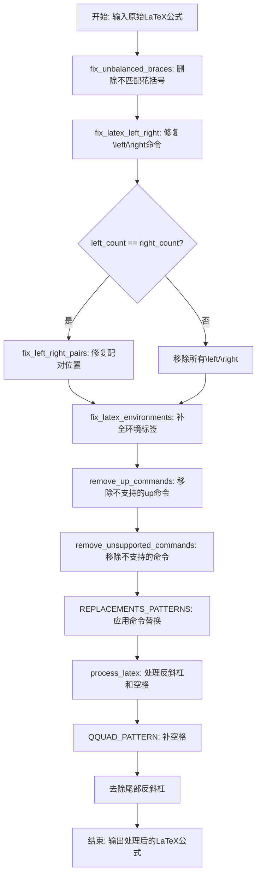
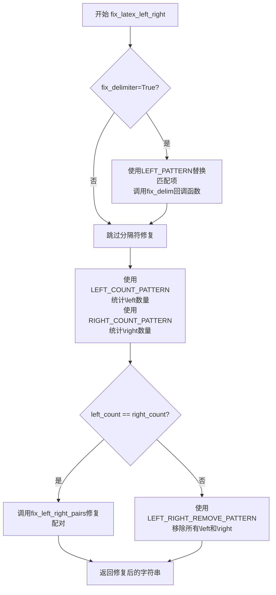
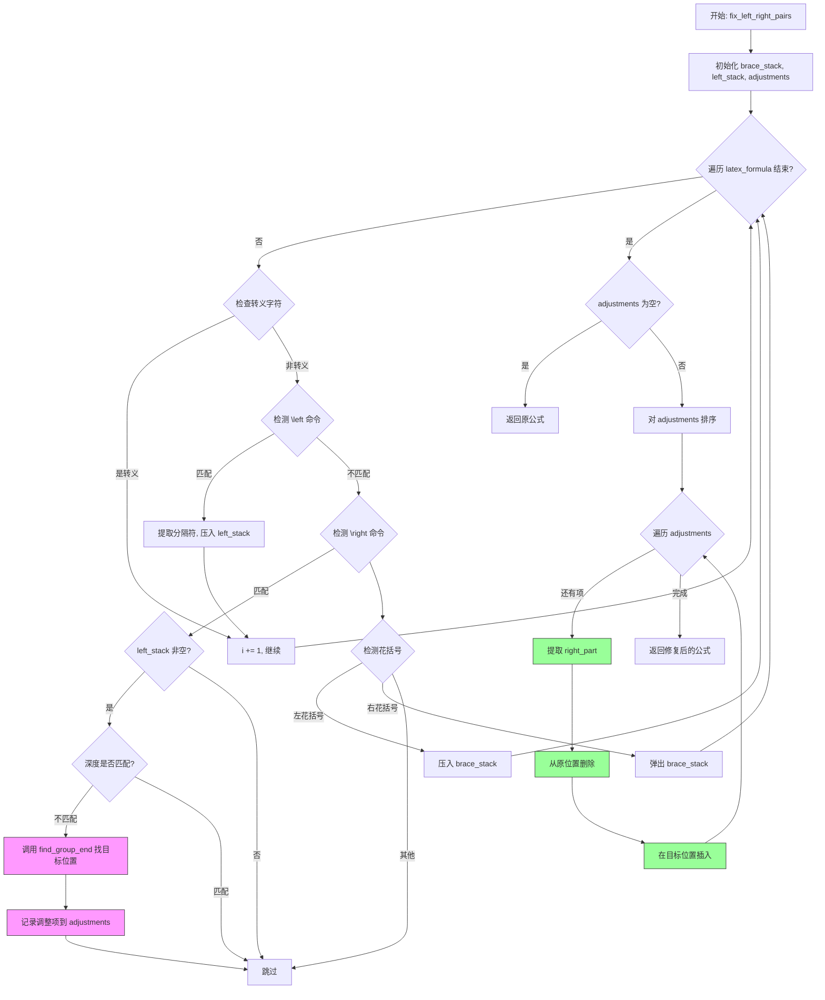
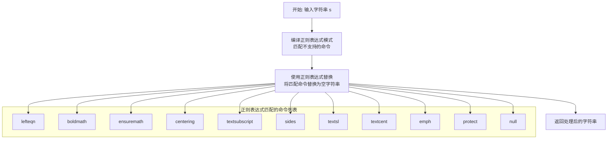
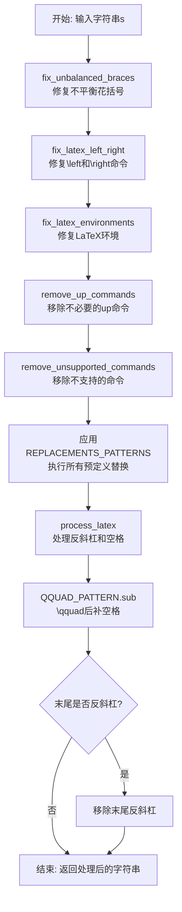

```mermaid
flowchart TD
    A[开始: 输入LaTeX公式] --> B[定义内部替换函数 replace_func]
    B --> C{匹配 \\ 后面跟任意单字符}
    C --> D{获取反斜杠后的字符 next_char}
    D --> E{检查 next_char 是否为特殊字符或空白符}
    E -->|是| F[保持原样 match.group&#40;0&#41;]
    E -->|否| G{检查 next_char 是否为字母}
    G -->|否| H[在反斜杠后添加空格返回]
    G -->|是| I{检查下一个字符是否也是字母}
    I -->|是| F
    I -->|否| H
    F --> J[通过 re.sub 替换所有匹配项]
    H --> J
    J --> K[结束: 返回处理后的公式]
    
    style F fill:#90EE90
    style H fill:#FFB6C1
    style K fill:#87CEEB
```

# `MinerU\mineru\model\mfr\utils.py` 详细设计文档

该代码是一个LaTeX公式预处理工具，主要用于修复和规范化LaTeX数学公式中的常见问题，包括\left/\right命令的平衡与分隔符修复、不匹配花括号的删除、环境的\begin/\end标签补全、移除不支持的命令、以及各种命令的替换和空格处理，最终输出符合KaTeX/MathJax渲染要求的LaTeX代码。

## 整体流程



## 类结构

```
无类层次结构（纯函数式模块）
所有函数均为模块级全局函数
```

## 全局变量及字段


### `LEFT_PATTERN`
    
匹配\left后接任意字符的正则表达式

类型：`re.Pattern`
    


### `RIGHT_PATTERN`
    
匹配\right后接任意字符的正则表达式

类型：`re.Pattern`
    


### `LEFT_COUNT_PATTERN`
    
匹配\left命令（排除如\lefteqn等）

类型：`re.Pattern`
    


### `RIGHT_COUNT_PATTERN`
    
匹配\right命令（排除如\rightarrow等）

类型：`re.Pattern`
    


### `LEFT_RIGHT_REMOVE_PATTERN`
    
匹配\left.或\right.用于移除

类型：`re.Pattern`
    


### `ENV_TYPES`
    
KaTeX/MathJax支持的数学环境列表

类型：`list`
    


### `ENV_BEGIN_PATTERNS`
    
各环境的\begin模式字典

类型：`dict`
    


### `ENV_END_PATTERNS`
    
各环境的\end模式字典

类型：`dict`
    


### `ENV_FORMAT_PATTERNS`
    
各环境格式参数模式字典

类型：`dict`
    


### `REPLACEMENTS_PATTERNS`
    
命令替换映射字典

类型：`dict`
    


### `QQUAD_PATTERN`
    
匹配\qquad后无空格的情况

类型：`re.Pattern`
    


    

## 全局函数及方法


### `fix_latex_left_right`

修复LaTeX公式中的`\left`和`\right`命令，确保它们后面跟随有效的分隔符，并平衡两者的数量。如果数量相等但不在同一花括号组内，则调用`fix_left_right_pairs`进行修复；如果数量不相等，则移除所有的`\left`和`\right`命令。

参数：

- `s`：`str`，输入的LaTeX公式字符串
- `fix_delimiter`：`bool`，默认为`True`，是否修复分隔符（当为`True`时，会为缺失有效分隔符的`\left`或`\right`添加点号）

返回值：`str`，修复后的LaTeX公式字符串

#### 流程图



#### 带注释源码

```python
def fix_latex_left_right(s, fix_delimiter=True):
    """
    修复LaTeX中的\left和\right命令
    1. 确保它们后面跟有效分隔符
    2. 平衡\left和\right的数量
    """
    # 白名单分隔符列表，包含所有有效的\left/\right后缀
    valid_delims_list = [r'(', r')', r'[', r']', r'{', r'}', r'/', r'|',
                         r'\{', r'\}', r'\lceil', r'\rceil', r'\lfloor',
                         r'\rfloor', r'\backslash', r'\uparrow', r'\downarrow',
                         r'\Uparrow', r'\Downarrow', r'\|', r'\.']

    # 为\left后缺失有效分隔符的情况添加点
    def fix_delim(match, is_left=True):
        cmd = match.group(1)  # \left 或 \right
        rest = match.group(2) if len(match.groups()) > 1 else ""
        if not rest or rest not in valid_delims_list:
            return cmd + "."  # 缺失有效分隔符，添加点号
        return match.group(0)

    # 使用更精确的模式匹配\left和\right命令
    # 确保它们是独立的命令，不是其他命令的一部分
    # 使用预编译正则和统一回调函数
    if fix_delimiter:
        s = LEFT_PATTERN.sub(lambda m: fix_delim(m, True), s)   # 修复\left
        s = RIGHT_PATTERN.sub(lambda m: fix_delim(m, False), s)  # 修复\right

    # 更精确地计算\left和\right的数量
    # 使用负向预查(?![a-zA-Z])避免匹配\lefteqn等命令
    left_count = len(LEFT_COUNT_PATTERN.findall(s))
    right_count = len(RIGHT_COUNT_PATTERN.findall(s))

    if left_count == right_count:
        # 数量相等时，检查是否在同一组，调用配对修复函数
        return fix_left_right_pairs(s)
    else:
        # 数量不等时，移除所有\left和\right命令
        return LEFT_RIGHT_REMOVE_PATTERN.sub('', s)
```

---

### 关键组件信息

| 名称 | 描述 |
|------|------|
| `LEFT_PATTERN` | 预编译正则，用于匹配`\left`及其后分隔符 |
| `RIGHT_PATTERN` | 预编译正则，用于匹配`\right`及其后分隔符 |
| `LEFT_COUNT_PATTERN` | 预编译正则，用于统计`\left`数量（排除`\lefteqn`等） |
| `RIGHT_COUNT_PATTERN` | 预编译正则，用于统计`\right`数量（排除`\rightarrow`等） |
| `LEFT_RIGHT_REMOVE_PATTERN` | 预编译正则，用于移除所有`\left`和`\right` |
| `valid_delims_list` | 有效分隔符白名单列表 |
| `fix_left_right_pairs` | 辅助函数，检测并修复`\left`和`\right`不在同一花括号组内的情况 |

---

### 潜在的技术债务或优化空间

1. **正则表达式性能**：使用`lambda`回调函数每次调用都会创建新函数对象，可以考虑提取为独立的命名函数以提高性能。
2. **硬编码分隔符列表**：`valid_delims_list`作为列表而非集合（set）存储，查找效率为O(n)，可改为集合以提高查找性能。
3. **双重统计**：先替换再统计的方式导致对字符串遍历两次，可以合并为单次遍历。
4. **错误处理缺失**：没有对输入` s`进行类型检查，若传入非字符串可能导致运行时错误。
5. **函数职责过多**：`fix_latex_left_right`同时处理分隔符修复和数量平衡，建议拆分为更细粒度的函数。

---

### 其它项目

**设计目标与约束**：
- 确保`\left`和`\right`命令后跟有效的LaTeX分隔符
- 保证`\left`和`\right`命令数量匹配且在同一花括号组内
- 使用预编译正则表达式提高匹配效率

**错误处理与异常设计**：
- 未对输入参数进行类型校验
- 当`\left`和`\right`数量不匹配时，采用保守策略（移除所有相关命令）

**数据流与状态机**：
- 输入：原始LaTeX公式字符串
- 处理流程：分隔符修复 → 数量统计 → 配对检查/移除
- 输出：修复后的LaTeX公式字符串

**外部依赖与接口契约**：
- 依赖Python标准库`re`模块
- 与`fix_left_right_pairs`、`fix_unbalanced_braces`等函数协同工作


### `fix_left_right_pairs`

检测并修复LaTeX公式中 `\left` 和 `\right` 不在同一花括号组的情况，通过追踪花括号嵌套层级和括号深度，将不匹配的 `\right` 移动到正确的位置。

参数：

- `latex_formula`：`str`，输入的LaTeX公式

返回值：`str`，修复后的LaTeX公式

#### 流程图



#### 带注释源码

```python
def fix_left_right_pairs(latex_formula):
    """
    检测并修复LaTeX公式中\\left和\\right不在同一组的情况

    Args:
        latex_formula (str): 输入的LaTeX公式

    Returns:
        str: 修复后的LaTeX公式
    """
    # 用于跟踪花括号嵌套层级
    brace_stack = []
    # 用于存储\left信息: (位置, 深度, 分隔符)
    left_stack = []
    # 存储需要调整的\right信息: (开始位置, 结束位置, 目标位置)
    adjustments = []

    i = 0
    while i < len(latex_formula):
        # 检查是否是转义字符
        # 通过计算前连续反斜杠数量判断是否被转义
        if i > 0 and latex_formula[i - 1] == '\\':
            backslash_count = 0
            j = i - 1
            while j >= 0 and latex_formula[j] == '\\':
                backslash_count += 1
                j -= 1

            # 奇数个反斜杠表示该字符被转义，跳过
            if backslash_count % 2 == 1:
                i += 1
                continue

        # 检测\left命令
        # 匹配 \left 后跟一个字符（分隔符）
        if i + 5 < len(latex_formula) and latex_formula[i:i + 5] == "\\left" and i + 5 < len(latex_formula):
            delimiter = latex_formula[i + 5]  # 提取 \left 后的分隔符
            left_stack.append((i, len(brace_stack), delimiter))  # 记录位置、深度、分隔符
            i += 6  # 跳过\left和分隔符
            continue

        # 检测\right命令
        elif i + 6 < len(latex_formula) and latex_formula[i:i + 6] == "\\right" and i + 6 < len(latex_formula):
            delimiter = latex_formula[i + 6]  # 提取 \right 后的分隔符

            if left_stack:
                left_pos, left_depth, left_delim = left_stack.pop()

                # 如果\left和\right不在同一花括号深度
                # 即它们不在同一个花括号组内
                if left_depth != len(brace_stack):
                    # 找到\left所在花括号组的结束位置
                    target_pos = find_group_end(latex_formula, left_pos, left_depth)
                    if target_pos != -1:
                        # 记录需要移动的\right
                        # (当前开始位置, 当前结束位置, 目标位置)
                        adjustments.append((i, i + 7, target_pos))

            i += 7  # 跳过\right和分隔符
            continue

        # 处理花括号
        # 追踪花括号的嵌套层级
        if latex_formula[i] == '{':
            brace_stack.append(i)
        elif latex_formula[i] == '}':
            if brace_stack:
                brace_stack.pop()

        i += 1

    # 应用调整，从后向前处理以避免索引变化
    # 如果没有需要调整的项，直接返回原公式
    if not adjustments:
        return latex_formula

    result = list(latex_formula)
    # 按位置从大到小排序，确保删除操作不影响后续索引
    adjustments.sort(reverse=True, key=lambda x: x[0])

    for start, end, target in adjustments:
        # 提取\right部分
        right_part = result[start:end]
        # 从原位置删除
        del result[start:end]
        # 在目标位置插入
        # 注意：target 是在原字符串中的位置，删除后需要调整
        # 但因为从后向前处理，target 位置之后的删除不影响当前 target
        result.insert(target, ''.join(right_part))

    return ''.join(result)
```


### `find_group_end`

查找特定深度的花括号组的结束位置。该函数从指定位置开始遍历文本，通过跟踪花括号的嵌套深度，当遇到与目标深度不匹配的右花括号时返回其位置，若遍历完整个文本仍未找到则返回 -1。

参数：

- `text`：`str`，要进行搜索的 LaTeX 公式文本
- `pos`：`int`，起始搜索位置（通常为 `\left` 命令的位置）
- `depth`：`int`，要查找的花括号深度（目标深度层级）

返回值：`int`，返回找到的右花括号位置，若未找到对应结束位置则返回 -1

#### 流程图

```mermaid
flowchart TD
    A[开始 find_group_end] --> B[初始化 current_depth = depth, i = pos]
    B --> C{i < len(text)?}
    C -->|Yes| D{text[i] == '{' 且未转义?}
    D -->|Yes| E[current_depth += 1]
    E --> I[i += 1]
    I --> C
    D -->|No| F{text[i] == '}' 且未转义?}
    F -->|Yes| G[current_depth -= 1]
    G --> H{current_depth < depth?}
    H -->|Yes| J[返回 i]
    H -->|No| I
    F -->|No| I
    C -->|No| K[返回 -1]
    J --> L[结束]
    K --> L
```

#### 带注释源码

```python
def find_group_end(text, pos, depth):
    """
    查找特定深度的花括号组的结束位置
    
    该函数用于在 LaTeX 公式中寻找与特定深度匹配的花括号组的结束右花括号。
    通常用于修复 \\left 和 \\right 命令不在同一花括号组内的问题。
    
    Args:
        text: 要搜索的文本字符串
        pos: 起始搜索位置（通常为 \\left 命令的位置）
        depth: 目标深度（要查找的花括号嵌套层级）
    
    Returns:
        找到的右花括号位置，若未找到则返回 -1
    """
    # current_depth 用于跟踪当前遍历到的花括号深度
    current_depth = depth
    # i 从起始位置开始遍历
    i = pos

    # 遍历文本中的每个字符
    while i < len(text):
        # 检测左花括号 '{'，且未被转义
        # i == 0 表示文本开头，无转义问题
        # is_escaped(text, i) 检查该位置的花括号是否被转义
        if text[i] == '{' and (i == 0 or not is_escaped(text, i)):
            current_depth += 1  # 进入更深一层嵌套
        # 检测右花括号 '}'，且未被转义
        elif text[i] == '}' and (i == 0 or not is_escaped(text, i)):
            current_depth -= 1  # 退出当前嵌套层级
            # 当深度小于目标深度时，说明找到了对应花括号组的结束位置
            if current_depth < depth:
                return i
        i += 1

    # 遍历完整个文本仍未找到对应结束位置，返回 -1
    return -1  # 未找到对应结束位置
```


### `is_escaped`

检查 LaTeX 公式中指定位置的字符是否被反斜杠转义（即该字符前面是否有奇数个反斜杠），用于处理 LaTeX 语法中的转义字符判断。

参数：
- `text`：`str`，输入的 LaTeX 公式字符串
- `pos`：`int`，要检查的字符位置索引

返回值：`bool`，如果该字符被转义（前面有奇数个反斜杠），返回 `True`；否则返回 `False`

#### 流程图

```mermaid
flowchart TD
    A[开始 is_escaped] --> B[初始化 backslash_count = 0]
    B --> C[设置 j = pos - 1]
    C --> D{条件: j >= 0 且 text[j] == '\\'}
    D -->|是| E[backslash_count += 1]
    E --> F[j -= 1]
    F --> D
    D -->|否| G{backslash_count % 2 == 1}
    G -->|是| H[返回 True]
    G -->|否| I[返回 False]
    H --> Z[结束]
    I --> Z
```

#### 带注释源码

```python
def is_escaped(text, pos):
    """
    检查字符是否被转义
    
    通过统计给定位置前连续的反斜杠数量来判断字符是否被转义。
    如果反斜杠数量为奇数，则该字符被转义；否则未被转义。
    
    参数:
        text: str，输入的LaTeX公式字符串
        pos: int，要检查的字符位置索引
    
    返回:
        bool，如果该字符被转义返回True，否则返回False
    """
    # 初始化反斜杠计数器
    backslash_count = 0
    # 从给定位置的前一个字符开始向前遍历
    j = pos - 1
    
    # 向前统计连续的反斜杠数量
    while j >= 0 and text[j] == '\\':
        backslash_count += 1
        j -= 1
    
    # 如果反斜杠数量为奇数，说明字符被转义
    return backslash_count % 2 == 1
```


### `fix_unbalanced_braces`

检测并删除LaTeX公式中不匹配的花括号（无法成对的花括号）

参数：

- `latex_formula`：`str`，输入的LaTeX公式

返回值：`str`，删除无法配对的花括号后的LaTeX公式

#### 流程图

```mermaid
flowchart TD
    A[开始] --> B[初始化空栈和unmatched集合]
    B --> C{i < len(latex_formula)?}
    C -->|是| D{latex_formula[i] 是 '{' 或 '}'?}
    C -->|否| M[构建新字符串并返回]
    
    D -->|否| C
    
    D -->|是| E[计算前面的反斜杠数量]
    E --> F{反斜杠数量是奇数?}
    F -->|是| C
    F -->|否| G{latex_formula[i] == '{' ?}
    
    G -->|是| H[左括号入栈]
    H --> C
    
    G -->|否| I{栈是否为空?}
    I -->|是| J[右括号索引加入unmatched]
    J --> C
    I -->|否| K[栈顶元素出栈]
    K --> C
    
    M --> N[结束]
```

#### 带注释源码

```
def fix_unbalanced_braces(latex_formula):
    """
    检测LaTeX公式中的花括号是否闭合，并删除无法配对的花括号

    Args:
        latex_formula (str): 输入的LaTeX公式

    Returns:
        str: 删除无法配对的花括号后的LaTeX公式
    """
    stack = []  # 存储左括号的索引
    unmatched = set()  # 存储不匹配括号的索引
    i = 0

    # 遍历公式中的每个字符
    while i < len(latex_formula):
        # 检查是否是花括号字符
        if latex_formula[i] in ['{', '}']:
            # 计算前面连续的反斜杠数量（用于判断是否转义）
            backslash_count = 0
            j = i - 1
            while j >= 0 and latex_formula[j] == '\\':
                backslash_count += 1
                j -= 1

            # 如果前面有奇数个反斜杠，则该花括号是转义的，不参与匹配
            if backslash_count % 2 == 1:
                i += 1
                continue

            # 处理左花括号：入栈
            if latex_formula[i] == '{':
                stack.append(i)
            else:  # latex_formula[i] == '}'
                if stack:  # 有对应的左括号，出栈
                    stack.pop()
                else:  # 没有对应的左括号，记录为不匹配
                    unmatched.add(i)

        i += 1

    # 所有未匹配的左括号（栈中剩余的元素）
    unmatched.update(stack)

    # 构建新字符串，删除不匹配的括号
    return ''.join(char for i, char in enumerate(latex_formula) if i not in unmatched)
```


### `process_latex`

处理LaTeX公式中的反斜杠和空格关系，确保反斜杠后要么跟特殊字符、要么跟两个连续字母构成命令，其他情况在反斜杠后插入空格以符合LaTeX语法规范。

参数：

- `input_string`：`str`，输入的LaTeX公式字符串

返回值：`str`，处理后的LaTeX公式字符串

#### 流程图



#### 带注释源码

```python
def process_latex(input_string):
    """
    处理LaTeX公式中的反斜杠：
    1. 如果\后跟特殊字符(#$%&~_^\\{})或空格，保持不变
    2. 如果\后跟两个小写字母，保持不变
    3. 其他情况，在\后添加空格

    Args:
        input_string (str): 输入的LaTeX公式

    Returns:
        str: 处理后的LaTeX公式
    """

    def replace_func(match):
        # 通过正则捕获组获取反斜杠后面的单个字符
        next_char = match.group(1)

        # 特殊字符和空白符集合：# $ % & ~ _ ^ | \ { } 空格及所有空白字符
        if next_char in "#$%&~_^|\\{} \t\n\r\v\f":
            # 这些字符紧跟反斜杠是合法的LaTeX语法，直接返回原匹配
            return match.group(0)

        # 检查当前字符是否为字母（a-z或A-Z）
        if 'a' <= next_char <= 'z' or 'A' <= next_char <= 'Z':
            # 计算反斜杠后面第二个字符的位置
            # match.start() 是反斜杠的位置，+2 跳过反斜杠和第一个字母
            pos = match.start() + 2
            # 如果位置在字符串范围内，且下一个字符也是字母
            if pos < len(input_string) and ('a' <= input_string[pos] <= 'z' or 'A' <= input_string[pos] <= 'Z'):
                # 两个连续字母构成合法LaTeX命令（如\alpha, \beta），保持不变
                return match.group(0)

        # 其他情况（如单个字母后跟数字、符号等），在反斜杠后插入空格
        # 使其变成独立的转义字符而非命令
        return '\\' + ' ' + next_char

    # 正则模式：匹配反斜杠后跟任意单个字符（捕获该字符用于后续处理）
    # r'\\(.)' 中 \\ 匹配反斜杠，. 匹配任意字符并用括号捕获
    pattern = r'\\(.)'

    # 使用 re.sub 对输入字符串中所有匹配项应用 replace_func
    return re.sub(pattern, replace_func, input_string)
```


### `fix_latex_environments`

该函数用于检测并修复LaTeX公式中各类数学环境（如array、matrix、pmatrix等）的`\begin`和`\end`标签不匹配问题。当检测到缺失的`\begin`标签时，会在字符串开头补全；当检测到缺失的`\end`标签时，会在字符串末尾补全。

参数：

-  `s`：`str`，输入的LaTeX公式字符串

返回值：`str`，修复后的LaTeX公式字符串

#### 流程图

```mermaid
flowchart TD
    A[开始 fix_latex_environments] --> B{遍历 ENV_TYPES 环境列表}
    B -->|env| C[统计当前环境的 begin_count]
    C --> D[统计当前环境的 end_count]
    D --> E{begin_count == end_count?}
    E -->|是| B
    E -->|否| F{end_count > begin_count?}
    F -->|是| G[查找环境格式匹配 ENV_FORMAT_PATTERNS]
    G --> H{匹配成功?}
    H -->|是| I[使用匹配到的格式 format_str]
    H -->|否| J[使用默认格式 {c} 或空字符串]
    I --> K[计算缺失数量 missing_count]
    J --> K
    K --> L[构建 begin_command]
    L --> M[在字符串开头添加缺失的 begin 命令]
    M --> B
    F -->|否| N[计算缺失数量 missing_count]
    N --> O[在字符串末尾添加缺失的 end 命令]
    O --> B
    B --> P[所有环境处理完成]
    P --> Q[返回修复后的字符串]
```

#### 带注释源码

```python
# 预定义支持的LaTeX数学环境列表
# 包括各种矩阵环境(array, matrix, pmatrix, bmatrix等)和对齐环境(align, aligned等)
ENV_TYPES = ['array', 'matrix', 'pmatrix', 'bmatrix', 'vmatrix',
             'Bmatrix', 'Vmatrix', 'cases', 'aligned', 'gathered', 'align', 'align*']

# 预编译所有环境的\begin正则表达式模式
# 用于检测LaTeX公式中各环境的\begin标签出现次数
ENV_BEGIN_PATTERNS = {env: re.compile(r'\\begin\{' + env + r'\}') for env in ENV_TYPES}

# 预编译所有环境的\end正则表达式模式
# 用于检测LaTeX公式中各环境的\end标签出现次数
ENV_END_PATTERNS = {env: re.compile(r'\\end\{' + env + r'\}') for env in ENV_TYPES}

# 预编译所有环境的格式匹配正则表达式
# 用于提取环境的可选参数，如列格式{c}、对齐方式等
# 匹配 \begin{env}{format} 中的可选格式参数
ENV_FORMAT_PATTERNS = {env: re.compile(r'\\begin\{' + env + r'\}\{([^}]*)\}') for env in ENV_TYPES}


def fix_latex_environments(s):
    """
    检测LaTeX中环境（如array）的\\begin和\\end是否匹配
    1. 如果缺少\\begin标签则在开头添加
    2. 如果缺少\\end标签则在末尾添加
    
    Args:
        s (str): 输入的LaTeX公式字符串
        
    Returns:
        str: 修复后的LaTeX公式字符串，\\begin和\\end标签数量匹配
    """
    # 遍历所有预定义的LaTeX环境类型
    for env in ENV_TYPES:
        # 统计当前环境中\begin标签的出现次数
        begin_count = len(ENV_BEGIN_PATTERNS[env].findall(s))
        # 统计当前环境中\end标签的出现次数
        end_count = len(ENV_END_PATTERNS[env].findall(s))

        # 如果\begin和\end数量不相等，需要修复
        if begin_count != end_count:
            # 情况1：\end数量多于\begin数量（缺少\begin标签）
            # 解决方案：在字符串开头补全缺失的\begin标签
            if end_count > begin_count:
                # 尝试匹配环境格式，如\begin{array}{c}中的{c}
                format_match = ENV_FORMAT_PATTERNS[env].search(s)
                # array环境的默认格式为{c}（居中对齐），其他环境默认为空
                default_format = '{c}' if env == 'array' else ''
                # 如果匹配到格式参数则使用，否则使用默认格式
                format_str = '{' + format_match.group(1) + '}' if format_match else default_format

                # 计算缺失的\begin标签数量
                missing_count = end_count - begin_count
                # 构造\begin命令，包含环境名和格式参数
                begin_command = '\\begin{' + env + '}' + format_str + ' '
                # 在字符串开头添加缺失数量的\begin命令
                s = begin_command * missing_count + s
            # 情况2：\begin数量多于\end数量（缺少\end标签）
            # 解决方案：在字符串末尾补全缺失的\end标签
            else:
                # 计算缺失的\end标签数量
                missing_count = begin_count - end_count
                # 构造\end命令，在字符串末尾添加缺失数量的\end命令
                s = s + (' \\end{' + env + '}') * missing_count

    # 返回修复后的LaTeX公式字符串
    return s
```


### `remove_up_commands`

移除 LaTeX 代码中不必要的 `\up` 命令，将其转换为标准命令格式（保留特定命令如 arrow、downarrow 等）。

参数：

- `s`：`str`，输入的 LaTeX 代码字符串

返回值：`str`，处理后的 LaTeX 代码字符串

#### 流程图

```mermaid
flowchart TD
    A[开始: 输入字符串 s] --> B[编译正则表达式 \\up[a-zA-Z]+]
    B --> C[使用 sub 方法替换匹配项]
    C --> D{检查捕获组是否在保留列表中}
    D -->|是| E[保持原样: m.group(0)]
    D -->|否| F[替换为反斜杠加捕获组: \\{m.group(1)}]
    E --> G[返回处理后的字符串]
    F --> G
```

#### 带注释源码

```python
def remove_up_commands(s: str):
    """Remove unnecessary up commands from LaTeX code."""
    # 编译正则表达式，匹配 \up 后跟一个或多个字母的情况
    # 捕获组 ([a-zA-Z]+) 用于提取 \up 后面的字母部分
    UP_PATTERN = re.compile(r'\\up([a-zA-Z]+)')
    
    # 使用 sub 方法进行替换，通过 lambda 函数处理每个匹配
    # m.group(0) 是完整匹配 (\upxxx)
    # m.group(1) 是捕获组 (xxx)
    s = UP_PATTERN.sub(
        lambda m: m.group(0) if m.group(1) in ["arrow", "downarrow", "lus", "silon"] else f"\\{m.group(1)}", s
    )
    
    # 如果匹配的关键字在保留列表中，保持原样
    # 否则，将 \upxxx 转换为 \xxx（例如 \uparrow 保持不变，\upalpha 转换为 \alpha）
    return s
```


### `remove_unsupported_commands`

该函数用于移除LaTeX代码中不支持的命令。它通过正则表达式匹配一组预定义的不支持命令（如lefteqn、boldmath、ensuremath等），并将匹配到的内容替换为空字符串，从而清理输入的LaTeX代码。

参数：

- `s`：`str`，输入的LaTeX代码字符串

返回值：`str`，移除不支持命令后的LaTeX代码

#### 流程图



#### 带注释源码

```python
def remove_unsupported_commands(s: str):
    """
    移除不支持的LaTeX命令。
    
    该函数删除LaTeX代码中不被支持或已废弃的命令，
    以确保输出兼容性。
    
    Args:
        s (str): 输入的LaTeX代码字符串
        
    Returns:
        str: 移除不支持命令后的LaTeX代码
    """
    # 定义正则表达式模式，匹配以下不支持的LaTeX命令：
    # - lefteqn: 不支持的环境
    # - boldmath: 数学粗体命令
    # - ensetor: 不推荐使用的命令
    # - centering: 表格对齐命令
    # - textsubscript: 下标命令
    # - sides: 未知命令
    # - textsl: 斜体命令
    # - textcent: 居中命令
    # - emph: 强调命令
    # - protect: 保护命令
    # - null: 空命令
    COMMANDS_TO_REMOVE_PATTERN = re.compile(
        r'\\(?:lefteqn|boldmath|ensuremath|centering|textsubscript|sides|textsl|textcent|emph|protect|null)'
    )
    
    # 使用正则表达式的sub方法，将所有匹配到的命令替换为空字符串
    s = COMMANDS_TO_REMOVE_PATTERN.sub('', s)
    
    # 返回处理后的字符串
    return s
```


### `latex_rm_whitespace`

该函数是LaTeX代码处理的主入口函数，通过按顺序调用多个修复函数来清除不必要的空白字符并修复常见的LaTeX语法问题，包括不平衡的花括号、\left/\right命令配对、环境标签缺失、不支持的命令以及各种符号替换。

参数：

-  `s`：`str`，输入的LaTeX代码字符串

返回值：`str`，处理后的LaTeX代码字符串

#### 流程图



#### 带注释源码

```python
def latex_rm_whitespace(s: str):
    """
    Remove unnecessary whitespace from LaTeX code.
    整合所有修复操作的主处理函数
    
    Args:
        s: 输入的LaTeX代码字符串
    
    Returns:
        处理后的LaTeX代码字符串
    """
    # 步骤1: 修复不平衡的花括号
    # 检测并删除无法配对的花括号
    s = fix_unbalanced_braces(s)
    
    # 步骤2: 修复\left和\right命令
    # 确保\left和\right后面跟有效分隔符
    # 平衡\left和\right的数量
    s = fix_latex_left_right(s)
    
    # 步骤3: 修复LaTeX环境
    # 检测array、matrix等环境的\begin和\end是否匹配
    # 缺少则添加
    s = fix_latex_environments(s)

    # 步骤4: 移除不必要的up命令
    # 例如将\upalpha转换为\alpha（保留特定命令）
    s = remove_up_commands(s)
    
    # 步骤5: 移除不支持的LaTeX命令
    # 例如lefteqn、boldmath、centering等
    s = remove_unsupported_commands(s)

    # 步骤6: 应用所有预定义的替换模式
    # 包括\underbar→\underline、\Bar→\hat等
    for pattern, replacement in REPLACEMENTS_PATTERNS.items():
        s = pattern.sub(replacement, s)

    # 步骤7: 处理LaTeX中的反斜杠和空格
    # 特殊字符保持不变，双字母命令保持不变，其他情况添加空格
    s = process_latex(s)

    # 步骤8: \qquad后添加空格
    # 确保\qquad后有空格
    s = QQUAD_PATTERN.sub(r'\\qquad ', s)

    # 步骤9: 移除末尾的反斜杠
    # 如果字符串以反斜杠结尾，去掉最后的反斜杠
    while s.endswith('\\'):
        s = s[:-1]

    return s
```

---

### 文件整体运行流程

该文件是一个LaTeX代码修复和清理的工具模块。整体运行流程如下：

1. **模块初始化**：预编译各种正则表达式模式（LEFT_PATTERN、RIGHT_PATTERN、ENV_BEGIN_PATTERNS等）
2. **主入口函数** `latex_rm_whitespace`：按顺序调用各个修复函数
3. **各子函数独立处理**：
   - `fix_unbalanced_braces`：处理花括号配对
   - `fix_latex_left_right` → `fix_left_right_pairs`：处理\left\right命令
   - `fix_latex_environments`：处理环境标签
   - `remove_up_commands`/`remove_unsupported_commands`：移除特定命令
   - `process_latex`：处理反斜杠和空格

---

### 关键组件信息

| 组件名称 | 描述 |
|---------|------|
| `fix_unbalanced_braces` | 检测并删除LaTeX公式中无法配对的花括号 |
| `fix_latex_left_right` | 修复\left和\right命令，确保有效分隔符和数量平衡 |
| `fix_left_right_pairs` | 检测并修复\left和\right不在同一花括号组的情况 |
| `fix_latex_environments` | 修复array、matrix等LaTeX环境的\begin和\end标签 |
| `remove_up_commands` | 移除不必要的\up开头的命令 |
| `remove_unsupported_commands` | 移除KaTeX/MathJax不支持的命令 |
| `process_latex` | 处理反斜杠后的空格添加规则 |
| `REPLACEMENTS_PATTERNS` | 预定义的命令替换映射字典 |

---

### 潜在的技术债务或优化空间

1. **未使用的参数**：`fix_latex_left_right`函数中的`fix_delimiter`参数默认为`True`，但其逻辑与主函数流程有一定耦合
2. **重复计算**：LEFT_COUNT_PATTERN和RIGHT_COUNT_PATTERN在`fix_latex_left_right`中每次调用都会重新执行`findall`
3. **全局变量**：大量模块级全局变量（正则表达式），可考虑封装为类或配置对象
4. **错误处理**：缺乏对输入为`None`或非字符串类型的异常处理
5. **性能优化**：部分正则匹配可以进一步优化，如使用`re.VERBOSE`或更精确的模式
6. **代码复用**：`is_escaped`函数在多个地方重复实现

---

### 其它项目

**设计目标与约束**：
- 目标：清理和修复LaTeX代码，使其兼容KaTeX/MathJax渲染器
- 约束：保留有效的LaTeX命令和结构，只移除或修复已知的问题模式

**错误处理与异常设计**：
- 当前实现未对输入类型进行校验
- 建议添加：`if not isinstance(s, str): raise TypeError("Expected string input")`

**数据流与状态机**：
- 数据流为单向管道式处理：输入 → 多个修复函数串联 → 输出
- 状态机特征不明显，主要为顺序执行

**外部依赖与接口契约**：
- 仅依赖Python标准库`re`模块
- 公开接口：`latex_rm_whitespace(s: str) -> str`

## 关键组件


### fix_latex_left_right

修复LaTeX中\left和\right命令的主函数，确保它们后面跟有效分隔符，并平衡\left和\right的数量

### fix_left_right_pairs

检测并修复LaTeX公式中\left和\right不在同一花括号组的情况，通过调整\right的位置使其与\left配对

### find_group_end

查找特定深度的花括号组的结束位置，用于确定\left命令所属的完整花括号范围

### is_escaped

检查给定位置的字符是否被转义（前面有奇数个反斜杠），用于正确处理LaTeX中的转义字符

### fix_unbalanced_braces

检测LaTeX公式中的花括号是否闭合，删除无法配对的花括号，返回修复后的公式

### process_latex

处理LaTeX公式中的反斜杠，根据规则决定是否在反斜杠后添加空格

### fix_latex_environments

检测LaTeX环境（如array、matrix等）的\begin和\end标签是否匹配，缺失则自动补充

### remove_up_commands

移除LaTeX代码中不必要的\up命令，保留特定的白名单命令如arrow、downarrow等

### remove_unsupported_commands

移除KaTeX/MathJax不支持的LaTeX命令，如lefteqn、boldmath、ensuremath等

### latex_rm_whitespace

主处理函数，整合所有修复步骤：修复不平衡花括号、修复\left\right、修复环境、移除不支持命令、应用替换规则、处理反斜杠空格

### 正则表达式模式

预编译的全局正则表达式对象，用于模式匹配：LEFT_PATTERN匹配\left命令、RIGHT_PATTERN匹配\right命令、LEFT_COUNT_PATTERN精确计数\left、RIGHT_COUNT_PATTERN精确计数\right、LEFT_RIGHT_REMOVE_PATTERN移除不匹配的\left\right

### REPLACEMENTS_PATTERNS

字典类型的替换规则集合，将不标准或不支持的LaTeX命令替换为标准形式

### ENV_TYPES和ENV_BEGIN/END_PATTERNS

KaTeX/MathJax支持的数学环境列表及其对应的预编译正则表达式，用于环境标签匹配检测


## 问题及建议


### 已知问题

-   **正则表达式设计缺陷**：`LEFT_RIGHT_REMOVE_PATTERN = re.compile(r'\\left\.?|\\right\.?')` 中的 `\.?` 使点号变成可选，导致 `\\left` 或 `\\right` 后面无论有没有点都会被匹配，可能误删正常命令
-   **函数边界检查不一致**：`fix_left_right_pairs` 中使用 `i + 5 < len(latex_formula)` 和 `i + 6 < len(latex_formula)` 检查索引，但后续又直接访问 `latex_formula[i+5]` 和 `latex_formula[i+6]`，存在越界风险
-   **分隔符识别不完整**：`valid_delims_list` 中包含 `\Uparrow`、`\Downarrow` 等多字符分隔符，但代码只取 `latex_formula[i+5]` 单个字符进行匹配，无法正确识别这些分隔符
-   **转义字符处理重复**：`fix_left_right_pairs` 和 `fix_unbalanced_braces` 中都有检测转义字符的逻辑（`is_escaped` 函数），但实现方式略有不同，增加了维护成本
-   **调试代码残留**：存在被注释掉的 `return s` 和 `logger.debug`、`logger.warning` 语句，表明代码可能未完全清理调试代码
-   **花括号深度计算错误**：`fix_left_right_pairs` 中使用 `len(brace_stack)` 获取当前深度，但在处理 `\\left` 时是先添加后增加深度，可能导致深度计算不准确
-   **字符串操作效率低下**：`fix_left_right_pairs` 中使用列表 `result` 进行多次 `del` 和 `insert` 操作，时间复杂度为 O(n²)，大公式性能较差
-   **嵌套函数重复创建**：`fix_latex_left_right` 每次调用都会重新创建 `valid_delims_list` 和内部函数 `fix_delim`，应在模块级别定义
-   **返回值不一致**：`fix_latex_left_right` 在数量相等时返回 `fix_left_right_pairs(s)` 的结果，但 `fix_left_right_pairs` 只处理调整不返回原字符串，逻辑不清晰
-   **多字符分隔符未处理**：代码仅处理单字符分隔符，对 `\lceil`、`\rceil` 等多字符分隔符的支持不完整

### 优化建议

-   **重构正则表达式**：将 `LEFT_RIGHT_REMOVE_PATTERN` 改为 `re.compile(r'\\left\.|\.\\right')` 以精确匹配需要移除的情况
-   **统一边界检查**：使用 `min(i + 5, len(latex_formula))` 或统一使用 `if i + 5 <= len(latex_formula) - 1` 的形式
-   **提取分隔符列表到模块级**：将 `valid_delims_list` 定义为模块级常量，避免重复创建
-   **优化字符串操作**：使用一次遍历构建新字符串，或使用 `re.sub` 配合回调函数实现相同功能
-   **合并转义字符检测逻辑**：将 `is_escaped` 功能统一，避免重复实现
-   **清理调试代码**：移除注释掉的调试语句和日志调用
-   **改进深度跟踪逻辑**：在处理 `\\left` 时先记录深度再推进，确保深度计算准确
-   **添加单元测试**：为边界情况（如空字符串、嵌套括号、转义字符等）添加测试用例
-   **支持多字符分隔符**：在检测分隔符时使用更长的匹配模式，或预定义多字符分隔符集合进行匹配
-   **简化函数返回值**：统一 `fix_latex_left_right` 的返回逻辑，明确成功和失败情况的处理


## 其它


### 设计目标与约束

本模块的设计目标是作为一个LaTeX公式预处理器，对输入的LaTeX代码进行规范化、修复和清理，使其兼容KaTeX/MathJax等现代数学渲染引擎。主要约束包括：1) 不改变原始公式的数学语义，仅做语法层面的修复；2) 处理过程应该是确定性的，相同输入必有相同输出；3) 需要正确处理转义字符和嵌套结构；4) 保持较高的执行效率，单次处理延迟控制在可接受范围内。

### 错误处理与异常设计

本模块采用静默修复策略，不抛出异常。对于无法修复的情况（如严重的语法错误），模块会尽可能保留原始内容或进行保守处理。具体错误处理机制包括：1) 花括号不匹配时删除无法配对的括号；2) \\left/\\right数量不等时完全移除相关命令；3) 环境标签缺失时尝试补全，无法补全时保留原始内容；4) 所有正则匹配失败时返回原始字符串。整个模块没有日志输出，错误信息通过返回值体现。

### 数据流与状态机

数据流采用流水线模式，输入字符串依次经过以下处理阶段：第一步修复不平衡花括号（fix_unbalanced_braces）；第二步修复\\left/\\right命令（fix_latex_left_right，包括内部的对齐检查fix_left_right_pairs）；第三步修复环境标签（fix_latex_environments）；第四步移除不支持的命令（remove_up_commands、remove_unsupported_commands）；第五步执行字符替换（REPLACEMENTS_PATTERNS）；第六步处理反斜杠和空格（process_latex）；第七步处理\\qquad间距；第八步清理末尾反斜杠。各阶段独立处理，通过字符串传递数据，没有全局状态共享。

### 外部依赖与接口契约

模块仅依赖Python标准库：re模块用于正则表达式匹配。提供两个公开接口：latex_rm_whitespace(s: str) -> str作为主入口函数，接收任意LaTeX字符串并返回处理后的结果；fix_unbalanced_braces(latex_formula: str) -> str作为辅助接口，单独处理花括号修复。输入输出均为str类型，不涉及文件IO、网络请求或持久化状态。

### 性能考量与边界条件

性能关键点在于正则表达式的编译和匹配效率，模块已通过预编译正则表达式（LEFT_PATTERN、RIGHT_PATTERN等）优化重复调用场景。时间复杂度最坏为O(n²)（如fix_left_right_pairs中的字符串插入操作），但实际公式长度通常有限。边界条件包括：空字符串输入返回空字符串；仅有转义字符的公式正确处理；极长公式（>10万字符）可能存在性能问题；嵌套深度过大的公式可能导致栈溢出。

### 可测试性设计

模块设计具有较好的可测试性：1) 纯函数设计，无副作用，便于单元测试；2) 多个独立函数可单独验证；3) 输入输出明确，易于构造测试用例。建议补充的测试场景包括：嵌套花括号深度超过100层的情况；包含转义花括号的公式；\\left/\\right跨越多个环境的复杂情况；包含所有ENV_TYPES环境的公式。

    