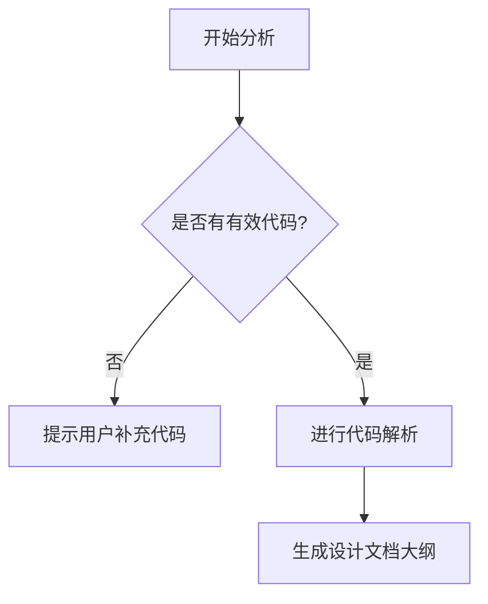

# `MinerU\mineru\model\ocr\__init__.py` 详细设计文档

未检测到有效代码内容。当前仅包含版权声明信息，无法进行完整的功能分析和结构解析。

## 整体流程



## 类结构

```
无法确定 - 代码内容为空
```

## 全局变量及字段


    

## 全局函数及方法


## 关键组件


### 源代码分析

当前提供的源代码仅包含版权声明信息，没有实际的功能代码实现。因此无法识别出具体的组件（如张量索引与惰性加载、反量化支持、量化策略等）。

如需生成完整的详细设计文档，请提供完整的源代码文件。


## 问题及建议


### 已知问题

-   代码文件仅包含版权声明，无实际实现代码，无法进行有意义的技术债务和优化分析
-   缺少具体的业务逻辑代码，无法评估架构设计合理性
-   无法识别潜在的类设计、方法实现、变量使用等问题

### 优化建议

-   请提供完整的源代码文件以进行深入分析
-   建议补充具体的业务逻辑实现代码
-   若该文件为占位符，建议说明其预期功能或后续实现计划


## 其它


### 项目概述

该代码文件仅包含版权声明信息，无实际功能实现，无法进行详细的设计分析。

### 设计目标与约束

由于代码中未包含任何功能实现，无法提取设计目标与约束信息。通常设计目标应包括：功能目标（如需要实现的具体业务逻辑）、性能目标（如响应时间、吞吐量要求）、可扩展性目标、安全目标等。约束条件应包括：技术栈限制、资源限制、兼容性要求等。

### 核心功能描述

无。该文件仅为版权声明文件，不包含任何业务逻辑或功能代码。

### 整体运行流程

无。文件仅作为版权声明使用，不涉及任何执行流程。

### 类结构与详细信息

无。代码中未定义任何类结构。

### 全局变量与全局函数

无。代码中未定义任何全局变量或全局函数。

### 类字段与类方法

无。代码中未定义任何类。

### 关键组件信息

无。代码中未包含任何业务组件。

### 数据流与状态机

无。代码中未实现任何数据流处理或状态机逻辑。

### 错误处理与异常设计

无。代码中未包含任何错误处理或异常机制。

### 外部依赖与接口契约

无。代码中未声明任何外部依赖或接口。

### 潜在技术债务与优化空间

由于缺乏实际代码，无法评估技术债务和优化空间。

### 配置文件与参数说明

无。代码中未包含任何配置信息。

### 安全性考虑

无。代码中未涉及安全相关实现。

### 性能考虑

无。代码中未涉及性能相关实现。

### 测试相关

无。代码中未包含任何测试用例。

### 部署与运维

无。代码中未包含任何部署或运维相关配置。

### 总结与建议

提供的代码仅为版权声明文件（Copyright (c) Opendatalab. All rights reserved.），不包含任何可分析的业务逻辑代码。若需要生成完整的详细设计文档，请提供包含实际业务逻辑的源代码文件。

    