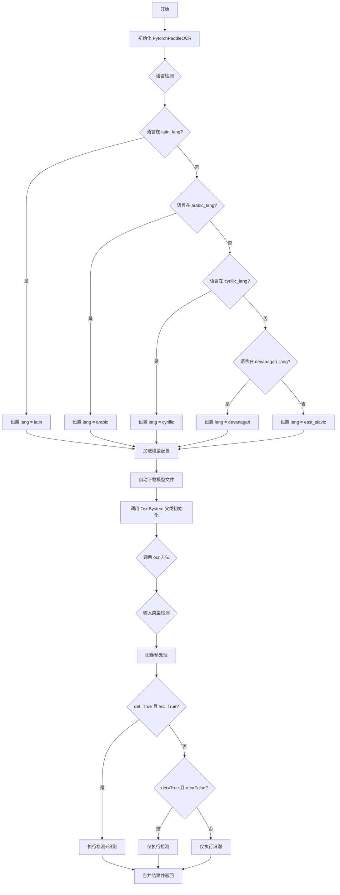
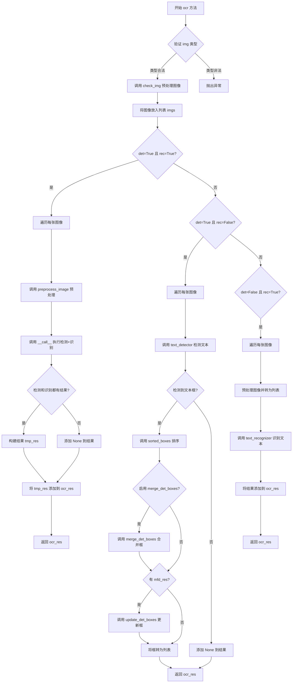
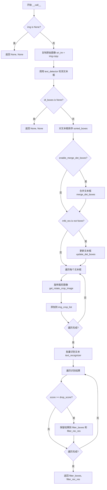

# `MinerU\mineru\model\ocr\pytorch_paddle.py` 详细设计文档

这是一个基于PaddleOCR和PyTorch的多语言OCR（光学字符识别）系统，支持包括拉丁语、阿拉伯语、西里尔语、东斯拉夫语和天城文在内的多种语言，通过自动下载模型、图像预处理、文字检测与识别等步骤实现对图片中文字的提取和识别。

## 整体流程



## 类结构

```
TextSystem (抽象基类/父类)
└── PytorchPaddleOCR (OCR主类)
```

## 全局变量及字段


### `latin_lang`
    
拉丁语系语言代码列表

类型：`list[str]`
    


### `arabic_lang`
    
阿拉伯语系语言代码列表

类型：`list[str]`
    


### `cyrillic_lang`
    
西里尔语系语言代码列表

类型：`list[str]`
    


### `east_slavic_lang`
    
东斯拉夫语系语言代码列表

类型：`list[str]`
    


### `devanagari_lang`
    
天城文语系语言代码列表

类型：`list[str]`
    


### `root_dir`
    
项目根目录路径

类型：`str`
    


### `PytorchPaddleOCR.lang`
    
当前使用的语言标识

类型：`str`
    


### `PytorchPaddleOCR.enable_merge_det_boxes`
    
是否启用检测框合并功能

类型：`bool`
    
    

## 全局函数及方法


### `get_model_params`

根据语言代码从配置中获取对应的检测模型、识别模型和字典文件路径，用于初始化OCR模型。

参数：

- `lang`：`str`，语言代码（如 'ch', 'latin', 'arabic' 等）
- `config`：`dict`，从 YAML 配置文件加载的模型配置字典，包含各语言对应的模型路径信息

返回值：`tuple`，返回三个字符串组成的元组 `(det, rec, dict_file)`，分别表示检测模型文件名、识别模型文件名和字典文件名称。如果语言不支持则抛出异常。

#### 流程图

```mermaid
flowchart TD
    A[开始 get_model_params] --> B{lang 是否在 config['lang'] 中}
    B -->|是| C[获取 params = config['lang'][lang]]
    C --> D[提取 det = params.get('det')]
    D --> E[提取 rec = params.get('rec')]
    E --> F[提取 dict_file = params.get('dict')]
    F --> G[返回 (det, rec, dict_file)]
    B -->|否| H[抛出异常 Exception]
    H --> I[结束]
    
    style G fill:#90EE90
    style H fill:#FFB6C1
```

#### 带注释源码

```python
def get_model_params(lang, config):
    """
    根据语言代码从配置中获取对应的检测模型、识别模型和字典文件路径
    
    参数:
        lang (str): 语言代码，如 'ch', 'latin', 'arabic' 等
        config (dict): 从 YAML 配置文件加载的模型配置字典
    
    返回:
        tuple: (det, rec, dict_file) - 检测模型文件名、识别模型文件名、字典文件名称
    
    异常:
        Exception: 当传入的语言代码不在配置支持列表中时抛出
    """
    # 检查语言代码是否在配置的支持列表中
    if lang in config['lang']:
        # 获取该语言对应的模型参数字典
        params = config['lang'][lang]
        
        # 从参数字典中提取检测模型名称
        det = params.get('det')
        
        # 从参数字典中提取识别模型名称
        rec = params.get('rec')
        
        # 从参数字典中提取字典文件名称
        dict_file = params.get('dict')
        
        # 返回三个模型/文件路径
        return det, rec, dict_file
    else:
        # 语言不支持时抛出异常
        raise Exception(f'Language {lang} not supported')
```


### `PytorchPaddleOCR.__init__`

初始化 OCR 引擎核心方法，负责解析参数、配置语言环境、加载模型配置文件、自动下载必要的检测和识别模型，并完成父类 TextSystem 的初始化。

参数：

- `*args`：可变位置参数，用于传递命令行风格的参数列表
- `**kwargs`：关键字参数字典，支持 `lang`（语言代码，默认为 'ch'）和 `enable_merge_det_boxes`（是否合并检测框，默认为 True）

返回值：`无`（在 Python 中 `__init__` 方法返回 None，主要通过修改实例属性完成初始化）

#### 流程图

```mermaid
flowchart TD
    A[开始 __init__] --> B[调用 utility.init_args 创建参数解析器]
    B --> C[解析 args 参数]
    C --> D[从 kwargs 获取 lang 和 enable_merge_det_boxes]
    D --> E{获取设备类型}
    E -->|CPU 且语言为中文| F[自动切换到 ch_lite]
    E -->|其他| G[保持原语言设置]
    F --> G
    G --> H{语言映射}
    H -->|latin_lang| I[映射为 latin]
    H -->|east_slavic_lang| J[映射为 east_slavic]
    H -->|arabic_lang| K[映射为 arabic]
    H -->|cyrillic_lang| L[映射为 cyrillic]
    H -->|devanagari_lang| M[映射为 devanagari]
    H -->|其他| N[保持原语言]
    I --> O
    J --> O
    K --> O
    L --> O
    M --> O
    N --> O
    O[加载 models_config.yml]
    O --> P[根据语言获取 det/rec/dict_file]
    P --> Q[构建检测模型路径]
    Q --> R[调用 auto_download_and_get_model_root_path 下载/获取模型]
    R --> S[构建识别模型路径]
    S --> T[设置 kwargs 参数]
    T --> U[合并默认参数和 kwargs]
    U --> V[创建 argparse.Namespace 对象]
    V --> W[调用 super().__init__ 初始化父类]
    W --> X[结束 __init__]
```

#### 带注释源码

```python
def __init__(self, *args, **kwargs):
    """
    初始化 PytorchPaddleOCR 类的构造函数
    
    参数:
        *args: 可变位置参数，用于传递命令行风格的参数列表
        **kwargs: 关键字参数字典，支持以下键:
            - lang: 语言代码，默认为 'ch'
            - enable_merge_det_boxes: 是否合并检测框，默认为 True
    """
    # Step 1: 初始化参数解析器并解析传入的参数
    # utility.init_args() 创建一个 argparse.ArgumentParser 实例
    parser = utility.init_args()
    # 解析 *args 参数（传入的参数列表）
    args = parser.parse_args(args)

    # Step 2: 从 kwargs 中提取自定义参数，设置默认值
    # lang: OCR 识别语言，默认为中文 'ch'
    self.lang = kwargs.get('lang', 'ch')
    # enable_merge_det_boxes: 是否启用检测框合并功能，用于处理密集文本
    self.enable_merge_det_boxes = kwargs.get("enable_merge_det_boxes", True)

    # Step 3: 获取运行设备（CPU 或 GPU）
    device = get_device()
    # 如果设备是 CPU 且语言为中文相关，为保证速度自动切换到轻量版
    if device == 'cpu' and self.lang in ['ch', 'ch_server', 'japan', 'chinese_cht']:
        # logger.warning("The current device in use is CPU...")
        self.lang = 'ch_lite'

    # Step 4: 语言映射，将具体语言代码映射到语言族
    # 这样可以使用统一的模型处理同一语言族的多种语言
    if self.lang in latin_lang:  # 拉丁语系语言
        self.lang = 'latin'
    elif self.lang in east_slavic_lang:  # 东斯拉夫语系
        self.lang = 'east_slavic'
    elif self.lang in arabic_lang:  # 阿拉伯语系
        self.lang = 'arabic'
    elif self.lang in cyrillic_lang:  # 西里尔语系
        self.lang = 'cyrillic'
    elif self.lang in devanagari_lang:  # 天城文语系（印度语等）
        self.lang = 'devanagari'
    else:
        pass  # 其他语言保持不变

    # Step 5: 加载模型配置文件（YAML 格式）
    # 配置文件路径：mineru/utils/pytorchocr/utils/resources/models_config.yml
    models_config_path = os.path.join(
        root_dir, 
        'pytorchocr', 
        'utils', 
        'resources', 
        'models_config.yml'
    )
    # 打开并解析 YAML 配置文件
    with open(models_config_path) as file:
        config = yaml.safe_load(file)
        # 根据当前语言获取对应的模型参数
        det, rec, dict_file = get_model_params(self.lang, config)

    # Step 6: 获取模型目录路径
    ocr_models_dir = ModelPath.pytorch_paddle

    # Step 7: 构建检测模型完整路径
    # 格式：{模型目录}/{模型文件名}
    det_model_path = f"{ocr_models_dir}/{det}"
    # 调用自动下载工具获取模型（如果不存在则下载）
    det_model_path = os.path.join(
        auto_download_and_get_model_root_path(det_model_path), 
        det_model_path
    )

    # Step 8: 构建识别模型完整路径（与检测模型相同的处理逻辑）
    rec_model_path = f"{ocr_models_dir}/{rec}"
    rec_model_path = os.path.join(
        auto_download_and_get_model_root_path(rec_model_path), 
        rec_model_path
    )

    # Step 9: 将模型路径和其他配置存入 kwargs
    kwargs['det_model_path'] = det_model_path      # 文本检测模型路径
    kwargs['rec_model_path'] = rec_model_path      # 文本识别模型路径
    # 识别模型使用的字典文件路径
    kwargs['rec_char_dict_path'] = os.path.join(
        root_dir, 
        'pytorchocr', 
        'utils', 
        'resources', 
        'dict', 
        dict_file
    )
    kwargs['rec_batch_num'] = 6  # 识别批量大小
    kwargs['device'] = device    # 运行设备

    # Step 10: 合并默认参数和用户自定义参数
    # vars(args) 将 Namespace 对象转换为字典
    default_args = vars(args)
    # 使用 update 将 kwargs 合并到默认参数中
    default_args.update(kwargs)
    # 重新创建 Namespace 对象
    args = argparse.Namespace(**default_args)

    # Step 11: 调用父类 TextSystem 的构造函数完成初始化
    # 父类会使用这些参数初始化检测器、识别器等核心组件
    super().__init__(args)
```


### `PytorchPaddleOCR.ocr`

该方法是 OCR 识别的主入口方法，负责根据参数配置执行文本检测（det）和文本识别（rec）操作，支持多种输入格式（numpy数组、列表、字符串、字节），并返回相应的识别结果。

参数：

- `img`：`np.ndarray | list | str | bytes`，待识别的输入图像，支持单张图像或图像列表
- `det`：`bool`，默认为 `True`，是否启用文本检测功能
- `rec`：`bool`，默认为 `True`，是否启用文本识别功能
- `mfd_res`：`dict | None`，默认为 `None`，来自其他模型（如表格检测）的结果，用于更新检测框
- `tqdm_enable`：`bool`，默认为 `False`，是否启用进度条显示
- `tqdm_desc`：`str`，默认为 `"OCR-rec Predict"`，进度条描述文本

返回值：`list`，返回 OCR 识别结果列表，列表中每个元素对应一张图像的结果。根据 det 和 rec 的组合：
- 当 det=True 且 rec=True 时，返回包含检测框坐标和识别文本的嵌套列表
- 当 det=True 且 rec=False 时，返回仅包含检测框坐标的列表
- 当 det=False 且 rec=True 时，返回仅包含识别文本结果的列表

#### 流程图



#### 带注释源码

```python
def ocr(self,
        img,
        det=True,
        rec=True,
        mfd_res=None,
        tqdm_enable=False,
        tqdm_desc="OCR-rec Predict",
        ):
    """
    OCR 识别的主入口方法
    
    参数:
        img: 输入图像，支持 np.ndarray, list, str, bytes 类型
        det: 是否进行文本检测
        rec: 是否进行文本识别
        mfd_res: 来自其他模型的检测结果，用于更新文本框
        tqdm_enable: 是否显示进度条
        tqdm_desc: 进度条描述
    
    返回:
        list: OCR 识别结果列表
    """
    # 断言确保输入图像类型合法
    assert isinstance(img, (np.ndarray, list, str, bytes))
    
    # 当输入是列表时，det 必须为 False（列表模式下不做检测）
    if isinstance(img, list) and det == True:
        logger.error('When input a list of images, det must be false')
        exit(0)
    
    # 检查并标准化图像格式
    img = check_img(img)
    # 将图像包装为列表以统一处理
    imgs = [img]
    
    # 捕获 RuntimeWarning 警告并忽略
    with warnings.catch_warnings():
        warnings.simplefilter("ignore", category=RuntimeWarning)
        
        # 模式1: 同时进行检测和识别
        if det and rec:
            ocr_res = []
            for img in imgs:
                # 图像预处理
                img = preprocess_image(img)
                # 调用 __call__ 方法执行检测+识别一体化流程
                dt_boxes, rec_res = self.__call__(img, mfd_res=mfd_res)
                
                # 如果没有检测到文本框和识别结果
                if not dt_boxes and not rec_res:
                    ocr_res.append(None)
                    continue
                
                # 将检测框转换为列表格式，并与识别结果配对
                tmp_res = [[box.tolist(), res] for box, res in zip(dt_boxes, rec_res)]
                ocr_res.append(tmp_res)
            return ocr_res
        
        # 模式2: 仅进行检测，不进行识别
        elif det and not rec:
            ocr_res = []
            for img in imgs:
                img = preprocess_image(img)
                # 调用文本检测器
                dt_boxes, elapse = self.text_detector(img)
                
                # 未检测到文本框
                if dt_boxes is None:
                    ocr_res.append(None)
                    continue
                
                # 对检测到的文本框进行排序（从上到下、从左到右）
                dt_boxes = sorted_boxes(dt_boxes)
                
                # 如果启用合并检测框选项，合并相邻的文本框
                if self.enable_merge_det_boxes:
                    dt_boxes = merge_det_boxes(dt_boxes)
                
                # 如果有其他模型的检测结果（如表格检测），更新文本框
                if mfd_res:
                    dt_boxes = update_det_boxes(dt_boxes, mfd_res)
                
                # 将文本框转换为列表格式
                tmp_res = [box.tolist() for box in dt_boxes]
                ocr_res.append(tmp_res)
            return ocr_res
        
        # 模式3: 不进行检测，仅进行识别
        elif not det and rec:
            ocr_res = []
            for img in imgs:
                # 如果输入不是列表，则预处理后转为列表
                if not isinstance(img, list):
                    img = preprocess_image(img)
                    img = [img]
                
                # 调用文本识别器进行识别
                rec_res, elapse = self.text_recognizer(
                    img, 
                    tqdm_enable=tqdm_enable, 
                    tqdm_desc=tqdm_desc
                )
                ocr_res.append(rec_res)
            return ocr_res
```


### `PytorchPaddleOCR.__call__`

该方法是 `PytorchPaddleOCR` 类的核心调用接口，实现了完整的 OCR 检测和识别流程。通过接收图像和多方向场检测结果，执行文本检测、文本框排序与合并、旋转裁剪、文本识别以及置信度过滤，最终返回过滤后的文本框坐标和识别结果。

参数：

- `img`：`numpy.ndarray`，输入的图像数据
- `mfd_res`：可选参数，默认为 `None`，来自多方向场检测的结果，用于更新文本框位置

返回值：`tuple`，包含两个元素：
  - 第一个元素为过滤后的文本框列表 `filter_boxes`（`list`），每个元素为文本框坐标
  - 第二个元素为过滤后的识别结果列表 `filter_rec_res`（`list`），每个元素为识别文本和置信度组成的元组

#### 流程图



#### 带注释源码

```python
def __call__(self, img, mfd_res=None):
    """
    执行完整的OCR检测和识别流程
    
    参数:
        img: 输入图像 (numpy.ndarray)
        mfd_res: 多方向场检测结果，可选用于更新文本框
    
    返回:
        (filter_boxes, filter_rec_res): 过滤后的文本框和识别结果
    """
    
    # 1. 检查输入图像是否有效
    if img is None:
        logger.debug("no valid image provided")
        return None, None

    # 2. 复制原始图像用于后续裁剪操作
    ori_im = img.copy()
    
    # 3. 调用文本检测器获取文本框
    dt_boxes, elapse = self.text_detector(img)

    # 4. 如果没有检测到文本框，返回空结果
    if dt_boxes is None:
        logger.debug("no dt_boxes found, elapsed : {}".format(elapse))
        return None, None
    
    # 5. 对检测到的文本框进行排序（从左到右、从上到下）
    dt_boxes = sorted_boxes(dt_boxes)

    # 6. 根据配置决定是否合并相邻的文本框
    # merge_det_boxes 和 update_det_boxes 会进行poly和bbox之间的转换
    # 因此需要过滤倾斜程度较大的文本框
    if self.enable_merge_det_boxes:
        dt_boxes = merge_det_boxes(dt_boxes)

    # 7. 如果存在多方向场检测结果，更新文本框位置
    if mfd_res:
        dt_boxes = update_det_boxes(dt_boxes, mfd_res)

    # 8. 对每个文本框进行旋转校正并裁剪
    img_crop_list = []
    for bno in range(len(dt_boxes)):
        tmp_box = copy.deepcopy(dt_boxes[bno])
        img_crop = get_rotate_crop_image(ori_im, tmp_box)
        img_crop_list.append(img_crop)

    # 9. 批量识别裁剪后的图像文本
    rec_res, elapse = self.text_recognizer(img_crop_list)

    # 10. 根据置信度阈值过滤识别结果
    filter_boxes, filter_rec_res = [], []
    for box, rec_result in zip(dt_boxes, rec_res):
        text, score = rec_result
        # 只保留置信度高于阈值的结果
        if score >= self.drop_score:
            filter_boxes.append(box)
            filter_rec_res.append(rec_result)

    # 11. 返回过滤后的文本框和识别结果
    return filter_boxes, filter_rec_res
```

## 关键组件


### 语言支持模块

定义了多种语言列表，用于将具体语言映射到语言族（latin, arabic, cyrillic, east_slavic, devanagari），支持全球30+种语言的OCR识别。

### get_model_params 函数

从配置文件中根据指定语言获取对应的检测模型、识别模型和字典文件路径，用于动态加载语言特定的OCR模型资源。

### PytorchPaddleOCR 类

继承自TextSystem的核心OCR引擎类，封装了文本检测和识别的完整流程。在初始化时自动下载模型、根据语言类型选择合适的语言族、配置设备和模型路径。

### 模型配置加载模块

从YAML格式的配置文件（models_config.yml）中读取各语言对应的检测和识别模型参数，实现模型路径的动态配置。

### ocr 方法

提供统一的OCR识别入口，支持三种模式：仅检测、仅识别、检测+识别。支持单图或列表输入，返回标准化的OCR结果格式。

### __call__ 方法

实现检测+识别的联合流程，包括文本检测、文本框排序与合并、旋转校正、文本识别和置信度过滤，返回最终的结构化OCR结果。

### 图像预处理模块

使用cv2和numpy进行图像检查和预处理，将输入图像转换为模型所需的格式，处理异常输入情况。

### 文本框处理模块

包含sorted_boxes（排序）、merge_det_boxes（合并）、update_det_boxes（更新）三个函数，用于处理文本检测框的后处理，包括倾斜过滤和多框合并。

### 旋转裁剪模块

get_rotate_crop_image函数根据文本框的倾斜角度进行旋转校正，提取准确包含文字的图像区域供识别模型使用。


## 问题及建议


### 已知问题

- **魔法数字和硬编码配置**：`rec_batch_num = 6`、`enable_merge_det_boxes = True`、`drop_score` 等关键参数硬编码在代码中，缺乏可配置性
- **不当的错误处理**：使用 `exit(0)` 退出程序而非抛出异常，导致调用者无法优雅地处理错误
- **变量名覆盖风险**：`ocr` 方法中循环变量 `img` 与外层 `imgs` 循环变量同名，可能导致混淆
- **重复代码逻辑**：`ocr` 方法和 `__call__` 方法中都有 `sorted_boxes`、`merge_det_boxes`、`update_det_boxes` 等相同的预处理流程
- **低效的语言匹配**：通过多个 `if-elif` 链和列表 `in` 操作检查语言，每一帧都在遍历列表
- **未使用的导入**：`copy` 模块被导入但未使用，`Path` 主要用于路径计算但使用不够充分
- **初始化逻辑复杂**：`kwargs` 与 `args` 合并后再转换为 `Namespace`，初始化流程不直观
- **主程序逻辑泄露**：OCR 核心类中包含 `if __name__ == '__main__':` 测试代码，应分离到独立模块

### 优化建议

- 将关键配置（批大小、分数阈值、合并开关等）抽取到配置文件或构造函数参数中
- 替换 `exit(0)` 为自定义异常或返回错误码，由上层调用者处理
- 统一 `ocr` 和 `__call__` 方法中的公共逻辑，提取为私有辅助方法
- 使用字典映射替代多个列表的语言检查，或使用 `Set` 存储语言代码以提高查找效率
- 清理未使用的导入，添加类型注解提升代码可读性
- 将主程序测试代码移至独立文件或添加 `-m` 入口点
- 考虑使用 `@dataclass` 或 `namedtuple` 封装 OCR 结果，提高结构化程度

## 其它


### 设计目标与约束

本模块旨在实现一个高性能的多语言OCR（光学字符识别）系统，支持80+种语言的文本检测与识别。设计目标包括：1）支持检测与识别分离执行或联合执行；2）支持多种输入格式（numpy数组、列表、文件路径、字节）；3）支持文本框合并与MFD结果更新；4）自动下载并管理OCR模型；5）在CPU设备上自动降级到轻量模型。约束条件包括：依赖PyTorch和PaddlePaddle框架，模型文件较大需要网络下载，GPU加速需要CUDA支持。

### 错误处理与异常设计

主要异常场景包括：1）不支持的语言类型抛出Exception；2）无效图像输入会经过check_img检查后返回None或抛出异常；3）模型加载失败时auto_download_and_get_model_root_path会抛出异常；4）文本检测失败返回(None, None)元组；5）图像预处理失败会记录警告但继续执行。异常处理策略：使用logger记录debug/warning/info级别日志，运行时警告被捕获并忽略（catch_warnings），严重错误时调用exit(0)终止程序。

### 数据流与状态机

完整OCR处理流程状态机如下：
1. INPUT_RECEIVED：接收原始图像输入
2. IMAGE_VALIDATED：check_img验证图像格式有效
3. PREPROCESSED：preprocess_image进行图像预处理
4. DETECTION_RUNNING：text_detector执行文本检测
5. BOXES_MERGED：如果enable_merge_det_boxes=True执行merge_det_boxes
6. BOXES_UPDATED：如果mfd_res存在执行update_det_boxes
7. CROP_EXTRACTED：get_rotate_crop_image提取旋转校正的文本区域
8. RECOGNITION_RUNNING：text_recognizer执行文本识别
9. SCORE_FILTERED：根据drop_score过滤低置信度结果
10. OUTPUT_GENERATED：返回(filter_boxes, filter_rec_res)结果

数据流：输入图像→check_img验证→preprocess_image增强→text_detector检测→merge_det_boxes合并→update_det_boxes更新→get_rotate_crop_image裁剪→text_recognizer识别→drop_score过滤→结果输出

### 外部依赖与接口契约

核心依赖包括：1）opencv-python(cv2)：图像读取、预处理、旋转裁剪；2）numpy：数值计算和图像数组操作；3）PyTorch：模型推理框架；4）PyYAML：配置文件读取；5）loguru：日志记录；6）内部模块mineru.utils：设备获取、模型下载、配置读取、OCR工具函数。接口契约：PytorchPaddleOCR类接受lang、enable_merge_det_boxes等参数，ocr()方法接受img、det、rec、mfd_res等参数，返回OCR结果列表。

### 性能考虑与优化建议

性能优化点：1）rec_batch_num设置为6，可在GPU上调整以提高吞吐量；2）支持tqdm进度条便于监控长时间处理；3）enable_merge_det_boxes默认为True可减少误检；4）CPU模式下自动切换到ch_lite轻量模型。潜在优化：1）可添加批处理支持处理多张图像；2）可添加异步推理支持；3）可添加模型缓存机制避免重复下载；4）可添加GPU内存管理防止OOM。

### 安全性考虑

安全相关：1）图像输入经过check_img验证防止恶意输入；2）文件路径操作使用Path.resolve()防止路径遍历；3）模型文件下载需要网络连接需注意安全；4）无用户敏感数据存储。

### 配置管理

配置通过YAML文件(models_config.yml)管理，包含各语言对应的det检测模型、rec识别模型、dict字典文件路径。运行时配置通过kwargs传递，支持lang语言、enable_merge_det_boxes合并开关、det_model_path自定义检测模型路径、rec_model_path自定义识别模型路径、device设备类型等参数。

### 资源管理

资源管理要点：1）模型文件自动下载到auto_download_and_get_model_root_path指定目录；2）临时图像裁剪结果存储在img_crop_list列表中，处理完成后释放；3）copy.deepcopy用于复制图像和文本框避免副作用；4）warnings.simplefilter("ignore")抑制运行时警告避免资源浪费。

### 测试策略建议

建议测试用例：1）单语言OCR功能测试（中英日等）；2）检测/识别分离执行测试；3）多图像列表输入测试；4）无效输入（空图像、错误路径）异常处理测试；5）CPU/GPU设备兼容性测试；6）模型下载失败场景测试；7）性能基准测试（处理速度、内存占用）。

### 部署注意事项

部署要点：1）需要预先安装PyTorch、OpenCV、NumPy等依赖；2）首次运行需要网络下载OCR模型（约几百MB）；3）GPU版本需要CUDA环境；4）建议设置MODEL_ROOT_PATH环境变量指定模型存储路径；5）生产环境建议设置日志级别为INFO以上；6）注意处理大图像时的内存限制。

    