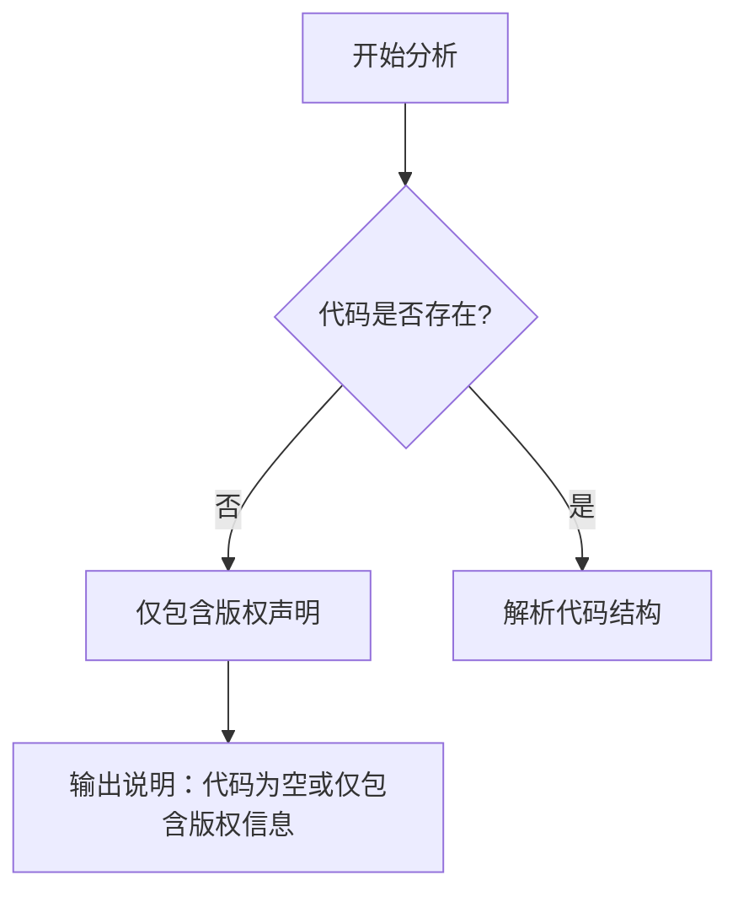

# `MinerU\mineru\model\ori_cls\__init__.py` 详细设计文档

该代码文件仅包含版权声明信息（Copyright (c) Opendatalab. All rights reserved.），没有实际的功能代码实现，无法进行进一步的分析。

## 整体流程



## 类结构

```
无类层次结构（代码为空）
```

## 全局变量及字段


    

## 全局函数及方法


## 关键组件


### 代码概述

由于提供的源代码仅包含版权声明信息，未包含实际的实现代码，因此无法进行详细的设计分析。

### 文件运行流程

由于代码为空，无法提取运行流程信息。

### 类详细信息

由于代码为空，无法提取类信息。

### 关键组件信息

由于代码为空，无法提取关键组件信息。

### 潜在技术债务与优化空间

由于代码为空，无法评估技术债务。

### 其它项目

- **设计目标与约束**: 未提供
- **错误处理与异常设计**: 未提供
- **数据流与状态机**: 未提供
- **外部依赖与接口契约**: 未提供


## 问题及建议


### 已知问题

- 代码文件仅包含版权声明，没有任何实际的功能实现代码，无法进行详细的技术债务或优化分析。

### 优化建议

- 请提供完整的源代码文件，以便进行全面的技术分析和优化建议。当前仅能确认文件存在版权声明，需要补充实际的业务逻辑代码。


## 其它


### 设计目标与约束

由于提供的代码仅包含版权声明，无实际功能代码，暂未定义具体的设计目标与约束。

### 错误处理与异常设计

由于提供的代码仅包含版权声明，无实际功能代码，暂未定义错误处理与异常设计。

### 数据流与状态机

由于提供的代码仅包含版权声明，无实际功能代码，暂未定义数据流与状态机。

### 外部依赖与接口契约

由于提供的代码仅包含版权声明，无实际功能代码，暂未定义外部依赖与接口契约。

### 性能要求与基准

由于提供的代码仅包含版权声明，无实际功能代码，暂未定义性能要求与基准。

### 安全性考量

由于提供的代码仅包含版权声明，无实际功能代码，暂未定义安全性考量。

### 兼容性设计

由于提供的代码仅包含版权声明，无实际功能代码，暂未定义兼容性设计。

### 配置与扩展性

由于提供的代码仅包含版权声明，无实际功能代码，暂未定义配置与扩展性。

### 测试策略

由于提供的代码仅包含版权声明，无实际功能代码，暂未定义测试策略。

### 部署与运维

由于提供的代码仅包含版权声明，无实际功能代码，暂未定义部署与运维。

    