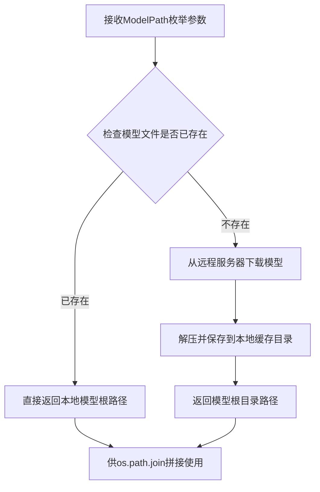
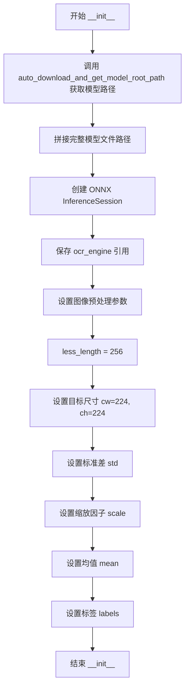
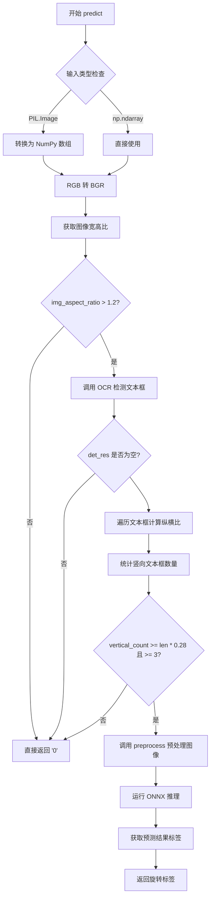
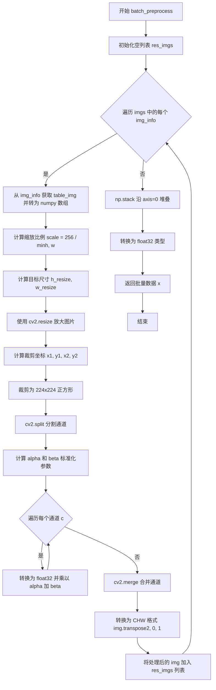
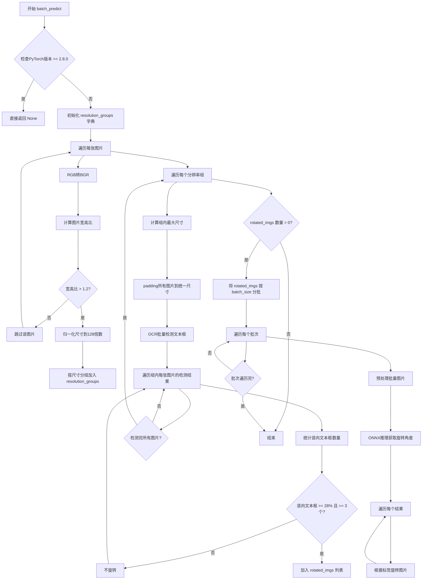
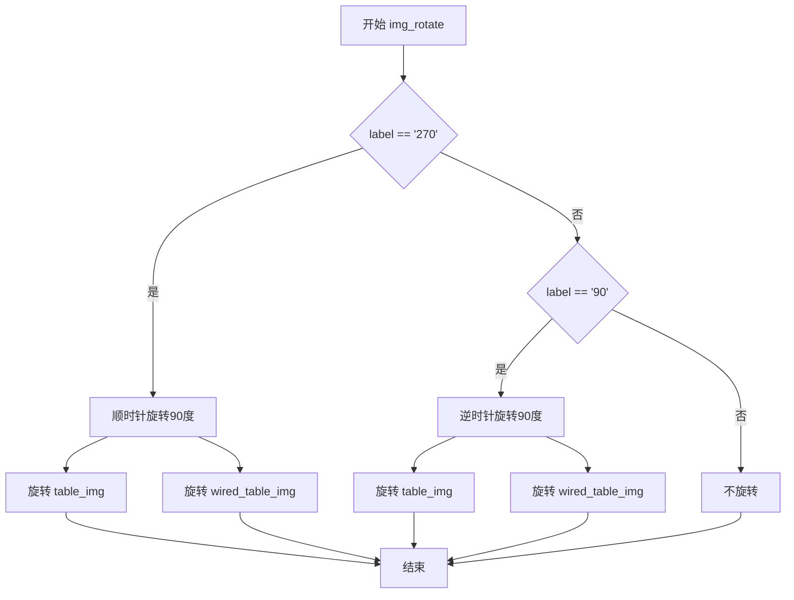

# `MinerU\mineru\model\ori_cls\paddle_ori_cls.py` 详细设计文档

该代码实现了一个名为 PaddleOrientationClsModel 的类，用于对表格图像进行方向分类（0°, 90°, 180°, 270°）。它结合了基于图像宽高比和 OCR 文本框分析的启发式方法，来判断图像是否需要旋转，并利用 ONNX 运行时模型进行精确预测，同时支持批量处理以优化性能。

## 整体流程

```mermaid
graph TD
    Start(输入图像) --> A{宽高比 > 1.2?}
    A -- 否 --> Return0[返回 '0']
    A -- 是 --> B[运行 OCR 检测文本框]
    B --> C{检测结果存在?}
    C -- 否 --> Return0
    C -- 是 --> D[计算垂直文本框比例]
    D --> E{垂直比例 > 28% 且数量 >= 3?}
    E -- 否 --> Return0
    E -- 是 --> F[图像预处理 (Resize+Crop+Normalize)]
    F --> G[ONNX 模型推理]
    G --> H[Argmax 获取标签]
    H --> I(返回旋转标签)
```

## 类结构

```
PaddleOrientationClsModel
```

## 全局变量及字段


### `ModelPath`
    
枚举类，定义模型路径用于下载和定位ONNX模型文件

类型：`Enum Class`
    


### `PaddleOrientationClsModel.sess`
    
ONNX推理会话对象，用于执行图像方向分类模型的推理

类型：`onnxruntime.InferenceSession`
    


### `PaddleOrientationClsModel.ocr_engine`
    
OCR引擎对象，用于文本检测和识别

类型：`object`
    


### `PaddleOrientationClsModel.less_length`
    
图像预处理时最短边的目标长度，值为256

类型：`int`
    


### `PaddleOrientationClsModel.cw`
    
图像裁剪目标宽度，值为224

类型：`int`
    


### `PaddleOrientationClsModel.ch`
    
图像裁剪目标高度，值为224

类型：`int`
    


### `PaddleOrientationClsModel.std`
    
图像标准化标准差数组，用于归一化处理

类型：`List[float]`
    


### `PaddleOrientationClsModel.scale`
    
图像缩放因子，用于归一化处理，值为0.00392156862745098

类型：`float`
    


### `PaddleOrientationClsModel.mean`
    
图像标准化均值数组，用于归一化处理

类型：`List[float]`
    


### `PaddleOrientationClsModel.labels`
    
旋转角度标签列表，包含0、90、180、270四个可能的方向

类型：`List[str]`
    
    

## 全局函数及方法


### `auto_download_and_get_model_root_path`

该函数是模型下载工具函数，用于自动下载指定模型（如果模型不存在）并返回模型的根目录路径。在 `PaddleOrientationClsModel` 类初始化中被调用，用于获取方向分类模型的 ONNX 文件路径。

参数：

-  `model_path`：`ModelPath`（枚举类型），指定要下载的模型路径枚举值，代码中传入的是 `ModelPath.paddle_orientation_classification`

返回值：`str`，返回模型根目录的绝对路径字符串

#### 流程图



#### 带注释源码

```python
# 该函数定义在 mineru/utils/models_download_utils 模块中
# 以下为根据代码调用推断的函数签名和逻辑

def auto_download_and_get_model_root_path(model_path: ModelPath) -> str:
    """
    自动下载模型（如果本地不存在）并返回模型根目录路径
    
    Args:
        model_path: ModelPath枚举值，指定要下载的模型类型
        
    Returns:
        str: 模型根目录的本地绝对路径
    """
    # 实际实现可能包含以下逻辑：
    # 1. 根据model_path枚举获取模型远程URL
    # 2. 检查本地缓存目录是否已有模型文件
    # 3. 如无则从远程下载并解压到缓存目录
    # 4. 返回模型根目录的绝对路径
    pass
```

#### 在代码中的调用示例

```python
# 在 PaddleOrientationClsModel.__init__ 中的调用
self.sess = onnxruntime.InferenceSession(
    os.path.join(
        auto_download_and_get_model_root_path(ModelPath.paddle_orientation_classification),  # 返回模型根路径
        ModelPath.paddle_orientation_classification  # 作为文件名拼接
    )
)
```

> **注意**：由于原始代码仅导入了该函数而未提供完整实现，以上信息是基于代码调用方式和命名规范的合理推断。实际的函数实现需要查看 `mineru/utils/models_download_utils.py` 源文件。


### `PaddleOrientationClsModel.__init__`

该方法是 `PaddleOrientationClsModel` 类的构造函数，用于初始化方向分类模型，加载 ONNX 推理会话并配置图像预处理参数。

参数：

- `self`：实例本身
- `ocr_engine`：OCR引擎对象，用于文本检测

返回值：`None`，构造函数无返回值

#### 流程图



#### 带注释源码

```python
def __init__(self, ocr_engine):
    # 使用自动下载工具获取模型根路径，并与模型名称拼接成完整路径
    # 然后创建 ONNX 运行时推理会话，加载方向分类模型
    self.sess = onnxruntime.InferenceSession(
        os.path.join(auto_download_and_get_model_root_path(ModelPath.paddle_orientation_classification), ModelPath.paddle_orientation_classification)
    )
    
    # 保存传入的 OCR 引擎引用，用于后续进行文本检测以判断图像是否旋转
    self.ocr_engine = ocr_engine
    
    # 设置图像最短边放大目标值，用于预处理时的缩放
    self.less_length = 256
    
    # 设置模型输入的目标尺寸为 224x224
    self.cw, self.ch = 224, 224
    
    # ImageNet 数据集标准差，用于图像归一化
    self.std = [0.229, 0.224, 0.225]
    
    # 图像归一化缩放因子 (1/255)
    self.scale = 0.00392156862745098
    
    # ImageNet 数据集均值，用于图像归一化
    self.mean = [0.485, 0.456, 0.406]
    
    # 定义旋转角度标签，对应模型输出的四个类别
    self.labels = ["0", "90", "180", "270"]
```


### `PaddleOrientationClsModel.preprocess`

该方法负责对输入图像进行预处理，包括图像缩放、裁剪、正则化以及格式转换，以适配PaddlePaddle方向分类模型的输入要求。

参数：

- `input_img`：`np.ndarray`，输入的图像数据，通常为OpenCV读取的BGR图像

返回值：`np.ndarray`，返回处理后的图像数据，形状为(1, 3, 224, 224)，数据类型为float32

#### 流程图

```mermaid
flowchart TD
    A[开始预处理] --> B[获取图像高度h和宽度w]
    B --> C[计算缩放比例scale = 256 / minh, w]
    C --> D[计算新尺寸h_resize, w_resize]
    D --> E[使用cv2.resize放大图像]
    E --> F[计算裁剪中心坐标x1, y1]
    F --> G[计算裁剪边界x2, y2]
    G --> H{图像尺寸是否小于目标?}
    H -->|是| I[抛出ValueError异常]
    H -->|否| J[裁剪图像到224x224]
    J --> K[使用cv2.split分离BGR通道]
    K --> L[遍历每个通道进行归一化]
    L --> M[计算alpha和beta系数]
    M --> N[通道数据类型转换为float32]
    N --> O[应用公式: split_im[c] = split_im[c] * alpha[c] + beta[c]]
    O --> P[使用cv2.merge合并通道]
    P --> Q[图像转置: HWC转CHW]
    Q --> R[添加图像到列表]
    R --> S[np.stack堆叠并转换为float32]
    S --> T[返回处理结果x]
```

#### 带注释源码

```python
def preprocess(self, input_img):
    # 步骤1: 放大图片，使其最短边长为256
    h, w = input_img.shape[:2]  # 获取输入图像的高度和宽度
    scale = 256 / min(h, w)  # 计算缩放比例，使最短边为256
    h_resize = round(h * scale)  # 计算缩放后的高度
    w_resize = round(w * scale)  # 计算缩放后的宽度
    img = cv2.resize(input_img, (w_resize, h_resize), interpolation=1)  # 使用双线性插值放大图像
    
    # 步骤2: 调整为224*224的正方形
    h, w = img.shape[:2]  # 获取缩放后图像的尺寸
    cw, ch = 224, 224  # 目标尺寸
    x1 = max(0, (w - cw) // 2)  # 计算裁剪起始x坐标（居中裁剪）
    y1 = max(0, (h - ch) // 2)  # 计算裁剪起始y坐标（居中裁剪）
    x2 = min(w, x1 + cw)  # 计算裁剪结束x坐标
    y2 = min(h, y1 + ch)  # 计算裁剪结束y坐标
    # 检查图像是否小于目标尺寸，抛出异常
    if w < cw or h < ch:
        raise ValueError(
            f"Input image ({w}, {h}) smaller than the target size ({cw}, {ch})."
        )
    img = img[y1:y2, x1:x2, ...]  # 裁剪图像中心区域到224x224
    
    # 步骤3: 正则化（归一化）
    split_im = list(cv2.split(img))  # 分离BGR三个通道
    std = [0.229, 0.224, 0.225]  # ImageNet标准差
    scale = 0.00392156862745098  # 1/255，用于归一化
    mean = [0.485, 0.456, 0.406]  # ImageNet均值
    # 计算归一化系数: alpha = scale/std, beta = -mean/std
    alpha = [scale / std[i] for i in range(len(std))]
    beta = [-mean[i] / std[i] for i in range(len(std))]
    # 对每个通道进行归一化处理
    for c in range(img.shape[2]):
        split_im[c] = split_im[c].astype(np.float32)  # 转换为float32
        split_im[c] *= alpha[c]  # 乘以alpha系数
        split_im[c] += beta[c]  # 加上beta系数
    img = cv2.merge(split_im)  # 合并三个通道
    
    # 步骤4: 转换为CHW格式（从HWC转换为CHW）
    img = img.transpose((2, 0, 1))  # 将通道维度移到第一个位置
    imgs = [img]  # 包装为列表
    # 步骤5: 堆叠成batch并确保数据类型
    x = np.stack(imgs, axis=0).astype(dtype=np.float32, copy=False)
    return x  # 返回形状为(1, 3, 224, 224)的numpy数组
```


### `PaddleOrientationClsModel.predict`

该方法是图像方向分类模型的核心预测函数，用于判断输入图像的旋转角度。它首先检查图像是否为竖向构图，若是则通过 OCR 检测文本框的纵横比来分析是否需要旋转，若需要则调用 ONNX 推理模型进行精细的方向分类，最终返回旋转标签（"0"、"90"、"180" 或 "270"）。

参数：

- `input_img`：`Union[Image.Image, np.ndarray]`，输入图像，可以是 PIL.Image 对象或 NumPy 数组

返回值：`str`，预测的旋转角度标签，默认为 "0"，可能的值为 "0"、"90"、"180"、"270"

#### 流程图



#### 带注释源码

```python
def predict(self, input_img):
    """
    预测输入图像的旋转角度标签
    
    参数:
        input_img: 输入图像，PIL.Image对象或numpy数组
    
    返回:
        rotate_label: 旋转角度标签字符串，值为 "0", "90", "180", "270" 之一
    """
    
    # 1. 初始化默认返回值，若未检测到旋转则返回 "0"
    rotate_label = "0"  # Default to 0 if no rotation detected or not portrait
    
    # 2. 处理输入图像，统一转换为 NumPy 数组格式
    if isinstance(input_img, Image.Image):
        # 如果是 PIL Image 对象，转换为 NumPy 数组
        np_img = np.asarray(input_img)
    elif isinstance(input_img, np.ndarray):
        # 如果已经是 NumPy 数组，直接使用
        np_img = input_img
    else:
        # 输入类型不合法，抛出异常
        raise ValueError("Input must be a pillow object or a numpy array.")
    
    # 3. 色彩空间转换：RGB 转 BGR（OpenCV 使用 BGR 格式）
    bgr_image = cv2.cvtColor(np_img, cv2.COLOR_RGB2BGR)
    
    # 4. 计算图像宽高比，判断是否为竖向图像
    img_height, img_width = bgr_image.shape[:2]
    img_aspect_ratio = img_height / img_width if img_width > 0 else 1.0
    img_is_portrait = img_aspect_ratio > 1.2  # 宽高比大于 1.2 视为竖向图像
    
    # 5. 仅对竖向图像进行旋转检测
    if img_is_portrait:
        
        # 6. 调用 OCR 引擎检测文本框（仅检测，不识别文字）
        det_res = self.ocr_engine.ocr(bgr_image, rec=False)[0]
        
        # 7. 通过分析文本框的纵横比来判断图像是否旋转
        if det_res:
            vertical_count = 0  # 竖向文本框计数
            is_rotated = False  # 是否旋转的标志
            
            # 遍历所有检测到的文本框
            for box_ocr_res in det_res:
                p1, p2, p3, p4 = box_ocr_res  # 获取文本框四个顶点
                
                # 计算文本框宽度和高度
                width = p3[0] - p1[0]
                height = p3[1] - p1[1]
                
                # 计算纵横比
                aspect_ratio = width / height if height > 0 else 1.0
                
                # 统计竖向文本框（高宽比 > 1.2 表示文本是横向排版）
                # 纵横比 < 0.8 表示文本框是竖向的
                if aspect_ratio < 0.8:  # Taller than wide - vertical text
                    vertical_count += 1
            
            # 8. 判断是否旋转：竖向文本框占比 >= 28% 且数量 >= 3
            if vertical_count >= len(det_res) * 0.28 and vertical_count >= 3:
                is_rotated = True
            
            # 9. 如果检测到旋转，进行 ONNX 推理预测具体角度
            if is_rotated:
                # 图像预处理
                x = self.preprocess(np_img)
                # 运行 ONNX 推理模型
                (result,) = self.sess.run(None, {"x": x})
                # 将预测结果转换为标签（取概率最大的类别）
                rotate_label = self.labels[np.argmax(result)]
    
    # 10. 返回旋转标签
    return rotate_label
```


### `PaddleOrientationClsModel.list_2_batch`

该方法用于将任意长度的列表按照指定的batch size分割成多个batch，便于后续进行批量处理。

参数：

- `self`：`PaddleOrientationClsModel` 实例本身，类实例引用
- `img_list`：`List[Any]`，输入的列表，可以包含任意类型的元素（如图像数据、字典等）
- `batch_size`：`int`，每个batch的大小，默认为16

返回值：`List[List[Any]]`，返回一个包含多个batch的列表，每个batch都是原列表的一个子列表

#### 流程图

```mermaid
flowchart TD
    A[开始] --> B[初始化空列表 batches]
    B --> C[设置起始索引 i = 0]
    C --> D{i < len(img_list)?}
    D -->|是| E[计算结束索引 end = min{i + batch_size, len{img_list}}]
    E --> F[提取子列表 batch = img_list[i:end]]
    F --> G[将 batch 添加到 batches]
    G --> H[i = i + batch_size]
    H --> D
    D -->|否| I[返回 batches]
    I --> J[结束]
```

#### 带注释源码

```python
def list_2_batch(self, img_list, batch_size=16):
    """
    将任意长度的列表按照指定的batch size分成多个batch

    Args:
        img_list: 输入的列表
        batch_size: 每个batch的大小，默认为16

    Returns:
        一个包含多个batch的列表，每个batch都是原列表的一个子列表
    """
    # 1. 初始化用于存储所有batch的列表
    batches = []
    
    # 2. 以batch_size为步长，遍历整个输入列表
    # range(0, len(img_list), batch_size) 生成起始索引: 0, batch_size, 2*batch_size, ...
    for i in range(0, len(img_list), batch_size):
        # 3. 计算当前batch的结束索引
        # 使用min确保不超出列表长度，处理最后一个batch可能不足batch_size的情况
        batch = img_list[i : min(i + batch_size, len(img_list))]
        
        # 4. 将当前batch添加到batches列表中
        batches.append(batch)
    
    # 5. 返回包含所有batch的列表
    return batches
```

#### 设计说明

1. **功能职责**：该方法是批量处理工具函数，负责将大数据集拆分为小批次，以便于内存管理和并行处理
2. **边界处理**：通过 `min(i + batch_size, len(img_list))` 确保最后一个batch不会超过原列表长度
3. **默认值**：默认 `batch_size=16` 是常见的批处理大小，平衡了内存使用和处理效率
4. **调用场景**：在 `batch_predict` 方法中被调用，用于将检测到的旋转图像列表分批进行旋转角度预测


### `PaddleOrientationClsModel.batch_preprocess`

该方法用于批量预处理图像，将输入的图像列表进行缩放、裁剪、标准化和维度转换，生成符合模型输入要求的批量数据（batch）。

参数：

- `imgs`：`List[Dict]`，包含图像信息的字典列表，每个字典必须包含键 `"table_img"`，其值可为 PIL Image 或 numpy 数组

返回值：`np.ndarray`，形状为 (batch_size, 3, 224, 224)，类型为 float32 的批量图像数据

#### 流程图



#### 带注释源码

```python
def batch_preprocess(self, imgs):
    """
    批量预处理图像列表，将每张图像调整为224x224并标准化
    
    参数:
        imgs: 包含图像信息的列表，每个元素为字典，必须包含'table_img'键
    
    返回:
        x: 形状为(batch_size, 3, 224, 224)的numpy数组，dtype为float32
    """
    # 1. 初始化结果列表
    res_imgs = []
    
    # 2. 遍历每张图像进行预处理
    for img_info in imgs:
        # 获取图像并转换为numpy数组
        img = np.asarray(img_info["table_img"])
        
        # 3. 放大图片，使其最短边长为256
        h, w = img.shape[:2]
        scale = 256 / min(h, w)  # 计算缩放比例
        h_resize = round(h * scale)  # 计算目标高度
        w_resize = round(w * scale)  # 计算目标宽度
        # 使用cv2.resize进行插值放大（interpolation=1表示双线性插值）
        img = cv2.resize(img, (w_resize, h_resize), interpolation=1)
        
        # 4. 裁剪为224x224的正方形（中心裁剪）
        h, w = img.shape[:2]
        cw, ch = 224, 224  # 目标尺寸
        # 计算裁剪起点，确保图像在中心
        x1 = max(0, (w - cw) // 2)
        y1 = max(0, (h - ch) // 2)
        # 计算裁剪终点
        x2 = min(w, x1 + cw)
        y2 = min(h, y1 + ch)
        
        # 5. 检查图像尺寸是否满足要求
        if w < cw or h < ch:
            raise ValueError(
                f"Input image ({w}, {h}) smaller than the target size ({cw}, {ch})."
            )
        
        # 6. 执行裁剪操作
        img = img[y1:y2, x1:x2, ...]
        
        # 7. 正则化（标准化）处理
        # 分离RGB通道
        split_im = list(cv2.split(img))
        
        # 定义标准化参数
        std = [0.229, 0.224, 0.225]   # 标准差
        scale = 0.00392156862745098   # 1/255
        mean = [0.485, 0.456, 0.406]  # ImageNet均值
        
        # 计算标准化系数：alpha = scale/std, beta = -mean/std
        alpha = [scale / std[i] for i in range(len(std))]
        beta = [-mean[i] / std[i] for i in range(len(std))]
        
        # 对每个通道进行标准化：img = img * alpha + beta
        for c in range(img.shape[2]):
            split_im[c] = split_im[c].astype(np.float32)  # 转为float32
            split_im[c] *= alpha[c]                        # 乘以alpha
            split_im[c] += beta[c]                         # 加上beta
        
        # 合并通道
        img = cv2.merge(split_im)
        
        # 8. 转换为CHW格式（从HWC转为CHW）
        # 原顺序: (height, width, channels) -> (channels, height, width)
        img = img.transpose((2, 0, 1))
        
        # 将处理后的图像添加到结果列表
        res_imgs.append(img)
    
    # 9. 将列表中的图像堆叠为批量数据
    # axis=0表示在批量维度堆叠，形成(batch_size, C, H, W)
    x = np.stack(res_imgs, axis=0).astype(dtype=np.float32, copy=False)
    
    return x
```


### `PaddleOrientationClsModel.batch_predict`

该方法接收一个包含图片信息的列表，批量预测图片的旋转方向，并将旋转过的图片正确旋转回正方向。方法首先根据图片长宽比筛选出竖向图片（portrait），然后利用OCR文本检测结果分析文本框的纵横比来判断图片是否旋转，最后对判定为旋转的图片进行旋转角度分类预测并执行旋转操作。

参数：

- `self`：`PaddleOrientationClsModel`，类实例自身
- `imgs`：`List[Dict]`，包含图片信息的列表，每个元素应为字典，需包含键"table_img"（PIL Image或numpy数组格式的原图）
- `det_batch_size`：`int`，OCR文本检测的批处理大小，用于控制每次送入检测模型的最大图片数量
- `batch_size`：`int`，旋转角度分类的批处理大小，默认为16，控制每次送入ONNX推理模型的最大图片数量

返回值：`None`，该方法无返回值；旋转后的图片会直接修改传入字典中的"table_img"和"wired_table_img"字段

#### 流程图



#### 带注释源码

```python
def batch_predict(
    self, imgs: List[Dict], det_batch_size: int, batch_size: int = 16
) -> None:
    """
    批量预测传入的包含图片信息列表的旋转信息，并且将旋转过的图片正确地旋转回来
    
    参数:
        imgs: 包含图片信息的字典列表，每个字典需包含 'table_img' 键
        det_batch_size: OCR文本检测的批处理大小
        batch_size: 旋转角度分类的批处理大小，默认为16
    
    返回:
        None: 直接修改传入字典中的图片数据
    """
    
    import torch
    from packaging import version
    # 检查PyTorch版本，如果大于等于2.8.0则直接返回（可能是新版本有变更）
    if version.parse(torch.__version__) >= version.parse("2.8.0"):
        return None

    """
    批量预测传入的包含图片信息列表的旋转信息，并且将旋转过的图片正确地旋转回来
    """
    RESOLUTION_GROUP_STRIDE = 128  # 分组尺寸对齐的步长
    # 跳过长宽比小于1.2的图片（只处理竖向图片）
    resolution_groups = defaultdict(list)
    for img in imgs:
        # RGB图像转换BGR（OpenCV使用BGR格式）
        bgr_img: np.ndarray = cv2.cvtColor(np.asarray(img["table_img"]), cv2.COLOR_RGB2BGR)
        img["table_img_bgr"] = bgr_img  # 缓存BGR图像
        img_height, img_width = bgr_img.shape[:2]
        img_aspect_ratio = img_height / img_width if img_width > 0 else 1.0
        if img_aspect_ratio > 1.2:  # 只处理竖向图片
            # 归一化尺寸到RESOLUTION_GROUP_STRIDE的倍数
            normalized_h = ((img_height + RESOLUTION_GROUP_STRIDE) // RESOLUTION_GROUP_STRIDE) * RESOLUTION_GROUP_STRIDE  # 向上取整到RESOLUTION_GROUP_STRIDE的倍数
            normalized_w = ((img_width + RESOLUTION_GROUP_STRIDE) // RESOLUTION_GROUP_STRIDE) * RESOLUTION_GROUP_STRIDE
            group_key = (normalized_h, normalized_w)
            resolution_groups[group_key].append(img)

    # 对每个分辨率组进行批处理
    rotated_imgs = []  # 存储判定为旋转的图片
    for group_key, group_imgs in tqdm(resolution_groups.items(), desc="Table-ori cls stage1 predict", disable=True):
        # 计算目标尺寸（组内最大尺寸，向上取整到RESOLUTION_GROUP_STRIDE的倍数）
        max_h = max(img["table_img_bgr"].shape[0] for img in group_imgs)
        max_w = max(img["table_img_bgr"].shape[1] for img in group_imgs)
        target_h = ((max_h + RESOLUTION_GROUP_STRIDE - 1) // RESOLUTION_GROUP_STRIDE) * RESOLUTION_GROUP_STRIDE
        target_w = ((max_w + RESOLUTION_GROUP_STRIDE - 1) // RESOLUTION_GROUP_STRIDE) * RESOLUTION_GROUP_STRIDE

        # 对所有图像进行padding到统一尺寸
        batch_images = []
        for img in group_imgs:
            bgr_img = img["table_img_bgr"]
            h, w = bgr_img.shape[:2]
            # 创建目标尺寸的白色背景
            padded_img = np.ones((target_h, target_w, 3), dtype=np.uint8) * 255
            # 将原图像粘贴到左上角
            padded_img[:h, :w] = bgr_img
            batch_images.append(padded_img)

        # 批处理检测（使用OCR引擎的文本检测器）
        batch_results = self.ocr_engine.text_detector.batch_predict(
            batch_images, min(len(batch_images), det_batch_size)
        )

        # 根据批处理结果检测图像是否旋转,旋转的图像放入列表中，继续进行旋转角度的预测

        for index, (img_info, (dt_boxes, elapse)) in enumerate(
            zip(group_imgs, batch_results)
        ):
            vertical_count = 0
            for box_ocr_res in dt_boxes:
                p1, p2, p3, p4 = box_ocr_res

                # Calculate width and height
                width = p3[0] - p1[0]
                height = p3[1] - p1[1]

                aspect_ratio = width / height if height > 0 else 1.0

                # Count vertical text boxes（竖向文本框：高大于宽）
                if aspect_ratio < 0.8:  # Taller than wide - vertical text
                    vertical_count += 1

            # 判断图片是否旋转：如果竖向文本框占比超过28%且至少3个，则认为图片被旋转了
            if vertical_count >= len(dt_boxes) * 0.28 and vertical_count >= 3:
                rotated_imgs.append(img_info)

    # 对旋转的图片进行旋转角度预测（阶段二）
    if len(rotated_imgs) > 0:
        imgs = self.list_2_batch(rotated_imgs, batch_size=batch_size)
        with tqdm(total=len(rotated_imgs), desc="Table-ori cls stage2 predict", disable=True) as pbar:
            for img_batch in imgs:
                x = self.batch_preprocess(img_batch)  # 批量预处理
                results = self.sess.run(None, {"x": x})  # ONNX推理
                for img_info, res in zip(rotated_imgs, results[0]):
                    label = self.labels[np.argmax(res)]  # 获取预测标签
                    self.img_rotate(img_info, label)  # 根据标签旋转图片
                    pbar.update(1)
```


### `PaddleOrientationClsModel.img_rotate`

该方法根据预测的旋转角度标签，对表格图像和线框表格图像进行相应的旋转校正处理，确保图像方向正确。

参数：

-  `img_info`：`Dict`，包含待旋转的表格图像信息的字典，必须包含 `table_img` 和 `wired_table_img` 键，方法会直接修改该字典中的图像数据
-  `label`：`str`，预测的旋转角度标签，取值为 "0"、"90"、"180" 或 "270"，用于决定图像的旋转方式

返回值：`None`，该方法无返回值，直接修改传入的 `img_info` 字典对象

#### 流程图



#### 带注释源码

```python
def img_rotate(self, img_info, label):
    """
    根据预测的旋转角度标签，对表格图像进行相应的旋转校正
    
    参数:
        img_info: 包含图像信息的字典，必须包含 'table_img' 和 'wired_table_img' 键
        label: 旋转角度标签，可选值为 "0", "90", "180", "270"
    """
    # 判断旋转角度是否为270度（顺时针旋转90度）
    if label == "270":
        # 对主表格图像进行顺时针90度旋转
        img_info["table_img"] = cv2.rotate(
            np.asarray(img_info["table_img"]),  # 将PIL图像或numpy数组转换为numpy数组
            cv2.ROTATE_90_CLOCKWISE,             # 顺时针旋转90度
        )
        # 对线框表格图像进行顺时针90度旋转
        img_info["wired_table_img"] = cv2.rotate(
            np.asarray(img_info["wired_table_img"]),
            cv2.ROTATE_90_CLOCKWISE,
        )
    # 判断旋转角度是否为90度（逆时针旋转90度）
    elif label == "90":
        # 对主表格图像进行逆时针90度旋转
        img_info["table_img"] = cv2.rotate(
            np.asarray(img_info["table_img"]),
            cv2.ROTATE_90_COUNTERCLOCKWISE,      # 逆时针旋转90度
        )
        # 对线框表格图像进行逆时针90度旋转
        img_info["wired_table_img"] = cv2.rotate(
            np.asarray(img_info["wired_table_img"]),
            cv2.ROTATE_90_COUNTERCLOCKWISE,
        )
    else:
        # 180度和0度不需要旋转处理，直接跳过
        # 0度表示图像方向正确
        # 180度表示图像上下颠倒（此场景下暂不处理）
        pass
```

## 关键组件


### PaddleOrientationClsModel

主类，负责表格图像的方向分类与自动旋转校正。该类加载ONNX模型进行方向预测，支持单张和批量图像处理，通过分析文本框的纵横比判断图像是否需要旋转，并执行相应的旋转操作。

### onnxruntime.InferenceSession

ONNX模型推理会话组件，加载预训练的方向分类模型（paddle_orientation_classification），用于执行图像方向预测推理。

### preprocess

单张图像预处理方法，将输入图像 resize 到最短边256像素，然后中心裁剪为224x224，再进行归一化（减均值除标准差），最后转换为CHW格式并堆叠为 batch。

### batch_preprocess

批量图像预处理方法，对列表中的每张图像分别进行 resize、裁剪、归一化和 CHW 格式转换，最后堆叠为批量张量。

### predict

单张图像方向预测方法，首先检查图像是否为竖向（高宽比>1.2），若是则调用OCR引擎检测文本框，通过统计竖向文本框比例判断是否旋转，若需要旋转则进行模型预测返回旋转标签（0/90/180/270）。

### batch_predict

批量图像方向预测方法，采用分辨率分组策略将图像按尺寸分组，对每组图像进行统一padding后批量OCR检测，筛选出疑似旋转的图像，最后对旋转图像进行方向分类预测并执行旋转校正。

### img_rotate

图像旋转操作方法，根据预测的标签（90/180/270）对图像执行相应的OpenCV旋转操作，同时处理table_img和wired_table_img两个图像对象。

### list_2_batch

列表分批工具方法，将任意长度的列表按指定batch_size拆分为多个子列表，用于批量处理。

### OCR引擎集成

与ocr_engine的协作机制，包括调用ocr方法进行文本检测，以及text_detector.batch_predict进行批量文本检测，用于分析文本框方向特征。

### 分辨率组批处理策略

batch_predict中的关键优化策略，按图像分辨率（128像素倍数）分组，对同组图像进行统一padding和批量OCR检测，减少重复计算并提高推理效率。

### 文本框方向分析算法

通过计算检测到的文本框宽高比，统计竖向文本框（宽高比<0.8）的数量，若竖向文本框占比超过28%且总数不少于3个，则判定图像需要旋转。


## 问题及建议


### 已知问题

- **代码重复**：preprocess() 和 batch_preprocess() 方法存在大量重复的图像预处理逻辑（resize、裁剪、归一化、通道转换），违反 DRY 原则
- **魔法数字**：代码中多处硬编码数值（256、224、0.8、0.28、1.2、3、128等），缺乏有意义的常量命名，可维护性差
- **未使用的变量**：类中定义了 `self.less_length` 变量但从未使用；batch_preprocess() 方法内重新定义了 std、scale、mean 参数而未使用类属性
- **错误处理不完善**：predict() 方法中当 OCR 检测结果为空时直接返回默认值"0"，未进行任何警告或日志记录；batch_predict() 中对异常情况缺乏处理
- **逻辑缺陷**：batch_predict() 方法开头检查 torch 版本 >= 2.8.0 时直接返回 None，这会导致调用方无法获得预期的预测结果，且未给出任何提示
- **类型注解缺失**：list_2_batch() 方法参数和返回值缺少类型注解；batch_predict() 返回类型声明为 None 但实际逻辑表明应该有返回值
- **资源管理**：InferenceSession 创建后未提供显式的资源释放方法（close() 或 __del__），长期运行可能导致资源泄露
- **命名不一致**：类属性使用 camelCase（如 cw、ch），而方法参数使用 snake_case，命名风格不统一

### 优化建议

- 将预处理逻辑抽取为独立的私有方法（如 `_preprocess_image()`），在 preprocess() 和 batch_preprocess() 中复用
- 创建配置类或枚举，定义所有魔法数字为有意义的常量，如 `TARGET_SIZE = 224`、`MIN_ASPECT_RATIO = 1.2` 等
- 删除未使用的 `self.less_length` 变量，并在 batch_preprocess() 中使用 `self.std`、`self.scale`、`self.mean` 替代局部变量定义
- 增加完善的错误处理和日志记录，对 OCR 检测为空、图像尺寸异常等情况进行适当处理和警告
- 重新设计 batch_predict() 的 torch 版本检查逻辑，改为警告或降级处理，而非直接返回 None
- 为所有方法添加完整的类型注解，提高代码可读性和静态检查能力
- 考虑添加上下文管理器支持（实现 __enter__/__exit__）或显式的 close() 方法来管理 ONNX 会话资源

## 其它


### 设计目标与约束

该代码主要用于文档图像的旋转方向分类与自动校正，核心目标是识别并纠正表格/文档图像的旋转角度（0°、90°、180°、270°），确保后续OCR识别或其他图像处理流程的准确性。设计约束包括：1) 仅处理纵向（portrait）图像（高宽比>1.2）；2) 依赖ONNX Runtime进行推理，模型文件通过自动下载获取；3) 批处理时依赖PaddleOCR的文本检测器进行方向预判断。

### 错误处理与异常设计

代码中的错误处理主要体现在以下几个方面：1) **输入类型验证**：在`predict`方法中检查输入是否为PIL.Image或numpy.ndarray，否则抛出ValueError；2) **图像尺寸校验**：在`preprocess`和`batch_preprocess`中检查图像尺寸是否小于目标尺寸(224x224)，若小于则抛出ValueError；3) **除零保护**：在计算宽高比时使用`if height > 0 else 1.0`和`if img_width > 0 else 1.0`防止除零错误；4) **版本兼容性检查**：在`batch_predict`中检查torch版本，若>=2.8.0则直接返回None。异常处理整体较为基础，缺乏日志记录和详细的错误分类。

### 数据流与状态机

数据流主要分为两条路径：**单图预测流程**：输入图像→颜色空间转换(RGB2BGR)→宽高比判断→OCR文本框检测→垂直文本框统计→满足条件则进行预处理→ONNX推理→标签映射→返回旋转角度。**批处理流程**：图像列表→按分辨率分组→OCR批量检测→筛选旋转图像→批量预处理→ONNX推理→根据标签执行图像旋转。状态机表现为：非纵向图像直接返回"0"→纵向图像先经OCR预判→若垂直文本框比例>=28%且数量>=3则进入模型推理→根据模型输出决定是否旋转。

### 外部依赖与接口契约

代码依赖以下外部组件：1) **ONNX Runtime**：用于加载和执行paddle_orientation_classification模型进行方向分类；2) **PaddleOCR (ocr_engine)**：提供`ocr`和`text_detector.batch_predict`方法进行文本检测；3) **OpenCV (cv2)**：用于图像resize、裁剪、颜色空间转换、图像旋转等操作；4) **PIL (Pillow)**：支持PIL.Image格式输入；5) **NumPy**：数组操作；6) **tqdm**：进度条显示；7) **模型路径管理**：通过`ModelPath`和`auto_download_and_get_model_root_path`自动下载和管理模型文件。接口契约方面，`predict`方法接受PIL.Image或numpy.ndarray，返回旋转标签字符串("0"/"90"/"180"/"270")；`batch_predict`方法接受包含table_img字段的字典列表，无返回值但直接修改传入的字典对象。

### 性能考量与资源消耗

性能瓶颈主要在于：1) OCR检测耗时较长，批处理时需要遍历所有图像进行文本框检测；2) 图像预处理包含多次resize和裁剪操作，计算量较大；3) ONNX推理虽然高效，但每次仍需进行完整的模型前向传播。内存占用方面：单图处理时图像被转换为float32的(1,3,224,224)张量；批处理时根据batch_size和图像数量可能占用大量内存。优化建议：可考虑使用TensorRT进行推理加速、添加图像缓存机制、引入异步处理。

### 版本兼容性说明

代码对Python版本无特殊要求，但依赖以下库的版本兼容性：1) torch>=2.8.0时batch_predict会直接返回不执行；2) onnxruntime版本需与模型格式兼容；3) opencv-python版本影响图像插值方式(cv2.INTER_LINEAR=1)；4) numpy版本影响数组操作行为。建议在requirements.txt中明确指定各依赖的兼容版本范围。

### 单元测试与验证建议

建议添加以下测试用例：1) **输入类型测试**：传入list、str等非法类型应抛出ValueError；2) **边界尺寸测试**：输入恰好224x224、小于224x224、超大图像的处理；3) **宽高比边界测试**：宽高比=1.0、1.19、1.2、1.21等临界值；4) **旋转标签测试**：验证各标签对应正确的旋转操作；5) **空OCR结果测试**：当OCR无检测结果时的行为；6) **批处理空列表测试**：传入空列表应正常返回。

### 配置参数与常量定义

关键配置参数包括：1) **图像预处理参数**：less_length=256(最短边目标)、cw=ch=224(裁剪尺寸)、mean=[0.485,0.456,0.406]、std=[0.229,0.224,0.225]、scale=0.00392156862745098；2) **方向判断阈值**：portrait阈值1.2、垂直文本框阈值0.8、旋转判定比例0.28、最小垂直框数量3；3) **批处理参数**：batch_size=16、det_batch_size可配置、RESOLUTION_GROUP_STRIDE=128。建议将这些硬编码值抽取为配置文件或类成员变量以提高可维护性。


    