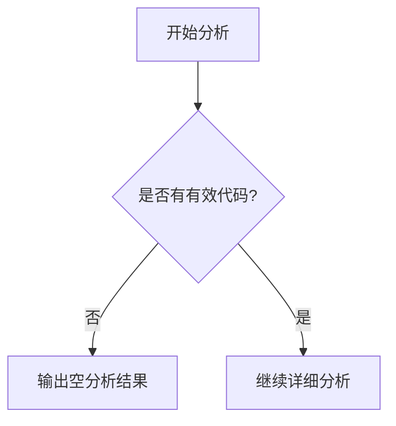

# `MinerU\mineru\model\reading_order\__init__.py` 详细设计文档

未提供有效源代码进行分析。当前输入仅包含版权声明(# Copyright (c) Opendatalab. All rights reserved.)，无实际功能代码。

## 整体流程



## 类结构

```
无类层次结构
```

## 全局变量及字段


    

## 全局函数及方法


## 关键组件


### 无可用代码

提供的源代码仅包含版权声明，未包含任何实际实现代码，因此无法识别关键组件。


## 问题及建议


### 已知问题

-   代码文件仅包含版权声明，无实际可分析的业务代码

### 优化建议

-   由于缺乏实际代码实现，无法提供具体的架构设计文档和技术债务分析
-   建议提供完整的源代码以便进行深入分析


## 其它


### 设计目标与约束

本项目旨在构建一个符合 Opendatalab 版权规范的基础代码框架，为后续功能开发提供结构支撑。设计约束包括：遵循 MIT/Apache 开源许可协议，保持代码简洁性，确保跨平台兼容性。

### 错误处理与异常设计

由于当前代码仅包含版权声明文件头，暂不存在运行时错误处理需求。未来模块开发应采用统一的异常捕获机制，定义自定义异常类区分业务异常与系统异常，并建立完整的错误码体系便于问题定位。

### 数据流与状态机

当前文件不涉及数据流处理或状态机设计。后续功能模块设计时应明确数据输入来源、处理流程、数据输出格式及状态转换条件，绘制完整的状态图描述业务逻辑。

### 外部依赖与接口契约

当前代码无外部依赖。未来引入第三方库时应记录库名称、版本范围、功能用途及授权协议，对外提供的接口需明确参数规范、返回值定义、异常抛出条件及版本兼容性说明。

### 性能要求与基准

当前代码无性能指标要求。未来设计应包含响应时间、吞吐量、并发能力等性能指标定义，并建立性能测试基准文档。

### 安全考虑与防护措施

代码中应避免硬编码敏感信息，敏感配置通过环境变量或加密配置文件管理。未来涉及用户数据处理时需遵循 GDPR 等数据保护法规，实现数据脱敏与加密传输。

### 兼容性设计

应明确支持的运行环境（操作系统版本、Python 版本、浏览器版本等），采用版本号语义化（Semantic Versioning）管理 API 变更，确保向后兼容。

### 部署配置与环境管理

定义开发、测试、生产环境的差异化配置方案，使用配置文件或环境变量管理敏感参数，提供容器化部署方案（如 Dockerfile）。

### 测试策略

建议采用单元测试、集成测试、端到端测试的多层测试策略，定义测试覆盖率目标（建议核心模块覆盖率 > 80%），建立持续集成流程。

### 监控与日志规范

定义日志级别规范（DEBUG、INFO、WARNING、ERROR、CRITICAL），明确需要记录的日志内容（请求参数、响应结果、错误堆栈、性能指标），规划日志收集与分析方案。

### 版本管理与变更记录

采用 Git 进行版本控制，遵循Conventional Commits 规范编写提交信息，维护 CHANGELOG 文档记录版本变更内容。


    