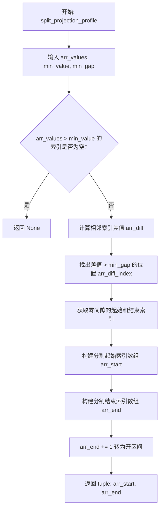
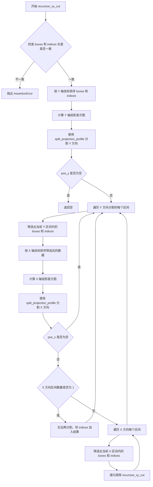
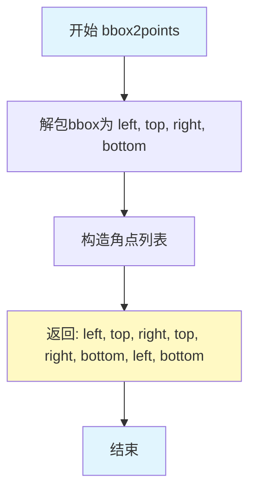
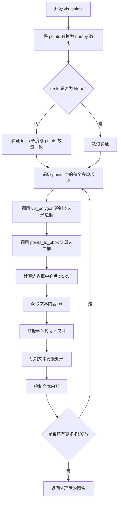
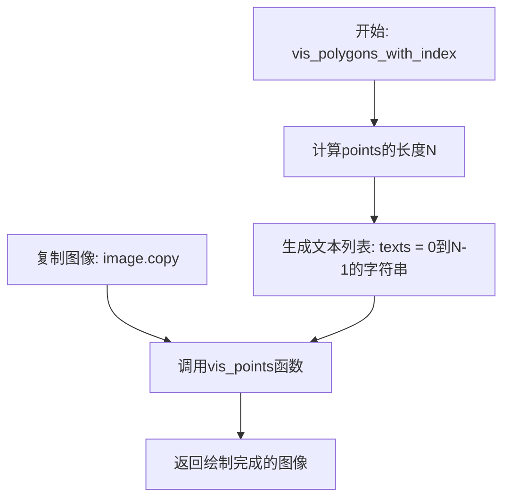

# `MinerU\mineru\model\reading_order\xycut.py` 详细设计文档

该代码实现了一个基于递归XY切割算法的文本区域分割工具，通过计算边界框在X和Y轴上的投影直方图来分割文本行或段落，并提供了可视化函数用于调试和展示分割结果。

## 整体流程

```mermaid
graph TD
    Start[输入: boxes (N, 4), indices, res] --> SortY[按Y坐标排序 boxes 和 indices]
    SortY --> ProjY[调用 projection_by_bboxes 计算Y轴投影]
    ProjY --> SplitY[调用 split_projection_profile 分割Y轴投影]
    SplitY --> CheckY{pos_y 是否为空?}
    CheckY -- 是 --> ReturnY[返回]
    CheckY -- 否 --> IterateY[遍历 Y 轴分割区间 (arr_y0, arr_y1)]
    IterateY --> FilterY[根据 Y 区间过滤 boxes 和 indices]
    FilterY --> SortX[在区间内按 X 坐标排序]
    SortX --> ProjX[调用 projection_by_bboxes 计算 X 轴投影]
    ProjX --> SplitX[调用 split_projection_profile 分割 X 轴投影]
    SplitX --> CheckX{pos_x 是否为空?]
    CheckX -- 是 --> NextY[继续下一个 Y 区间]
    CheckX -- 否 --> CheckLen{len(arr_x0) == 1?]
    CheckLen -- 是 --> AddRes[将当前区间所有 indices 加入 res]
    CheckLen -- 否 --> Recursive[对每个 X 区间递归调用 recursive_xy_cut]
    Recursive --> NextY
    AddRes --> NextY
```

## 类结构

```
text_segmentation (模块)
├── 投影计算
│   └── projection_by_bboxes (计算投影直方图)
├── 投影分割
│   └── split_projection_profile (分割投影轮廓)
├── 递归分割
│   └── recursive_xy_cut (递归 XY 切割主函数)
├── 坐标转换
│   ├── points_to_bbox (点转边界框)
│   └── bbox2points (边界框转点)
└── 可视化
    ├── vis_polygon (绘制多边形)
    ├── vis_points (绘制点并标注文本)
    └── vis_polygons_with_index (绘制带索引的多边形)
```

## 全局变量及字段


### `projection_by_bboxes`
    
通过一组bbox获得投影直方图，按投影方向输出1D直方图。

类型：`function`
    


### `split_projection_profile`
    
根据投影直方图分割区域，返回分割的起始和结束索引。

类型：`function`
    


### `recursive_xy_cut`
    
递归地在X和Y方向上切割文本框列表，实现分块。

类型：`function`
    


### `points_to_bbox`
    
将8个点坐标转换为左、上、右、下的边界框格式。

类型：`function`
    


### `bbox2points`
    
将边界框的左、上、右、下转换为8个点坐标。

类型：`function`
    


### `vis_polygon`
    
在图像上绘制多边形轮廓线。

类型：`function`
    


### `vis_points`
    
在图像上绘制多个点集及其对应的文本标签。

类型：`function`
    


### `vis_polygons_with_index`
    
在图像上绘制带索引编号的点集。

类型：`function`
    


    

## 全局函数及方法


### `projection_by_bboxes`

该函数通过一组边界框（bbox）在指定轴向上的投影，计算每像素位置的投影直方图，用于文本行或文本块的分割定位。

参数：

- `boxes`：`np.array`，形状为 [N, 4] 的数组，每行表示一个 bbox 的坐标 [x1, y1, x2, y2]
- `axis`：`int`，投影轴向，0 表示沿 x 轴（水平方向）投影，1 表示沿 y 轴（垂直方向）投影

返回值：`np.ndarray`，1D 投影直方图数组，长度为投影方向坐标的最大值

#### 流程图

```mermaid
flowchart TD
    A[开始: 输入 boxes, axis] --> B{axis in [0, 1]?}
    B -- 否 --> C[断言失败]
    B -- 是 --> D[计算投影方向最大坐标: length = np.max<br/>boxes[:, axis::2]]
    E[初始化零数组: res = np.zeros<br/>(length, dtype=int)]
    E --> F[遍历每个 bbox 的起止坐标]
    F --> G[累加投影计数: res[start:end] += 1]
    G --> H{还有 bbox 未处理?}
    H -- 是 --> F
    H -- 否 --> I[返回投影直方图 res]
```

#### 带注释源码

```python
def projection_by_bboxes(boxes: np.array, axis: int) -> np.ndarray:
    """
    通过一组 bbox 获得投影直方图，最后以 per-pixel 形式输出

    Args:
        boxes: [N, 4]，N 个 bbox，每个 bbox 包含 4 个坐标值 [x1, y1, x2, y2]
        axis: 0-x坐标向水平方向投影， 1-y坐标向垂直方向投影

    Returns:
        1D 投影直方图，长度为投影方向坐标的最大值
        （我们不需要图片的实际边长，因为只是要找文本框的间隔）

    """
    # 断言确保 axis 参数合法，只能为 0 或 1
    assert axis in [0, 1]
    
    # 计算投影方向的最大坐标值
    # boxes[:, axis::2] 选取所有行的 axis 和 axis+2 列（即起始和结束坐标）
    # 例如 axis=0 时选取 [x1, x2]，axis=1 时选取 [y1, y2]
    length = np.max(boxes[:, axis::2])
    
    # 初始化投影直方图数组，长度为投影方向的最大坐标值
    # 使用 int 类型以支持累加计数
    res = np.zeros(length, dtype=int)
    
    # TODO: how to remove for loop?
    # 遍历每个 bbox 的起止坐标，累加投影计数
    # boxes[:, axis::2] 同样选取起始和结束坐标
    for start, end in boxes[:, axis::2]:
        # 对 [start, end) 区间内的每个像素位置加 1
        # 表示该位置有一个 bbox 投影通过
        res[start:end] += 1
    
    # 返回 1D 投影直方图
    return res
```


### `split_projection_profile`

该函数基于投影剖面（Projection Profile）实现文本或图像区域的自动切分功能。通过设定最小值阈值过滤噪声，并利用最小间隙宽度识别文本行或列之间的空白间隔，从而将连续的投影区域分割为独立的分组，最终返回每个分组的起始和结束索引。

参数：

- `arr_values`：`np.array`，一维投影直方图数组，表示沿某个方向（水平或垂直）的投影强度分布
- `min_value`：`float`，最小值阈值，用于过滤低于该值的投影高度（可去除噪声）
- `min_gap`：`float`，最小间隙宽度，用于判断两个投影区域之间的间隔是否足够大以视为分隔

返回值：`tuple`，包含两个 numpy 一维数组 `(arr_start, arr_end)`，分别表示分割后各分组的起始索引和结束索引（结束索引为开区间，即 Python 切片形式）；若输入数组为空或无有效投影区域则返回 `None`

#### 流程图



#### 带注释源码

```python
def split_projection_profile(arr_values: np.array, min_value: float, min_gap: float):
    """
    基于投影剖面切分文本区域或图像区域

    Args:
        arr_values (np.array): 一维投影直方图数组
        min_value (float): 最小值阈值，低于此值的投影高度将被忽略（用于过滤噪声）
        min_gap (float): 最小间隙宽度，用于判断两个有效区域之间的间隔是否足够大

    Returns:
        tuple: (起始索引数组, 结束索引数组)，若无有效区域则返回 None
    """
    # 筛选出投影值超过阈值的索引（即有效区域的像素位置）
    arr_index = np.where(arr_values > min_value)[0]
    
    # 如果没有有效索引，直接返回 None
    if not len(arr_index):
        return

    # 计算相邻有效索引之间的差值，用于寻找间隔
    # 例如: [0,1,2,5,6,10] -> diff = [1,1,3,1,4]
    arr_diff = arr_index[1:] - arr_index[0:-1]
    
    # 找出差值大于 min_gap 的位置，这些位置代表有效的分隔区域
    arr_diff_index = np.where(arr_diff > min_gap)[0]
    
    # 获取零间隙区间的起始和结束索引
    # 零间隙区间的起点是前一个有效区域的终点，终点是后一个有效区域的起点
    arr_zero_intvl_start = arr_index[arr_diff_index]
    arr_zero_intvl_end = arr_index[arr_diff_index + 1]

    # 转换为投影范围的索引：
    # 第一个分割区域的起始 = 第一个有效索引
    # 后续分割区域的起始 = 前一个零间隙区间的结束索引
    arr_start = np.insert(arr_zero_intvl_end, 0, arr_index[0])
    
    # 分割区域的结束 = 零间隙区间的起始索引（不含），最后一个区域的结束 = 最后一个有效索引
    arr_end = np.append(arr_zero_intvl_start, arr_index[-1])
    
    # 结束索引 +1 是为了符合 Python 切片左闭右开的习惯
    arr_end += 1

    return arr_start, arr_end
```


### `recursive_xy_cut`

该函数是递归XY切割算法的核心实现，用于将一组边界框（bounding boxes）按照投影轮廓分割成若干个簇。它通过在Y轴方向进行投影分割，筛选出水平方向的文本行区域，然后对每个行区域在X轴方向进行投影分割，以识别独立的文本列。如果某个区域在X方向无法再分割，则认为该区域是一个完整的文本块，将其索引添加到结果中。该算法是一种经典的文档图像版面分析方法，适用于从复杂布局中分离文本行和文本列。

参数：

- `boxes`：`np.ndarray`，形状为(N, 4)，表示N个边界框，每个边界框包含4个坐标值 [left, top, right, bottom]
- `indices`：`List[int]`，递归过程中始终表示 box 在原始数据中的索引，用于追踪原始输入顺序
- `res`：`List[int]`，保存输出结果，函数会将最终无法再分割的文本块对应的原始索引添加到这个列表中

返回值：`None`（无返回值），结果通过修改 `res` 参数列表输出

#### 流程图



#### 带注释源码

```python
def recursive_xy_cut(boxes: np.ndarray, indices: List[int], res: List[int]):
    """
    递归XY切割算法：通过对边界框进行投影分析，将boxes分割成若干个文本块

    Args:
        boxes: (N, 4) 形状的数组，每行代表一个边界框 [left, top, right, bottom]
        indices: 递归过程中始终表示 box 在原始数据中的索引
        res: 保存输出结果，最终包含无法再分割的文本块对应的原始索引

    Returns:
        None（结果通过修改 res 参数输出）
    """
    # 向 y 轴投影，先验证输入数据的有效性
    assert len(boxes) == len(indices)

    # 第一步：按 Y 轴坐标排序（从左到右，从上到下）
    # boxes[:, 1] 表示所有边界框的 top 坐标
    _indices = boxes[:, 1].argsort()  # argsort 返回排序后的索引
    y_sorted_boxes = boxes[_indices]  # 按 Y 坐标排序后的 boxes
    y_sorted_indices = indices[_indices]  # 同步排序 indices

    # debug_vis(y_sorted_boxes, y_sorted_indices)  # 调试用可视化函数（已注释）

    # 第二步：计算 Y 轴方向的投影直方图
    # axis=1 表示按垂直方向投影，用于找出水平方向的文本行间隔
    y_projection = projection_by_bboxes(boxes=y_sorted_boxes, axis=1)
    
    # 第三步：根据投影直方图分割 Y 方向（水平切割，找出文本行）
    # min_value=0: 忽略投影值为0的位置
    # min_gap=1: 最小间隙为1个像素
    pos_y = split_projection_profile(y_projection, 0, 1)
    
    # 如果没有分割点，直接返回
    if not pos_y:
        return

    # 第四步：遍历 Y 方向的每个分割区间（每行文本）
    arr_y0, arr_y1 = pos_y  # 分割区间的起止位置
    for r0, r1 in zip(arr_y0, arr_y1):
        # [r0, r1] 表示按照水平切分，有 bbox 的区域，对这些区域会再进行垂直切分
        # 筛选出 top 坐标在当前行区间内的所有 boxes
        _indices = (r0 <= y_sorted_boxes[:, 1]) & (y_sorted_boxes[:, 1] < r1)

        y_sorted_boxes_chunk = y_sorted_boxes[_indices]
        y_sorted_indices_chunk = y_sorted_indices[_indices]

        # 第五步：对当前行区域按 X 轴坐标排序
        _indices = y_sorted_boxes_chunk[:, 0].argsort()
        x_sorted_boxes_chunk = y_sorted_boxes_chunk[_indices]
        x_sorted_indices_chunk = y_sorted_indices_chunk[_indices]

        # 第六步：计算 X 轴方向的投影直方图
        # axis=0 表示按水平方向投影，用于找出垂直方向的文本列间隔
        x_projection = projection_by_bboxes(boxes=x_sorted_boxes_chunk, axis=0)
        
        # 第七步：根据投影直方图分割 X 方向（垂直切割，找出文本列）
        pos_x = split_projection_profile(x_projection, 0, 1)
        
        # 如果没有分割点，跳过当前行
        if not pos_x:
            continue

        arr_x0, arr_x1 = pos_x
        
        # 第八步：检查 X 方向是否能继续分割
        if len(arr_x0) == 1:
            # x 方向无法切分，说明这是一个完整的文本块
            # 将该文本块的所有边界框索引加入结果
            res.extend(x_sorted_indices_chunk)
            continue

        # 第九步：X 方向上能分开，继续递归调用
        # 对每个列区间递归执行相同的分割逻辑
        for c0, c1 in zip(arr_x0, arr_x1):
            # 筛选出 left 坐标在当前列区间内的所有 boxes
            _indices = (c0 <= x_sorted_boxes_chunk[:, 0]) & (
                x_sorted_boxes_chunk[:, 0] < c1
            )
            # 递归调用，继续分割
            recursive_xy_cut(
                x_sorted_boxes_chunk[_indices], x_sorted_indices_chunk[_indices], res
            )
```


### `points_to_bbox`

该函数将表示四边形的8个点坐标（x1,y1,x2,y2,x3,y3,x4,y4）转换为Axis-Aligned Bounding Box（AABB）边界框，返回包含左上角和右下角坐标的列表。

参数：

- `points`：`List[int]` 或 `Tuple[int]`，表示四边形的8个顶点坐标，格式为 [x1,y1,x2,y2,x3,y3,x4,y4]

返回值：`List[int]`，返回边界框坐标 [left, top, right, bottom]，其中 left 为最小x坐标，top 为最小y坐标，right 为最大x坐标，bottom 为最大y坐标

#### 流程图

```mermaid
flowchart TD
    A[开始: points_to_bbox] --> B{检查points长度是否为8}
    B -->|是| C[提取所有x坐标: points[0], points[2], points[4], points[6]]
    B -->|否| D[断言失败, 抛出异常]
    C --> E[提取所有y坐标: points[1], points[3], points[5], points[7]]
    E --> F[left = min{x坐标}]
    F --> G[right = max{x坐标}]
    G --> H[top = min{y坐标}]
    H --> I[bottom = max{y坐标}]
    I --> J{left < 0?]
    J -->|是| K[left = 0]
    J -->|否| L{top < 0?}
    K --> L
    L -->|是| M[top = 0]
    L -->|否| N{right < 0?}
    M --> N
    N -->|是| O[right = 0]
    N -->|否| P{bottom < 0?}
    O --> P
    P -->|是| Q[bottom = 0]
    P -->|否| R[返回 [left, top, right, bottom]]
    Q --> R
```

#### 带注释源码

```python
def points_to_bbox(points):
    """
    将四边形的8个顶点坐标转换为Axis-Aligned Bounding Box边界框
    
    Args:
        points: 包含8个值的序列 [x1,y1,x2,y2,x3,y3,x4,y4]
                表示四边形的四个顶点坐标（顺时针或逆时针）
    
    Returns:
        List[int]: 边界框坐标 [left, top, right, bottom]
    """
    # 断言输入必须包含8个坐标值（4个顶点 × 2个坐标）
    assert len(points) == 8

    # [x1,y1,x2,y2,x3,y3,x4,y4]
    # 提取所有x坐标（偶数索引位置）
    left = min(points[::2])
    # 提取所有x坐标的最大值作为右边界
    right = max(points[::2])
    # 提取所有y坐标（奇数索引位置）的最小值作为上边界
    top = min(points[1::2])
    # 提取所有y坐标的最大值作为下边界
    bottom = max(points[1::2])

    # 确保坐标非负，不能小于0
    left = max(left, 0)
    top = max(top, 0)
    right = max(right, 0)
    bottom = max(bottom, 0)
    
    # 返回轴对齐的边界框 [左上x, 左上y, 右下x, 右下y]
    return [left, top, right, bottom]
```


### `bbox2points`

该函数用于将二维边界框（bbox）转换为四个角点（顺时针排列）的坐标表示形式，常用于图像处理和目标检测中与多边形表示的转换。

参数：

- `bbox`：`list` 或 `tuple`，输入的边界框，格式为 `[left, top, right, bottom]`，分别表示左、上、右、下的坐标值

返回值：`list`，返回四个角点的坐标列表，格式为 `[x1, y1, x2, y2, x3, y3, x4, y4]`，按顺时针顺序排列（左上、右上、右下、左下）

#### 流程图



#### 带注释源码

```python
def bbox2points(bbox):
    """
    将边界框转换为四个角点坐标
    
    参数:
        bbox: 边界框 [left, top, right, bottom]
        
    返回:
        四个角点坐标 [x1, y1, x2, y2, x3, y3, x4, y4]
        顺序为: 左上 -> 右上 -> 右下 -> 左下
    """
    # 从输入的边界框中解包出左上角和右下角坐标
    left, top, right, bottom = bbox
    
    # 按照顺时针方向构造四个角点
    # [左上, 右上, 右下, 左下]
    return [left, top, right, top, right, bottom, left, bottom]
```


### `vis_polygon`

该函数用于在图像上绘制由四个点组成的多边形（ quadrilateral）轮廓，通过依次连接四个顶点形成封闭的四边形边界，支持自定义线条粗细和颜色。

参数：

- `img`：`np.ndarray`，输入图像数据，即需要绘制多边形的图像
- `points`：`list`，包含四个点的列表，每个点为 `[x, y]` 坐标形式，用于定义四边形的四个顶点
- `thickness`：`int`，线条粗细，默认为 2
- `color`：`tuple`，线条颜色，默认为 None

返回值：`np.ndarray`，返回绘制后的图像对象

#### 流程图

```mermaid
flowchart TD
    A[开始 vis_polygon] --> B[设置四种边的颜色变量]
    B --> C[绘制第一边: points[0] 到 points[1]]
    C --> D[绘制第二边: points[1] 到 points[2]]
    D --> E[绘制第三边: points[2] 到 points[3]]
    E --> F[绘制第四边: points[3] 到 points[0]]
    F --> G[返回修改后的图像]
```

#### 带注释源码

```python
def vis_polygon(img, points, thickness=2, color=None):
    """
    在图像上绘制四边形多边形轮廓
    
    Args:
        img: 输入图像 (np.ndarray)
        points: 四个顶点的列表，每个点为 [x, y]
        thickness: 线条粗细
        color: 线条颜色
    
    Returns:
        绘制后的图像
    """
    # 设置四边形的四种边的颜色（目前都使用相同的color参数）
    br2bl_color = color      # bottom-right to bottom-left 边颜色
    tl2tr_color = color      # top-left to top-right 边颜色
    tr2br_color = color      # top-right to bottom-right 边颜色
    bl2tl_color = color      # bottom-left to top-left 边颜色
    
    # 绘制第一条边：从第一个点(points[0])到第二个点(points[1])
    # 对应四边形的上边 (top-left to top-right)
    cv2.line(
        img,
        (points[0][0], points[0][1]),  # 起点坐标 (x1, y1)
        (points[1][0], points[1][1]),  # 终点坐标 (x2, y2)
        color=tl2tr_color,             # 线条颜色
        thickness=thickness,           # 线条粗细
    )

    # 绘制第二条边：从第二个点(points[1])到第三个点(points[2])
    # 对应四边形的右边 (top-right to bottom-right)
    cv2.line(
        img,
        (points[1][0], points[1][1]),  # 起点坐标
        (points[2][0], points[2][1]),  # 终点坐标
        color=tr2br_color,             # 线条颜色
        thickness=thickness,           # 线条粗细
    )

    # 绘制第三条边：从第三个点(points[2])到第四个点(points[3])
    # 对应四边形的下边 (bottom-right to bottom-left)
    cv2.line(
        img,
        (points[2][0], points[2][1]),  # 起点坐标
        (points[3][0], points[3][1]),  # 终点坐标
        color=br2bl_color,             # 线条颜色
        thickness=thickness,           # 线条粗细
    )

    # 绘制第四条边：从第四个点(points[3])回到第一个点(points[0])
    # 对应四边形的左边 (bottom-left to top-left)，形成闭合四边形
    cv2.line(
        img,
        (points[3][0], points[3][1]),  # 起点坐标
        (points[0][0], points[0][1]),  # 终点坐标
        color=bl2tl_color,             # 线条颜色
        thickness=thickness,           # 线条粗细
    )
    
    # 返回绘制完成的图像（图像对象被直接修改）
    return img
```


### `vis_points`

该函数用于在图像上可视化多边形顶点坐标，可选择性地在每个多边形中心绘制对应的文本标签。通过遍历所有多边形点，调用 `vis_polygon` 绘制多边形边框，并计算边界框中心位置，最后使用 OpenCV 在图像上渲染文本标签和背景矩形。

参数：

- `img`：`np.ndarray`，输入的图像数据，用于在其上绘制多边形和文本
- `points`：`list` 或 `np.ndarray`，形状为 [N, 8] 的多边形顶点坐标数组，其中 8 表示 x1,y1,x2,y2,x3,y3,x4,y4
- `texts`：`List[str]`，可选参数，用于在每个多边形上显示的文本标签列表，长度需与 points 的第一维相等
- `color`：`tuple`，绘制多边形和文本背景的颜色，默认为 (0, 200, 0) 绿色

返回值：`np.ndarray`，返回绘制了多边形和文本后的图像数据

#### 流程图



#### 带注释源码

```python
def vis_points(
    img: np.ndarray, points, texts: List[str] = None, color=(0, 200, 0)
) -> np.ndarray:
    """
    在图像上可视化多边形顶点坐标，可选择性地显示文本标签

    Args:
        img: 输入图像，numpy 数组格式
        points: [N, 8] 形状的多边形顶点数组，8个值依次为 x1,y1,x2,y2,x3,y3,x4,y4
        texts: 可选的文本列表，每个多边形对应一个文本标签
        color: 绘制多边形和文本背景的颜色，默认为绿色 (0, 200, 0)

    Returns:
        绘制了多边形和文本后的图像
    """
    # 将输入的 points 转换为 numpy 数组以便后续处理
    points = np.array(points)
    
    # 如果提供了 texts 参数，验证其长度与多边形数量一致
    if texts is not None:
        assert len(texts) == points.shape[0]

    # 遍历每一个多边形点集
    for i, _points in enumerate(points):
        # 调用 vis_polygon 在图像上绘制多边形边框
        # _points.reshape(-1, 2) 将 [8] 转换为 [4, 2] 的顶点坐标
        vis_polygon(img, _points.reshape(-1, 2), thickness=2, color=color)
        
        # 根据多边形顶点计算轴对齐边界框 [left, top, right, bottom]
        bbox = points_to_bbox(_points)
        left, top, right, bottom = bbox
        
        # 计算边界框的中心点坐标，用于放置文本标签
        cx = (left + right) // 2
        cy = (top + bottom) // 2

        # 获取当前多边形对应的文本内容
        txt = texts[i]
        
        # 使用 OpenCV 简单字体
        font = cv2.FONT_HERSHEY_SIMPLEX
        
        # 获取文本的像素尺寸，用于计算背景矩形的正确大小
        # 参数: 文本, 字体, 缩放比例, 线条粗细
        cat_size = cv2.getTextSize(txt, font, 0.5, 2)[0]

        # 绘制文本的背景矩形，使其更醒目
        # 矩形左上角: 文本左侧向左偏移 5*len(txt)，向上偏移 cat_size[1]+5
        # 矩形右下角: 基于左上角加上文本尺寸
        img = cv2.rectangle(
            img,
            (cx - 5 * len(txt), cy - cat_size[1] - 5),  # 左上角坐标
            (cx - 5 * len(txt) + cat_size[0], cy - 5),  # 右下角坐标
            color,
            -1,  # 填充颜色，-1 表示填充整个矩形
        )

        # 在图像上绘制文本内容
        # 文本颜色设为白色 (255, 255, 255)
        img = cv2.putText(
            img,
            txt,
            (cx - 5 * len(txt), cy - 5),  # 文本左下角坐标
            font,
            0.5,  # 字体缩放比例
            (255, 255, 255),  # 文本颜色白色
            thickness=1,  # 文本线条粗细
            lineType=cv2.LINE_AA,  # 抗锯齿线条类型
        )

    # 返回处理完成的图像
    return img
```


### `vis_polygons_with_index`

该函数用于在图像上可视化多个多边形区域，并为每个多边形绘制对应的索引编号（从0开始的数字），通常用于调试或展示文本检测、OCR等任务的输出结果。

参数：

- `image`：`np.ndarray`，输入的原始图像矩阵
- `points`：`List` 或 `np.ndarray`，待可视化的多边形点集，形状为 [N, 8]，每个多边形包含8个坐标值（x1,y1,x2,y2,x3,y3,x4,y4）

返回值：`np.ndarray`，返回绘制了多边形轮廓和索引编号的图像矩阵

#### 流程图



#### 带注释源码

```python
def vis_polygons_with_index(image, points):
    """
    在图像上可视化多个多边形，并为每个多边形添加索引编号
    
    Args:
        image: 输入图像矩阵 (np.ndarray)
        points: 多边形点集，形状为 [N, 8]，每个元素包含8个坐标值
    
    Returns:
        绘制了多边形和索引编号的图像矩阵
    """
    # 根据多边形的数量生成从0开始的序号文本列表
    # 例如：若points有3个多边形，则texts = ['0', '1', '2']
    texts = [str(i) for i in range(len(points))]
    
    # 复制原始图像，避免修改原图
    # 调用vis_points函数进行绘制，该函数会：
    # 1. 遍历每个多边形点集
    # 2. 调用vis_polygon绘制四边形轮廓
    # 3. 计算多边形的外接矩形，并在中心位置标注序号文本
    res_img = vis_points(image.copy(), points, texts)
    
    # 返回绘制完成的图像
    return res_img
```

## 关键组件


### 投影计算模块 (projection_by_bboxes)

通过一组边界框计算投影直方图，支持沿x轴或y轴方向的像素级投影，用于文本行检测。

### 投影分割模块 (split_projection_profile)

基于阈值和间隙参数对投影直方图进行分割，找出文本区域的起止索引，实现递归XY分割的核心逻辑。

### 递归XY切割算法 (recursive_xy_cut)

核心分割算法，通过交替在y轴和x轴上进行投影，将文档图像中的文本框递归分割为独立的文本区域。

### 坐标转换工具 (points_to_bbox / bbox2points)

负责8点坐标与4点边界框之间的相互转换，支持任意四边形的最小外接矩形计算。

### 可视化模块 (vis_polygon / vis_points / vis_polygons_with_index)

提供多种调试可视化功能，包括多边形绘制、文本框标注和带索引的分割结果展示，便于算法调试和结果验证。


## 问题及建议


### 已知问题

-   **TODO未完成**：代码中存在TODO注释“how to remove for loop?”，投影函数`projection_by_bboxes`中使用for循环遍历bbox，效率低下，存在优化空间
-   **硬编码参数**：`recursive_xy_cut`函数中`min_value=0`和`min_gap=1`硬编码，未作为参数暴露，限制了该函数的通用性和可配置性
-   **缺乏输入校验**：函数缺乏对输入数据的有效性校验，如`points_to_bbox`、`bbox2points`、`projection_by_bboxes`等函数未对输入格式进行严格验证，可能导致隐藏的运行时错误
-   **递归栈溢出风险**：`recursive_xy_cut`使用递归实现，对于大规模边界框数据可能导致栈溢出，递归深度无法控制
-   **不必要的数组复制**：在`recursive_xy_cut`中大量使用numpy切片操作，会创建新的数组副本而非视图，增加内存开销
-   **坐标计算逻辑错误**：`points_to_bbox`函数中`right = max(right, 0)`和`bottom = max(bottom, 0)`逻辑错误，应该确保坐标非负但不应将负值转为0
-   **重复代码**：`vis_polygon`函数中四个方向的cv2.line调用存在大量重复代码，可以简化
-   **类型注解不完整**：部分函数参数和返回值缺少类型注解，如`projection_by_bboxes`返回类型写错（np.array应为np.ndarray），`vis_points`等函数的points参数缺少类型
-   **文档不完善**：核心函数`recursive_xy_cut`、`points_to_bbox`等缺少完整的文档说明
-   **assert过度使用**：使用assert进行参数校验不够优雅，assert可能被python -O优化掉，应使用明确的异常处理
-   **边界框格式不统一**：代码中混用`[left,top,right,bottom]`和`[x1,y1,x2,y2,x3,y3,x4,y4]`两种格式，容易造成混淆且缺少显式定义
-   **变量命名不规范**：使用单下划线`_indices`表示私有变量，但实际Python中单下划线并无特殊含义，命名较为随意

### 优化建议

-   **向量化优化**：使用numpy的add.at或bincount等方法重写`projection_by_bboxes`，消除for循环，提升性能
-   **参数化设计**：为`recursive_xy_cut`添加min_value和min_gap参数，提供默认值以保持向后兼容
-   **添加输入校验**：使用try-except或明确的类型检查验证输入数据的合法性
-   **迭代改写递归**：使用显式栈或队列替代递归，实现迭代版本的XY-Cut算法，消除栈溢出风险
-   **内存优化**：考虑使用索引而非切片，或使用numpy视图减少不必要的数据复制
-   **修正坐标逻辑**：将`right = max(right, 0)`改为`right = max(right, left)`等确保边界框有效性的逻辑
-   **代码简化**：将`vis_polygon`中的重复cv2.line调用封装为循环
-   **完善类型注解**：补充所有缺失的类型注解，修正错误的返回类型声明
-   **添加文档**：为所有函数添加完整的docstring，包括参数说明和返回值描述
-   **异常处理设计**：使用自定义异常类替代assert进行错误处理，提供更友好的错误信息
-   **统一接口约定**：明确定义边界框的数据格式约定，可以考虑使用dataclass或NamedTuple
-   **增加测试**：添加单元测试覆盖主要功能的边界情况和异常输入

## 其它


### 设计目标与约束

**设计目标**：
- 实现基于投影分割的文本区域检测算法（Recursive XY Cut）
- 对图像中的多个文本框进行递归切分，实现文本行的自动分割
- 提供可视化工具便于调试和结果展示

**约束条件**：
- 输入的boxes格式为[N, 4]，即N个边界框，每4个值表示[x1, y1, x2, y2]
- points格式为[N, 8]，即N个多边形点，每8个值表示[x1,y1,x2,y2,x3,y3,x4,y4]
- 投影分割适用于水平或垂直方向的文本行分割
- 算法假设文本行大致水平排列，文本框之间有明显的间隙

### 错误处理与异常设计

**参数校验**：
- `projection_by_bboxes`: axis参数必须为0或1，否则抛出AssertionError
- `split_projection_profile`: 当arr_values全为0或小于min_value时返回None
- `recursive_xy_cut`: boxes和indices长度必须一致，否则抛出AssertionError
- `points_to_bbox`: points长度必须为8，否则抛出AssertionError

**边界情况处理**：
- 空输入：boxes为空数组时，projection_by_bboxes返回空数组；split_projection_profile返回None
- 单个box：recursive_xy_cut中当x方向无法切分时，直接将索引加入结果
- 无间隙：split_projection_profile中当间隙小于min_gap时不进行切分

### 数据流与状态机

**主要数据流**：
1. 输入：文本框坐标（boxes或points）
2. 投影计算：对boxes按Y轴或X轴方向投影生成直方图
3. 间隙检测：分析直方图找到零间隙区域
4. 递归切分：按间隙位置切分区域，递归处理子区域
5. 输出：排序后的文本框索引列表

**状态转换**：
- 初始状态 → Y轴投影 → 水平切分
- 水平切分后 → X轴投影 → 垂直切分
- 垂直切分后 → 递归调用或返回结果

### 外部依赖与接口契约

**依赖库**：
- `numpy`: 数组操作和数值计算
- `cv2` (OpenCV): 图像处理和可视化

**接口契约**：
- `projection_by_bboxes(boxes, axis)`: 输入N×4的numpy数组和axis标识，返回1D投影直方图
- `split_projection_profile(arr_values, min_value, min_gap)`: 输入投影数组和阈值，返回(start_indices, end_indices)元组或None
- `recursive_xy_cut(boxes, indices, res)`: 原地修改res列表，无返回值
- `points_to_bbox(points)`: 输入8元素列表，返回[left, top, right, bottom]
- `bbox2points(bbox)`: 输入4元素列表，返回8元素列表
- `vis_points(img, points, texts, color)`: 输入图像和点集，返回带注释的图像

### 使用示例与调用流程

**典型调用流程**：
1. 准备文本检测结果（boxes或points）
2. 调用points_to_bbox转换为边界框格式
3. 调用recursive_xy_cut进行递归分割
4. 使用vis_points或vis_polygons_with_index可视化结果

### 性能考虑与优化空间

**当前性能瓶颈**：
- projection_by_bboxes中使用for循环遍历所有boxes，建议向量化优化
- 递归调用存在大量数组复制操作

**优化建议**：
- 使用NumPy向量化操作替代for循环
- 考虑使用原地操作减少内存分配
- 可使用numba等JIT编译加速计算密集型函数

### 边界条件与特殊输入

**特殊输入处理**：
- 完全重叠的boxes：投影后无法分割，结果会合并
- 极小间隙：min_gap参数控制分割敏感度
- 倾斜文本：当前算法仅适用于水平/垂直对齐的文本框
- 空图像区域：返回空结果


    