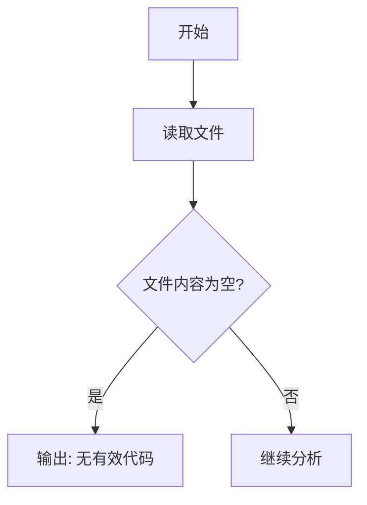

# `MinerU\mineru\model\table\__init__.py` 详细设计文档

该代码文件仅包含版权声明，无实际功能代码可供分析。

## 整体流程



## 类结构

```

```

## 全局变量及字段


    

## 全局函数及方法


## 关键组件


## 问题及建议


### 已知问题

- 代码文件仅包含版权声明，没有任何实际功能代码或业务逻辑实现
- 缺少类、函数、变量等代码元素，无法进行完整的技术分析和优化
- 无法从该文件中提取任何架构设计、模块依赖或技术债务信息

### 优化建议

- 该文件仅为占位符或文件头声明，需要补充实际的业务代码实现
- 建议提供完整的代码文件以进行有意义的架构分析和优化建议
- 如果该文件为初始化模板，应在添加实际业务逻辑后进行设计文档的编写


## 其它


### 设计目标与约束

由于提供的代码仅为一行版权声明（`# Copyright (c) Opendatalab. All rights reserved.`），不包含任何功能实现代码，因此无法提取具体的设计目标与约束。在正常项目设计中，此部分应包含：性能要求（响应时间、吞吐量、并发数等）、安全性要求（加密、认证、授权等）、兼容性要求（支持的平台、浏览器、SDK版本等）、代码规范约束（编程语言版本、编码规范、命名约定等）。

### 错误处理与异常设计

当前代码片段不涉及错误处理逻辑。详细设计文档应包含：异常分类体系（系统异常、业务异常、第三方异常等）、异常码定义规范、异常传播机制、异常日志记录策略、降级熔断策略、错误码与错误信息映射表等内容。

### 数据流与状态机

由于代码无实际功能，不涉及数据流转。在完整设计中应包含：数据输入来源、数据处理流程、数据输出目标、数据持久化策略、状态机定义（状态、事件、转换规则）、状态变更触发条件、状态持久化机制等。

### 外部依赖与接口契约

当前代码无外部依赖。在详细设计中应包含：第三方库依赖（名称、版本、用途）、外部API接口（接口地址、请求参数、响应格式、错误码）、数据库连接（数据库类型、连接池配置）、消息队列（队列名称、消息格式、消费逻辑）、缓存系统（缓存策略、过期策略）等。

### 安全性考虑

代码为版权声明，无安全相关实现。设计文档应包含：身份认证机制（认证方式、Token管理、会话管理）、授权控制（权限模型、角色定义、访问控制列表）、数据加密（加密算法、密钥管理、敏感数据保护）、输入验证（校验规则、过滤机制、SQL注入防护）、审计日志（操作记录、访问日志、合规要求）等。

### 性能要求与优化策略

无功能代码无法提取性能指标。设计文档应包含：性能指标定义（TPS、响应时间、并发数、资源利用率）、性能测试场景、性能瓶颈分析、缓存策略（缓存位置、缓存粒度、缓存失效）、负载均衡策略、水平扩展方案等。

### 兼容性设计

当前代码片段无兼容性要求。设计文档应包含：向前向后兼容性策略、API版本管理、配置文件格式兼容、数据迁移策略、弃用机制等。

### 测试策略

无功能代码无法制定测试策略。设计文档应包含：单元测试覆盖率要求、集成测试场景、系统测试用例、性能测试计划、混沌工程实践、测试数据管理、测试环境定义等。

### 部署架构

无功能代码无法设计部署架构。设计文档应包含：部署拓扑图（前端、后端、数据库、缓存、消息队列等组件关系）、容器化方案（Dockerfile、镜像管理）、编排方案（Kubernetes配置）、环境定义（开发、测试、预发布、生产）、持续集成/持续部署流程等。

### 监控与运维

无功能代码无法设计监控方案。设计文档应包含：监控指标定义（系统指标、业务指标）、告警策略（告警阈值、告警渠道、告警级别）、日志规范（日志格式、日志级别、日志收集）、链路追踪方案、运维手册、故障应急预案等。

### 配置管理

无功能代码无法设计配置管理。设计文档应包含：配置项清单（配置名称、类型、默认值、取值范围）、配置存储方式（配置文件、环境变量、配置中心）、配置变更流程、敏感配置加密、配置版本管理等。

### 事务与并发控制

无功能代码不涉及事务。在完整设计中应包含：事务传播行为、事务隔离级别、分布式事务方案、锁策略（乐观锁、悲观锁）、死锁处理、并发线程池配置等。

### 模块间通信

无功能代码无法设计通信机制。设计文档应包含：同步通信方式（HTTP、RPC、gRPC）、异步通信方式（消息队列、事件驱动）、通信协议定义、数据序列化方式、服务注册与发现机制、负载均衡策略等。

### 总结

当前提供的代码仅为开源许可证的版权声明，不包含任何功能性实现代码，因此无法提取完整的类结构、方法、字段、全局变量、数据流等技术细节。详细设计文档的所有技术性内容均无法从该代码片段中生成。在实际项目中，详细设计文档应基于完整的功能实现代码进行编写，涵盖上述所有方面以确保项目的可维护性、可扩展性和可追溯性。

    