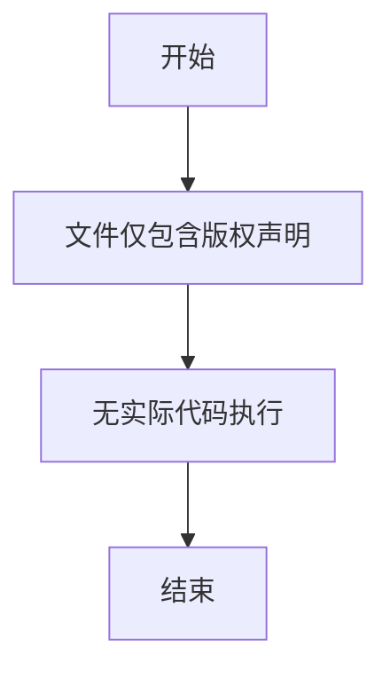

# `MinerU\mineru\model\table\cls\__init__.py` 详细设计文档

该代码文件仅包含版权声明信息，没有任何实际的类、方法或功能实现，是一个空白的Python文件。

## 整体流程



## 类结构

```
无类结构（代码文件为空）
```

## 全局变量及字段


    

## 全局函数及方法


## 关键组件


### 代码概述

该代码片段仅包含版权声明信息，不包含任何实际功能实现代码，因此无法进行架构分析。

### 文件整体运行流程

无实际代码可供分析。

### 类详细信息

无类定义可供分析。

### 全局变量和全局函数

无全局变量或函数可供分析。

### 关键组件信息

由于源代码仅包含版权头，无实际实现代码，因此不存在可识别的关键组件。

### 潜在的技术债务或优化空间

无代码可供分析。

### 其它项目

- 设计目标与约束：无
- 错误处理与异常设计：无
- 数据流与状态机：无
- 外部依赖与接口契约：无

### 结论

提供的代码片段不包含可分析的实现内容，仅有一个版权声明。要生成完整的详细设计文档，需要提供实际的源代码实现。


## 问题及建议


### 已知问题

- 代码文件仅包含版权声明信息，缺乏实际功能实现代码，无法进行详细的技术债务分析
- 无法识别具体的类结构、方法实现、变量定义等关键组件
- 由于缺乏实际代码，无法评估代码的潜在缺陷、设计不合理之处或性能瓶颈

### 优化建议

- 请提供完整的源代码文件以进行深入分析
- 包含具体的类定义、函数实现、业务逻辑代码等
- 如有多个文件，请提供完整的项目结构或所有相关代码文件
- 在获得实际代码后，可从以下方面进行技术债务分析：代码重复、硬编码值、缺乏错误处理、性能瓶颈、安全隐患、可维护性问题、测试覆盖率等方面进行全面评估


## 其它


### 一段话描述

不适用 - 代码中仅包含版权声明，无实际功能实现

### 文件的整体运行流程

不适用 - 无实际功能代码

### 类的详细信息

不适用 - 无类定义

### 关键组件信息

不适用 - 无关键组件

### 潜在的技术债务或优化空间

不适用 - 无实际代码可供分析

### 设计目标与约束

待补充 - 需要提供实际功能代码后确定

### 错误处理与异常设计

待补充 - 需要提供实际功能代码后确定

### 数据流与状态机

待补充 - 需要提供实际功能代码后确定

### 外部依赖与接口契约

待补充 - 需要提供实际功能代码后确定

### 安全性设计

待补充 - 需要提供实际功能代码后确定

### 性能要求与指标

待补充 - 需要提供实际功能代码后确定

### 兼容性考虑

待补充 - 需要提供实际功能代码后确定

### 测试策略

待补充 - 需要提供实际功能代码后确定

### 部署与运维注意事项

待补充 - 需要提供实际功能代码后确定

### 文档维护建议

由于当前仅包含版权声明，建议补充完整的源代码后，再进行详细设计文档的编写。当前文档内容待后续更新。

    