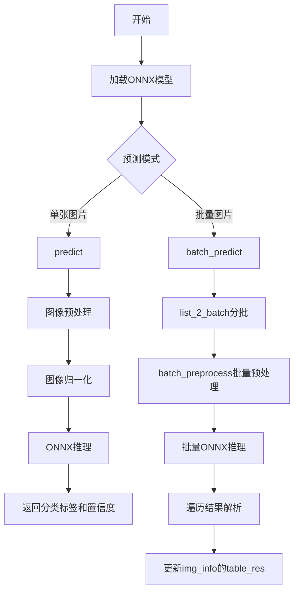
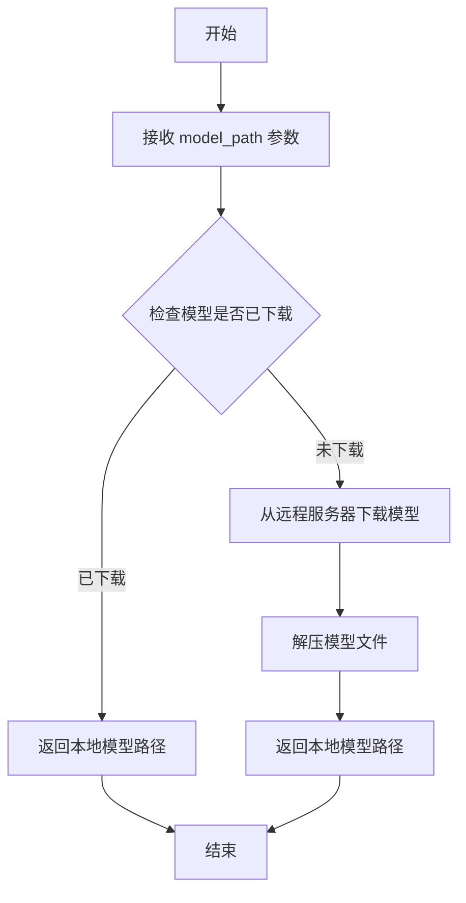
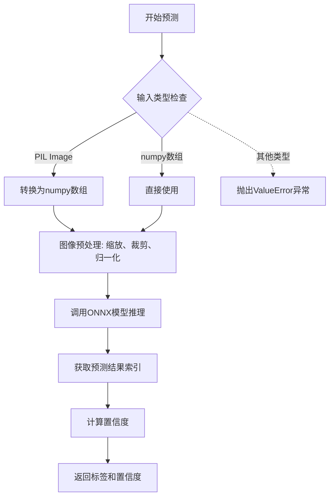
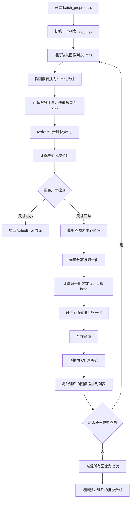
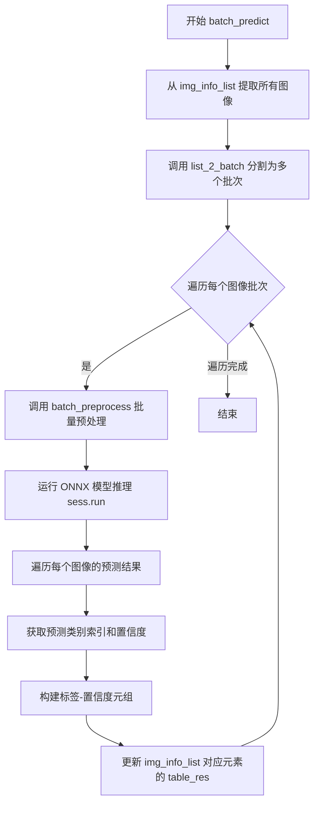

# `MinerU\mineru\model\table\cls\paddle_table_cls.py` 详细设计文档

一个基于ONNX Runtime的表格分类模型，用于识别图片中的表格类型（WiredTable有线表格或WirelessTable无线表格），支持单张图片预测和批量图片预测两种模式。

## 整体流程



## 类结构

```
PaddleTableClsModel (表格分类模型类)
```

## 全局变量及字段


### `PaddleTableClsModel.sess`
    
ONNX推理会话

类型：`onnxruntime.InferenceSession`
    


### `PaddleTableClsModel.less_length`
    
最短边目标长度(256)

类型：`int`
    


### `PaddleTableClsModel.cw`
    
目标宽度(224)

类型：`int`
    


### `PaddleTableClsModel.ch`
    
目标高度(224)

类型：`int`
    


### `PaddleTableClsModel.std`
    
归一化标准差[0.229, 0.224, 0.225]

类型：`list`
    


### `PaddleTableClsModel.scale`
    
归一化缩放因子(0.00392156862745098)

类型：`float`
    


### `PaddleTableClsModel.mean`
    
归一化均值[0.485, 0.456, 0.406]

类型：`list`
    


### `PaddleTableClsModel.labels`
    
分类标签列表[WiredTable, WirelessTable]

类型：`list`
    
    

## 全局函数及方法


### `auto_download_and_get_model_root_path`

该函数是模型下载工具函数，用于自动下载指定的模型文件（如果未下载）并返回模型的根目录路径。它接收一个模型路径枚举值作为参数，返回模型文件所在的根目录字符串路径。

参数：

-  `model_path`：`ModelPath` 枚举类型，指定要下载的模型路径枚举值（如 `ModelPath.paddle_table_cls`）

返回值：`str`，返回模型根目录的路径字符串

#### 流程图



#### 带注释源码

```
# 注：该函数定义在 mineru.utils.models_download_utils 模块中
# 以下是基于代码上下文的推断实现

def auto_download_and_get_model_root_path(model_path: ModelPath) -> str:
    """
    自动下载并获取模型根目录路径
    
    Args:
        model_path: ModelPath枚举类型，指定要下载的模型
        
    Returns:
        str: 模型根目录的本地路径
    """
    # 1. 获取模型标识符
    model_name = model_path.value
    
    # 2. 检查本地缓存目录
    cache_dir = get_model_cache_dir()  # 获取模型缓存目录
    
    # 3. 构建模型完整路径
    model_full_path = os.path.join(cache_dir, model_name)
    
    # 4. 如果模型不存在，则下载
    if not os.path.exists(model_full_path):
        download_url = get_model_download_url(model_path)  # 获取下载链接
        download_and_extract(download_url, cache_dir)  # 下载并解压
        
    # 5. 返回模型根目录路径
    return model_full_path
```

**注意**：该函数的实际源码未在当前代码段中提供，上述源码为基于使用方式的合理推断。实际实现可能包含更多细节，如进度显示、错误处理、校验和验证等。


### `PaddleTableClsModel.__init__`

构造函数，初始化ONNX推理会话和图像预处理配置参数，包括模型加载、归一化参数设置和分类标签定义。

参数：

- 该方法无显式参数（除隐式参数 `self` 外）

返回值：无（`None`），构造函数不返回任何值

#### 流程图

```mermaid
flowchart TD
    A[开始 __init__] --> B[获取模型根路径]
    B --> C[构建模型完整路径]
    C --> D[创建 ONNX InferenceSession]
    D --> E[初始化配置参数]
    E --> F[设置 less_length = 256]
    E --> G[设置 cw, ch = 224, 224]
    E --> H[设置 std = [0.229, 0.224, 0.225]]
    E --> I[设置 scale = 0.00392156862745098]
    E --> J[设置 mean = [0.485, 0.456, 0.406]]
    E --> K[设置 labels = [WiredTable, WirelessTable]]
    K --> L[结束 __init__]
```

#### 带注释源码

```python
def __init__(self):
    """
    构造函数，初始化PaddleTableClsModel模型实例
    
    初始化内容包括：
    1. 加载ONNX模型并创建推理会话
    2. 配置图像预处理参数
    3. 定义分类标签
    """
    # 使用ONNX Runtime创建推理会话，加载预训练的表格分类模型
    # auto_download_and_get_model_root_path 用于自动下载并获取模型根目录
    # ModelPath.paddle_table_cls 指定具体模型路径
    self.sess = onnxruntime.InferenceSession(
        os.path.join(auto_download_and_get_model_root_path(ModelPath.paddle_table_cls), ModelPath.paddle_table_cls)
    )
    
    # 图像缩放的基准边长，预处理时将图像最短边缩放到256
    self.less_length = 256
    
    # 模型输入的目标宽高（224x224）
    self.cw, self.ch = 224, 224
    
    # ImageNet标准化参数 - 标准差
    self.std = [0.229, 0.224, 0.225]
    
    # 图像归一化缩放因子 (1/255)
    self.scale = 0.00392156862745098
    
    # ImageNet标准化参数 - 均值
    self.mean = [0.485, 0.456, 0.406]
    
    # 分类标签：WiredTable（有线条表格）和 WirelessTable（无线条表格）
    self.labels = [AtomicModel.WiredTable, AtomicModel.WirelessTable]
```


### `PaddleTableClsModel.preprocess`

该方法实现对单张图像的预处理操作，包括图像缩放、中心裁剪、归一化以及通道格式转换，将输入的BGR图像转换为符合PaddlePaddle Table模型输入要求的(1, 3, 224, 224)的float32张量。

参数：

- `input_img`：`np.ndarray`，输入的图像数据，要求为OpenCV格式（BGR通道顺序），通常由`cv2.imread`或从PIL转换而来

返回值：`np.ndarray`，预处理后的图像张量，形状为(1, 3, 224, 224)，数据类型为float32，包含batch维度

#### 流程图

```mermaid
flowchart TD
    A[开始: 接收输入图像 input_img] --> B[获取图像高度h和宽度w]
    B --> C[计算缩放比例: scale = 256 / minh, w]
    C --> D[计算缩放后尺寸: h_resize = roundh * scale, w_resize = roundw * scale]
    D --> E[使用cv2.resize放大图像]
    E --> F[计算裁剪坐标: x1 = max0, (w - cw) // 2, y1 = max0, (h - ch) // 2]
    F --> G[计算裁剪结束点: x2 = minw, x1 + cw, y2 = minh, y1 + ch]
    G --> H{检查图像尺寸: w < cw or h < ch}
    H -->|是| I[抛出ValueError异常]
    H -->|否| J[裁剪图像: img = img[y1:y2, x1:x2, ...]]
    J --> K[使用cv2.split分离BGR通道]
    K --> L[遍历每个通道进行归一化]
    L --> M[计算alpha和beta系数]
    M --> N[每个通道: split_imc = split_imc * alpha[c] + beta[c]]
    N --> O[使用cv2.merge合并通道]
    O --> P[转换为CHW格式: img = img.transpose2, 0, 1]
    P --> Q[包装为列表: imgs = [img]]
    Q --> R[堆叠为batch: x = np.stackimgs, axis=0]
    R --> S[转换为float32类型]
    S --> T[返回预处理后的张量 x]
```

#### 带注释源码

```python
def preprocess(self, input_img):
    # ------------------- 步骤1: 图像缩放 -------------------
    # 获取输入图像的高度和宽度
    h, w = input_img.shape[:2]
    # 计算缩放比例，使最短边长度为256
    scale = 256 / min(h, w)
    # 计算缩放后的高度和宽度（四舍五入取整）
    h_resize = round(h * scale)
    w_resize = round(w * scale)
    # 使用双线性插值(cv2.INTER_LINEAR=1)放大图像
    img = cv2.resize(input_img, (w_resize, h_resize), interpolation=1)
    
    # ------------------- 步骤2: 中心裁剪为224x224 -------------------
    # 获取缩放后图像的尺寸
    h, w = img.shape[:2]
    # 定义目标尺寸
    cw, ch = 224, 224
    # 计算裁剪起始坐标（从中心开始裁剪，边缘情况使用max确保不为负数）
    x1 = max(0, (w - cw) // 2)
    y1 = max(0, (h - ch) // 2)
    # 计算裁剪结束坐标（确保不超出图像边界）
    x2 = min(w, x1 + cw)
    y2 = min(h, y1 + ch)
    # 安全性检查：如果图像小于目标尺寸则抛出异常
    if w < cw or h < ch:
        raise ValueError(
            f"Input image ({w}, {h}) smaller than the target size ({cw}, {ch})."
        )
    # 执行裁剪操作
    img = img[y1:y2, x1:x2, ...]
    
    # ------------------- 步骤3: 归一化处理 -------------------
    # 分离BGR三个通道
    split_im = list(cv2.split(img))
    # 定义标准差、缩放因子和均值（ImageNet统计值）
    std = [0.229, 0.224, 0.225]
    scale = 0.00392156862745098  # 1/255
    mean = [0.485, 0.456, 0.406]
    # 计算归一化系数: alpha = scale/std, beta = -mean/std
    alpha = [scale / std[i] for i in range(len(std))]
    beta = [-mean[i] / std[i] for i in range(len(std))]
    # 对每个通道进行归一化: img = img * alpha + beta
    for c in range(img.shape[2]):
        split_im[c] = split_im[c].astype(np.float32)  # 转换为float32
        split_im[c] *= alpha[c]                       # 乘以缩放系数
        split_im[c] += beta[c]                        # 加上偏置
    # 合并通道
    img = cv2.merge(split_im)
    
    # ------------------- 步骤4: 转换为CHW格式 -------------------
    # 将HWC格式转换为CHW格式（通道前置）
    img = img.transpose((2, 0, 1))
    
    # ------------------- 步骤5: 添加batch维度并堆叠 -------------------
    # 包装为列表
    imgs = [img]
    # 堆叠为batch: 形状从(3, 224, 224)变为(1, 3, 224, 224)
    # copy=False避免不必要的内存拷贝
    x = np.stack(imgs, axis=0).astype(dtype=np.float32, copy=False)
    # 返回预处理后的张量
    return x
```


### `PaddleTableClsModel.predict`

该方法实现了对单张图像的表格类型预测（有线表格或无线表格），接收PIL图像或numpy数组，经过预处理后调用ONNX模型进行推理，返回预测的表格类型标签和置信度。

参数：

- `input_img`：`Union[Image.Image, np.ndarray]`，输入图像，支持PIL Image对象或numpy数组格式

返回值：`Tuple[Union[AtomicModel.WiredTable, AtomicModel.WirelessTable], float]`，返回预测的表格类型标签和对应的置信度

#### 流程图



#### 带注释源码

```python
def predict(self, input_img):
    # 1. 检查输入类型，如果是PIL Image则转换为numpy数组
    if isinstance(input_img, Image.Image):
        np_img = np.asarray(input_img)
    elif isinstance(input_img, np.ndarray):
        np_img = input_img
    else:
        # 输入类型不合法，抛出异常
        raise ValueError("Input must be a pillow object or a numpy array.")
    
    # 2. 对图像进行预处理：缩放、裁剪、归一化、转换为CHW格式
    x = self.preprocess(np_img)
    
    # 3. 调用ONNX Runtime执行推理，输入为预处理后的图像x
    result = self.sess.run(None, {"x": x})
    
    # 4. 从预测结果中获取概率最大的类别索引
    idx = np.argmax(result)
    
    # 5. 获取对应类别的置信度分数
    conf = float(np.max(result))
    
    # 6. 根据索引返回对应的标签和置信度
    return self.labels[idx], conf
```


### `PaddleTableClsModel.list_2_batch`

将任意长度的图像列表按照指定的批次大小（batch_size）分割成多个批次，每个批次都是一个子列表，返回一个包含所有批次的列表。

参数：

- `self`：类实例本身，由 `PaddleTableClsModel` 类的方法隐式传递
- `img_list`：`List[Any]`，输入的图像列表，待分割的原始列表
- `batch_size`：`int`，每个批次的大小，默认为16，控制每批包含的元素数量

返回值：`List[List[Any]]`，返回一个包含多个批次的列表，每个批次都是原始列表的子列表

#### 流程图

```mermaid
flowchart TD
    A[开始 list_2_batch] --> B[初始化空列表 batches]
    --> C[设置循环变量 i 从 0 到 len(img_list), 步长为 batch_size]
    --> D{判断 i 是否小于列表长度}
    D -->|是| E[计算当前批次结束位置 end = min(i + batch_size, len(img_list))]
    --> F[提取子列表 batch = img_list[i:end]]
    --> G[将 batch 添加到 batches]
    --> H[i 增加 batch_size]
    H --> C
    D -->|否| I[返回 batches 列表]
    I --> J[结束]
```

#### 带注释源码

```python
def list_2_batch(self, img_list, batch_size=16):
    """
    将任意长度的列表按照指定的batch size分成多个batch

    Args:
        img_list: 输入的列表
        batch_size: 每个batch的大小，默认为16

    Returns:
        一个包含多个batch的列表，每个batch都是原列表的一个子列表
    """
    # 初始化一个空列表用于存储所有的批次
    batches = []
    # 使用 range 函数生成从 0 到列表长度的索引序列，步长为 batch_size
    # 这样可以每次取 batch_size 个元素
    for i in range(0, len(img_list), batch_size):
        # 计算当前批次的结束索引，取 i+batch_size 和列表长度的最小值
        # 这样可以处理最后一批可能不足 batch_size 个元素的情况
        batch = img_list[i : min(i + batch_size, len(img_list))]
        # 将当前批次添加到 batches 列表中
        batches.append(batch)
    # 返回所有批次组成的列表
    return batches
```


### `PaddleTableClsModel.batch_preprocess`

批量图像预处理函数，用于对输入的图像列表进行统一的预处理操作（包括缩放、裁剪、归一化和格式转换），并将处理后的图像堆叠成一个批次以供模型推理使用。

参数：

- `imgs`：`List[Union[PIL.Image.Image, np.ndarray]]`，输入的图像列表，支持PIL图像或numpy数组格式

返回值：`np.ndarray`，预处理后的图像批次，形状为 (batch_size, 3, 224, 224)，数据类型为float32

#### 流程图



#### 带注释源码

```python
def batch_preprocess(self, imgs):
    """
    批量图像预处理函数
    
    Args:
        imgs: 输入的图像列表，支持PIL.Image或numpy.ndarray格式
        
    Returns:
        np.ndarray: 预处理后的图像批次，形状为(batch_size, 3, 224, 224)
    """
    # 1. 初始化结果列表，用于存储处理后的图像
    res_imgs = []
    
    # 2. 遍历每一张输入图像
    for img in imgs:
        # 2.1 将输入图像转换为numpy数组格式
        img = np.asarray(img)
        
        # 2.2 获取图像尺寸
        h, w = img.shape[:2]
        
        # 2.3 计算缩放比例，使最短边长为256
        scale = 256 / min(h, w)
        
        # 2.4 计算缩放后的尺寸
        h_resize = round(h * scale)
        w_resize = round(w * scale)
        
        # 2.5 使用双线性插值resize图像
        img = cv2.resize(img, (w_resize, h_resize), interpolation=1)
        
        # 2.6 获取resize后的图像尺寸
        h, w = img.shape[:2]
        
        # 2.7 设置目标裁剪尺寸
        cw, ch = 224, 224
        
        # 2.8 计算裁剪区域的左上角坐标（居中裁剪）
        x1 = max(0, (w - cw) // 2)
        y1 = max(0, (h - ch) // 2)
        
        # 2.9 计算裁剪区域的右下角坐标
        x2 = min(w, x1 + cw)
        y2 = min(h, y1 + ch)
        
        # 2.10 检查图像尺寸是否小于目标尺寸
        if w < cw or h < ch:
            raise ValueError(
                f"Input image ({w}, {h}) smaller than the target size ({cw}, {ch})."
            )
        
        # 2.11 执行裁剪操作
        img = img[y1:y2, x1:x2, ...]
        
        # 2.12 分离图像通道（BGR）
        split_im = list(cv2.split(img))
        
        # 2.13 定义归一化参数（ImageNet统计值）
        std = [0.229, 0.224, 0.225]      # 标准差
        scale = 0.00392156862745098       # 缩放因子 (1/255)
        mean = [0.485, 0.456, 0.406]      # 均值
        
        # 2.14 计算归一化的线性变换参数: y = alpha * x + beta
        alpha = [scale / std[i] for i in range(len(std))]
        beta = [-mean[i] / std[i] for i in range(len(std))]
        
        # 2.15 对每个通道进行归一化处理
        for c in range(img.shape[2]):
            split_im[c] = split_im[c].astype(np.float32)  # 转换为float32
            split_im[c] *= alpha[c]                        # 乘以alpha
            split_im[c] += beta[c]                          # 加上beta
        
        # 2.16 合并通道
        img = cv2.merge(split_im)
        
        # 2.17 转换为CHW格式（从HWC转为CHW）
        img = img.transpose((2, 0, 1))
        
        # 2.18 将处理后的图像添加到结果列表
        res_imgs.append(img)
    
    # 3. 将所有处理后的图像堆叠为一个批次
    x = np.stack(res_imgs, axis=0).astype(dtype=np.float32, copy=False)
    
    # 4. 返回预处理后的批次数组
    return x
```


### `PaddleTableClsModel.batch_predict`

批量图像预测方法，用于对输入的图像列表进行表格类型分类预测（有线表格或无线表格），并将结果直接写入传入的字典中。

参数：

- `img_info_list`：`List[Dict]`，包含图像信息的列表，每个元素需要包含键 `"wired_table_img"`（图像数据）和 `"table_res"`（结果字典）
- `batch_size`：`int`，可选参数，默认值为16，表示每批处理的最大图像数量

返回值：`None`，该方法无返回值，结果直接写入 `img_info_list` 中每个元素的 `table_res` 字典，包含 `"cls_label"`（分类标签）和 `"cls_score"`（置信度，保留3位小数）

#### 流程图



#### 带注释源码

```python
def batch_predict(self, img_info_list, batch_size=16):
    """
    批量图像预测方法，用于对输入的图像列表进行表格类型分类预测
    
    参数:
        img_info_list: 包含图像信息的列表，每个元素需要包含 'wired_table_img' 键
        batch_size: 每批处理的数量，默认为16
    
    返回:
        无返回值，结果直接写入 img_info_list 中每个元素的 table_res 字典
    """
    # 1. 从 img_info_list 中提取所有图像数据
    imgs = [item["wired_table_img"] for item in img_info_list]
    
    # 2. 将图像列表按照 batch_size 分成多个批次
    imgs = self.list_2_batch(imgs, batch_size=batch_size)
    
    # 3. 初始化结果列表，用于存储每张图像的预测结果
    label_res = []
    
    # 4. 创建进度条（默认禁用）
    with tqdm(total=len(img_info_list), desc="Table-wired/wireless cls predict", disable=True) as pbar:
        
        # 5. 遍历每个图像批次进行处理
        for img_batch in imgs:
            
            # 5.1 对当前批次的图像进行批量预处理
            x = self.batch_preprocess(img_batch)
            
            # 5.2 运行 ONNX 模型推理，输入为预处理后的图像张量
            result = self.sess.run(None, {"x": x})
            
            # 5.3 遍历当前批次中每个图像的预测结果
            for img_res in result[0]:
                # 5.3.1 获取预测概率最大的类别索引
                idx = np.argmax(img_res)
                
                # 5.3.2 获取预测概率的最大值作为置信度
                conf = float(np.max(img_res))
                
                # 5.3.3 将类别标签和置信度组成元组添加到结果列表
                label_res.append((self.labels[idx], conf))
            
            # 5.4 更新进度条
            pbar.update(len(img_batch))
    
    # 6. 将预测结果写回 img_info_list 中的 table_res 字典
    for img_info, (label, conf) in zip(img_info_list, label_res):
        img_info['table_res']["cls_label"] = label      # 分类标签
        img_info['table_res']["cls_score"] = round(conf, 3)  # 置信度保留3位小数
```

## 关键组件


### ONNX模型加载与推理

使用onnxruntime.InferenceSession加载预训练的ONNX模型，用于表格分类推理

### 图像预处理管道

包含图像缩放（最短边256）、中心裁剪（224x224）、归一化（ImageNet统计值）和CHW格式转换

### 单张预测功能

predict方法支持PIL.Image和numpy.ndarray两种输入格式，返回分类标签和置信度

### 批量预测功能

batch_predict方法支持批量处理图像列表，按batch_size分批推理并更新结果到img_info字典中

### 批处理工具函数

list_2_batch将任意长度列表按指定batch_size分割成多个批次

### 图像归一化参数

预定义的mean=[0.485, 0.456, 0.406]、std=[0.229, 0.224, 0.225]和scale=0.00392156862745098用于ImageNet风格归一化

### 分类标签定义

labels列表包含AtomicModel.WiredTable和AtomicModel.WirelessTable两种分类标签

### 目标尺寸配置

self.less_length=256（最短边目标）、self.cw=self.ch=224（裁剪后尺寸）


## 问题及建议


### 已知问题

-   **代码重复**：preprocess 和 batch_preprocess 方法中存在大量重复的图像预处理逻辑（resize、裁剪、归一化、CHW转换），违反DRY原则，维护成本高
-   **硬编码参数**：图像目标尺寸(224x224)、最短边长(256)、归一化参数(std/scale/mean)在类成员变量中定义后，又在预处理方法内部重复定义，导致配置分散
-   **归一化参数冗余定义**：self.std、self.scale、self.mean 在 __init__ 中定义，但在 preprocess 和 batch_preprocess 方法内部又重新定义了同名局部变量
-   **batch_predict 缺少输入验证**：未对 img_info_list 的结构进行校验，假设每个元素都包含 "wired_table_img" 和 "table_res" 键，会导致运行时KeyError
-   **batch_predict 修改输入对象**：该方法直接修改传入的 img_info_list 字典内容（副作用），降低了函数的可测试性和可预测性
-   **类型处理不一致**：preprocess 方法内部对输入进行了 Image→numpy 的转换，但 batch_preprocess 直接假设输入是 numpy 数组，未做类型兼容处理
-   **返回值设计不一致**：predict 方法返回 (label, conf) 元组，而 batch_predict 方法返回 None，仅通过修改输入字典传递结果
-   **tqdm 使用语义错误**：disable=True 时仍执行 pbar.update()，逻辑冗余
-   **模型输出假设不安全**：直接使用 result[0] 访问输出，假设模型返回的是列表形式，缺乏对输出形状的验证
-   **类型注解缺失**：所有方法均无类型提示，影响代码可读性和IDE支持

### 优化建议

-   **提取公共预处理逻辑**：将图像预处理抽取为独立的私有方法 `_preprocess_single_image`，被 preprocess 和 batch_preprocess 共用
-   **统一配置管理**：归一化参数仅在 __init__ 中定义一次，预处理方法引用类成员变量，避免重复定义
-   **增加输入验证**：在 batch_predict 开头添加参数校验，检查 img_info_list 元素是否包含必需的键
-   **返回值重构**：batch_predict 应返回结果列表而非修改输入，提高函数纯粹性
-   **类型注解补充**：为所有方法添加参数和返回值的类型提示
-   **模型输出校验**：在推理前添加模型输出形状验证，或添加 assert 确保输出格式正确
-   **tqdm 逻辑修正**：根据是否需要显示进度条来条件执行 update，或使用 with 语句管理上下文

## 其它


### 设计目标与约束

本代码实现了一个表格分类模型（PaddleTableClsModel），用于将表格图像分类为有线表格（WiredTable）或无线表格（WirelessTable）。模型采用ONNX Runtime进行推理，支持单张图像预测和批量预测两种模式。输入图像需为PIL Image对象或NumPy数组，输出为分类标签和置信度。图像预处理流程固定为：最短边缩放至256像素 → 中心裁剪至224×224 → 按ImageNet标准均值和标准差进行归一化 → 转换为CHW格式。批量预测默认batch_size为16。

### 错误处理与异常设计

代码中包含三处异常处理设计：1）preprocess方法和batch_preprocess方法中，当输入图像尺寸小于目标尺寸（224×224）时，抛出ValueError并提示“Input image ({w}, {h}) smaller than the target size ({cw}, {ch})”；2）predict方法中，当输入类型既不是PIL Image也不是NumPy数组时，抛出ValueError并提示"Input must be a pillow object or a numpy array"；3）list_2_batch方法未进行输入校验，假设输入为有效列表。异常设计较为基础，缺少对空列表、模型加载失败、ONNX会话运行异常等的处理。

### 数据流与状态机

单张预测流程：predict方法接收输入图像 → 转换为NumPy数组 → preprocess进行图像预处理（缩放、裁剪、归一化、转CHW） → 堆叠为batch → ONNX推理 → argmax获取类别索引 → 返回标签和置信度。批量预测流程：batch_predict接收图像列表 → list_2_batch分批 → batch_preprocess批量预处理 → 批量ONNX推理 → 遍历结果逐个获取标签和置信度 → 更新img_info字典中的table_res字段。数据流为线性单向流，无状态机设计。

### 外部依赖与接口契约

本类依赖以下外部库和模块：1）onnxruntime用于模型推理；2）PIL.Image和numpy用于图像处理；3）cv2（OpenCV）用于图像缩放、裁剪、通道分离与合并；4）tqdm用于进度条显示；5）mineru.backend.pipeline.model_list.AtomicModel提供标签枚举；6）mineru.utils.enum_class.ModelPath提供模型路径枚举；7）mineru.utils.models_download_utils.auto_download_and_get_model_root_path用于自动下载并获取模型根路径。公开接口包括：predict(input_img)接受PIL Image或NumPy数组，返回(label, confidence)元组；batch_predict(img_info_list, batch_size=16)接受包含"wired_table_img"键的字典列表，无返回值，直接修改传入列表的table_res字段。

### 配置与常量信息

类内部硬编码了以下配置常量：图像目标尺寸cw=ch=224，短边基准长度less_length=256，ImageNet均值mean=[0.485, 0.456, 0.406]，ImageNet标准差std=[0.229, 0.224, 0.225]，归一化缩放因子scale=0.00392156862745098（即1/255），分类标签labels=[AtomicModel.WiredTable, AtomicModel.WirelessTable]。这些参数在preprocess和batch_preprocess方法中被重复定义，未作为类属性统一管理。

### 性能特征与资源消耗

模型推理部分使用ONNX Runtime的InferenceSession，默认使用CPU provider。图像预处理使用OpenCV的resize和numpy操作，计算复杂度为O(n)随输入图像数量线性增长。batch_preprocess方法在循环中逐个处理图像，未利用向量化操作，批量处理时可能存在性能优化空间。内存占用主要来自预处理过程中的中间图像矩阵，单张224×224×3的float32图像约占用600KB内存。

### 版本兼容性考虑

代码依赖onnxruntime、opencv-python、numpy、Pillow等库，需确保版本兼容性。Pillow的Image对象需支持convert到numpy数组的操作。ONNX模型文件路径通过auto_download_and_get_model_root_path动态获取，运行时需保证网络连接或本地模型缓存有效。

    