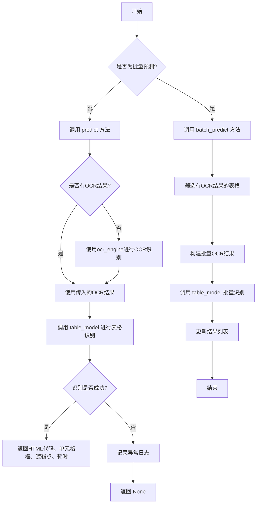
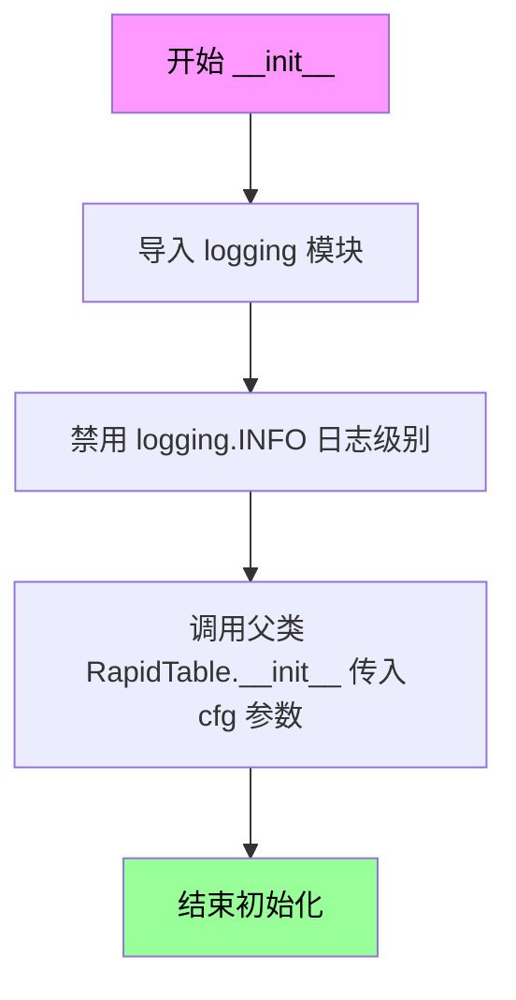
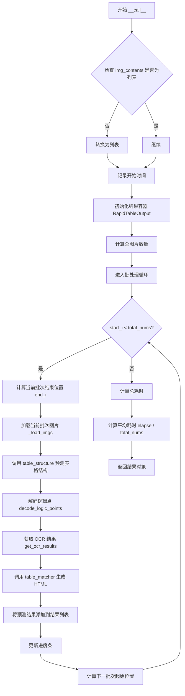
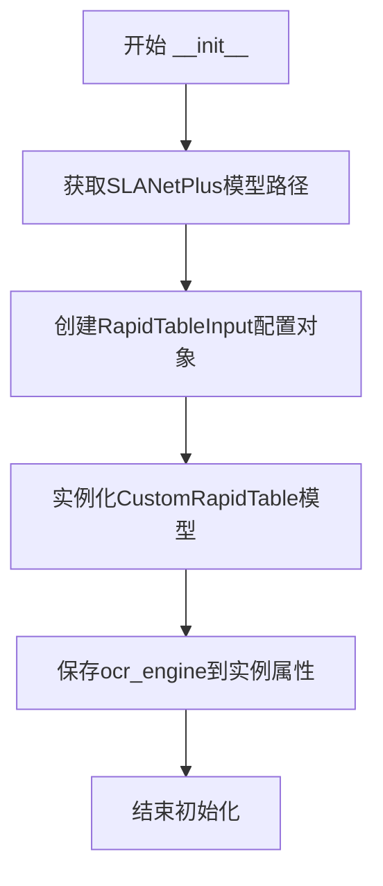
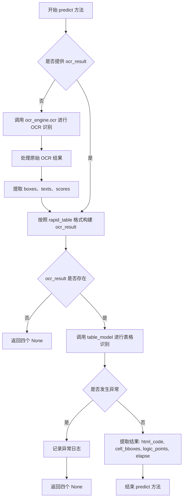

# `MinerU\mineru\model\table\rec\RapidTable.py` 详细设计文档

这是一个表格识别模块，通过集成RapidTable库和OCR引擎，实现对图片中表格的结构化识别，将表格内容转换为HTML格式输出，支持单张图片预测和批量预测两种模式。

## 整体流程



## 类结构

```
全局函数
├── escape_html
类
├── CustomRapidTable (继承自 RapidTable)
│   ├── __init__
│   └── __call__
└── RapidTableModel
    ├── __init__
    ├── predict
    └── batch_predict
```

## 全局变量及字段


### `slanet_plus_model_path`
    
指向SLANET Plus表格识别模型的文件夹路径

类型：`str`
    


### `input_args`
    
RapidTable模型的配置参数，包含模型类型、路径和OCR设置

类型：`RapidTableInput`
    


### `bgr_image`
    
从RGB颜色空间转换为BGR颜色空间的图像数组，用于OpenCV处理

类型：`np.ndarray`
    


### `raw_ocr_result`
    
OCR引擎返回的原始识别结果，包含边界框、文本和置信度

类型：`list`
    


### `boxes`
    
OCR检测到的文本区域边界框坐标列表

类型：`list`
    


### `texts`
    
OCR识别出的文本内容列表，经过HTML转义处理

类型：`list`
    


### `scores`
    
OCR识别结果的置信度分数列表

类型：`list`
    


### `ocr_result`
    
符合rapid_table输入格式的OCR结果列表，每个元素为(boxes, texts, scores)元组

类型：`list[tuple]`
    


### `table_results`
    
表格识别模型的输出结果，包含HTML代码、单元格边界框、逻辑点和处理耗时

类型：`RapidTableOutput`
    


### `html_code`
    
识别出的表格HTML代码列表

类型：`list`
    


### `table_cell_bboxes`
    
表格单元格边界框坐标列表

类型：`list`
    


### `logic_points`
    
表格逻辑点坐标列表，用于描述表格结构

类型：`list`
    


### `elapse`
    
单张图像的平均处理时间（秒）

类型：`float`
    


### `not_none_table_res_list`
    
包含有效OCR结果的表格数据字典列表

类型：`list[dict]`
    


### `img_contents`
    
待处理的表格图像列表

类型：`list`
    


### `ocr_results`
    
批量OCR结果列表，每个元素为符合rapid_table格式的元组

类型：`list`
    


### `RapidTableModel.table_model`
    
自定义的表格识别模型实例

类型：`CustomRapidTable`
    


### `RapidTableModel.ocr_engine`
    
OCR引擎实例，用于文本检测和识别

类型：`PytorchPaddleOCR`
    
    

## 全局函数及方法


### `escape_html`

该函数是一个HTML转义工具函数，用于将输入字符串中的HTML特殊字符转换为安全的HTML实体，防止XSS攻击等安全问题。在代码中，它被用于处理OCR识别出的文本，确保从表格中提取的文本内容是HTML安全的。

参数：

- `input_string`：`str`，需要转义的原始字符串

返回值：`str`，转义后的HTML安全字符串

#### 流程图

```mermaid
graph LR
    A[开始] --> B[接收输入字符串 input_string]
    B --> C{调用 html.escape 函数}
    C --> D[转义HTML特殊字符<br/>如 < > & " ' 等]
    D --> E[返回转义后的字符串]
    E --> F[结束]
```

#### 带注释源码

```
def escape_html(input_string):
    """Escape HTML Entities.
    
    将输入字符串中的HTML特殊字符转换为安全的HTML实体。
    这是一个工具函数，主要用于处理OCR识别结果中的文本，
    防止在后续的HTML渲染过程中产生XSS攻击或格式问题。
    
    参数:
        input_string (str): 需要转义的原始字符串
        
    返回:
        str: 转义后的HTML安全字符串
        
    示例:
        >>> escape_html("<script>alert('xss')</script>")
        '&lt;script&gt;alert(&#x27;xss&#x27;)&lt;/script&gt;'
        >>> escape_html("A < B & C")
        'A &lt; B &amp; C'
    """
    return html.escape(input_string)
```


### CustomRapidTable.__init__

该方法是`CustomRapidTable`类的初始化方法，接收表格识别配置参数，禁用日志输出，并调用父类`RapidTable`的初始化方法完成表格识别模型的初始化配置。

参数：

- `cfg`：`RapidTableInput`，表格识别配置参数，包含模型类型、模型路径、OCR设置等信息

返回值：`None`，无返回值（`__init__`方法不返回值）

#### 流程图



#### 带注释源码

```python
def __init__(self, cfg: RapidTableInput):
    """
    初始化 CustomRapidTable 实例
    
    参数:
        cfg: RapidTableInput 类型，包含表格识别模型的配置信息
    """
    import logging
    # 通过环境变量控制日志级别
    # 禁用 INFO 级别的日志输出，减少控制台噪音
    logging.disable(logging.INFO)
    # 调用父类 RapidTable 的初始化方法
    # 继承父类的表格识别功能
    super().__init__(cfg)
```

#### 补充说明

| 项目 | 说明 |
|------|------|
| **所属类** | CustomRapidTable |
| **父类** | RapidTable (来自 rapid_table 库) |
| **访问权限** | 公开 (public) |
| **是否重写** | 是，重写了父类的 `__init__` 方法 |
| **设计意图** | 通过禁用日志输出减少控制台噪音，同时继承父类的核心功能 |
| **潜在优化点** | 1. 日志级别可以通过参数配置而非硬编码；2. 考虑使用上下文管理器控制日志；3. 可以添加配置验证逻辑 |


### `CustomRapidTable.__call__`

该方法是自定义表格识别模型的调用入口，继承自 RapidTable 类。它接收图片内容和可选的 OCR 结果，通过批处理方式调用底层的表格结构识别和匹配模块，最终返回包含 HTML 表格内容和处理耗时的结果对象。

参数：

- `img_contents`：需要处理的图片内容，支持单张图片或图片列表
- `ocr_results`：可选的 OCR 识别结果，用于提供文字位置和内容信息，默认为 None
- `batch_size`：批处理大小，控制每次处理的图片数量，默认为 1

返回值：`RapidTableOutput`，包含以下属性：
- `pred_htmls`：识别出的表格 HTML 代码列表
- `elapse`：平均处理耗时（秒）
- `cell_bboxes`：单元格边界框列表（继承自父类）
- `logic_points`：逻辑坐标点列表（继承自父类）

#### 流程图



#### 带注释源码

```
def __call__(self, img_contents, ocr_results=None, batch_size=1):
    # 将输入转换为列表格式，确保统一处理
    if not isinstance(img_contents, list):
        img_contents = [img_contents]

    # 记录开始时间，用于计算处理耗时
    s = time.perf_counter()

    # 创建结果容器，存储预测的 HTML 和耗时信息
    results = RapidTableOutput()

    # 获取需要处理的总图片数量
    total_nums = len(img_contents)

    # 使用 tqdm 显示进度条，描述为"Table-wireless Predict"
    with tqdm(total=total_nums, desc="Table-wireless Predict") as pbar:
        # 按批次循环处理图片
        for start_i in range(0, total_nums, batch_size):
            # 计算当前批次的结束位置
            end_i = min(total_nums, start_i + batch_size)

            # 加载当前批次的图片
            imgs = self._load_imgs(img_contents[start_i:end_i])

            # 预测表格结构，返回结构预测和单元格边界框
            pred_structures, cell_bboxes = self.table_structure(imgs)
            
            # 解码逻辑点，用于表格匹配
            logic_points = self.table_matcher.decode_logic_points(pred_structures)

            # 获取 OCR 结果，合并传入的 OCR 结果和模型预测
            dt_boxes, rec_res = self.get_ocr_results(imgs, start_i, end_i, ocr_results)

            # 调用表格匹配器，生成 HTML 表格表示
            pred_htmls = self.table_matcher(
                pred_structures, cell_bboxes, dt_boxes, rec_res
            )

            # 将当前批次的 HTML 结果添加到总结果中
            results.pred_htmls.extend(pred_htmls)
            
            # 更新进度条，显示已处理的图片数量
            pbar.update(end_i - start_i)

    # 计算总处理耗时
    elapse = time.perf_counter() - s
    # 计算平均每张图片的处理时间
    results.elapse = elapse / total_nums
    
    # 返回包含所有结果的对象
    return results
```


### `RapidTableModel.__init__`

该方法是`RapidTableModel`类的构造函数，负责初始化表格识别模型。它首先通过自动下载工具获取SLANetPlus模型路径，然后创建`RapidTableInput`配置对象，最后实例化`CustomRapidTable`模型引擎，同时保存传入的OCR引擎供后续表格识别使用。

参数：

- `ocr_engine`：任意OCR引擎类型，负责提供图像文字识别功能

返回值：`None`，`__init__`方法不返回任何值，仅完成对象初始化

#### 流程图



#### 带注释源码

```python
def __init__(self, ocr_engine):
    """
    初始化RapidTableModel表格识别模型
    
    参数:
        ocr_engine: OCR引擎实例，用于提供文字识别功能
    """
    # 步骤1: 获取SLANetPlus模型的本地路径
    # 通过自动下载工具下载模型并获取模型根目录
    slanet_plus_model_path = os.path.join(
        auto_download_and_get_model_root_path(ModelPath.slanet_plus),
        ModelPath.slanet_plus,
    )
    
    # 步骤2: 构建RapidTable模型输入参数配置
    # 指定模型类型为SLANETPLUS，设置模型路径，禁用内置OCR
    input_args = RapidTableInput(
        model_type=ModelType.SLANETPLUS,      # 使用SLANetPlus表格识别模型
        model_dir_or_path=slanet_plus_model_path,  # 模型文件路径
        use_ocr=False                         # 不使用内置OCR，使用外部OCR引擎
    )
    
    # 步骤3: 创建CustomRapidTable表格识别模型实例
    # CustomRapidTable继承自RapidTable，包装了表格识别核心逻辑
    self.table_model = CustomRapidTable(input_args)
    
    # 步骤4: 保存OCR引擎引用
    # 将传入的OCR引擎保存为实例属性，供后续predict方法调用
    self.ocr_engine = ocr_engine
```


### `RapidTableModel.predict`

该方法是`RapidTableModel`类的核心预测方法，负责接收输入图像和可选的OCR结果，通过内部的OCR引擎（如未提供OCR结果）和表格识别模型（`table_model`）来提取表格的HTML表示、单元格边界框、逻辑坐标点以及处理耗时，最终返回表格识别结果或None。

参数：

- `self`：隐式参数，`RapidTableModel`类的实例对象
- `image`：输入图像，支持PIL图像或numpy数组类型，需要进行颜色空间转换（RGB转BGR）以适配OCR引擎
- `ocr_result`：可选参数，类型为`list`，表示预先计算好的OCR结果，如果为`None`则会在方法内部调用`self.ocr_engine.ocr`进行实时OCR识别，默认值为`None`

返回值：`tuple`，包含四个元素——`html_code`（表格HTML代码列表）、`table_cell_bboxes`（单元格边界框列表）、`logic_points`（逻辑坐标点列表）、`elapse`（单张图像处理耗时浮点数秒），如果发生异常则返回四个`None`值

#### 流程图



#### 带注释源码

```python
def predict(self, image, ocr_result=None):
    """
    预测表格内容的主方法
    
    参数:
        image: 输入图像（PIL Image 或 numpy 数组）
        ocr_result: 可选的预计算OCR结果，如果为None则自动进行OCR识别
    
    返回:
        tuple: (html_code, table_cell_bboxes, logic_points, elapse) 或 (None, None, None, None)
    """
    # 将RGB图像转换为BGR格式（OpenCV默认格式）
    bgr_image = cv2.cvtColor(np.asarray(image), cv2.COLOR_RGB2BGR)
    
    # 如果没有提供OCR结果，则使用内置OCR引擎进行识别
    if not ocr_result:
        # 调用OCR引擎识别图像中的文本
        raw_ocr_result = self.ocr_engine.ocr(bgr_image)[0]
        
        # 分离边界框、文本和置信度
        boxes = []
        texts = []
        scores = []
        
        # 遍历OCR结果项，处理两种可能的格式
        for item in raw_ocr_result:
            # 格式1: [box, text, score] - 三元素元组
            if len(item) == 3:
                boxes.append(item[0])
                texts.append(escape_html(item[1]))  # 转义HTML特殊字符
                scores.append(item[2])
            # 格式2: [box, (text, score)] - 两元素元组，第二元素为嵌套元组
            elif len(item) == 2 and isinstance(item[1], tuple):
                boxes.append(item[0])
                texts.append(escape_html(item[1][0]))
                scores.append(item[1][1])
        
        # 按照 rapid_table 期望的格式构建 ocr_results
        # 格式: [(boxes, texts, scores)]
        ocr_result = [(boxes, texts, scores)]
    
    # 当存在OCR结果时，调用表格识别模型
    if ocr_result:
        try:
            # 调用 CustomRapidTable 模型进行表格识别
            # 传入图像内容（转换为numpy数组）和OCR结果
            table_results = self.table_model(
                img_contents=np.asarray(image), 
                ocr_results=ocr_result
            )
            
            # 提取识别结果中的各个组件
            html_code = table_results.pred_htmls           # 表格HTML代码
            table_cell_bboxes = table_results.cell_bboxes  # 单元格边界框
            logic_points = table_results.logic_points     # 逻辑坐标点
            elapse = table_results.elapse                 # 处理耗时
            
            # 返回识别结果元组
            return html_code, table_cell_bboxes, logic_points, elapse
            
        except Exception as e:
            # 捕获异常并记录日志（包含完整的堆栈信息）
            logger.exception(e)
    
    # 处理失败或无OCR结果时返回None元组
    return None, None, None, None
```


### `RapidTableModel.batch_predict`

该方法用于批量处理表格识别任务，接收表格图像和OCR结果列表，筛选有效的OCR结果数据，转换为RapidTable模型所需格式后批量推理，并将识别出的HTML结果更新回原始数据结构中。

参数：

- `table_res_list`：`List[dict]`，待预测的表格数据列表，每个元素包含`table_img`和`ocr_result`键的字典
- `batch_size`：`int`，批处理大小，默认为4，控制每批处理的图像数量

返回值：`None`，该方法无显式返回值，结果通过修改输入字典的`table_res`键中的`html`字段传递

#### 流程图

```mermaid
flowchart TD
    A[开始 batch_predict] --> B{检查 table_res_list}
    B -->|为空| Z[直接返回 - 无操作]
    B -->|非空| C[遍历 table_res_list 筛选有效 OCR 结果]
    C --> D{ocr_result 存在?}
    D -->|是| E[加入 not_none_table_res_list]
    D -->|否| C
    E --> F{检查有效结果列表}
    F -->|为空| Z
    F -->|非空| G[提取所有 table_img 到 img_contents]
    G --> H[遍历有效结果构建 ocr_results]
    H --> I[解析 raw_ocr_result]
    I --> J{item 长度判断}
    J -->|len==3| K[提取 boxes, texts, scores]
    J -->|len==2| L[提取 boxes, escape_html(text), scores]
    K --> M[构建 (boxes, texts, scores) 元组]
    L --> M
    M --> H
    H --> N[调用 self.table_model 批量预测]
    N --> O[遍历预测结果 pred_htmls]
    O --> P{result 不为空?}
    P -->|是| Q[更新 not_none_table_res_list[i]['table_res']['html']]
    P -->|否| O
    Q --> O
    O --> R[结束]
```

#### 带注释源码

```python
def batch_predict(self, table_res_list: List[dict], batch_size: int = 4):
    """
    批量表格预测方法
    
    参数:
        table_res_list: 表格数据列表，每个元素为dict，需包含'table_img'和'ocr_result'键
        batch_size: 批处理大小，默认4
    
    返回:
        None (结果通过修改输入字典的table_res字段传递)
    """
    # 第一步：筛选出包含有效OCR结果的表格数据
    not_none_table_res_list = []
    for table_res in table_res_list:
        # 检查ocr_result是否存在且不为None
        if table_res.get("ocr_result", None):
            not_none_table_res_list.append(table_res)

    # 第二步：如果存在有效数据，则进行批量预测
    if not_none_table_res_list:
        # 2.1 提取所有表格图像
        img_contents = [table_res["table_img"] for table_res in not_none_table_res_list]
        
        # 2.2 构建OCR结果列表（转换为rapid_table期望的格式）
        ocr_results = []
        # ocr_results需要按照rapid_table期望的格式构建
        for table_res in not_none_table_res_list:
            raw_ocr_result = table_res["ocr_result"]
            
            # 初始化boxes、texts、scores列表
            boxes = []
            texts = []
            scores = []
            
            # 遍历原始OCR结果，解析出边界框、文本和置信度
            for item in raw_ocr_result:
                # 格式1: item为3元素列表 [box, text, score]
                if len(item) == 3:
                    boxes.append(item[0])
                    # 对文本进行HTML转义处理
                    texts.append(escape_html(item[1]))
                    scores.append(item[2])
                # 格式2: item为2元素列表 [box, (text, score)]
                elif len(item) == 2 and isinstance(item[1], tuple):
                    boxes.append(item[0])
                    texts.append(escape_html(item[1][0]))
                    scores.append(item[1][1])
            
            # 将解析后的结果构建为元组格式
            ocr_results.append((boxes, texts, scores))
        
        # 2.3 调用表格模型进行批量预测
        table_results = self.table_model(
            img_contents=img_contents, 
            ocr_results=ocr_results, 
            batch_size=batch_size
        )

        # 第三步：将预测结果更新回原始数据结构
        for i, result in enumerate(table_results.pred_htmls):
            if result:
                # 将识别出的HTML代码写入到table_res的html字段中
                not_none_table_res_list[i]['table_res']['html'] = result
    
    # 注意：该方法没有显式返回值，结果通过修改输入的table_res_list中的
    # table_res['html']字段来传递，这是一种副作用式的设计
```

## 关键组件


### 表格识别模型封装 (RapidTableModel)

负责整体表格识别流程的封装，整合 OCR 引擎和 RapidTable 模型，提供单张图片和批量图片的预测功能

### 自定义 RapidTable 类 (CustomRapidTable)

继承自 rapid_table 库的 RapidTable 类，通过重写 `__call__` 方法实现批量处理逻辑，包含图片加载、表格结构预测、OCR 结果获取和 HTML 生成的完整流程

### OCR 结果格式化处理器

将原始 OCR 输出转换为 rapid_table 库期望的格式，包含边界框、文本和置信度的分离与重组，同时调用 escape_html 进行 HTML 转义

### HTML 转义工具函数 (escape_html)

使用 html.escape 对文本进行转义处理，防止表格内容中的特殊字符破坏 HTML 结构

### 批量预测处理器 (batch_predict)

支持批量处理多张表格图片，统一进行 OCR 结果格式化转换和批量推理，提高处理效率

### 模型初始化与自动下载模块

通过 auto_download_and_get_model_root_path 自动下载并获取 SLANETPLUS 表格识别模型的路径，配置 RapidTableInput 参数

### 异常处理与日志记录

使用 loguru 库进行异常日志记录，使用 try-except 捕获表格识别过程中的异常，保证程序稳定性

### 进度条可视化组件

使用 tqdm 库在批量推理时显示处理进度，提供直观的处理状态反馈


## 问题及建议


### 已知问题

- **OCR结果转换代码重复**：`predict` 和 `batch_predict` 方法中均包含将原始OCR结果转换为rapid_table格式的重复代码块（构建boxes、texts、scores列表），违反DRY原则。
- **图像格式处理不一致**：`predict` 方法中先将RGB图像转换为BGR格式的`bgr_image`，但在调用`table_model`时却传入`np.asarray(image)`而非`np.asarray(bgr_image)`，导致可能使用错误的图像格式。
- **异常处理过于简单**：`predict` 方法捕获异常后仅记录日志并返回全None值，调用者无法区分是正常无结果还是发生错误，难以进行有效的错误处理和调试。
- **模型路径构建冗余**：`slanet_plus_model_path` 使用了两次 `ModelPath.slanet_plus` 拼接路径，可能导致路径中包含重复的目录名。
- **批量预测结果索引错误**：`batch_predict` 方法在更新结果时使用 `not_none_table_res_list[i]['table_res']['html']`，但由于过滤后的列表索引与原始列表不连续，直接使用索引会导致结果错位。
- **类型注解不完整**：部分方法参数和返回值缺少类型注解，如 `CustomRapidTable` 的 `__call__` 方法参数。
- **进度条使用范围有限**：进度条仅在 `CustomRapidTable.__call__` 中使用，但主要逻辑在 `RapidTableModel` 中，导致外部调用时无法获知批处理进度。

### 优化建议

- **抽取公共函数**：将OCR结果格式转换逻辑抽取为私有方法如 `_format_ocr_result(raw_ocr_result)`，在 `predict` 和 `batch_predict` 中复用。
- **修复图像格式Bug**：将 `predict` 方法中 `self.table_model(img_contents=np.asarray(image), ...)` 改为 `self.table_model(img_contents=np.asarray(bgr_image), ...)`，或统一使用RGB格式并调整后续处理。
- **改进异常处理**：在 `predict` 方法中抛出自定义异常或返回包含错误信息的对象，使调用者能够区分不同情况；或在捕获异常后添加重试逻辑。
- **修复路径构建**：使用 `auto_download_and_get_model_root_path(ModelPath.slanet_plus)` 直接返回的路径，避免重复拼接。
- **修复批量预测索引问题**：在 `batch_predict` 中记录原始索引或使用字典映射来正确关联结果，或重构为直接修改原始列表中的元素。
- **添加类型注解和文档**：为所有公共方法添加完整的类型注解和docstring，提高代码可维护性和可读性。
- **增强日志与进度反馈**：在 `RapidTableModel` 的批量预测方法中添加进度条，或将进度信息通过回调机制传递给调用者。

## 其它


### 设计目标与约束

本代码旨在实现表格识别功能，通过结合OCR引擎和RapidTable模型，将图像中的表格内容解析为HTML格式。核心目标是将图片中的表格结构识别并转换为可编辑的HTML代码，同时提取表格单元格边界框和逻辑点信息。支持单张图片预测和批量预测两种模式，默认使用SLANETPLUS模型类型，依赖PytorchPaddleOCR进行文字识别，不直接使用RapidTable内置OCR而是通过参数控制。

### 错误处理与异常设计

代码采用分层错误处理策略。在`RapidTableModel.predict()`方法中，使用try-except捕获异常并通过`logger.exception(e)`记录完整堆栈信息。当OCR结果为空或解析失败时，方法返回None值而非抛出异常，保证调用方能够进行降级处理。`CustomRapidTable`类继承自RapidTable并重写了`__call__`方法，在加载图片和表格结构识别过程中可能出现的错误会被统一捕获。批量预测方法`batch_predict`中，会过滤掉没有OCR结果的条目，避免无效处理。环境变量`logging.disable(logging.INFO)`用于抑制第三方库的日志输出，减少噪声。

### 数据流与状态机

单张图片预测流程：输入RGB图像→BGR色彩空间转换→执行OCR识别→解析OCR结果（分离边界框、文本、置信度）→构建符合RapidTable格式的OCR结果→调用表格模型推理→提取HTML代码、单元格边界框、逻辑点和耗时→返回结果。批量预测流程：接收包含table_img和ocr_result的字典列表→过滤有效条目→提取所有图片和OCR结果→批量调用表格模型→更新结果字典中的html字段。数据状态包括：原始图像、OCR原始输出、格式化OCR结果、表格识别结果（HTML、边界框、逻辑点）。

### 外部依赖与接口契约

核心依赖包括：rapid_table（表格识别框架，提供RapidTable类和ModelType枚举）、PytorchPaddleOCR（OCR引擎，来自mineru项目）、cv2（OpenCV图像处理）、numpy（数值计算）、loguru（日志记录）、tqdm（进度条）、pathlib（路径操作）。ModelPath枚举定义在mineru.utils.enum_class中，模型下载工具函数auto_download_and_get_model_root_path来自mineru.utils.models_download_utils。接口契约方面，`predict`方法接受image（numpy数组或PIL Image）和可选的ocr_result参数，返回HTML代码字符串、单元格边界框列表、逻辑点列表和耗时浮点数。`batch_predict`方法接受字典列表和batch_size参数，无返回值直接修改输入列表中的字典。

### 配置与参数

模型配置：使用SLANETPLUS模型类型，模型路径通过ModelPath.slanet_plus枚举自动下载获取。OCR配置：det_db_box_thresh=0.5（文本框检测阈值），det_db_unclip_ratio=1.6（文本框扩展比例），enable_merge_det_boxes=False（禁止合并检测框）。表格模型配置：use_ocr=False（不使用内置OCR），batch_size默认值为4。图像处理配置：RGB到BGR色彩空间转换用于OpenCV处理。

### 性能考虑与优化空间

代码包含性能监控机制，使用time.perf_counter()精确计时并计算平均耗时。批量处理使用tqdm进度条展示处理进度。优化空间包括：1）OCR结果解析存在重复代码，可以提取为独立方法；2）batch_predict中没有处理空结果列表的边界情况；3）predict方法中图像转换可以复用结果避免重复计算；4）缺乏缓存机制，相同图片重复识别时会重新计算；5）异常捕获后返回None但未给出具体错误原因的上层反馈。

### 输入输出格式

输入格式：predict方法接受image参数，类型为numpy.ndarray（RGB格式）或PIL Image，经过cv2.imread读取后为BGR格式numpy数组。batch_predict接受包含table_img和ocr_result键的字典列表，其中table_img为numpy数组，ocr_result为OCR引擎返回的原始结果列表。输出格式：predict返回四个值的元组，分别为html_code（字符串，表格HTML表示）、table_cell_bboxes（列表，单元格边界框坐标）、logic_points（列表，表格逻辑点）、elapse（浮点数，单张图片平均处理耗时秒数）。OCR结果内部格式为元组列表，每个元素包含边界框、文本和置信度。

### 版本兼容性注意事项

代码使用了一些可能影响兼容性的特性：time.perf_counter()需要Python 3.3+；typing.List需要Python 3.5+；f-string格式化需要Python 3.6+；pathlib.Path需要Python 3.4+。rapid_table库版本更新可能导致API变化，特别是RapidTableInput和RapidTableOutput的数据结构。PytorchPaddleOCR的返回格式在不同版本间可能存在差异，当前代码兼容两种格式（三元组和二元组）。


    