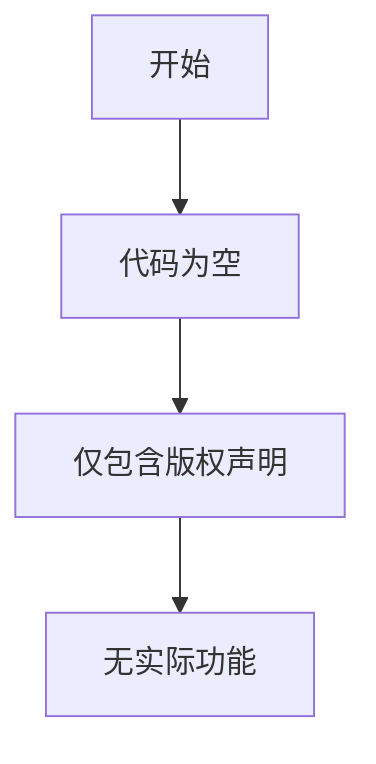

# `MinerU\mineru\model\table\rec\__init__.py` 详细设计文档

该代码文件仅包含版权声明头部，无实际代码逻辑可供分析。

## 整体流程



## 类结构

```
无类定义
```

## 全局变量及字段


    

## 全局函数及方法


## 关键组件


### 核心功能概述

该代码片段仅包含版权声明信息，未包含任何功能性代码实现，因此无法提取核心功能描述。

### 文件运行流程

由于代码中不存在任何可执行语句或函数定义，当前文件不产生任何运行流程。

### 类与全局变量信息

当前代码中不存在任何类、全局变量或全局函数的定义。

### 关键组件信息

### 版权声明

该文件仅包含 Opendatalab 的版权声明，表明该代码的知识产权归属。

### 技术债务与优化空间

当前代码片段不完整，缺少实际的业务逻辑实现，无法进行技术债务分析或提出优化建议。

### 其他项目

- **设计目标与约束**：未提供任何设计文档或约束说明
- **错误处理与异常设计**：未实现任何错误处理机制
- **数据流与状态机**：未定义任何数据流或状态机逻辑
- **外部依赖与接口契约**：未声明任何外部依赖或接口

## 问题及建议


### 已知问题

-   该文件仅包含版权声明，没有任何实际功能代码，属于占位文件
-   缺少模块文档说明，无法了解该文件的预期用途
-   没有定义任何类、函数或变量，文件未被有效利用

### 优化建议

-   若该文件为预留文件，建议添加TODO注释说明计划实现的功能
-   若为误创建的占位文件，建议删除或合并到其他相关模块
-   建议添加 LICENSE 文件以明确软件许可证条款
-   建议添加 README.md 或模块级文档说明项目结构和功能模块


## 其它


### 一段话描述

该代码文件仅包含版权声明信息，无实际功能实现，属于项目初始化或文件模板的版权头部注释。

### 文件的整体运行流程

无实际运行流程，该文件为纯注释文件，不包含任何可执行代码。

### 类详细信息

无类定义。

### 类字段

无类字段。

### 类方法

无类方法。

### 全局变量

无全局变量。

### 全局函数

无全局函数。

### 关键组件信息

无关键组件。

### 潜在的技术债务或优化空间

无技术债务，该文件为版权声明文件。

### 设计目标与约束

无设计目标，该代码片段仅为版权声明。

### 错误处理与异常设计

无错误处理机制，该文件不包含任何业务逻辑。

### 数据流与状态机

无数据流设计，该文件不包含任何数据处理逻辑。

### 外部依赖与接口契约

无外部依赖，该文件为纯注释文件。

### 代码规范与约束

该文件遵循开源项目版权声明规范，包含版权年份和版权所有者信息。

### 总结与建议

由于提供的代码仅包含版权声明，无实际功能实现，建议提供完整的业务代码以生成详细的架构设计文档。


    