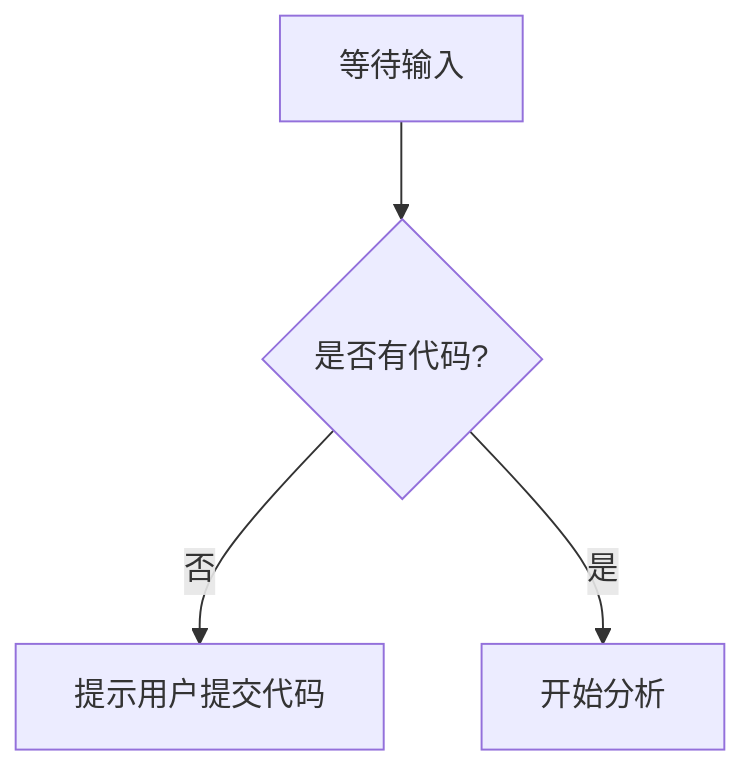

# `MinerU\mineru\model\table\rec\slanet_plus\__init__.py` 详细设计文档

未提供源代码，无法进行分析

## 整体流程



## 类结构

```

```

## 全局变量及字段


    

## 全局函数及方法


## 关键组件


## 问题及建议


### 已知问题

-   代码文件为空，未提供待分析的源代码

### 优化建议

-   请提供需要分析的源代码，以便进行详细的设计文档生成和技术债务识别


## 其它


### 设计目标与约束

描述本系统要实现的业务目标、性能指标、运行时环境约束（如延迟、吞吐量、兼容性平台等）以及设计原则（如简洁、可扩展、低耦合）。

### 错误处理与异常设计

说明统一的异常类层次结构、错误码体系、异常捕获与传播机制、日志记录策略以及 fallback 方案。

### 数据流与状态机

绘制主要业务流程的数据流向图，描述关键业务对象的状态转换、状态持久化方式以及状态机的触发条件。

### 外部依赖与接口契约

列出所有外部系统、第三方库、微服务等依赖，说明每个接口的请求/响应结构、协议、版本兼容性及容错措施。

### 性能与可伸缩性

明确性能目标（如 QPS、响应时间），阐述水平/垂直扩展方案、缓存策略、负载均衡及异步处理机制。

### 安全与权限

描述身份认证、授权、加密传输、敏感数据保护、审计日志等安全措施，以及安全合规要求（如 GDPR、PCI‑DSS）。

### 可测性与测试策略

说明单元测试、集成测试、端到端测试的覆盖要求，使用的 Mock/Stub 框架，自动化测试流程及质量门槛。

### 部署与运维

阐述部署方式（容器化、裸机、Serverless），配置管理、环境划分、灰度发布、监控告警及灾备方案。

### 版本演进与迁移

规定版本号命名规范、向后兼容性策略、升级路径、数据迁移方案以及接口废弃流程。

### 日志与监控

定义日志格式、关键业务指标、日志级别、采集方式以及监控面板、告警阈值的设定。

### 文档与维护

包括代码规范、API 文档、变更日志、维护手册及知识共享机制，确保后续开发和运维的可追溯性。

### 风险与合规

评估项目潜在风险（如单点故障、依赖失效），制定容错、灾备、应急响应计划，并说明相关法规合规要求。

    