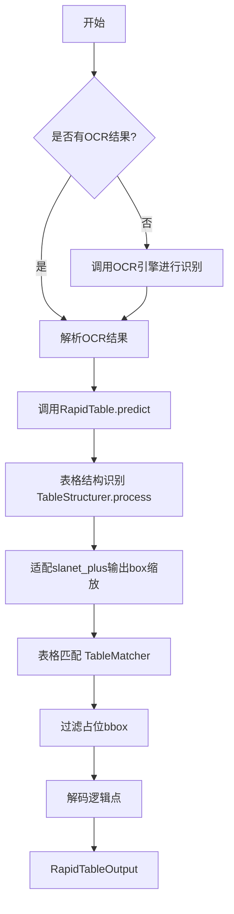
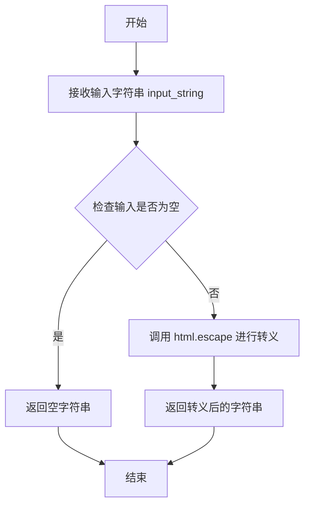
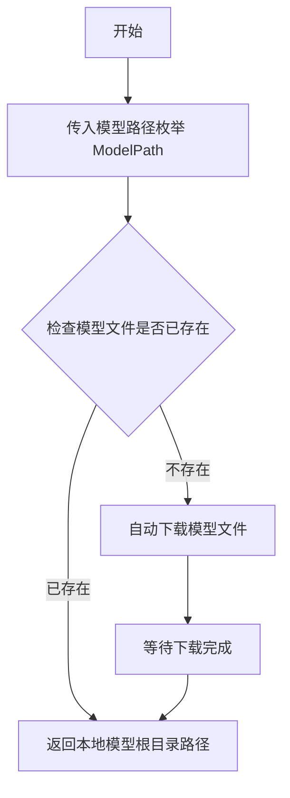
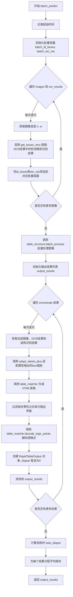
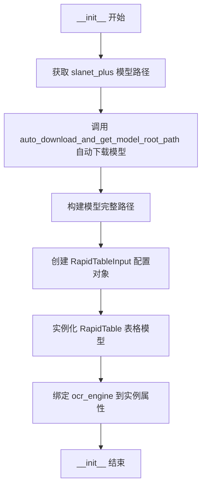
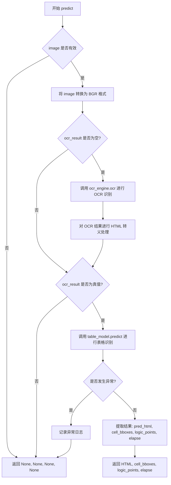

# `MinerU\mineru\model\table\rec\slanet_plus\main.py` 详细设计文档

一个表格识别推理模块，通过整合OCR结果和深度学习模型（slanet_plus）来识别图片中的表格结构，输出HTML格式的表格内容、单元格边界框和逻辑坐标点，支持单张和批量图片处理

## 整体流程



## 类结构

```
RapidTableInput (数据类-输入配置)
RapidTableOutput (数据类-输出结果)
RapidTable (核心表格识别类)
RapidTableModel (模型包装类)
escape_html (全局函数)
```

## 全局变量及字段


### `slanet_plus_model_path`
    
slanet_plus模型路径

类型：`str`
    


### `RapidTableInput.model_type`
    
模型类型，默认为'slanet_plus'

类型：`Optional[str]`
    


### `RapidTableInput.model_path`
    
模型路径

类型：`Union[str, Path, None, Dict[str, str]]`
    


### `RapidTableInput.use_cuda`
    
是否使用CUDA，默认为False

类型：`bool`
    


### `RapidTableInput.device`
    
设备类型，默认为'cpu'

类型：`str`
    


### `RapidTableOutput.pred_html`
    
预测的HTML表格

类型：`Optional[str]`
    


### `RapidTableOutput.cell_bboxes`
    
单元格边界框

类型：`Optional[np.ndarray]`
    


### `RapidTableOutput.logic_points`
    
逻辑坐标点

类型：`Optional[np.ndarray]`
    


### `RapidTableOutput.elapse`
    
处理耗时

类型：`Optional[float]`
    


### `RapidTable.table_structure`
    
表格结构识别器

类型：`TableStructurer`
    


### `RapidTable.table_matcher`
    
表格匹配器

类型：`TableMatch`
    


### `RapidTableModel.table_model`
    
表格模型实例

类型：`RapidTable`
    


### `RapidTableModel.ocr_engine`
    
OCR引擎

类型：`object`
    
    

## 全局函数及方法


### `escape_html`

该函数是一个 HTML 实体转义工具，用于将字符串中的特殊字符（如 `<`, `>`, `&`, `"`, `'`）转换为对应的 HTML 实体编码，防止 XSS 攻击和 HTML 解析错误。

参数：

- `input_string`：`str`，需要进行 HTML 转义的原始字符串

返回值：`str`，转义后的字符串，其中特殊字符已被替换为 HTML 实体（如 `<` 变为 `&lt;`）

#### 流程图



#### 带注释源码

```python
def escape_html(input_string):
    """
    转义 HTML 实体字符。
    
    该函数使用 Python 标准库中的 html.escape 方法，将字符串中的
    特殊字符转换为安全的 HTML 实体编码，防止 XSS 攻击和 HTML 解析错误。
    
    参数:
        input_string (str): 需要转义的原始字符串
        
    返回:
        str: 转义后的安全字符串，特殊字符已被替换为 HTML 实体
    """
    return html.escape(input_string)
```


### `auto_download_and_get_model_root_path`

该函数是模型自动下载工具，用于获取模型的根目录路径。如果模型文件不存在，则自动从远程服务器下载模型，并返回本地模型根目录的路径。

参数：

- `model_path_enum`：`ModelPath` 枚举类型，指定要获取的模型路径枚举值（如 `ModelPath.slanet_plus`）

返回值：`str`，返回模型根目录的本地路径字符串

#### 流程图



#### 带注释源码

```python
def auto_download_and_get_model_root_path(model_path_enum: ModelPath) -> str:
    """
    自动下载模型并获取模型根目录路径的函数。
    
    参数:
        model_path_enum: ModelPath枚举类型，指定要下载/获取的模型类型
                       例如 ModelPath.slanet_plus, ModelPath.table_matcher 等
    
    返回值:
        str: 模型文件在本地的根目录路径
    
    功能说明:
        1. 根据传入的ModelPath枚举值构建远程模型URL
        2. 检查本地是否已存在对应模型文件
        3. 如果模型不存在，自动从远程服务器下载模型
        4. 返回模型根目录的本地绝对路径
    
    使用示例:
        >>> from mineru.utils.enum_class import ModelPath
        >>> model_root = auto_download_and_get_model_root_path(ModelPath.slanet_plus)
        >>> model_path = os.path.join(model_root, ModelPath.slanet_plus)
    """
    # 此函数的实际实现位于 mineru.utils.models_download_utils 模块中
    # 由于源代码中未提供完整实现，以上为基于函数名和调用方式的推断
    pass
```

> **注意**：该函数的完整源代码实现位于 `mineru/utils/models_download_utils.py` 模块中，在当前提供的代码段中仅展示了导入语句和调用方式。该函数接收一个 `ModelPath` 枚举参数，返回模型根目录的本地路径字符串。


### `RapidTable.__init__`

该方法为 `RapidTable` 类的构造函数，负责初始化表格识别引擎的核心组件，包括表格结构分析器（TableStructurer）和表格匹配器（TableMatch），为后续的表格预测任务提供必要的对象支持。

参数：

- `config`：`RapidTableInput`，包含模型配置信息的数据类对象，用于初始化表格结构分析器

返回值：`None`，构造函数不返回任何值，仅完成对象属性的初始化

#### 流程图

```mermaid
flowchart TD
    A[开始 __init__] --> B[接收 config 参数]
    B --> C[将 config 转换为字典: asdict(config)]
    C --> D[创建 TableStructurer 实例: self.table_structure]
    D --> E[创建 TableMatch 实例: self.table_matcher]
    E --> F[结束 __init__]
```

#### 带注释源码

```python
def __init__(self, config: RapidTableInput):
    """初始化 RapidTable 实例的核心组件
    
    Args:
        config: RapidTableInput 类型的数据类，包含模型路径、设备类型等配置信息
        
    Attributes:
        table_structure: 表格结构分析器，负责识别表格的行列结构和单元格位置
        table_matcher: 表格匹配器，负责将识别结果与OCR结果进行匹配，生成HTML表格
    """
    # 使用 config 对象创建表格结构分析器
    # asdict(config) 将 dataclass 实例转换为字典格式，供 TableStructurer 使用
    self.table_structure = TableStructurer(asdict(config))
    
    # 创建表格匹配器实例，用于后续的表格HTML生成和逻辑点解码
    self.table_matcher = TableMatch()
```


### `RapidTable.predict`

该方法是 RapidTable 类的核心预测方法，用于对图像中的表格进行识别和处理。它接收图像和 OCR 结果，经过表格结构识别、单元格边界框处理、HTML 生成等步骤，输出表格的 HTML 表示、单元格边界框、逻辑点坐标和处理耗时。

参数：

- `self`：隐式参数，RapidTable 实例本身
- `img`：`np.ndarray`，输入的表格图像数据
- `ocr_result`：`List[Union[List[List[float]], str, str]]`，OCR 识别结果，包含文本框坐标、识别文本和置信度

返回值：`RapidTableOutput`，包含表格 HTML 表示、单元格边界框、逻辑点坐标和处理耗时的数据类

#### 流程图

```mermaid
flowchart TD
    A[开始 predict] --> B{ocr_result is None?}
    B -->|是| C[抛出 ValueError]
    B -->|否| D[记录开始时间 s = time.perf_counter]
    D --> E[获取图像尺寸 h, w = img.shape[:2]]
    E --> F[调用 get_boxes_recs 提取 OCR 文本框和识别结果]
    F --> G[调用 table_structure.process 识别表格结构]
    G --> H[调用 adapt_slanet_plus 适配模型输出的边界框缩放]
    H --> I[调用 table_matcher 生成 HTML 表格]
    I --> J[过滤掉占位的 bbox]
    J --> K[调用 table_matcher.decode_logic_points 解码逻辑点]
    K --> L[计算处理耗时 elapse]
    L --> M[返回 RapidTableOutput 结果]
```

#### 带注释源码

```python
def predict(
    self,
    img: np.ndarray,
    ocr_result: List[Union[List[List[float]], str, str]] = None,
) -> RapidTableOutput:
    # 参数校验：确保 OCR 结果不为空，否则抛出异常
    if ocr_result is None:
        raise ValueError("OCR result is None")

    # 记录开始时间，用于计算整个处理流程的耗时
    s = time.perf_counter()
    
    # 从图像中获取高度和宽度
    h, w = img.shape[:2]

    # 从 OCR 结果中提取文本框和识别结果
    # 返回 dt_boxes: 文本边界框数组, rec_res: 识别结果和置信度元组列表
    dt_boxes, rec_res = self.get_boxes_recs(ocr_result, h, w)

    # 使用表格结构识别器处理图像，返回结构预测、单元格边界框等信息
    # pred_structures: 表格结构预测结果
    # cell_bboxes: 单元格边界框
    pred_structures, cell_bboxes, _ = self.table_structure.process(
        copy.deepcopy(img)
    )

    # 适配 slanet-plus 模型输出的 box 缩放还原
    # 由于模型输入被缩放到 488x488，需要将输出的坐标还原回原图尺寸
    cell_bboxes = self.adapt_slanet_plus(img, cell_bboxes)

    # 使用表格匹配器将结构预测、单元格框、文本框和识别结果组合生成 HTML 表格
    pred_html = self.table_matcher(pred_structures, cell_bboxes, dt_boxes, rec_res)

    # 过滤掉占位的 bbox（全部为 0 的边界框表示无效占位符）
    mask = ~np.all(cell_bboxes == 0, axis=1)
    cell_bboxes = cell_bboxes[mask]

    # 从结构预测结果中解码出表格的逻辑点坐标
    logic_points = self.table_matcher.decode_logic_points(pred_structures)
    
    # 计算整个处理流程的耗时
    elapse = time.perf_counter() - s
    
    # 返回包含所有结果的 RapidTableOutput 对象
    return RapidTableOutput(pred_html, cell_bboxes, logic_points, elapse)
```


### `RapidTable.batch_predict`

批量处理多张图像的表格识别任务，对输入的图像列表和对应的OCR结果进行并行处理，返回各图像的表格识别结果列表。

参数：

- `images`：`List[np.ndarray]`，待处理的图像列表，每个元素为OpenCV格式的图像数组
- `ocr_results`：`List[List[Union[List[List[float]], str, str]]]`，与图像列表对应的OCR结果列表，每个OCR结果包含检测框、识别文本和置信度
- `batch_size`：`int`，批处理大小，默认为4，控制每次并行处理的图像数量

返回值：`List[RapidTableOutput]`，包含每个图像的表格识别结果，包括HTML表格代码、单元格边界框、逻辑点和处理耗时

#### 流程图



#### 带注释源码

```python
def batch_predict(
    self,
    images: List[np.ndarray],
    ocr_results: List[List[Union[List[List[float]], str, str]]],
    batch_size: int = 4,
) -> List[RapidTableOutput]:
    """批量处理图像
    
    参数:
        images: 图像列表
        ocr_results: 对应的OCR结果列表
        batch_size: 批处理大小，默认为4
        
    返回:
        包含每个图像表格识别结果的列表
    """
    # 记录开始时间，用于计算总耗时
    s = time.perf_counter()

    # 初始化批量容器，用于存储所有图像的检测框和识别结果
    batch_dt_boxes = []
    batch_rec_res = []

    # 遍历每张图像及其对应的OCR结果，提取检测框和识别文本
    for i, img in enumerate(images):
        h, w = img.shape[:2]  # 获取图像高度和宽度
        # 从OCR结果中提取检测框和识别结果
        dt_boxes, rec_res = self.get_boxes_recs(ocr_results[i], h, w)
        batch_dt_boxes.append(dt_boxes)
        batch_rec_res.append(rec_res)

    # 批量表格结构识别，一次性处理所有图像以提高效率
    batch_results = self.table_structure.batch_process(images)

    # 初始化输出结果列表
    output_results = []
    # 遍历每个结果，进行后处理
    for i, (img, ocr_result, (pred_structures, cell_bboxes, _)) in enumerate(
        zip(images, ocr_results, batch_results)
    ):
        # 适配slanet-plus模型输出的box缩放还原
        # 该模型在推理时会对输入进行缩放，这里需要还原到原始尺寸
        cell_bboxes = self.adapt_slanet_plus(img, cell_bboxes)
        
        # 使用表格匹配器生成HTML表格
        pred_html = self.table_matcher(
            pred_structures, cell_bboxes, batch_dt_boxes[i], batch_rec_res[i]
        )
        
        # 过滤掉占位的bbox（全零的行表示占位符）
        mask = ~np.all(cell_bboxes == 0, axis=1)
        cell_bboxes = cell_bboxes[mask]

        # 解码逻辑点，用于表示表格的逻辑结构
        logic_points = self.table_matcher.decode_logic_points(pred_structures)
        
        # 创建结果对象，耗时暂设为0，后续统一计算
        result = RapidTableOutput(pred_html, cell_bboxes, logic_points, 0)
        output_results.append(result)

    # 计算总处理耗时
    total_elapse = time.perf_counter() - s
    
    # 将总耗时平均分配给每个结果
    for result in output_results:
        result.elapse = total_elapse / len(output_results)

    return output_results
```


### `RapidTable.get_boxes_recs`

该方法用于处理OCR识别结果，从OCR结果中提取文本框坐标，并对每个文本框进行边界扩展（上下左右各扩展1像素），同时确保扩展后的坐标不超出图像范围。最后返回处理后的文本框坐标和文本识别结果（含分数）。

参数：

- `self`：`RapidTable` 类实例，表示当前 RapidTable 对象
- `ocr_result`：`List[Union[List[List[float]], str, str]]`，OCR识别结果列表，每个元素包含文本框坐标、识别文本和置信度分数
- `h`：`int`，输入图像的高度（像素）
- `w`：`int`，输入图像的宽度（像素）

返回值：`Tuple[np.ndarray, Tuple[str, str]]`，返回一个元组，包含：
- 第一个元素：`np.ndarray`，处理后的文本框坐标数组，形状为 (N, 4)，每行表示 [x_min, y_min, x_max, y_max]
- 第二个元素：`Tuple[Tuple[str, float]]`，文本识别结果与置信度分数的元组列表

#### 流程图

```mermaid
flowchart TD
    A[开始 get_boxes_recs] --> B[解压 ocr_result 获取 dt_boxes, rec_res, scores]
    B --> C[将 rec_res 和 scores 组合成元组列表]
    C --> D[初始化空列表 r_boxes]
    D --> E{遍历 dt_boxes 中的每个 box}
    E --> F[将 box 转换为 NumPy 数组]
    F --> G[计算 box 坐标的最小最大值]
    G --> H[边界扩展: x_min-1, x_max+1, y_min-1, y_max+1]
    H --> I{边界检查: 确保坐标在 [0, w] 和 [0, h] 范围内}
    I --> J[将处理后的 box 添加到 r_boxes]
    J --> K{是否还有下一个 box}
    K -->|是| E
    K -->|否| L[将 r_boxes 转换为 NumPy 数组]
    L --> M[返回 dt_boxes 和 rec_res]
```

#### 带注释源码

```python
def get_boxes_recs(
    self, ocr_result: List[Union[List[List[float]], str, str]], h: int, w: int
) -> Tuple[np.ndarray, Tuple[str, str]]:
    """
    处理OCR结果，提取并修正文本框坐标
    
    参数:
        ocr_result: OCR识别结果列表，每个元素为 [box, text, score]
                    box: 文本框坐标列表 [[x1,y1], [x2,y2], [x3,y3], [x4,y4]]
                    text: 识别出的文本内容
                    score: 置信度分数
        h: 图像高度
        w: 图像宽度
    
    返回:
        dt_boxes: 处理后的文本框坐标数组，形状为 (N, 4)，格式为 [x_min, y_min, x_max, y_max]
        rec_res: 文本识别结果与分数的元组列表，格式为 [(text, score), ...]
    """
    # 从OCR结果中解压出文本框、识别结果和分数
    # ocr_result 格式: [[box, text, score], [box, text, score], ...]
    dt_boxes, rec_res, scores = list(zip(*ocr_result))
    
    # 将识别结果和分数组合成元组
    # rec_res 格式: [text1, text2, ...]
    # scores 格式: [score1, score2, ...]
    # 组合后: [(text1, score1), (text2, score2), ...]
    rec_res = list(zip(rec_res, scores))

    # 用于存储处理后的文本框坐标
    r_boxes = []
    
    # 遍历每个文本框
    for box in dt_boxes:
        # 将文本框坐标转换为NumPy数组
        # box 格式: [[x1,y1], [x2,y2], [x3,y3], [x4,y4]]
        box = np.array(box)
        
        # 计算文本框的边界坐标（取四个点的x和y的最小最大值）
        x_min = max(0, box[:, 0].min() - 1)  # 左侧边界左移1像素，不小于0
        x_max = min(w, box[:, 0].max() + 1)  # 右侧边界右移1像素，不大于图像宽度
        y_min = max(0, box[:, 1].min() - 1)  # 上侧边界上移1像素，不小于0
        y_max = min(h, box[:, 1].max() + 1)  # 下侧边界下移1像素，不大于图像高度
        
        # 组成新的边界框坐标 [左, 上, 右, 下]
        box = [x_min, y_min, x_max, y_max]
        r_boxes.append(box)
    
    # 将处理后的边界框列表转换为NumPy数组
    # 形状: (N, 4)，N为文本框数量
    dt_boxes = np.array(r_boxes)
    
    # 返回处理后的边界框和识别结果（含分数）
    return dt_boxes, rec_res
```


### `RapidTable.adapt_slanet_plus`

该方法用于将 slanet-plus 模型输出的单元格边界框从模型推理时的缩放尺寸（488x488）还原到原始输入图像的尺寸，解决因模型输入图像被缩放而导致的边界框坐标缩放问题。

参数：

- `self`： RapidTable 类实例本身
- `img`：`np.ndarray`，原始输入图像，用于获取图像的原始高宽
- `cell_bboxes`：`np.ndarray`，模型输出的单元格边界框数组，形状为 (n, 4)，每行包含 [x1, y1, x2, y2]

返回值：`np.ndarray`，经过缩放比例还原后的单元格边界框数组，坐标对应原始图像尺寸

#### 流程图

```mermaid
flowchart TD
    A[开始 adapt_slanet_plus] --> B[获取图像高度 h 和宽度 w]
    B --> C[设置目标 resize 尺寸 resized = 488]
    C --> D[计算缩放比例 ratio = min<br/>resized/h, resized/w]
    D --> E[计算宽度缩放比例 w_ratio = resized / (w * ratio)]
    E --> F[计算高度缩放比例 h_ratio = resized / (h * ratio)]
    F --> G[cell_bboxes 的 x 坐标乘以 w_ratio]
    G --> H[cell_bboxes 的 y 坐标乘以 h_ratio]
    H --> I[返回还原后的 cell_bboxes]
```

#### 带注释源码

```python
def adapt_slanet_plus(self, img: np.ndarray, cell_bboxes: np.ndarray) -> np.ndarray:
    """
    适配 slanet-plus 模型输出的 box 缩放还原
    
    由于 slanet-plus 模型在推理时将输入图像缩放到 488x488 的尺寸，
    模型输出的单元格边界框是基于缩放后图像的坐标。
    本方法通过计算缩放比例，将坐标还原到原始图像尺寸。
    
    参数:
        img: 原始输入图像
        cell_bboxes: 模型输出的单元格边界框，形状为 (n, 4)，每行为 [x1, y1, x2, y2]
    
    返回:
        缩放还原后的单元格边界框
    """
    # 获取原始图像的尺寸
    h, w = img.shape[:2]
    
    # 模型推理时的目标尺寸
    resized = 488
    
    # 计算整体缩放比例（保持宽高比，取较小值确保图像完整）
    ratio = min(resized / h, resized / w)
    
    # 计算宽高的逆向缩放比例
    # 先除以 ratio 得到缩放后的尺寸，再用 resized 除以该尺寸得到还原比例
    w_ratio = resized / (w * ratio)
    h_ratio = resized / (h * ratio)
    
    # 对边界框的 x 坐标（0, 2, 4... 索引）进行缩放还原
    # 0::2 表示从索引 0 开始，步长为 2，即所有 x 坐标
    cell_bboxes[:, 0::2] *= w_ratio
    
    # 对边界框的 y 坐标（1, 3, 5... 索引）进行缩放还原
    # 1::2 表示从索引 1 开始，步长为 2，即所有 y 坐标
    cell_bboxes[:, 1::2] *= h_ratio
    
    # 返回还原后的边界框
    return cell_bboxes
```


### `RapidTableModel.__init__`

该方法是 `RapidTableModel` 类的构造函数，负责初始化表格识别模型。它会自动下载并配置 slanet_plus 模型，同时绑定 OCR 引擎，为后续的表格预测提供完整的处理pipeline。

参数：

- `ocr_engine`：未指定类型（推断为OCR引擎对象），用于对图像进行文字识别

返回值：`None`，构造函数无返回值

#### 流程图



#### 带注释源码

```python
def __init__(self, ocr_engine):
    """
    初始化 RapidTableModel 类
    
    参数:
        ocr_engine: OCR 引擎对象，用于执行文字识别任务
    """
    # 获取 slanet_plus 模型的路径
    # 1. 调用 auto_download_and_get_model_root_path 自动下载模型（如果不存在）
    # 2. 与 ModelPath.slanet_plus 路径拼接得到完整模型路径
    slanet_plus_model_path = os.path.join(
        auto_download_and_get_model_root_path(ModelPath.slanet_plus),
        ModelPath.slanet_plus,
    )
    
    # 构建 RapidTableInput 数据类配置对象
    # - model_type: 指定使用 slanet_plus 模型
    # - model_path: 模型文件的磁盘路径
    input_args = RapidTableInput(
        model_type="slanet_plus", model_path=slanet_plus_model_path
    )
    
    # 创建 RapidTable 表格识别模型实例
    # 该模型负责处理表格结构识别和HTML生成
    self.table_model = RapidTable(input_args)
    
    # 保存 OCR 引擎引用到实例属性
    # 用于后续 predict 方法中进行文字识别
    self.ocr_engine = ocr_engine
```


### `RapidTableModel.predict`

该方法是 `RapidTableModel` 类的核心预测方法，负责接收图像和可选的OCR结果，如果未提供OCR结果则自动调用OCR引擎进行识别，然后调用表格模型进行表格结构和内容识别，最终返回HTML表格代码、单元格边界框、逻辑点坐标和处理耗时。

参数：

- `self`：`RapidTableModel` 实例本身
- `image`：任意可转换为 numpy 数组的图像对象（如 PIL.Image 或 numpy.ndarray），待识别的表格图像
- `ocr_result`：可选参数，类型为 `List[Union[List[List[float]], str, str]]`，即 OCR 识别结果列表。如果为 `None` 或空值，则自动调用 `self.ocr_engine.ocr()` 进行识别

返回值：`Tuple[Optional[str], Optional[np.ndarray], Optional[np.ndarray], Optional[float]]`，返回四个元素的元组：
- 第一个元素：表格的 HTML 代码字符串，识别成功时返回，否则返回 `None`
- 第二个元素：单元格边界框 numpy 数组，形状为 (n, 4)，否则返回 `None`
- 第三个元素：逻辑点坐标 numpy 数组，否则返回 `None`
- 第四个元素：处理耗时（秒），浮点数，否则返回 `None`

#### 流程图



#### 带注释源码

```python
def predict(self, image, ocr_result=None):
    """
    预测表格结构和内容的主方法
    
    参数:
        image: 输入图像，支持 PIL.Image 或 numpy.ndarray
        ocr_result: 可选的 OCR 结果，如果为 None 则自动进行 OCR
    
    返回:
        Tuple[html_code, table_cell_bboxes, logic_points, elapse]
    """
    # 将 RGB 图像转换为 BGR 格式（OpenCV 格式）
    bgr_image = cv2.cvtColor(np.asarray(image), cv2.COLOR_RGB2BGR)
    
    # 如果没有提供 OCR 结果，则自动调用 OCR 引擎进行识别
    if not ocr_result:
        # 调用 OCR 引擎识别图像中的文字
        ocr_result = self.ocr_engine.ocr(bgr_image)[0]
        
        # 对 OCR 结果进行后处理：过滤无效项并对文本进行 HTML 转义
        ocr_result = [
            [item[0], escape_html(item[1][0]), item[1][1]]
            for item in ocr_result
            if len(item) == 2 and isinstance(item[1], tuple)
        ]
    
    # 如果存在有效的 OCR 结果，则进行表格识别
    if ocr_result:
        try:
            # 调用表格模型进行预测，传入图像和 OCR 结果
            table_results = self.table_model.predict(np.asarray(image), ocr_result)
            
            # 从预测结果中提取各个组件
            html_code = table_results.pred_html          # 表格 HTML 代码
            table_cell_bboxes = table_results.cell_bboxes  # 单元格边界框
            logic_points = table_results.logic_points    # 逻辑点坐标
            elapse = table_results.elapse                # 处理耗时
            
            # 返回完整的结果元组
            return html_code, table_cell_bboxes, logic_points, elapse
        except Exception as e:
            # 捕获异常并记录日志
            logger.exception(e)
    
    # 如果没有 OCR 结果或处理失败，返回全 None 的元组
    return None, None, None, None
```


### `RapidTableModel.batch_predict`

对传入的字典列表进行批量表格识别处理，遍历图像列表并调用底层模型进行批量预测，最终将预测的HTML结果写回到原始字典中，无返回值。

参数：

- `table_res_list`：`List[Dict]`，包含表格图像和OCR结果的字典列表，每个字典应包含`table_img`（图像）和`ocr_result`（OCR结果）
- `batch_size`：`int`，批量大小，默认为4，控制每批处理的图像数量

返回值：`None`，该方法无返回值，结果直接修改传入的字典列表

#### 流程图

```mermaid
flowchart TD
    A([开始 batch_predict]) --> B[过滤有效OCR结果]
    B --> C[创建进度条]
    C --> D{idx < len(table_res_list)?}
    D -->|是| E[计算批次结束位置 end_idx]
    E --> F[批量转换RGB图像为BGR]
    F --> G[批量提取OCR结果]
    G --> H[调用 table_model.batch_predict]
    H --> I{遍历预测结果}
    I -->|result.pred_html 存在| J[更新字典中的html字段]
    I -->|result.pred_html 不存在| K[跳过]
    J --> L[更新进度条]
    K --> L
    L --> D
    D -->|否| M([结束])
```

#### 带注释源码

```python
def batch_predict(self, table_res_list: List[Dict], batch_size: int = 4) -> None:
    """对传入的字典列表进行批量预测，无返回值"""
    
    # 第一步：过滤出包含有效OCR结果的表格数据
    # 遍历table_res_list，只保留ocr_result不为None的项
    not_none_table_res_list = []
    for table_res in table_res_list:
        if table_res.get("ocr_result", None):
            not_none_table_res_list.append(table_res)

    # 第二步：使用tqdm创建进度条，显示处理进度
    with tqdm(total=len(not_none_table_res_list), desc="Table-wireless Predict") as pbar:
        # 第三步：按batch_size分批处理图像
        for index in range(0, len(not_none_table_res_list), batch_size):
            # 计算当前批次的结束索引，确保不超过列表长度
            batch_imgs = [
                # 将RGB图像转换为BGR格式（OpenCV格式）
                cv2.cvtColor(np.asarray(not_none_table_res_list[i]["table_img"]), cv2.COLOR_RGB2BGR)
                for i in range(index, min(index + batch_size, len(not_none_table_res_list)))
            ]
            # 提取当前批次的OCR结果
            batch_ocrs = [
                not_none_table_res_list[i]["ocr_result"]
                for i in range(index, min(index + batch_size, len(not_none_table_res_list)))
            ]
            # 调用底层模型的batch_predict方法进行批量预测
            results = self.table_model.batch_predict(
                batch_imgs, batch_ocrs, batch_size=batch_size
            )
            # 第四步：将预测结果写回到原始字典中
            for i, result in enumerate(results):
                # 只更新有预测结果的项
                if result.pred_html:
                    # 将HTML结果写入字典的table_res.html字段
                    not_none_table_res_list[index + i]['table_res']['html'] = result.pred_html

            # 更新进度条
            pbar.update(len(results))
```

## 关键组件


### RapidTableInput

用于配置表格识别模型的输入参数，包含模型类型、模型路径、是否使用CUDA以及设备类型等配置信息。

### RapidTableOutput

用于存储表格识别的输出结果，包含预测的HTML字符串、单元格边界框、逻辑点和处理耗时等字段。

### RapidTable

核心表格识别类，负责整个表格识别流程的编排，包括OCR结果处理、表格结构识别、边界框适配和HTML生成。

### RapidTableModel

表格模型的封装类，集成了OCR引擎和表格识别模型，提供单张图像和批量图像的预测接口。

### TableStructurer

表格结构识别组件，负责从图像中识别表格的单元格结构（从导入语句推断）。

### TableMatch

表格匹配组件，负责将识别出的表格结构与OCR结果进行匹配，生成最终的HTML表示和逻辑点（从导入语句推断）。

### escape_html

HTML转义工具函数，用于将输入字符串中的特殊字符转换为HTML实体，防止XSS攻击和渲染错误。

### adapt_slanet_plus

针对SLANet Plus模型的边界框缩放还原方法，将模型输出的边界框从模型输入尺寸还原回原始图像尺寸。

### get_boxes_recs

从OCR结果中提取文本框坐标和识别结果，并对边界框进行边界裁剪处理，确保坐标在图像范围内。

### batch_predict

批量预测功能，支持一次性处理多张图像，提高处理效率。


## 问题及建议


### 已知问题

- **错误处理不一致**：`RapidTable.predict` 在 OCR 结果为 None 时抛出 `ValueError`，而 `RapidTableModel.predict` 中使用 `if not ocr_result` 判断，存在逻辑不一致
- **异常被静默吞掉**：`RapidTableModel.predict` 中的 `try-except` 块捕获异常后仅记录日志并返回 `None`，导致调用者无法得知具体错误原因，调试困难
- **昂贵的深拷贝操作**：`predict` 方法中使用 `copy.deepcopy(img)` 复制整个图像，内存开销大且可能影响性能
- **魔法数字**：`adapt_slanet_plus` 方法中的 `resized = 488` 是硬编码的魔法数字，缺乏注释说明其来源和含义
- **批量处理返回值不一致**：`RapidTableModel.batch_predict` 方法签名声明返回 `None`，但实际上是通过修改输入字典列表来传递结果，违反了常规 API 设计
- **类型注解不精确**：`ocr_result` 参数的类型 `List[Union[List[List[float]], str, str]]` 过于复杂且不清晰，难以理解和维护
- **潜在 KeyError 风险**：`batch_predict` 中直接访问 `table_res['html']` 而未检查 `table_res` 字典是否存在
- **代码重复**：过滤占位 bbox 的逻辑 (`mask = ~np.all(cell_bboxes == 0, axis=1)`) 在 `predict` 和 `batch_predict` 中重复出现
- **未使用的函数**：`escape_html` 函数被定义但在 `RapidTable` 类中未被使用，仅在 `RapidTableModel` 中有类似逻辑
- **进度计算不准确**：批量预测中 `result.elapse` 被设置为总耗时除以样本数，这并不是每个样本的实际处理时间

### 优化建议

- 统一错误处理策略，考虑在 `RapidTableModel` 中传播异常或返回包含错误信息的结构化结果
- 使用 `img.copy()` 代替深拷贝，如果确实需要副本；或直接修改原图以避免拷贝
- 将 `488` 提取为配置常量或类属性，并添加注释说明其用途
- 修改 `RapidTableModel.batch_predict` 返回预测结果列表，或在文档中明确说明其副作用设计
- 简化 `ocr_result` 的类型定义，可以使用 TypeAlias 或 dataclass 来封装 OCR 结果结构
- 提取公共逻辑（如 bbox 过滤）为类方法或工具函数，减少代码重复
- 使用 `pydantic` 或 `dataclasses` 验证输入参数的合法性，在入口处进行防御性检查
- 考虑使用生成器模式处理批量数据，以降低内存峰值

## 其它


### 设计目标与约束

**设计目标**：实现一个高效、准确的表格识别与结构化解析系统，支持单张图像和批量处理，将表格图像转换为HTML结构化输出，并提取表格单元格边界框和逻辑坐标点。

**设计约束**：
- 依赖OpenCV进行图像处理，NumPy进行数值计算
- 模型推理部分封装在TableStructurer和TableMatch中
- 必须配合OCR引擎使用，OCR结果作为必需输入
- 使用loguru进行日志记录，tqdm显示进度条
- 支持CPU和CUDA推理，通过use_cuda配置控制
- 批量处理默认batch_size为4

### 错误处理与异常设计

**异常处理机制**：
- `predict`方法中若`ocr_result`为None，抛出`ValueError("OCR result is None")`
- `RapidTableModel.predict`中使用try-except捕获所有异常，通过`logger.exception(e)`记录完整堆栈信息
- OCR结果为空时返回四个None值，不抛出异常
- 批量预测中过滤掉无OCR结果的条目，仅处理有效数据

**边界检查**：
- `get_boxes_recs`中对边界框坐标进行裁剪，确保不超出图像尺寸范围
- 使用`max(0, ...)`和`min(w, ...)`防止越界

### 数据流与状态机

**单张图像处理流程**：
1. 输入：图像数组 + OCR结果列表
2. 解析OCR结果，提取文本框坐标和识别结果
3. 扩展边界框边界（±1像素）
4. 调用TableStructurer.process进行表格结构识别
5. 调用adapt_slanet_plus进行坐标还原（针对slanet_plus模型）
6. 调用TableMatch生成HTML和逻辑坐标点
7. 过滤全零单元格边界框
8. 输出：RapidTableOutput对象

**批量处理流程**：
1. 输入：图像列表 + OCR结果列表 + batch_size
2. 预处理所有OCR结果
3. 调用TableStructurer.batch_process批量识别
4. 逐个匹配生成HTML并过滤
5. 统一计算总耗时并平均分配

### 外部依赖与接口契约

**外部模块依赖**：
- `mineru.utils.enum_class.ModelPath`：模型路径枚举
- `mineru.utils.models_download_utils.auto_download_and_get_model_root_path`：模型自动下载工具
- `.matcher.TableMatch`：表格匹配器，负责生成HTML和逻辑坐标
- `.table_structure.TableStructurer`：表格结构识别器

**接口契约**：
- `RapidTableInput`：配置数据类，包含model_type、model_path、use_cuda、device字段
- `RapidTableOutput`：输出数据类，包含pred_html、cell_bboxes、logic_points、elapse字段
- `RapidTableModel`构造函数接收ocr_engine参数，需具备`.ocr(image)`方法
- OCR结果格式：`List[Union[List[List[float]], str, str]]`，每个元素为[box, text, score]三元组

### 性能考虑与优化空间

**当前优化点**：
- 批量处理使用batch_process减少模型推理次数
- 使用copy.deepcopy避免原始图像被修改
- 统一计算总耗时后平均分配给每个结果

**潜在优化空间**：
- `adapt_slanet_plus`中的ratio计算可缓存
- 批量处理时可并行调用OCR引擎
- 可使用异步处理提升吞吐量
- cell_bboxes过滤操作可向量化优化

### 安全性考虑

- `escape_html`函数对OCR文本进行HTML转义，防止XSS
- 边界框坐标限制在图像范围内，防止内存异常
- 模型路径通过auto_download_and_get_model_root_path安全获取

### 配置管理

- 模型配置通过RapidTableInput数据类集中管理
- 支持通过model_path指定自定义模型路径
- device和use_cuda控制推理设备选择
- batch_size控制批量处理大小
- model_type支持不同表格识别模型（默认slanet_plus）

    