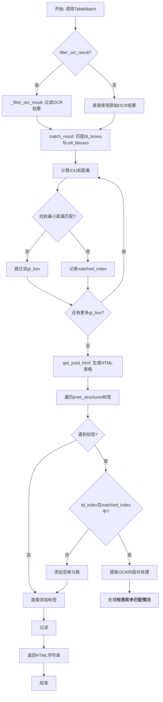
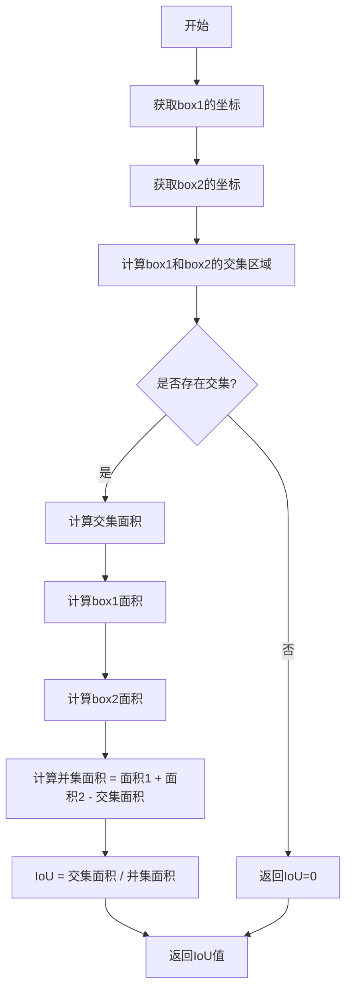
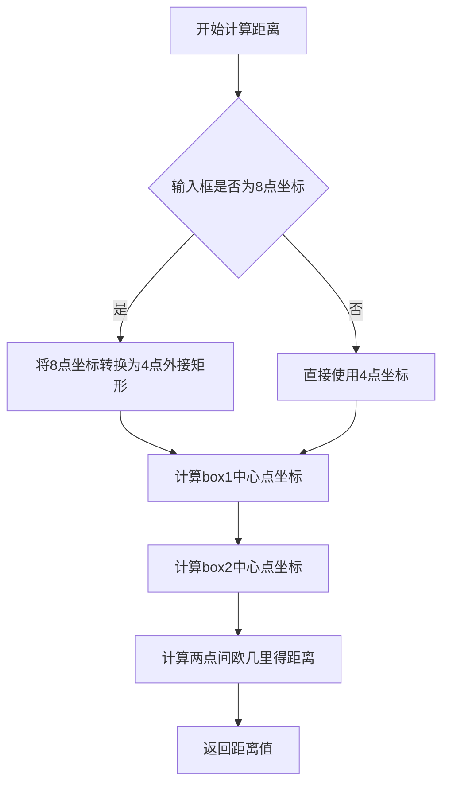
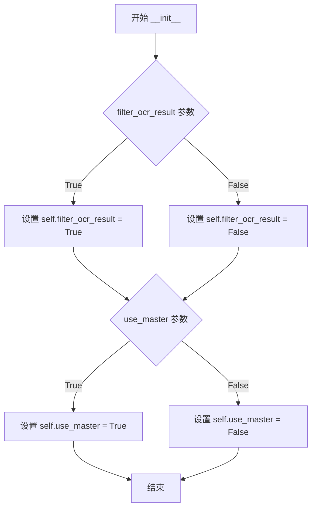
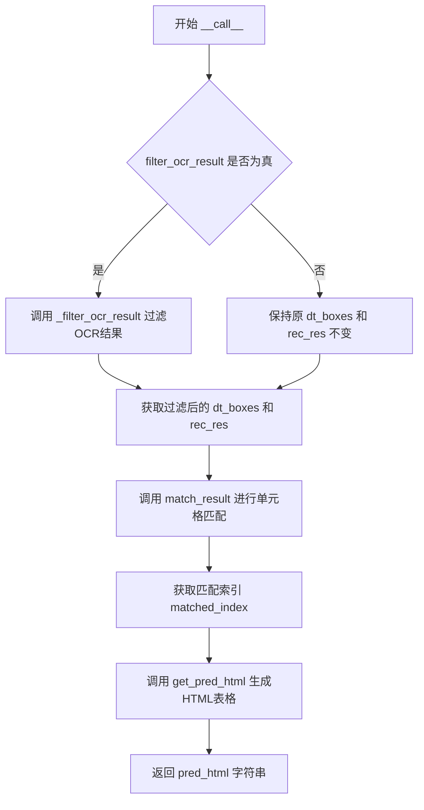

# `MinerU\mineru\model\table\rec\slanet_plus\matcher.py` 详细设计文档

该代码是PaddlePaddle OCR套件中的表格匹配模块，实现了将OCR识别出的文本与预测的表格结构进行匹配的核心功能，通过计算IOU和距离来确定文本与单元格边界框的对应关系，最终生成HTML格式的表格表示。

## 整体流程



## 类结构

```
TableMatch (表格匹配主类)
├── __init__ (构造函数)
├── __call__ (调用入口)
├── match_result (匹配结果计算)
├── get_pred_html (生成HTML)
├── decode_logic_points (解析逻辑坐标)
└── _filter_ocr_result (过滤OCR结果)
```

## 全局变量及字段


### `TableMatch.filter_ocr_result`
    
是否过滤OCR结果的标志

类型：`bool`
    


### `TableMatch.use_master`
    
是否使用master模式的标志

类型：`bool`
    
    

## 全局函数及方法


### `compute_iou`

该函数用于计算两个边界框之间的Intersection over Union（IoU）值，即交集面积与并集面积的比值，用于衡量两个框的重叠程度。

参数：

- `box1`：任意类型，第一个边界框（通常是检测到的框或真实框），格式可能为 `[x1, y1, x2, y2]` 或 `[x1, y1, x2, y2, x3, y3, x4, y4]`（4点坐标）
- `box2`：任意类型，第二个边界框，格式同上

返回值：`float`，返回两个边界框的IoU值，范围在0到1之间。值为1表示完全重叠，值为0表示完全不重叠。

#### 流程图



#### 带注释源码

```python
# 注意：以下为基于代码上下文推断的函数原型
# 实际源码位于 matcher_utils 模块中，当前代码仅导入了该函数

def compute_iou(box1, box2):
    """
    计算两个边界框的IoU（Intersection over Union）值
    
    参数:
        box1: 第一个边界框，可以是4点坐标[x1,y1,x2,y2,...]或2点坐标[x1,y1,x2,y2]
        box2: 第二个边界框，格式同box1
    
    返回值:
        float: IoU值，范围[0, 1]
    """
    # 从代码中的调用方式推断：
    # distances.append((distance(gt_box, pred_box), 1.0 - compute_iou(gt_box, pred_box)))
    # 可以看出该函数返回的是一个可以用于计算相似度的值（1 - iou）
    
    # 函数实现未在当前代码文件中提供
    # 需要查看 matcher_utils 模块的源代码获取完整实现
    pass
```

---

**注意**：提供的代码文件中仅包含对该函数的导入和使用，并未包含`compute_iou`函数的实际实现。该函数是从同目录下的`matcher_utils`模块导入的。要获取完整的函数实现和详细文档，需要查看`matcher_utils.py`源文件。

根据代码中的使用方式（`1.0 - compute_iou(gt_box, pred_box)`），可以推断该函数返回两个边界框的IoU值，类型为浮点数。


### `distance`（从 `matcher_utils` 导入）

该函数用于计算两个边界框之间的欧几里得距离（推测），常与 `compute_iou` 函数配合使用，用于在表格匹配场景中对检测框和真实框进行距离度量，以找出最佳的匹配结果。

**注意**：该函数为外部导入函数，其具体实现位于 `matcher_utils` 模块中，以下信息基于代码使用上下文推断。

参数：

- `box1`：`list` 或 `numpy.ndarray`，第一个边界框（通常为检测框 `dt_boxes` 中的元素），格式为 `[x1, y1, x2, y2]`（4点坐标）或 `[x1, y1, x2, y2, x3, y3, x4, y4]`（8点坐标）
- `box2`：`list` 或 `numpy.ndarray`，第二个边界框（通常为单元格框 `cell_bboxes` 中的元素），格式为 `[x1, y1, x2, y2]`（4点坐标）或 `[x1, y1, x2, y2, x3, y3, x4, y4]`（8点坐标）

返回值：`float`，两个边界框中心点之间的欧几里得距离

#### 流程图



#### 带注释源码

```
# 由于 distance 函数为外部导入，其源码不在当前文件中
# 以下为基于使用上下文的推测实现

def distance(box1, box2):
    """
    计算两个边界框中心点之间的欧几里得距离
    
    参数:
        box1: 边界框1，格式为 [x1, y1, x2, y2] 或 [x1, y1, x2, y2, x3, y3, x4, y4]
        box2: 边界框2，格式为 [x1, y1, x2, y2] 或 [x1, y1, x2, y2, x3, y3, x4, y4]
    
    返回值:
        float: 两边界框中心点之间的欧几里得距离
    """
    # 如果是8点坐标，转换为4点外接矩形
    if len(box1) == 8:
        box1 = [
            np.min(box1[0::2]),
            np.min(box1[1::2]),
            np.max(box1[0::2]),
            np.max(box1[1::2]),
        ]
    if len(box2) == 8:
        box2 = [
            np.min(box2[0::2]),
            np.min(box2[1::2]),
            np.max(box2[0::2]),
            np.max(box2[1::2]),
        ]
    
    # 计算中心点
    center1 = ((box1[0] + box1[2]) / 2, (box1[1] + box1[3]) / 2)
    center2 = ((box2[0] + box2[2]) / 2, (box2[1] + box2[3]) / 2)
    
    # 计算欧几里得距离
    distance = np.sqrt((center1[0] - center2[0])**2 + (center1[1] - center2[1])**2)
    
    return distance
```

**调用示例**（在 `TableMatch.match_result` 方法中）：

```python
# 在 match_result 方法中的调用方式
for i, gt_box in enumerate(dt_boxes):
    distances = []
    for j, pred_box in enumerate(cell_bboxes):
        if len(pred_box) == 8:
            pred_box = [
                np.min(pred_box[0::2]),
                np.min(pred_box[1::2]),
                np.max(pred_box[0::2]),
                np.max(pred_box[1::2]),
            ]
        distances.append(
            (distance(gt_box, pred_box), 1.0 - compute_iou(gt_box, pred_box))
        )  # compute iou and l1 distance
```


### `TableMatch.__init__`

这是 `TableMatch` 类的构造函数，用于初始化表格匹配器的配置参数，包括是否过滤OCR结果和是否使用主版本模式。

参数：

- `filter_ocr_result`：`bool`，是否在匹配前过滤OCR结果，默认为 True
- `use_master`：`bool`，是否使用主版本模式，默认为 False（当前版本未使用该参数）

返回值：`None`，无返回值（构造函数）

#### 流程图



#### 带注释源码

```python
def __init__(self, filter_ocr_result=True, use_master=False):
    """
    初始化 TableMatch 类的实例。
    
    参数:
        filter_ocr_result (bool): 是否在匹配前过滤OCR结果。
                                   过滤操作会移除位于表格上边界上方的OCR检测框。
                                   默认为 True。
        use_master (bool): 是否使用主版本模式。
                           注意：当前版本代码中未使用该参数，可能是为未来扩展预留。
                           默认为 False。
    
    返回值:
        None
    
    示例:
        >>> matcher = TableMatch()  # 使用默认参数
        >>> matcher = TableMatch(filter_ocr_result=False)  # 不过滤OCR结果
    """
    # 将 filter_ocr_result 参数存储为实例属性
    # 该属性在 __call__ 方法中用于决定是否调用 _filter_ocr_result
    self.filter_ocr_result = filter_ocr_result
    
    # 将 use_master 参数存储为实例属性
    # 注意：当前代码中未使用该属性，可能用于控制不同的匹配策略或后处理逻辑
    self.use_master = use_master
```


### `TableMatch.__call__`

该方法是 `TableMatch` 类的可调用接口，接收预测的表格结构、单元格边界框、检测框和识别结果作为输入，首先对OCR结果进行过滤以去除表格外的无关检测框，然后通过 `match_result` 方法进行单元格匹配，最后调用 `get_pred_html` 方法将匹配结果转换为HTML格式的表格并返回。

参数：

- `pred_structures`：`list`，预测的表格结构，通常为HTML标签列表（如`<tr>`、`<td>`等）
- `cell_bboxes`：`numpy.ndarray`，表格单元格的实际边界框坐标，用于与检测框进行匹配
- `dt_boxes`：`list`，OCR检测算法输出的文本框坐标列表
- `rec_res`：`list`，OCR识别结果，对应于`dt_boxes`中的每个文本框的识别文本内容

返回值：`str`，返回重构后的HTML格式表格字符串

#### 流程图



#### 带注释源码

```python
def __call__(self, pred_structures, cell_bboxes, dt_boxes, rec_res):
    """
    TableMatch类的可调用接口，将预测的表格结构与OCR识别结果进行匹配，
    最终输出HTML格式的表格字符串。
    
    参数:
        pred_structures: 预测的表格结构标签列表
        cell_bboxes: 表格单元格的实际边界框
        dt_boxes: OCR检测到的文本框坐标
        rec_res: OCR识别结果文本列表
    返回:
        pred_html: HTML格式的表格字符串
    """
    # 如果启用OCR结果过滤，则调用_filter_ocr_result方法
    # 过滤掉位于表格区域外的检测框和识别结果
    if self.filter_ocr_result:
        dt_boxes, rec_res = self._filter_ocr_result(cell_bboxes, dt_boxes, rec_res)
    
    # 调用match_result方法，将OCR检测框与表格单元格进行匹配
    # 返回匹配结果的索引映射，格式为 {单元格索引: [检测框索引列表]}
    matched_index = self.match_result(dt_boxes, cell_bboxes)
    
    # 调用get_pred_html方法，根据预测结构和匹配索引生成HTML表格
    # 返回两个值：pred_html为字符串形式，pred为列表形式
    pred_html, pred = self.get_pred_html(pred_structures, matched_index, rec_res)
    
    # 返回HTML格式的表格字符串
    return pred_html
```


### `TableMatch.match_result`

该方法实现了表格匹配的核心算法，通过计算OCR检测框与单元格边界框之间的IOU和L1距离，找出最佳的匹配组合，并返回一个映射字典，记录每个单元格对应的OCR检测框索引。

参数：

- `self`：TableMatch 类实例本身
- `dt_boxes`：`list`，OCR检测结果框列表，每个元素为一个边界框坐标列表
- `cell_bboxes`：`list`，单元格边界框列表，每个元素为一个边界框坐标列表
- `min_iou`：`float`，最小IOU阈值，默认为 0.1**8 (即 10^-8)，用于过滤低质量匹配

返回值：`dict`，返回匹配结果字典，键为单元格边界框索引，值为对应的OCR检测框索引列表

#### 流程图

```mermaid
flowchart TD
    A[开始 match_result] --> B[初始化空字典 matched]
    B --> C[遍历 dt_boxes 中的每个 gt_box]
    C --> D[初始化空列表 distances]
    D --> E[遍历 cell_bboxes 中的每个 pred_box]
    E --> F{判断 pred_box 长度是否为 8}
    F -->|是| G[将8点坐标转换为4点坐标]
    F -->|否| H[直接使用 pred_box]
    G --> I[计算 distance 和 1 - compute_iou]
    H --> I
    I --> J[将距离对添加到 distances 列表]
    J --> K{检查是否遍历完所有 pred_box}
    K -->|否| E
    K -->|是| L[复制 distances 并按 (iou距离, L1距离) 排序]
    L --> M{判断最小IOU是否小于阈值}
    M -->|是| N[跳过当前 gt_box]
    M -->|否| O{检查索引是否已存在于 matched]
    O -->|否| P[在 matched 中添加新条目]
    O -->|是| Q[将索引追加到现有条目]
    P --> R[检查是否遍历完所有 gt_box]
    Q --> R
    N --> R
    R -->|否| C
    R -->|是| S[返回 matched 字典]
    S --> T[结束]
```

#### 带注释源码

```python
def match_result(self, dt_boxes, cell_bboxes, min_iou=0.1**8):
    """
    匹配OCR检测框与单元格边界框
    
    参数:
        dt_boxes: OCR检测结果框列表
        cell_bboxes: 单元格边界框列表
        min_iou: 最小IOU阈值，默认为10^-8
    
    返回:
        matched: 匹配结果字典，键为cell_bboxes索引，值为对应的dt_boxes索引列表
    """
    # 存储匹配结果：{cell_bboxes索引: [dt_boxes索引列表]}
    matched = {}
    
    # 遍历每个OCR检测框（ground truth）
    for i, gt_box in enumerate(dt_boxes):
        distances = []
        
        # 遍历每个单元格边界框（预测框）
        for j, pred_box in enumerate(cell_bboxes):
            # 如果pred_box有8个坐标点（4个顶点），转换为4点坐标（minx, miny, maxx, maxy）
            if len(pred_box) == 8:
                pred_box = [
                    np.min(pred_box[0::2]),  # x坐标最小值
                    np.min(pred_box[1::2]),  # y坐标最小值
                    np.max(pred_box[0::2]),  # x坐标最大值
                    np.max(pred_box[1::2]),  # y坐标最大值
                ]
            
            # 计算L1距离和IOU距离（1 - IOU）
            # distance: 中心点之间的L1距离
            # 1 - compute_iou: IOU的距离度量（1减去IOU值）
            distances.append(
                (distance(gt_box, pred_box), 1.0 - compute_iou(gt_box, pred_box))
            )  # compute iou and l1 distance
        
        # 复制距离列表用于排序
        sorted_distances = distances.copy()
        
        # 按(IOU距离, L1距离)的顺序排序，选择最优匹配
        # 先按IOU距离排序，再按L1距离排序
        sorted_distances = sorted(
            sorted_distances, key=lambda item: (item[1], item[0])
        )
        
        # 必须满足最小IOU要求，否则跳过该匹配
        # sorted_distances[0][1] 是1 - IOU，所以需要 < 1 - min_iou
        # 即 IOU > min_iou
        if sorted_distances[0][1] >= 1 - min_iou:
            continue

        # 获取最佳匹配在原始distances列表中的索引
        best_match_idx = distances.index(sorted_distances[0])
        
        # 将匹配关系添加到matched字典
        # 键是cell_bboxes的索引，值是dt_boxes的索引列表
        if best_match_idx not in matched:
            matched[best_match_idx] = [i]
        else:
            matched[best_match_idx].append(i)
    
    return matched
```


### `TableMatch.get_pred_html`

该方法负责将预测的表格结构（HTML标签序列）与OCR识别出的文本内容进行匹配，生成最终的HTML表格字符串。它遍历预测结构中的每个表格单元格标签，根据匹配索引获取对应的OCR文本内容，处理文本格式（如去除多余空格、b标签等），并组装成完整的HTML表格。

参数：

- `pred_structures`：`list[str]`，预测的表格结构列表，包含HTML标签如`<tr>`、`<td>`、`</td>`等
- `matched_index`：`dict[int, list[int]]`，匹配索引字典，键为单元格索引，值为对应的OCR结果索引列表
- `ocr_contents`：`list[tuple[str, ...]]`，OCR识别结果列表，每个元素是一个元组，包含识别的文本内容

返回值：`tuple[str, list[str]]`，返回一个元组，包含拼接后的HTML字符串和中间结果列表（HTML标签和文本内容的列表）

#### 流程图

```mermaid
flowchart TD
    A[开始: get_pred_html] --> B[初始化: end_html=[], td_index=0]
    B --> C{遍历 pred_structures 中的每个 tag}
    C --> D{tag 是否包含 </td>}
    D -->|否| E[直接将 tag 添加到 end_html]
    D -->|是| F{tag 是否为 <td></td>}
    F -->|是| G[添加 <td> 到 end_html]
    F -->|否| H{td_index 是否在 matched_index 中}
    G --> H
    H -->|否| I{tag 是否为 <td></td>}
    H -->|是| J{检查是否需要添加 <b> 标签}
    J --> K{matched_index[td_index] 长度 > 1 且内容包含 <b>}
    K -->|是| L[添加 <b> 到 end_html]
    K -->|否| M[遍历 matched_index[td_index] 中的每个索引]
    L --> M
    M --> N[获取 ocr_contents[td_index_index][0] 作为 content]
    N --> O{matched_index[td_index] 长度 > 1}
    O -->|是| P{处理 content: 去除首空格、去除 <b></b> 标签}
    O -->|否| Q{content 长度 > 0}
    Q -->|是| R[如果非最后一项，添加空格]
    Q -->|否| S[跳过本次循环]
    P --> R
    R --> T{是否为最后一项}
    T -->|否| U[添加空格到 content 末尾]
    T -->|是| V[将处理后的 content 添加到 end_html]
    U --> V
    V --> W{是否需要添加 </b>}
    W -->|是| X[添加 </b> 到 end_html]
    W -->|否| I
    I --> Y{tag 是否为 <td></td>}
    Y -->|是| Z[添加 </td> 到 end_html]
    Y -->|否| AA[添加原 tag 到 end_html]
    Z --> AB[td_index += 1]
    AA --> AB
    E --> AC[td_index += 1]
    AB --> AC
    AC --> AD{是否还有更多 tag}
    AD -->|是| C
    AD -->|否| AE[过滤thead/tbody标签]
    AE --> AF[返回拼接的HTML字符串和列表]
```

#### 带注释源码

```python
def get_pred_html(self, pred_structures, matched_index, ocr_contents):
    """
    将预测的表格结构与OCR结果进行匹配，生成HTML表格字符串
    
    参数:
        pred_structures: 预测的表格结构列表，包含HTML标签
        matched_index: 匹配索引字典，键为td索引，值为OCR结果索引列表
        ocr_contents: OCR识别结果列表
    
    返回:
        拼接后的HTML字符串和中间结果列表
    """
    end_html = []  # 用于存储最终的HTML元素
    td_index = 0   # 当前处理的单元格索引
    
    # 遍历预测结构中的每个标签
    for tag in pred_structures:
        # 如果不是结束td标签，直接添加到结果中
        if "</td>" not in tag:
            end_html.append(tag)
            continue
        
        # 处理空单元格 <td></td>
        if "<td></td>" == tag:
            end_html.extend("<td>")  # 添加开始标签
        
        # 如果当前单元格索引在匹配索引中
        if td_index in matched_index.keys():
            b_with = False  # 标记是否需要添加<b>标签
            
            # 检查是否需要添加<b>标签：
            # 1. OCR内容包含"<b>"标记
            # 2. 该单元格有多个匹配的OCR结果
            if (
                "<b>" in ocr_contents[matched_index[td_index][0]]
                and len(matched_index[td_index]) > 1
            ):
                b_with = True
                end_html.extend("<b>")
            
            # 遍历该单元格对应的所有OCR结果索引
            for i, td_index_index in enumerate(matched_index[td_index]):
                # 获取OCR识别的文本内容
                content = ocr_contents[td_index_index][0]
                
                # 如果有多个匹配结果，处理内容格式
                if len(matched_index[td_index]) > 1:
                    # 跳过空内容
                    if len(content) == 0:
                        continue
                    
                    # 去除首空格
                    if content[0] == " ":
                        content = content[1:]
                    
                    # 去除<b>标签（只去除标签，保留内容）
                    if "<b>" in content:
                        content = content[3:]
                    
                    # 去除</b>标签
                    if "</b>" in content:
                        content = content[:-4]
                    
                    # 再次检查是否为空
                    if len(content) == 0:
                        continue
                    
                    # 如果不是最后一项，在内容末尾添加空格
                    if i != len(matched_index[td_index]) - 1 and " " != content[-1]:
                        content += " "
                
                # 将处理后的内容添加到结果中
                end_html.extend(content)
            
            # 如果之前添加了<b>标签，现在添加</b>
            if b_with:
                end_html.extend("</b>")
        
        # 处理结束标签
        if "<td></td>" == tag:
            end_html.append("</td>")
        else:
            end_html.append(tag)
        
        # 移动到下一个单元格索引
        td_index += 1
    
    # 过滤掉<thead></thead>和<tbody></tbody>元素
    filter_elements = ["<thead>", "</thead>", "<tbody>", "</tbody>"]
    end_html = [v for v in end_html if v not in filter_elements]
    
    # 返回拼接后的HTML字符串和列表形式的结果
    return "".join(end_html), end_html
```


### `TableMatch.decode_logic_points`

该方法用于将预测的HTML表格结构标签序列解析为逻辑坐标，通过遍历标签列表处理`<tr>`、`<td>`及colspan/rowspan属性，记录每个单元格的起始和结束行列位置，同时维护已占用单元格的状态以处理跨行跨列情况，最终返回表格所有单元格的逻辑坐标点列表。

参数：

- `pred_structures`：`list`，预测的HTML结构标签列表，包含`<tr>`、`</tr>`、`<td>`、`</td>`、`<td colspan="N">`、`<td rowspan="N">`等标签

返回值：`list`，逻辑坐标列表，每个元素为`[r_start, r_end, col_start, col_end]`形式的四元组，表示单元格的起始行、结束行、起始列、结束列

#### 流程图

```mermaid
flowchart TD
    A[开始 decode_logic_points] --> B[初始化变量: current_row=0, current_col=0, max_rows=0, max_cols=0, occupied_cells=空字典]
    B --> C{i < len(pred_structures)?}
    C -->|是| D[获取 token = pred_structures[i]]
    D --> E{token == '<tr>'?}
    E -->|是| F[current_col = 0]
    F --> Q[i += 1]
    E -->|否| G{token == '</tr>'?}
    G -->|是| H[current_row += 1]
    H --> Q
    G -->|否| I{token.startswith('<td')?}
    I -->|是| J[解析 colspan 和 rowspan 属性]
    J --> K[查找下一个未占用的列位置]
    K --> L[计算逻辑坐标 r_start, r_end, col_start, col_end]
    L --> M[记录逻辑坐标到 logic_points]
    M --> N[标记占用的单元格]
    N --> O[current_col += colspan]
    O --> P[更新 max_rows 和 max_cols]
    P --> Q
    I -->|否| Q
    Q --> C
    C -->|否| R[返回 logic_points]
```

#### 带注释源码

```python
def decode_logic_points(self, pred_structures):
    """
    将预测的HTML表格结构标签解析为逻辑坐标
    
    参数:
        pred_structures: list, 包含<tr>、</tr>、<td>、<td colspan="">等标签的列表
    
    返回:
        list: 逻辑坐标列表，格式为[[r_start, r_end, col_start, col_end], ...]
    """
    logic_points = []  # 存储所有单元格的逻辑坐标
    current_row = 0    # 当前处理的行号
    current_col = 0    # 当前处理的列号
    max_rows = 0       # 表格的最大行数
    max_cols = 0       # 表格的最大列数
    occupied_cells = {}  # 字典，用于记录已经被占用的单元格坐标，key为(row, col)

    def is_occupied(row, col):
        """检查指定坐标是否已被占用"""
        return (row, col) in occupied_cells

    def mark_occupied(row, col, rowspan, colspan):
        """
        标记指定区域为已占用
        用于处理跨行跨列的单元格
        """
        for r in range(row, row + rowspan):
            for c in range(col, col + colspan):
                occupied_cells[(r, c)] = True

    i = 0
    while i < len(pred_structures):
        token = pred_structures[i]  # 获取当前标签 token

        if token == "<tr>":
            # 遇到行开始标签，重置列号
            current_col = 0
        elif token == "</tr>":
            # 遇到行结束标签，行号增加
            current_row += 1
        elif token.startswith("<td"):
            # 遇到单元格开始标签
            colspan = 1  # 默认跨1列
            rowspan = 1  # 默认跨1行
            j = i
            
            # 处理非空单元格标签（如 <td colspan="2">）
            if token != "<td></td>":
                j += 1
                # 提取 colspan 和 rowspan 属性
                while j < len(pred_structures) and not pred_structures[j].startswith(">"):
                    if "colspan=" in pred_structures[j]:
                        # 解析 colspan 属性值
                        colspan = int(pred_structures[j].split("=")[1].strip("\"'"))
                    elif "rowspan=" in pred_structures[j]:
                        # 解析 rowspan 属性值
                        rowspan = int(pred_structures[j].split("=")[1].strip("\"'"))
                    j += 1

            # 跳过已经处理过的属性 token，将索引移动到 '>' 之后
            i = j

            # 找到下一个未被占用的列位置
            # 处理当前行中前面的单元格占用情况
            while is_occupied(current_row, current_col):
                current_col += 1

            # 计算逻辑坐标
            r_start = current_row                      # 起始行
            r_end = current_row + rowspan - 1          # 结束行
            col_start = current_col                    # 起始列
            col_end = current_col + colspan - 1        # 结束列

            # 记录该单元格的逻辑坐标
            logic_points.append([r_start, r_end, col_start, col_end])

            # 标记该单元格所占据的所有位置为已占用
            mark_occupied(r_start, col_start, rowspan, colspan)

            # 更新当前列号，加上该单元格占据的列数
            current_col += colspan

            # 更新表格的最大行数和列数
            max_rows = max(max_rows, r_end + 1)
            max_cols = max(max_cols, col_end + 1)

        i += 1  # 移动到下一个 token

    return logic_points
```


### `TableMatch._filter_ocr_result`

该方法用于过滤OCR识别结果，通过比较检测框的坐标与单元格边界框的垂直位置关系，筛选出位于表格单元格区域内的OCR识别结果，剔除位于表格上方的无关文本检测。

参数：

- `cell_bboxes`：`numpy.ndarray` 或 `list`，表格单元格边界框数组，存储所有单元格的坐标信息
- `dt_boxes`：`list`，OCR检测到的文本框列表，每个元素为一个边界框坐标
- `rec_res`：`list`，OCR识别结果列表，与`dt_boxes`一一对应

返回值：`tuple`，包含两个元素：

- `new_dt_boxes`：`list`，过滤后的文本框列表，只保留位于单元格区域内的检测框
- `new_rec_res`：`list`，过滤后的识别结果列表，与过滤后的文本框对应

#### 流程图

```mermaid
flowchart TD
    A[开始 _filter_ocr_result] --> B[计算单元格最小y坐标: y1 = cell_bboxes[:, 1::2].min]
    B --> C[初始化空列表: new_dt_boxes, new_rec_res]
    C --> D{遍历 dt_boxes 和 rec_res}
    D -->|当前元素| E[获取检测框的最大y坐标: np.max(box[1::2])]
    E --> F{判断: max_y < y1?}
    F -->|是| G[跳过当前检测结果, 继续下一轮]
    F -->|否| H[将 box 添加到 new_dt_boxes]
    H --> I[将 rec 添加到 new_rec_res]
    I --> G
    G --> D
    D -->|遍历完成| J[返回 new_dt_boxes 和 new_rec_res]
    J --> K[结束]
```

#### 带注释源码

```python
def _filter_ocr_result(self, cell_bboxes, dt_boxes, rec_res):
    """
    过滤OCR结果，只保留位于表格单元格区域内的检测结果
    
    参数:
        cell_bboxes: 表格单元格边界框数组
        dt_boxes: OCR检测到的文本框列表
        rec_res: OCR识别结果列表
    
    返回:
        (new_dt_boxes, new_rec_res): 过滤后的文本框和识别结果
    """
    # 计算所有单元格边界框的最小y坐标（垂直方向的最小边界）
    # cell_bboxes[:, 1::2] 选取所有边界框的奇数索引位置（即y坐标）
    # .min() 获取这些y坐标中的最小值
    y1 = cell_bboxes[:, 1::2].min()
    
    # 初始化用于存储过滤后结果的空列表
    new_dt_boxes = []
    new_rec_res = []
    
    # 遍历每个OCR检测框及其对应的识别结果
    for box, rec in zip(dt_boxes, rec_res):
        # 计算当前检测框的最大y坐标
        # box[1::2] 选取边界框中的所有y坐标
        # np.max() 获取最大y值
        if np.max(box[1::2]) < y1:
            # 如果检测框的最大y坐标小于单元格的最小y坐标
            # 说明该检测框位于表格单元格区域的上方，应当过滤掉
            continue
        
        # 通过过滤条件的检测框，保留到新的列表中
        new_dt_boxes.append(box)
        new_rec_res.append(rec)
    
    # 返回过滤后的检测框列表和识别结果列表
    return new_dt_boxes, new_rec_res
```

## 关键组件


### TableMatch 类

表格结构匹配器核心类，负责将OCR识别结果与表格单元格进行匹配，并生成HTML格式的表格输出。支持OCR结果过滤和主表模式配置。

### match_result 方法

基于IOU和L1距离的双重度量匹配算法，将OCR检测框与表格单元格框进行最优匹配。使用距离排序策略选择最佳匹配对，支持8点转4点的边界框格式转换。

### get_pred_html 方法

将匹配结果转换为HTML表格结构。处理OCR文本内容中的\<b\>标签、多行合并单元格、空白字符清理，并过滤\<thead\>/\<tbody\>等无关标签。

### decode_logic_points 方法

表格逻辑坐标解析器，从HTML结构标签中提取单元格的逻辑位置。处理\<tr\>、\<td\>标签，支持rowspan和colspan属性，记录单元格占用情况，计算最大行列数。

### _filter_ocr_result 方法

OCR结果过滤器，根据单元格边界框的Y坐标过滤掉表格上方的OCR检测结果，确保只保留表格区域内的识别内容。

### matcher_utils 模块

工具函数集合，提供compute_iou计算两边界框的IOU值，distance计算L1距离，用于匹配算法中的相似度度量。


## 问题及建议


### 已知问题

-   **性能问题**：`match_result`方法中使用`distances.index(sorted_distances[0])`是O(n)操作且在嵌套循环中调用，导致时间复杂度较高，应使用enumerate直接记录最小值索引
-   **魔法数字**：`min_iou=0.1**8`使用了不易理解的幂运算，应定义为具名常量如`MIN_IOU_THRESHOLD = 1e-8`
-   **错误处理不足**：多处缺少对空列表、越界访问的防护，如`_filter_ocr_result`未检查`cell_bboxes`是否为空，`get_pred_html`中`matched_index[td_index]`可能为空的边界情况未处理
-   **职责过重**：`TableMatch`类混合了OCR结果过滤、匹配、HTML生成等多个职责违反了单一职责原则
-   **命名不一致**：变量命名风格不统一，如`b_with`、`dt_boxes`（detection boxes）、`rec_res`（recognition results）缩写形式不直观
-   **返回值不一致**：`__call__`方法注释或文档缺失，且只返回`pred_html`但内部计算了`pred`变量，存在设计不一致
-   **字符串操作低效**：`get_pred_html`方法中使用`list extend`逐个添加字符效率较低，应考虑使用生成器或流式处理
-   **数据结构选择不当**：使用Python列表存储`matched`字典，值类型为列表而非集合，对于简单的存在性检查效率不高
-   **边界条件处理**：`decode_logic_points`方法中`occupied_cells`字典在行切换时未清理，可能导致内存泄漏或逻辑错误

### 优化建议

-   **提取常量和配置**：将`0.1**8`等魔法数字提取为类属性或模块级常量，添加文档说明其含义
-   **重构匹配算法**：使用`numpy`向量化操作替代双重循环，或使用`KDTree`等空间索引加速最近邻搜索
-   **添加输入验证**：在public方法入口添加参数校验，确保`dt_boxes`、`cell_bboxes`等非空且格式正确
-   **拆分职责**：将`TableMatch`拆分为`TableMatcher`、`HtmlGenerator`、`OCRFilter`等独立类
-   **统一命名规范**：使用完整单词命名变量，如`detection_boxes`替代`dt_boxes`，`b_with`改为`has_bold_tag`
-   **添加文档字符串**：为所有public方法添加docstring，说明参数、返回值和异常情况
-   **优化字符串构建**：使用`io.StringIO`或列表推导式替代频繁的`extend`操作
-   **改进数据结构**：使用`defaultdict(list)`简化匹配逻辑，使用`set`替代部分列表操作
-   **补充单元测试**：为边界条件如空输入、单元素匹配、多行多列等情况添加测试覆盖
-   **重构decode_logic_points**：该方法逻辑复杂且与类中其他方法职责不同，考虑提取为独立工具函数


## 其它


### 设计目标与约束

本模块的设计目标是实现表格结构识别结果与OCR识别结果的精确匹配，生成可用于后续处理的HTML表格表示。核心约束包括：1）匹配算法基于IOU和L1距离的组合度量；2）仅支持标准的HTML表格标签（`<table>`、`<tr>`、`<td>`）；3）处理过程中会过滤掉`<thead>`和`<tbody>`标签；4）OCR结果过滤仅基于Y轴坐标比较。

### 错误处理与异常设计

代码中的错误处理主要包括：1）空值检查：`if len(content) == 0: continue` 处理空的OCR内容；2）索引安全：`if td_index in matched_index.keys()` 进行键存在性检查；3）数组越界防护：`while is_occupied(current_row, current_col)` 防止单元格坐标越界；4）默认值处理：`colspan = 1; rowspan = 1` 提供默认的单元格跨行跨列值。当IOU计算结果异常或距离计算失败时，匹配算法会跳过该单元格。

### 数据流与状态机

模块的数据流如下：输入数据（pred_structures、cell_bboxes、dt_boxes、rec_res）→ OCR结果过滤（可选）→ 匹配计算 → HTML生成 → 输出（pred_html）。状态机方面，`get_pred_html`方法维护td_index状态表示当前处理的单元格位置；`decode_logic_points`方法维护current_row、current_col、occupied_cells等状态追踪表格逻辑坐标；匹配结果matched_index维护已匹配单元格的映射关系。

### 外部依赖与接口契约

本模块依赖以下外部组件：1）numpy库用于数值计算和数组操作；2）matcher_utils模块中的compute_iou和distance函数用于几何计算。输入接口要求：pred_structures为列表类型的HTML标签序列，cell_bboxes为numpy数组类型的表格单元格坐标，dt_boxes为检测框坐标列表，rec_res为识别结果列表。输出接口返回pred_html字符串和可选的end_html列表。

### 性能考虑与优化空间

当前实现存在以下性能瓶颈：1）双重循环匹配算法时间复杂度为O(n*m)；2）distance和compute_iou在循环内部重复调用；3）列表index方法效率较低。优化方向包括：1）使用KD树或空间索引加速最近邻搜索；2）预先计算并缓存距离矩阵；3）使用numpy向量化操作替代Python循环；4）考虑使用批量匹配算法减少重复计算。

### 安全性与权限管理

本模块主要处理数据匹配，不涉及敏感信息或权限管理。安全考虑点包括：1）输入验证：需确保dt_boxes和cell_bboxes的坐标格式正确；2）HTML注入防护：当前代码直接拼接OCR内容到HTML字符串，理论上存在XSS风险，建议对ocr_contents进行HTML转义处理；3）内存安全：需防止过大的输入数据导致内存溢出。

### 测试策略与用例设计

建议的测试用例包括：1）基础功能测试：正常表格的匹配和HTML生成；2）边界情况测试：空表格、单单元格表格、跨行跨列表格；3）异常输入测试：空的pred_structures、不匹配的OCR结果、格式错误的坐标；4）性能测试：大规模表格（100+单元格）的处理时间；5）OCR过滤测试：验证filter_ocr_result参数的效果。

### 配置参数与可扩展性

可配置参数包括：1）filter_ocr_result：布尔值，控制是否启用OCR结果过滤；2）use_master：布尔值，当前未使用，保留用于未来功能扩展；3）min_iou：浮点数，默认值为0.1**8=1e-16，用于控制最小IOU阈值。扩展方向：1）支持更多表格结构标签（如th、colspan、rowspan）；2）集成更复杂的匹配算法；3）支持多种输出格式（CSV、JSON等）。

### 版本兼容性与迁移路径

当前版本仅依赖Python 3和numpy，兼容性较好。迁移时需注意：1）compute_iou和distance函数的接口兼容性；2）pred_structures格式变化（标签语法）；3）numpy数组操作方式的兼容性。建议在后续版本中：1）添加类型注解提高代码可维护性；2）使用dataclass或namedtuple替代字典存储匹配结果；3）考虑将匹配算法抽象为策略模式以支持多种算法切换。


    