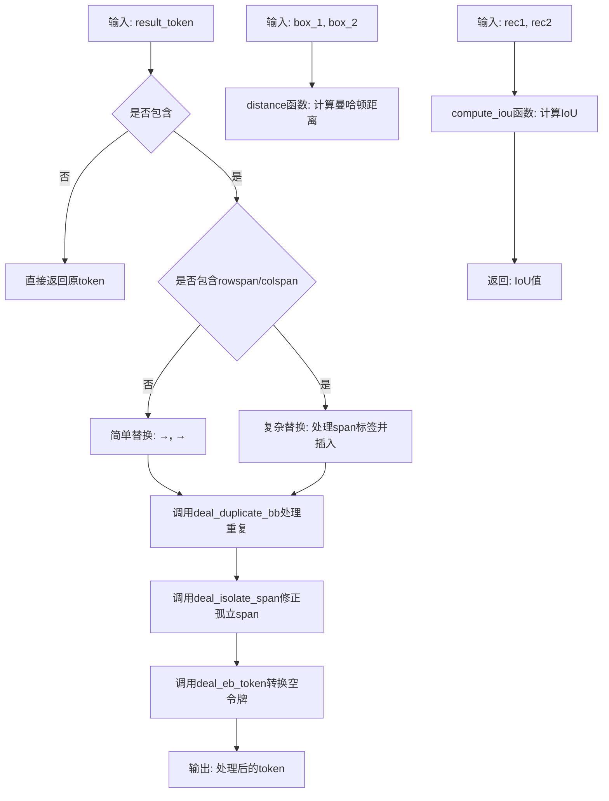
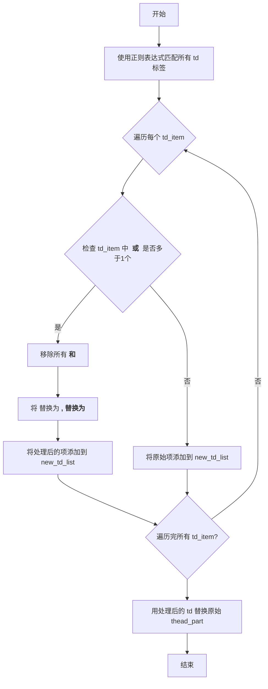
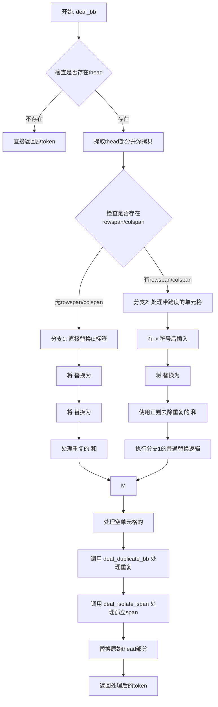
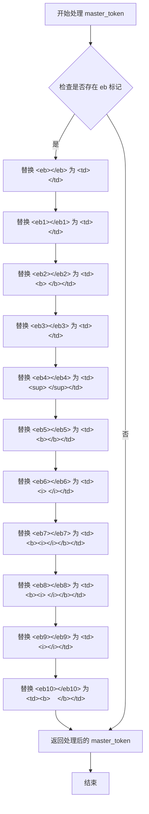
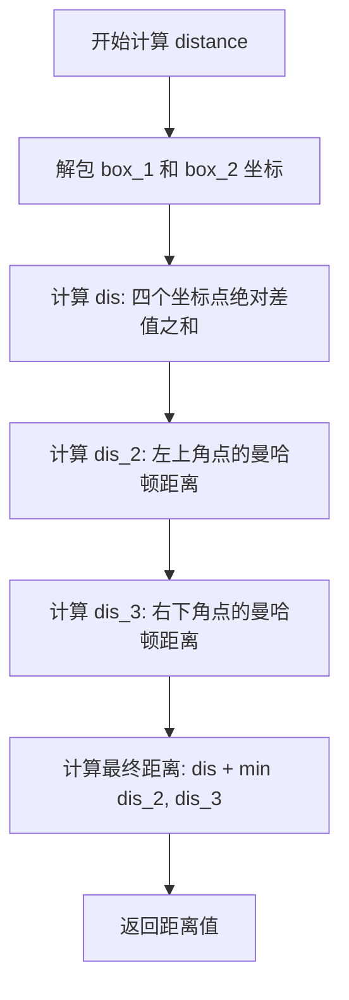
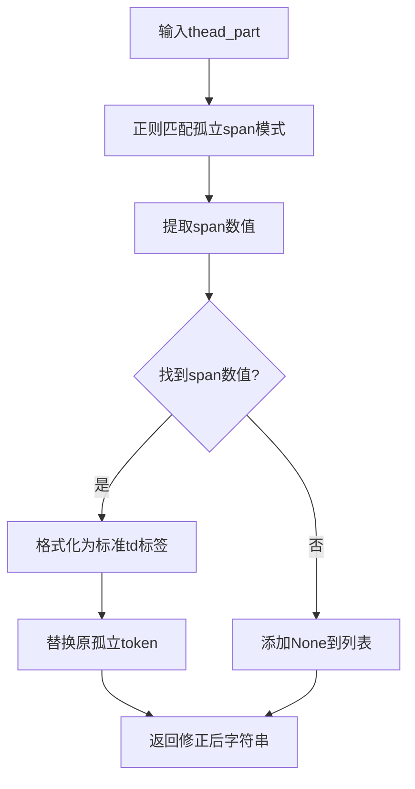
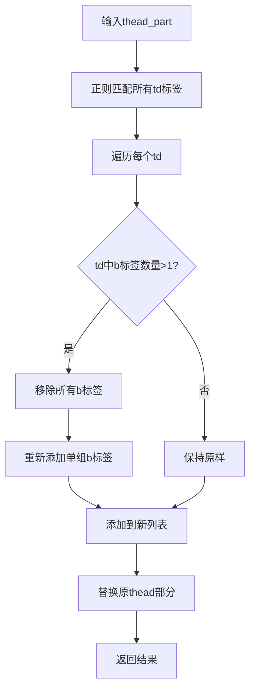
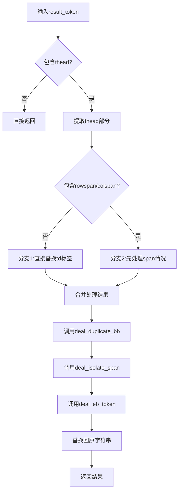
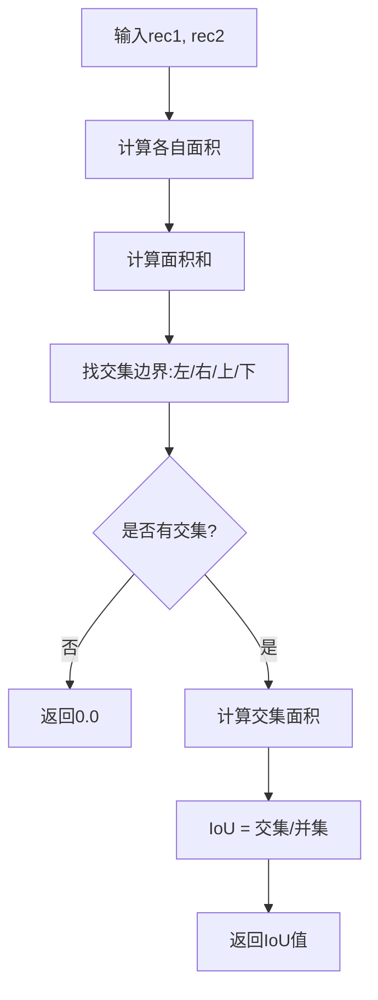

# `MinerU\mineru\model\table\rec\slanet_plus\matcher_utils.py` 详细设计文档

该代码是PaddlePaddle表格识别项目的后处理模块，主要用于处理表格结构识别的结果，包括修正预测错误的HTML标签（如rowspan/colspan）、处理重复的加粗标签、转换空边界框令牌为标准HTML标签，以及提供边界框的距离计算和IoU（交并比）计算辅助函数。

## 整体流程



## 类结构

```
无类定义（纯函数模块）
├── deal_isolate_span (处理孤立span)
├── deal_duplicate_bb (处理重复加粗标签)
├── deal_bb (主处理函数: 处理thead中的加粗标签)
├── deal_eb_token (处理空边界框令牌)
├── distance (计算边界框距离)
└── compute_iou (计算交并比)
```

## 全局变量及字段


    

## 全局函数及方法


### `deal_isolate_span`

该函数用于处理表格结构识别中的"孤立跨距"（isolate span）问题。当结构识别模型错误预测HTML表格单元格标签时，会产生如`<td></td> rowspan="2"></b></td>`这样的错误格式，函数通过正则表达式匹配并修正这些孤立属性，将其还原为正确的`<td rowspan="N"></td>`或`<td colspan="N"></td>`格式。

参数：

- `thead_part`：`str`，表示HTML表格的`<thead>`部分，包含需要处理的单元格标签字符串

返回值：`str`，返回修正后的`<thead>`部分字符串

#### 流程图

```mermaid
flowchart TD
    A[开始] --> B[定义isolate_pattern正则表达式]
    B --> C[使用re.finditer查找孤立跨距标记]
    C --> D[将匹配结果存入isolate_list列表]
    E[定义span_pattern正则表达式] --> F[遍历isolate_list中的每个元素]
    F --> G[使用re.search提取span部分]
    H{spanStr_in_isolateItem是否为None} -->|否| I[构造修正后的标记: <td{spanStr}></td>]
    H -->|是| J[添加None到corrected_list]
    I --> K[添加修正项到corrected_list]
    K --> L[使用zip配对修正项与原始项]
    L --> M{修正项是否为None} -->|否| N[执行thead_part.replace替换]
    M -->|是| O[跳过替换]
    N --> P[返回修正后的thead_part]
    O --> P
```

#### 带注释源码

```python
def deal_isolate_span(thead_part):
    """
    处理HTML表格中的孤立跨距情况。
    这是由结构识别模型的错误预测导致的。
    例如: 将 <td rowspan="2"></td> 错误预测为 <td></td> rowspan="2"></b></td>
    
    参数:
        thead_part: HTML表格的thead部分字符串
    
    返回:
        修正后的thead部分字符串
    """
    # 步骤1: 找出孤立跨距的标记 tokens
    # 定义正则表达式模式，匹配以下几种错误格式:
    # - <td></td> rowspan='N' colspan='M'></b></td>
    # - <td></td> colspan='M' rowspan='N'></b></td>
    # - <td></td> rowspan='N'></b></td>
    # - <td></td> colspan='M'></b></td>
    isolate_pattern = (
        r"<td></td> rowspan='(\d)+' colspan='(\d)+'></b></td>|"
        r"<td></td> colspan='(\d)+' rowspan='(\d)+'></b></td>|"
        r"<td></td> rowspan='(\d)+'></b></td>|"
        r"<td></td> colspan='(\d)+'></b></td>"
    )
    # 使用finditer查找所有匹配项（返回迭代器，支持捕获组）
    isolate_iter = re.finditer(isolate_pattern, thead_part)
    # 将迭代器转换为完整匹配字符串的列表
    isolate_list = [i.group() for i in isolate_iter]

    # 步骤2: 从步骤1的结果中提取跨距数字
    # 定义正则表达式，用于从错误标记中提取 rowspan 或 colspan 属性
    span_pattern = (
        r" rowspan='(\d)+' colspan='(\d)+'|"
        r" colspan='(\d)+' rowspan='(\d)+'|"
        r" rowspan='(\d)+'|"
        r" colspan='(\d)+'"
    )
    # 用于存储修正后的标记列表
    corrected_list = []
    
    # 遍历每个孤立项，提取其中的跨距属性
    for isolate_item in isolate_list:
        # 使用search查找span部分（只返回第一个匹配）
        span_part = re.search(span_pattern, isolate_item)
        # 获取匹配到的span字符串（如 " rowspan='2' colspan='3'"）
        spanStr_in_isolateItem = span_part.group()
        
        # 步骤3: 将跨距数字合并到正确的span标记格式字符串中
        if spanStr_in_isolateItem is not None:
            # 构造正确的HTML标记格式: <td rowspan='2' colspan='3'></td>
            corrected_item = f"<td{spanStr_in_isolateItem}></td>"
            corrected_list.append(corrected_item)
        else:
            # 如果没有找到span部分，添加None占位符
            corrected_list.append(None)

    # 步骤4: 用修正后的标记替换原始的孤立标记
    # 使用zip同时遍历修正列表和原始列表
    for corrected_item, isolate_item in zip(corrected_list, isolate_list):
        if corrected_item is not None:
            # 执行字符串替换
            thead_part = thead_part.replace(isolate_item, corrected_item)
        else:
            # 如果修正项为None，不做处理
            pass
    
    # 返回修正后的thead部分
    return thead_part
```


### `deal_duplicate_bb`

处理重复的 `<b>` 或 `</b>` 标签，确保每个 `<td></td>` 标签中只保留一对 `<b></b>` 标签。

参数：

-  `thead_part`：`str`，表示包含 `<thead>` 标签的 HTML 字符串片段

返回值：`str`，返回处理后去除了重复 `<b>` 标签的 HTML 字符串

#### 流程图



#### 带注释源码

```python
def deal_duplicate_bb(thead_part):
    """
    处理替换后出现的重复 <b> 或 </b> 标签。
    确保每个 <td></td> 标签中只保留一对 <b></b> 标签。
    :param thead_part: 包含 <thead> 标签的 HTML 字符串
    :return: 处理后的 HTML 字符串
    """
    # 1. 找出 <thead></thead> 中的所有 <td></td> 标签
    # 支持 rowspan 和 colspan 属性的多种组合形式
    td_pattern = (
        r"<td rowspan='(\d)+' colspan='(\d)+'>(.+?)</td>|"
        r"<td colspan='(\d)+' rowspan='(\d)+'>(.+?)</td>|"
        r"<td rowspan='(\d)+'>(.+?)</td>|"
        r"<td colspan='(\d)+'>(.+?)</td>|"
        r"<td>(.*?)</td>"
    )
    td_iter = re.finditer(td_pattern, thead_part)
    td_list = [t.group() for t in td_iter]

    # 2. 检查每个 <td></td> 中是否存在多个 <b> 或 </b> 标签
    new_td_list = []
    for td_item in td_list:
        # 判断 <b> 或 </b> 是否出现多于1次
        if td_item.count("<b>") > 1 or td_item.count("</b>") > 1:
            # 情况：<td></td> 中有多对 <b></b> 标签
            # 步骤1：移除所有的 <b> 和 </b> 标签
            td_item = td_item.replace("<b>", "").replace("</b>", "")
            # 步骤2：重新添加单一的 <b></b> 标签对
            # 将 <td> 替换为 <td><b>, </td> 替换为 </b></td>
            td_item = td_item.replace("<td>", "<td><b>").replace("</td>", "</b></td>")
            new_td_list.append(td_item)
        else:
            # 情况：<td></td> 中只有一对或没有 <b></b> 标签，保持不变
            new_td_list.append(td_item)

    # 3. 用处理后的 <td> 标签替换原始的 <thead> 部分
    for td_item, new_td_item in zip(td_list, new_td_list):
        thead_part = thead_part.replace(td_item, new_td_item)
    
    return thead_part
```


### `deal_bb`

该函数用于处理表格识别结果中的 `<thead></thead>` 部分，自动在表头单元格的文本中插入 `<b></b>` 标签（粗体标记）。它能处理带有 rowspan/colspan 属性的复杂表头结构，并纠正结构识别模型可能产生的预测错误。

参数：

- `result_token`：`str`，包含 HTML 表格标记的原始识别结果

返回值：`str`，处理后的结果 token，表头部分已正确插入 `<b></b>` 标签

#### 流程图



#### 带注释源码

```python
def deal_bb(result_token):
    """
    In our opinion, <b></b> always occurs in <thead></thead> text's context.
    This function will find out all tokens in <thead></thead> and insert <b></b> by manual.
    :param result_token: 包含HTML表格标记的原始识别结果
    :return: 处理后的结果token，表头部分已正确插入<b></b>标签
    """
    # 1. 查找 <thead></thead> 部分
    thead_pattern = "<thead>(.*?)</thead>"
    # 如果不存在thead标签，直接返回原token
    if re.search(thead_pattern, result_token) is None:
        return result_token
    # 提取thead部分并深拷贝保存原始值
    thead_part = re.search(thead_pattern, result_token).group()
    origin_thead_part = copy.deepcopy(thead_part)

    # 2. 检查 <thead></thead> 中是否存在 rowspan 或 colspan
    span_pattern = r"<td rowspan='(\d)+' colspan='(\d)+'>|<td colspan='(\d)+' rowspan='(\d)+'>|<td rowspan='(\d)+'>|<td colspan='(\d)+'>"
    span_iter = re.finditer(span_pattern, thead_part)
    span_list = [s.group() for s in span_iter]
    # 判断是否存在rowspan或colspan属性
    has_span_in_head = True if len(span_list) > 0 else False

    if not has_span_in_head:
        # 分支1: <thead></thead> 不包含 rowspan 或 colspan
        # 1. 替换 <td> 为 <td><b>, </td> 为 </b></td>
        # 2. 文本行识别可能预测出 <b> 或 </b>，需处理重复情况
        #    替换 <b><b> 为 <b>, </b></b> 为 </b>
        thead_part = (
            thead_part.replace("<td>", "<td><b>")
            .replace("</td>", "</b></td>")
            .replace("<b><b>", "<b>")
            .replace("</b></b>", "</b>")
        )
    else:
        # 分支2: <thead></thead> 包含 rowspan 或 colspan
        # 首先，处理rowspan或colspan的情况
        # 1. 在 > 符号后插入 <b>
        # 2. 替换 </td> 为 </b></td>
        # 3. 处理重复的 <b> 和 </b>
        
        # 然后，处理普通情况（类似分支1）
        
        # 步骤1: 在每个span标签的 > 后插入 <b>
        replaced_span_list = []
        for sp in span_list:
            replaced_span_list.append(sp.replace(">", "><b>"))
        # 替换原span标签为带<b>的版本
        for sp, rsp in zip(span_list, replaced_span_list):
            thead_part = thead_part.replace(sp, rsp)

        # 步骤2: 替换 </td> 为 </b></td>
        thead_part = thead_part.replace("</td>", "</b></td>")

        # 步骤3: 使用正则去除重复的 <b>
        mb_pattern = "(<b>)+"
        single_b_string = "<b>"
        thead_part = re.sub(mb_pattern, single_b_string, thead_part)

        # 步骤4: 使用正则去除重复的 </b>
        mgb_pattern = "(</b>)+"
        single_gb_string = "</b>"
        thead_part = re.sub(mgb_pattern, single_gb_string, thead_part)

        # 步骤5: 执行普通替换逻辑（类似分支1）
        thead_part = thead_part.replace("<td>", "<td><b>").replace("<b><b>", "<b>")

    # 3. 将 <td><b></b></td> 转换回 <td></td>
    # 空单元格不应包含 <b></b>，但带空格的单元格(<td> </td>)适合 <td><b> </b></td>
    thead_part = thead_part.replace("<td><b></b></td>", "<td></td>")
    
    # 4. 处理重复的 <b></b>（调用辅助函数）
    thead_part = deal_duplicate_bb(thead_part)
    
    # 5. 处理孤立的span标记，由结构预测错误引起
    # 例如: predict <td rowspan="2"></td> to <td></td> rowspan="2"></b></td>
    thead_part = deal_isolate_span(thead_part)
    
    # 6. 用新的thead部分替换原始结果
    result_token = result_token.replace(origin_thead_part, thead_part)
    return result_token
```


### `deal_eb_token`

这是一个用于后处理空盒子标记（empty bbox tokens）的函数，将各种 `<eb></eb>` 变体（如 `<eb1></eb1>`, `<eb2></eb2>` 等）转换为标准的HTML表格单元格标签 `<td></td>`，并根据不同的空标记类型添加相应的内部格式内容（如空格、加粗 `<b>`、斜体 `<i>`、上标 `<sup>` 等）。

参数：

- `master_token`：`str`，需要处理的原始令牌字符串，包含各种空盒子标记

返回值：`str`，处理后的字符串，空盒子标记已被替换为标准的HTML表格单元格标签

#### 流程图



#### 带注释源码

```python
def deal_eb_token(master_token):
    """
    Post process with <eb></eb>, <eb1></eb1>, ...
    emptyBboxTokenDict = {
        "[]": '<eb></eb>',                         # 空单元格
        "[' ']": '<eb1></eb1>',                     # 包含空格的单元格
        "['<b>', ' ', '</b>']": '<eb2></eb2>',      # 包含加粗空格的单元格
        "['\\u2028', '\\u2028']": '<eb3></eb3>',    # 包含换行符的单元格
        "['<sup>', ' ', '</sup>']": '<eb4></eb4>',  # 包含上标的单元格
        "['<b>', '</b>']": '<eb5></eb5>',           # 包含空加粗的单元格
        "['<i>', ' ', '</i>']": '<eb6></eb6>',      # 包含斜体空格的单元格
        "['<b>', '<i>', '</i>', '</b>']": '<eb7></eb7>',   # 包含加粗斜体的单元格
        "['<b>', '<i>', ' ', '</i>', '</b>']": '<eb8></eb8>', # 包含加粗斜体空格的单元格
        "['<i>', '</i>']": '<eb9></eb9>',           # 包含空斜体的单元格
        "['<b>', ' ', '\\u2028', ' ', '\\u2028', ' ', '</b>']": '<eb10></eb10>', # 包含加粗和换行符的单元格
    }
    :param master_token: 输入的待处理令牌字符串
    :return: 处理后的令牌字符串
    """
    # 将空盒子标记 <eb></eb> 替换为标准的空表格单元格 <td></td>
    master_token = master_token.replace("<eb></eb>", "<td></td>")
    
    # 将包含单个空格的空盒子标记替换为包含空格的表格单元格
    master_token = master_token.replace("<eb1></eb1>", "<td> </td>")
    
    # 将包含加粗空格的空盒子标记替换为包含加粗空格的表格单元格
    master_token = master_token.replace("<eb2></eb2>", "<td><b> </b></td>")
    
    # 将包含换行符的空格盒子标记替换为包含换行符的表格单元格
    master_token = master_token.replace("<eb3></eb3>", "<td>\u2028\u2028</td>")
    
    # 将包含上标空格的空盒子标记替换为包含上标空格的表格单元格
    master_token = master_token.replace("<eb4></eb4>", "<td><sup> </sup></td>")
    
    # 将包含空加粗的盒子标记替换为包含空加粗的表格单元格
    master_token = master_token.replace("<eb5></eb5>", "<td><b></b></td>")
    
    # 将包含斜体空格的盒子标记替换为包含斜体空格的表格单元格
    master_token = master_token.replace("<eb6></eb6>", "<td><i> </i></td>")
    
    # 将包含加粗斜体（无空格）的盒子标记替换为包含加粗斜体的表格单元格
    master_token = master_token.replace("<eb7></eb7>", "<td><b><i></i></b></td>")
    
    # 将包含加粗斜体（有空格）的盒子标记替换为包含加粗斜体空格的表格单元格
    master_token = master_token.replace("<eb8></eb8>", "<td><b><i> </i></b></td>")
    
    # 将包含空斜体的盒子标记替换为包含空斜体的表格单元格
    master_token = master_token.replace("<eb9></eb9>", "<td><i></i></td>")
    
    # 将包含加粗和换行符组合的盒子标记替换为对应的表格单元格
    master_token = master_token.replace(
        "<eb10></eb10>", "<td><b> \u2028 \u2028 </b></td>"
    )
    
    # 返回处理完成后的令牌字符串
    return master_token
```


### `distance`

该函数用于计算两个边界框（bounding box）之间的曼哈顿距离，通过计算四个对应坐标点的绝对差值之和，并加入对角线偏移量的最小值作为额外度量，从而得到一个综合的距离度量值。

参数：

- `box_1`：元组/列表 (x1, y1, x2, y2)，表示第一个边界框的坐标，其中 (x1, y1) 为左上角坐标，(x2, y2) 为右下角坐标
- `box_2`：元组/列表 (x3, y3, x4, y4)，表示第二个边界框的坐标，其中 (x3, y3) 为左上角坐标，(x4, y4) 为右下角坐标

返回值：`int` 或 `float`，返回两个边界框之间的综合距离值

#### 流程图



#### 带注释源码

```python
def distance(box_1, box_2):
    """
    计算两个边界框之间的曼哈顿距离
    
    参数:
        box_1: 第一个边界框坐标 (x1, y1, x2, y2)
        box_2: 第二个边界框坐标 (x3, y3, x4, y4)
    
    返回:
        两个边界框之间的综合距离值
    """
    # 解包第一个边界框坐标
    x1, y1, x2, y2 = box_1
    # 解包第二个边界框坐标
    x3, y3, x4, y4 = box_2
    
    # 计算四个对应坐标点绝对差值之和（主距离）
    dis = abs(x3 - x1) + abs(y3 - y1) + abs(x4 - x2) + abs(y4 - y2)
    
    # 计算左上角点的曼哈顿距离（对角线偏移量1）
    dis_2 = abs(x3 - x1) + abs(y3 - y1)
    
    # 计算右下角点的曼哈顿距离（对角线偏移量2）
    dis_3 = abs(x4 - x2) + abs(y4 - y2)
    
    # 返回综合距离：主距离 + 较小对角线偏移量
    # 这种计算方式可以更好地捕捉边界框之间的空间关系
    return dis + min(dis_2, dis_3)
```

#### 技术说明

该函数的距离计算方式比标准欧几里得距离或简单曼哈顿距离更加复杂，其特点在于：

1. **主距离 (dis)**：计算四个对应坐标点的绝对差值之和，反映两个框的整体偏移
2. **对角线偏移量 (dis_2, dis_3)**：分别计算左上角和右下角两个对角点各自的曼哈顿距离
3. **最终结果**：主距离加上较小的对角线偏移量，这种设计使得函数能够更敏感地捕捉边界框之间的相对位置关系

该函数通常用于目标检测、图像匹配等计算机视觉任务中，用于评估预测框与真实框之间的接近程度。


### `compute_iou`

该函数用于计算两个矩形框之间的 IoU（Intersection over Union）值，即交并比，用于衡量两个矩形区域的重叠程度。

参数：

- `rec1`：`Tuple[float, float, float, float]`，表示第一个矩形框的坐标，格式为 (y0, x0, y1, x1)，分别对应 (top, left, bottom, right)
- `rec2`：`Tuple[float, float, float, float]`，表示第二个矩形框的坐标，格式为 (y0, x0, y1, x1)，分别对应 (top, left, bottom, right)

返回值：`float`，返回两个矩形框的 IoU 值，范围为 [0.0, 1.0]，0.0 表示完全不重叠，1.0 表示完全重叠

#### 流程图

```mermaid
flowchart TD
    A[开始计算IoU] --> B[计算矩形1面积<br/>S_rec1 = (y1-y0) * (x1-x0)]
    B --> C[计算矩形2面积<br/>S_rec2 = (y1-y0) * (x1-x0)]
    C --> D[计算面积和<br/>sum_area = S_rec1 + S_rec2]
    D --> E[计算交集边界<br/>left_line, right_line<br/>top_line, bottom_line]
    E --> F{判断是否有交集<br/>left >= right or<br/>top >= bottom?}
    F -->|是| G[返回0.0]
    F -->|否| H[计算交集面积<br/>intersect = (right-left) * (bottom-top)]
    H --> I[计算IoU<br/>IoU = intersect / (sum_area - intersect)]
    I --> J[返回IoU值]
    G --> J
```

#### 带注释源码

```
def compute_iou(rec1, rec2):
    """
    computing IoU
    :param rec1: (y0, x0, y1, x1), which reflects
            (top, left, bottom, right)
    :param rec2: (y0, x0, y1, x1)
    :return: scala value of IoU
    """
    # 计算第一个矩形框的面积
    # 面积 = (底部y - 顶部y) * (右侧x - 左侧x)
    S_rec1 = (rec1[2] - rec1[0]) * (rec1[3] - rec1[1])
    
    # 计算第二个矩形框的面积
    S_rec2 = (rec2[2] - rec2[0]) * (rec2[3] - rec2[1])

    # 计算两个矩形框的面积之和
    sum_area = S_rec1 + S_rec2

    # 找到交集矩形的边界
    # 左边界：两个矩形左边界中的较大值
    left_line = max(rec1[1], rec2[1])
    # 右边界：两个矩形右边界中的较小值
    right_line = min(rec1[3], rec2[3])
    # 上边界：两个矩形上边界中的较大值
    top_line = max(rec1[0], rec2[0])
    # 下边界：两个矩形下边界中的较小值
    bottom_line = min(rec1[2], rec2[2])

    # 判断两个矩形是否有交集
    # 如果左边界大于等于右边界，或者上边界大于等于下边界，则没有交集
    if left_line >= right_line or top_line >= bottom_line:
        return 0.0

    # 计算交集矩形的面积
    intersect = (right_line - left_line) * (bottom_line - top_line)
    
    # 计算IoU：交集面积 / (并集面积)
    # 并集面积 = 面积和 - 交集面积
    return (intersect / (sum_area - intersect)) * 1.0
```

## 关键组件


### 表格结构识别后处理模块

该代码是PaddlePaddle表格结构识别系统的后处理模块，主要负责修复HTML表格标签中的预测错误，包括处理错误的rowspan/colspan属性、清理重复的加粗标签、转换空边框标记为标准HTML表格单元。

### 整体运行流程

1. **入口函数deal_bb**接收包含表格结构的HTML字符串
2. 首先检查是否存在thead标签，不存在则直接返回
3. 判断thead中是否包含rowspan或colspan属性
4. 根据属性存在与否走不同分支处理加粗标签
5. 依次调用deal_duplicate_bb处理重复加粗标签、deal_isolate_span处理孤立的span属性
6. 最终通过deal_eb_token将空边框标记转换为标准HTML
7. 辅助函数distance和compute_iou提供几何计算支持

### 函数详细信息

#### deal_isolate_span

| 属性 | 详情 |
|------|------|
| 参数 | thead_part: str - 待处理的thead部分HTML字符串 |
| 返回值 | str - 修正后的HTML字符串 |
| 功能 | 修复结构识别模型错误预测导致的孤立rowspan/colspan属性 |

**mermaid流程图：**


**源码：**
```python
def deal_isolate_span(thead_part):
    """
    Deal with isolate span cases in this function.
    It causes by wrong prediction in structure recognition model.
    eg. predict <td rowspan="2"></td> to <td></td> rowspan="2"></b></td>.
    :param thead_part:
    :return:
    """
    # 1. find out isolate span tokens.
    isolate_pattern = (
        r"<td></td> rowspan='(\d)+' colspan='(\d)+'></b></td>|"
        r"<td></td> colspan='(\d)+' rowspan='(\d)+'></b></td>|"
        r"<td></td> rowspan='(\d)+'></b></td>|"
        r"<td></td> colspan='(\d)+'></b></td>"
    )
    isolate_iter = re.finditer(isolate_pattern, thead_part)
    isolate_list = [i.group() for i in isolate_iter]

    # 2. find out span number, by step 1 result.
    span_pattern = (
        r" rowspan='(\d)+' colspan='(\d)+'|"
        r" colspan='(\d)+' rowspan='(\d)+'|"
        r" rowspan='(\d)+'|"
        r" colspan='(\d)+'"
    )
    corrected_list = []
    for isolate_item in isolate_list:
        span_part = re.search(span_pattern, isolate_item)
        spanStr_in_isolateItem = span_part.group()
        # 3. merge the span number into the span token format string.
        if spanStr_in_isolateItem is not None:
            corrected_item = f"<td{spanStr_in_isolateItem}></td>"
            corrected_list.append(corrected_item)
        else:
            corrected_list.append(None)

    # 4. replace original isolated token.
    for corrected_item, isolate_item in zip(corrected_list, isolate_list):
        if corrected_item is not None:
            thead_part = thead_part.replace(isolate_item, corrected_item)
        else:
            pass
    return thead_part
```

#### deal_duplicate_bb

| 属性 | 详情 |
|------|------|
| 参数 | thead_part: str - 待处理的HTML字符串 |
| 返回值 | str - 去除重复加粗标签后的字符串 |
| 功能 | 清理table单元格中重复的b标签，确保每个td最多包含一组b标签 |

**mermaid流程图：**


**源码：**
```python
def deal_duplicate_bb(thead_part):
    """
    Deal duplicate <b> or </b> after replace.
    Keep one <b></b> in a <td></td> token.
    :param thead_part:
    :return:
    """
    # 1. find out <td></td> in <thead></thead>.
    td_pattern = (
        r"<td rowspan='(\d)+' colspan='(\d)+'>(.+?)</td>|"
        r"<td colspan='(\d)+' rowspan='(\d)+'>(.+?)</td>|"
        r"<td rowspan='(\d)+'>(.+?)</td>|"
        r"<td colspan='(\d)+'>(.+?)</td>|"
        r"<td>(.*?)</td>"
    )
    td_iter = re.finditer(td_pattern, thead_part)
    td_list = [t.group() for t in td_iter]

    # 2. is multiply <b></b> in <td></td> or not?
    new_td_list = []
    for td_item in td_list:
        if td_item.count("<b>") > 1 or td_item.count("</b>") > 1:
            # multiply <b></b> in <td></td> case.
            # 1. remove all <b></b>
            td_item = td_item.replace("<b>", "").replace("</b>", "")
            # 2. replace <tb> -> <tb><b>, </tb> -> </b></tb>.
            td_item = td_item.replace("<td>", "<td><b>").replace("</td>", "</b></td>")
            new_td_list.append(td_item)
        else:
            new_td_list.append(td_item)

    # 3. replace original thead part.
    for td_item, new_td_item in zip(td_list, new_td_list):
        thead_part = thead_part.replace(td_item, new_td_item)
    return thead_part
```

#### deal_bb

| 属性 | 详情 |
|------|------|
| 参数 | result_token: str - 包含表格结构的HTML字符串 |
| 返回值 | str - 处理后的HTML字符串 |
| 功能 | 主处理函数，识别thead并插入加粗标签，处理rowspan/colspan的不同情况 |

**mermaid流程图：**


**源码：**
```python
def deal_bb(result_token):
    """
    In our opinion, <b></b> always occurs in <thead></thead> text's context.
    This function will find out all tokens in <thead></thead> and insert <b></b> by manual.
    :param result_token:
    :return:
    """
    # find out <thead></thead> parts.
    thead_pattern = "<thead>(.*?)</thead>"
    if re.search(thead_pattern, result_token) is None:
        return result_token
    thead_part = re.search(thead_pattern, result_token).group()
    origin_thead_part = copy.deepcopy(thead_part)

    # check "rowspan" or "colspan" occur in <thead></thead> parts or not .
    span_pattern = r"<td rowspan='(\d)+' colspan='(\d)+'>|<td colspan='(\d)+' rowspan='(\d)+'>|<td rowspan='(\d)+'>|<td colspan='(\d)+'>"
    span_iter = re.finditer(span_pattern, thead_part)
    span_list = [s.group() for s in span_iter]
    has_span_in_head = True if len(span_list) > 0 else False

    if not has_span_in_head:
        # <thead></thead> not include "rowspan" or "colspan" branch 1.
        # 1. replace <td> to <td><b>, and </td> to </b></td>
        # 2. it is possible to predict text include <b> or </b> by Text-line recognition,
        #    so we replace <b><b> to <b>, and </b></b> to </b>
        thead_part = (
            thead_part.replace("<td>", "<td><b>")
            .replace("</td>", "</b></td>")
            .replace("<b><b>", "<b>")
            .replace("</b></b>", "</b>")
        )
    else:
        # <thead></thead> include "rowspan" or "colspan" branch 2.
        # Firstly, we deal rowspan or colspan cases.
        # 1. replace > to ><b>
        # 2. replace </td> to </b></td>
        # 3. it is possible to predict text include <b> or </b> by Text-line recognition,
        #    so we replace <b><b> to <b>, and </b><b> to </b>

        # Secondly, deal ordinary cases like branch 1

        # replace ">" to "<b>"
        replaced_span_list = []
        for sp in span_list:
            replaced_span_list.append(sp.replace(">", "><b>"))
        for sp, rsp in zip(span_list, replaced_span_list):
            thead_part = thead_part.replace(sp, rsp)

        # replace "</td>" to "</b></td>"
        thead_part = thead_part.replace("</td>", "</b></td>")

        # remove duplicated <b> by re.sub
        mb_pattern = "(<b>)+"
        single_b_string = "<b>"
        thead_part = re.sub(mb_pattern, single_b_string, thead_part)

        mgb_pattern = "(</b>)+"
        single_gb_string = "</b>"
        thead_part = re.sub(mgb_pattern, single_gb_string, thead_part)

        # ordinary cases like branch 1
        thead_part = thead_part.replace("<td>", "<td><b>").replace("<b><b>", "<b>")

    # convert <tb><b></b></tb> back to <tb></tb>, empty cell has no <b></b>.
    # but space cell(<tb> </tb>)  is suitable for <td><b> </b></td>
    thead_part = thead_part.replace("<td><b></b></td>", "<td></td>")
    # deal with duplicated <b></b>
    thead_part = deal_duplicate_bb(thead_part)
    # deal with isolate span tokens, which causes by wrong predict by structure prediction.
    # eg.PMC5994107_011_00.png
    thead_part = deal_isolate_span(thead_part)
    # replace original result with new thead part.
    result_token = result_token.replace(origin_thead_part, thead_part)
    return result_token
```

#### deal_eb_token

| 属性 | 详情 |
|------|------|
| 参数 | master_token: str - 包含空边框标记的HTML字符串 |
| 返回值 | str - 转换后的标准HTML字符串 |
| 功能 | 将OCR识别过程中的空边框占位标记转换为标准HTML表格单元格式 |

**源码：**
```python
def deal_eb_token(master_token):
    """
    post process with <eb></eb>, <eb1></eb1>, ...
    emptyBboxTokenDict = {
        "[]": '<eb></eb>',
        "[' ']": '<eb1></eb1>',
        "['<b>', ' ', '</b>']": '<eb2></eb2>',
        "['\\u2028', '\\u2028']": '<eb3></eb3>',
        "['<sup>', ' ', '</sup>']": '<eb4></eb4>',
        "['<b>', '</b>']": '<eb5></eb5>',
        "['<i>', ' ', '</i>']": '<eb6></eb6>',
        "['<b>', '<i>', '</i>', '</b>']": '<eb7></eb7>',
        "['<b>', '<i>', ' ', '</i>', '</b>']": '<eb8></eb8>',
        "['<i>', '</i>']": '<eb9></eb9>',
        "['<b>', ' ', '\\u2028', ' ', '\\u2028', ' ', '</b>']": '<eb10></eb10>',
    }
    :param master_token:
    :return:
    """
    master_token = master_token.replace("<eb></eb>", "<td></td>")
    master_token = master_token.replace("<eb1></eb1>", "<td> </td>")
    master_token = master_token.replace("<eb2></eb2>", "<td><b> </b></td>")
    master_token = master_token.replace("<eb3></eb3>", "<td>\u2028\u2028</td>")
    master_token = master_token.replace("<eb4></eb4>", "<td><sup> </sup></td>")
    master_token = master_token.replace("<eb5></eb5>", "<td><b></b></td>")
    master_token = master_token.replace("<eb6></eb6>", "<td><i> </i></td>")
    master_token = master_token.replace("<eb7></eb7>", "<td><b><i></i></b></td>")
    master_token = master_token.replace("<eb8></eb8>", "<td><b><i> </i></b></td>")
    master_token = master_token.replace("<eb9></eb9>", "<td><i></i></td>")
    master_token = master_token.replace(
        "<eb10></eb10>", "<td><b> \u2028 \u2028 </b></td>"
    )
    return master_token
```

#### distance

| 属性 | 详情 |
|------|------|
| 参数 | box_1: tuple - 第一个边界框坐标(x1,y1,x2,y2) |
| 参数 | box_2: tuple - 第二个边界框坐标(x3,y3,x4,y4) |
| 返回值 | float - 两框之间的距离值 |
| 功能 | 计算两个矩形边界框之间的曼哈顿距离加上对角线距离的最小值 |

**源码：**
```python
def distance(box_1, box_2):
    x1, y1, x2, y2 = box_1
    x3, y3, x4, y4 = box_2
    dis = abs(x3 - x1) + abs(y3 - y1) + abs(x4 - x2) + abs(y4 - y2)
    dis_2 = abs(x3 - x1) + abs(y3 - y1)
    dis_3 = abs(x4 - x2) + abs(y4 - y2)
    return dis + min(dis_2, dis_3)
```

#### compute_iou

| 属性 | 详情 |
|------|------|
| 参数 | rec1: tuple - 第一个矩形(y0,x0,y1,x1)表示顶左底右坐标 |
| 参数 | rec2: tuple - 第二个矩形坐标 |
| 返回值 | float - IoU交并比值(0到1之间) |
| 功能 | 计算两个矩形边界框的交并比，用于评估目标检测或表格框匹配的准确性 |

**mermaid流程图：**


**源码：**
```python
def compute_iou(rec1, rec2):
    """
    computing IoU
    :param rec1: (y0, x0, y1, x1), which reflects
            (top, left, bottom, right)
    :param rec2: (y0, x0, y1, x1)
    :return: scala value of IoU
    """
    # computing area of each rectangles
    S_rec1 = (rec1[2] - rec1[0]) * (rec1[3] - rec1[1])
    S_rec2 = (rec2[2] - rec2[0]) * (rec2[3] - rec2[1])

    # computing the sum_area
    sum_area = S_rec1 + S_rec2

    # find the each edge of intersect rectangle
    left_line = max(rec1[1], rec2[1])
    right_line = min(rec1[3], rec2[3])
    top_line = max(rec1[0], rec2[0])
    bottom_line = min(rec1[2], rec2[2])

    # judge if there is an intersect
    if left_line >= right_line or top_line >= bottom_line:
        return 0.0

    intersect = (right_line - left_line) * (bottom_line - top_line)
    return (intersect / (sum_area - intersect)) * 1.0
```

### 关键组件信息

### HTML标签修复器

负责修复结构识别模型错误预测导致的HTML标签错位问题，特别是rowspan和colspan属性位置错误的情况。

### 加粗标签管理器

在表格头部自动插入和管理加粗标签，处理有无跨行跨列情况下的不同插入策略。

### 空边框标记转换器

将OCR识别阶段产生的临时占位标记转换为符合HTML标准的表格单元标签。

### 几何计算工具

提供边界框距离计算和IoU交并比计算，用于表格单元格的匹配和验证。

### 潜在技术债务与优化空间

1. **正则表达式性能**：多处使用re.finditer和re.search且未预编译正则表达式，建议将正则模式定义为模块级常量
2. **字符串替换效率**：deal_bb中存在多次字符串replace操作，可考虑合并或使用正则一次性替换
3. **硬编码映射表**：deal_eb_token中的替换规则硬编码，建议使用字典映射配置化
4. **坐标系统不一致**：distance函数参数为(x1,y1,x2,y2)而compute_iou为(y0,x0,y1,x1)，存在潜在的调用错误风险
5. **异常处理缺失**：正则匹配失败时未做异常保护，可能导致运行时错误

### 其它项目

#### 设计目标与约束

- 目标：修复表格结构识别后处理中的HTML标签错误
- 输入：包含错误预测标签的HTML字符串
- 输出：符合W3C标准的HTML表格结构
- 约束：仅处理thead部分，不涉及tbody/tfoot

#### 错误处理与异常设计

- 正则匹配失败时返回None导致后续处理异常
- 未处理的空输入情况
- 重复调用可能产生累积错误

#### 数据流与状态机

状态转换：原始HTML → 提取thead → 判断span属性 → 分支处理 → 去重/修复 → 转换eb标记 → 合并输出

#### 外部依赖与接口契约

- 依赖：Python re模块、copy模块
- 上游：结构识别模型输出
- 下游：HTML渲染或进一步表格处理


## 问题及建议


### 已知问题

-   **正则表达式重复编译**：所有正则表达式模式（如`isolate_pattern`、`span_pattern`、`td_pattern`等）在每次函数调用时都会重新编译，未进行预编译缓存，影响性能
-   **字符串替换顺序依赖风险**：`deal_bb`函数中多次使用链式`str.replace()`，替换顺序不当可能产生意外结果，且无法处理被替换字符串中包含目标子串的情况
-   **硬编码映射缺乏维护性**：`deal_eb_token`函数中的`<eb></eb>`系列替换为硬编码字符串替换，映射关系存在于注释而非代码中，新增标记类型需修改多处
-   **算法冗余**：`distance`函数中`dis_2`和`dis_3`计算后可直接取最小值与`dis`相加，无需中间变量存储
-   **正则模式过度贪婪**：部分正则如`r"<thead>(.*?)</thead>"`虽用非贪婪匹配，但在复杂HTML场景下仍可能匹配失败，且未处理嵌套或非标准格式
-   **边界条件处理缺失**：`compute_iou`函数在`sum_area - intersect`为0时会产生除零错误（当两矩形完全重合时）
-   **类型注解缺失**：所有函数参数和返回值均无类型标注，不利于静态分析和IDE支持
-   **文档字符串不完整**：多数函数的docstring缺少参数类型、返回值类型和异常说明
-   **魔法数字与字符串**：多处使用单引号包裹的属性名如`'(\d)+'`，可提取为常量减少重复

### 优化建议

-   **预编译正则表达式**：使用`re.compile()`在模块级别预编译所有常用正则模式，避免重复编译开销
-   **使用映射字典替代硬编码替换**：将`deal_eb_token`中的映射关系改为字典定义，通过循环遍历处理
-   **重构字符串替换逻辑**：考虑使用`re.sub()`配合回调函数，或解析HTML为DOM树后操作，避免简单字符串替换的局限性
-   **添加类型注解**：为所有函数参数和返回值添加Python类型注解
-   **完善文档字符串**：遵循Google或NumPy风格docstring规范，补充参数说明、返回值类型和异常情况
-   **优化distance函数**：简化计算逻辑，减少中间变量
-   **添加输入验证**：对`compute_iou`和`distance`函数的输入进行有效性检查，防止异常输入导致错误
-   **提取常量**：将正则模式中的重复部分（如`'(\d)+'`）提取为模块级常量


## 其它


### 设计目标与约束

本模块的设计目标是处理表格结构识别模型的输出结果，将其转换为标准化的HTML表格标签格式。主要约束包括：1）输入为包含`<thead>`、`<td>`、`<eb>`等标记的字符串；2）输出为处理后的HTML表格标记字符串；3）依赖Python标准库（re、copy），无外部依赖；4）函数均为纯函数，无副作用（除直接字符串替换外）。

### 错误处理与异常设计

本模块主要依赖正则表达式匹配进行处理，对于不匹配的输入，函数直接返回原字符串。关键错误处理点包括：1）`deal_isolate_span`中当`span_part`为None时，将对应项设为None并在后续跳过；2）`deal_bb`中当`<thead>`标签不存在时直接返回原结果；3）`compute_iou`中当两矩形无交集时返回0.0；4）所有正则匹配使用`re.finditer`进行迭代，避免一次性加载大量匹配结果。

### 数据流与状态机

数据流主要分为两条路径：1）表格结构标记处理流程：`deal_bb` → `deal_duplicate_bb` → `deal_isolate_span` → `deal_eb_token`；2）几何计算流程：`distance`和`compute_iou`用于后续表格单元格合并等操作。状态机表现为：对于`<thead>`标签，根据是否包含rowspan/colspan分为两个处理分支；对于`<td>`标签，根据内部`<b>`标签数量决定是否需要去重。

### 外部依赖与接口契约

本模块为纯Python模块，仅依赖Python标准库：1）`re`模块用于正则表达式匹配；2）`copy`模块用于深拷贝原始`<thead>`部分以进行对比替换。接口契约：1）`deal_bb`接收包含HTML表格标记的字符串，返回处理后的字符串；2）`deal_eb_token`接收包含`<eb>`系列标记的字符串，返回转换为`<td>`标记的字符串；3）`distance`和`compute_iou`接收矩形坐标元组，返回数值类型。

### 性能考虑与优化空间

当前实现存在以下性能优化空间：1）多次使用字符串`replace`方法可考虑使用预编译的正则表达式；2）`deal_bb`中多次遍历`span_list`列表，可合并为单次遍历；3）`deal_isolate_span`和`deal_duplicate_bb`中多次创建临时列表，可考虑使用生成器；4）`compute_iou`中可添加early return优化，当两矩形明显不相交时直接返回0.0。

### 安全性考虑

本模块处理字符串替换操作，不涉及文件I/O、网络请求或代码执行等高风险操作。潜在安全风险：1）正则表达式DoS（ReDoS）风险，当前正则表达式复杂度适中，但`(.+?)`等贪婪匹配可能存在问题；2）输入验证缺失，未对输入字符串格式进行严格校验。

### 测试策略建议

建议添加以下测试用例：1）边界条件测试：空字符串输入、仅有thead标签、仅有td标签、无任何匹配的情况；2）正常流程测试：包含rowspan和colspan的完整表格结构；3）异常输入测试：格式错误的HTML标签、嵌套错误的情况；4）性能测试：大规模表格结构（如100+行的表格）的处理时间。

### 编码规范与约定

当前代码遵循以下规范：1）函数命名使用snake_case；2）Docstring采用Google风格；3）正则表达式使用原始字符串r""；4）常量（如正则模式）使用大写变量名。建议补充：1）添加模块级docstring说明模块功能；2）关键逻辑添加行内注释说明；3）常量提取为模块级变量便于维护。

    