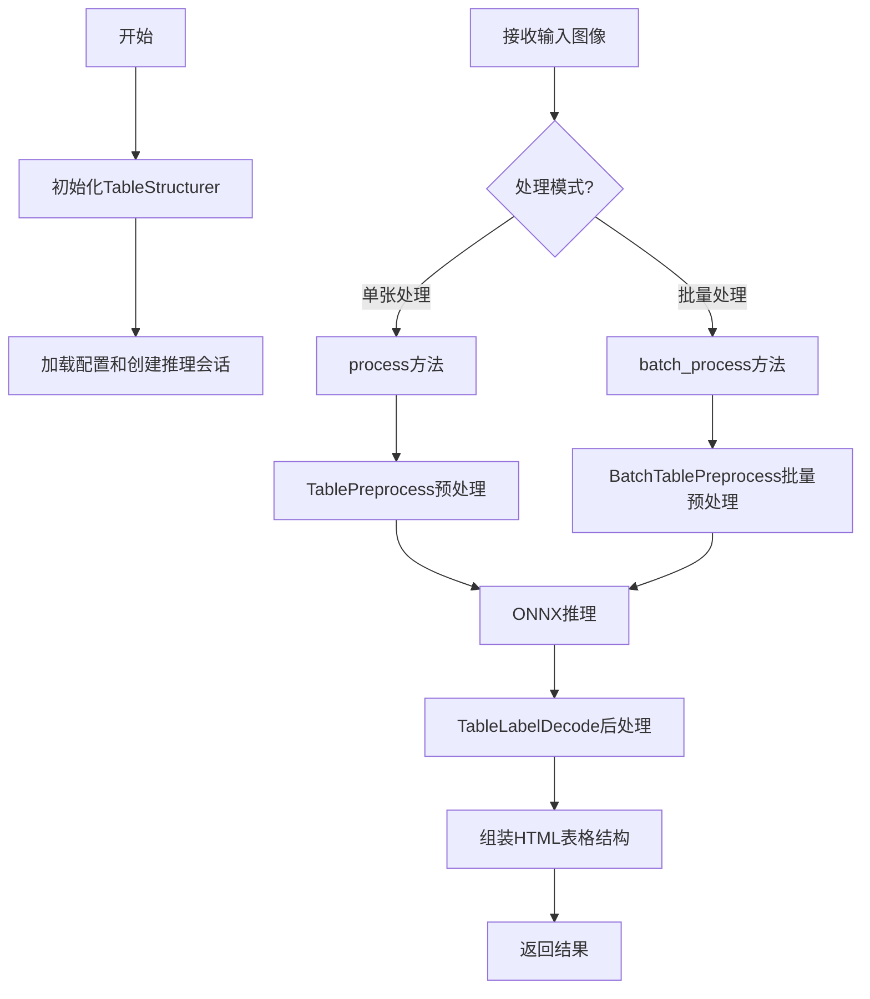
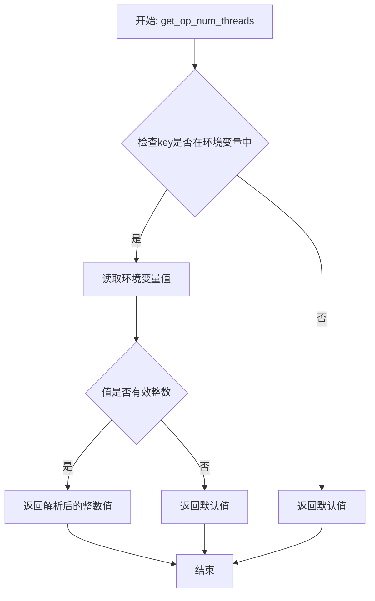
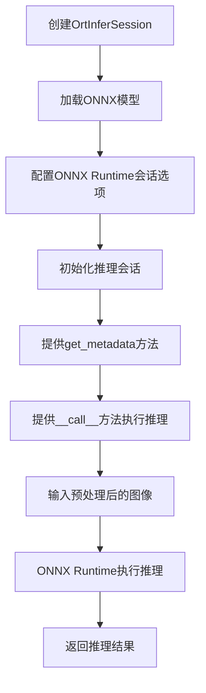
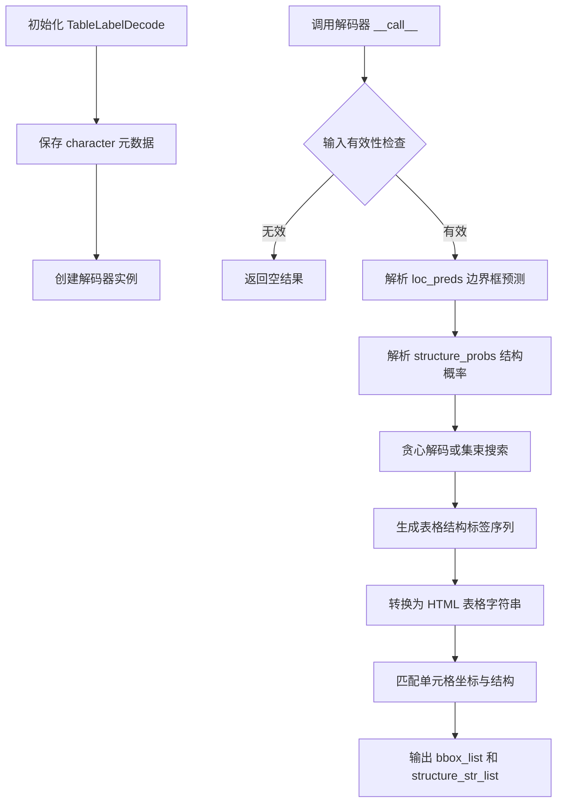
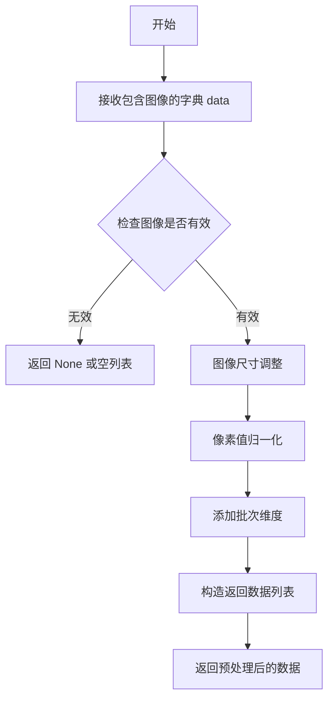
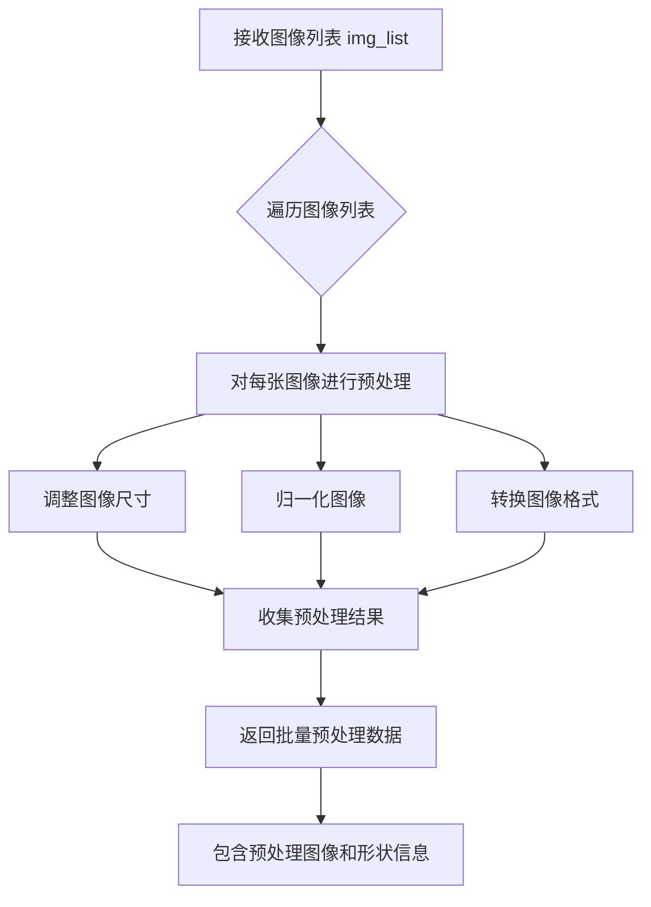
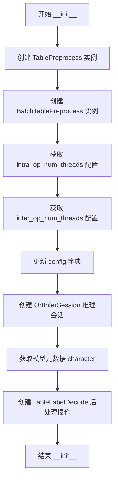
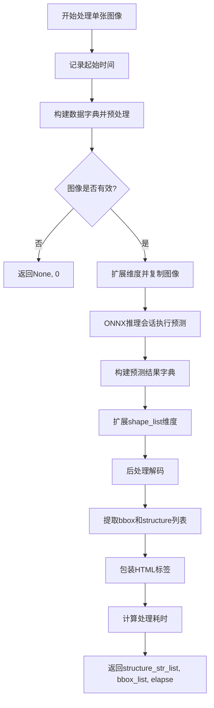

# `MinerU\mineru\model\table\rec\slanet_plus\table_structure.py` 详细设计文档

一个基于PaddlePaddle的表格结构识别模块，通过ONNX Runtime进行推理，将图像中的表格转换为HTML格式的表格结构，支持单张图像和批量处理两种模式。

## 整体流程



## 类结构

```
TableStructurer (表格结构识别器)
```

## 全局变量及字段


### `MINERU_INTRA_OP_NUM_THREADS`
    
环境变量键，用于获取内部操作线程数配置

类型：`str`
    


### `MINERU_INTER_OP_NUM_THREADS`
    
环境变量键，用于获取外部操作线程数配置

类型：`str`
    


### `TableStructurer.preprocess_op`
    
单张图像预处理操作，用于对输入图像进行预处理

类型：`TablePreprocess`
    


### `TableStructurer.batch_preprocess_op`
    
批量图像预处理操作，用于对批量输入图像进行预处理

类型：`BatchTablePreprocess`
    


### `TableStructurer.session`
    
ONNX推理会话，用于执行表格结构识别模型的推理

类型：`OrtInferSession`
    


### `TableStructurer.character`
    
模型元数据/字符集，存储表格识别所需的字符信息

类型：`Any`
    


### `TableStructurer.postprocess_op`
    
后处理操作，用于将模型输出解码为表格结构信息

类型：`TableLabelDecode`
    
    

## 全局函数及方法


### `get_op_num_threads`

获取操作线程数配置的全局函数，用于从环境变量或配置中读取线程数设置。

参数：

- `key`：`str`，环境变量或配置键的名称，如 `"MINERU_INTRA_OP_NUM_THREADS"` 或 `"MINERU_INTER_OP_NUM_THREADS"`

返回值：`int`，返回配置的操作线程数，如果未配置则返回默认值

#### 流程图



#### 带注释源码

```
# 从 mineru.utils.os_env_config 模块导入的全局函数
# 该函数用于获取操作线程数配置
# 参数 key: str - 环境变量或配置键的名称
# 返回值: int - 操作线程数配置值

# 在 TableStructurer 类中的使用示例：
# config["intra_op_num_threads"] = get_op_num_threads("MINERU_INTRA_OP_NUM_THREADS")
# config["inter_op_num_threads"] = get_op_num_threads("MINERU_INTER_OP_NUM_THREADS")

# 函数签名推断（基于调用方式）:
def get_op_num_threads(key: str) -> int:
    """
    获取操作线程数配置
    
    Args:
        key: 环境变量键名
        
    Returns:
        线程数配置值（整数）
    """
    # 实际实现需要查看 mineru.utils.os_env_config 模块源码
    pass
```

> **注意**：由于提供的代码片段中仅包含对该函数的使用（导入和调用），未包含函数的具体实现，因此无法提供完整的源代码。该函数的实际实现位于 `mineru.utils.os_env_config` 模块中。根据函数调用方式推断，其核心功能是从环境变量中读取指定键的值并转换为整数线程数配置。


### `OrtInferSession`

ONNX推理会话类，用于加载ONNX模型并执行推理操作。该类封装了ONNX Runtime的推理接口，提供模型元数据获取和批量推理功能。

参数：

-  `config`：`Dict[str, Any]`，包含ONNX Runtime推理配置，如线程数设置（intra_op_num_threads、inter_op_num_threads）等参数

返回值：`Any`，返回ONNX推理会话对象实例

#### 流程图



#### 带注释源码

```python
# 根据TableStructurer类中的使用方式推断的OrtInferSession类结构
# 实际定义在 mineru.utils.table_structure_utils 模块中

class OrtInferSession:
    """ONNX推理会话封装类"""
    
    def __init__(self, config: Dict[str, Any]):
        """初始化ONNX推理会话
        
        Args:
            config: 包含推理配置的字典，通常包括:
                - intra_op_num_threads: 内部操作线程数
                - inter_op_num_threads: 外部操作线程数
                - model_path: ONNX模型路径（隐含在配置中）
        """
        # 从配置中获取线程数配置
        intra_op_num_threads = config.get("intra_op_num_threads", 1)
        inter_op_num_threads = config.get("inter_op_num_threads", 1)
        
        # 配置ONNX Runtime会话选项
        sess_options = onnxruntime.SessionOptions()
        sess_options.intra_op_num_threads = intra_op_num_threads
        sess_options.inter_op_num_threads = inter_op_num_threads
        
        # 加载ONNX模型并创建推理会话
        # self.session = onnxruntime.InferenceSession(model_path, sess_options)
        pass
    
    def get_metadata(self) -> Dict[str, Any]:
        """获取模型的元数据信息
        
        Returns:
            包含模型元数据的字典，如字符集信息等
        """
        # 返回模型元数据
        # return self.session.get_modelmeta()
        pass
    
    def __call__(self, inputs: List[np.ndarray]) -> Tuple[np.ndarray, np.ndarray]:
        """执行ONNX模型推理
        
        Args:
            inputs: 预处理后的图像列表，通常为4D numpy数组 [batch, height, width, channels]
        
        Returns:
            Tuple[np.ndarray, np.ndarray]: 
                - 第一个元素为边界框预测结果 (bbox_preds)
                - 第二个元素为结构概率预测结果 (structure_probs)
        """
        # 执行推理
        # outputs = self.session.run(None, {input_name: inputs})
        # return outputs[0], outputs[1]
        pass
```

#### 使用示例

在 `TableStructurer` 类中的实际使用方式：

```python
class TableStructurer:
    def __init__(self, config: Dict[str, Any]):
        # ... 其他初始化代码 ...
        
        # 创建ONNX推理会话，传入包含线程配置的字典
        config["intra_op_num_threads"] = get_op_num_threads("MINERU_INTRA_OP_NUM_THREADS")
        config["inter_op_num_threads"] = get_op_num_threads("MINERU_INTER_OP_NUM_THREADS")
        
        self.session = OrtInferSession(config)
        
        # 获取模型元数据（通常包含字符集信息）
        self.character = self.session.get_metadata()
        
        # ... 其他初始化代码 ...
    
    def process(self, img):
        # ... 预处理代码 ...
        
        # 调用推理会话执行推理
        outputs = self.session([img])  # 输入为图像列表
        
        # outputs[0] -> loc_preds: 位置/边界框预测
        # outputs[1] -> structure_probs: 结构概率预测
        preds = {"loc_preds": outputs[0], "structure_probs": outputs[1]}
        
        # ... 后处理代码 ...
```

#### 关键信息说明

| 项目 | 说明 |
|------|------|
| **依赖模块** | onnxruntime, numpy |
| **配置文件键** | intra_op_num_threads, inter_op_num_threads |
| **推理输入** | List[np.ndarray]，通常为批量预处理的图像 |
| **推理输出** | Tuple[loc_preds, structure_probs]，分别表示位置预测和结构预测 |
| **元数据用途** | 获取模型支持的字符集等信息，用于后处理标签解码 |


### TableLabelDecode

表格标签解码类，负责将表格识别的模型输出（边界框预测和结构概率）解码为可读的表格结构字符串和单元格边界框。

参数：

- `character`：`Any`，从 ONNX Runtime 会话获取的元数据，包含表格标签的字符集信息

返回值：`Callable`，返回可调用对象，用于处理模型输出

#### 流程图



#### 带注释源码

```python
# TableLabelDecode 类定义位于 table_structure_utils 模块中
# 以下为根据使用方式推断的类结构

class TableLabelDecode:
    """表格标签解码器
    
    将表格识别模型的输出转换为结构化的表格 HTML 表示
    """
    
    def __init__(self, character: Any):
        """初始化解码器
        
        Args:
            character: 表格字符集元数据，来自模型会话
        """
        self.character = character
        # 存储字符到标签的映射关系
        self.label2id = {}
        self.id2label = {}
        # 初始化特殊标签（起始、结束、空白等）
        
    def __call__(self, preds: Dict[str, np.ndarray], shape_list: List[np.ndarray]) -> Dict[str, Any]:
        """执行解码
        
        Args:
            preds: 模型预测结果字典
                - loc_preds: 边界框预测，形状为 [batch, num_cells, 4]
                - structure_probs: 结构标签概率，形状为 [batch, seq_len, num_classes]
            shape_list: 原始图像尺寸列表，用于坐标反归一化
            
        Returns:
            解码结果字典
                - bbox_batch_list: 批次边界框列表
                - structure_batch_list: 批次结构字符串列表
        """
        # 1. 从 predictions 中提取边界框和结构概率
        loc_preds = preds.get('loc_preds')  # 形状: [batch, num_cells, 4]
        structure_probs = preds.get('structure_probs')  # 形状: [batch, seq_len, num_classes]
        
        # 2. 对结构标签进行贪心解码或集束搜索
        structure_str_list = self.decode_structure(structure_probs)
        
        # 3. 解析边界框坐标并进行后处理
        bbox_list = self.decode_bbox(loc_preds, shape_list)
        
        # 4. 组装返回结果
        return {
            'bbox_batch_list': [bbox_list],  # 包装为批次格式
            'structure_batch_list': [structure_str_list]
        }
    
    def decode_structure(self, structure_probs: np.ndarray) -> List[str]:
        """解码结构标签序列
        
        使用贪心解码或集束搜索策略，将概率转换为标签序列
        """
        # 提取概率最高的标签索引
        pred_idxs = np.argmax(structure_probs, axis=-1)
        
        # 将索引转换为标签字符串
        structure_strs = []
        for seq in pred_idxs:
            seq_strs = [self.id2label.get(idx, '') for idx in seq]
            # 过滤填充值和空白标签
            structure_strs.append(seq_strs)
            
        return structure_strs
    
    def decode_bbox(self, loc_preds: np.ndarray, shape_list: List[np.ndarray]) -> np.ndarray:
        """解码边界框
        
        Args:
            loc_preds: 边界框预测坐标
            shape_list: 原始图像尺寸列表
            
        Returns:
            解析后的边界框坐标数组
        """
        # 坐标反归一化到原始图像尺寸
        bbox_list = []
        for bbox, shape in zip(loc_preds, shape_list):
            # 使用 shape 信息进行坐标变换
            # ...
            bbox_list.append(bbox)
            
        return np.array(bbox_list)
```

#### 使用示例

在 `TableStructurer` 类中的调用方式：

```python
# 初始化
self.character = self.session.get_metadata()
self.postprocess_op = TableLabelDecode(self.character)

# 单张图像处理
post_result = self.postprocess_op(preds, [shape_list])
# preds = {"loc_preds": outputs[0], "structure_probs": outputs[1]}
# shape_list = np.expand_dims(data[-1], axis=0)

# 返回结果包含
# - post_result["bbox_batch_list"][0]: 单元格边界框列表
# - post_result["structure_batch_list"][0]: 表格结构字符串列表
```


### TablePreprocess

表格预处理类（从外部模块 `mineru.utils.table_structure_utils` 导入），负责对输入图像进行预处理，包括尺寸归一化、像素值归一化等操作，以便后续的表格结构识别模型进行推理。

参数：

-  `data`：`Dict[str, Any]`，包含图像数据的字典，必须包含键 "image"，值为待处理的图像数据（numpy.ndarray 格式）

返回值：`List[Any]`，预处理后的数据列表，通常包含处理后的图像数组和原始图像的shape信息

#### 流程图



#### 带注释源码

```python
# TablePreprocess 类定义位于 mineru.utils.table_structure_utils 模块中
# 以下为代码中的使用示例和推断的实现逻辑

from .table_structure_utils import (
    TablePreprocess,
    # ... 其他导入
)

class TableStructurer:
    def __init__(self, config: Dict[str, Any]):
        # 初始化 TablePreprocess 实例
        self.preprocess_op = TablePreprocess()
        
    def process(self, img):
        # 构建输入数据字典
        data = {"image": img}
        # 调用预处理操作
        data = self.preprocess_op(data)
        # 获取预处理后的图像
        img = data[0]
        if img is None:
            return None, 0
        # 扩展维度以匹配模型输入要求 [batch, height, width, channels]
        img = np.expand_dims(img, axis=0)
        img = img.copy()
        
        # 获取图像的shape信息用于后处理
        shape_list = np.expand_dims(data[-1], axis=0)
        
        # ... 后续推理和后处理逻辑
```

#### 补充说明

**外部依赖**：
- 该类定义在 `mineru.utils.table_structure_utils` 模块中
- 属于 PaddlePaddle 的表格识别工具库（mineru）

**使用场景**：
- `TableStructurer.process()` 方法：单张图像处理，输入为单张图像（numpy.ndarray）
- 输入图像通常为 BGR 或 RGB 格式的文档图像

**设计推测**：
- 预处理操作通常包括：图像resize、归一化、通道转换等
- 返回的 data 是一个列表，包含 `[预处理后的图像, shape信息, ...]`
- data[-1] 通常包含原始图像的宽高信息，用于后处理时恢复坐标


### `BatchTablePreprocess`

批量表格预处理类，用于对表格图像进行批量预处理操作，将原始图像列表转换为适合表格结构识别模型输入的格式。该类由外部模块导入，具体实现位于 `table_structure_utils` 模块中。

参数：

-  `img_list`：`List[np.ndarray]` ，待处理的图像列表，每个元素为一张图像的 numpy 数组表示

返回值：`Tuple[List[np.ndarray], List[np.ndarray]]` 或类似结构，返回批量预处理后的图像数据（第一个元素为预处理后的图像列表，第二个元素为对应的形状信息列表）

#### 流程图



#### 带注释源码

```python
# BatchTablePreprocess 类定义位于 from .table_structure_utils 导入
# 该类的使用方式在 TableStructurer 类中体现

# 在 TableStructurer.__init__ 中实例化
self.batch_preprocess_op = BatchTablePreprocess()

# 在 TableStructurer.batch_process 中调用
batch_data = self.batch_preprocess_op(img_list)  # img_list: List[np.ndarray]
preprocessed_images = batch_data[0]  # 预处理后的图像
shape_lists = batch_data[1]  # 图像形状信息列表
```

> **注意**：由于 `BatchTablePreprocess` 类由外部模块导入，其完整源码未在当前代码文件中提供。以上信息基于该类在 `TableStructurer` 类中的使用方式推断得出。具体实现细节需参考 `table_structure_utils` 模块的源码。


### `TableStructurer.__init__`

初始化表格结构识别器，创建表格识别所需的前处理、后处理操作以及推理会话。

参数：

- `self`：TableStructurer，类的实例本身
- `config`：Dict[str, Any]，配置字典，包含模型路径、线程数等推理配置

返回值：无（None），该方法为构造函数，不返回任何值

#### 流程图



#### 带注释源码

```
def __init__(self, config: Dict[str, Any]):
    """初始化表格结构识别器
    
    Args:
        config: 包含推理配置的字典，如模型路径、线程数等
    """
    # 1. 创建单张图像的预处理操作
    self.preprocess_op = TablePreprocess()
    
    # 2. 创建批量图像的预处理操作
    self.batch_preprocess_op = BatchTablePreprocess()

    # 3. 从环境变量获取 intra-op 线程数，配置 CPU 并行计算
    config["intra_op_num_threads"] = get_op_num_threads("MINERU_INTRA_OP_NUM_THREADS")
    
    # 4. 从环境变量获取 inter-op 线程数，配置 CPU 并行计算
    config["inter_op_num_threads"] = get_op_num_threads("MINERU_INTER_OP_NUM_THREADS")

    # 5. 创建 ONNX 推理会话，用于执行表格识别模型
    self.session = OrtInferSession(config)

    # 6. 从模型中获取元数据（字符表、标签映射等）
    self.character = self.session.get_metadata()
    
    # 7. 创建后处理操作，将模型输出解码为表格结构标签
    self.postprocess_op = TableLabelDecode(self.character)
```


### `TableStructurer.process`

处理单张图像并返回HTML表格结构字符串、表格单元格边界框坐标以及处理耗时。该方法首先对输入图像进行预处理，然后通过ONNX推理会话预测表格结构与位置信息，最后进行后处理解码生成标准的HTML表格字符串和对应的单元格边界框列表。

**参数：**

- `self`：`TableStructurer`，当前TableStructurer类的实例
- `img`：`np.ndarray`，输入的待处理图像数据，通常为三维数组（高度×宽度×通道数）

**返回值：** `Tuple[List[str], np.ndarray, float]`，返回一个三元组

- `structure_str_list`：`List[str]`，HTML表格结构字符串列表，包含`<html>`、`<body>`、`<table>`标签头部，表格内部结构标签，以及`</table>`、`</body>`、`</html>`闭合标签
- `bbox_list`：`np.ndarray`，表格单元格边界框坐标数组，形状为(n, 4)，每行为[x1, y1, x2, y2]格式
- `elapse`：`float`，整个处理流程耗时（秒）

#### 流程图



#### 带注释源码

```python
def process(self, img):
    """处理单张图像并返回HTML表格结构
    Args:
        img: 输入图像，numpy数组格式
    Returns:
        tuple: (structure_str_list, bbox_list, elapse)
            - structure_str_list: HTML表格结构字符串列表
            - bbox_list: 单元格边界框坐标数组
            - elapse: 处理耗时（秒）
    """
    # 1. 记录处理开始时间
    starttime = time.time()
    
    # 2. 构建输入数据字典，键为'image'，值为原始图像
    data = {"image": img}
    
    # 3. 执行预处理操作：图像归一化、Resize等
    data = self.preprocess_op(data)
    
    # 4. 获取预处理后的图像（可能在预处理中被置为None）
    img = data[0]
    
    # 5. 边界检查：若图像无效则提前返回
    if img is None:
        return None, 0
    
    # 6. 为批量推理扩展维度：从(H,W,C)变为(1,H,W,C)
    img = np.expand_dims(img, axis=0)
    
    # 7. 复制图像数据以避免后续操作影响原始数据
    img = img.copy()

    # 8. ONNX推理会话执行前向传播，返回预测结果
    # 输出包含：bbox预测和structure预测
    outputs = self.session([img])

    # 9. 整理预测结果为字典格式
    preds = {"loc_preds": outputs[0], "structure_probs": outputs[1]}

    # 10. 扩展shape_list维度以匹配批量处理格式
    shape_list = np.expand_dims(data[-1], axis=0)
    
    # 11. 执行后处理：将预测结果解码为表格结构和边界框
    post_result = self.postprocess_op(preds, [shape_list])

    # 12. 提取第一张图像的边界框列表
    bbox_list = post_result["bbox_batch_list"][0]

    # 13. 提取第一张图像的结构字符串列表
    structure_str_list = post_result["structure_batch_list"][0]
    
    # 14. 获取第一个元素的结构字符串（嵌套列表解包）
    structure_str_list = structure_str_list[0]
    
    # 15. 包装为完整的HTML表格文档结构
    structure_str_list = (
        ["<html>", "<body>", "<table>"]  # HTML头部标签
        + structure_str_list              # 表格内部结构
        + ["</table>", "</body>", "</html>"]  # HTML闭合标签
    )
    
    # 16. 计算总处理耗时
    elapse = time.time() - starttime
    
    # 17. 返回三元组：结构字符串、边界框、处理耗时
    return structure_str_list, bbox_list, elapse
```


### `TableStructurer.batch_process`

该方法是`TableStructurer`类的批量处理方法，用于一次性处理多张图像并返回每张图像的表格结构识别结果（HTML字符串、单元格边界框和推理耗时）。

参数：

- `img_list`：`List[np.ndarray]`，待处理的图像列表，每个元素为NumPy数组格式的图像数据

返回值：`List[Tuple[List[str], np.ndarray, float]]`，结果列表，其中每个元素为元组，包含：
- `List[str]`：表格的HTML结构字符串列表
- `np.ndarray`：单元格边界框坐标
- `float`：平均推理耗时（秒）

#### 流程图

```mermaid
flowchart TD
    A[开始 batch_process] --> B[记录开始时间 time.perf_counter]
    B --> C[调用 batch_preprocess_op 批量预处理图像]
    C --> D[获取预处理后的图像和shape列表]
    D --> E[将预处理图像转为NumPy数组]
    E --> F[调用 session 推理获取 bbox_preds 和 struct_probs]
    F --> G[从预处理结果获取 batch_size]
    G --> H[初始化空结果列表 results]
    H --> I[遍历索引 0 到 batch_size-1]
    I --> J{当前索引 < batch_size?}
    J -->|是| K[获取当前图像的 bbox_pred, struct_prob, shape_list]
    K --> L[构建 preds 字典并扩展维度]
    L --> M[调用 postprocess_op 后处理]
    M --> N[获取 bbox_list 和 structure_str_list]
    N --> O[取第一个元素 structure_str_list[0]]
    O --> P[拼接 HTML 标签: <html><body><table> + 内容 + </table></body></html>]
    P --> Q[构建结果元组并追加到 results]
    Q --> I
    J -->|否| R[计算总耗时 total_elapse]
    R --> S[计算平均耗时 total_elapse / batch_size]
    S --> T[更新所有结果的耗时为平均耗时]
    T --> U[返回结果列表]
```

#### 带注释源码

```python
def batch_process(
    self, img_list: List[np.ndarray]
) -> List[Tuple[List[str], np.ndarray, float]]:
    """批量处理图像列表
    Args:
        img_list: 图像列表
    Returns:
        结果列表，每个元素包含 (table_struct_str, cell_bboxes, elapse)
    """
    # 记录批量处理开始时间
    starttime = time.perf_counter()

    # ---------- 预处理阶段 ----------
    # 调用批量预处理操作处理图像列表，返回预处理后的图像和shape信息
    batch_data = self.batch_preprocess_op(img_list)
    preprocessed_images = batch_data[0]  # 预处理后的图像列表
    shape_lists = batch_data[1]           # 各图像的shape信息列表

    # 将预处理图像列表转换为NumPy数组，形成(batch_size, H, W, C)或(batch_size, C, H, W)的4D张量
    preprocessed_images = np.array(preprocessed_images)

    # ---------- 推理阶段 ----------
    # 调用ONNX推理会话进行批量推理，同时获取位置预测和结构概率
    bbox_preds, struct_probs = self.session([preprocessed_images])

    # 获取批次大小
    batch_size = preprocessed_images.shape[0]

    # ---------- 后处理阶段 ----------
    results = []
    # 遍历批次中的每个图像进行单独后处理
    for bbox_pred, struct_prob, shape_list in zip(
        bbox_preds, struct_probs, shape_lists
    ):
        # 构造预测结果字典，并扩展维度以匹配后处理输入格式
        preds = {
            "loc_preds": np.expand_dims(bbox_pred, axis=0),
            "structure_probs": np.expand_dims(struct_prob, axis=0),
        }
        # 扩展shape_list维度以匹配后处理输入格式
        shape_list = np.expand_dims(shape_list, axis=0)

        # 调用后处理操作解码预测结果
        post_result = self.postprocess_op(preds, [shape_list])

        # 提取边界框列表和结构字符串列表
        bbox_list = post_result["bbox_batch_list"][0]
        structure_str_list = post_result["structure_batch_list"][0]
        # 取第一个元素（第一行结构）
        structure_str_list = structure_str_list[0]

        # 包装HTML标签形成完整的表格HTML结构
        structure_str_list = (
            ["<html>", "<body>", "<table>"]
            + structure_str_list
            + ["</table>", "</body>", "</html>"]
        )

        # 注意：此处elapse设为0，实际耗时在后面统一计算
        results.append((structure_str_list, bbox_list, 0))

    # ---------- 耗时计算阶段 ----------
    # 计算总耗时
    total_elapse = time.perf_counter() - starttime

    # 将总耗时平均分配给每个图像，保持耗时一致性
    for i in range(len(results)):
        results[i] = (results[i][0], results[i][1], total_elapse / batch_size)

    # 返回批量处理结果列表
    return results
```

## 关键组件


### TableStructurer

表格结构化主类，负责协调预处理、推理和后处理流程，完成从表格图像到HTML结构的端到端转换。

### TablePreprocess

单张图像预处理操作，用于对输入的表格图像进行标准化和特征提取。

### BatchTablePreprocess

批量图像预处理操作，支持对多张表格图像进行批量标准化和特征提取，提高处理效率。

### OrtInferSession

ONNX推理会话管理器，负责加载ONNX模型并执行推理运算，获取表格定位和结构预测结果。

### TableLabelDecode

表格标签后处理解码器，将模型输出的概率预测转换为具体的表格结构和边界框信息。

### process 方法

单张图像处理入口，执行完整的表格结构识别流程：预处理→推理→后处理→结果组装，返回HTML表格字符串、单元格边界框和耗时。

### batch_process 方法

批量图像处理入口，支持并行处理多张表格图像，通过批推理提高吞吐量，返回结果列表。


## 问题及建议


### 已知问题

-   **时间计算方法不一致**：`process` 方法使用 `time.time()`，而 `batch_process` 方法使用 `time.perf_counter()`，这两种时间计算方式不一致，可能导致性能比较不准确。
-   **批量处理时间计算逻辑错误**：在 `batch_process` 方法中，循环内将每个结果的 `elapse` 设为 0，最后统一用总时间除以 batch_size，但这并非真实反映每张图像的处理时间，且 batch_process 的返回类型注解中 elapse 始终为 0（因为 `0` 是整数而非 float 类型）。
-   **代码重复**：构建 HTML 表格结构字符串的逻辑在 `process` 和 `batch_process` 方法中完全重复，可提取为私有方法。
-   **类型注解不完整**：`process` 方法的 `img` 参数缺少类型注解，返回类型也未明确声明。
-   **缺乏输入验证**：没有对输入的 `img` 和 `img_list` 进行有效性检查（如是否为 None、维度是否正确等）。
-   **异常处理缺失**：推理过程中没有异常捕获机制，若 ONNX Runtime 推理失败会导致整个程序崩溃。
-   **硬编码的前缀后缀**：HTML 标签 `<html>`, `<body>`, `<table>` 等硬编码在方法中，缺乏灵活性。
-   **潜在内存效率问题**：`batch_process` 中 `np.array(preprocessed_images)` 可能产生额外的内存拷贝，且对每个样本单独进行后处理未能充分利用批量优势。

### 优化建议

-   **统一时间计算方式**：统一使用 `time.perf_counter()` 或在注释中说明两者混用的原因。
-   **修复批量处理时间计算**：为每个样本单独记录处理时间，或明确文档说明返回的 elapse 为平均处理时间。
-   **提取公共方法**：将构建 HTML 结构的逻辑抽取为私有方法如 `_build_html_structure(structure_str_list)`。
-   **完善类型注解**：为 `process` 方法添加参数和返回类型注解，如 `def process(self, img: np.ndarray) -> Tuple[List[str], np.ndarray, float]:`。
-   **添加输入验证**：在方法入口处添加 `img is not None` 和维度检查。
-   **增加异常处理**：用 try-except 包裹推理调用，捕获并处理可能的异常。
-   **配置化 HTML 结构**：将 HTML 标签定义为类属性或配置文件，支持自定义输出格式。
-   **优化内存使用**：考虑就地操作或使用视图减少不必要的内存拷贝。


## 其它


### 设计目标与约束

本模块旨在实现高效的表格结构识别功能，支持单张图像和批量图像处理，将图像中的表格转换为HTML格式的表格结构，并输出单元格边界框。设计约束包括：1）依赖PaddlePaddle的ONNX Runtime推理引擎；2）需要预先配置模型元数据（character）；3）输入图像需符合预处理要求；4）输出格式固定为HTML表格字符串和numpy数组形式的边界框。

### 错误处理与异常设计

代码中的错误处理设计如下：1）图像预处理失败时返回`(None, 0)`；2）使用`try-except`捕获ONNX推理异常；3）空图像列表处理返回空列表；4）缺少配置参数时使用默认值。改进建议：增加详细的错误日志记录，区分不同类型的异常（如模型加载失败、推理超时、内存不足），提供可自定义的错误回调机制，以及对输入图像的格式和尺寸进行更严格的验证。

### 数据流与状态机

单张图像处理流程：输入图像→预处理（归一化、Resize）→推理会话（ONNX）→后处理（解析预测结果）→构建HTML表格结构→输出（结构字符串、边界框、耗时）。批量处理流程：批量预处理→批量推理→循环后处理→结果聚合→统一计时。状态转换：初始化状态（加载模型和配置）→就绪状态（可处理图像）→处理中状态（执行推理）→完成状态（返回结果）。

### 外部依赖与接口契约

核心依赖包括：1）`mineru.utils.os_env_config.get_op_num_threads`：获取线程池配置；2）`table_structure_utils.TablePreprocess`：图像预处理；3）`table_structure_utils.BatchTablePreprocess`：批量预处理；4）`table_structure_utils.TableLabelDecode`：后处理标签解码；5）`table_structure_utils.OrtInferSession`：ONNX推理会话。接口契约：1）`process(img)`接受numpy.ndarray类型图像，返回`(List[str], np.ndarray, float)`；2）`batch_process(img_list)`接受`List[np.ndarray]`，返回`List[Tuple[List[str], np.ndarray, float]]`；3）输入图像需为RGB格式，尺寸无严格限制但建议在合理范围内。

### 性能考量与优化空间

当前性能特点：1）使用ONNX Runtime进行推理，支持CPU多线程；2）批量处理时共享推理计算。优化空间：1）支持GPU推理（当前仅配置CPU线程）；2）异步处理机制，避免阻塞；3）结果缓存机制，减少重复推理；4）内存池管理，减少numpy数组拷贝；5）批量大小时的自适应调整策略；6）预处理和后处理的向量化优化。

### 线程安全与并发模型

当前实现为单线程同步调用，无并发保护。潜在问题：1）`self.session`推理会话非线程安全；2）成员变量`self.preprocess_op`等可能被并发访问修改。改进建议：1）使用线程本地存储（threading.local）隔离状态；2）推理会话使用锁保护或创建线程池；3）批量处理内部循环可考虑并行化（使用multiprocessing）；4）添加线程安全注释和使用指南。

### 资源管理与生命周期

资源管理要点：1）ONNX推理会话在对象销毁时自动释放；2）numpy数组由Python垃圾回收管理；3）临时变量（如`img.copy()`）可能增加内存峰值。改进建议：1）提供显式的`close()`或`__del__()`方法释放资源；2）使用上下文管理器（context manager）模式；3）监控内存使用，避免大图像导致OOM；4）配置推理会话的内存限制参数。

### 配置管理与扩展性

当前配置通过`Dict[str, Any]`传入，包含线程数配置。扩展方向：1）支持从配置文件加载配置；2）支持运行时动态调整参数（如阈值、置信度）；3）支持自定义预处理和后处理策略（插件机制）；4）支持多种输出格式（HTML、JSON、XML）；5）模型热更新机制。配置验证建议：增加配置Schema校验，确保必需参数存在且类型正确。

### 版本兼容性与平台支持

当前版本使用Python 3类型注解（`Any, Dict, List, Tuple`），需要Python 3.7+。平台依赖：1）ONNX Runtime跨平台支持（Linux/Windows/Mac）；2）numpy数组格式跨平台一致；3）需要确保ONNX Runtime版本与模型格式兼容。兼容性建议：1）明确Python和依赖库版本要求；2）测试不同操作系统上的行为一致性；3）提供Docker容器化部署方案。

### 测试策略与质量保障

建议测试覆盖：1）单元测试：各方法独立测试，预处理/后处理逻辑验证；2）集成测试：完整流程测试，比对输出与预期结果；3）性能测试：基准测试，批量处理吞吐量；4）边界测试：空输入、大图像、异常格式。测试数据建议：使用标准表格识别数据集（如PubTables-1M、SciTSR）进行验证。


    