# `MinerU\mineru\model\table\rec\slanet_plus\table_structure_utils.py` 详细设计文档

该文件实现了基于ONNX Runtime的表格识别推理框架，包括推理会话管理、表格标签解码、图像预处理及批量处理等功能，支持CPU、CUDA和DirectML多种执行提供者，用于PaddlePaddle表格识别模型的部署。

## 整体流程

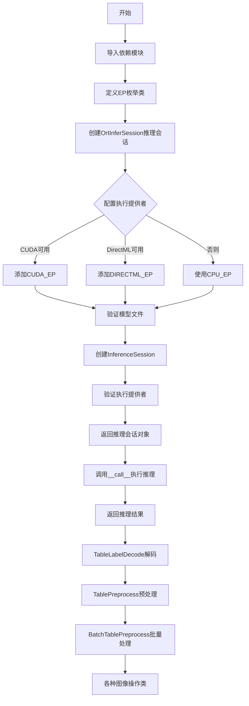

## 类结构

```
EP (枚举类)
├── CPU_EP
├── CUDA_EP
└── DIRECTML_EP

OrtInferSession (ONNX推理会话类)
├── _init_sess_opts
├── get_metadata
├── _get_ep_list
├── _check_cuda
├── _check_dml
├── _verify_providers
├── __call__
├── get_input_names
├── get_output_names
├── get_character_list
├── have_key
└── _verify_model

ONNXRuntimeError (异常类)

TableLabelDecode (表格标签解码类)
├── __init__
├── __call__
├── decode
├── decode_label
├── _bbox_decode
├── get_ignored_tokens
├── get_beg_end_flag_idx
└── add_special_char

TablePreprocess (表格预处理类)
├── __init__
├── __call__
├── create_operators
└── build_pre_process_list

BatchTablePreprocess (批量预处理类)
└── __call__

ResizeTableImage (图像缩放类)
└── __call__

PaddingTableImage (图像填充类)
└── __call__

NormalizeImage (图像归一化类)
└── __call__

ToCHWImage (图像通道转换类)
└── __call__

KeepKeys (键值保留类)
└── __call__

trans_char_ocr_res (全局函数)
```

## 全局变量及字段


### `logger`
    
loguru日志对象，用于记录程序运行日志

类型：`Logger`
    


### `EP`
    
ONNX Runtime执行提供者枚举类，包含CPU、CUDA和DirectML三种执行提供者

类型：`Enum`
    


### `EP.EP.CPU_EP`
    
CPU执行提供者枚举值，值为'CPUExecutionProvider'

类型：`str`
    


### `EP.EP.CUDA_EP`
    
CUDA执行提供者枚举值，值为'CUDAExecutionProvider'

类型：`str`
    


### `EP.EP.DIRECTML_EP`
    
DirectML执行提供者枚举值，值为'DmlExecutionProvider'

类型：`str`
    


### `OrtInferSession.logger`
    
loguru日志对象，用于记录推理会话的运行日志

类型：`Logger`
    


### `OrtInferSession.cfg_use_cuda`
    
配置中指定的是否使用CUDA进行推理的标志

类型：`bool`
    


### `OrtInferSession.cfg_use_dml`
    
配置中指定的是否使用DirectML进行推理的标志

类型：`bool`
    


### `OrtInferSession.had_providers`
    
当前环境中可用的ONNX Runtime执行提供者列表

类型：`List[str]`
    


### `OrtInferSession.session`
    
ONNX Runtime推理会话对象，用于执行模型推理

类型：`InferenceSession`
    


### `OrtInferSession.use_cuda`
    
实际是否使用CUDA执行推理的标志，经过环境检查后确定

类型：`bool`
    


### `OrtInferSession.use_directml`
    
实际是否使用DirectML执行推理的标志，经过环境检查后确定

类型：`bool`
    


### `TableLabelDecode.dict`
    
字符到索引的映射字典，用于将字符转换为模型可识别的索引

类型：`Dict[str, int]`
    


### `TableLabelDecode.character`
    
字符列表，包含所有可能的字符标签

类型：`List[str]`
    


### `TableLabelDecode.td_token`
    
HTML表格td标签的token列表，用于识别表格结构

类型：`List[str]`
    


### `TableLabelDecode.beg_str`
    
序列开始标记字符串，用于标识表格结构的起始

类型：`str`
    


### `TableLabelDecode.end_str`
    
序列结束标记字符串，用于标识表格结构的结束

类型：`str`
    


### `TablePreprocess.table_max_len`
    
表格图像预处理的最大边长尺寸

类型：`int`
    


### `TablePreprocess.pre_process_list`
    
预处理操作配置列表，定义了一系列图像预处理步骤

类型：`List[Dict]`
    


### `TablePreprocess.ops`
    
实际创建的预处理操作对象列表，用于执行具体的图像处理

类型：`List`
    


### `BatchTablePreprocess.preprocess`
    
表格图像预处理实例，用于批量处理前的单图预处理

类型：`TablePreprocess`
    


### `ResizeTableImage.max_len`
    
调整图像大小的目标最大边长

类型：`int`
    


### `ResizeTableImage.resize_bboxes`
    
是否同时调整边界框大小的标志

类型：`bool`
    


### `ResizeTableImage.infer_mode`
    
是否为推理模式的标志，影响图像处理逻辑

类型：`bool`
    


### `PaddingTableImage.size`
    
图像填充的目标尺寸，格式为(高度, 宽度)

类型：`Tuple[int, int]`
    


### `NormalizeImage.scale`
    
图像像素值的缩放因子

类型：`np.ndarray`
    


### `NormalizeImage.mean`
    
图像均值，用于归一化处理

类型：`np.ndarray`
    


### `NormalizeImage.std`
    
图像标准差，用于归一化处理

类型：`np.ndarray`
    


### `KeepKeys.keep_keys`
    
需要保留的数据键列表，用于筛选数据字典中的特定字段

类型：`List[str]`
    
    

## 全局函数及方法


### `trans_char_ocr_res`

该函数用于将PaddleOCR的文本行级别识别结果转换为单词级别（word-level）的结果格式，提取每个单词的边界框、文本内容以及对应的置信度分数，便于后续表格结构识别等任务使用。

参数：

- `ocr_res`：`List`，PaddleOCR的识别结果列表，每个元素包含文本行信息及单词级别的检测框和文本

返回值：`List`，转换后的单词结果列表，每个元素为 `[word_box, word, score]`

#### 流程图

```mermaid
flowchart TD
    A[开始: trans_char_ocr_res] --> B[初始化空列表 word_result]
    B --> C[遍历 ocr_res 中的每个 res]
    C --> D[提取分数: score = res[2]]
    D --> E[遍历 res[3] 和 res[4] 的zip结果]
    E --> F[构建 word_res = [word_box, word, score]]
    F --> G[将 word_res 添加到 word_result]
    G --> H{是否还有更多res}
    H -->|是| C
    H -->|否| I[返回 word_result]
    I --> J[结束]
```

#### 带注释源码

```python
def trans_char_ocr_res(ocr_res):
    """将OCR识别结果转换为单词级别结果
    
    Args:
        ocr_res: PaddleOCR的识别结果列表，结构如下:
            - res[0]: 识别到的文本内容
            - res[1]: 文本行级别的置信度
            - res[2]: 文本行分数（当前代码中使用的是res[2]，但实际应该是行置信度）
            - res[3]: 单词级别边界框列表
            - res[4]: 单词级别文本列表
    
    Returns:
        word_result: 单词级别结果列表，每个元素包含:
            - word_box: 单词的边界框坐标
            - word: 单词文本内容
            - score: 对应的置信度分数
    """
    # 初始化结果列表
    word_result = []
    
    # 遍历OCR结果中的每一行
    for res in ocr_res:
        # 提取当前文本行的置信度分数
        score = res[2]
        
        # 遍历当前行中的每个单词（边界框和文本配对）
        for word_box, word in zip(res[3], res[4]):
            # 构建单词级结果 [边界框, 单词, 分数]
            word_res = []
            word_res.append(word_box)  # 单词边界框
            word_res.append(word)       # 单词文本
            word_res.append(score)      # 置信度分数
            
            # 添加到结果列表
            word_result.append(word_res)
    
    # 返回单词级结果列表
    return word_result
```


### `OrtInferSession._init_sess_opts`

该方法是一个静态方法，用于初始化 ONNX Runtime 的会话选项（SessionOptions），配置日志级别、内存优化、图优化以及线程池参数，以满足不同的推理性能和资源控制需求。

参数：

- `config`：`Dict[str, Any]`，包含推理会话配置信息的字典，可能包含 `intra_op_num_threads`（操作内并行线程数）和 `inter_op_num_threads`（操作间并行线程数）等配置项

返回值：`SessionOptions`，返回配置完成后的 ONNX Runtime 会话选项对象

#### 流程图

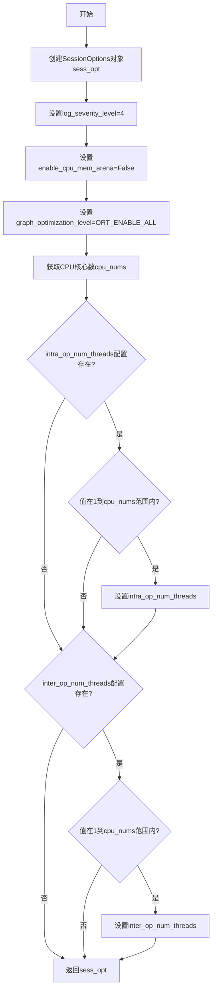

#### 带注释源码

```python
@staticmethod
def _init_sess_opts(config: Dict[str, Any]) -> SessionOptions:
    """初始化ONNX Runtime推理会话选项
    
    Args:
        config: 包含会话配置信息的字典，可能包含以下键:
                - intra_op_num_threads: 操作内并行线程数
                - inter_op_num_threads: 操作间并行线程数
    
    Returns:
        配置完成的SessionOptions对象
    """
    # 创建会话选项对象
    sess_opt = SessionOptions()
    
    # 设置日志严重性级别为4（仅输出致命错误）
    # 级别范围0-7，0=verbose, 4=warning
    sess_opt.log_severity_level = 4
    
    # 禁用CPU内存池以提高内存使用透明度
    # 禁用后内存分配更精确但可能影响性能
    sess_opt.enable_cpu_mem_arena = False
    
    # 启用所有图优化级别
    # 包括常量折叠、节点融合、冗余节点消除等优化
    sess_opt.graph_optimization_level = GraphOptimizationLevel.ORT_ENABLE_ALL

    # 获取系统CPU核心数
    cpu_nums = os.cpu_count()
    
    # 从配置中获取操作内并行线程数，默认为-1（使用ONNX Runtime默认值）
    intra_op_num_threads = config.get("intra_op_num_threads", -1)
    
    # 检查配置值是否在有效范围内[1, cpu_nums]
    if intra_op_num_threads != -1 and 1 <= intra_op_num_threads <= cpu_nums:
        sess_opt.intra_op_num_threads = intra_op_num_threads

    # 从配置中获取操作间并行线程数，默认为-1
    inter_op_num_threads = config.get("inter_op_num_threads", -1)
    
    # 检查配置值是否在有效范围内[1, cpu_nums]
    if inter_op_num_threads != -1 and 1 <= inter_op_num_threads <= cpu_nums:
        sess_opt.inter_op_num_threads = inter_op_num_threads

    # 返回配置好的会话选项对象
    return sess_opt
```


### `OrtInferSession.get_metadata`

该方法从ONNX模型的元数据（custom_metadata_map）中获取指定键对应的值，并将值按换行符分割成字符串列表返回。

参数：

- `key`：`str`，元数据键名，默认为 `"character"`，用于从模型的 custom_metadata_map 中获取对应的元数据值。

返回值：`list`，返回按换行符分割后的字符串列表。

#### 流程图

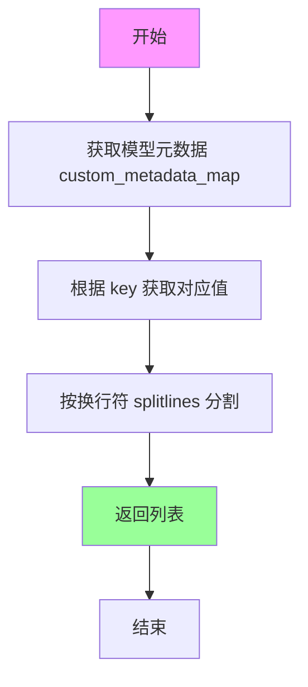

#### 带注释源码

```python
def get_metadata(self, key: str = "character") -> list:
    """
    从ONNX模型的元数据中获取指定键对应的值，并以列表形式返回。
    
    Args:
        key: str，元数据键名，默认为 "character"。用于从模型的
             custom_metadata_map 中获取对应的元数据值。
    
    Returns:
        list: 按换行符分割后的字符串列表。
    """
    # 获取模型的元数据字典 custom_metadata_map
    # 这是 ONNX Runtime 提供的模型元数据接口
    meta_dict = self.session.get_modelmeta().custom_metadata_map
    
    # 根据传入的 key 获取对应的元数据值（字符串）
    # 然后按换行符分割成列表返回
    content_list = meta_dict[key].splitlines()
    
    return content_list
```


### `OrtInferSession._get_ep_list`

该方法根据当前系统环境动态生成ONNX Runtime的推理执行提供者（Execution Provider）列表，按照优先级排序：优先使用GPU加速（CUDA或DirectML），其次回退到CPU推理，确保推理引擎能够在不同硬件平台上自动选择最优的执行后端。

参数： 无（仅使用实例属性 `self.cfg_use_cuda`、`self.cfg_use_dml`、`self.had_providers`）

返回值：`List[Tuple[str, Dict[str, Any]]]`，返回由执行提供者名称和对应配置选项组成的元组列表，每个元组包含提供者的字符串标识符及其配置参数字典。

#### 流程图

```mermaid
flowchart TD
    A[开始 _get_ep_list] --> B[创建 CPU 提供者选项<br/>arena_extend_strategy: kSameAsRequested]
    B --> C[初始化 EP_list 为 [(CPU_EP, cpu_provider_opts)]]
    C --> D[创建 CUDA 提供者选项<br/>device_id: 0, cudnn_conv_algo_search: EXHAUSTIVE]
    D --> E{_check_cuda 是否返回 True]
    E -->|是| F[将 CUDA 提供者插入 EP_list 头部]
    E -->|否| G[跳过 CUDA]
    F --> H{_check_dml 是否返回 True]
    G --> H
    H -->|是| I[记录日志: Windows 10+ 检测到<br/>尝试使用 DirectML]
    I --> J{use_cuda 是否为 True]
    J -->|是| K[使用 cuda_provider_opts]
    J -->|否| L[使用 cpu_provider_opts]
    K --> M[将 DirectML 提供者插入 EP_list 头部]
    L --> M
    H -->|否| N[跳过 DirectML]
    M --> O[返回 EP_list]
    N --> O
```

#### 带注释源码

```python
def _get_ep_list(self) -> List[Tuple[str, Dict[str, Any]]]:
    """
    根据系统环境动态生成 ONNX Runtime 执行提供者列表
    优先级: DirectML > CUDA > CPU
    """
    # 步骤1: 创建 CPU 执行提供者选项配置
    # arena_extend_strategy 设置为 kSameAsRequested 表示内存扩展策略尽量匹配请求
    cpu_provider_opts = {
        "arena_extend_strategy": "kSameAsRequested",
    }
    # 默认将 CPU 作为兜底执行提供者
    EP_list = [(EP.CPU_EP.value, cpu_provider_opts)]

    # 步骤2: 创建 CUDA 执行提供者选项配置
    # device_id: 指定使用第0号GPU设备
    # arena_extend_strategy: kNextPowerOfTwo 表示内存按2的幂次扩展
    # cudnn_conv_algo_search: EXHAUSTIVE 表示穷举搜索最优卷积算法
    # do_copy_in_default_stream: True 表示在默认流中执行数据拷贝
    cuda_provider_opts = {
        "device_id": 0,
        "arena_extend_strategy": "kNextPowerOfTwo",
        "cudnn_conv_algo_search": "EXHAUSTIVE",
        "do_copy_in_default_stream": True,
    }
    
    # 步骤3: 检查 CUDA 可用性
    # 调用 _check_cuda 方法验证 CUDA 是否可用
    self.use_cuda = self._check_cuda()
    # 如果 CUDA 可用，将其插入列表头部（高优先级）
    if self.use_cuda:
        EP_list.insert(0, (EP.CUDA_EP.value, cuda_provider_opts))

    # 步骤4: 检查 DirectML 可用性
    self.use_directml = self._check_dml()
    if self.use_directml:
        # 记录日志：当前系统为 Windows 10 及以上，尝试使用 DirectML
        self.logger.info(
            "Windows 10 or above detected, try to use DirectML as primary provider"
        )
        # 根据是否有 CUDA 支持选择对应的配置选项
        # 如果有 CUDA 则复用其配置，否则使用 CPU 配置
        directml_options = (
            cuda_provider_opts if self.use_cuda else cpu_provider_opts
        )
        # 将 DirectML 插入列表头部（最高优先级）
        EP_list.insert(0, (EP.DIRECTML_EP.value, directml_options))
    
    # 步骤5: 返回最终的执行提供者列表
    return EP_list
```


### `OrtInferSession._check_cuda`

检查当前环境是否支持CUDA执行提供者，如果支持则返回True，否则返回False并记录警告信息。

参数：

- `self`：隐式参数，Or

返回值：`bool`，表示CUDA是否可用

#### 流程图

```mermaid
flowchart TD
    A[开始 _check_cuda] --> B{cfg_use_cuda 是否为 True?}
    B -->|否| C[返回 False]
    B -->|是| D[获取当前设备 get_device]
    E{cur_device == "GPU" 且<br/>CUDA_EP 在 had_providers 中?}
    D --> E
    E -->|是| F[返回 True]
    E -->|否| G[记录警告日志]
    G --> H[记录推荐操作指南]
    H --> I[返回 False]
```

#### 带注释源码

```python
def _check_cuda(self) -> bool:
    """
    检查CUDA执行提供者是否可用
    
    返回:
        bool: CUDA是否可用
    """
    # 如果配置中未启用CUDA，直接返回False
    if not self.cfg_use_cuda:
        return False

    # 获取当前设备类型（CPU或GPU）
    cur_device = get_device()
    # 检查当前设备是否为GPU且CUDA执行提供者已在可用提供者列表中
    if cur_device == "GPU" and EP.CUDA_EP.value in self.had_providers:
        return True

    # 记录警告信息：CUDA不可用，使用默认推理
    self.logger.warning(
        "%s is not in available providers (%s). Use %s inference by default.",
        EP.CUDA_EP.value,
        self.had_providers,
        self.had_providers[0],
    )
    
    # 记录推荐使用rapidocr_paddle进行GPU推理
    self.logger.info("!!!Recommend to use rapidocr_paddle for inference on GPU.")
    
    # 记录如何启用GPU加速的详细步骤
    self.logger.info(
        "(For reference only) If you want to use GPU acceleration, you must do:"
    )
    self.logger.info(
        "First, uninstall all onnxruntime pakcages in current environment."
    )
    self.logger.info(
        "Second, install onnxruntime-gpu by `pip install onnxruntime-gpu`."
    )
    self.logger.info(
        "\tNote the onnxruntime-gpu version must match your cuda and cudnn version."
    )
    self.logger.info(
        "\tYou can refer this link: https://onnxruntime.ai/docs/execution-providers/CUDA-EP.html"
    )
    self.logger.info(
        "Third, ensure %s is in available providers list. e.g. ['CUDAExecutionProvider', 'CPUExecutionProvider']",
        EP.CUDA_EP.value,
    )
    
    # CUDA不可用，返回False
    return False
```


### `OrtInferSession._check_dml`

检查当前环境是否支持 DirectML（DirectX Machine Learning）执行提供程序，用于在 Windows 上启用 GPU 加速推理。

参数：无（仅使用实例属性 `self`）

返回值：`bool`，返回 True 表示 DirectML 可用并可以使用，返回 False 表示 DirectML 不可用或不支持

#### 流程图

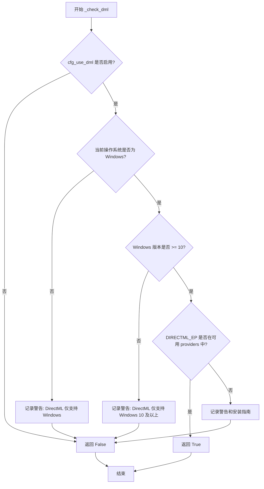

#### 带注释源码

```python
def _check_dml(self) -> bool:
    """
    检查当前环境是否支持 DirectML（DirectX Machine Learning）执行提供程序。
    DirectML 是 Windows 平台上的 GPU 加速推理解决方案。

    Returns:
        bool: 如果 DirectML 可用则返回 True，否则返回 False
    """
    # 检查配置中是否启用了 DirectML
    if not self.cfg_use_dml:
        return False

    # 获取当前操作系统名称
    cur_os = platform.system()
    # DirectML 仅支持 Windows 操作系统
    if cur_os != "Windows":
        self.logger.warning(
            "DirectML is only supported in Windows OS. The current OS is %s. Use %s inference by default.",
            cur_os,
            self.had_providers[0],
        )
        return False

    # 获取 Windows 版本号（取主版本号）
    cur_window_version = int(platform.release().split(".")[0])
    # DirectML 仅支持 Windows 10 及以上版本
    if cur_window_version < 10:
        self.logger.warning(
            "DirectML is only supported in Windows 10 and above OS. The current Windows version is %s. Use %s inference by default.",
            cur_window_version,
            self.had_providers[0],
        )
        return False

    # 检查 DirectML 执行提供程序是否在可用的 ONNX Runtime providers 列表中
    if EP.DIRECTML_EP.value in self.had_providers:
        return True

    # DirectML 不在可用 providers 中，记录警告信息并提供安装指南
    self.logger.warning(
        "%s is not in available providers (%s). Use %s inference by default.",
        EP.DIRECTML_EP.value,
        self.had_providers,
        self.had_providers[0],
    )
    self.logger.info("If you want to use DirectML acceleration, you must do:")
    self.logger.info(
        "First, uninstall all onnxruntime pakcages in current environment."
    )
    self.logger.info(
        "Second, install onnxruntime-directml by `pip install onnxruntime-directml`"
    )
    self.logger.info(
        "Third, ensure %s is in available providers list. e.g. ['DmlExecutionProvider', 'CPUExecutionProvider']",
        EP.DIRECTML_EP.value,
    )
    return False
```


### `OrtInferSession._verify_providers`

该方法用于验证 ONNX Runtime 推理会话实际使用的执行提供者（Execution Provider）是否与预期配置一致。如果用户配置了 CUDA 或 DirectML 执行提供者，但实际运行时因环境限制无法使用该提供者，该方法会记录警告日志，提示推理自动切换到了其他可用的执行提供者。

参数：

- `self`：`OrtInferSession` 实例本身，无需显式传递

返回值：`None`，该方法无返回值，仅执行日志输出和状态验证

#### 流程图

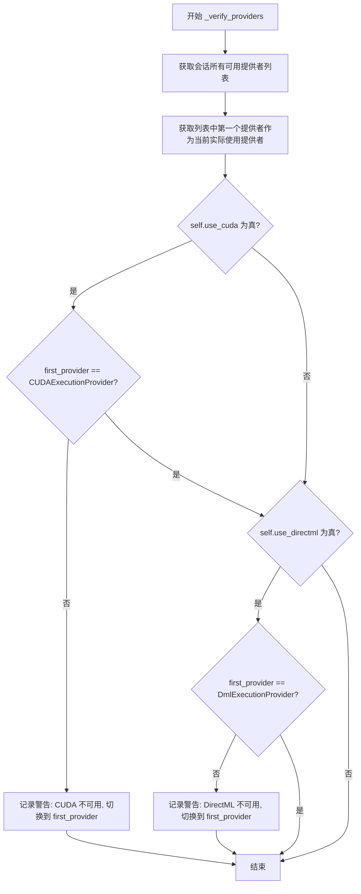

#### 带注释源码

```python
def _verify_providers(self):
    """
    验证当前会话实际使用的执行提供者是否与配置意图一致。
    如果请求的提供者不可用，记录警告日志并说明实际使用的提供者。
    """
    # 获取当前 ONNX Runtime 会话的所有可用提供者列表
    # 返回格式示例: ['CUDAExecutionProvider', 'CPUExecutionProvider']
    session_providers = self.session.get_providers()
    
    # 取列表中第一个元素作为实际用于推理的提供者
    # ONNX Runtime 会按照列表顺序选择第一个可用的提供者
    first_provider = session_providers[0]

    # 检查 CUDA 配置：若用户请求使用 CUDA 但实际未采用 CUDA 执行
    if self.use_cuda and first_provider != EP.CUDA_EP.value:
        self.logger.warning(
            "%s is not avaiable for current env, the inference part is automatically shifted to be executed under %s.",
            EP.CUDA_EP.value,
            first_provider,
        )

    # 检查 DirectML 配置：若用户请求使用 DirectML 但实际未采用 DirectML 执行
    if self.use_directml and first_provider != EP.DIRECTML_EP.value:
        self.logger.warning(
            "%s is not available for current env, the inference part is automatically shifted to be executed under %s.",
            EP.DIRECTML_EP.value,
            first_provider,
        )
```


### `OrtInferSession.__call__`

这是一个调用方法，使得 `OrtInferSession` 实例可以像函数一样被调用，接受预处理后的图像数据列表，通过 ONNX Runtime 执行模型推理并返回预测结果。

参数：

- `input_content`：`List[np.ndarray]`，输入的图像数据列表，每个元素是一个包含图像数据的 numpy 数组

返回值：`np.ndarray`，模型推理的输出结果，通常是预测的类别概率、边界框坐标等

#### 流程图

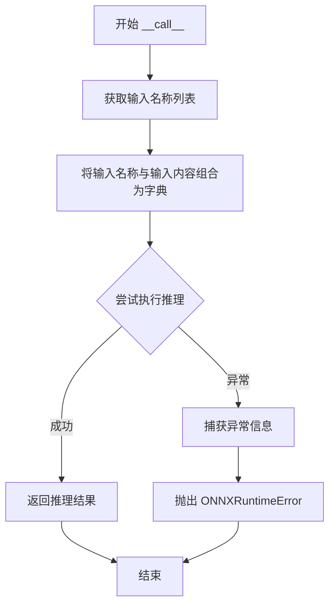

#### 带注释源码

```python
def __call__(self, input_content: List[np.ndarray]) -> np.ndarray:
    # 将输入名称列表与输入内容列表配对为字典
    # 例如: {'input': array1, 'input:1': array2}
    input_dict = dict(zip(self.get_input_names(), input_content))
    try:
        # 执行 ONNX Runtime 推理
        # 第一个参数 None 表示获取所有输出节点的结果
        # 第二个参数是输入数据的字典
        return self.session.run(None, input_dict)
    except Exception as e:
        # 捕获推理过程中的异常
        # 使用 traceback 获取完整的错误堆栈信息
        error_info = traceback.format_exc()
        # 重新抛出自定义的 ONNXRuntimeError，保留原始异常信息
        raise ONNXRuntimeError(error_info) from e
```


### `OrtInferSession.get_input_names`

该方法用于获取ONNX模型的输入张量名称列表，通过调用ONNX Runtime推理会话的get_inputs方法并提取每个输入张量的名称来实现。

参数： 无（仅包含隐式参数self）

返回值：`List[str]`，模型所有输入张量的名称列表

#### 流程图

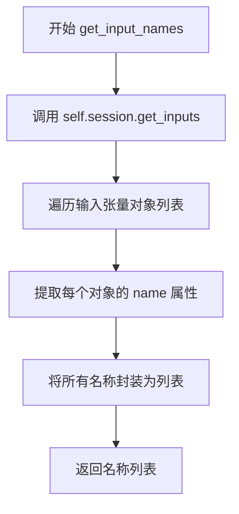

#### 带注释源码

```python
def get_input_names(self) -> List[str]:
    """获取ONNX模型的输入张量名称列表
    
    该方法通过ONNX Runtime的InferenceSession对象获取模型的输入信息，
    并从中提取每个输入张量的名称，用于构建推理时的输入字典。
    
    Returns:
        List[str]: 模型所有输入张量的名称列表，例如 ['input1', 'input2', ...]
    
    Example:
        >>> session = OrtInferSession(config)
        >>> input_names = session.get_input_names()
        >>> print(input_names)
        ['x', 'scale', 'stride', 'padding']
    """
    # 调用session的get_inputs方法获取输入张量对象的迭代器
    # get_inputs() 返回一个列表，元素为 Input对象，每个对象包含 name、type、shape 等属性
    # 使用列表推导式提取所有输入张量的名称
    return [v.name for v in self.session.get_inputs()]
    # v.name 即为每个输入张量的字符串名称
```


### `OrtInferSession.get_output_names`

获取ONNX Runtime推理会话模型的输出张量名称列表

参数：
- 无（仅包含 self 参数）

返回值：`List[str]`，返回模型所有输出张量的名称列表

#### 流程图

```mermaid
flowchart TD
    A[调用 get_output_names] --> B[调用 self.session.get_outputs]
    B --> C[遍历所有输出节点]
    C --> D[提取每个节点的 name 属性]
    D --> E[构建名称列表]
    E --> F[返回 List[str]]
```

#### 带注释源码

```python
def get_output_names(self) -> List[str]:
    """
    获取ONNX模型的输出张量名称列表
    
    Returns:
        List[str]: 模型所有输出张量的名称列表
    """
    # 调用onnxruntime InferenceSession的get_outputs方法获取所有输出节点
    # 然后提取每个输出节点的name属性组成列表并返回
    return [v.name for v in self.session.get_outputs()]
```

---

### 关联信息

#### 所属类：OrtInferSession

| 字段/方法 | 类型 | 描述 |
|-----------|------|------|
| `session` | InferenceSession | ONNX Runtime推理会话对象 |
| `get_input_names()` | List[str] | 获取输入张量名称列表 |
| `get_output_names()` | List[str] | 获取输出张量名称列表 |
| `__call__()` | np.ndarray | 执行推理的主方法 |

#### 与其他方法的关系

- `get_input_names()`：功能类似，但获取的是输入张量名称而非输出
- `__call__()`：在执行推理时需要通过 `get_output_names()` 确定输出结构

#### 潜在优化空间

1. **结果缓存**：该方法每次调用都会访问onnxruntime会话并遍历输出节点，如果模型输出固定，可考虑缓存结果
2. **异常处理**：目前无异常处理，若session为None或模型元数据不可访问会直接抛出异常


### `OrtInferSession.get_character_list`

该方法从ONNX模型的元数据中获取自定义的字符列表信息，通过指定的键名从模型的custom_metadata_map中检索数据，并将按换行符分割的字符串列表返回。

参数：

- `key`：`str`，可选参数，默认为"character"，指定要获取的元数据键名

返回值：`List[str]`，返回从模型元数据中获取的字符列表，列表中的每个元素对应元数据中按换行符分割的一行内容

#### 流程图

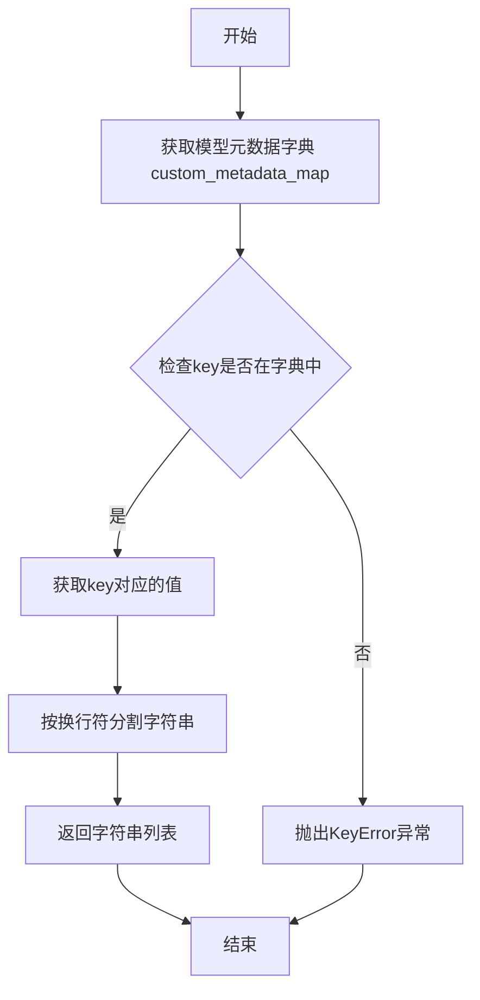

#### 带注释源码

```python
def get_character_list(self, key: str = "character") -> List[str]:
    """
    从ONNX模型的元数据中获取字符列表
    
    参数:
        key: str, 默认为"character", 要获取的元数据键名
    
    返回:
        List[str]: 按行分割的字符串列表
    """
    # 获取模型的元数据字典，包含自定义键值对
    meta_dict = self.session.get_modelmeta().custom_metadata_map
    
    # 根据指定的key获取对应的值，并按换行符分割成列表返回
    return meta_dict[key].splitlines()
```


### `OrtInferSession.have_key`

检查ONNX模型的元数据中是否存在指定的键

参数：

- `key`：`str`，要检查的元数据键名，默认为 "character"

返回值：`bool`，如果元数据中存在指定的键则返回 `True`，否则返回 `False`

#### 流程图

```mermaid
flowchart TD
    A[开始 have_key] --> B[获取模型元数据字典]
    B --> C{key 是否在 meta_dict.keys() 中?}
    C -->|是| D[返回 True]
    C -->|否| E[返回 False]
    D --> F[结束]
    E --> F
```

#### 带注释源码

```python
def have_key(self, key: str = "character") -> bool:
    """检查ONNX模型的元数据中是否存在指定的键
    
    Args:
        key: 要检查的元数据键名，默认为 "character"
             该参数用于指定需要查询的模型元数据键
    
    Returns:
        bool: 如果元数据中存在指定的键返回 True，否则返回 False
    """
    # 获取ONNX模型的元数据字典
    # custom_metadata_map 是一个字典，包含了模型的自定义元数据信息
    meta_dict = self.session.get_modelmeta().custom_metadata_map
    
    # 检查指定的 key 是否存在于元数据字典的键集合中
    if key in meta_dict.keys():
        # 键存在，返回 True
        return True
    # 键不存在，返回 False
    return False
```


### `OrtInferSession._verify_model`

这是一个静态方法，用于验证模型路径的有效性，确保模型文件存在且为合法文件。

参数：

- `model_path`：`Union[str, Path, None]`，待验证的模型路径，可以是字符串、Path 对象或 None

返回值：`None`，该方法不返回任何值，仅通过异常处理验证模型路径的合法性

#### 流程图

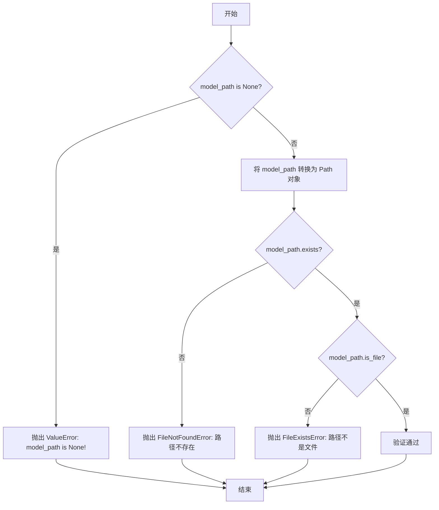

#### 带注释源码

```python
@staticmethod
def _verify_model(model_path: Union[str, Path, None]):
    """验证模型路径的有效性
    
    Args:
        model_path: 模型文件路径，支持 str、Path 或 None
        
    Raises:
        ValueError: 当 model_path 为 None 时抛出
        FileNotFoundError: 当模型文件路径不存在时抛出
        FileExistsError: 当模型路径存在但不是文件时抛出
    """
    # 检查 model_path 是否为 None
    if model_path is None:
        raise ValueError("model_path is None!")

    # 将 model_path 转换为 Path 对象以便使用 Path 的方法
    model_path = Path(model_path)
    
    # 检查模型文件路径是否存在
    if not model_path.exists():
        raise FileNotFoundError(f"{model_path} does not exists.")

    # 检查路径是否为文件（而非目录）
    if not model_path.is_file():
        raise FileExistsError(f"{model_path} is not a file.")
```


### `TableLabelDecode.__init__`

这是 `TableLabelDecode` 类的构造函数，负责初始化表格标签解码器的字符映射表、特殊标记和配置参数。

参数：

- `dict_character`：`List[str]`，字符字典列表，包含所有可能的字符标签
- `merge_no_span_structure`：`bool`，是否合并无跨列结构，默认为 True
- `**kwargs`：任意关键字参数，用于扩展配置

返回值：`None`，构造函数无返回值

#### 流程图

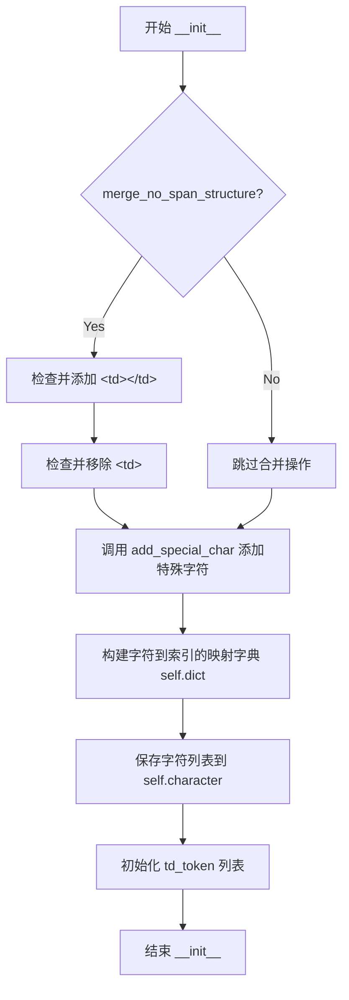

#### 带注释源码

```python
def __init__(self, dict_character, merge_no_span_structure=True, **kwargs):
    """初始化表格标签解码器
    
    Args:
        dict_character: 字符字典列表
        merge_no_span_structure: 是否合并无跨列结构
        **kwargs: 额外的关键字参数
    """
    # 如果启用无跨列结构合并
    if merge_no_span_structure:
        # 确保 <td></td> 标签存在于字符表中
        if "<td></td>" not in dict_character:
            dict_character.append("<td></td>")
        # 移除单独的 <td> 标签以避免冲突
        if "<td>" in dict_character:
            dict_character.remove("<td>")

    # 添加特殊字符（sos 和 eos）到字符表
    dict_character = self.add_special_char(dict_character)
    
    # 构建字符到索引的映射字典
    self.dict = {}
    for i, char in enumerate(dict_character):
        self.dict[char] = i
    
    # 保存字符列表
    self.character = dict_character
    
    # 定义 td 相关的 token 列表
    self.td_token = ["<td>", "<td", "<td></td>"]
```


### `TableLabelDecode.__call__`

该方法是表格标签解码器的调用接口，接收模型预测结果和批次数据，解析出表格的结构标签和位置信息，并根据批次内容决定是否同时返回标签解码结果。

参数：

- `preds`：`Dict[str, np.ndarray]`，包含模型输出，其中 `structure_probs` 为结构预测概率矩阵，`loc_preds` 为位置预测边界框坐标
- `batch`：`Optional[List[Any]]`，可选参数，包含形状信息列表及标签数据，当长度大于1时包含真实标签用于解码

返回值：`Union[Dict[str, Any], Tuple[Dict[str, Any], Dict[str, Any]]]`，当批次仅包含形状时返回单解码结果，否则返回(解码结果, 标签解码结果)的元组

#### 流程图

```mermaid
flowchart TD
    A[开始 __call__] --> B[从preds提取structure_probs和bbox_preds]
    B --> C[从batch提取shape_list]
    C --> D[调用decode方法解码]
    D --> E{检查batch长度}
    E -->|len(batch) == 1| F[直接返回result]
    E -->|len(batch) > 1| G[调用decode_label解码标签]
    G --> H[返回result和label_decode_result元组]
```

#### 带注释源码

```python
def __call__(self, preds, batch=None):
    """表格标签解码器的主调用方法

    Args:
        preds: 模型预测结果字典，包含:
            - structure_probs: 结构预测的概率分布，shape为[batch, seq_len, num_classes]
            - loc_preds: 位置预测的边界框坐标，shape为[batch, seq_len, 4]
        batch: 批次数据列表，格式为[image, label, gt_bbox, shape]或仅包含shape
            - batch[-1] 即 shape_list 包含图像的原始尺寸信息用于坐标还原

    Returns:
        若 batch 长度为1，仅返回解码结果字典
        若 batch 长度大于1，返回(解码结果, 标签解码结果)的元组
    """
    # 从预测结果中提取结构概率和位置预测
    structure_probs = preds["structure_probs"]
    bbox_preds = preds["loc_preds"]
    # 提取shape列表用于后续坐标还原
    shape_list = batch[-1]
    # 调用decode方法进行解码
    result = self.decode(structure_probs, bbox_preds, shape_list)
    # 判断是否仅包含shape信息（仅用于推理）
    if len(batch) == 1:  # only contains shape
        return result

    # 若包含完整标签信息，同时进行标签解码
    label_decode_result = self.decode_label(batch)
    return result, label_decode_result
```


### `TableLabelDecode.decode`

该方法负责将模型输出的结构概率和边界框预测转换为可读的结构化文本标签和对应的边界框信息，通过遍历批次数据并根据字符映射表解码，同时过滤掉忽略的标记符。

参数：

- `structure_probs`：`np.ndarray`，结构预测的概率分布，形状为 [batch_size, seq_len, num_classes]
- `bbox_preds`：`np.ndarray`，边界框预测值，形状为 [batch_size, seq_len, 4]
- `shape_list`：`list`，原始图像的形状信息列表，每个元素为 [height, width, ...]

返回值：`dict`，包含 `bbox_batch_list`（边界框列表）和 `structure_batch_list`（结构文本列表及平均分数）

#### 流程图

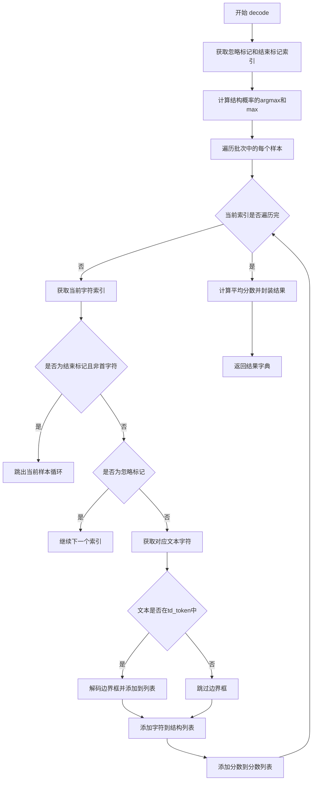

#### 带注释源码

```python
def decode(self, structure_probs, bbox_preds, shape_list):
    """将文本标签转换为文本索引"""
    # 获取需要忽略的标记（起始和结束标记）
    ignored_tokens = self.get_ignored_tokens()
    # 获取结束标记在字典中的索引
    end_idx = self.dict[self.end_str]

    # 获取结构预测的索引（概率最大的类别）
    structure_idx = structure_probs.argmax(axis=2)
    # 获取结构预测的最大概率值
    structure_probs = structure_probs.max(axis=2)

    # 初始化结果容器
    structure_batch_list = []
    bbox_batch_list = []
    # 获取批次大小
    batch_size = len(structure_idx)
    
    # 遍历批次中的每个样本
    for batch_idx in range(batch_size):
        structure_list = []
        bbox_list = []
        score_list = []
        
        # 遍历当前样本的每个时间步
        for idx in range(len(structure_idx[batch_idx])):
            # 获取当前时间步的字符索引
            char_idx = int(structure_idx[batch_idx][idx])
            
            # 如果不是第一个时间步且遇到结束标记，则停止解码
            if idx > 0 and char_idx == end_idx:
                break

            # 跳过需要忽略的标记
            if char_idx in ignored_tokens:
                continue

            # 根据字符索引获取对应文本
            text = self.character[char_idx]
            
            # 如果是表格td相关标记，则处理边界框
            if text in self.td_token:
                # 获取当前时间步的边界框预测
                bbox = bbox_preds[batch_idx, idx]
                # 将归一化的边界框解码为原始图像尺寸
                bbox = self._bbox_decode(bbox, shape_list[batch_idx])
                bbox_list.append(bbox)
            
            # 将文本字符添加到结构列表
            structure_list.append(text)
            # 添加对应的概率分数
            score_list.append(structure_probs[batch_idx, idx])
        
        # 将当前样本的结构列表和平均分数添加到批次列表
        structure_batch_list.append([structure_list, np.mean(score_list)])
        # 将边界框数组添加到批次列表
        bbox_batch_list.append(np.array(bbox_list))
    
    # 组装最终结果
    result = {
        "bbox_batch_list": bbox_batch_list,
        "structure_batch_list": structure_batch_list,
    }
    return result
```


### `TableLabelDecode.decode_label`

该方法将表格标签数据（结构标签、真实边界框、形状信息）转换为字符索引和对应的边界框列表，用于训练阶段的标签解码。

参数：

- `batch`：`List` 或 `Tuple`，包含批次数据，具体为 `[image, structure_idx, gt_bbox_list, shape_list]`，其中 `structure_idx` 是结构标签索引，`gt_bbox_list` 是真实边界框列表，`shape_list` 是图像形状信息

返回值：`Dict`，包含两个键值对：`"bbox_batch_list"`（边界框列表）和 `"structure_batch_list"`（结构标签列表）

#### 流程图

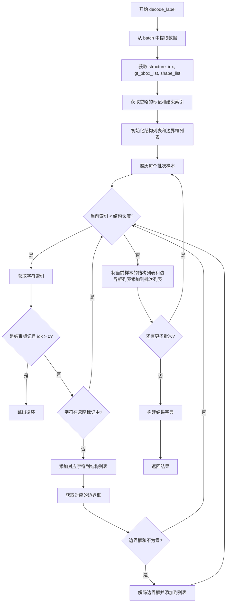

#### 带注释源码

```python
def decode_label(self, batch):
    """convert text-label into text-index.
    
    将文本标签转换为文本索引，用于训练阶段的标签解码。
    
    Args:
        batch: 批次数据，格式为 [image, structure_idx, gt_bbox_list, shape_list]
            - batch[1]: structure_idx，结构标签索引
            - batch[2]: gt_bbox_list，真实边界框列表
            - batch[-1]: shape_list，图像形状信息列表
    
    Returns:
        Dict: 包含以下键的字典
            - bbox_batch_list: 边界框列表，每个元素对应一个批次样本的边界框
            - structure_batch_list: 结构标签列表，每个元素对应一个批次样本的字符列表
    """
    # 从 batch 中提取结构标签索引
    structure_idx = batch[1]
    # 提取真实边界框列表
    gt_bbox_list = batch[2]
    # 提取形状信息列表（最后一个元素）
    shape_list = batch[-1]
    # 获取需要忽略的标记索引（起始和结束标记）
    ignored_tokens = self.get_ignored_tokens()
    # 获取结束标记在字典中的索引
    end_idx = self.dict[self.end_str]

    # 初始化批次级别的结构标签列表
    structure_batch_list = []
    # 初始化批次级别的边界框列表
    bbox_batch_list = []
    # 获取当前批次的样本数量
    batch_size = len(structure_idx)
    
    # 遍历批次中的每个样本
    for batch_idx in range(batch_size):
        # 初始化当前样本的结构标签列表
        structure_list = []
        # 初始化当前样本的边界框列表
        bbox_list = []
        
        # 遍历当前样本的每个结构标签
        for idx in range(len(structure_idx[batch_idx])):
            # 将字符索引转换为整数类型
            char_idx = int(structure_idx[batch_idx][idx])
            
            # 如果遇到结束标记且不是第一个位置，则停止解码
            if idx > 0 and char_idx == end_idx:
                break

            # 如果当前字符索引在忽略列表中，则跳过
            if char_idx in ignored_tokens:
                continue

            # 将字符索引转换为实际字符，并添加到结构列表
            structure_list.append(self.character[char_idx])

            # 获取对应的真实边界框
            bbox = gt_bbox_list[batch_idx][idx]
            
            # 如果边界框信息不为空（和不为零），则进行解码
            if bbox.sum() != 0:
                # 调用 _bbox_decode 方法将相对坐标转换为绝对坐标
                bbox = self._bbox_decode(bbox, shape_list[batch_idx])
                # 将解码后的边界框添加到列表
                bbox_list.append(bbox)

        # 将当前样本的结构标签列表添加到批次列表
        structure_batch_list.append(structure_list)
        # 将当前样本的边界框列表添加到批次列表
        bbox_batch_list.append(bbox_list)
    
    # 构建结果字典
    result = {
        "bbox_batch_list": bbox_batch_list,
        "structure_batch_list": structure_batch_list,
    }
    return result
```


### `TableLabelDecode._bbox_decode`

该方法用于将归一化的边界框坐标转换为实际图像尺寸的坐标。在表格识别任务中，模型输出的边界框坐标是归一化的（相对于特征图或输入图像的比例），该方法通过乘以对应图像的宽高来还原为原始图像尺寸的实际坐标。

参数：

- `bbox`：`np.ndarray`，归一化的边界框坐标数组，通常为 4 个元素 `[x1, y1, x2, y2]` 或类似格式，其中偶数索引为 x 坐标，奇数索引为 y 坐标
- `shape`：`np.ndarray`，图像的形状信息，包含高度和宽度，格式为 `[height, width, ...]`

返回值：`np.ndarray`，还原后的实际坐标数组，坐标值已乘以图像的宽高

#### 流程图

```mermaid
flowchart TD
    A[开始 _bbox_decode] --> B[从 shape 提取 h 和 w]
    B --> C[bbox[0::2] *= w]
    C --> D[bbox[1::2] *= h]
    D --> E[返回解码后的 bbox]
```

#### 带注释源码

```python
def _bbox_decode(self, bbox, shape):
    """将归一化的边界框坐标转换为实际图像尺寸的坐标
    
    Args:
        bbox: 归一化的边界框坐标数组，如 [x1, y1, x2, y2]
        shape: 图像形状信息 [height, width, ...]
    
    Returns:
        还原后的实际坐标数组
    """
    # 从 shape 中提取图像的高度和宽度
    h, w = shape[:2]
    
    # 将偶数索引位置（x坐标）乘以宽度进行还原
    bbox[0::2] *= w
    
    # 将奇数索引位置（y坐标）乘以高度进行还原
    bbox[1::2] *= h
    
    # 返回还原后的边界框坐标
    return bbox
```


### `TableLabelDecode.get_ignored_tokens`

获取需要忽略的标记索引，用于在表格结构解析时跳过起始和结束标记。

参数：

- 该方法无显式参数（仅包含 `self`）

返回值：`List[np.ndarray]`，返回包含起始标记索引和结束标记索引的列表，用于在解码过程中跳过这些特殊标记。

#### 流程图

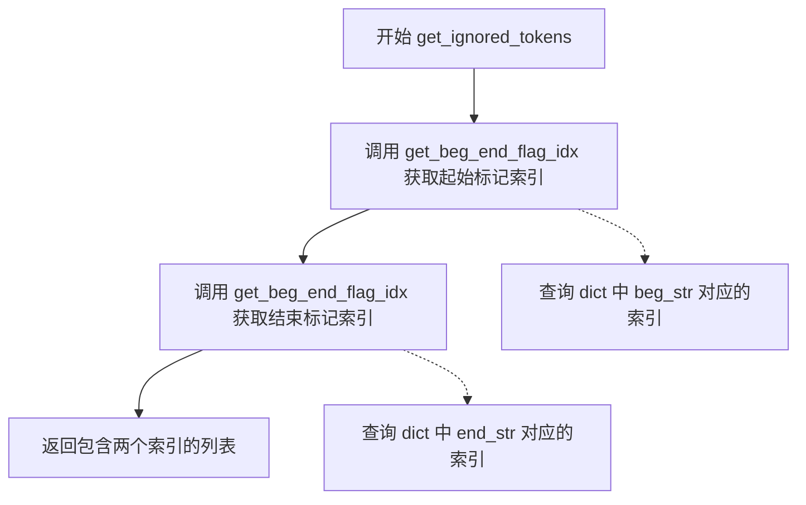

#### 带注释源码

```python
def get_ignored_tokens(self):
    """获取需要忽略的标记索引
    
    在表格结构解码过程中，需要忽略起始标记(sos)和结束标记(eos)，
    本方法返回这两个特殊标记在字符字典中的索引位置。
    
    Returns:
        List[np.ndarray]: 包含起始标记索引和结束标记索引的列表
                         第一个元素是起始标记(beg)的索引，第二个是结束标记(end)的索引
    """
    # 获取起始标记'sos'在字典中的索引
    beg_idx = self.get_beg_end_flag_idx("beg")
    # 获取结束标记'eos'在字典中的索引
    end_idx = self.get_beg_end_flag_idx("end")
    # 返回需要忽略的标记索引列表
    return [beg_idx, end_idx]
```


### `TableLabelDecode.get_beg_end_flag_idx`

该方法用于获取表格识别中表示结构开始（sos）或结束（eos）特殊字符在字典中的索引位置，以便在解码过程中忽略这些特殊标记。

参数：

- `beg_or_end`：`str`，指定要获取的是开始标记（"beg"）还是结束标记（"end"）的索引

返回值：`numpy.ndarray`，返回对应特殊字符在字典中的索引，包装为numpy数组类型

#### 流程图

```mermaid
flowchart TD
    A[开始 get_beg_end_flag_idx] --> B{判断 beg_or_end == 'beg'}
    B -->|是| C[返回 np.array(self.dict[self.beg_str])]
    B -->|否| D{判断 beg_or_end == 'end'}
    D -->|是| E[返回 np.array(self.dict[self.end_str])]
    D -->|否| F[抛出 TypeError 异常]
    C --> G[结束]
    E --> G
    F --> G
```

#### 带注释源码

```python
def get_beg_end_flag_idx(self, beg_or_end):
    """获取表示开始或结束特殊字符在字典中的索引位置
    
    Args:
        beg_or_end: str, 指定获取的类型，"beg"表示开始标记sos，"end"表示结束标记eos
        
    Returns:
        numpy.ndarray: 对应特殊字符在字典self.dict中的索引值，包装为numpy数组
        
    Raises:
        TypeError: 当beg_or_end既不是"beg"也不是"end"时抛出
    """
    # 判断是否为开始标记
    if beg_or_end == "beg":
        # 从字典中获取开始标记sos对应的索引，并转换为numpy数组返回
        return np.array(self.dict[self.beg_str])

    # 判断是否为结束标记
    if beg_or_end == "end":
        # 从字典中获取结束标记eos对应的索引，并转换为numpy数组返回
        return np.array(self.dict[self.end_str])

    # 参数不合法时抛出TypeError异常
    raise TypeError(f"unsupport type {beg_or_end} in get_beg_end_flag_idx")
```


### `TableLabelDecode.add_special_char`

该方法用于在字符字典列表中添加特殊的起始标记（sos）和结束标记（eos），以支持表格识别模型的结构化输出。

参数：

- `dict_character`：`List[str]`，输入的字符字典列表，用于映射模型输出的类别索引到实际字符

返回值：`List[str]`，添加了起始标记和结束标记后的完整字符字典列表

#### 流程图

```mermaid
flowchart TD
    A[开始 add_special_char] --> B[设置 self.beg_str = 'sos']
    B --> C[设置 self.end_str = 'eos']
    C --> D[构建新列表: [beg_str] + dict_character + [end_str]]
    D --> E[返回新列表]
    E --> F[结束]
```

#### 带注释源码

```python
def add_special_char(self, dict_character):
    """在字符字典中添加特殊的起始和结束标记
    
    Args:
        dict_character: 原始字符字典列表，用于将模型输出的索引映射为实际字符
        
    Returns:
        添加了起始标记'sos'和结束标记'eos'的完整字符字典列表
    """
    # 定义序列起始标记
    self.beg_str = "sos"
    # 定义序列结束标记
    self.end_str = "eos"
    # 将起始标记、原始字典、结束标记合并为新列表
    # 位置: [sos, 原字典..., eos]
    dict_character = [self.beg_str] + dict_character + [self.end_str]
    return dict_character
```


### TablePreprocess.__init__

该方法是 `TablePreprocess` 类的构造函数，负责初始化表格图像预处理的配置，包括设置表格最大边长、构建预处理操作列表以及动态创建预处理操作符实例。

参数：
- 无参数

返回值：`None`，仅进行对象状态初始化

#### 流程图

```mermaid
flowchart TD
    A[开始 __init__] --> B[设置 table_max_len = 488]
    B --> C[调用 build_pre_process_list]
    C --> D[构建预处理操作配置列表]
    D --> E[调用 create_operators]
    E --> F[动态实例化操作符对象]
    F --> G[结束 __init__]
    
    subgraph build_pre_process_list
    C --> C1[创建 ResizeTableImage 配置]
    C1 --> C2[创建 PaddingTableImage 配置]
    C2 --> C3[创建 NormalizeImage 配置]
    C3 --> C4[创建 ToCHWImage 配置]
    C4 --> C5[创建 KeepKeys 配置]
    C5 --> C6[赋值给 self.pre_process_list]
    end
    
    subgraph create_operators
    E --> E1[遍历 pre_process_list]
    E1 --> E2[提取操作符名称和参数]
    E2 --> E3[eval 动态实例化]
    E3 --> E4[添加到 ops 列表]
    E4 --> E5{是否还有更多操作符?}
    E5 -->|是| E1
    E5 -->|否| E6[返回 ops 列表]
    end
```

#### 带注释源码

```python
class TablePreprocess:
    def __init__(self):
        """表格图像预处理器初始化
        
        初始化过程包含以下步骤：
        1. 设置表格图像的最大边长阈值
        2. 构建预处理操作配置列表
        3. 根据配置动态创建预处理操作符实例
        """
        # 步骤1: 设置表格图像的最大边长阈值为488像素
        # 该值基于模型输入要求确定，用于控制图像缩放尺寸
        self.table_max_len = 488
        
        # 步骤2: 调用方法构建预处理操作配置列表
        # 配置列表包含5个操作: 缩放、归一化、填充、通道转换、保留键
        self.build_pre_process_list()
        
        # 步骤3: 根据配置列表动态创建操作符实例
        # 使用 eval 动态实例化对应的图像处理类
        self.ops = self.create_operators()
```

#### 相关依赖方法

**build_pre_process_list**

```python
def build_pre_process_list(self):
    """构建表格图像预处理的配置列表
    
    该方法定义了一个完整的预处理流水线，包含以下操作：
    1. ResizeTableImage: 将图像resize到最大边长以内
    2. NormalizeImage: 归一化处理（减均值/除标准差）
    3. PaddingTableImage: padding到固定尺寸正方形
    4. ToCHWImage: 将HWC格式转换为CHW格式
    5. KeepKeys: 保留指定的键值对
    """
    resize_op = {
        "ResizeTableImage": {
            "max_len": self.table_max_len,
        }
    }
    pad_op = {
        "PaddingTableImage": {"size": [self.table_max_len, self.table_max_len]}
    }
    normalize_op = {
        "NormalizeImage": {
            "std": [0.229, 0.224, 0.225],
            "mean": [0.485, 0.456, 0.406],
            "scale": "1./255.",
            "order": "hwc",
        }
    }
    to_chw_op = {"ToCHWImage": None}
    keep_keys_op = {"KeepKeys": {"keep_keys": ["image", "shape"]}}
    self.pre_process_list = [
        resize_op,
        normalize_op,
        pad_op,
        to_chw_op,
        keep_keys_op,
    ]
```

**create_operators**

```python
def create_operators(self):
    """根据配置动态创建操作符实例
    
    遍历预处理的配置列表，使用 eval 函数动态实例化
    对应的图像处理类，并将所有操作符保存在 ops 列表中
    
    Returns:
        ops: 操作符实例列表
    """
    assert isinstance(
        self.pre_process_list, list
    ), "operator config should be a list"
    ops = []
    for operator in self.pre_process_list:
        assert (
            isinstance(operator, dict) and len(operator) == 1
        ), "yaml format error"
        op_name = list(operator)[0]
        param = {} if operator[op_name] is None else operator[op_name]
        op = eval(op_name)(**param)
        ops.append(op)
    return ops
```


### `TablePreprocess.__call__`

该方法是 `TablePreprocess` 类的可调用接口，通过依次执行预定义的图像预处理操作（resize、normalize、padding、to_chw、keep_keys）对输入的表格图像数据进行转换处理。

参数：

-  `data`：`Dict[str, Any]`，包含图像数据的字典，键为"image"，值为待处理的图像（numpy数组）

返回值：`Optional[Dict[str, Any]]`，处理后的数据字典，如果任何预处理操作返回None则返回None

#### 流程图

```mermaid
flowchart TD
    A[输入: data字典<br/>{image: 图像}] --> B{self.ops是否为None?}
    B -- 是 --> C[初始化为空列表]
    B -- 否 --> D[遍历ops操作列表]
    C --> D
    D --> E[执行当前操作 op(data)]
    E --> F{返回的data是否为None?}
    F -- 是 --> G[返回None]
    F -- 否 --> H{还有更多操作?}
    H -- 是 --> E
    H -- 否 --> I[返回处理后的data]
    
    subgraph 预处理操作列表
        D1[ResizeTableImage<br/>调整图像尺寸]
        D2[NormalizeImage<br/>归一化图像]
        D3[PaddingTableImage<br/>填充图像]
        D4[ToCHWImage<br/>转换通道顺序]
        D5[KeepKeys<br/>保留指定键]
    end
    
    D --> D1 --> D2 --> D3 --> D4 --> D5
```

#### 带注释源码

```python
def __call__(self, data):
    """transform
    对输入的表格图像数据进行预处理转换
    
    处理流程:
    1. 检查操作列表是否存在，不存在则初始化为空列表
    2. 依次执行预处理的各个操作
    3. 如果某个操作返回None，则终止处理并返回None
    4. 所有操作执行完成后返回处理后的数据
    
    Args:
        data: 包含图像数据的字典，必须包含键'image'
              例如: {'image': np.ndarray}
    
    Returns:
        处理后的数据字典，包含经过resize、normalize、padding、
        通道转换后的图像以及shape信息。如果任何操作返回None则返回None。
    """
    # 检查操作列表是否已初始化
    # 如果ops为None（未初始化），则设为空列表，避免后续遍历报错
    if self.ops is None:
        self.ops = []

    # 依次遍历执行每个预处理器操作
    # 预处理器包括:
    # - ResizeTableImage: 调整图像尺寸到最大边为488
    # - NormalizeImage: 图像归一化 (mean=[0.485,0.456,0.406], std=[0.229,0.224,0.225])
    # - PaddingTableImage: 填充图像到固定大小 [488, 488]
    # - ToCHWImage: 将HWC格式转换为CHW格式
    # - KeepKeys: 保留指定的键（image和shape）
    for op in self.ops:
        # 调用操作符的__call__方法对数据进行转换
        data = op(data)
        
        # 如果某个操作返回None，表示处理失败或数据无效
        # 立即终止后续处理并返回None
        if data is None:
            return None
    
    # 所有预处理操作完成，返回处理后的数据
    return data
```


### `TablePreprocess.create_operators`

该方法根据预处理的配置列表（pre_process_list）动态创建一系列图像预处理操作符（如ResizeTableImage、NormalizeImage、PaddingTableImage等），并返回包含这些操作符对象的列表。它通过eval函数动态实例化相应的类，是表格识别任务中数据流水线构建的核心环节。

参数：
- 该方法无显式外部参数，但内部依赖 `self.pre_process_list`（Dict[List]，预处理操作配置列表，在 `build_pre_process_list` 方法中初始化）

返回值：`List`，返回创建好的预处理操作符对象列表，每个元素都是一个可调用的预处理类实例

#### 流程图

```mermaid
flowchart TD
    A[开始 create_operators] --> B{self.pre_process_list 是否为列表}
    B -->|否| C[抛出断言错误: operator config should be a list]
    B -->|是| D[初始化空列表 ops]
    D --> E{遍历 pre_process_list 中的每个 operator}
    E --> F{operator 是否为字典且长度为1}
    F -->|否| G[抛出断言错误: yaml format error]
    F -->|是| H[提取操作符名称 op_name]
    H --> I{operator[op_name] 是否为 None}
    I -->|是| J[param = 空字典 {}]
    I -->|否| K[param = operator[op_name]]
    J --> L[使用 eval 动态实例化操作符类]
    K --> L
    L --> M[将实例化的操作符添加到 ops 列表]
    M --> E
    E --> N{遍历完成?}
    N -->|否| E
    N -->|是| O[返回 ops 列表]
    O --> P[结束]
```

#### 带注释源码

```python
def create_operators(
    self,
):
    """
    基于配置创建操作符

    Args:
        params(list): 用于创建操作符的字典列表
    """
    # 断言验证 pre_process_list 是否为列表类型
    # 这是预处理配置的基本类型检查，确保配置格式正确
    assert isinstance(
        self.pre_process_list, list
    ), "operator config should be a list"
    
    # 初始化一个空列表，用于存储创建的操作符对象
    ops = []
    
    # 遍历预定义的预处理操作符配置列表
    # 每个 operator 是一个字典，键是操作符类名，值是参数字典或None
    for operator in self.pre_process_list:
        # 验证每个操作符配置的格式：必须是字典且只有一个键
        # 这是YAML配置的标准格式要求
        assert (
            isinstance(operator, dict) and len(operator) == 1
        ), "yaml format error"
        
        # 提取操作符名称（类名），如 'ResizeTableImage'
        op_name = list(operator)[0]
        
        # 提取操作符参数字典，如果值为None则使用空字典
        # 例如: {"ResizeTableImage": {"max_len": 488}} -> op_name="ResizeTableImage", param={"max_len": 488}
        # 例如: {"ToCHWImage": None} -> op_name="ToCHWImage", param={}
        param = {} if operator[op_name] is None else operator[op_name]
        
        # 使用 eval 动态将字符串转换为类名并实例化对象
        # 例如: eval("ResizeTableImage")(**{"max_len": 488}) 会创建 ResizeTableImage 类的实例
        # 这种方式允许通过配置文件灵活定义预处理流水线
        op = eval(op_name)(**param)
        
        # 将创建的操作符对象添加到列表中
        ops.append(op)
    
    # 返回包含所有预处理操作符的列表
    return ops
```


### `TablePreprocess.build_pre_process_list`

该方法用于构建表格图像的预处理操作列表，定义了一系列图像处理步骤（包括ResizeTableImage、NormalizeImage、PaddingTableImage、ToCHWImage和KeepKeys），并将这些操作配置存储到 `pre_process_list` 列表中供后续创建操作符使用。

参数： 无

返回值： 无（该方法没有返回值，仅设置实例属性 `self.pre_process_list`）

#### 流程图

```mermaid
flowchart TD
    A[开始 build_pre_process_list] --> B[创建 ResizeTableImage 操作配置]
    B --> C[创建 PaddingTableImage 操作配置]
    C --> D[创建 NormalizeImage 操作配置]
    D --> E[创建 ToCHWImage 操作配置]
    E --> F[创建 KeepKeys 操作配置]
    F --> G[将所有操作配置添加到 pre_process_list 列表]
    G --> H[结束]
```

#### 带注释源码

```python
def build_pre_process_list(self):
    """构建表格图像预处理操作列表
    
    该方法创建了一系列图像预处理操作的配置字典，包括：
    1. ResizeTableImage - 调整图像大小
    2. NormalizeImage - 图像归一化
    3. PaddingTableImage - 图像padding
    4. ToCHWImage - 图像通道转换
    5. KeepKeys - 保留指定键
    
    Args:
        无
        
    Returns:
        无返回值，结果存储在 self.pre_process_list 属性中
    """
    # 创建ResizeTableImage操作配置，设置最大边长度
    resize_op = {
        "ResizeTableImage": {
            "max_len": self.table_max_len,
        }
    }
    
    # 创建PaddingTableImage操作配置，设置padding尺寸为正方形
    pad_op = {
        "PaddingTableImage": {"size": [self.table_max_len, self.table_max_len]}
    }
    
    # 创建NormalizeImage操作配置，设置归一化参数（均值、标准差、缩放因子、通道顺序）
    normalize_op = {
        "NormalizeImage": {
            "std": [0.229, 0.224, 0.225],
            "mean": [0.485, 0.456, 0.406],
            "scale": "1./255.",
            "order": "hwc",
        }
    }
    
    # 创建ToCHWImage操作配置（无参数）
    to_chw_op = {"ToCHWImage": None}
    
    # 创建KeepKeys操作配置，指定保留image和shape两个键
    keep_keys_op = {"KeepKeys": {"keep_keys": ["image", "shape"]}}
    
    # 将所有操作配置按顺序添加到预处理列表中
    self.pre_process_list = [
        resize_op,
        normalize_op,
        pad_op,
        to_chw_op,
        keep_keys_op,
    ]
```


### `BatchTablePreprocess.__call__`

批量处理图像列表，对每个图像调用TablePreprocess进行预处理，并收集处理后的图像和形状信息。

参数：

- `img_list`：`List[np.ndarray]`，待处理的图像列表

返回值：`Tuple[List[np.ndarray], List[List[float]]]`，预处理后的图像列表和对应的形状信息列表

#### 流程图

```mermaid
flowchart TD
    A[开始 __call__] --> B[初始化空列表 processed_imgs]
    B --> C[初始化空列表 shape_lists]
    C --> D{遍历 img_list 中的每个 img}
    D -->|img 为 None| E[跳过当前循环]
    E --> D
    D -->|img 有效| F[构建数据字典 data = {'image': img}]
    F --> G[调用 self.preprocess 进行预处理]
    G --> H[获取处理后的图像 img_processed 和形状列表 shape_list]
    H --> I[将 img_processed 添加到 processed_imgs]
    I --> J[将 shape_list 添加到 shape_lists]
    J --> D
    D --> K[返回 processed_imgs 和 shape_lists 元组]
    K --> L[结束]
```

#### 带注释源码

```python
def __call__(
    self, img_list: List[np.ndarray]
) -> Tuple[List[np.ndarray], List[List[float]]]:
    """批量处理图像

    Args:
        img_list: 图像列表

    Returns:
        预处理后的图像列表和形状信息列表
    """
    # 初始化存储预处理后图像的列表
    processed_imgs = []
    
    # 初始化存储每张图像形状信息的列表
    shape_lists = []

    # 遍历输入的图像列表
    for img in img_list:
        # 跳过为None的图像
        if img is None:
            continue
        
        # 构建预处理所需的数据字典
        data = {"image": img}
        
        # 调用预处理管道处理图像，返回处理后的图像和形状信息
        img_processed, shape_list = self.preprocess(data)
        
        # 将处理后的图像添加到结果列表
        processed_imgs.append(img_processed)
        
        # 将对应的形状信息添加到结果列表
        shape_lists.append(shape_list)
    
    # 返回预处理图像列表和形状信息列表的元组
    return processed_imgs, shape_lists
```


### `ResizeTableImage.__call__`

该方法是表格图像预处理的 ResizeTableImage 类的核心调用方法，用于将输入图像按比例缩放到指定的最大边长，同时保持宽高比，并在数据字典中更新相关字段（原始图像、缩放比例、形状信息等）。

参数：

- `data`：`Dict`，输入数据字典，必须包含键 `"image"`（待缩放的图像，类型为 `np.ndarray`），可选包含 `"bboxes"`（边界框列表，仅在 `resize_bboxes=True` 且 `infer_mode=False` 时处理）

返回值：`Dict`，返回处理后的数据字典，包含以下键值对：
- `"image"`：缩放后的图像（`np.ndarray`）
- `"src_img"`：原始输入图像（`np.ndarray`）
- `"shape"`：包含原始高度、宽度、缩放比例的 `np.ndarray`（形状为 `[height, width, ratio, ratio]`）
- `"max_len"`：最大边长限制（`int`）
- `"bboxes"`：缩放后的边界框（仅当 `resize_bboxes=True` 且 `infer_mode=False` 时存在）

#### 流程图

```mermaid
flowchart TD
    A[开始 __call__] --> B[从 data 获取 image]
    B --> C[获取图像高度 height 和宽度 width]
    C --> D[计算缩放比例: ratio = max_len / max height, width]
    D --> E[计算目标尺寸: resize_h, resize_w]
    E --> F[使用 cv2.resize 缩放图像]
    F --> G{resize_bboxes 为真<br/>且 infer_mode 为假?}
    G -->|是| H[将 bboxes 乘以 ratio]
    G -->|否| I[跳过 bboxes 处理]
    H --> J[更新 data 字典]
    I --> J
    J --> K[设置 src_img 为原始图像]
    K --> L[设置 shape 为 height, width, ratio, ratio]
    L --> M[设置 max_len 为 max_len]
    M --> N[返回 data]
```

#### 带注释源码

```python
def __call__(self, data):
    """对表格图像进行缩放处理

    Args:
        data: 包含图像数据的字典，必须包含 'image' 键，可选包含 'bboxes' 键

    Returns:
        处理后的数据字典，包含 'image'（缩放后图像）、'src_img'（原始图像）、
        'shape'（形状信息）、'max_len'（最大边长）等
    """
    # 从输入字典中提取图像
    img = data["image"]
    
    # 获取图像的高度和宽度
    height, width = img.shape[0:2]
    
    # 计算缩放比例：使较长边等于 max_len，保持宽高比
    ratio = self.max_len / (max(height, width) * 1.0)
    
    # 根据缩放比例计算目标高度和宽度
    resize_h = int(height * ratio)
    resize_w = int(width * ratio)
    
    # 使用 OpenCV 的 resize 函数进行图像缩放
    # 注意：cv2.resize 参数顺序为 (宽度, 高度)
    resize_img = cv2.resize(img, (resize_w, resize_h))
    
    # 如果需要调整边界框且不在推理模式下，则对边界框进行缩放
    if self.resize_bboxes and not self.infer_mode:
        data["bboxes"] = data["bboxes"] * ratio
    
    # 将缩放后的图像存入数据字典
    data["image"] = resize_img
    
    # 保存原始图像用于后续处理
    data["src_img"] = img
    
    # 保存原始尺寸和缩放比例信息 [原始高度, 原始宽度, 高度比例, 宽度比例]
    data["shape"] = np.array([height, width, ratio, ratio])
    
    # 保存最大边长限制值
    data["max_len"] = self.max_len
    
    # 返回处理后的数据字典
    return data
```


### `PaddingTableImage.__call__`

该方法用于将图像填充（padding）到指定的尺寸，通过创建零填充数组并将原始图像复制到左上角，同时更新图像的形状信息。

参数：

- `data`：`Dict[str, Any]`，包含图像数据的字典，必须包含键"image"和"shape"

返回值：`Dict[str, Any]`，返回更新后的数据字典，包含填充后的图像和更新后的形状信息

#### 流程图

```mermaid
flowchart TD
    A[开始] --> B[从data中获取图像img]
    B --> C[获取填充尺寸pad_h, pad_w]
    C --> D[创建零填充数组padding_img]
    D --> E[获取原始图像高度height和宽度width]
    E --> F[将原始图像复制到填充数组的左上角]
    F --> G[更新data中的图像为填充后的图像]
    G --> H[获取并扩展shape列表]
    H --> I[将扩展后的shape转换为numpy数组]
    I --> J[更新data中的shape]
    J --> K[返回更新后的data]
```

#### 带注释源码

```python
def __call__(self, data):
    """对图像进行填充处理，使其达到目标尺寸
    
    Args:
        data: 包含图像数据的字典，必须包含:
              - 'image': 输入的图像数组
              - 'shape': 原始图像的形状信息
    
    Returns:
        更新后的data字典，包含填充后的图像和形状信息
    """
    # 从输入数据中获取图像
    img = data["image"]
    
    # 获取目标填充尺寸（高度和宽度）
    pad_h, pad_w = self.size
    
    # 创建指定尺寸的零填充数组，数据类型为float32
    padding_img = np.zeros((pad_h, pad_w, 3), dtype=np.float32)
    
    # 获取原始图像的尺寸
    height, width = img.shape[0:2]
    
    # 将原始图像复制到填充数组的左上角
    # 使用img.copy()确保不修改原始图像
    padding_img[0:height, 0:width, :] = img.copy()
    
    # 更新data中的图像为填充后的图像
    data["image"] = padding_img
    
    # 获取当前的shape列表并扩展，添加填充后的高度和宽度
    shape = data["shape"].tolist()
    shape.extend([pad_h, pad_w])
    
    # 将扩展后的shape转换为numpy数组
    data["shape"] = np.array(shape)
    
    # 返回更新后的数据字典
    return data
```

#### 类字段信息

- `size`：Tuple[int, int]，目标填充尺寸（高度, 宽度）

#### 关键组件信息

| 组件名称 | 描述 |
|---------|------|
| padding_img | 零填充的图像数组，用于接收原始图像 |
| shape | 图像形状信息，包含原始尺寸和填充后尺寸 |

#### 潜在技术债务或优化空间

1. **内存优化**：使用 `img.copy()` 会额外占用内存，对于不需要保留原始图像的场景可以直接使用 `img`
2. **边界检查**：缺少对原始图像尺寸是否超过目标填充尺寸的检查
3. **数据类型处理**：假设输入图像为3通道，但未进行验证
4. **返回值一致性**：如果输入数据有问题（如缺少必要的键），方法可能抛出KeyError而不是返回有意义的错误信息
5. **性能考虑**：在批量处理场景下，每次调用都创建新的numpy数组，可能存在优化空间


### `NormalizeImage.__call__`

对图像进行归一化处理，将像素值乘以缩放因子，减去均值后除以标准差，实现图像数据的标准化。

参数：

- `data`：`Dict[str, Any]`，包含图像数据的字典，其中 "image" 键对应待处理的图像数据

返回值：`Dict[str, Any]`，返回更新后的数据字典，归一化后的图像存储在 "image" 键中

#### 流程图

```mermaid
flowchart TD
    A[开始] --> B[从data获取图像数据]
    B --> C{验证图像是否为numpy数组}
    C -->|是| D[将图像转换为float32类型]
    D --> E[乘以缩放因子scale]
    E --> F[减去均值mean]
    F --> G[除以标准差std]
    G --> H[将结果存回data['image']]
    H --> I[返回data]
    C -->|否| J[抛出断言错误]
```

#### 带注释源码

```python
def __call__(self, data):
    """对图像进行归一化处理
    
    Args:
        data: 包含图像数据的字典，必须包含 'image' 键
        
    Returns:
        更新后的数据字典，归一化后的图像在 'image' 键中
    """
    # 从输入字典中获取图像数据
    img = np.array(data["image"])
    
    # 验证输入图像是否为numpy数组类型
    assert isinstance(img, np.ndarray), "invalid input 'img' in NormalizeImage"
    
    # 执行归一化操作：
    # 1. 将图像转换为float32类型
    # 2. 乘以缩放因子（scale）
    # 3. 减去均值（mean）
    # 4. 除以标准差（std）
    # 结果实现 (img * scale - mean) / std 的归一化公式
    data["image"] = (img.astype("float32") * self.scale - self.mean) / self.std
    
    return data
```


### `ToCHWImage.__call__`

将图像从 HWC (Height, Width, Channel) 格式转换为 CHW (Channel, Height, Width) 格式，这是深度学习模型常用的输入格式。

参数：

-  `data`：`Dict[str, np.ndarray]`，包含图像数据的字典，其中 `data["image"]` 为 HWC 格式的图像

返回值：`Dict[str, np.ndarray]`，返回转换后的数据字典，其中 `data["image"]` 被转换为 CHW 格式

#### 流程图

```mermaid
flowchart TD
    A[开始 __call__] --> B[从 data 中获取图像数据 data['image']]
    B --> C[使用 np.array 转换为 numpy 数组]
    C --> D[使用 transpose 将图像从 HWC 转换为 CHW 格式]
    D --> E[将转换后的图像存回 data['image']]
    E --> F[返回 data 字典]
```

#### 带注释源码

```python
def __call__(self, data):
    """
    将图像从 HWC 格式转换为 CHW 格式
    
    Args:
        data: 包含图像数据的字典，必须包含 'image' 键
        
    Returns:
        返回转换后的数据字典，'image' 键对应的值已转换为 CHW 格式
    """
    # 从输入字典中获取图像数据
    img = np.array(data["image"])
    
    # 使用 transpose 将图像从 HWC (Height, Width, Channel) 
    # 转换为 CHW (Channel, Height, Width) 格式
    # (2, 0, 1) 表示原维度顺序 [H, W, C] -> [C, H, W]
    data["image"] = img.transpose((2, 0, 1))
    
    # 返回转换后的数据字典
    return data
```


### `KeepKeys.__call__`

该方法用于从输入数据字典中筛选并提取指定的键值对，将需要的字段从原始数据结构中提取出来组成列表返回。

参数：

-  `data`：`Dict`，输入的数据字典，包含图像处理流水线中各阶段产生的中间结果

返回值：`List`，按照 `keep_keys` 顺序排列的值列表

#### 流程图

```mermaid
flowchart TD
    A[接收data字典] --> B{遍历keep_keys}
    B -->|遍历每个key| C[从data中获取key对应的value]
    C --> D[将value添加到data_list]
    D --> B
    B -->|遍历完成| E[返回data_list]
```

#### 带注释源码

```python
def __call__(self, data):
    """从data字典中提取指定的键值

    Args:
        data: 包含图像处理中间结果的字典，如 {'image': ..., 'shape': ...}

    Returns:
        按照keep_keys顺序提取的值列表
    """
    data_list = []
    # 遍历需要保留的键列表
    for key in self.keep_keys:
        # 从输入字典中获取对应键的值
        data_list.append(data[key])
    # 返回提取后的值列表
    return data_list
```

## 关键组件


### OrtInferSession

ONNX Runtime推理会话管理类，负责模型加载、多种执行提供者(CPU/CUDA/DirectML)支持和会话配置。支持根据环境自动选择最佳推理后端，并提供模型元数据获取和输入输出名称查询功能。

### ONNXRuntimeError

自定义异常类，用于封装ONNX Runtime推理过程中发生的错误，提供更清晰的异常信息。

### TableLabelDecode

表格标签解码类，负责将模型输出的结构概率和边界框预测转换为可读的文本标签。支持批量处理，包含`<td>`等特殊HTML标签的处理，以及起止符(sos/eos)的识别。

### TablePreprocess

表格图像预处理类，定义并执行完整的图像预处理流水线，包括图像缩放、归一化、填充、通道转换等操作。通过配置化方式灵活组合多个预处理算子。

### BatchTablePreprocess

批量表格预处理类，对多张图像进行批量预处理，收集每张图像的预处理结果和形状信息，返回处理后的图像列表和形状列表。

### ResizeTableImage

图像缩放算子，将输入图像按比例缩放到指定最大长度，保持宽高比，同时记录原始尺寸和缩放比例信息。

### PaddingTableImage

图像填充算子，将缩放后的图像填充到指定尺寸(正方形)，使用零填充剩余区域，并更新形状信息。

### NormalizeImage

图像归一化算子，对图像进行减均值、除标准差的标准化操作，支持自定义均值、标准差和缩放因子，将像素值转换到合理范围内。

### ToCHWImage

通道转换算子，将HWC格式图像(高度×宽度×通道)转换为CHW格式(通道×高度×宽度)，以适配深度学习框架的输入要求。

### KeepKeys

键值保留算子，从数据字典中提取指定的键值对，转换为列表返回，用于控制数据流中保留的字段。

### trans_char_ocr_res

OCR结果转换函数，将OCR识别结果从原始格式转换为更紧凑的词级格式，提取词框、词文本和置信度信息。

### EP枚举

执行提供者(Execution Provider)枚举类，定义CPU、CUDA和DirectML三种ONNX Runtime后端常量。


## 问题及建议


### 已知问题

1. **安全风险 - 使用eval动态创建对象**：在`TablePreprocess.create_operators`方法中使用`eval(op_name)(**param)`动态创建操作符，这种方式存在代码注入风险，且难以调试和维护。

2. **模型元数据获取缺少异常处理**：`get_metadata`方法和`get_character_list`方法在访问不存在的key时会抛出`KeyError`，没有优雅的降级处理。

3. **硬编码的设备ID**：在`_get_ep_list`方法中，CUDA provider选项硬编码了`device_id=0`，不支持多GPU环境。

4. **代码重复**：`decode`和`decode_label`方法存在大量重复代码；`get_input_names`和`get_output_names`实现几乎相同；`get_character_list`和`have_key`都有重复获取`meta_dict`的代码。

5. **缺少资源管理**：`OrtInferSession`没有实现上下文管理器协议（`__enter__`/`__exit__`），也没有提供显式的资源释放方法（如`close()`）。

6. **模型验证不完整**：`_verify_model`方法只检查文件是否存在和是否为文件，没有验证文件是否为有效的ONNX模型格式。

7. **未使用的代码**：`trans_char_ocr_res`函数定义但未被任何地方调用，可能是遗留代码。

8. **批处理索引不匹配**：`BatchTablePreprocess`在处理时跳过`None`图像，但返回的`shape_lists`与原始输入不是一一对应关系，可能导致后续处理索引错乱。

9. **日志信息冗余**：`_check_cuda`和`_check_dml`方法中包含大量重复的安装指导信息，每次调用都会打印。

10. **类型注解不完整**：部分方法如`_get_ep_list`返回类型注解不够精确，`__call__`方法的参数注解可以更具体。

11. **字符串拼写错误**：代码注释和日志中存在拼写错误，如"pakcages"应为"packages"。

12. **魔法数字和字符串**：多处使用硬编码的字符串如"sos"、"eos"和数值，没有集中定义常量。

### 优化建议

1. **重构eval调用**：使用字典映射或注册机制替代eval动态创建操作符，例如定义一个操作符注册表。

2. **添加元数据访问的默认值处理**：为`get_metadata`等方法添加默认值参数或异常处理。

3. **支持多GPU**：从配置或环境变量动态读取设备ID。

4. **提取公共代码**：将重复代码抽取为私有方法或使用继承/组合模式。

5. **实现上下文管理器**：为`OrtInferSession`添加`__enter__`、`__exit__`和`close`方法。

6. **增强模型验证**：使用ONNX库的API验证模型文件有效性。

7. **清理未使用代码**：删除`trans_char_ocr_res`函数或在合适场景使用它。

8. **修复批处理逻辑**：保持原始输入和输出的一一对应关系，或返回有效数据的掩码。

9. **优化日志输出**：使用结构化日志或DEBUG级别处理长指导信息。

10. **完善类型注解**：使用更精确的类型注解，如`Literal`、`TypedDict`等。

11. **定义常量类**：创建专门的常量类或枚举来管理魔法数字和字符串。

12. **修复拼写错误**：更正代码中的拼写错误。

13. **缓存模型元数据**：在`OrtInferSession`初始化时缓存模型元数据，避免重复调用。


## 其它


### 设计目标与约束

本模块旨在实现一个高效的表格识别推理框架，支持多种硬件加速方案（CPU、CUDA、DirectML），能够将表格图像转换为结构化的文本和边界框信息。设计约束包括：1）最大支持表格图像边长为488像素；2）仅支持ONNX格式的模型文件；3）必须确保CUDA版本与onnxruntime-gpu版本匹配；4）DirectML仅支持Windows 10及以上版本。

### 错误处理与异常设计

代码定义了ONNXRuntimeError异常类用于捕获推理过程中的错误。模型路径验证（_verify_model方法）会检查路径存在性及是否为文件类型。推理调用（__call__方法）使用try-except块捕获异常并重新抛出ONNXRuntimeError。执行提供者验证（_verify_providers方法）会在首选提供者不可用时记录警告并自动降级。输入验证主要依赖ONNX Runtime本身的检查。

### 数据流与状态机

数据流经过以下阶段：1）原始图像输入BatchTablePreprocess；2）TablePreprocess执行ResizeTableImage、NormalizeImage、PaddingTableImage、ToCHWImage、KeepKeys操作；3）处理后的图像和形状信息传入ONNX模型推理；4）推理结果由TableLabelDecode进行解码，输出结构化标签和边界框。状态转换主要体现在执行提供者的选择上：优先尝试CUDA，失败则尝试DirectML，最后回退到CPU。

### 外部依赖与接口契约

核心依赖包括：onnxruntime（推理引擎）、opencv-python（图像处理）、numpy（数值计算）、loguru（日志记录）、platform和os（系统检测）。ORTInferSession接受config字典参数，必须包含model_path字段，可选字段包括use_cuda、use_dml、intra_op_num_threads、inter_op_num_threads。TableLabelDecode的__call__方法接受preds（字典，包含structure_probs和loc_preds）和batch参数，返回解码结果或元组。

### 性能考虑与优化点

代码通过以下方式优化性能：1）启用ONNX Runtime的图优化（ORT_ENABLE_ALL）；2）支持intra_op_num_threads和inter_op_num_threads配置；3）禁用CPU内存arena；4）批量处理接口（BatchTablePreprocess）可提升吞吐量。潜在优化空间包括：支持FP16推理、模型缓存以避免重复加载、异步推理支持、更多执行提供者选项（如TensorRT）。

### 安全性考虑

代码未包含用户输入的直接执行或敏感数据处理。主要安全考量包括：1）模型文件路径验证防止路径遍历攻击；2）错误信息通过日志记录而非直接暴露给用户；3）依赖库版本需要关注已知安全漏洞。

### 兼容性考虑

代码支持Windows、Linux、macOS操作系统，但DirectML仅限Windows。CUDA支持需要匹配CUDA和cuuDNN版本。Python版本需兼容所有导入的库。ONNX Runtime版本需与模型格式兼容。跨平台兼容性通过platform模块检测实现。

### 配置与参数说明

关键配置参数说明：model_path（必填）- ONNX模型文件路径；use_cuda（可选，默认None）- 是否尝试使用CUDA；use_dml（可选，默认None）- 是否尝试使用DirectML；intra_op_num_threads（可选，默认-1）- 操作内并行线程数；inter_op_num_threads（可选，默认-1）- 操作间并行线程数；table_max_len（固定488）- 表格图像处理的最大边长。

### 测试建议

建议添加以下测试用例：1）各种执行提供者的推理验证；2）不同尺寸表格图像的处理；3）边界情况（空图像、极小/极大图像）；4）模型元数据读取；5）批量处理性能和正确性；6）错误路径测试（无效模型路径、损坏模型文件）。


    