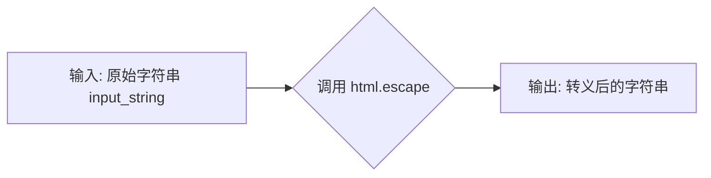
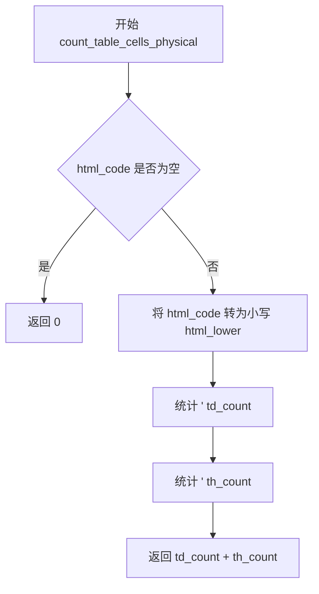
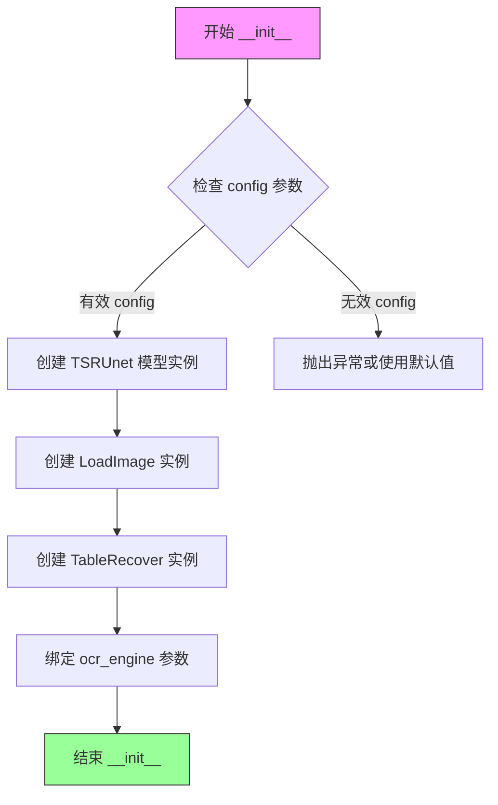
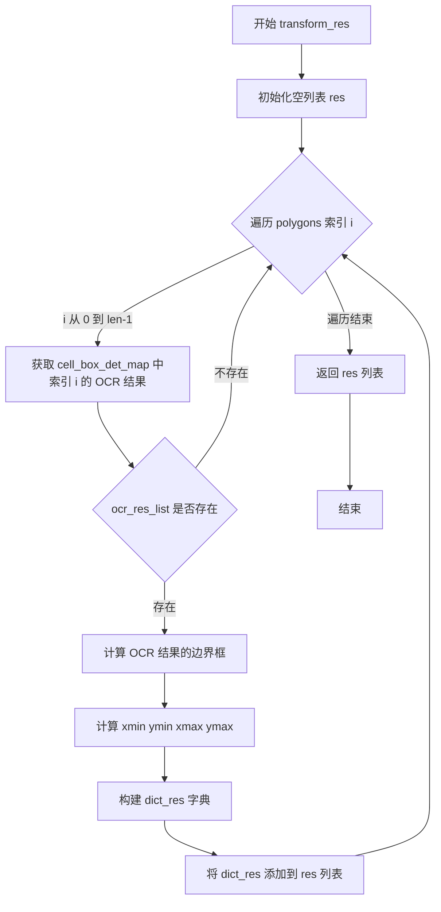
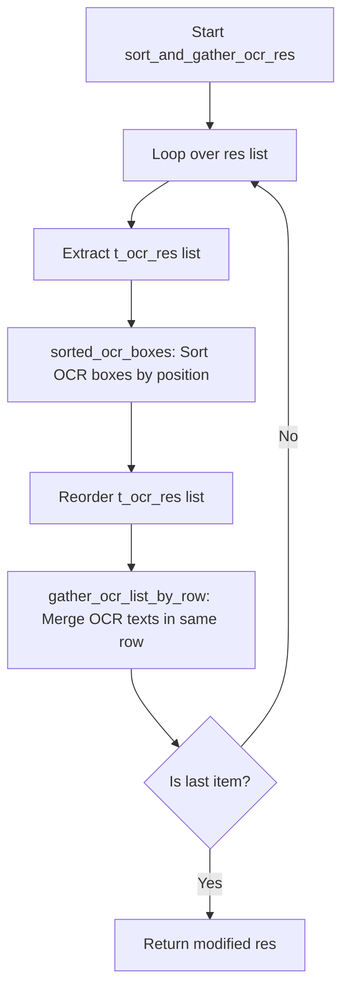
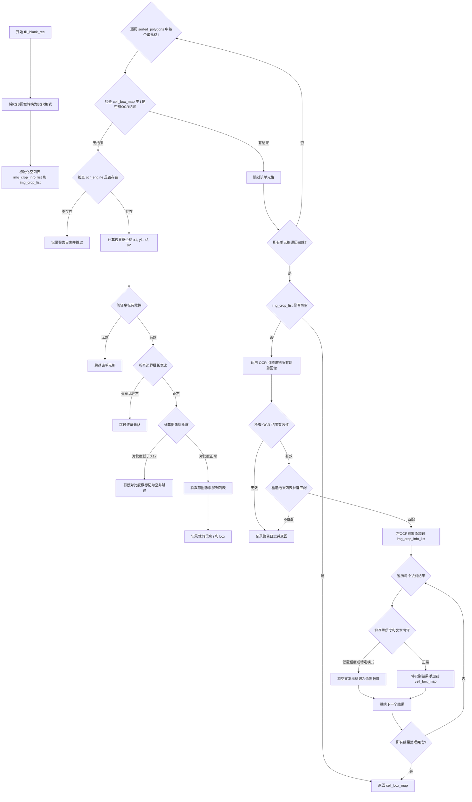
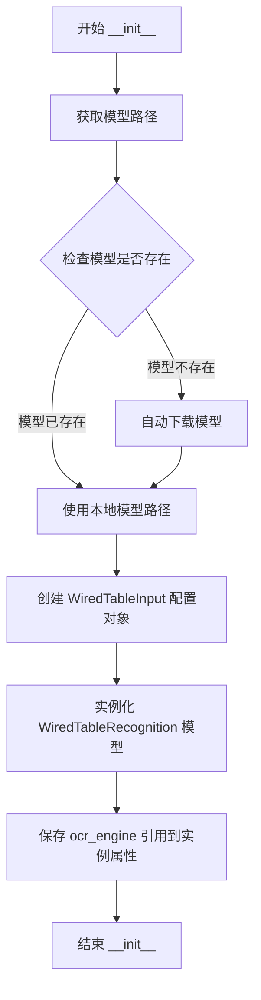
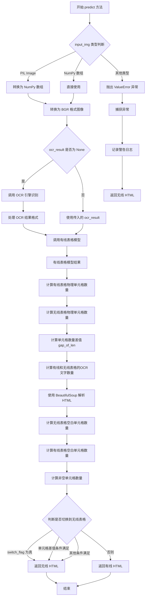

# `MinerU\mineru\model\table\rec\unet_table\main.py` 详细设计文档

该代码实现了一个表格识别系统，主要用于从图像中识别表格结构。系统通过UNet模型预测表格单元格的物理位置（Wired Table），结合OCR识别结果，生成HTML格式的表格。同时，系统还集成了无线表格（Wireless Table）识别结果的选择逻辑，通过比较两种模型的检测效果（单元格数量、文本数量、非空单元格数量等），自动选择最优的表格识别结果输出。

## 整体流程

```mermaid
graph TD
    A[开始] --> B[加载图像]
    B --> C{调用WiredTableRecognition]
    C --> D[使用TSRUnet模型预测表格多边形]
    D --> E{多边形是否存在?}
    E -- 否 --> F[返回空结果]
    E -- 是 --> G[调用TableRecover恢复表格结构]
    G --> H{是否需要OCR?]
    H -- 否 --> I[直接返回多边形和逻辑点]
    H -- 是 --> J[匹配OCR单元格结果]
    J --> K{是否有未匹配的框?}
    K -- 是 --> L[调用fill_blank_rec补充识别]
    K -- 否 --> M[转换结果为中间格式]
    L --> M
    M --> N[排序和合并OCR结果]
    N --> O[生成HTML表格]
    O --> P[返回WiredTableOutput]
    P --> Q[在UnetTableModel中比较Wired和Wireless表格]
    Q --> R{选择策略判断}
    R -- 使用Wired --> S[返回wired_html_code]
    R -- 使用Wireless --> T[返回wireless_html_code]
    S --> U[结束]
    T --> U
```

## 类结构

```
WiredTableInput (数据类-输入配置)
WiredTableOutput (数据类-输出结果)
WiredTableRecognition (核心识别类)
│   ├── __init__ (初始化)
│   ├── __call__ (主调用方法)
│   ├── transform_res (转换结果格式)
│   ├── sort_and_gather_ocr_res (排序合并OCR结果)
│   └── fill_blank_rec (补充空白区域OCR)
UnetTableModel (模型封装类)
│   ├── __init__ (初始化)
│   └── predict (预测并选择最优结果)
辅助函数 (模块级)
│   ├── escape_html (HTML转义)
│   └── count_table_cells_physical (计算物理单元格数)
```

## 全局变量及字段


### `escape_html`
    
转义HTML实体字符

类型：`function`
    


### `count_table_cells_physical`
    
计算表格的物理单元格数量（合并单元格算一个）

类型：`function`
    


### `WiredTableInput.model_path`
    
模型路径

类型：`str`
    


### `WiredTableInput.device`
    
设备类型，默认为'cpu'

类型：`str`
    


### `WiredTableOutput.pred_html`
    
预测的HTML表格代码

类型：`Optional[str]`
    


### `WiredTableOutput.cell_bboxes`
    
单元格边界框坐标

类型：`Optional[np.ndarray]`
    


### `WiredTableOutput.logic_points`
    
逻辑坐标点

类型：`Optional[np.ndarray]`
    


### `WiredTableOutput.elapse`
    
处理耗时

类型：`Optional[float]`
    


### `WiredTableRecognition.table_structure`
    
表格结构UNet模型

类型：`TSRUnet`
    


### `WiredTableRecognition.load_img`
    
图像加载工具

类型：`LoadImage`
    


### `WiredTableRecognition.table_recover`
    
表格恢复工具

类型：`TableRecover`
    


### `WiredTableRecognition.ocr_engine`
    
OCR引擎实例

类型：`Any`
    


### `UnetTableModel.wired_table_model`
    
有线表格模型

类型：`WiredTableRecognition`
    


### `UnetTableModel.ocr_engine`
    
OCR引擎实例

类型：`Any`
    
    

## 全局函数及方法


### `escape_html`

该函数是一个轻量级的文本处理工具，主要用于数据清洗和安全防护。在表格识别后处理流程中，OCR 引擎识别出的文本内容可能包含 HTML 元字符（如 `<`, `>`, `&` 等），直接拼接进 HTML 模板会导致渲染错误或 XSS 安全风险。此函数通过调用 Python 标准库 `html.escape` 将这些特殊字符转换为对应的 HTML 实体（如 `&lt;`, `&gt;`, `&amp;`），从而确保最终生成的 HTML 表格代码是安全且格式正确的。

参数：
- `input_string`：`str`，需要转义的原始字符串，通常来自 OCR 识别出的文本内容。

返回值：`str`，转义后的安全字符串，原字符串中的 HTML 特殊字符已被替换为实体。

#### 流程图



#### 带注释源码

```python
def escape_html(input_string):
    """Escape HTML Entities."""
    # 使用 Python 内置库 html 将字符串中的特殊字符转换为 HTML 实体
    # 例如: '<' -> '&lt;', '>' -> '&gt;'
    return html.escape(input_string)
```


### `count_table_cells_physical`

该函数用于计算HTML表格中的物理单元格数量，通过简单统计`<td>`和`<th>`标签的出现次数来得到结果（合并单元格被计算为一个单元格）。

参数：

-  `html_code`：`str`，输入的HTML代码字符串，表示表格的HTML结构

返回值：`int`，返回表格的物理单元格数量（`<td>`和`<th>`标签的总和）

#### 流程图



#### 带注释源码

```python
def count_table_cells_physical(html_code):
    """计算表格的物理单元格数量（合并单元格算一个）"""
    # 检查输入的HTML代码是否为空，如果是则直接返回0
    if not html_code:
        return 0

    # 将HTML代码转换为小写，以便统一统计标签（HTML标签不区分大小写）
    html_lower = html_code.lower()
    # 统计 <td> 标签（表格数据单元格）的数量
    td_count = html_lower.count('<td')
    # 统计 <th> 标签（表格表头单元格）的数量
    th_count = html_lower.count('<th')
    # 返回物理单元格总数（td和th标签数量之和，合并单元格按一个计算）
    return td_count + th_count
```


### `WiredTableRecognition.__init__`

这是 `WiredTableRecognition` 类的构造函数，用于初始化有线表格识别模型的各种组件。它接受配置对象和可选的OCR引擎，然后创建表格结构分割模型（TSRUnet）、图像加载器、表格恢复器等核心组件，并将它们绑定到实例属性上供后续推理使用。

参数：

-  `config`：`WiredTableInput`，配置数据类，包含模型路径和设备信息（cpu/cuda）
-  `ocr_engine`：可选参数，`Any`，OCR引擎实例，用于识别表格单元格内的文字，默认为 None

返回值：无返回值（`None`），该方法为构造函数，仅初始化实例属性

#### 流程图



#### 带注释源码

```python
def __init__(self, config: WiredTableInput, ocr_engine=None):
    """
    初始化 WiredTableRecognition 有线表格识别模型
    
    参数:
        config: WiredTableInput 配置对象，包含模型路径和设备信息
        ocr_engine: 可选的OCR引擎实例，用于识别表格单元格文字
    """
    # 使用配置字典初始化表格结构分割模型（UNet架构）
    self.table_structure = TSRUnet(asdict(config))
    
    # 初始化图像加载器，用于加载输入图像
    self.load_img = LoadImage()
    
    # 初始化表格恢复器，用于处理表格结构和逻辑坐标
    self.table_recover = TableRecover()
    
    # 保存OCR引擎引用，供后续fill_blank_rec等方法使用
    self.ocr_engine = ocr_engine
```


### `WiredTableRecognition.__call__`

该方法是 `WiredTableRecognition` 类的核心调用接口，负责接收图片输入，经过表格结构检测、OCR匹配、逻辑恢复等步骤，最终生成表格的 HTML 表示和坐标数据。

参数：

- `img`：`InputType`，待识别的图像输入（支持文件路径、PIL Image 或 numpy 数组）。
- `ocr_result`：`Optional[List[Union[List[List[float]], str, str]]]`，可选的 OCR 识别结果列表。如果为 `None`，则在内部进行 OCR（取决于 `need_ocr` 参数）。
- `**kwargs`：可变关键字参数。
    - `need_ocr`：`bool`，是否需要 OCR 识别文字，默认 `True`。
    - `col_threshold`：`int`，列分割的阈值，默认 `15`。
    - `row_threshold`：`int`，行分割的阈值，默认 `10`。

返回值：`WiredTableOutput`，包含以下字段的数据类：
- `pred_html`：生成的 HTML 表格字符串。
- `cell_bboxes`：物理单元格坐标数组。
- `logic_points`：逻辑单元格坐标数组。
- `elapse`：处理耗时。

#### 流程图

```mermaid
flowchart TD
    A([Start __call__]) --> B[记录时间 & 初始化参数]
    B --> C{解析 kwargs}
    C --> D[加载图像: self.load_img]
    D --> E[表格结构检测: self.table_structure]
    E --> F{polygons 是否为空?}
    F -->|是| G[返回空 WiredTableOutput]
    F -->|否| H[表格逻辑恢复: self.table_recover]
    H --> I[调整坐标: 逆时针转顺时针]
    I --> J{need_ocr 为真?}
    J -->|否| K[排序坐标]
    K --> L[返回结果 (无OCR)]
    J -->|是| M[OCR单元格匹配: match_ocr_cell]
    M --> N[填充空白识别: self.fill_blank_rec]
    N --> O[转换结果格式: self.transform_res]
    O --> P[OCR结果排序与合并: self.sort_and_gather_ocr_res]
    P --> Q[生成HTML: plot_html_table]
    Q --> R[整理数据与计算耗时]
    R --> L
    G --> Z([End])
    L --> Z
    
    %% 异常处理
    H -.-> E_ex{Exception}
    M -.-> E_ex
    N -.-> E_ex
    O -.-> E_ex
    P -.-> E_ex
    Q -.-> E_ex
    E_ex --> G
```

#### 带注释源码

```python
def __call__(
    self,
    img: InputType,
    ocr_result: Optional[List[Union[List[List[float]], str, str]]] = None,
    **kwargs,
) -> WiredTableOutput:
    s = time.perf_counter()  # 记录开始时间
    need_ocr = True
    col_threshold = 15
    row_threshold = 10
    # 解析可选参数：是否需要OCR、行列阈值
    if kwargs:
        need_ocr = kwargs.get("need_ocr", True)
        col_threshold = kwargs.get("col_threshold", 15)
        row_threshold = kwargs.get("row_threshold", 10)
    
    # 1. 加载图片
    img = self.load_img(img)
    
    # 2. 使用UNet模型检测表格结构，获取多边形和旋转后的多边形
    polygons, rotated_polygons = self.table_structure(img, **kwargs)
    
    # 如果未检测到表格结构，返回空结果
    if polygons is None:
        # logging.warning("polygons is None.")
        return WiredTableOutput("", None, None, 0.0)

    try:
        # 3. 表格恢复：计算逻辑坐标（行列分割）
        table_res, logi_points = self.table_recover(
            rotated_polygons, row_threshold, col_threshold
        )
        
        # 4. 坐标变换：将坐标由逆时针转为顺时针方向，后续处理与无线表格对齐
        polygons[:, 1, :], polygons[:, 3, :] = (
            polygons[:, 3, :].copy(),
            polygons[:, 1, :].copy(),
        )
        
        # 5. 如果不需要OCR（仅检测结构），直接返回坐标
        if not need_ocr:
            sorted_polygons, idx_list = sorted_ocr_boxes(
                [box_4_2_poly_to_box_4_1(box) for box in polygons]
            )
            return WiredTableOutput(
                "",
                sorted_polygons,
                logi_points[idx_list],
                time.perf_counter() - s,
            )
            
        # 6. 需要OCR时，匹配OCR结果与表格单元格
        cell_box_det_map, not_match_orc_boxes = match_ocr_cell(ocr_result, polygons)
        
        # 7. 填充空白：如果某些单元格没有OCR结果，尝试使用模型进行补充识别
        cell_box_det_map = self.fill_blank_rec(img, polygons, cell_box_det_map)
        
        # 8. 转换为中间格式：整合物理框、逻辑框和OCR结果
        t_rec_ocr_list = self.transform_res(cell_box_det_map, polygons, logi_points)
        
        # 9. 排序与合并：将每个单元格内的OCR结果排序并合并（处理换行）
        t_rec_ocr_list = self.sort_and_gather_ocr_res(t_rec_ocr_list)

        # 10. 提取逻辑点用于绘制HTML
        logi_points = [t_box_ocr["t_logic_box"] for t_box_ocr in t_rec_ocr_list]
        # 提取OCR结果用于绘制HTML
        cell_box_det_map = {
            i: [ocr_box_and_text[1] for ocr_box_and_text in t_box_ocr["t_ocr_res"]]
            for i, t_box_ocr in enumerate(t_rec_ocr_list)
        }
        
        # 11. 生成HTML表格代码
        pred_html = plot_html_table(logi_points, cell_box_det_map)
        
        # 12. 整理输出数据格式
        polygons = np.array(polygons).reshape(-1, 8)
        logi_points = np.array(logi_points)
        elapse = time.perf_counter() - s

    except Exception:
        # 异常处理：记录日志并返回空结果
        logging.warning(traceback.format_exc())
        return WiredTableOutput("", None, None, 0.0)
        
    # 13. 返回结果对象
    return WiredTableOutput(pred_html, polygons, logi_points, elapse)
```


### `WiredTableRecognition.transform_res`

该方法用于将表格单元格检测结果（cell_box_det_map）、表格多边形框（polygons）和逻辑坐标（logi_points）转换为统一的中间格式，整合物理识别框、逻辑识别框和OCR识别框，方便后续处理生成HTML表格。

参数：

- `self`：类的实例本身
- `cell_box_det_map`：`Dict[int, List[any]]`，键为多边形索引，值为该单元格对应的OCR识别结果列表，每个OCR结果包含检测框和文本
- `polygons`：`np.ndarray`，表格多边形框数组，形状为(n, 4, 2)，表示n个单元格的四个顶点坐标
- `logi_points`：`List[np.ndarray]`，每个单元格对应的逻辑坐标列表，用于表示单元格在表格中的行列位置

返回值：`List[Dict[str, any]]`，转换后的中间结果列表，每个元素包含三个键：

- `t_box`：物理边框坐标 [xmin, ymin, xmax, ymax]
- `t_logic_box`：逻辑边框坐标 [row_start, row_end, col_start, col_end]
- `t_ocr_res`：OCR识别结果列表，每个元素为 [[xmin,xmax,ymin,ymax], text]

#### 流程图



#### 带注释源码

```python
def transform_res(
    self,
    cell_box_det_map: Dict[int, List[any]],
    polygons: np.ndarray,
    logi_points: List[np.ndarray],
) -> List[Dict[str, any]]:
    """
    将单元格检测结果转换为中间格式
    
    参数:
        cell_box_det_map: 单元格与OCR结果的映射字典
        polygons: 表格多边形框数组
        logi_points: 逻辑坐标列表
    
    返回:
        转换后的中间结果列表
    """
    res = []
    # 遍历每个多边形（即每个单元格）
    for i in range(len(polygons)):
        # 获取该单元格对应的OCR识别结果列表
        ocr_res_list = cell_box_det_map.get(i)
        # 如果没有OCR结果，跳过该单元格
        if not ocr_res_list:
            continue
        
        # 计算该单元格所有OCR结果的边界框
        # ocr_box[0] 是检测框（4个顶点），ocr_box[0][0] 是第一个顶点
        xmin = min([ocr_box[0][0][0] for ocr_box in ocr_res_list])
        ymin = min([ocr_box[0][0][1] for ocr_box in ocr_res_list])
        xmax = max([ocr_box[0][2][0] for ocr_box in ocr_res_list])
        ymax = max([ocr_box[0][2][1] for ocr_box in ocr_res_list])
        
        # 构建结果字典
        dict_res = {
            # 物理边框坐标：xmin, xmax, ymin, ymax
            "t_box": [xmin, ymin, xmax, ymax],
            # 逻辑边框坐标：row_start, row_end, col_start, col_end
            "t_logic_box": logi_points[i].tolist(),
            # OCR识别结果：[[xmin,xmax,ymin,ymax], text] 格式
            "t_ocr_res": [
                [box_4_2_poly_to_box_4_1(ocr_det[0]), ocr_det[1]]
                for ocr_det in ocr_res_list
            ],
        }
        res.append(dict_res)
    return res
```


### `WiredTableRecognition.sort_and_gather_ocr_res`

该方法负责对表格识别结果中的 OCR（光学字符识别）数据进行后处理。它遍历每个单元格的结构化数据，先根据位置信息对 OCR 识别框进行排序，以修正可能的乱序，随后将同一行内的多个 OCR 识别结果合并，以确保输出的 HTML 表格能正确保留文本的换行格式。

参数：

- `res`：`List[Dict[str, Any]]`，包含转换后表格单元格 OCR 结果的列表。每个元素是一个字典，需包含键 `t_ocr_res`（OCR 识别结果列表）。

返回值：`List[Dict[str, Any]]`，处理并排序、合并后的 OCR 结果列表。

#### 流程图



#### 带注释源码

```python
def sort_and_gather_ocr_res(self, res):
    """
    对每个单元格中的OCR识别结果进行排序和按行合并。
    目的是为了保证输出的HTML表格中文字顺序正确，并且能正确处理跨列或换行的情况。

    参数:
        res (List[Dict[str, Any]]): 转换后的表格单元格OCR结果列表。
                                   列表中每个元素是一个dict，需包含 't_ocr_res' 键。
                                   't_ocr_res' 是一个列表，每个元素为 [bbox, text]。

    返回:
        List[Dict[str, Any]]: 处理并排序、合并后的OCR结果列表。
    """
    # 遍历表格中的每一个单元格结构数据
    for i, dict_res in enumerate(res):
        # 1. 排序步骤：
        # 提取当前单元格内所有OCR识别框的位置信息 [bbox, ...]
        ocr_boxes = [ocr_det[0] for ocr_det in dict_res["t_ocr_res"]]
        # 调用 sorted_ocr_boxes 对识别框进行位置排序（例如从左到右，从上到下）
        # 参数 threhold=0.3 用于判断两个框是否属于同一行或同一列的阈值
        _, sorted_idx = sorted_ocr_boxes(ocr_boxes, threhold=0.3)
        
        # 根据排序后的索引重新排列当前的 t_ocr_res 列表
        dict_res["t_ocr_res"] = [dict_res["t_ocr_res"][i] for i in sorted_idx]

        # 2. 合并步骤：
        # 将排序后的OCR识别结果按行合并。
        # 例如：同一个单元格内的两行文字可能被OCR识别为两个box，这里将它们合并。
        # 参数 threhold=0.3 用于判断两个识别框是否在逻辑上属于同一行文本
        dict_res["t_ocr_res"] = gather_ocr_list_by_row(
            dict_res["t_ocr_res"], threhold=0.3
        )
    # 返回处理完毕的完整结果列表
    return res
```


### `WiredTableRecognition.fill_blank_rec`

该方法用于处理表格识别中缺少OCR结果的单元格。它遍历所有表格单元格多边形，对那些没有对应OCR识别结果的单元格进行图像裁剪和OCR识别，补充缺失的文本内容，从而提高表格识别的完整性。

参数：

- `self`：`WiredTableRecognition` 类实例，当前对象引用
- `img`：`np.ndarray`，输入的RGB格式图像数组
- `sorted_polygons`：`np.ndarray`，排序后的表格单元格多边形坐标数组，形状为 (n, 4, 2)，包含n个单元格的四个顶点坐标
- `cell_box_map`：`Dict[int, List[str]]`，单元格框映射字典，键为单元格索引，值为该单元格已识别到的OCR结果列表

返回值：`Dict[int, List[Any]]`，更新后的单元格框映射字典，键为单元格索引，值为包含边界框、识别文本和置信度的列表

#### 流程图



#### 带注释源码

```python
def fill_blank_rec(
    self,
    img: np.ndarray,
    sorted_polygons: np.ndarray,
    cell_box_map: Dict[int, List[str]],
) -> Dict[int, List[Any]]:
    """找到poly对应为空的框，尝试将直接将poly框直接送到识别中"""
    
    # 将输入的RGB图像转换为OpenCV使用的BGR格式
    bgr_img = cv2.cvtColor(img, cv2.COLOR_RGB2BGR)
    
    # 初始化用于存储待识别图像信息的列表
    img_crop_info_list = []
    img_crop_list = []
    
    # 遍历所有表格单元格多边形
    for i in range(sorted_polygons.shape[0]):
        # 如果该单元格已经有OCR识别结果，则跳过
        if cell_box_map.get(i):
            continue
        
        # 获取当前单元格的多边形坐标
        box = sorted_polygons[i]
        
        # 检查OCR引擎是否已配置
        if self.ocr_engine is None:
            logger.warning(f"No OCR engine provided for box {i}: {box}")
            continue
        
        # 从原始图像中裁剪出对应区域，边界略微收缩以减少噪声
        # box[0] 和 box[2] 分别是多边形的左上角和右下角顶点
        x1, y1, x2, y2 = int(box[0][0])+1, int(box[0][1])+1, int(box[2][0])-1, int(box[2][1])-1
        
        # 验证裁剪坐标的有效性：确保坐标在合理范围内
        if x1 >= x2 or y1 >= y2 or x1 < 0 or y1 < 0:
            # logger.warning(f"Invalid box coordinates: {x1, y1, x2, y2}")
            continue
        
        # 检查边界框的长宽比，过滤掉过度细长的异常框
        # 长宽比超过20:1被认为是无效的表格单元格
        if (x2 - x1) / (y2 - y1) > 20 or (y2 - y1) / (x2 - x1) > 20:
            # logger.warning(f"Box {i} has invalid aspect ratio: {x1, y1, x2, y2}")
            continue
        
        # 从BGR图像中裁剪出单元格区域
        img_crop = bgr_img[int(y1):int(y2), int(x1):int(x2)]

        # 计算裁剪区域的对比度，对比度过低说明可能是空白或低质量区域
        # 低于0.17的对比度不进行OCR识别，直接标记为低置信度空内容
        if calculate_contrast(img_crop, img_mode='bgr') <= 0.17:
            cell_box_map[i] = [[box, "", 0.1]]
            # logger.debug(f"Box {i} skipped due to low contrast.")
            continue

        # 将有效的裁剪图像添加到待识别列表
        img_crop_list.append(img_crop)
        img_crop_info_list.append([i, box])

    # 如果有待识别的图像区域
    if len(img_crop_list) > 0:
        # 调用OCR引擎进行文字识别，det=False表示只进行识别不进行检测
        ocr_result = self.ocr_engine.ocr(img_crop_list, det=False)
        
        # 验证OCR返回结果的有效性
        if not ocr_result or not isinstance(ocr_result, list) or len(ocr_result) == 0:
            logger.warning("OCR engine returned no results or invalid result for image crops.")
            return cell_box_map
        
        # 提取识别结果列表
        ocr_res_list = ocr_result[0]
        
        # 验证识别结果数量与输入图像数量是否匹配
        if not isinstance(ocr_res_list, list) or len(ocr_res_list) != len(img_crop_list):
            logger.warning("OCR result list length does not match image crop list length.")
            return cell_box_map
        
        # 将OCR结果与对应的图像裁剪信息配对
        for j, ocr_res in enumerate(ocr_res_list):
            img_crop_info_list[j].append(ocr_res)

        # 遍历所有识别结果，处理并更新cell_box_map
        for i, box, ocr_res in img_crop_info_list:
            # 解包OCR结果：识别文本和置信度分数
            ocr_text, ocr_score = ocr_res
            
            # 过滤低置信度结果和常见的无意义识别模式
            # 如单独的数字、方框符号、编号等，这些通常不是实际内容
            if ocr_score < 0.6 or ocr_text in ['1','口','■','（204号', '（20', '（2', '（2号', '（20号', '号', '（204']:
                # logger.warning(f"Low confidence OCR result for box {i}: {ocr_text} with score {ocr_score}")
                box = sorted_polygons[i]
                # 将低质量识别结果标记为低置信度空内容
                cell_box_map[i] = [[box, "", 0.1]]
                continue
            
            # 将识别结果添加到单元格映射中
            # 格式：[[边界框, 识别文本, 置信度分数]]
            cell_box_map[i] = [[box, ocr_text, ocr_score]]

    # 返回更新后的单元格框映射字典
    return cell_box_map
```


### `UnetTableModel.__init__`

这是 `UnetTableModel` 类的构造函数，用于初始化有线表格识别模型。它接收一个 OCR 引擎作为参数，下载并加载 UNet 表格结构模型，然后创建 `WiredTableRecognition` 实例来执行实际的有线表格识别任务。

参数：

- `ocr_engine`：任意 OCR 引擎对象，用于对表格单元格内容进行文字识别

返回值：`None`（`__init__` 方法不返回任何内容）

#### 流程图



#### 带注释源码

```python
def __init__(self, ocr_engine):
    """
    初始化有线表格识别模型 (UNet-based Table Model)
    
    该构造函数完成以下任务：
    1. 自动下载并获取表格结构识别模型的路径
    2. 创建模型输入配置对象 WiredTableInput
    3. 实例化有线表格识别核心类 WiredTableRecognition
    4. 保存 OCR 引擎引用以便后续使用
    
    参数:
        ocr_engine: OCR 引擎实例，用于识别表格单元格中的文字内容
                   可以是任意支持 .ocr() 方法的 OCR 引擎对象
    
    返回:
        None: __init__ 方法不返回任何值，初始化结果存储在实例属性中
    """
    # 使用模型路径工具自动下载并获取模型的根目录路径
    # ModelPath.unet_structure 是枚举值，表示 UNet 表格结构模型的名称
    # auto_download_and_get_model_root_path 会检查本地是否存在，不存在则自动下载
    model_path = os.path.join(
        auto_download_and_get_model_root_path(ModelPath.unet_structure), 
        ModelPath.unet_structure
    )
    
    # 创建有线表格输入配置数据类
    # WiredTableInput 是@dataclass装饰的配置类，包含model_path和device等参数
    # 这里使用默认device="cpu"，如需GPU可修改为cuda
    wired_input_args = WiredTableInput(model_path=model_path)
    
    # 实例化有线表格识别核心类
    # WiredTableRecognition 是实际执行表格结构识别和恢复的类
    # 接收配置对象和OCR引擎作为初始化参数
    self.wired_table_model = WiredTableRecognition(wired_input_args, ocr_engine)
    
    # 将OCR引擎保存为实例属性，供后续predict方法使用
    # 这样可以在predict方法中复用同一个OCR引擎，避免重复初始化
    self.ocr_engine = ocr_engine
```


### `UnetTableModel.predict`

该方法是 `UnetTableModel` 类的核心预测方法，用于处理表格识别任务。它接收输入图像和可选的OCR结果，首先进行图像预处理，然后调用有线表格识别模型（`WiredTableRecognition`）获取识别结果。通过比较有线表格模型和无线表格模型的物理单元格数量、非空单元格数量和OCR文字填充数量，智能选择最佳的表格识别结果返回。

参数：

-  `input_img`：`Union[Image.Image, np.ndarray]`，输入图像，可以是PIL Image对象或NumPy数组
-  `ocr_result`：`Optional[List[Union[List[List[float]], str, str]]]`，可选的OCR识别结果列表，如果为None则自动使用OCR引擎进行识别
-  `wireless_html_code`：`str`，无线表格模型的HTML识别结果，用于与有线表格模型结果进行比较和选择

返回值：`str`，返回最终的HTML表格代码，选择有线表格模型或无线表格模型的结果

#### 流程图



#### 带注释源码

```python
def predict(self, input_img, ocr_result, wireless_html_code):
    """
    预测方法：处理表格识别任务，比较有线和无线表格模型的结果并选择最优解
    
    参数:
        input_img: 输入图像，PIL Image对象或NumPy数组
        ocr_result: 可选的OCR识别结果，如果为None则自动识别
        wireless_html_code: 无线表格模型的HTML结果
    
    返回:
        最终选择的HTML表格代码
    """
    # 判断输入图像类型，如果是PIL Image则转换为NumPy数组
    if isinstance(input_img, Image.Image):
        np_img = np.asarray(input_img)
    elif isinstance(input_img, np.ndarray):
        np_img = input_img
    else:
        # 输入类型不合法，抛出异常
        raise ValueError("Input must be a pillow object or a numpy array.")
    
    # 将RGB图像转换为BGR格式（OpenCV使用BGR格式）
    bgr_img = cv2.cvtColor(np_img, cv2.COLOR_RGB2BGR)

    # 如果没有提供OCR结果，则自动调用OCR引擎进行识别
    if ocr_result is None:
        # 调用OCR引擎识别图像
        ocr_result = self.ocr_engine.ocr(bgr_img)[0]
        # 处理OCR结果格式：提取边界框、文本（HTML转义）和置信度
        ocr_result = [
            [item[0], escape_html(item[1][0]), item[1][1]]
            for item in ocr_result
            if len(item) == 2 and isinstance(item[1], tuple)
        ]

    try:
        # 调用有线表格识别模型进行处理
        wired_table_results = self.wired_table_model(np_img, ocr_result)

        # 获取有线表格模型的HTML结果
        wired_html_code = wired_table_results.pred_html
        # 统计有线表格的物理单元格数量（合并单元格算一个）
        wired_len = count_table_cells_physical(wired_html_code)
        # 统计无线表格的物理单元格数量
        wireless_len = count_table_cells_physical(wireless_html_code)
        # 计算两种模型检测的单元格数量差异
        gap_of_len = wireless_len - wired_len

        # 使用OCR结果计算两种模型填入的文字数量
        wireless_text_count = 0
        wired_text_count = 0
        for ocr_res in ocr_result:
            # 统计OCR文字出现在无线表格HTML中的次数
            if ocr_res[1] in wireless_html_code:
                wireless_text_count += 1
            # 统计OCR文字出现在有线表格HTML中的次数
            if ocr_res[1] in wired_html_code:
                wired_text_count += 1

        # 使用HTML解析器计算空单元格数量
        # 解析无线表格HTML
        wireless_soup = BeautifulSoup(wireless_html_code, 'html.parser') if wireless_html_code else BeautifulSoup("", 'html.parser')
        # 解析有线表格HTML
        wired_soup = BeautifulSoup(wired_html_code, 'html.parser') if wired_html_code else BeautifulSoup("", 'html.parser')
        
        # 计算无线表格空白单元格数量（没有文本内容或只有空白字符）
        wireless_blank_count = sum(1 for cell in wireless_soup.find_all(['td', 'th']) if not cell.text.strip())
        # 计算有线表格空白单元格数量
        wired_blank_count = sum(1 for cell in wired_soup.find_all(['td', 'th']) if not cell.text.strip())

        # 计算非空单元格数量
        wireless_non_blank_count = wireless_len - wireless_blank_count
        wired_non_blank_count = wired_len - wired_blank_count

        # 判断是否切换到无线表格模型的标志
        switch_flag = False
        # 无线表非空格数量大于有线表非空格数量时，进行进一步判断
        if wireless_non_blank_count > wired_non_blank_count:
            # 假设非空表格接近正方表，使用非空单元格数量开平方作为表格规模的估计
            wired_table_scale = round(wired_non_blank_count ** 0.5)
            
            # 如果无线表非空格的数量比有线表多一列或以上，需要切换到无线表
            # 计算有线表加上两列后的规模
            wired_scale_plus_2_cols = wired_non_blank_count + (wired_table_scale * 2)
            # 计算有线表加上两行后的规模
            wired_scale_squared_plus_2_rows = wired_table_scale * (wired_table_scale + 2)
            
            # 判断条件：无线非空单元格数量加上3后大于等于有线表规模的较大值
            if (wireless_non_blank_count + 3) >= max(wired_scale_plus_2_cols, wired_scale_squared_plus_2_rows):
                switch_flag = True

        # 判断是否使用无线表格模型的结果
        if (
            switch_flag  # 切换标志为真
            or (0 <= gap_of_len <= 5 and wired_len <= round(wireless_len * 0.75))  # 两者相差不大但有线模型结果较少
            or (gap_of_len == 0 and wired_len <= 4)  # 单元格数量完全相等且总量小于等于4
            # 有线模型填入的文字明显少于无线模型（少于60%且无线文字数>=10）
            or (wired_text_count <= wireless_text_count * 0.6 and wireless_text_count >= 10)
        ):
            # 使用无线表格模型的结果
            html_code = wireless_html_code
        else:
            # 使用有线表格模型的结果
            html_code = wired_html_code

        return html_code
    except Exception as e:
        # 捕获异常并记录警告日志
        logger.warning(e)
        # 发生异常时返回无线表格模型的结果作为后备
        return wireless_html_code
```

## 关键组件


### TSRUnet（表格结构识别模型）

负责从输入图像中分割提取表格结构的多边形区域，返回表格的物理边框和旋转后的多边形坐标。

### TableRecover（表格结构恢复）

根据表格多边形坐标和行列阈值，恢复表格的逻辑结构，生成逻辑坐标点（行列信息）。

### LoadImage（图像加载）

统一处理不同格式的输入图像（PIL Image、numpy数组、文件路径），转换为统一的numpy数组格式。

### match_ocr_cell（OCR单元格匹配）

将OCR识别结果与表格单元格多边形进行匹配，建立单元格与文字内容的映射关系。

### plot_html_table（HTML表格生成）

根据逻辑坐标点和OCR识别结果，生成包含完整换行格式的HTML表格代码。

### fill_blank_rec（空白单元格识别与填充）

检测表格中未被OCR匹配的空白单元格，使用OCR引擎进行补充识别，并基于对比度过滤低质量识别区域。

### transform_res（结果格式转换）

将单元格检测映射和OCR结果转换为中间字典格式，整合物理框、逻辑框和OCR识别结果。

### sort_and_gather_ocr_res（OCR结果排序与同行合并）

对每个单元格内的OCR识别结果进行排序，并合并同一行的文字，保留原始换行格式。

### UnetTableModel（有线/无线表格模型选择）

比较有线表格模型和无线表格模型的识别结果，选择更优的表格结构输出，包含物理单元格计数、非空单元格评估和切换策略。

### count_table_cells_physical（物理单元格计数）

统计HTML表格代码中td和th标签数量，计算物理单元格数量（合并单元格计为一个）。

### escape_html（HTML转义）

对输入字符串进行HTML实体转义，防止XSS攻击和HTML语法错误。

### calculate_contrast（对比度计算）

计算图像区域的对比度，用于过滤低对比度的空白单元格区域，提高OCR识别质量。


## 问题及建议


### 已知问题

-   **硬编码阈值和魔数**：代码中散布着多个硬编码的阈值和魔数（如 `col_threshold=15`, `row_threshold=10`, `0.3`, `0.17`, `0.6`, `0.75`, `+3`, `*2` 等），这些参数分散在不同位置，难以统一管理和调整，降低了代码的可维护性。
-   **注释掉的死代码**：`fill_blank_rec` 方法中保留了一个被注释掉的旧实现版本，`predict` 方法中包含大段被注释掉的调试和可视化代码，这会增加代码理解和维护的负担。
-   **类型注解不精确**：`ocr_result` 参数的类型定义过于复杂且不明确（`Optional[List[Union[List[List[float]], str, str]]]`），同时代码中多处对其结构做了隐式假设（如 `item[0]`, `item[1][0]`, `item[1][1]`），缺乏严格验证；部分方法返回类型注解缺失或不完整（如 `sort_and_gather_ocr_res` 使用 `List[any]`）。
-   **异常处理过于宽泛**：`try-except` 块捕获所有异常仅记录警告后返回空结果，可能隐藏潜在bug，导致问题难以定位；部分错误处理不完整（如 OCR 结果为空时的处理逻辑分散且不一致）。
-   **代码重复**：`transform_res` 方法中多次重复计算坐标的 min/max，可提取为通用辅助函数；`count_table_cells_physical` 使用简单字符串计数方式，无法正确处理 HTML 嵌套和合并单元格等复杂情况。
-   **依赖管理问题**：对 `ocr_engine` 的依赖缺乏显式的 None 检查和明确文档说明；`calculate_contrast` 函数依赖外部模块但未在当前文件中导入其类型或进行类型提示。
-   **业务逻辑过于复杂**：`predict` 方法中的表格模型选择逻辑包含多个嵌套的条件判断，逻辑复杂且难以理解和测试；某些边界条件判断（如 `(0 <= gap_of_len <= 5 and wired_len <= round(wireless_len * 0.75))`）缺乏清晰的注释解释其设计意图。
-   **日志记录不一致**：代码混合使用 `logging.warning` 和 `loguru` 的 `logger`，日志框架不统一，且部分关键操作缺少日志记录。
-   **数据修改副作用**：`transform_res` 方法直接修改传入的 `cell_box_det_map` 字典内容，可能产生意外的副作用。
-   **边界处理不完善**：`fill_blank_rec` 中对坐标边界检查后直接 continue 跳过，可能导致部分单元格结果不完整；坐标计算中 `+1` 和 `-1` 的处理逻辑缺乏明确注释。

### 优化建议

-   **提取配置类**：创建一个专门的配置类或配置文件，将所有硬编码的阈值和魔数集中管理，便于调优和维护。
-   **清理死代码**：移除所有注释掉的代码段，或将其移至单独的调试/开发分支以保持主代码的整洁。
-   **强化类型注解**：完善 `ocr_result` 的类型定义，增加运行时验证逻辑确保数据结构符合预期；为所有方法补充完整的类型注解。
-   **改进异常处理**：区分不同类型的异常并分别处理，添加重试机制或更明确的错误传播；增加关键操作处的日志记录以便问题追踪。
-   **提取通用函数**：将重复的坐标计算逻辑抽取为独立的辅助函数；改进 `count_table_cells_physical` 使用 BeautifulSoup 解析以正确处理复杂 HTML 结构。
-   **明确依赖契约**：为 `ocr_engine` 等外部依赖定义清晰的接口规范，增加 None 情况的明确处理路径。
-   **简化业务逻辑**：将 `predict` 方法中的模型选择逻辑拆分为独立的策略类或函数，增加详细的注释解释各个条件分支的设计依据。
-   **统一日志框架**：统一使用 `loguru` 或 `logging`，并确保关键业务操作有适当的日志记录。
-   **采用不可变数据模式**：考虑使用数据类或返回新对象而非直接修改输入数据，提高代码的可预测性和可测试性。
-   **完善边界处理**：为所有坐标和阈值操作添加清晰的注释，验证边界条件的处理逻辑是否符合业务需求。

## 其它


### 设计目标与约束

**设计目标：**
实现一个高效、准确的有线表格识别系统，能够从图像中识别表格结构，生成HTML格式的表格，并能够智能选择有线表格模型和无线表格模型中更好的结果。

**主要约束：**
1. 输入图像需为PIL.Image或numpy.ndarray格式
2. OCR结果需符合特定格式（列表包含[box, text, score]）
3. 模型需要在CPU或GPU设备上运行
4. 必须支持可选的OCR识别（通过need_ocr参数控制）
5. 列阈值默认为15，行阈值默认为10

### 错误处理与异常设计

**异常捕获策略：**
1. 在`__call__`方法中，使用try-except捕获所有异常，返回空的WiredTableOutput对象
2. 在`fill_blank_rec`方法中，对无效的坐标边界进行校验
3. 在`predict`方法中，捕获异常并返回无线表格模型结果作为fallback

**边界条件处理：**
- polygons为None时返回空结果
- OCR引擎未提供时记录警告日志
- 图像裁剪区域无效时跳过处理
- OCR结果为空或格式不正确时返回原始cell_box_map

### 数据流与状态机

**主要数据流：**
1. 输入图像 → LoadImage加载 → TSRUnet模型推理 → 表格结构提取
2. 表格结构 + OCR结果 → TableRecover → 逻辑坐标恢复
3. 物理坐标 + 逻辑坐标 + OCR文本 → transform_res转换为中间格式
4. 中间格式 → sort_and_gather_ocr_res排序合并 → plot_html_table生成HTML

**状态转换：**
- 初始状态 → (need_ocr=True) → 执行完整流程
- 初始状态 → (need_ocr=False) → 仅返回排序后的polygons和logi_points

### 外部依赖与接口契约

**核心依赖：**
1. `TSRUnet`: 表格结构识别UNet模型
2. `TableRecover`: 表格逻辑恢复模块
3. `OCR引擎`: 文字识别引擎（需提供ocr方法）
4. `calculate_contrast`: 对比度计算工具函数

**接口契约：**
- OCR引擎需提供`ocr(images, det=False)`方法，返回格式为`[[(text, score), ...]]`
- LoadImage需支持PIL.Image、numpy.ndarray、文件路径三种输入
- 输入图像需为RGB格式

### 性能考虑

**性能优化点：**
1. 使用time.perf_counter()进行精确计时
2. 批量OCR识别：fill_blank_rec中批量处理多个图像裁剪区域
3. 条件跳过：对比度低于0.17的区域直接跳过OCR
4. 缓存机制：计算过的对比度结果可复用

**潜在瓶颈：**
- 大尺寸图像的表格结构识别
- 大量单元格的OCR识别
- HTML解析器对大规模表格的渲染

### 安全性考虑

**输入验证：**
1. 图像类型检查（PIL.Image或np.ndarray）
2. 坐标边界校验（x1<x2, y1<y2）
3. 长宽比校验（避免极端细长区域）

**HTML转义：**
- 使用escape_html函数对OCR识别的文本进行HTML实体转义
- 防止XSS攻击和HTML渲染错误

### 可扩展性与模块化设计

**模块划分：**
1. 数据输入层：WiredTableInput, LoadImage
2. 模型推理层：TSRUnet, WiredTableRecognition
3. 后处理层：TableRecover, transform_res, sort_and_gather_ocr_res
4. 输出生成层：plot_html_table, WiredTableOutput
5. 模型选择层：UnetTableModel

**扩展点：**
- 可通过替换TSRUnet实现更先进的表格结构识别模型
- 可通过配置不同的TableRecover实现不同的表格逻辑恢复算法
- 可添加新的表格类型支持（如斜线表头）

### 配置与参数说明

**WiredTableInput配置：**
| 参数 | 类型 | 默认值 | 说明 |
|------|------|--------|------|
| model_path | str | 必填 | 模型文件路径 |
| device | str | "cpu" | 运行设备 |

**WiredTableRecognition调用参数：**
| 参数 | 类型 | 默认值 | 说明 |
|------|------|--------|------|
| img | InputType | 必填 | 输入图像 |
| ocr_result | Optional[List] | None | OCR识别结果 |
| need_ocr | bool | True | 是否需要OCR |
| col_threshold | int | 15 | 列分隔阈值 |
| row_threshold | int | 10 | 行分隔阈值 |

**UnetTableModel.predict参数：**
| 参数 | 类型 | 说明 |
|------|------|------|
| input_img | PIL.Image/np.ndarray | 输入图像 |
| ocr_result | List | OCR结果 |
| wireless_html_code | str | 无线表格模型生成的HTML |

### 测试策略

**单元测试：**
1. 测试escape_html函数的HTML转义功能
2. 测试count_table_cells_physical的单元格计数功能
3. 测试transform_res的数据格式转换

**集成测试：**
1. 测试完整的有线表格识别流程
2. 测试有线/无线模型切换逻辑
3. 测试各种异常情况的fallback行为

**测试用例：**
- 正常表格图像识别
- 空表格识别
- 合并单元格表格识别
- OCR引擎不可用时的处理
- 图像坐标边界异常情况

### 部署注意事项

**环境依赖：**
- Python 3.7+
- PyTorch
- OpenCV (cv2)
- NumPy
- Pillow
- BeautifulSoup4
- loguru
- bs4

**模型文件：**
- 需要预先下载UNet表格结构识别模型
- 模型路径通过ModelPath枚举和auto_download_and_get_model_root_path自动管理

**资源要求：**
- 建议至少4GB RAM
- GPU加速可选（通过device参数指定）
- 存储空间取决于模型文件大小

### 使用示例

```python
# 初始化OCR引擎和模型
ocr_engine = YourOCREngine()
model = UnetTableModel(ocr_engine)

# 读取图像
from PIL import Image
img = Image.open("table_image.jpg")

# 执行预测
result_html = model.predict(img, None, wireless_html_code="")

# 打印结果
print(result_html)
```

### 附录：术语表

| 术语 | 说明 |
|------|------|
| Wired Table | 有线表格，指带有明确边框线的表格 |
| Wireless Table | 无线表格，指没有边框线的表格 |
| polygons | 表格单元格的顶点坐标 |
| logi_points | 表格单元格的逻辑坐标（行列信息） |
| OCR | 光学字符识别 |
| UNet | 深度学习分割网络结构 |
| HTML Table | 超文本标记语言表格 |

    