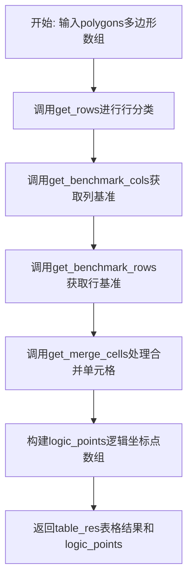
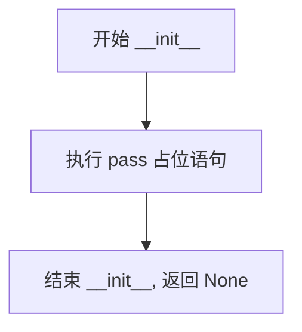
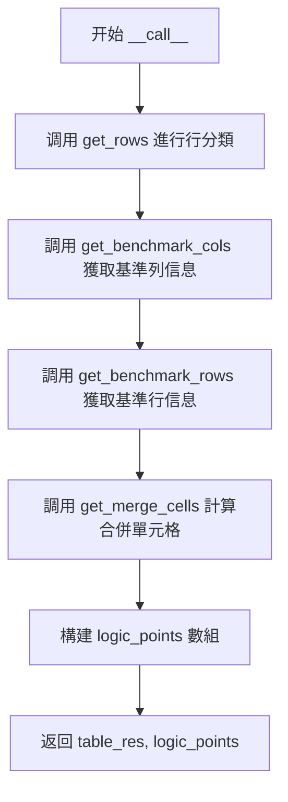
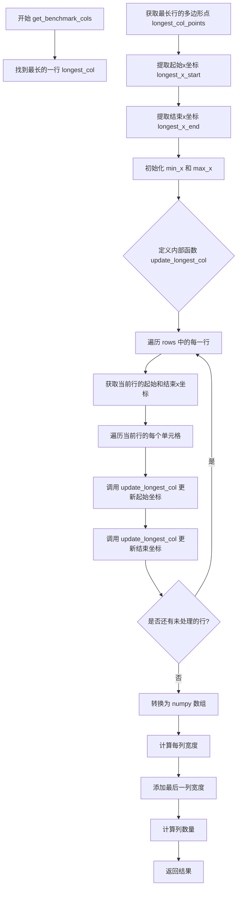
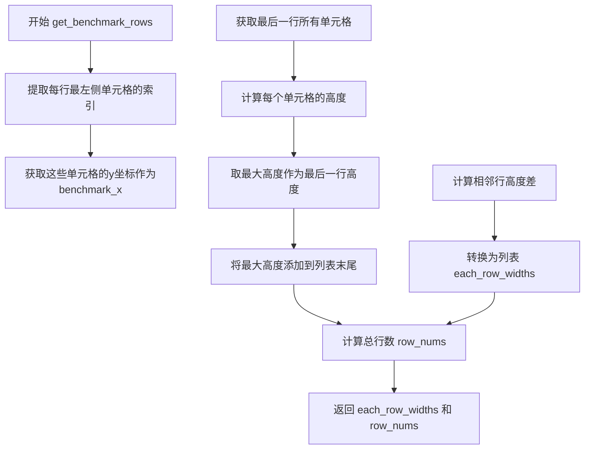
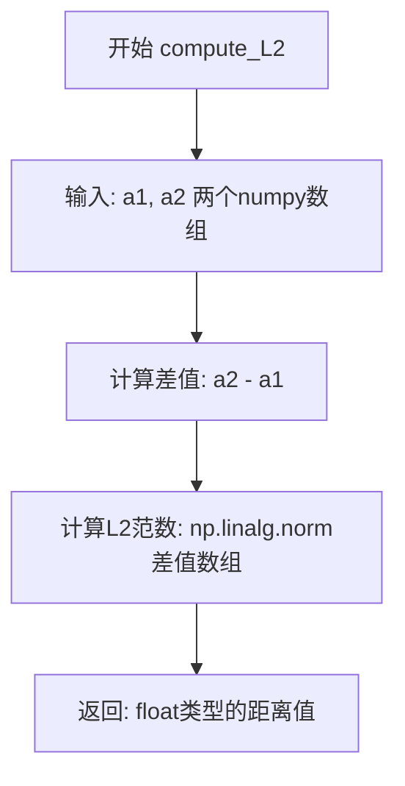
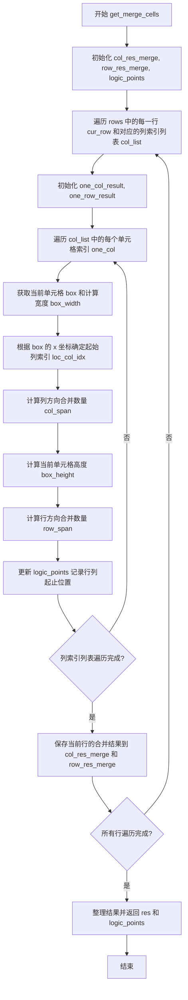

# `MinerU\mineru\model\table\rec\unet_table\table_recover.py` 详细设计文档

该代码实现了一个表格恢复算法，通过分析输入的多边形坐标（代表表格单元格），将离散的单元格多边形恢复成完整的表格结构。主要功能包括：识别表格行、确定列基准、计算行列宽高、处理合并单元格，并输出表格结构结果和逻辑坐标点。

## 整体流程



## 类结构

```
TableRecover (表格恢复主类)
├── __init__ (初始化方法)
├── __call__ (主入口方法)
├── get_rows (静态方法: 行分类)
├── get_benchmark_cols (获取列基准)
├── get_benchmark_rows (获取行基准)
├── compute_L2 (静态方法: L2距离计算)
└── get_merge_cells (获取合并单元格)
```

## 全局变量及字段


    

## 全局函数及方法


### `TableRecover.__init__`

构造函数，用于初始化 TableRecover 类的实例，目前为占位实现。

参数：

- `self`：`TableRecover` 实例本身，隐式传递

返回值：`None`，Python 构造函数默认返回 None

#### 流程图



#### 带注释源码

```python
def __init__(
    self,
):
    """
    TableRecover 类的构造函数
    
    说明：
    - 初始化 TableRecover 类的实例
    - 当前实现为占位符（pass），不执行任何实际初始化操作
    - 预留用于未来可能的属性初始化逻辑
    
    参数：
        无（除隐式传递的 self）
    
    返回值：
        无返回值（Python 构造函数隐式返回 None）
    """
    pass  # 占位语句，当前不执行任何操作，等待后续扩展
```


### `TableRecover.__call__`

该方法是 `TableRecover` 类的核心调用入口，接收多边形数组和行/列阈值参数，通过行分类、基准列/行计算、合并单元格检测等步骤，输出表格结构化结果和每个多边形对应的逻辑坐标点。

参数：

- `self`：`TableRecover`，`TableRecover` 类的实例对象
- `polygons`：`np.ndarray`，输入的多边形框数组，形状为 (N, 4, 2)，N 表示多边形数量，每个多边形由 4 个顶点组成
- `rows_thresh`：`int`，行分类阈值，用于判断相邻多边形是否属于同一行，默认为 10
- `col_thresh`：`int`，列分类阈值，用于判断相邻多边形是否属于同一列，默认为 15

返回值：`(Dict[int, Dict], np.ndarray)`，返回一个元组，包含：
- `table_res`：`Dict[int, Dict]`，表格结构化结果，键为行索引，值为该行中每个多边形对应的列跨度信息
- `logic_points`：`np.ndarray`，逻辑坐标点数组，形状为 (N, 4)，每行表示 [row_start, row_end, col_start, col_end]

#### 流程图



#### 带注释源码

```python
def __call__(
    self, polygons: np.ndarray, rows_thresh=10, col_thresh=15
) -> Dict[int, Dict]:
    """
    TableRecover 的主调用入口方法
    
    参数:
        polygons: 输入的多边形数组，形状为 (N, 4, 2)
        rows_thresh: 行分类阈值，用于判断相邻多边形是否属于同一行
        col_thresh: 列分类阈值，用于判断列边界时的容差范围
    
    返回:
        包含表格结构和逻辑坐标点的元组
    """
    # Step 1: 对多边形进行行分类，确定哪些多边形属于同一行
    rows = self.get_rows(polygons, rows_thresh)
    
    # Step 2: 获取基准列信息，包括最长列的 x 坐标、每列宽度、列数量
    longest_col, each_col_widths, col_nums = self.get_benchmark_cols(
        rows, polygons, col_thresh
    )
    
    # Step 3: 获取基准行信息，包括每行高度、行数量
    each_row_heights, row_nums = self.get_benchmark_rows(rows, polygons)
    
    # Step 4: 计算合并单元格信息，输出表格结构和逻辑点字典
    table_res, logic_points_dict = self.get_merge_cells(
        polygons,
        rows,
        row_nums,
        col_nums,
        longest_col,
        each_col_widths,
        each_row_heights,
    )
    
    # Step 5: 将逻辑点字典转换为 numpy 数组格式
    logic_points = np.array(
        [logic_points_dict[i] for i in range(len(polygons))]
    ).astype(np.int32)
    
    # Step 6: 返回表格结果和逻辑坐标点
    return table_res, logic_points
```


### `TableRecover.get_rows`

该方法用于对多边形（表格单元格）进行行分类，根据多边形在Y轴上的位置差异将它们分配到不同的行组中。当相邻多边形在Y轴上的差值超过指定阈值时，判定为不同的行。

参数：

- `polygons`：`np.array`，输入的多边形数组，形状为 (N, 4, 2)，其中N是多边形数量，每个多边形包含4个顶点
- `rows_thresh`：`int`，行分类的阈值，默认为10，用于判断相邻多边形是否属于同一行

返回值：`Dict[int, List[int]]`，返回字典，键为行号（从0开始），值为该行包含的多边形索引列表

#### 流程图

```mermaid
flowchart TD
    A[开始 get_rows] --> B[提取polygons的Y轴坐标]
    B --> C{多边形数量是否为1?}
    C -->|是| D[返回 {0: [0]}]
    C -->|否| E[计算相邻Y坐标的差值]
    E --> F[查找差值绝对值大于rows_thresh的索引]
    F --> G{找到的分裂索引数量为0?}
    G -->|是| H[所有多边形在同一行, 返回 {0: [0, 1, ..., n-1]}]
    G -->|否| I[处理分裂索引维度]
    I --> J{最大分裂索引是否等于差值数组长度?}
    J -->|否| K[在分裂索引末尾追加差值数组长度]
    J -->|是| L[跳过追加]
    K --> L
    L --> M[遍历分裂索引, 将多边形分配到对应行]
    M --> N[返回结果字典]
```

#### 带注释源码

```python
@staticmethod
def get_rows(polygons: np.array, rows_thresh=10) -> Dict[int, List[int]]:
    """对每个框进行行分类，框定哪个是一行的"""
    # 步骤1: 提取所有多边形第一个顶点的Y坐标（第一列的所有多边形的Y坐标）
    y_axis = polygons[:, 0, 1]
    
    # 步骤2: 如果只有一个多边形，直接返回第0行包含索引0
    if y_axis.size == 1:
        return {0: [0]}

    # 步骤3: 将Y坐标两两配对，计算相邻多边形在Y轴上的差值
    # 例如: y_axis = [10, 15, 30] -> concat_y = [[10, 15], [15, 30]]
    concat_y = np.array(list(zip(y_axis, y_axis[1:])))
    # minus_res = [5, 15] 表示第一对和第二对多边形Y轴差值
    minus_res = concat_y[:, 1] - concat_y[:, 0]

    # 步骤4: 初始化结果字典
    result = {}
    
    # 步骤5: 找出Y轴差值超过阈值的索引位置，这些位置将作为行的分隔点
    # np.argwhere返回满足条件的元素索引
    split_idxs = np.argwhere(abs(minus_res) > rows_thresh).squeeze()
    
    # 步骤6: 如果所有多边形都在同一行（没有找到分隔点）
    # 则将所有下标设置为同一行
    if split_idxs.size == 0:
        return {0: [i for i in range(len(y_axis))]}
    
    # 步骤7: 处理split_idxs可能是标量而非数组的情况
    if split_idxs.ndim == 0:
        split_idxs = split_idxs[None, ...]

    # 步骤8: 确保分裂索引包含最后一个多边形的位置
    # 如果最大分裂索引不等于差值数组长度，说明最后一行没有被正确分割
    if max(split_idxs) != len(minus_res):
        split_idxs = np.append(split_idxs, len(minus_res))

    # 步骤9: 根据分裂索引将多边形分配到不同的行
    start_idx = 0
    for row_num, idx in enumerate(split_idxs):
        if row_num != 0:
            # 从前一个分裂点+1开始
            start_idx = split_idxs[row_num - 1] + 1
        # 将从start_idx到idx的多边形索引添加到当前行
        result.setdefault(row_num, []).extend(range(start_idx, idx + 1))

    # 返回行分类结果，格式: {行号: [多边形索引列表], ...}
    # 注意: 代码中有一行注释提到计算相邻cell的iou，但实际实现中并未包含该逻辑
    return result
```


### `TableRecover.get_benchmark_cols`

该方法用于从多边形行信息中提取基准列信息，通过找出包含最多多边形的长列，计算并更新列的起始x坐标边界，最终返回所有列的起始x坐标数组、每列宽度列表以及列的数量。

参数：

- `self`：`TableRecover`，TableRecover类的实例
- `rows`：`Dict[int, List[int]]`，行的字典，键为行号，值为该行包含的多边形索引列表
- `polygons`：`np.ndarray`，多边形数组，形状为(n, 4, 2)，每行表示一个多边形的四个顶点坐标
- `col_thresh`：`int`（默认值为15），列阈值，用于判断列边界更新的容差范围

返回值：`Tuple[np.ndarray, List[float], int]`

- `np.ndarray`：最长列的起始x坐标数组
- `List[float]`：每个列的宽度列表
- `int`：列的数量

#### 流程图



#### 带注释源码

```python
def get_benchmark_cols(
    self, rows: Dict[int, List], polygons: np.ndarray, col_thresh=15
) -> Tuple[np.ndarray, List[float], int]:
    """获取基准列信息，包括列起始坐标、每列宽度和列数"""
    
    # 1. 找到包含最多多边形的长行（作为基准列）
    longest_col = max(rows.values(), key=lambda x: len(x))
    
    # 2. 获取该长行的所有多边形点
    longest_col_points = polygons[longest_col]
    
    # 3. 提取长行的所有起始x坐标（多边形左上角和左下角的x）
    longest_x_start = list(longest_col_points[:, 0, 0])
    
    # 4. 提取长行的所有结束x坐标（多边形右上角和右下角的x）
    longest_x_end = list(longest_col_points[:, 2, 0])
    
    # 5. 初始化小x（起始）和大x（结束）边界
    min_x = longest_x_start[0]  # 初始小x为第一个起始坐标
    max_x = longest_x_end[-1]   # 初始大x为最后一个结束坐标

    # 6. 定义内部函数：根据当前列的起始x坐标更新列边界
    # 根据当前col的起始x坐标，更新col的边界
    # 2025.2.22 --- 解决长列可能漏掉后一列的问题
    def update_longest_col(col_x_list, cur_v, min_x_, max_x_, insert_last):
        """更新列的x坐标列表
        
        Args:
            col_x_list: 当前列的x坐标列表
            cur_v: 当前的x坐标值
            min_x_: 当前的小边界
            max_x_: 当前的大边界
            insert_last: 是否允许在列表末尾插入
        """
        for i, v in enumerate(col_x_list):
            # 如果当前值在容差范围内，找到匹配位置
            if cur_v - col_thresh <= v <= cur_v + col_thresh:
                break
            # 如果当前值小于小边界，在开头插入
            if cur_v < min_x_:
                col_x_list.insert(0, cur_v)
                min_x_ = cur_v
                break
            # 如果当前值大于大边界，在末尾插入（如果允许）
            if cur_v > max_x_:
                if insert_last:
                    col_x_list.append(cur_v)
                max_x_ = cur_v
                break
            # 如果当前值在两个值之间，插入到中间
            if cur_v < v:
                col_x_list.insert(i, cur_v)
                break
        return min_x_, max_x_

    # 7. 遍历所有行，更新长列的x坐标边界
    for row_value in rows.values():
        # 获取当前行的起始x坐标列表
        cur_row_start = list(polygons[row_value][:, 0, 0])
        # 获取当前行的结束x坐标列表
        cur_row_end = list(polygons[row_value][:, 2, 0])
        
        # 遍历当前行的每个单元格（起始和结束坐标对）
        for idx, (cur_v_start, cur_v_end) in enumerate(
            zip(cur_row_start, cur_row_end)
        ):
            # 更新起始坐标边界（允许在末尾插入）
            min_x, max_x = update_longest_col(
                longest_x_start, cur_v_start, min_x, max_x, True
            )
            # 更新结束坐标边界（不允许在末尾插入）
            min_x, max_x = update_longest_col(
                longest_x_start, cur_v_end, min_x, max_x, False
            )

    # 8. 转换为numpy数组
    longest_x_start = np.array(longest_x_start)
    
    # 9. 计算每列的宽度（相邻列起始坐标的差值）
    each_col_widths = (longest_x_start[1:] - longest_x_start[:-1]).tolist()
    
    # 10. 添加后一列的宽度（后边界减去后一个起始坐标）
    each_col_widths.append(max_x - longest_x_start[-1])
    
    # 11. 计算列数量
    col_nums = longest_x_start.shape[0]
    
    # 12. 返回：起始x坐标数组、每列宽度列表、列数量
    return longest_x_start, each_col_widths, col_nums
```


### `TableRecover.get_benchmark_rows`

该方法用于计算表格中每一行的高度基准值，通过获取每行最左侧单元格的y坐标来确定行的基准位置，并计算相邻行之间的高度差，最后补充最后一行的高度信息。

参数：

- `self`：TableRecover 类实例本身
- `rows`：`Dict[int, List]`，行号到该行包含的多边形索引列表的映射
- `polygons`：`np.ndarray`，所有单元格多边形坐标数组，形状为 (n, 4, 2)，其中每个多边形由4个顶点组成

返回值：`Tuple[List[float], int]`，返回包含每行高度的列表和总行数

- `List[float]`：每行的高度列表
- `int`：总行数

#### 流程图



#### 带注释源码

```python
def get_benchmark_rows(
    self, rows: Dict[int, List], polygons: np.ndarray
) -> Tuple[np.ndarray, List[float], int]:
    """
    计算表格每行的高度基准值
    
    参数:
        rows: 行号到该行包含的多边形索引列表的映射
        polygons: 所有单元格多边形坐标数组
    
    返回:
        包含每行高度的列表和总行数的元组
    """
    # 提取每行最左侧单元格的索引
    # rows 是一个字典，值为该行包含的多边形索引列表
    # 取每个列表的第一个元素，即该行最左边的单元格
    leftmost_cell_idxs = [v[0] for v in rows.values()]
    
    # 获取这些最左侧单元格的y坐标（polygons[:, 0, 1] 表示多边形左上角的y坐标）
    # benchmark_x 用于表示每一行的基准y坐标
    benchmark_x = polygons[leftmost_cell_idxs][:, 0, 1]

    # 计算相邻行之间的高度差
    # benchmark_x[1:] - benchmark_x[:-1] 计算相邻元素的差值
    # 得到每行（除了最后一行）的高度
    each_row_widths = (benchmark_x[1:] - benchmark_x[:-1]).tolist()

    # 求出最后一行cell中，最大的高度作为最后一行的高度
    # 获取最后一行所有单元格的索引
    bottommost_idxs = list(rows.values())[-1]
    # 获取最后一行所有单元格的多边形坐标
    bottommost_boxes = polygons[bottommost_idxs]
    
    # fix self.compute_L2(v[3, :], v[0, :]), v为逆时针，即v[3]为右上，v[0]为左上,v[1]为左下
    # 使用L2范数计算每个单元格的高度（v[1]到v[0]的直线距离）
    # v[0]是左上角顶点，v[1]是左下角顶点，两点之间的连线就是单元格的高度
    max_height = max([self.compute_L2(v[1, :], v[0, :]) for v in bottommost_boxes])
    
    # 将最后一行的最大高度添加到高度列表中
    each_row_widths.append(max_height)

    # 计算总行数
    row_nums = benchmark_x.shape[0]
    
    # 返回每行高度列表和总行数
    return each_row_widths, row_nums
```


### `TableRecover.compute_L2`

该方法是一个静态工具函数，用于计算两点之间的欧几里得距离（L2范数）。在表格恢复算法中主要用于计算单元格框的宽度和高度，为后续的单元格合并判断提供距离度量依据。

参数：

- `a1`：`np.ndarray`，第一个点的坐标数组（如单元格的顶点坐标）
- `a2`：`np.ndarray`，第二个点的坐标数组（如单元格的另一个顶点坐标）

返回值：`float`，返回两点之间的欧几里得距离（L2范数值）

#### 流程图



#### 带注释源码

```python
@staticmethod
def compute_L2(a1: np.ndarray, a2: np.ndarray) -> float:
    """
    计算两点之间的欧几里得距离（L2范数）
    
    这是一个静态工具方法，用于计算两个坐标点之间的直线距离。
    在表格恢复场景中，主要用于：
    1. 计算单元格框的高度（box[1, :]到box[0, :]的垂直距离）
    2. 计算单元格框的宽度（box[3, :]到box[0, :]的水平距离）
    
    参数:
        a1: np.ndarray, 第一个点的坐标数组，形状为(n,)的numpy数组
        a2: np.ndarray, 第二个点的坐标数组，形状为(n,)的numpy数组，通常是2D坐标
    
    返回:
        float, 返回a1和a2两点之间的欧几里得距离（L2范数）
    """
    return np.linalg.norm(a2 - a1)
```


### `TableRecover.get_merge_cells`

该方法用于计算表格中单元格的合并信息。它遍历每一行和列，根据单元格的宽度和高度计算跨越的列数和行数，同时处理合并阈值以确定单元格是水平合并还是垂直合并，并生成逻辑坐标点来记录每个单元格所在的行列起止位置。

参数：

- `self`：`TableRecover`，TableRecover 类实例
- `polygons`：`np.ndarray`，所有单元格的边界框坐标，形状为 (N, 4, 2)，其中 N 是单元格数量，4 是四个顶点，2 是 x, y 坐标
- `rows`：`Dict`，行分类结果，键为行号，值为该行包含的单元格索引列表
- `row_nums`：`int`，表格的总行数
- `col_nums`：`int`，表格的总列数
- `longest_col`：`np.ndarray`，最长行中各列的起始 x 坐标数组
- `each_col_widths`：`List[float]`，每列的宽度列表
- `each_row_heights`：`List[float]`，每行的高度列表

返回值：`Tuple[Dict[int, Dict[int, int]], Dict[int, np.ndarray]]`，返回一个元组，包含合并单元格结果字典（键为行号，值为该行中每个单元格跨越的列数和行数）和逻辑坐标点字典（键为单元格索引，值为 [row_start, row_end, col_start, col_end]）

#### 流程图



#### 带注释源码

```python
def get_merge_cells(
    self,
    polygons: np.ndarray,
    rows: Dict,
    row_nums: int,
    col_nums: int,
    longest_col: np.ndarray,
    each_col_widths: List[float],
    each_row_heights: List[float],
) -> Dict[int, Dict[int, int]]:
    """
    计算表格单元格的合并信息

    Args:
        polygons: 所有单元格的边界框坐标
        rows: 行分类结果字典
        row_nums: 表格总行数
        col_nums: 表格总列数
        longest_col: 最长行中各列的起始x坐标
        each_col_widths: 每列的宽度列表
        each_row_heights: 每行的高度列表

    Returns:
        合并单元格结果和逻辑坐标点
    """
    # 存储列方向和行方向的合并结果
    col_res_merge, row_res_merge = {}, {}
    # 存储每个单元格的逻辑坐标点 [row_start, row_end, col_start, col_end]
    logic_points = {}
    # 合并阈值，用于判断是否应该合并单元格
    merge_thresh = 10
    
    # 遍历每一行
    for cur_row, col_list in rows.items():
        # 存储当前行的列合并和行合并结果
        one_col_result, one_row_result = {}, {}
        
        # 遍历当前行中的每个单元格
        for one_col in col_list:
            # 获取当前单元格的边界框
            box = polygons[one_col]
            # 计算单元格的宽度（左上到右上的距离）
            box_width = self.compute_L2(box[3, :], box[0, :])

            # 不一定是从0开始的，应该综合已有值和x坐标位置来确定起始位置
            # 根据单元格左上角x坐标确定其所属的列索引
            loc_col_idx = np.argmin(np.abs(longest_col - box[0, 0]))
            # 取当前列索引和已有合并结果的最大值，确保连续性
            col_start = max(sum(one_col_result.values()), loc_col_idx)

            # 计算该单元格在列方向上跨越了多少列
            for i in range(col_start, col_nums):
                # 累加从起始列到当前列的宽度总和
                col_cum_sum = sum(each_col_widths[col_start : i + 1])
                
                # 如果累加宽度大于单元格宽度，说明需要合并
                if i == col_start and col_cum_sum > box_width:
                    one_col_result[one_col] = 1
                    break
                # 如果累加宽度与单元格宽度接近（误差在阈值内），认为跨越到当前列
                elif abs(col_cum_sum - box_width) <= merge_thresh:
                    one_col_result[one_col] = i + 1 - col_start
                    break
                # 如果累加宽度超过单元格宽度，需要修正列索引
                elif col_cum_sum > box_width:
                    # 选择误差较小的列索引
                    idx = (
                        i
                        if abs(col_cum_sum - box_width)
                        < abs(col_cum_sum - each_col_widths[i] - box_width)
                        else i - 1
                    )
                    one_col_result[one_col] = idx + 1 - col_start
                    break
            else:
                # 如果循环正常结束（未break），说明该单元格延伸到最后一列
                one_col_result[one_col] = col_nums - col_start
            
            # 计算当前单元格所在列的结束位置
            col_end = one_col_result[one_col] + col_start - 1
            
            # 计算单元格的高度（左上到左下的距离）
            box_height = self.compute_L2(box[1, :], box[0, :])
            # 当前行起始索引
            row_start = cur_row
            
            # 计算该单元格在行方向上跨越了多少行
            for j in range(row_start, row_nums):
                # 累加从起始行到当前行的height总和
                row_cum_sum = sum(each_row_heights[row_start : j + 1])
                
                # box_height 不确定是几行的高度，所以要逐个试验，找一个最近的几行的高
                # 如果第一次row_cum_sum就比box_height大，那么意味着？丢失了一行
                if j == row_start and row_cum_sum > box_height:
                    one_row_result[one_col] = 1
                    break
                elif abs(box_height - row_cum_sum) <= merge_thresh:
                    one_row_result[one_col] = j + 1 - row_start
                    break
                # 这里必须进行修正，不然会出现超越阈值范围后行交错
                elif row_cum_sum > box_height:
                    idx = (
                        j
                        if abs(row_cum_sum - box_height)
                        < abs(row_cum_sum - each_row_heights[j] - box_height)
                        else j - 1
                    )
                    one_row_result[one_col] = idx + 1 - row_start
                    break
            else:
                # 如果循环正常结束（未break），说明该单元格延伸到最后一行
                one_row_result[one_col] = row_nums - row_start
            
            # 计算当前单元格所在行的结束位置
            row_end = one_row_result[one_col] + row_start - 1
            
            # 记录该单元格的逻辑坐标点 [行起始, 行结束, 列起始, 列结束]
            logic_points[one_col] = np.array(
                [row_start, row_end, col_start, col_end]
            )
        
        # 保存当前行的合并结果
        col_res_merge[cur_row] = one_col_result
        row_res_merge[cur_row] = one_row_result

    # 整理最终结果，合并列和行的合并信息
    res = {}
    for i, (c, r) in enumerate(zip(col_res_merge.values(), row_res_merge.values())):
        # 每个单元格结果为 [跨越的列数, 跨越的行数]
        res[i] = {k: [cc, r[k]] for k, cc in c.items()}
    
    return res, logic_points
```

## 关键组件


### 表格结构恢复 (TableRecover)

TableRecover类是整个模块的核心组件，负责将离散的检测框(polygons)恢复为结构化的表格信息。该类通过行分类、行列基准计算、单元格合并等步骤，最终输出表格结构(table_res)和逻辑点(logic_points)，用于表格重建任务。

### 行分类组件 (get_rows)

该组件负责将输入的多边形框按行进行分类。基于y轴坐标的差异判断相邻框是否属于同一行，使用rows_thresh阈值控制行的分割粒度。返回字典结构，键为行号，值为该行包含的多边形索引列表。同时还包含计算相邻cell的IOU进行合并的逻辑（代码中提及但未完全实现）。

### 列基准计算 (get_benchmark_cols)

该组件通过分析最长行来建立表格的列基准系统。核心功能包括：提取最长行的x坐标边界，根据每行的起始和结束x坐标动态更新列边界，处理最长列可能漏掉最后一列的问题。最终返回列的x坐标数组、每列宽度列表和总列数。

### 行基准计算 (get_benchmark_rows)

该组件负责计算表格的行高基准。通过最左侧单元格的y坐标确定行的基准位置，计算相邻行之间的间隔作为行宽，最后一行的高度取单元格中最大的高度。返回每行高度列表和总行数。

### L2距离计算 (compute_L2)

这是一个静态工具方法，用于计算两点之间的欧几里得距离。在表格恢复中用于计算单元格的实际宽度（box_width）和高度（box_height），为后续的单元格合并判断提供几何依据。

### 单元格合并逻辑 (get_merge_cells)

这是最核心的组件，负责确定每个单元格跨越的行列数量。通过比较单元格的实际宽度/高度与行列基准的累积宽度/高度，判断并计算单元格在行方向和列方向的合并数量。使用merge_thresh阈值（值为10）来判断是否应该合并，并包含复杂的修正逻辑防止列交错问题。返回合并结果字典和每个多边形对应的逻辑点坐标[row_start, row_end, col_start, col_end]。

### 动态列边界更新 (update_longest_col)

这是一个嵌套在get_benchmark_cols中的内部函数，负责在遍历每行时动态更新列的边界坐标。该函数处理三种边界情况：x坐标小于当前最小值、x坐标大于当前最大值、以及x坐标在两个边界值之间需要插入的情况。通过col_thresh阈值（默认15）来判断坐标是否属于同一列边界。

### 表格结果构建

该组件负责将列合并结果(col_res_merge)和行合并结果(row_res_merge)进行整合，构建最终的结构化输出。最终返回的table_res是一个嵌套字典，键为行索引，值为该行中每个单元格对应的列跨越数和行跨越数。


## 问题及建议


### 已知问题

-   **变量命名与实际含义不符**：`get_benchmark_rows`方法返回的`each_row_widths`实际存储的是行高度（height），而非宽度（width），容易造成误解
-   **方法命名不一致**：`compute_L2`在类中既是静态方法又被当作实例方法调用（`self.compute_L2`），逻辑不清晰
-   **硬编码阈值缺乏说明**：`rows_thresh=10`、`col_thresh=15`、`merge_thresh=10`等关键阈值以魔数形式存在，缺乏文档说明其含义和调整依据
-   **代码职责混乱**：`get_benchmark_cols`方法中嵌套定义了`update_longest_col`函数，导致方法过长（>80行），违反单一职责原则
-   **类型提示不完整**：构造函数`__init__`参数、默认值参数均缺少类型注解
-   **注释提到临时修复**：代码注释"2025.2.22 --- 解决最长列可能漏掉最后一列的问题"表明存在临时hack代码，缺乏系统性设计
-   **重复计算**：在`get_merge_cells`中多次使用`sum()`进行累积求和，可使用前缀和优化
-   **边界条件处理冗余**：`get_rows`方法中对`split_idxs`进行了多次维度判断和转换，逻辑繁琐且易出错

### 优化建议

-   重命名`each_row_widths`为`each_row_heights`，并补充类型注解
-   统一`compute_L2`为静态方法，调用时使用`TableRecover.compute_L2`或直接引用
-   将关键阈值（`rows_thresh`、`col_thresh`、`merge_thresh`）提取为类常量或构造函数参数，并添加文档说明
-   将`update_longest_col`提取为独立的私有方法，缩短`get_benchmark_cols`方法长度
-   完善类型提示，包括所有方法的参数类型和返回值类型
-   将临时hack代码重构为正式的业务逻辑，添加单元测试覆盖边界场景
-   使用`numpy.cumsum`预计算前缀和数组，避免在循环中重复调用`sum()`
-   简化`get_rows`中的维度处理逻辑，使用`np.atleast_1d`或`np.reshape(-1)`统一处理


## 其它


### 设计目标与约束

**设计目标：**
- 从OCR识别出的多边形坐标中恢复表格的行列结构
- 识别表格中的合并单元格及其跨行跨列数
- 生成表格逻辑坐标点（行起始、行结束、列起始、列结束）

**约束：**
- 输入polygons为numpy数组，形状为(n, 4, 2)，其中n为单元格数量，4为四个顶点，2为x,y坐标
- 行分类阈值rows_thresh默认10，列分类阈值col_thresh默认15
- 合并单元格判定阈值merge_thresh默认10
- 算法假设表格为规则网格结构，且多边形按从左到右、从上到下顺序排列

### 错误处理与异常设计

**异常处理：**
- 当polygons为空数组时，可能导致维度计算错误，代码中通过`y_axis.size == 1`的特殊处理避免空输入崩溃
- `split_idxs.ndim == 0`的处理用于处理numpy标量数组的情况，避免维度相关错误
- `np.argwhere`返回空数组时通过`split_idxs.size == 0`判断，避免索引越界

**边界条件：**
- 仅有单个多边形时，直接返回`{0: [0]}`
- 所有多边形在同一行时，返回单一行分类
- 最长列可能漏掉最后一列，通过`insert_last`参数在2025.2.22修复

### 数据流与状态机

**数据流：**
1. 输入polygons → get_rows() → 行分类结果rows字典
2. rows + polygons → get_benchmark_cols() → 最长列x坐标、每列宽度、列数
3. rows + polygons → get_benchmark_rows() → 每行高度、行数
4. 所有中间结果 → get_merge_cells() → 表格合并结果 + 逻辑坐标点

**状态转换：**
- 初始状态：接收多边形坐标
- 行分类状态：根据y轴坐标差值分割不同行
- 列基准计算状态：基于最长行更新列边界
- 行基准计算状态：基于最左单元格计算行高度
- 合并单元格检测状态：逐行逐列遍历，计算跨行跨列数
- 最终状态：输出表格结构和逻辑坐标点

### 外部依赖与接口契约

**外部依赖：**
- numpy：用于数组操作、数值计算（L2范数、坐标差值等）
- typing：类型注解支持

**接口契约：**
- `__call__`方法：主入口，接收polygons数组和两个阈值参数，返回元组(table_res, logic_points)
  - table_res: 字典结构，键为行号，值为该行中每个单元格对应的[跨列数, 跨行数]
  - logic_points: numpy数组，每行对应一个单元格的四元组[row_start, row_end, col_start, col_end]
- `get_rows`: 静态方法，返回Dict[int, List[int]]，键为行号，值为该行包含的多边形索引列表
- `get_benchmark_cols`: 返回最长列x坐标数组、每列宽度列表、列总数
- `get_benchmark_rows`: 返回每行高度列表、行总数
- `compute_L2`: 静态方法，计算两点间欧氏距离
- `get_merge_cells`: 返回合并单元格结果字典和逻辑坐标点字典

### 性能考量

**算法复杂度：**
- get_rows: O(n)线性扫描
- get_benchmark_cols: O(rows * cols)双重循环
- get_merge_cells: O(rows * cols)双重循环，总体时间复杂度O(n²)

**优化建议：**
- 多次使用`sum()`累计求和，可考虑使用前缀和数组优化
- 重复的`np.abs()`计算可缓存中间结果
- 长列表的`list.insert()`操作可改用numpy数组或预先分配空间

### 边界条件与算法局限性

**边界条件：**
- 单个多边形输入
- 所有多边形在同一行或同一列
- 多边形顶点顺序非标准逆时针排列
- 表格存在不规则单元格

**算法局限性：**
- 假设输入多边形已按阅读顺序排列
- 对倾斜表格识别效果较差
- 阈值（rows_thresh、col_thresh、merge_thresh）为经验值，不同表格可能需要调整
- 无法处理嵌套表格或复杂合并情况
- 依赖于最长列/行作为基准，可能因噪声导致基准列/行选择错误
</content]
    