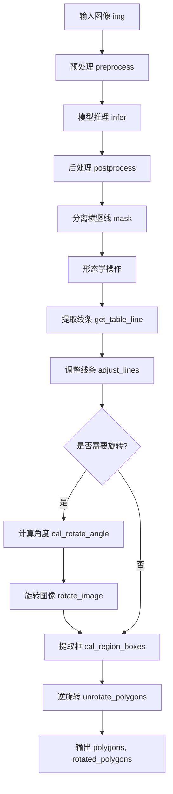
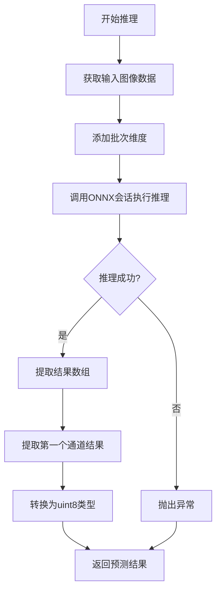
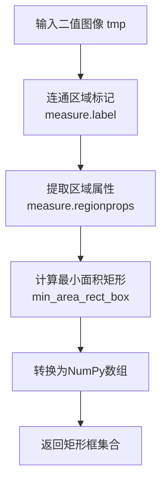

# `MinerU\mineru\model\table\rec\unet_table\table_structure_unet.py` 详细设计文档

该代码实现了一个名为 TSRUnet 的类，用于表格结构识别（TSR）。它通过加载 ONNX 模型对图像进行推理，分离图像中的横竖线并计算旋转角度，最终提取表格单元格的多边形坐标。

## 整体流程



## 类结构

```
TSRUnet (表格结构识别核心类)
```

## 全局变量及字段


### `TSRUnet.K`
    
内部缩放常数

类型：`int`
    


### `TSRUnet.MK`
    
内部缩放常数

类型：`int`
    


### `TSRUnet.mean`
    
图像归一化均值

类型：`np.ndarray`
    


### `TSRUnet.std`
    
图像归一化标准差

类型：`np.ndarray`
    


### `TSRUnet.inp_height`
    
输入高度

类型：`int`
    


### `TSRUnet.inp_width`
    
输入宽度

类型：`int`
    


### `TSRUnet.session`
    
ONNX 推理会话

类型：`OrtInferSession`
    
    

## 全局函数及方法


### `TSRUnet.__init__`

初始化 TSRUnet 模型的配置参数和 ONNX Runtime 推理会话。该方法设置图像预处理的归一化参数（均值和标准差）、输入图像的目标尺寸，以及通过 OrtInferSession 创建用于推理的 ONNX Runtime 会话。

参数：

- `config`：`Dict`，包含模型推理所需的配置信息，如模型路径、执行 providers 等参数

返回值：无（`None`），构造函数不返回值

#### 流程图

```mermaid
flowchart TD
    A[开始 __init__] --> B[设置类成员变量]
    B --> B1[设置 K = 1000]
    B --> B2[设置 MK = 4000]
    B --> B3[设置 mean = [123.675, 116.28, 103.53]]
    B --> B4[设置 std = [58.395, 57.12, 57.375]]
    B --> B5[设置 inp_height = 1024]
    B --> B6[设置 inp_width = 1024]
    B --> C[配置线程参数]
    C --> D{获取 intra_op_num_threads}
    C --> E{获取 inter_op_num_threads}
    D --> F[更新 config 字典]
    E --> F
    F --> G[创建 OrtInferSession 实例]
    G --> H[保存到 self.session]
    H --> I[结束 __init__]
```

#### 带注释源码

```python
def __init__(self, config: Dict):
    """
    初始化 TSRUnet 模型
    
    参数:
        config: 包含模型推理配置的字典，包括模型路径、执行设备等信息
    """
    # 设置阈值常数，用于后处理中的区域筛选
    self.K = 1000          # K 值，用于某种区域筛选阈值
    self.MK = 4000         # MK 值，用于某种区域筛选阈值
    
    # 图像预处理参数 - ImageNet 统计均值 (BGR 格式)
    # 这些值用于将输入图像归一化到模型所需的范围
    self.mean = np.array([123.675, 116.28, 103.53], dtype=np.float32)
    
    # 图像预处理参数 - ImageNet 统计标准差 (BGR 格式)
    # 用于归一化计算的逆标准差
    self.std = np.array([58.395, 57.12, 57.375], dtype=np.float32)
    
    # 模型输入图像的目标尺寸
    # 统一使用 1024x1024 的正方形输入
    self.inp_height = 1024  # 输入高度
    self.inp_width = 1024   # 输入宽度
    
    # 从环境变量获取推理线程数配置
    # 用于优化 ONNX Runtime 的推理性能
    # intra_op_num_threads: 运算符内部的并行线程数
    config["intra_op_num_threads"] = get_op_num_threads("MINERU_INTRA_OP_NUM_THREADS")
    # inter_op_num_threads: 运算符之间的并行线程数
    config["inter_op_num_threads"] = get_op_num_threads("MINERU_INTER_OP_NUM_THREADS")
    
    # 创建 ONNX Runtime 推理会话
    # 该会话将用于后续的模型推理
    self.session = OrtInferSession(config)
```

#### 成员变量详情

| 变量名 | 类型 | 描述 |
|--------|------|------|
| `self.K` | `int` | 区域筛选阈值常数，用于后处理中的区域面积判断 |
| `self.MK` | `int` | 区域筛选阈值常数，用于更精细的区域筛选 |
| `self.mean` | `np.ndarray` | 图像预处理均值 (BGR 格式)，用于图像归一化 |
| `self.std` | `np.ndarray` | 图像预处理标准差 (BGR 格式)，用于图像归一化 |
| `self.inp_height` | `int` | 模型输入图像的目标高度 |
| `self.inp_width` | `int` | 模型输入图像的目标宽度 |
| `self.session` | `OrtInferSession` | ONNX Runtime 推理会话对象，用于执行模型推理 |


### `TSRUnet.__call__`

入口函数，执行识别全流程，包括图像预处理、模型推理和后处理，输出表格区域的顶点坐标（polygons）和旋转后的坐标（rotated_polygons）。

参数：

- `img`：`np.ndarray`，输入图像数组
- `**kwargs`：`Dict`，可选参数，用于控制后处理行为（如 row、col、h_lines_threshold、v_lines_threshold、angle、enhance_box_line、morph_close、more_h_lines、more_v_lines、extend_line、rotated_fix 等）

返回值：`Tuple[Optional[np.ndarray], Optional[np.ndarray]]`，返回两个 numpy 数组——polygons 和 rotated_polygons，分别表示表格区域的顶点坐标；若未检测到表格区域则返回 (None, None)

#### 流程图

```mermaid
flowchart TD
    A([Start]) --> B[preprocess: 图像预处理]
    B --> C[infer: 模型推理]
    C --> D[postprocess: 后处理提取多边形]
    D --> E{polygons.size == 0?}
    E -->|Yes| F[return None, None]
    E -->|No| G[reshape polygons to (N,4,2)]
    G --> H[swap coordinates: polygons[:,3,:] <-> polygons[:,1,:]]
    H --> I[reshape rotated_polygons to (N,4,2)]
    I --> J[swap coordinates: rotated_polygons[:,3,:] <-> rotated_polygons[:,1,:]]
    J --> K[sorted_ocr_boxes: 排序OCR框]
    K --> L[idx: 获取排序索引]
    L --> M[polygons = polygons[idx]]
    M --> N[rotated_polygons = rotated_polygons[idx]]
    N --> O[return polygons, rotated_polygons]
    O --> P([End])
```

#### 带注释源码

```python
def __call__(
    self, img: np.ndarray, **kwargs
) -> Tuple[Optional[np.ndarray], Optional[np.ndarray]]:
    """
    入口函数，执行识别全流程
    
    参数:
        img: 输入图像数组
        **kwargs: 后处理可选参数
            - row: 横线宽度阈值，默认50
            - col: 竖线宽度阈值，默认30
            - h_lines_threshold: 横线调整阈值，默认100
            - v_lines_threshold: 竖线调整阈值，默认15
            - angle: 角度调整参数，默认50
            - enhance_box_line: 是否增强框线检测，默认True
            - morph_close: 是否进行形态学闭合运算，默认True
            - more_h_lines: 是否调整寻找更多横线，默认True
            - more_v_lines: 是否调整寻找更多竖线，默认True
            - extend_line: 是否延长线段使端点连接，默认True
            - rotated_fix: 是否进行旋转修正，默认True
    
    返回:
        Tuple[np.ndarray, np.ndarray]: (polygons, rotated_polygons)
            - polygons: 表格区域顶点坐标 (N, 4, 2)
            - rotated_polygons: 旋转后的表格区域坐标 (N, 4, 2)
            - 若未检测到表格区域返回 (None, None)
    """
    # Step 1: 图像预处理 - 缩放、归一化、通道转换
    img_info = self.preprocess(img)
    
    # Step 2: 模型推理 - ONNX Runtime 执行推理
    pred = self.infer(img_info)
    
    # Step 3: 后处理 - 从预测结果中提取表格多边形
    polygons, rotated_polygons = self.postprocess(img, pred, **kwargs)
    
    # Step 4: 若无检测结果则返回 None
    if polygons.size == 0:
        return None, None
    
    # Step 5: 调整多边形顶点顺序 - 转换为 (N, 4, 2) 格式
    polygons = polygons.reshape(polygons.shape[0], 4, 2)
    # 交换第1和第3个顶点的坐标（用于纠正顶点顺序）
    polygons[:, 3, :], polygons[:, 1, :] = (
        polygons[:, 1, :].copy(),
        polygons[:, 3, :].copy(),
    )
    
    # Step 6: 同样处理旋转后的多边形
    rotated_polygons = rotated_polygons.reshape(rotated_polygons.shape[0], 4, 2)
    rotated_polygons[:, 3, :], rotated_polygons[:, 1, :] = (
        rotated_polygons[:, 1, :].copy(),
        rotated_polygons[:, 3, :].copy(),
    )
    
    # Step 7: 对多边形进行排序 - 按从左到右、从上到下的顺序排列
    _, idx = sorted_ocr_boxes(
        [box_4_2_poly_to_box_4_1(poly_box) for poly_box in rotated_polygons],
        threhold=0.4,
    )
    
    # Step 8: 根据排序索引重新排列多边形
    polygons = polygons[idx]
    rotated_polygons = rotated_polygons[idx]
    
    # Step 9: 返回最终结果
    return polygons, rotated_polygons
```


### `TSRUnet.preprocess`

该方法负责将原始输入图像转换为模型推理所需的张量格式。主要步骤包括：图像缩放（保持宽高比）、数据类型转换（uint8转float32）、色彩空间转换（BGR转RGB）、标准化（减去均值并除以标准差）以及维度调整（NCHW）。

参数：
-  `img`：`np.ndarray`，输入的原始图像数据（BGR格式）。

返回值：`Dict[str, Any]`，返回包含预处理后图像张量的字典，键为"img"，值为 NCHW 格式的 float32 张量。

#### 流程图

```mermaid
graph TD
    A[开始: 输入 img] --> B[设置目标尺寸 scale: (1024, 1024)]
    B --> C[resize_img: 缩放图像并保持宽高比]
    C --> D[类型转换: img.astype np.float32]
    D --> E[计算归一化参数: mean, stdinv]
    E --> F[色彩空间转换: BGR to RGB]
    F --> G[逐像素操作: 减去均值 img - mean]
    G --> H[逐像素操作: 乘以标准差倒数 img * stdinv]
    H --> I[维度重排: HWC to CHW]
    I --> J[增加批次维度: [None, :]]
    J --> K[返回字典: {'img': images}]
```

#### 带注释源码

```python
def preprocess(self, img) -> Dict[str, Any]:
    # 1. 定义推理输入的目标分辨率
    scale = (self.inp_height, self.inp_width)  # 1024x1024

    # 2. 图像缩放：使用 resize_img 函数进行缩放，通常包含 Letterbox/Padding 以保持宽高比
    img, _, _ = resize_img(img, scale, True)

    # 3. 数据类型转换：确保输入为 float32，为归一化做准备
    img = img.copy().astype(np.float32)
    assert img.dtype != np.uint8

    # 4. 准备归一化常数：将类属性 mean 和 std 重塑为 (1, 3) 并转为 float64
    # 计算 std 的倒数以便后续使用乘法（更快）
    mean = np.float64(self.mean.reshape(1, -1))   # [123.675, 116.28, 103.53]
    stdinv = 1 / np.float64(self.std.reshape(1, -1)) # [1/58.395, ...]

    # 5. 图像归一化处理 (Inplace 操作以节省内存):
    #    a. BGR 转 RGB
    cv2.cvtColor(img, cv2.COLOR_BGR2RGB, img) 
    #    b. 减去均值
    cv2.subtract(img, mean, img) 
    #    c. 除以标准差 (即乘以 stdinv)
    cv2.multiply(img, stdinv, img) 

    # 6. 维度调整：将 Height x Width x Channel 转换为 Channel x Height x Width
    img = img.transpose(2, 0, 1)

    # 7. 增加批次维度：从 (C, H, W) 变为 (1, C, H, W)
    images = img[None, :]

    # 8. 返回模型所需格式
    return {"img": images}
```


### `TSRUnet.infer`

执行模型推理，将预处理后的图像数据输入ONNX Runtime推理会话，获取分割预测结果并转换为uint8格式返回。

参数：

- `input`：`Dict[str, Any]`，包含预处理后图像数据的字典，必须包含键"img"，值为预处理后的numpy数组

返回值：`np.ndarray`，uint8类型的二维分割预测结果矩阵

#### 流程图



#### 带注释源码

```python
def infer(self, input):
    """
    执行模型推理
    
    参数:
        input: 包含预处理图像的字典，必须包含'img'键
               图像应已进行归一化和通道转换处理
    
    返回:
        uint8类型的分割预测结果矩阵
    """
    # 调用ONNX Runtime推理会话进行预测
    # input["img"] shape: (C, H, W) - 通道、高度、宽度
    # [None, ...] 添加批次维度，变为 (1, C, H, W)
    # [0][0] 提取第一个批次的第一个输出通道
    result = self.session(input["img"][None, ...])[0][0]
    
    # 将结果转换为uint8类型
    # 原始输出可能是float32，转换为uint8便于后续处理
    result = result[0].astype(np.uint8)
    
    # 返回分割预测结果
    return result
```


### `TSRUnet.postprocess`

该方法执行表格检测的后处理操作，包括横竖线分离、形态学处理、线段调整、旋转角度计算与纠正、最终框提取，返回原始多边形和旋转纠正后的多边形。

参数：

- `self`：`TSRUnet`，类实例自身
- `img`：`np.ndarray`，输入的原始图像（用于获取原始形状）
- `pred`：`np.ndarray`，模型推理输出的预测结果（包含横线和竖线的掩码）
- `**kwargs`：可变关键字参数，包含以下可选参数：
  - `row`：`int`，横线检测的宽度阈值，默认 50
  - `col`：`int`，竖线检测的宽度阈值，默认 30
  - `h_lines_threshold`：`int`，横线调整的角度阈值，默认 100
  - `v_lines_threshold`：`int`，竖线调整的角度阈值，默认 15
  - `angle`：`int`，线段调整的角度参数，默认 50
  - `enhance_box_line`：`bool`，是否增强框线检测，默认 True
  - `morph_close`：`bool`，是否进行形态学闭合运算以找到更多小框，默认同 `enhance_box_line`
  - `more_h_lines`：`bool`，是否调整以找到更多横线，默认同 `enhance_box_line`
  - `more_v_lines`：`bool`，是否调整以找到更多竖线，默认同 `enhance_box_line`
  - `extend_line`：`bool`，是否进行线段延长使端点连接，默认同 `enhance_box_line`
  - `rotated_fix`：`bool`，是否进行旋转纠正，默认 True

返回值：`Tuple[np.ndarray, np.ndarray]`，返回两个 numpy 数组：
- 第一个是多边形框（原始图像坐标系）
- 第二个是旋转纠正后的多边形框

#### 流程图

```mermaid
flowchart TD
    A[开始 postprocess] --> B[解析 kwargs 参数]
    B --> C[复制预测结果为横线 hpred 和竖线 vpred]
    C --> D[分离横竖线: hpred[wherev]=0, vpred[whereh]=0]
    D --> E[将 hpred 和 vpredresize 到原始图像尺寸]
    E --> F[创建形态学核: hors_k 和 vert_k]
    F --> G[对 vpred 进行 MORPH_CLOSE 运算]
    G --> H{morph_close?}
    H -->|Yes| I[对 hpred 进行 MORPH_CLOSE 运算]
    H -->|No| J[跳过 hpred 形态学处理]
    I --> K[调用 get_table_line 提取竖线 colboxes]
    J --> K
    K --> L[调用 get_table_line 提取横线 rowboxes]
    L --> M{more_h_lines?}
    M -->|Yes| N[调用 adjust_lines 调整横线]
    M -->|No| O[跳过横线调整]
    N --> P{more_v_lines?}
    O --> P
    P -->|Yes| Q[调用 adjust_lines 调整竖线]
    P -->|No| R[跳过竖线调整]
    Q --> S[合并调整后的横竖线]
    R --> S
    S --> T{extend_line?}
    T -->|Yes| U[调用 final_adjust_lines 延长线段]
    T -->|No| V[跳过线段延长]
    U --> W[创建空白 line_img]
    V --> W
    W --> X[调用 draw_lines 绘制所有线段]
    X --> Y[调用 cal_rotate_angle 计算旋转角度]
    Y --> Z{rotated_fix 且 |rotated_angle| > 0.3?}
    Z -->|Yes| AA[调用 rotate_image 旋转图像]
    Z -->|No| AB[直接使用原 line_img]
    AA --> AC[调用 cal_region_boxes 提取旋转后图像的多边形]
    AB --> AC
    AC --> AD{rotated_fix 且 |rotated_angle| > 0.3?}
    AD -->|Yes| AE[调用 unrotate_polygons 反旋转多边形]
    AD -->|No| AF[多边形即为旋转后的多边形]
    AE --> AG[返回 polygons 和 rotated_polygons]
    AF --> AG
```

#### 带注释源码

```python
def postprocess(self, img, pred, **kwargs):
    """
    后处理：线条检测、旋转纠正、框提取
    Args:
        img: 原始输入图像
        pred: 模型预测结果，包含横线和竖线信息
        **kwargs: 可选参数
    """
    # ==================== 参数解析 ====================
    # 提取可选参数，设置默认值
    # 行（横线）检测宽度阈值
    row = kwargs.get("row", 50) if kwargs else 50
    # 列（竖线）检测宽度阈值
    col = kwargs.get("col", 30) if kwargs else 30
    # 横线调整的角度阈值
    h_lines_threshold = kwargs.get("h_lines_threshold", 100) if kwargs else 100
    # 竖线调整的角度阈值
    v_lines_threshold = kwargs.get("v_lines_threshold", 15) if kwargs else 15
    # 线段调整的角度参数
    angle = kwargs.get("angle", 50) if kwargs else 50
    # 是否增强框线检测
    enhance_box_line = kwargs.get("enhance_box_line", True) if kwargs else True
    # 是否进行闭合运算以找到更多小的框
    morph_close = (
        kwargs.get("morph_close", enhance_box_line) if kwargs else enhance_box_line
    )
    # 是否调整以找到更多的横线
    more_h_lines = (
        kwargs.get("more_h_lines", enhance_box_line) if kwargs else enhance_box_line
    )
    # 是否调整以找到更多的竖线
    more_v_lines = (
        kwargs.get("more_v_lines", enhance_box_line) if kwargs else enhance_box_line
    )
    # 是否进行线段延长使得端点连接
    extend_line = (
        kwargs.get("extend_line", enhance_box_line) if kwargs else enhance_box_line
    )
    # 是否进行旋转修正
    rotated_fix = kwargs.get("rotated_fix") if kwargs else True
    
    # ==================== 初始化 ====================
    # 获取原始图像形状
    ori_shape = img.shape
    # 将预测结果转换为 uint8 类型
    pred = np.uint8(pred)
    # 深拷贝预测结果，分别用于横线和竖线处理
    hpred = copy.deepcopy(pred)  # 横线
    vpred = copy.deepcopy(pred)  # 竖线
    
    # ==================== 横竖线分离 ====================
    # 找出值为1的位置（横线）和值为2的位置（竖线）
    whereh = np.where(hpred == 1)
    wherev = np.where(vpred == 2)
    # 分离横竖线：互相置零
    hpred[wherev] = 0
    vpred[whereh] = 0
    
    # ==================== 图像Resize ====================
    # 将预测结果 resize 到原始图像尺寸
    hpred = cv2.resize(hpred, (ori_shape[1], ori_shape[0]))
    vpred = cv2.resize(vpred, (ori_shape[1], ori_shape[0]))
    
    # ==================== 形态学处理 ====================
    # 获取图像尺寸
    h, w = pred.shape
    # 计算形态学核的大小：横线核高度，竖线核宽度
    hors_k = int(math.sqrt(w) * 1.2)  # 横线核高度
    vert_k = int(math.sqrt(h) * 1.2)  # 竖线核宽度
    # 创建矩形结构元素
    hkernel = cv2.getStructuringElement(cv2.MORPH_RECT, (hors_k, 1))
    vkernel = cv2.getStructuringElement(cv2.MORPH_RECT, (1, vert_k))
    # 对竖线进行闭运算（先膨胀后腐蚀）：连接断开的竖线
    vpred = cv2.morphologyEx(
        vpred, cv2.MORPH_CLOSE, vkernel, iterations=1
    )
    # 如果启用，则对横线也进行闭运算
    if morph_close:
        hpred = cv2.morphologyEx(hpred, cv2.MORPH_CLOSE, hkernel, iterations=1)
    
    # ==================== 提取横竖线框 ====================
    # 使用自定义函数提取竖线（axis=1 表示竖直方向）
    colboxes = get_table_line(vpred, axis=1, lineW=col)
    # 使用自定义函数提取横线（axis=0 表示水平方向）
    rowboxes = get_table_line(hpred, axis=0, lineW=row)
    
    # ==================== 线段调整 ====================
    rboxes_row_, rboxes_col_ = [], []
    # 如果启用，调整横线以找到更多
    if more_h_lines:
        rboxes_row_ = adjust_lines(rowboxes, alph=h_lines_threshold, angle=angle)
    # 如果启用，调整竖线以找到更多
    if more_v_lines:
        rboxes_col_ = adjust_lines(colboxes, alph=v_lines_threshold, angle=angle)
    # 合并原始框和调整后的框
    rowboxes += rboxes_row_
    colboxes += rboxes_col_
    
    # ==================== 线段延长 ====================
    # 如果启用，进行线段延长使端点连接
    if extend_line:
        rowboxes, colboxes = final_adjust_lines(rowboxes, colboxes)
    
    # ==================== 绘制线段图像 ====================
    # 创建空白图像用于绘制线段
    line_img = np.zeros(img.shape[:2], dtype="uint8")
    # 绘制所有横竖线段
    line_img = draw_lines(line_img, rowboxes + colboxes, color=255, lineW=2)
    
    # ==================== 旋转检测与纠正 ====================
    # 计算旋转角度
    rotated_angle = self.cal_rotate_angle(line_img)
    
    # 判断是否需要进行旋转纠正（角度绝对值大于0.3度）
    if rotated_fix and abs(rotated_angle) > 0.3:
        # 旋转线段图像
        rotated_line_img = self.rotate_image(line_img, rotated_angle)
        # 在旋转后的图像上提取多边形框
        rotated_polygons = self.cal_region_boxes(rotated_line_img)
        # 将多边形反旋转回原始坐标系
        polygons = self.unrotate_polygons(
            rotated_polygons, rotated_angle, line_img.shape
        )
    else:
        # 不需要旋转纠正，直接提取多边形框
        polygons = self.cal_region_boxes(line_img)
        # 旋转后的多边形等于原始多边形
        rotated_polygons = polygons.copy()
    
    # ==================== 返回结果 ====================
    return polygons, rotated_polygons
```


### `TSRUnet.cal_region_boxes`

该方法为表格结构识别（TSR）的核心后处理步骤，接收经过线段检测生成的二值化图像，通过连通区域分析提取表格单元格的几何位置，并计算最小外接矩形框，为后续的OCR坐标映射和表格恢复提供精确的几何数据。

参数：

- `self`：`TSRUnet`，TSRUnet 类的实例本身，隐式参数。
- `tmp`：`np.ndarray`，输入的二值图像。通常为经过形态学处理和线段提取后的线条图（`line_img`），其中线条部分像素值为255，背景为0（或反之，代码中通过 `tmp < 255` 筛选）。

返回值：`np.ndarray`，返回检测到的所有连通区域对应的矩形框坐标数组。数组形状为 (N, 8)，其中 N 为连通区域数量，8 为每个矩形的4个顶点坐标（扁平化存储）。

#### 流程图



#### 带注释源码

```python
def cal_region_boxes(self, tmp):
    """
    计算连通区域的最小面积矩形框

    参数:
        tmp: 输入的二值图像 (np.ndarray)

    返回值:
        包含矩形框坐标的 NumPy 数组
    """
    # 1. 连通区域标记
    # 使用 skimage.measure.label 对输入图像进行标记。
    # tmp < 255 表示将图像中所有非255（即可视作线条）的像素标记为连通区域。
    # connectivity=2 指定使用 8-连通性（允许对角线连接）。
    labels = measure.label(tmp < 255, connectivity=2)  # 8连通区域标记

    # 2. 获取区域属性
    # 根据标记后的 labels 计算每个连通区域的属性，如面积、外接矩形、中心等。
    regions = measure.regionprops(labels)

    # 3. 计算最小面积矩形
    # 调用工具函数 min_area_rect_box 计算每个区域的最小面积旋转矩形。
    # 参数依次为：区域属性、是否水平、图像宽、图像高、是否过滤小框、是否调整框。
    ceilboxes = min_area_rect_box(
        regions,
        False,
        tmp.shape[1],
        tmp.shape[0],
        filtersmall=True,
        adjust_box=False,
    )  # 最后一个参数改为False

    # 4. 返回结果
    # 将计算出的矩形列表转换为 NumPy 数组，方便后续的坐标变换和排序操作。
    return np.array(ceilboxes)
```


### `TSRUnet.cal_rotate_angle`

计算表格图像的旋转角度，用于修正表格方向的倾斜。

参数：

- `tmp`：`np.ndarray`，输入的二值图像（包含表格线条）

返回值：`float`，返回旋转角度（范围在 -45 到 45 度之间）

#### 流程图

```mermaid
flowchart TD
    A[开始: 输入二值图像tmp] --> B[cv2.findContours查找轮廓]
    B --> C{是否有轮廓?}
    C -->|无| D[返回角度0]
    C -->|有| E[找最大轮廓 max.contourArea]
    E --> F[cv2.minAreaRect计算最小外接矩形]
    F --> G[获取角度 angle = rect[2]]
    G --> H{angle < -45?}
    H -->|是| I[angle += 90]
    H -->|否| J{angle > 45?}
    J -->|是| K[angle -= 90]
    J -->|否| L[保持angle不变]
    I --> M[返回最终angle]
    K --> M
    L --> M
```

#### 带注释源码

```python
def cal_rotate_angle(self, tmp):
    # 使用OpenCV查找图像中的轮廓（外部轮廓）
    # cv2.RETR_EXTERNAL: 只检测外部轮廓
    # cv2.CHAIN_APPROX_SIMPLE: 压缩水平、垂直和对角线段，只保留端点
    contours, _ = cv2.findContours(tmp, cv2.RETR_EXTERNAL, cv2.CHAIN_APPROX_SIMPLE)
    
    # 如果没有检测到轮廓，返回0角度（无需旋转）
    if not contours:
        return 0
    
    # 找出面积最大的轮廓（最外侧的线条轮廓）
    largest_contour = max(contours, key=cv2.contourArea)
    
    # 计算最小外接旋转矩形
    # 返回值 rect 包含 (center (x,y), (width, height), angle)
    rect = cv2.minAreaRect(largest_contour)
    
    # 从最小外接矩形中获取角度
    # OpenCV中角度范围是 [-90, 0)
    angle = rect[2]
    
    # 调整角度到 [-45, 45] 范围内
    # 这是因为OpenCV的minAreaRect角度定义方式导致的
    if angle < -45:
        angle += 90
    elif angle > 45:
        angle -= 90
    
    # 返回计算得到的旋转角度
    return angle
```


### `TSRUnet.rotate_image`

该方法用于根据给定的旋转角度对图像进行旋转，采用 OpenCV 的仿射变换函数 `cv2.warpAffine` 实现，支持任意角度的旋转，并通过 `BORDER_REPLICATE` 模式处理边界。

参数：

- `image`：`np.ndarray`，输入的需要旋转的图像（通常为灰度图或二值图）
- `angle`：`float`，旋转角度（单位为度，正值表示逆时针旋转）

返回值：`np.ndarray`，返回旋转后的图像，尺寸与原图像相同

#### 流程图

```mermaid
flowchart TD
    A[开始 rotate_image] --> B[获取图像高度h和宽度w]
    B --> C[计算图像中心点 center = (w//2, h//2)]
    C --> D[调用cv2.getRotationMatrix2D计算旋转矩阵M]
    D --> E[调用cv2.warpAffine执行图像旋转]
    E --> F[返回旋转后的图像 rotated_image]
```

#### 带注释源码

```python
def rotate_image(self, image, angle):
    # 获取图像的中心点
    (h, w) = image.shape[:2]
    center = (w // 2, h // 2)

    # 计算旋转矩阵
    # 参数: 旋转中心, 旋转角度, 缩放因子(1.0表示不缩放)
    M = cv2.getRotationMatrix2D(center, angle, 1.0)

    # 进行旋转
    # flags=cv2.INTER_NEAREST 使用最近邻插值（适用于二值图像）
    # borderMode=cv2.BORDER_REPLICATE 边界像素复制扩展
    rotated_image = cv2.warpAffine(
        image, M, (w, h), flags=cv2.INTER_NEAREST, borderMode=cv2.BORDER_REPLICATE
    )

    return rotated_image
```


### `TSRUnet.unrotate_polygons`

该函数用于将旋转后的多边形坐标逆向旋转回原始位置，通过计算逆旋转矩阵并使用 OpenCV 的仿射变换将多边形顶点坐标映射回原始坐标系。

参数：

- `self`：`TSRUnet` 类实例，隐式参数
- `polygons`：`np.ndarray`，形状为 (N, 8) 的多边形坐标数组，N 表示多边形数量，8 表示 4 个顶点，每个顶点包含 x, y 坐标
- `angle`：`float`，旋转角度（度），需要逆旋转的角度值
- `img_shape`：`tuple`，图像形状，格式为 (height, width)

返回值：`np.ndarray`，逆旋转后的多边形坐标数组，形状为 (N, 8)

#### 流程图

```mermaid
flowchart TD
    A[开始] --> B[从 img_shape 提取高度 h 和宽度 w]
    B --> C[计算图像中心点 center = (w//2, h//2)]
    C --> D[使用 cv2.getRotationMatrix2D 计算逆旋转矩阵 M_inv<br/>参数: center, -angle, 1.0]
    D --> E[将 polygons 从 (N, 8) 重塑为 (N, 4, 2)]
    E --> F[使用 cv2.transform 批量逆旋转多边形顶点]
    F --> G[将结果从 (N, 4, 2) 重塑回 (N, 8)]
    G --> H[返回逆旋转后的多边形数组]
```

#### 带注释源码

```python
def unrotate_polygons(
    self, polygons: np.ndarray, angle: float, img_shape: tuple
) -> np.ndarray:
    # 将多边形旋转回原始位置
    
    # 从图像形状中提取高度和宽度
    (h, w) = img_shape
    
    # 计算图像中心点坐标，作为旋转中心
    center = (w // 2, h // 2)
    
    # 获取逆旋转矩阵
    # 参数: 旋转中心, 逆旋转角度(取负), 缩放因子
    # 逆旋转角度 = -angle, 即反向旋转以恢复到原始状态
    M_inv = cv2.getRotationMatrix2D(center, -angle, 1.0)

    # 将多边形数组从 (N, 8) 形状重塑为 (N, 4, 2)
    # 其中 N 是多边形数量, 4 是每个多边形的顶点数, 2 是每个顶点的坐标 (x, y)
    polygons_reshaped = polygons.reshape(-1, 4, 2)

    # 批量对所有多边形顶点进行逆旋转变换
    # cv2.transform: 对点集应用仿射变换
    unrotated_polygons = cv2.transform(polygons_reshaped, M_inv)

    # 将逆旋转后的多边形数组从 (N, 4, 2) 重塑回 (N, 8) 形状
    unrotated_polygons = unrotated_polygons.reshape(-1, 8)

    # 返回逆旋转后的多边形坐标数组
    return unrotated_polygons
```

## 关键组件


### TSRUnet类

表格结构识别（Table Structure Recognition）的UNet模型推理类，负责接收图像输入并输出表格单元格的多边形边界和旋转后的多边形边界。

### 预处理模块

负责对输入图像进行缩放、归一化和通道转换，将图像转换为模型所需的输入格式。

### 推理模块

负责加载ONNX模型并执行推理，返回预测的分割结果。

### 后处理模块

负责对模型预测结果进行形态学处理、线条提取、角度计算和旋转修正，最终输出表格单元格的多边形边界。

### 图像旋转模块

负责根据计算出的角度对图像进行旋转处理。

### 多边形逆旋转模块

负责将旋转后的多边形坐标逆旋转回原始图像坐标系。

### 区域框计算模块

负责使用连通域分析和最小面积矩形算法从二值图像中提取单元格区域。

### 角度计算模块

负责通过轮廓分析计算表格的旋转角度。

### 工具函数组

包括线条提取、线条调整、最小面积矩形框计算、线条绘制等辅助功能。


## 问题及建议


### 已知问题

-   类中硬编码了多个参数（如K、MK、mean、std、inp_height、inp_width），这些值应该从配置或构造函数参数中传入，以提高灵活性。
-   postprocess方法中使用了大量的魔法数字和阈值（如row=50、col=30、h_lines_threshold=100等），缺乏明确的配置管理，导致修改时容易出错。
-   代码中多处使用copy.deepcopy（如postprocess中的hpred和vpred），增加了不必要的内存开销，可以考虑使用浅拷贝或视图。
-   缺少异常处理机制，例如在模型推理失败、图像读取错误或外部函数调用异常时，代码可能直接崩溃或返回不可预期的结果。
-   部分变量命名不够直观，如hpred、vpred、rboxes_row_、rboxes_col_等，影响代码可读性和维护性。
-   preprocess方法中使用了img.copy()，但之后又进行了多次inplace操作，可能存在不必要的内存分配。
-   代码对外部函数（如OrtInferSession、resize_img、get_table_line等）有较强依赖，但这些函数的实现和接口文档不明确，增加了调试难度。

### 优化建议

-   将K、MK、mean、std等参数提取为构造函数参数或从配置文件加载，避免硬编码。
-   将阈值和配置参数封装为一个配置类（如TableRecognitionConfig），在构造函数中传入，提高可维护性。
-   使用浅拷贝（copy.copy()）或避免拷贝操作，例如直接操作原始数组的视图，减少内存开销。
-   添加异常处理机制，例如在推理失败时返回None或抛出自定义异常，并记录日志。
-   改进变量命名，使其更具描述性，例如将hpred改为horizontal_pred，将vpred改为vertical_pred。
-   优化preprocess流程，减少不必要的拷贝操作，例如直接使用cv2.subtract和cv2.multiply的返回值。
-   为外部函数提供明确的接口文档和类型注解，确保调用时的参数正确性。
-   考虑将后处理逻辑拆分为更小的函数，提高代码模块化程度，便于测试和重用。
-   添加性能监控，例如使用装饰器或日志记录推理时间，以识别瓶颈。


## 其它


### 设计目标与约束

本模块旨在实现表格结构识别（Table Structure Recognition，TSR）功能，通过深度学习方法识别图像中的表格区域，并提取表格单元格的几何位置。核心目标是将表格图像转换为结构化的多边形坐标表示，支持表格的行列结构分析。主要约束包括：输入图像需为BGR格式的numpy数组；模型推理在ONNX Runtime上执行以确保跨平台兼容性；处理流程需在1024x1024的统一分辨率下进行；输出为旋转校正后的单元格四边形坐标。

### 错误处理与异常设计

1. 输入图像验证：预处理阶段通过`assert img.dtype != np.uint8`检查图像数据类型，但缺乏对图像尺寸、通道数的显式校验
2. 推理失败处理：`infer`方法依赖ONNX会话执行，若模型加载失败或推理异常，需确保调用方能捕获相应异常
3. 空结果处理：当`polygons.size == 0`时返回`(None, None)`，表示未检测到表格结构
4. 轮廓检测异常：`cal_rotate_angle`方法在未找到轮廓时返回0角度，避免除零错误
5. 潜在改进：建议增加图像格式校验、添加日志记录、定义自定义异常类以提高错误可追溯性

### 数据流与状态机

数据流遵循以下路径：输入图像 → preprocess(图像缩放、归一化) → infer(模型推理) → postprocess(后处理) → 输出多边形坐标

状态机包含以下状态：
- IDLE：初始状态，等待图像输入
- PREPROCESSING：执行图像预处理（resize、归一化）
- INFERENCING：执行ONNX模型推理
- POSTPROCESSING：执行表格线条检测、角度计算、区域框计算
- ROTATION_CORRECTION：根据角度偏差决定是否进行旋转校正
- OUTPUT：输出最终的多边形结果

### 外部依赖与接口契约

1. 依赖模块：
   - `mineru.utils.os_env_config`：获取线程配置参数
   - `mineru.decode_tools.utils`：OrtInferSession类用于ONNX推理
   - `skimage.measure`：连通区域标记和属性计算
   - `cv2`：图像处理核心库
   - `numpy`：数值计算

2. 公共接口：
   - `TSRUnet.__call__(img, **kwargs)`：主入口方法，接受图像和可选参数，返回(多边形坐标, 旋转多边形坐标)的元组
   - 参数说明：row/col（线条宽度阈值）、h_lines_threshold/v_lines_threshold（线条调整阈值）、angle（角度阈值）、enhance_box_line/morph_close/more_h_lines/more_v_lines/extend_line（处理增强开关）、rotated_fix（旋转修正开关）

### 性能优化与资源管理

1. 线程配置：支持通过环境变量`MINERU_INTRA_OP_NUM_THREADS`和`MINERU_INTER_OP_NUM_THREADS`配置ONNX Runtime线程数
2. 内存优化：使用`copy.deepcopy`创建预测掩码副本，避免直接修改原数组
3. 图像处理：预处理使用inplace操作（`cv2.cvtColor`、`cv2.subtract`、`cv2.multiply`）减少内存分配
4. 向量化操作：后处理大量使用numpy向量运算，如`np.where`条件筛选、`np.array`批量处理

### 配置参数说明

| 参数名 | 默认值 | 说明 |
|--------|--------|------|
| inp_height/inp_width | 1024 | 输入模型的标准尺寸 |
| K | 1000 | 水平线条核尺寸因子 |
| MK | 4000 | 垂直线条核尺寸因子 |
| mean/std | ImageNet均值方差 | 图像归一化参数 |
| row | 50 | 竖线检测宽度阈值 |
| col | 30 | 横线检测宽度阈值 |
| h_lines_threshold | 100 | 水平线条调整阈值 |
| v_lines_threshold | 15 | 垂直线条调整阈值 |
| angle | 50 | 线条调整角度阈值 |
| rotated_fix | True | 是否进行旋转修正 |

### 边界条件与特殊场景处理

1. 无表格场景：当模型未检测到任何表格结构时，返回(None, None)
2. 极小表格：min_area_rect_box中的filtersmall参数用于过滤过小的区域
3. 旋转角度过小：当|rotated_angle| ≤ 0.3度时跳过旋转校正步骤
4. 非标准表格：支持斜线、跨单元格等复杂表格结构的识别
5. 图像尺寸变化：预测结果会被resize回原始图像尺寸

### 版本演进与兼容性说明

当前版本实现基于ONNX Runtime推理框架，支持Python 3.x环境。配置参数通过kwargs传递，保证向后兼容性。未来可能的方向包括：支持更多表格检测算法、引入端到端的表格识别模型、优化旋转校正的精度、添加表格类型分类功能。


    